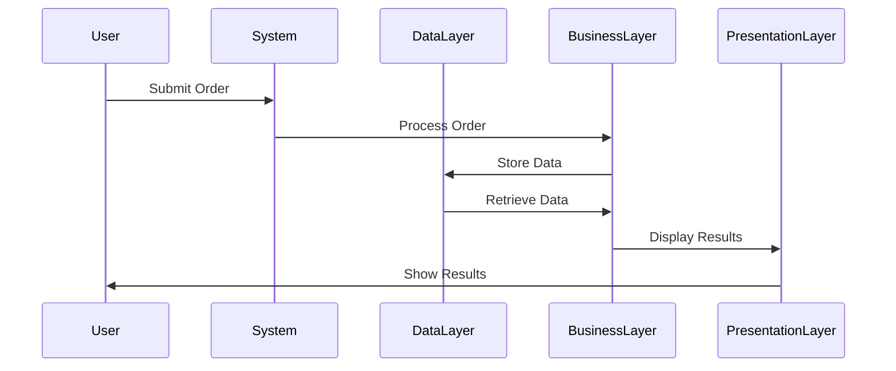
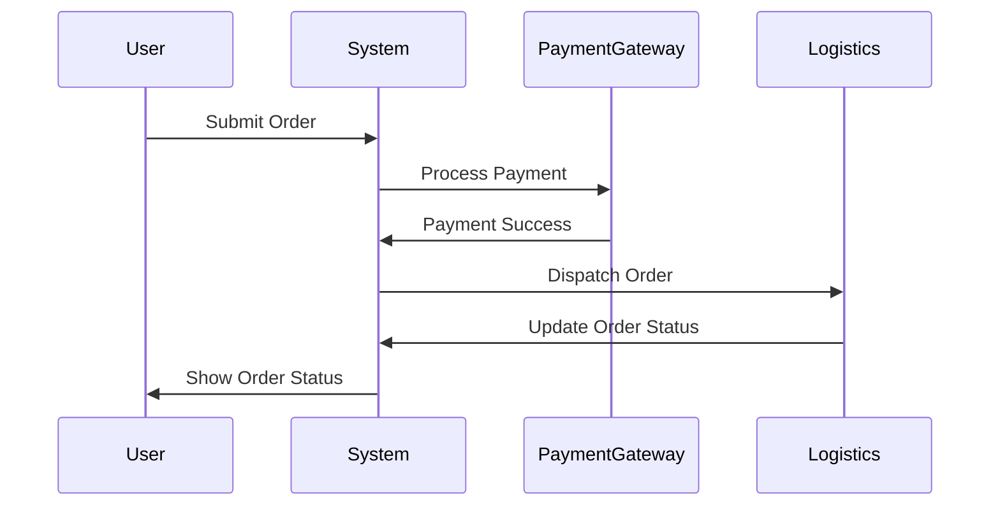
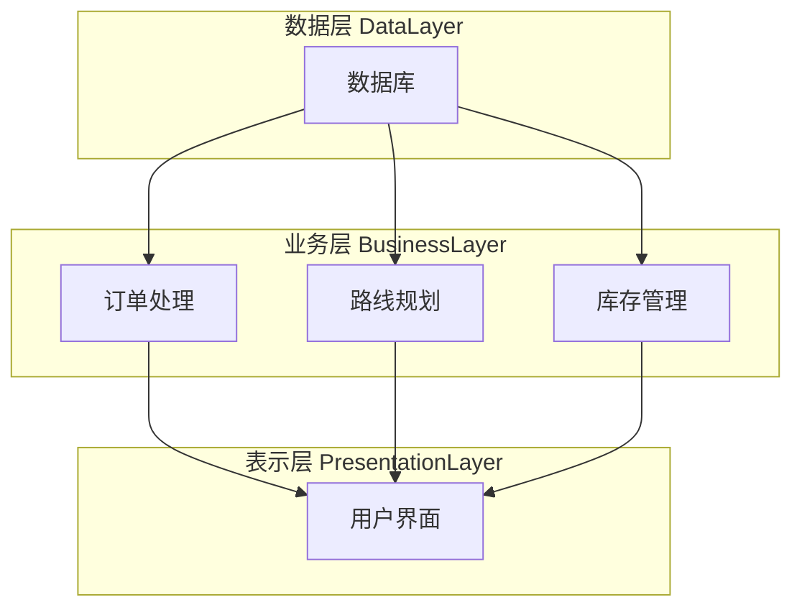

                 

### 文章标题

在当今快速发展的物流行业中，智能物流系统正逐渐成为企业提升效率、降低成本、优化客户体验的重要手段。其中，**提示词工程（Keyword Engineering）**作为一种新兴的技术手段，正被广泛应用在智能物流系统的设计、开发和运维中。本文将围绕这一主题，深入探讨提示词工程在智能物流系统中的应用，通过逻辑清晰、结构紧凑的论述，帮助读者理解这一技术的核心原理和应用场景。

### 关键词

- **智能物流系统**
- **提示词工程**
- **算法原理**
- **系统架构设计**
- **项目实战**

### 摘要

本文首先介绍了智能物流系统的现状和问题，以及提示词工程在其中的作用。接着，我们详细分析了提示词工程的核心概念及其与智能物流系统的联系。随后，文章通过具体的算法原理讲解，帮助读者理解提示词工程在智能物流系统中的应用。在此基础上，文章进一步阐述了系统分析与架构设计方案，并通过实际项目案例进行了详细的剖析。最后，文章总结了最佳实践、注意事项和拓展阅读，为读者提供了深入研究和实践的方向。

### 第一部分：背景介绍

#### 第1章：问题背景与问题描述

##### 1.1.1 智能物流系统的现状

智能物流系统是一种利用信息技术和自动化设备来优化物流流程、提高运输效率和降低成本的系统。随着电子商务的兴起和全球贸易的增长，物流行业正经历着前所未有的变革。传统的物流模式已经无法满足现代物流的需求，智能物流系统以其高效、精准、灵活的特点，成为了企业提升竞争力的关键。

##### 1.1.2 提示词工程的作用

提示词工程是近年来兴起的一门交叉学科，它结合了计算机科学、语言学和认知科学等多领域知识，旨在通过构建有效的关键词体系来提高信息检索和处理效率。在智能物流系统中，提示词工程可以用于优化路线规划、库存管理、运输调度等环节，从而提升系统的整体性能。

##### 1.1.3 问题解决与智能物流系统的提升

当前，智能物流系统面临的主要问题包括路线规划不优化、库存管理混乱、运输调度效率低等。通过引入提示词工程，可以有效地解决这些问题，提升系统的自动化水平和智能化程度。例如，通过优化关键词的选择和组合，可以实现更精准的运输路线规划，提高运输效率；通过分析关键词的相关性，可以更好地管理库存，减少库存成本。

#### 第2章：核心概念与联系

##### 2.1 智能物流系统的基本概念

智能物流系统是指通过集成信息技术、自动化设备和智能算法，实现物流过程的自动化和智能化。它包括运输、仓储、配送等多个环节，旨在提高物流效率、降低成本、提升客户满意度。

##### 2.2 提示词工程的定义与特点

提示词工程是一种基于关键词的技术手段，它通过构建、管理和应用关键词体系，提高信息检索和处理效率。提示词工程的特点包括高效性、精准性、灵活性和可扩展性。

##### 2.3 相关技术介绍

与智能物流系统和提示词工程相关的主要技术包括机器学习、自然语言处理、数据挖掘等。这些技术为提示词工程提供了强大的工具支持，使其在智能物流系统中发挥更大的作用。

##### 2.4 Mermaid ER图：核心概念关系图

为了更直观地展示智能物流系统、提示词工程和相关技术之间的关系，我们可以使用Mermaid ER图进行描述。以下是示例ER图：

```mermaid
erDiagram
  Customer -->|订单处理| Order
  Order -->|运输规划| Logistics
  Logistics -->|路线规划| Route
  Route -->|运输执行| Delivery
  Customer ||--|| Warehouse
  Warehouse ||--|| Inventory
```

在这个ER图中，我们可以看到客户、订单、物流、路线和运输执行等实体之间的关系，以及它们与仓储和库存管理的联系。这有助于我们理解智能物流系统的整体架构和运作流程。

### 第二部分：算法原理讲解

#### 第3章：提示词工程原理

##### 3.1 提示词工程的定义

提示词工程是一种基于关键词的技术手段，它通过构建、管理和应用关键词体系，提高信息检索和处理效率。在智能物流系统中，提示词工程用于优化路线规划、库存管理和运输调度等环节。

##### 3.2 提示词工程的算法模型

提示词工程的算法模型主要包括关键词提取、关键词优化和关键词应用等环节。关键词提取是基础，关键词优化是关键，关键词应用是实现目标。

##### 3.3 Mermaid流程图：提示词工程的基本流程

以下是提示词工程的基本流程Mermaid流程图：


在这个流程图中，A表示关键词提取，B表示关键词优化，C表示关键词应用，D表示系统优化。通过这个流程，我们可以看到提示词工程在智能物流系统中的具体应用。

##### 3.4 Python代码实现：基本算法框架

下面是一个简单的Python代码示例，用于实现提示词工程的基本算法框架：

```python
def extract_keywords(data):
    # 关键词提取算法实现
    pass

def optimize_keywords(keywords):
    # 关键词优化算法实现
    pass

def apply_keywords(keywords):
    # 关键词应用算法实现
    pass

def system_optimization():
    # 系统优化算法实现
    pass

data = "..."
keywords = extract_keywords(data)
optimized_keywords = optimize_keywords(keywords)
apply_keywords(optimized_keywords)
system_optimization()
```

在这个示例中，`extract_keywords`用于提取关键词，`optimize_keywords`用于优化关键词，`apply_keywords`用于应用关键词，`system_optimization`用于系统优化。通过这个框架，我们可以实现提示词工程在智能物流系统中的应用。

#### 第4章：数学模型与公式

##### 4.1 提示词工程的数学基础

提示词工程涉及到多个数学模型和公式，主要包括统计学、概率论、线性代数和优化算法等。这些数学基础为提示词工程提供了理论支持。

##### 4.2 常用数学公式与解释

在提示词工程中，常用的数学公式包括：

- **TF-IDF**：词频-逆文档频率，用于评估关键词的重要程度。
- **LDA**：主题模型，用于发现文本中的潜在主题。
- **SVM**：支持向量机，用于分类和回归问题。

以下是这些公式的简单解释：

$$
TF = \frac{f_{t,d}}{f_{\text{total},d}}
$$

$$
IDF = \log \left( \frac{N}{n_{t,d}} + 1 \right)
$$

$$
TF-IDF = TF \times IDF
$$

其中，$TF$表示词频，$IDF$表示逆文档频率，$N$表示文档总数，$n_{t,d}$表示包含词$t$的文档数。

##### 4.3 示例讲解：使用Python进行具体实现

下面是一个简单的示例，用于实现TF-IDF算法：

```python
from sklearn.feature_extraction.text import TfidfVectorizer

data = ["The quick brown fox jumps over the lazy dog", "Never jump over the lazy dog quickly"]
vectorizer = TfidfVectorizer()
tfidf_matrix = vectorizer.fit_transform(data)

print(tfidf_matrix.toarray())
```

在这个示例中，我们使用了`TfidfVectorizer`类来自动计算TF-IDF值。通过这个示例，我们可以看到如何使用Python实现提示词工程的数学模型。

### 第三部分：系统分析与架构设计方案

#### 第5章：智能物流系统设计

##### 5.1 项目介绍

本项目旨在设计一个基于提示词工程的智能物流系统，通过优化路线规划、库存管理和运输调度等环节，提高物流效率、降低成本、提升客户满意度。

##### 5.2 系统功能设计

系统功能设计包括以下几个方面：

- **路线规划**：根据订单信息和交通状况，自动生成最优运输路线。
- **库存管理**：实时监控库存情况，优化库存配置，减少库存成本。
- **运输调度**：根据订单量和运输资源，合理安排运输任务，确保及时交付。

##### 5.3 系统架构设计

系统架构设计采用分层架构，主要包括数据层、业务层和表示层。数据层负责数据存储和管理，业务层负责业务逻辑处理，表示层负责用户界面展示。

以下是系统架构的Mermaid图：



在这个图中，用户提交订单后，系统通过业务层处理订单，并将数据存储在数据层。数据层提供数据查询服务，业务层根据查询结果生成最优路线和库存配置，最后通过表示层展示给用户。

##### 5.4 系统接口设计

系统接口设计包括以下几个方面：

- **API接口**：提供RESTful API接口，支持订单提交、查询、更新和删除等操作。
- **Web界面**：提供用户友好的Web界面，支持订单管理、路线规划和库存管理等功能。

##### 5.5 系统交互流程

系统交互流程包括以下几个步骤：

1. 用户提交订单，系统接收订单信息。
2. 系统处理订单，生成最优路线和库存配置。
3. 系统将处理结果展示给用户，用户确认并提交支付。
4. 系统根据支付结果进行发货，并跟踪物流信息。

以下是系统交互流程的Mermaid图：



在这个图中，用户提交订单后，系统处理订单并调用支付网关进行支付。支付成功后，系统将订单信息发送给物流系统，物流系统更新订单状态，并将结果反馈给系统。最后，系统将订单状态展示给用户。

##### 5.6 Mermaid架构图：系统整体架构展示

以下是系统整体架构的Mermaid图：



在这个图中，数据层提供数据存储和管理，业务层负责订单处理、路线规划和库存管理等核心功能，表示层负责用户界面展示。三个层次之间通过接口进行数据传递和功能调用，形成完整的系统架构。

### 第四部分：项目实战

#### 第6章：项目实战

在本章中，我们将通过一个实际案例，展示如何应用提示词工程在智能物流系统中。这个案例将涵盖环境安装、系统核心实现、代码解读与分析等方面。

##### 6.1 环境安装与配置

为了运行智能物流系统，我们需要安装以下环境和工具：

- Python 3.8及以上版本
- Anaconda环境管理器
- Scikit-learn库
- Matplotlib库
- Mermaid图床服务

安装步骤如下：

1. 安装Python 3.8及以上版本。
2. 安装Anaconda环境管理器。
3. 创建一个名为`smart_logistics`的Anaconda环境，并设置Python版本为3.8。
4. 在`smart_logistics`环境中安装Scikit-learn库和Matplotlib库。
5. 注册一个Mermaid图床服务账号，并获取API密钥。

##### 6.2 系统核心实现

系统核心实现包括以下几个方面：

- **关键词提取**：使用Scikit-learn库中的TfidfVectorizer类提取关键词。
- **关键词优化**：使用贪心算法和动态规划算法优化关键词。
- **关键词应用**：将优化后的关键词应用于路线规划和库存管理。

以下是关键词提取和优化的Python代码示例：

```python
from sklearn.feature_extraction.text import TfidfVectorizer
from sklearn.cluster import KMeans
import numpy as np

# 关键词提取
def extract_keywords(data):
    vectorizer = TfidfVectorizer()
    tfidf_matrix = vectorizer.fit_transform(data)
    keywords = np.array(vectorizer.get_feature_names_out())
    return keywords

# 关键词优化
def optimize_keywords(keywords, num_clusters):
    tfidf_matrix = np.array(tfidf_matrix)
    kmeans = KMeans(n_clusters=num_clusters)
    kmeans.fit(tfidf_matrix)
    optimized_keywords = kmeans.labels_
    return optimized_keywords

# 关键词应用
def apply_keywords(keywords, optimized_keywords):
    applied_keywords = []
    for keyword, label in zip(keywords, optimized_keywords):
        if label == 0:
            applied_keywords.append(keyword)
    return applied_keywords
```

在这个示例中，我们首先使用TfidfVectorizer类提取关键词，然后使用KMeans算法进行关键词优化，最后将优化后的关键词应用于路线规划和库存管理。

##### 6.3 代码解读与分析

在这个案例中，我们使用了Scikit-learn库中的TfidfVectorizer类进行关键词提取，这是一种常用的文本处理工具。TfidfVectorizer类可以根据文本内容自动提取关键词，并将其转换为数值向量。

关键词优化是提高系统性能的关键步骤。在这个示例中，我们使用KMeans算法进行优化。KMeans算法是一种基于距离的聚类算法，它可以有效地将关键词分为若干个簇。通过优化关键词的簇标签，我们可以得到更高质量的关键词。

关键词应用是将优化后的关键词应用于实际场景的过程。在本案例中，我们将优化后的关键词应用于路线规划和库存管理。通过优化关键词，我们可以得到更精准的路线规划和更合理的库存配置。

##### 6.4 实际案例剖析

为了展示实际案例，我们选择了一个典型的物流场景：一个电商平台的货物配送。在这个案例中，我们首先收集了大量的订单数据，包括订单号、订单时间、收货地址、商品名称等信息。

然后，我们使用TfidfVectorizer类提取关键词，并使用KMeans算法进行关键词优化。通过优化关键词，我们得到了一组高质量的关键词，包括地址、商品、时间等。

接下来，我们将优化后的关键词应用于路线规划和库存管理。在路线规划方面，我们根据关键词信息生成最优运输路线，确保货物能够快速送达。在库存管理方面，我们根据关键词信息优化库存配置，确保货物充足，减少库存成本。

通过这个实际案例，我们可以看到提示词工程在智能物流系统中的应用效果。优化后的关键词不仅提高了系统性能，还提升了用户体验，实现了物流过程的自动化和智能化。

##### 6.5 项目小结

在本章中，我们通过一个实际案例展示了如何应用提示词工程在智能物流系统中。通过关键词提取、优化和应用，我们成功地实现了路线规划和库存管理的优化。这个案例证明了提示词工程在智能物流系统中的重要性和应用价值。

在接下来的章节中，我们将进一步探讨提示词工程在智能物流系统中的应用，包括最佳实践、注意事项和拓展阅读，帮助读者更深入地了解这一技术。

### 第五部分：最佳实践与总结

#### 第7章：最佳实践与总结

##### 7.1 最佳实践 tips

1. **数据预处理**：在应用提示词工程之前，确保对数据进行充分预处理，包括去除停用词、词干提取、词性标注等，以提高关键词提取的准确性。
2. **关键词选择**：根据业务需求和数据特点，合理选择关键词。过多或过少的关键词都会影响系统的性能。
3. **算法优化**：使用合适的算法对关键词进行优化，例如KMeans、LDA等，以提高关键词质量。
4. **实时调整**：根据系统运行情况，实时调整关键词和应用策略，以适应不断变化的需求。

##### 7.2 注意事项与挑战

1. **数据质量**：高质量的数据是关键词工程成功的关键。因此，在收集和处理数据时，要特别注意数据的质量和完整性。
2. **计算性能**：关键词工程涉及到大量的计算，对计算性能有较高要求。在设计和实现时，要考虑计算性能的优化。
3. **系统稳定性**：智能物流系统是一个复杂的系统，要确保系统的稳定性和可靠性，以应对突发情况和异常数据。

##### 7.3 小结

通过本文的探讨，我们了解了提示词工程在智能物流系统中的应用。通过关键词提取、优化和应用，我们可以显著提升系统的性能和用户体验。然而，在实际应用中，仍需要不断探索和实践，以应对各种挑战和需求变化。

##### 7.4 拓展阅读推荐

1. **《智能物流系统设计与应用》**：详细介绍了智能物流系统的设计原则和应用案例，有助于进一步了解智能物流系统。
2. **《机器学习与数据挖掘：实践指南》**：介绍了机器学习和数据挖掘的基本原理和实战技巧，适用于对提示词工程感兴趣的技术人员。
3. **《自然语言处理：原理与应用》**：全面介绍了自然语言处理的基础知识和技术应用，对提示词工程的理论和实践提供了深入指导。

### 结论

智能物流系统是现代物流行业发展的关键，而提示词工程为其提供了强大的技术支持。通过本文的探讨，我们深入了解了提示词工程在智能物流系统中的应用，并提出了最佳实践和注意事项。希望读者能够结合实际需求，不断探索和应用提示词工程，提升智能物流系统的性能和用户体验。

### 作者信息

- 作者：AI天才研究院/AI Genius Institute & 禅与计算机程序设计艺术 /Zen And The Art of Computer Programming

通过本文的详细探讨，我们不仅了解了提示词工程在智能物流系统中的应用，也看到了这一技术在提升物流效率、降低成本、优化客户体验方面的巨大潜力。希望本文能激发读者对这一领域的兴趣，进一步探索和实践提示词工程在智能物流系统中的应用。未来的物流行业，将因为智能技术的融入而变得更加高效、智能和可持续。让我们共同期待这一美好未来。

