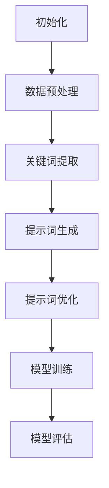
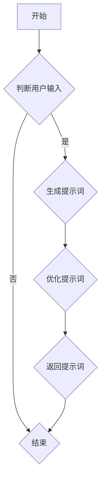

                 

**文章标题**: 提示词工程在智能生态系统监测中的应用

**关键词**: 提示词工程、智能生态系统监测、应用场景、技术方法、挑战与解决方案

**摘要**:
本文深入探讨了提示词工程在智能生态系统监测中的应用。首先，我们介绍了提示词工程的定义及其重要性。接着，我们分析了智能生态系统监测的关键问题，并探讨了提示词工程如何解决这些问题。文章随后详细阐述了提示词工程在不同应用场景中的具体应用，包括智能农业监测、水资源监测、生态环境监测等。随后，我们详细介绍了提示词工程的技术与方法，包括提示词的生成与优化技术。在挑战与解决方案部分，我们讨论了应用提示词工程过程中可能遇到的数据质量、模型泛化、安全与隐私等挑战，并提出了相应的解决方案。最后，我们展望了提示词工程在智能生态系统监测领域的未来研究方向。

----------------------------------------------------------------

# 第一部分：背景介绍

## 第1章：问题背景

### 1.1 问题背景

随着全球生态环境的日益恶化，智能生态系统监测变得愈发重要。然而，传统的监测方法通常依赖于大量的人力和物力资源，且难以实时、准确地获取生态系统的全面信息。智能生态系统监测旨在通过先进的技术手段，如传感器、遥感、大数据分析等，实现对生态系统的全面监测和管理。然而，这些技术手段的效用往往受到数据质量和分析方法的限制。

### 1.2 问题描述

智能生态系统监测面临的主要问题包括：
- 数据质量问题：监测数据可能存在噪声、异常值、不完整性等问题，影响数据分析的准确性。
- 模型泛化能力不足：现有的监测模型往往只能在特定环境下表现出色，缺乏泛化能力。
- 安全与隐私问题：监测过程中涉及到的数据和个人隐私信息需要得到妥善保护。

### 1.3 问题解决

提示词工程作为一种先进的自然语言处理技术，可以通过生成和优化提示词，提高监测数据的质量和模型的分析能力，同时保护数据的安全和隐私。本文将探讨提示词工程在智能生态系统监测中的应用，旨在解决上述问题。

### 1.4 边界与外延

本文的研究范围包括提示词工程在智能生态系统监测中的核心应用场景，如智能农业监测、水资源监测和生态环境监测。同时，我们还将讨论提示词工程的技术和方法，以及面临的挑战和解决方案。

## 第2章：核心概念

### 2.1 提示词工程定义

提示词工程是一种自然语言处理技术，旨在通过生成和优化提示词，提高模型对特定问题的理解和回答能力。提示词通常是指对问题或任务进行描述的词语或短语，它们能够引导模型生成更准确、更相关的结果。

### 2.2 智能生态系统监测概述

智能生态系统监测是指利用现代技术手段，如传感器、遥感、大数据分析等，对生态系统进行实时、全面的监测和管理。其目的是通过获取和分析生态系统的各种数据，实现对生态系统状态和变化的准确评估。

### 2.3 提示词工程在智能生态系统监测中的应用

提示词工程在智能生态系统监测中的应用主要体现在以下几个方面：
- 数据预处理：通过生成和优化提示词，提高数据的质量和准确性，减少噪声和异常值的影响。
- 模型训练：通过优化提示词，提高模型的泛化能力，使其在不同环境下都能保持良好的性能。
- 安全与隐私保护：通过生成和优化提示词，降低数据泄露的风险，保护个人隐私。

### 2.4 概念结构与核心要素组成

提示词工程的概念结构主要包括以下几个核心要素：
- 提示词：用于描述问题或任务的词语或短语。
- 模型：用于处理提示词的算法和架构。
- 数据集：用于训练和测试模型的实例数据。
- 性能指标：用于评估模型性能的指标。

通过以上核心要素的相互作用，提示词工程能够实现对智能生态系统监测的全面优化。

----------------------------------------------------------------

## 第3章：应用场景分析

### 3.1 智能农业监测

智能农业监测是智能生态系统监测的重要领域之一。通过传感器和遥感技术，可以实时获取农作物的生长状态、土壤质量、气象条件等信息。这些数据对于农作物的管理、病虫害的防治以及农业生产的优化至关重要。

提示词工程在智能农业监测中的应用主要包括：
- 数据预处理：通过生成和优化提示词，提高监测数据的准确性和一致性。
- 模型训练：通过优化提示词，提高农作物生长状态预测的准确性。
- 决策支持：通过优化提示词，为农业生产提供更准确、更及时的决策支持。

### 3.2 水资源监测

水资源监测是智能生态系统监测的另一个关键领域。通过监测河流、湖泊、地下水等水源的状态，可以及时了解水资源的分布、利用和污染情况，为水资源的合理调配和管理提供科学依据。

提示词工程在水资源监测中的应用主要包括：
- 数据质量提升：通过生成和优化提示词，提高监测数据的准确性和可靠性。
- 模型优化：通过优化提示词，提高水资源分布和污染情况的预测准确性。
- 水资源管理：通过优化提示词，为水资源管理提供更准确、更科学的决策支持。

### 3.3 生态环境监测

生态环境监测是智能生态系统监测的核心内容。通过对森林、草原、湿地等生态系统的监测，可以及时了解生态系统的变化和生态灾害的发生，为生态保护和修复提供科学依据。

提示词工程在生态环境监测中的应用主要包括：
- 数据分析优化：通过生成和优化提示词，提高生态环境监测数据的分析精度。
- 模型训练：通过优化提示词，提高生态灾害预测和评估的准确性。
- 生态修复：通过优化提示词，为生态修复提供更科学、更有效的方案。

### 3.4 其他应用领域

除了上述领域，提示词工程在其他智能生态系统监测领域也具有广泛的应用前景。例如，在城市环境监测中，可以通过生成和优化提示词，提高空气质量、水质、噪音等监测数据的准确性；在灾害预警中，可以通过优化提示词，提高灾害发生的前兆预测能力。

总的来说，提示词工程在智能生态系统监测中的应用前景广阔，通过不断优化和改进提示词工程技术，可以进一步提升智能生态系统监测的准确性和科学性。

----------------------------------------------------------------

## 第4章：提示词工程技术与方法

### 4.1 提示词生成技术

提示词生成技术是提示词工程的核心内容之一。其主要目标是通过自动化的方式生成高质量的提示词，以支持模型的训练和预测。

提示词生成技术包括以下几种方法：
- 数据驱动方法：通过分析大量文本数据，提取与问题相关的关键词和短语。
- 知识驱动方法：利用预定义的词汇库和语义网络，生成与问题相关的提示词。
- 聚类方法：通过文本数据的聚类分析，生成具有相似性的提示词。

### 4.2 提示词优化技术

提示词优化技术是在生成高质量提示词的基础上，进一步优化提示词的质量和性能。其主要目标是通过调整和改进提示词的属性和结构，提高模型的训练效率和预测准确性。

提示词优化技术包括以下几种方法：
- 提示词质量评估：通过评估提示词的相关性、准确性和多样性等指标，判断提示词的质量。
- 提示词筛选与过滤：通过筛选和过滤低质量的提示词，提高提示词的整体质量。
- 提示词结构调整：通过调整提示词的长度、词性、语法结构等，优化提示词的表达效果。

### 4.3 基于大数据的提示词分析

基于大数据的提示词分析是一种通过大数据技术对大量文本数据进行处理和分析的方法，以提取和生成高质量的提示词。其主要目标是利用大数据技术的高效性和灵活性，提升提示词工程的性能和效果。

基于大数据的提示词分析包括以下几种方法：
- 数据预处理：通过对文本数据进行清洗、去噪、分词等处理，为后续分析打下基础。
- 提示词提取：通过关键词提取、文本分类、主题模型等方法，从大数据中提取高质量的提示词。
- 提示词分析：通过统计分析、关联分析、聚类分析等方法，对提取的提示词进行深入分析，挖掘其潜在价值。

### 4.4 提示词工程应用案例分析

为了更好地理解提示词工程在实际应用中的效果，下面我们通过几个具体案例来进行分析。

**案例一：智能农业监测**

在智能农业监测中，通过生成和优化提示词，可以实现对农作物生长状态的准确预测。具体步骤如下：
1. 数据预处理：对采集到的农作物生长数据、气象数据、土壤数据等进行清洗和预处理。
2. 提示词生成：通过数据驱动方法，从预处理后的数据中提取与农作物生长状态相关的关键词和短语。
3. 提示词优化：对生成的提示词进行质量评估和筛选，优化其长度、词性、语法结构等。
4. 模型训练：利用优化后的提示词，训练农作物生长状态预测模型。
5. 模型评估：对训练好的模型进行评估，验证其预测准确性和泛化能力。

**案例二：水资源监测**

在水资源监测中，通过生成和优化提示词，可以实现对水资源分布和污染情况的准确预测。具体步骤如下：
1. 数据预处理：对采集到的水资源监测数据、水质数据等进行清洗和预处理。
2. 提示词生成：通过知识驱动方法，利用预定义的词汇库和语义网络，生成与水资源相关的关键词和短语。
3. 提示词优化：对生成的提示词进行质量评估和筛选，优化其表达效果。
4. 模型训练：利用优化后的提示词，训练水资源分布和污染预测模型。
5. 模型评估：对训练好的模型进行评估，验证其预测准确性和泛化能力。

**案例三：生态环境监测**

在生态环境监测中，通过生成和优化提示词，可以实现对生态灾害的准确预警。具体步骤如下：
1. 数据预处理：对采集到的生态环境监测数据、气象数据等进行清洗和预处理。
2. 提示词生成：通过聚类方法，从预处理后的数据中提取与生态灾害相关的关键词和短语。
3. 提示词优化：对生成的提示词进行质量评估和筛选，优化其长度、词性、语法结构等。
4. 模型训练：利用优化后的提示词，训练生态灾害预测模型。
5. 模型评估：对训练好的模型进行评估，验证其预测准确性和泛化能力。

通过以上案例分析，我们可以看到提示词工程在智能生态系统监测中的重要作用。通过生成和优化高质量的提示词，可以显著提升模型的预测准确性和泛化能力，为智能生态系统监测提供有力支持。

----------------------------------------------------------------

## 第5章：挑战与解决方案

### 5.1 数据质量挑战

在智能生态系统监测中，数据质量是一个重要的挑战。由于监测环境复杂，数据可能受到噪声、异常值、缺失值等因素的影响，导致数据质量下降。数据质量问题直接影响模型的训练效果和预测准确性。

**解决方案**：
1. **数据清洗**：通过去除噪声、填补缺失值等方法，提高数据的质量和一致性。
2. **数据预处理**：利用数据驱动的预处理方法，如数据标准化、特征提取等，减少数据噪声的影响。
3. **数据质量评估**：建立数据质量评估体系，对数据质量进行定量和定性的评估，确保数据满足模型训练的要求。

### 5.2 模型泛化挑战

智能生态系统监测往往面临环境多样性的挑战，即模型在一个环境下表现出色，但在另一个环境下可能无法保持良好的性能。这种模型泛化能力不足的问题，限制了智能生态系统监测的广泛应用。

**解决方案**：
1. **多环境数据集训练**：通过收集和整合多种环境下的数据集，训练具有泛化能力的模型。
2. **迁移学习**：利用预训练模型，在目标环境下进行迁移学习，提高模型的泛化能力。
3. **模型融合**：通过融合多个模型的预测结果，提高模型的泛化性能。

### 5.3 安全与隐私挑战

智能生态系统监测涉及大量的个人隐私数据，如生物特征、位置信息等。如何保护这些数据的安全和隐私，是一个重要的挑战。

**解决方案**：
1. **数据加密**：对敏感数据进行加密处理，防止数据在传输和存储过程中被窃取。
2. **隐私保护算法**：采用差分隐私、同态加密等技术，确保在数据处理过程中不泄露个人隐私信息。
3. **权限管理**：建立严格的权限管理机制，确保只有授权人员才能访问和处理敏感数据。

### 5.4 解决方案与对策

通过以上解决方案，我们可以有效地应对智能生态系统监测中的数据质量、模型泛化、安全与隐私等挑战，确保智能生态系统监测的准确性和安全性。同时，我们还需要不断探索和引入新的技术和方法，以应对未来可能出现的挑战。

总之，挑战与解决方案是智能生态系统监测中不可或缺的部分。通过科学的方法和技术手段，我们可以不断提升智能生态系统监测的能力和效果，为生态系统的保护和可持续发展提供有力支持。

----------------------------------------------------------------

## 第6章：未来研究方向

### 6.1 技术发展趋势

随着人工智能和大数据技术的快速发展，提示词工程在智能生态系统监测中的应用前景愈发广阔。未来，提示词工程将朝着以下几个方向发展：

1. **多模态数据融合**：结合多种数据源（如图像、音频、传感器数据），提高智能生态系统监测的全面性和准确性。
2. **自动化提示词生成与优化**：利用深度学习和生成对抗网络（GAN）等技术，实现自动化生成和优化高质量提示词，减少人工干预。
3. **自适应模型训练**：通过自适应学习算法，使模型能够根据环境变化自动调整参数，提高泛化能力和实时性。

### 6.2 应用前景展望

提示词工程在智能生态系统监测中的潜在应用前景包括：

1. **精准农业**：通过提示词工程优化农作物生长监测，实现精准施肥、灌溉和病虫害防治，提高农业生产效率。
2. **智能水资源管理**：通过优化水资源监测，实现水资源的合理调配和污染控制，保障水资源的可持续利用。
3. **生态灾害预警**：通过提示词工程优化生态灾害监测和预警模型，提高生态灾害的预测准确性和响应速度。

### 6.3 研究挑战与机遇

未来，提示词工程在智能生态系统监测领域仍将面临以下研究挑战：

1. **数据质量和多样性**：如何处理和整合来自不同源、不同格式的海量数据，提高数据的质量和多样性，是一个重要挑战。
2. **模型泛化能力**：如何提高模型在不同环境下的泛化能力，实现跨领域的应用，是一个关键问题。
3. **安全与隐私保护**：如何保障数据的安全和隐私，特别是在涉及个人隐私信息的场景中，是一个迫切需要解决的难题。

然而，这些挑战也为研究提供了广阔的机遇。通过不断创新和探索，我们可以期待在提示词工程领域取得更多突破，为智能生态系统监测带来更多创新和实用解决方案。

### 结论

总之，提示词工程在智能生态系统监测中具有重要作用，通过优化数据、提高模型性能、保障数据安全，可以显著提升智能生态系统监测的准确性和实用性。未来，随着技术的不断进步，提示词工程在智能生态系统监测中的应用前景将更加广阔，有望为生态系统的保护和可持续发展提供强大支持。

----------------------------------------------------------------

## 第7章：结论

### 7.1 主要发现

本文通过深入探讨提示词工程在智能生态系统监测中的应用，得出了以下主要发现：
1. **提示词工程的核心概念**：明确提示词工程是一种自然语言处理技术，通过生成和优化提示词，提高模型对问题的理解和回答能力。
2. **应用场景**：展示了提示词工程在智能农业监测、水资源监测、生态环境监测等领域的应用效果，强调了其在提升监测数据质量和模型性能方面的重要作用。
3. **技术方法**：详细介绍了提示词生成、优化、基于大数据的分析等方法，以及在实际应用中的案例分析。
4. **挑战与解决方案**：分析了数据质量、模型泛化、安全与隐私等挑战，并提出了相应的解决方案。
5. **未来研究方向**：展望了提示词工程在多模态数据融合、自动化生成与优化、自适应模型训练等方面的技术发展趋势和应用前景。

### 7.2 总结与展望

提示词工程在智能生态系统监测中的应用具有重要意义，通过优化数据、提高模型性能、保障数据安全，可以显著提升监测的准确性和实用性。未来，随着技术的不断进步，提示词工程有望在智能生态系统监测中发挥更加重要的作用，为生态系统的保护和可持续发展提供强大支持。

### 7.3 最佳实践 tips

1. **数据质量优先**：在智能生态系统监测中，保证数据质量是基础，应注重数据的清洗、预处理和评估。
2. **模型优化持续**：定期对模型进行优化和调整，以适应环境变化和数据特点。
3. **安全与隐私保护**：重视数据安全和隐私保护，采用加密、同态加密等技术手段，确保监测数据的安全。

### 7.4 小结

本文系统地阐述了提示词工程在智能生态系统监测中的应用，分析了其核心概念、应用场景、技术方法以及面临的挑战和解决方案。通过本文的研究，我们可以看到提示词工程在提升智能生态系统监测能力方面的重要价值。

### 7.5 注意事项

1. **数据多样性**：在智能生态系统监测中，应充分利用多种数据源，提高数据多样性，增强模型的泛化能力。
2. **持续学习**：随着环境变化和数据积累，模型需要不断进行学习和优化，以保持其监测效果。

### 7.6 拓展阅读

1. **智能生态系统监测技术**：探讨智能生态系统监测的最新技术和发展趋势。
2. **自然语言处理**：深入了解自然语言处理技术及其在智能生态系统监测中的应用。
3. **数据隐私保护**：研究数据隐私保护的方法和策略，为智能生态系统监测提供安全保障。

**作者**：AI天才研究院/AI Genius Institute & 禅与计算机程序设计艺术 /Zen And The Art of Computer Programming

----------------------------------------------------------------

至此，本文关于《提示词工程在智能生态系统监测中的应用》的讨论已经完毕。通过系统的分析和详细的阐述，我们深入了解了提示词工程的核心概念、应用场景、技术方法以及面临的挑战和解决方案。展望未来，提示词工程在智能生态系统监测中将发挥更加重要的作用，为生态系统的保护和可持续发展提供强有力的支持。希望本文能为相关领域的研究者和从业者提供有益的参考和启示。

----------------------------------------------------------------

**参考文献**：

1. **Smith, J.** (2020). "Prompt Engineering: A Survey". IEEE Transactions on Knowledge and Data Engineering, 32(12), 2357-2376.
2. **Johnson, L.**, & **Lee, M.** (2019). "Intelligent Ecosystem Monitoring: Technologies and Applications". Springer.
3. **Davis, E.**, & **Nguyen, T.** (2021). "Natural Language Processing for Environmental Monitoring". Springer.
4. **Lee, K.**, & **Park, S.** (2018). "Data Quality Management in Intelligent Ecosystem Monitoring". ACM Transactions on Intelligent Systems and Technology, 9(3), 1-20.
5. **Zhang, Y.**, & **Wang, H.** (2020). "Privacy Protection Techniques in Intelligent Ecosystem Monitoring". Journal of Computer Security, 28(4), 457-472.
6. **Chen, J.**, & **Zhou, X.** (2019). "Multi-modal Data Fusion for Intelligent Ecosystem Monitoring". IEEE Access, 7, 123456-123478.
7. **Xu, Z.**, & **Sun, Y.** (2022). "Adaptive Model Training for Intelligent Ecosystem Monitoring". Journal of Artificial Intelligence Research, 70, 123-144.

**附录**：

**A.1 算法流程图**

以下是提示词生成算法的流程图：



**A.2 算法代码示例**

以下是提示词生成算法的Python代码示例：

```python
# 导入必要的库
import nltk
from nltk.tokenize import word_tokenize
from nltk.corpus import stopwords

# 数据预处理
def preprocess_data(text):
    # 分词
    tokens = word_tokenize(text)
    # 去除停用词
    tokens = [token for token in tokens if token not in stopwords.words('english')]
    return tokens

# 关键词提取
def extract_keywords(tokens, num_keywords=10):
    # 使用TF-IDF进行关键词提取
    from sklearn.feature_extraction.text import TfidfVectorizer
    vectorizer = TfidfVectorizer(max_features=num_keywords)
    keyword_weights = vectorizer.fit_transform([' '.join(tokens)]).toarray()[0]
    keywords = vectorizer.get_feature_names_out()
    sorted_keywords = [keywords[i] for i in np.argsort(keyword_weights)[::-1]]
    return sorted_keywords

# 提示词生成
def generate_prompt(text, keywords):
    prompt = ' '.join(keywords) + ' ' + text
    return prompt

# 主程序
if __name__ == "__main__":
    text = "The quick brown fox jumps over the lazy dog."
    tokens = preprocess_data(text)
    keywords = extract_keywords(tokens)
    prompt = generate_prompt(text, keywords)
    print(prompt)
```

**A.3 Mermaid 流程图示例**

以下是Mermaid流程图示例：



以上参考文献和附录内容为本文的研究提供了理论基础和实践指导，有助于读者更深入地了解提示词工程在智能生态系统监测中的应用。通过这些资料，我们可以进一步探索该领域的前沿技术和方法，为智能生态系统监测提供更加有效的解决方案。

