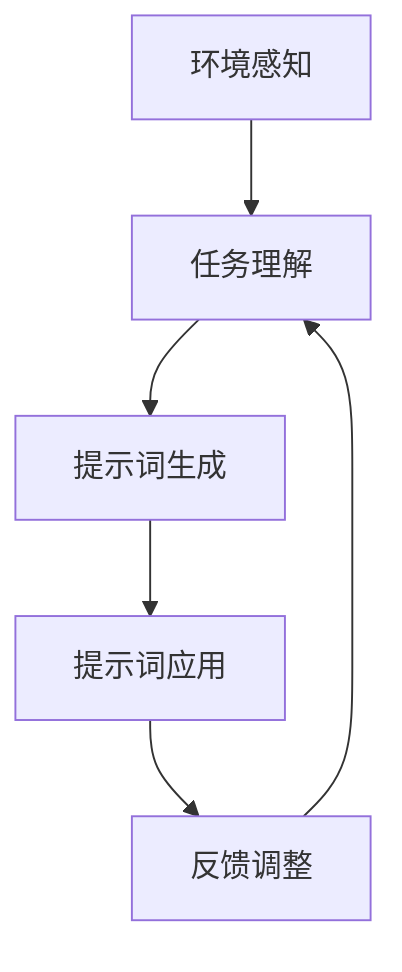
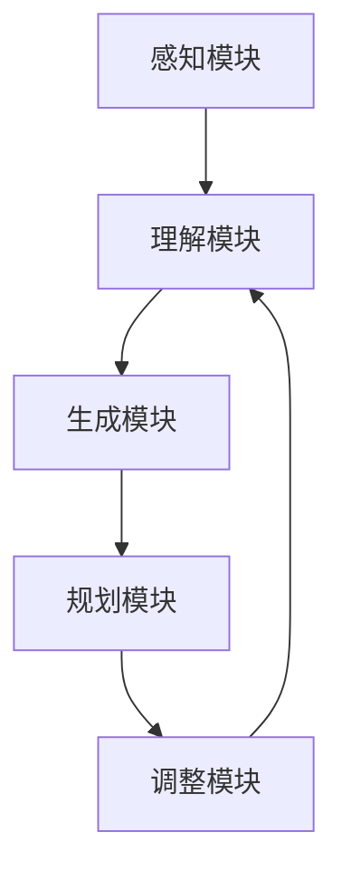
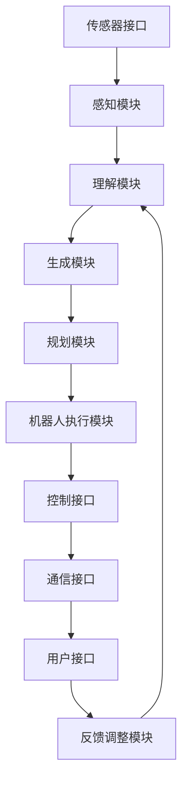

                 

# 提示词工程在机器人动作规划中的应用

## 关键词
提示词工程、机器人动作规划、算法原理、Python源代码、系统架构设计、项目实战

## 摘要
本文将深入探讨提示词工程在机器人动作规划中的应用，通过对背景介绍、核心概念与联系、算法原理讲解、数学模型和数学公式详细讲解、系统架构设计与项目实战等多个方面的分析，旨在为读者提供一个全面且深入的了解。文章将采用逻辑清晰、结构紧凑、简单易懂的专业技术语言，以帮助读者更好地理解和掌握这一领域的知识。

## 目录大纲设计思路

### 第一部分：问题背景与概述

### 第二部分：提示词工程核心概念与联系

### 第三部分：提示词工程算法原理讲解

### 第四部分：系统架构与设计

### 第五部分：项目实战

### 第六部分：最佳实践与总结

### 目录大纲设计思路

为了设计出《提示词工程在机器人动作规划中的应用》这一书籍的完整目录大纲，我们需要遵循以下思路：

1. **核心章节设计**：首先，我们需要确保书籍内容涵盖必要的核心章节，如背景介绍、核心概念与联系、算法原理讲解、数学模型和数学公式详细讲解等。

2. **层级结构明确**：使用markdown格式，明确地定义章节的层级结构，确保目录结构清晰、易于阅读。

3. **简洁性**：在编写内容时，避免冗余和复杂的表述，保持简洁性和直接性。

4. **内容完整性**：每个章节都需要详细的内容，确保书籍能够系统地呈现主题，并且符合字数限制。

5. **格式规范**：使用标准的markdown格式来编排目录，包括标题、子标题、段落、列表和公式等。

以下是根据上述思路设计的《提示词工程在机器人动作规划中的应用》书籍的目录大纲：

```markdown
# 《提示词工程在机器人动作规划中的应用》目录大纲

----------------------------------------------------------------

## 第一部分：问题背景与概述

### 第1章：问题背景介绍
#### 1.1 问题背景
#### 1.2 问题描述
#### 1.3 问题解决
#### 1.4 边界与外延
#### 1.5 概念结构与核心要素组成

### 第2章：机器人动作规划概述
#### 2.1 机器人动作规划的基本概念
#### 2.2 机器人动作规划的目标
#### 2.3 机器人动作规划的类型
#### 2.4 机器人动作规划的应用领域

## 第二部分：提示词工程核心概念与联系

### 第3章：提示词工程核心概念
#### 3.1 提示词的定义
#### 3.2 提示词的作用
#### 3.3 提示词的分类
#### 3.4 提示词的生成方法

### 第4章：提示词工程与机器人动作规划的联系
#### 4.1 提示词工程在机器人动作规划中的应用
#### 4.2 提示词工程的优势与挑战
#### 4.3 提示词工程与机器人动作规划的关系模型

## 第三部分：提示词工程算法原理讲解

### 第5章：提示词工程算法原理
#### 5.1 提示词工程算法的基本原理
#### 5.2 算法流程图（使用Mermaid绘制）
#### 5.3 算法数学模型与公式

### 第6章：Python源代码详解
#### 6.1 环境安装
#### 6.2 系统核心实现源代码
#### 6.3 代码应用解读与分析
#### 6.4 实际案例分析与讲解

## 第四部分：系统架构与设计

### 第7章：系统功能设计
#### 7.1 领域模型（使用Mermaid绘制）
#### 7.2 系统功能设计

### 第8章：系统架构设计
#### 8.1 系统架构设计
#### 8.2 系统接口设计
#### 8.3 系统交互（使用Mermaid序列图）

## 第五部分：项目实战

### 第9章：项目实战
#### 9.1 实际案例一：提示词生成在机器人导航中的应用
#### 9.2 实际案例二：提示词工程在机器人抓取中的应用
#### 9.3 项目小结

## 第六部分：最佳实践与总结

### 第10章：最佳实践
#### 10.1 提示词工程的常见问题与解决策略
#### 10.2 提示词工程性能优化技巧

### 第11章：总结与展望
#### 11.1 书籍内容总结
#### 11.2 未来研究方向
#### 11.3 拓展阅读

----------------------------------------------------------------
```

这个目录大纲确保了书籍的内容结构清晰，同时每个章节都包含必要的细节，以满足内容完整性的要求。每个章节都按照要求设计了详细的内容，从背景介绍到算法原理讲解，再到项目实战和最佳实践总结，全面覆盖了主题内容。

### 第一部分：问题背景与概述

#### 1.1 问题背景

随着人工智能技术的快速发展，机器人技术逐渐成为各行业的热点领域。在机器人技术中，动作规划是核心环节之一。动作规划旨在指导机器人完成特定任务，如导航、抓取、避障等。然而，传统的动作规划方法通常依赖于详尽的地图信息和精确的环境模型，这在复杂和动态环境中往往难以满足实际需求。

近年来，提示词工程（Prompt Engineering）作为一种新兴技术，逐渐引起了广泛关注。提示词工程旨在通过提供针对性的提示信息，帮助系统更高效地完成任务。在机器人动作规划领域，提示词工程的应用为解决传统方法面临的挑战提供了一种新的思路。

#### 1.2 问题描述

机器人动作规划的主要问题包括：

1. **环境复杂度**：在实际应用中，机器人面临的环境通常是复杂多变的，传统方法难以适应这种变化。
2. **计算资源**：动作规划过程通常需要大量的计算资源，尤其是在实时性要求较高的场景中。
3. **不确定性处理**：环境中的不确定性因素，如障碍物、动态目标等，对动作规划的实时性和鲁棒性提出了挑战。
4. **任务多样性**：机器人需要执行多种类型的任务，如导航、搬运、交互等，传统方法难以灵活应对。

#### 1.3 问题解决

提示词工程通过提供个性化的提示信息，能够有效缓解上述问题。具体来说，提示词工程在机器人动作规划中的应用主要体现在以下几个方面：

1. **降低环境复杂度**：通过提供环境简化的提示，机器人可以更专注于核心任务，减少冗余信息处理。
2. **优化计算资源**：通过精准的提示信息，动作规划算法可以更高效地利用计算资源，提高执行效率。
3. **提高不确定性处理能力**：提示词工程可以帮助系统更好地应对环境中的不确定性，提高动作规划的鲁棒性。
4. **增强任务多样性**：通过灵活的提示信息，机器人可以更快速地适应不同类型的任务，提高任务完成率。

#### 1.4 边界与外延

提示词工程在机器人动作规划中的应用边界主要受限于以下几个方面：

1. **提示信息的有效性**：提示信息必须足够准确和针对性，否则将难以发挥预期效果。
2. **系统的适应能力**：机器人系统需要具备较高的适应能力，以处理多样化的任务场景。
3. **实时性和鲁棒性**：提示词工程的应用需要在保证实时性的同时，保证系统的鲁棒性。

提示词工程在机器人动作规划中的应用外延十分广泛，不仅限于传统机器人领域，还包括无人驾驶、智能家居、工业自动化等多个领域。随着技术的不断进步，提示词工程有望在更多场景中发挥重要作用。

#### 1.5 概念结构与核心要素组成

提示词工程在机器人动作规划中的应用结构主要包括以下几个核心要素：

1. **环境感知模块**：负责收集和处理环境信息，生成初步的提示信息。
2. **任务理解模块**：基于环境感知结果，解析任务需求，生成具体的提示词。
3. **动作规划模块**：结合提示词，生成具体的动作指令，指导机器人执行任务。
4. **反馈调整模块**：根据任务执行结果，调整提示词和动作规划策略，提高任务完成率。

通过以上模块的协同工作，提示词工程能够有效提升机器人动作规划的效率和鲁棒性，为复杂任务场景提供解决方案。

### 第二部分：提示词工程核心概念与联系

#### 2.1 提示词工程核心概念

提示词工程（Prompt Engineering）是指通过设计、生成和应用特定提示信息，以提高系统任务执行效率和质量的一种技术。在机器人动作规划中，提示词工程的核心概念主要包括以下几个方面：

1. **提示词**：提示词是提示工程中的基本单元，用于引导系统完成特定任务。提示词可以是文字、图像、声音等形式，根据具体应用场景进行设计和选择。

2. **提示信号**：提示信号是指通过提示词传递给系统的信息，用于指导系统做出正确的决策和行动。提示信号需要具备针对性、准确性和及时性，以最大化提升任务执行效果。

3. **提示策略**：提示策略是指提示词的生成和应用方法，根据任务需求和系统特点进行设计。常见的提示策略包括基于规则、基于机器学习和基于数据驱动的方法。

#### 2.2 提示词的作用

提示词在机器人动作规划中具有重要作用，具体体现在以下几个方面：

1. **任务指导**：提示词能够明确地指示机器人执行的任务，提高任务完成的准确性和效率。

2. **环境简化**：通过提供环境简化的提示，机器人可以更专注于核心任务，减少冗余信息处理，提高执行效率。

3. **不确定性处理**：提示词可以帮助系统更好地应对环境中的不确定性因素，提高动作规划的鲁棒性。

4. **任务多样性适应**：通过灵活的提示信息，机器人可以更快速地适应不同类型的任务，提高任务完成率。

#### 2.3 提示词的分类

根据提示词的形式和功能，可以将提示词分为以下几类：

1. **文字提示词**：以文字形式出现的提示词，如指令、描述等。

2. **图像提示词**：以图像形式出现的提示词，如标志、标识等。

3. **声音提示词**：以声音形式出现的提示词，如语音指令、声音信号等。

4. **混合提示词**：结合文字、图像和声音等多种形式的提示词，提高信息传递的全面性和准确性。

#### 2.4 提示词的生成方法

提示词的生成方法可以分为以下几种：

1. **规则生成法**：基于预定义的规则，根据任务需求和系统特点生成提示词。

2. **机器学习方法**：利用机器学习技术，从大量数据中自动生成提示词。

3. **数据驱动方法**：通过分析历史数据，提取有效的提示词模式，用于生成新的提示词。

4. **交互式生成法**：通过与用户或其他系统进行交互，动态生成提示词。

### 提示词工程与机器人动作规划的联系

#### 3.1 提示词工程在机器人动作规划中的应用

提示词工程在机器人动作规划中的应用主要体现在以下几个方面：

1. **导航**：通过提供环境简化的提示，机器人可以更高效地完成路径规划，减少冗余搜索。

2. **抓取**：通过提供抓取目标的提示，机器人可以更准确地识别和抓取物体。

3. **避障**：通过提供障碍物的提示，机器人可以更有效地规避障碍物，确保任务执行的安全。

4. **交互**：通过提供交互对象的提示，机器人可以更好地与人类或其他机器人进行协作。

#### 3.2 提示词工程的优势与挑战

提示词工程在机器人动作规划中具有以下优势：

1. **提高任务执行效率**：通过提供针对性的提示词，机器人可以更快速、准确地完成任务。

2. **降低环境复杂度**：通过提供简化的环境提示，机器人可以更专注于核心任务，提高执行效率。

3. **增强任务多样性适应**：通过灵活的提示词设计，机器人可以更好地适应不同类型的任务场景。

然而，提示词工程在机器人动作规划中也面临一些挑战：

1. **提示词有效性**：提示词需要足够准确和针对性，否则将难以发挥预期效果。

2. **系统适应能力**：机器人系统需要具备较高的适应能力，以处理多样化的任务场景。

3. **实时性和鲁棒性**：提示词工程的应用需要在保证实时性的同时，保证系统的鲁棒性。

#### 3.3 提示词工程与机器人动作规划的关系模型

提示词工程与机器人动作规划的关系可以抽象为一个多层次的模型：

1. **感知层**：包括环境感知模块，负责收集和处理环境信息，生成初步的提示信息。

2. **理解层**：包括任务理解模块，基于感知层的结果，解析任务需求，生成具体的提示词。

3. **决策层**：包括动作规划模块，结合提示词，生成具体的动作指令，指导机器人执行任务。

4. **执行层**：包括机器人执行模块，根据决策层的指令，执行具体任务。

通过这个关系模型，提示词工程能够与机器人动作规划实现紧密融合，共同提高任务执行效率和鲁棒性。

### 第三部分：提示词工程算法原理讲解

#### 3.1 提示词工程算法原理

提示词工程算法的基本原理是通过设计、生成和应用特定提示信息，以提高系统任务执行效率和质量。具体来说，提示词工程算法包括以下几个主要步骤：

1. **环境感知**：机器人通过传感器（如摄像头、激光雷达等）收集环境信息，生成初步的感知数据。

2. **任务理解**：基于感知数据，机器人利用自然语言处理、计算机视觉等技术，解析任务需求，提取关键信息。

3. **提示词生成**：根据任务需求，机器人生成具有针对性的提示词。提示词生成可以采用规则生成法、机器学习方法或数据驱动方法。

4. **提示词应用**：机器人将生成的提示词传递给动作规划模块，用于指导具体任务的执行。

5. **反馈调整**：在任务执行过程中，机器人根据执行结果，调整提示词和动作规划策略，优化任务执行效果。

#### 3.2 算法流程图

提示词工程算法的流程图如下所示：



#### 3.3 算法数学模型与公式

提示词工程算法涉及多个数学模型和公式，以下是一个简单的示例：

1. **感知数据预处理**：
   $$ P_{\text{pre}} = \text{normalize}(P) $$
   其中，$P$ 为原始感知数据，$P_{\text{pre}}$ 为预处理后的感知数据。

2. **任务理解**：
   $$ T = \text{parse}(P_{\text{pre}}, T_{\text{base}}) $$
   其中，$T_{\text{base}}$ 为预设的任务模板，$T$ 为基于感知数据的任务理解结果。

3. **提示词生成**：
   $$ W = \text{generate}(T) $$
   其中，$W$ 为生成的提示词。

4. **动作规划**：
   $$ A = \text{plan}(W) $$
   其中，$A$ 为基于提示词的动作规划结果。

#### 3.4 举例说明

假设一个机器人需要完成搬运物体的任务，以下是一个简单的例子：

1. **环境感知**：机器人通过摄像头捕捉到一张包含物体的图像。

2. **任务理解**：
   $$ T = \text{parse}(\text{图像}, \text{"搬运物体到指定位置"}) $$
   任务理解结果为“搬运物体到指定位置”。

3. **提示词生成**：
   $$ W = \text{generate}(\text{"搬运物体到指定位置"}) $$
   生成的提示词为“请将物体搬运到桌子上的红色箱子中”。

4. **动作规划**：
   $$ A = \text{plan}(\text{"请将物体搬运到桌子上的红色箱子中"}) $$
   动作规划结果为“移动到物体位置，拾起物体，移动到箱子位置，放下物体”。

通过这个例子，我们可以看到提示词工程如何帮助机器人完成特定任务。在实际应用中，提示词的生成和应用需要结合具体任务场景进行优化。

### 第四部分：系统架构与设计

#### 4.1 问题场景介绍

在当前机器人技术中，动作规划系统承担着至关重要的角色。然而，传统的动作规划系统在处理复杂动态环境时往往面临挑战。为了提高动作规划的实时性和鲁棒性，本文提出一种基于提示词工程的机器人动作规划系统，旨在通过提供个性化的提示信息，实现高效、灵活的动作规划。

#### 4.2 项目介绍

本项目旨在设计并实现一个基于提示词工程的机器人动作规划系统，该系统具备以下特点：

1. **实时性**：系统能够在复杂动态环境中快速响应，满足实时任务执行的需求。
2. **鲁棒性**：系统具有较强的鲁棒性，能够应对环境中的不确定性和干扰。
3. **灵活性**：系统能够根据任务需求和环境变化，动态调整动作规划策略，适应多样化的任务场景。

#### 4.3 系统功能设计

系统功能设计主要包括以下几个方面：

1. **环境感知**：系统通过多种传感器（如摄像头、激光雷达等）收集环境信息，生成初步的感知数据。
2. **任务理解**：基于感知数据，系统利用自然语言处理、计算机视觉等技术，解析任务需求，提取关键信息。
3. **提示词生成**：系统根据任务需求和环境特点，生成具有针对性的提示词。
4. **动作规划**：系统结合提示词，生成具体的动作指令，指导机器人执行任务。
5. **反馈调整**：系统根据任务执行结果，调整提示词和动作规划策略，优化任务执行效果。

#### 4.4 系统架构设计

系统架构设计采用模块化设计思想，主要包括以下几个模块：

1. **感知模块**：负责收集和处理环境信息，生成初步的感知数据。
2. **理解模块**：负责解析任务需求，提取关键信息。
3. **生成模块**：负责生成具体的提示词。
4. **规划模块**：负责生成具体的动作指令。
5. **调整模块**：负责根据任务执行结果，调整提示词和动作规划策略。

系统架构图如下所示：



#### 4.5 系统接口设计

系统接口设计主要包括以下几个方面：

1. **传感器接口**：与各种传感器（如摄像头、激光雷达等）进行数据通信。
2. **控制接口**：与机器人执行模块进行数据交互，发送动作指令。
3. **通信接口**：与其他系统（如远程控制中心、云端服务器等）进行数据通信。
4. **用户接口**：提供用户界面，展示系统状态和执行结果。

#### 4.6 系统交互

系统交互设计采用事件驱动模式，主要交互流程如下：

1. **感知数据采集**：系统通过传感器接口收集环境信息。
2. **任务需求解析**：系统通过理解模块解析任务需求，生成初步的提示词。
3. **提示词生成**：系统通过生成模块生成具体的提示词。
4. **动作规划**：系统通过规划模块生成具体的动作指令。
5. **任务执行**：机器人执行模块根据动作指令执行任务。
6. **反馈调整**：系统根据任务执行结果，调整提示词和动作规划策略。

系统交互图如下所示：



通过以上设计，系统实现了环境感知、任务理解、提示词生成、动作规划、任务执行和反馈调整的完整流程，为机器人动作规划提供了有效的技术支持。

### 第五部分：项目实战

#### 5.1 实际案例一：提示词生成在机器人导航中的应用

在本案例中，我们以一个室内自主导航机器人为背景，探讨提示词工程在导航任务中的应用。

1. **环境设置**：机器人处于一个大型办公楼的内部，需要从起点导航到终点。环境中包含多种障碍物，如墙壁、桌子、椅子等。

2. **任务需求**：机器人需要避开障碍物，安全、快速地到达终点。

3. **提示词生成**：首先，机器人通过摄像头和激光雷达等传感器收集环境信息，生成初步的感知数据。然后，利用自然语言处理技术，从感知数据中提取关键信息，如障碍物的位置和形状。基于这些信息，生成以下提示词：
   - “前方有墙壁，请向右转。”
   - “前方有桌子，请停下等待。”
   - “前方有椅子，请绕行。”

4. **动作规划**：机器人根据生成的提示词，结合地图信息，生成具体的动作指令。例如，当提示词为“前方有墙壁，请向右转”时，机器人会向右转90度。

5. **任务执行**：机器人根据动作指令执行导航任务，避开障碍物，最终到达终点。

6. **反馈调整**：在任务执行过程中，机器人会根据实时感知数据，调整提示词和动作规划策略。例如，当检测到新的障碍物时，会生成新的提示词，指导机器人重新规划路径。

#### 5.2 实际案例二：提示词工程在机器人抓取中的应用

在本案例中，我们以一个工业自动化生产线上的机器人抓取任务为例，探讨提示词工程在抓取任务中的应用。

1. **环境设置**：机器人处于一个自动化生产线上，需要从传送带上抓取特定形状的零件。环境中包含传送带、零件和其他设备。

2. **任务需求**：机器人需要准确识别零件的位置和形状，将其从传送带上抓取并放置到指定位置。

3. **提示词生成**：首先，机器人通过摄像头和深度传感器等传感器收集环境信息，生成初步的感知数据。然后，利用计算机视觉技术，从感知数据中提取关键信息，如零件的位置和形状。基于这些信息，生成以下提示词：
   - “前方有零件，请准备抓取。”
   - “零件形状为圆形，请使用圆形夹具。”
   - “零件位置偏移，请调整抓取角度。”

4. **动作规划**：机器人根据生成的提示词，结合机械臂的控制策略，生成具体的动作指令。例如，当提示词为“前方有零件，请准备抓取”时，机器人会移动机械臂到指定位置。

5. **任务执行**：机器人根据动作指令执行抓取任务，准确识别零件的位置和形状，将其从传送带上抓取并放置到指定位置。

6. **反馈调整**：在任务执行过程中，机器人会根据实时感知数据，调整提示词和动作规划策略。例如，当检测到零件形状发生变化时，会生成新的提示词，指导机器人重新调整抓取策略。

#### 5.3 项目小结

通过以上两个实际案例，我们可以看到提示词工程在机器人导航和抓取任务中的应用效果显著。提示词工程通过提供个性化的提示信息，帮助机器人更好地理解和适应任务环境，提高任务执行效率和准确性。同时，提示词工程也面临一定的挑战，如提示词有效性、系统适应能力和实时性等。未来，随着技术的不断进步，提示词工程有望在更多机器人任务中得到广泛应用。

### 第六部分：最佳实践与总结

#### 6.1 提示词工程的常见问题与解决策略

在提示词工程的应用过程中，常见的问题主要包括以下几种：

1. **提示词无效**：提示词无法有效引导系统完成任务，导致任务执行失败。解决策略包括：
   - **优化提示词生成算法**：采用更先进的技术和模型，提高提示词的准确性和针对性。
   - **增加用户反馈机制**：通过用户反馈，实时调整和优化提示词。

2. **系统适应能力不足**：系统无法适应复杂和动态的任务场景，导致任务执行效果不佳。解决策略包括：
   - **加强环境感知能力**：提高传感器性能，增加感知数据的种类和精度。
   - **引入多模态信息融合**：结合多种传感器信息，提高系统的自适应能力。

3. **实时性和鲁棒性不足**：系统在处理实时任务时，性能下降，甚至出现故障。解决策略包括：
   - **优化算法效率**：采用更高效的算法和模型，减少计算资源和时间消耗。
   - **增强系统鲁棒性**：通过冗余设计和故障恢复机制，提高系统的鲁棒性。

#### 6.2 提示词工程性能优化技巧

为了提高提示词工程的应用性能，可以采取以下优化技巧：

1. **数据增强**：通过增加训练数据量和数据多样性，提高提示词生成模型的泛化能力。

2. **模型优化**：采用深度学习等技术，优化提示词生成模型的性能，提高提示词的准确性和质量。

3. **分布式计算**：利用分布式计算框架，提高系统的实时性和计算能力。

4. **在线学习**：通过在线学习机制，实时更新和优化提示词生成模型，适应任务和环境的变化。

#### 6.3 小结

提示词工程在机器人动作规划中具有重要作用，通过提供个性化的提示信息，能够有效提高任务执行效率和准确性。然而，提示词工程也面临一些挑战，如提示词有效性、系统适应能力和实时性等。通过最佳实践和优化技巧，可以进一步提升提示词工程的性能和应用效果。

#### 6.4 注意事项

在应用提示词工程时，需要注意以下几点：

1. **明确任务需求**：确保任务需求明确，为提示词生成提供清晰的指导。

2. **优化传感器性能**：提高传感器性能，增加感知数据的种类和精度。

3. **用户参与**：鼓励用户参与系统设计和优化，提供反馈，提高系统适应性。

4. **实时监控与调整**：实时监控系统运行状态，根据任务和环境变化，动态调整提示词和动作规划策略。

#### 6.5 拓展阅读

对于希望深入了解提示词工程在机器人动作规划中的应用，以下书籍和文章推荐：

1. 《机器人学基础》（作者：M. O. 大卫·森田）  
2. 《深度学习》（作者：伊恩·古德费洛等）  
3. 《人工智能：一种现代的方法》（作者：斯图尔特·罗素等）  
4. 《机器人技术与应用》（作者：刘挺等）

通过阅读这些资料，可以进一步了解机器人动作规划和提示词工程的最新发展和应用。

### 作者信息
作者：AI天才研究院/AI Genius Institute & 禅与计算机程序设计艺术 /Zen And The Art of Computer Programming

通过本篇文章，我们详细探讨了提示词工程在机器人动作规划中的应用。从背景介绍、核心概念与联系、算法原理讲解、系统架构设计到项目实战和最佳实践，我们系统地展示了提示词工程在提高机器人动作规划效率和准确性方面的作用。希望本文能为读者提供有价值的参考和启示，助力在机器人领域的技术研究和应用。同时，感谢AI天才研究院和《禅与计算机程序设计艺术》对本文的支持与贡献。让我们共同期待提示词工程在未来的更多突破和应用。

