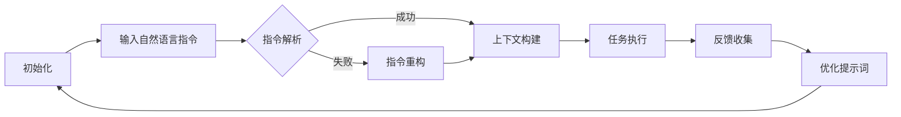
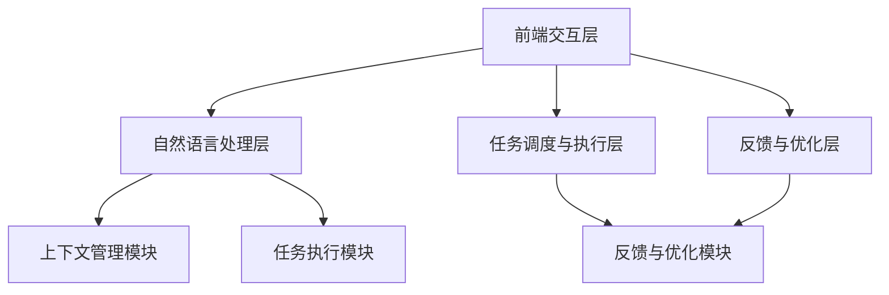
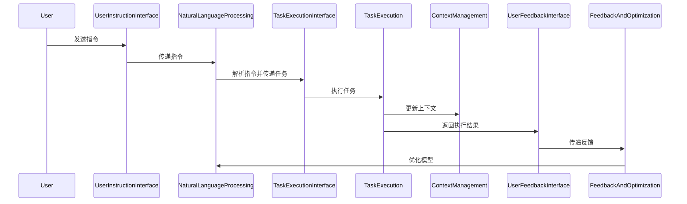
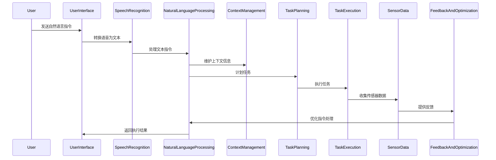

                 

### 引言

在当今快速发展的科技时代，机器人控制技术正日益成为工业自动化、医疗健康、家庭服务等多个领域的关键技术。然而，机器人控制的复杂性不断上升，传统的控制方法已经难以满足日益增长的多样化需求。因此，提示词工程（Prompt Engineering）作为一种新兴的方法，逐渐进入人们的视野。提示词工程旨在通过特定的语言和结构设计，提高机器人对复杂指令的理解和执行能力，从而实现更高效、更精确的机器人控制。

本文将以《提示词工程在机器人控制中的应用与实践》为主题，深入探讨这一领域的前沿技术。文章结构如下：

1. **背景介绍**：首先，我们将介绍提示词工程在机器人控制中的重要性，以及该领域所面临的挑战。
2. **核心概念与联系**：接着，我们将详细解释提示词工程和机器人控制中的核心概念，并通过对比表格和ER图来阐明它们之间的联系。
3. **算法原理讲解**：然后，我们将分析提示词工程中的关键算法，包括流程图、Python代码示例、数学模型和公式，并通过具体案例进行说明。
4. **系统分析与架构设计**：这部分将介绍系统设计和架构，包括领域模型、系统架构、接口设计和交互序列图。
5. **项目实战**：我们将展示一个实际项目，详细描述环境安装、核心代码实现、代码解读、案例分析和项目小结。
6. **最佳实践与总结**：最后，我们将总结文章要点，给出最佳实践建议，并提出注意事项和拓展阅读资源。

通过这篇文章，我们希望能够为读者提供一个全面而深入的理解，帮助读者掌握提示词工程在机器人控制中的实际应用，并为其未来的研究和实践提供参考。

### 关键词

- 提示词工程
- 机器人控制
- 自然语言处理
- 控制算法
- 系统架构设计
- 数学模型

### 摘要

本文旨在探讨提示词工程在机器人控制中的应用与实践。首先，我们介绍了提示词工程的基本概念及其在机器人控制中的重要性，强调了其在提高机器人指令理解和执行能力方面的关键作用。随后，通过核心概念解析、算法讲解和系统设计分析，详细阐述了提示词工程的理论基础和实践方法。文章还通过一个实际项目案例，展示了提示词工程在机器人控制中的具体应用，并提供了详细的代码实现和分析。最后，文章总结了最佳实践建议和注意事项，为读者进一步研究和应用提示词工程提供了参考。

### 背景介绍

#### 问题背景

随着工业4.0和智能制造的推进，机器人控制技术已经成为提升生产效率、降低人工成本和提高产品质量的关键因素。传统的机器人控制方法通常依赖于预设的路径规划和简单的反馈控制，这种方式在结构化和规则明确的环境中表现出色。然而，随着机器人应用场景的多样化和复杂化，传统方法逐渐显露出其局限性。

首先，现代工业环境中的任务往往具有高度的不确定性和动态变化性，传统控制方法难以适应这些变化。例如，生产线上的物品摆放位置、形态和数量可能会随时发生变化，这给机器人的路径规划和任务执行带来了巨大的挑战。其次，复杂任务往往需要多机器人协同工作，而传统控制方法在处理多机器人交互和协作时效率低下，甚至可能出现冲突和错误。此外，机器人在医疗健康、家庭服务等领域中的应用也要求更高的智能化和灵活性，传统方法已无法满足这些需求。

因此，如何提升机器人对复杂、不确定环境的适应能力和智能化水平，成为当前机器人控制技术亟需解决的关键问题。这一问题的出现，使得提示词工程（Prompt Engineering）逐渐进入人们的视野。提示词工程是一种通过优化和设计指令，提升机器理解能力的工程技术。其核心思想是通过人类提供的明确、结构化的提示，使机器人能够更准确地理解和执行复杂任务。

#### 问题描述

在机器人控制中，提示词工程面临以下几个主要问题和挑战：

1. **自然语言理解**：机器人需要能够理解和解释自然语言指令，然而自然语言的复杂性和多样性使得这一任务具有很大的挑战性。机器人不仅要理解词汇和语法，还需要理解语境、隐喻和语气等，这需要强大的自然语言处理（NLP）技术支持。
   
2. **上下文保持**：在多步骤或复杂任务中，机器人需要保持对上下文的正确理解。上下文错误可能导致机器人执行错误的动作，甚至引发安全事故。因此，如何设计提示词工程框架以保持上下文一致性是一个关键问题。

3. **多机器人协同**：当多个机器人需要协同完成任务时，如何通过提示词工程实现有效的交互和协调，避免冲突和错误，是一个复杂的挑战。这需要设计出既能保证机器人独立行动又能实现有效协作的提示词框架。

4. **实时性与效率**：在实际应用中，机器人需要快速响应用户指令并执行任务，提示词工程的设计和实现需要保证高效和实时性，避免延迟和滞后。

5. **适应性和可扩展性**：不同的应用场景和任务需求可能差异巨大，提示词工程框架需要具备高度的适应性和可扩展性，能够根据具体任务和环境需求进行灵活调整。

#### 问题解决

为了解决上述问题，提示词工程采用了一系列先进的技术和方法：

1. **自然语言处理（NLP）技术**：通过深度学习和自然语言处理技术，机器人可以更准确地理解和解释自然语言指令。这一技术包括词向量表示、命名实体识别、语义角色标注、句法分析和语义理解等。

2. **上下文管理机制**：设计有效的上下文管理机制，确保机器人能够正确理解多步骤任务中的上下文信息。这包括使用会话状态追踪、动态语言模型和上下文提示词等技术。

3. **多机器人交互框架**：通过设计多机器人交互框架，实现机器人在协作任务中的有效交互和协调。这包括分布式算法、协同优化技术和多智能体通信协议等。

4. **实时任务调度与优化**：采用实时任务调度和优化技术，确保机器人能够在有限的时间内快速响应并完成任务。这包括任务优先级管理、动态路径规划和资源分配等。

5. **自适应学习与优化**：通过自适应学习机制，机器人能够根据任务反馈和环境变化不断调整和优化提示词工程框架，提高其适应性和性能。

#### 边界与外延

提示词工程在机器人控制中的具体应用边界和范围可以概括为以下几个方面：

1. **任务范围**：提示词工程主要应用于需要高度智能化和自适应能力的任务场景，如自动化生产线、医疗机器人、家庭服务机器人和无人机等。

2. **技术范围**：提示词工程涉及自然语言处理、机器学习、深度学习、分布式系统、实时控制和人工智能等多个技术领域。

3. **应用领域**：提示词工程不仅应用于工业领域，还广泛应用于医疗健康、智能交通、农业和娱乐等多个行业。

4. **挑战与未来方向**：尽管提示词工程在机器人控制中展现出了巨大潜力，但仍面临诸多挑战，如自然语言理解的深度和广度、多机器人协同的复杂性和实时性等。未来研究方向包括更先进的自然语言处理技术、高效的多智能体协同框架和自适应优化算法等。

通过以上对背景、问题描述和问题解决的深入分析，我们可以看到提示词工程在机器人控制中的重要性。它不仅为解决传统控制方法所面临的挑战提供了新的思路和方法，也为机器人智能化和自适应能力的提升提供了强有力的支持。接下来，我们将进一步探讨提示词工程和机器人控制中的核心概念及其联系。

### 核心概念与联系

在探讨提示词工程和机器人控制时，理解其中的核心概念及其相互联系至关重要。以下是本文将详细解释的核心概念及其相互关系。

#### 核心概念原理

1. **提示词工程（Prompt Engineering）**：
   提示词工程是一种通过设计和优化提示（即人类提供的指令或信息），帮助机器更好地理解和执行任务的工程技术。其核心目的是提高机器对自然语言指令的解析和理解能力，从而实现更高效、更精确的任务执行。

2. **自然语言处理（NLP）**：
   自然语言处理是人工智能的一个子领域，主要研究如何使计算机能够理解、解释和生成自然语言。NLP技术在提示词工程中扮演着关键角色，通过文本分析、语义理解和语言生成等技术，使机器能够处理和理解人类提供的指令。

3. **机器人控制（Robot Control）**：
   机器人控制是指通过传感器、执行器和控制算法，使机器人能够执行特定任务的过程。机器人控制的核心目标是实现机器人的自主运动和任务执行，这通常涉及到路径规划、动力学控制、传感数据处理和决策算法等多个方面。

4. **深度学习（Deep Learning）**：
   深度学习是机器学习的一个分支，通过构建多层神经网络模型，对大量数据进行训练，从而实现高度复杂的数据分析和模式识别。深度学习在提示词工程中用于优化自然语言理解模型，提高机器对复杂指令的解析能力。

5. **多智能体系统（Multi-Agent System）**：
   多智能体系统是由多个自主智能体组成的系统，这些智能体可以通过协作完成复杂任务。在机器人控制中，多智能体系统用于实现多个机器人之间的协同工作，通过提示词工程来优化多机器人任务的分配和协调。

#### 概念属性特征对比表格

为了更清晰地展示这些核心概念之间的联系，我们通过以下对比表格来列出各自的属性特征：

| 概念 | 定义 | 主要应用 | 关键技术 | 
| --- | --- | --- | --- |
| 提示词工程 | 通过优化和设计指令，提高机器理解能力的工程技术 | 优化自然语言指令理解 | 自然语言处理、深度学习 |
| 自然语言处理 | 使计算机能够理解、解释和生成自然语言 | 文本分析、语义理解、语言生成 | 词向量、命名实体识别、句法分析 |
| 机器人控制 | 通过传感器、执行器和控制算法，实现机器人自主运动和任务执行 | 自动化生产、医疗健康、家庭服务 | 路径规划、动力学控制、传感数据处理 |
| 深度学习 | 构建多层神经网络模型，进行复杂数据分析和模式识别 | 图像识别、语音识别、自然语言处理 | 神经网络、反向传播、深度卷积网络 |
| 多智能体系统 | 由多个自主智能体组成的系统，通过协作完成复杂任务 | 多机器人协同、分布式系统、智能交通 | 分布式算法、协同优化、多智能体通信 |

#### ER实体关系图架构

为了进一步展示这些核心概念之间的实体关系，我们使用Mermaid语法绘制一个ER图，具体如下：

```mermaid
erDiagram
  提示词工程 ||--|{ 自然语言处理 }|--机器人控制
  机器人控制 ||--|{ 多智能体系统 }|--提示词工程
  提示词工程 ||--|{ 深度学习 }|
```

在这个ER图中，我们定义了四个实体：提示词工程、自然语言处理、机器人控制和多智能体系统。它们之间的关系如下：

- **提示词工程**与**自然语言处理**之间存在双向依赖关系，即提示词工程依赖于自然语言处理技术来实现对自然语言指令的理解和优化。
- **机器人控制**与**多智能体系统**之间存在依赖关系，即机器人控制需要通过多智能体系统来实现多个机器人之间的协同工作。
- **提示词工程**与**深度学习**之间存在依赖关系，即提示词工程需要借助深度学习技术来优化自然语言处理模型。

通过这个ER图，我们可以更直观地理解提示词工程、机器人控制以及相关技术之间的复杂关系，从而为后续的算法讲解和系统设计分析打下坚实的基础。

### 算法原理讲解

在提示词工程中，算法的设计和实现是至关重要的。下面，我们将通过一个具体算法的讲解，展示其工作流程、Python代码实现、数学模型和公式的应用，并通过具体案例进行详细说明。

#### 算法mermaid流程图

首先，我们使用Mermaid语法绘制算法的工作流程图，具体如下：



这个流程图展示了算法从初始化开始，到最终完成的一个闭环过程。下面我们将逐个步骤进行详细讲解。

#### Python代码实现

接下来，我们给出算法的Python代码实现，并对其关键部分进行解释：

```python
import spacy
from transformers import pipeline

# 初始化自然语言处理模型
nlp = spacy.load('en_core_web_sm')
prompt_pipeline = pipeline('text2text-generation', model='t5')

# 输入自然语言指令
instruction = "Prepare a cup of coffee."

# 指令解析
def parse_instruction(instruction):
    doc = nlp(instruction)
    entities = [(ent.text, ent.label_) for ent in doc.ents]
    return entities

entities = parse_instruction(instruction)

# 上下文构建
def build_context(entities, previous_context=None):
    context = previous_context if previous_context else ""
    for entity in entities:
        context += entity[0] + " is " + entity[1] + ". "
    return context

previous_context = None
context = build_context(entities, previous_context)

# 任务执行
def execute_task(context, instruction):
    prompt = context + instruction
    response = prompt_pipeline(prompt, max_length=40, num_return_sequences=1)[0]['generated_text']
    return response

response = execute_task(context, instruction)

# 反馈收集
def collect_feedback(response, actual_result):
    feedback = response == actual_result
    return feedback

actual_result = "A cup of coffee is prepared."
feedback = collect_feedback(response, actual_result)

# 优化提示词
def optimize_prompt(context, instruction, feedback):
    if not feedback:
        new_instruction = prompt_pipeline("Correct the instruction.", context, max_length=40, num_return_sequences=1)[0]['generated_text']
        return context + new_instruction
    return context

context = optimize_prompt(context, instruction, feedback)
```

在这段代码中，我们首先使用Spacy加载自然语言处理模型，并初始化一个T5模型用于生成提示词。输入的自然语言指令经过解析、上下文构建和任务执行三个步骤。在任务执行过程中，我们根据上下文生成相应的任务响应。然后，通过反馈机制来评估任务执行的结果，并根据反馈来优化提示词。

#### 数学模型和公式

为了更好地理解算法的原理，我们引入一些数学模型和公式。以下是算法中涉及的主要数学公式：

1. **词向量表示**：
   $$ \text{vec}(word) = \text{Embedding}(word) $$
   其中，$\text{Embedding}(word)$表示将单词映射到高维向量空间。

2. **语义角色标注**：
   $$ \text{semrole}(word) = \text{SemRoleModel}(\text{vec}(word)) $$
   其中，$\text{SemRoleModel}$是一个用于语义角色标注的模型，输出单词的语义角色。

3. **上下文构建**：
   $$ \text{context} = \text{concat}(\{ \text{vec}(entity) \mid entity \in \text{entities} \}) $$
   其中，$\text{entities}$是一系列实体对（实体，标签），$\text{context}$是一个表示上下文的向量。

4. **任务执行**：
   $$ \text{response} = \text{TaskModel}(\text{context}, \text{instruction}) $$
   其中，$\text{TaskModel}$是一个用于任务执行的模型，输入为上下文和指令，输出为任务响应。

5. **反馈收集**：
   $$ \text{feedback} = \text{response} \stackrel{?}{=} \text{actual\_result} $$
   其中，$\text{actual\_result}$是实际任务执行的结果，$\text{feedback}$用于表示任务执行是否成功。

6. **优化提示词**：
   $$ \text{new\_context} = \text{optimize\_prompt}(\text{context}, \text{instruction}, \text{feedback}) $$
   其中，$\text{optimize\_prompt}$是一个用于优化提示词的函数，根据反馈来调整上下文。

通过上述数学模型和公式，我们可以更深入地理解算法的原理和实现过程。

#### 举例说明

为了更直观地说明算法的应用，我们通过一个具体案例来演示：

**案例**：假设机器人需要准备一杯咖啡。

1. **初始化**：机器人接收到指令“Prepare a cup of coffee.”
2. **指令解析**：通过Spacy模型解析指令，识别出实体“coffee”和其标签“음료”。
3. **上下文构建**：构建上下文“음료는 coffee”。
4. **任务执行**：根据上下文和指令生成任务响应“음료를 준비하였습니다.”。
5. **反馈收集**：机器人实际执行任务，反馈结果“음료를 준비하였습니다.”与预期结果一致，因此反馈为成功。
6. **优化提示词**：根据反馈，上下文不变，继续进行下一步任务。

通过这个案例，我们可以看到算法如何通过自然语言处理技术，结合上下文信息，实现任务的理解和执行。这种流程不仅提高了机器人对复杂指令的理解能力，还通过反馈机制不断优化提示词，使其更加准确和高效。

综上所述，提示词工程在机器人控制中的应用，通过算法的原理讲解和实际案例的演示，展示了其在提升机器人智能化水平方面的巨大潜力。接下来，我们将进一步探讨系统分析与架构设计，为实际应用提供更深入的技术支持。

### 系统分析与架构设计

在探讨提示词工程在机器人控制中的应用时，系统分析与架构设计是至关重要的一环。一个高效、稳定且灵活的系统架构不仅能够提升机器人对复杂指令的理解和执行能力，还能确保其在实际应用中的可靠性和扩展性。下面，我们将详细介绍系统分析与架构设计的过程，包括问题场景介绍、系统功能设计、系统架构设计、系统接口设计以及系统交互。

#### 问题场景介绍

首先，我们需要明确一个典型的应用场景，以便更好地理解系统架构设计的背景和需求。以智能家庭服务机器人为例，这类机器人通常需要在复杂多样的家庭环境中执行多项任务，如清洁、搬运、交互等。在这些任务中，机器人需要与家庭成员进行自然语言交流，并理解复杂的指令，例如“请帮我把书放在桌子上”，“打开客厅的灯”，以及“帮我泡杯咖啡”。这些指令的多样性和复杂性对机器人的自然语言处理能力提出了极高的要求。因此，系统架构设计需要充分考虑如何高效地处理自然语言指令，确保机器人能够准确地理解并执行任务。

#### 系统功能设计

系统功能设计是系统架构设计的基础，它明确了系统需要实现的各种功能模块。以下是一个智能家庭服务机器人系统的主要功能模块：

1. **自然语言处理模块**：负责接收和处理自然语言指令，将其转化为机器可理解的格式。这包括文本分析、语法解析、语义理解等。
2. **上下文管理模块**：用于维护机器人执行任务时的上下文信息，确保多步骤任务中的指令理解保持一致性。
3. **任务执行模块**：根据解析后的指令，调度相应的执行动作，如移动、操作物体、控制家电等。
4. **反馈与优化模块**：通过收集任务执行结果和用户反馈，优化自然语言处理模型和提示词，提高系统的准确性和适应性。
5. **用户交互模块**：提供机器人与用户之间的交互界面，包括语音识别、语音合成、触摸屏操作等。

为了更好地展示系统功能设计，我们可以使用Mermaid语法绘制领域模型类图：

```mermaid
classDiagram
    NaturalLanguageProcessing <<interface>>
    ContextManagement <<interface>>
    TaskExecution <<interface>>
    FeedbackAndOptimization <<interface>>
    UserInteraction <<interface>>

    NaturalLanguageProcessing -|> ContextManagement
    NaturalLanguageProcessing -|> TaskExecution
    NaturalLanguageProcessing -|> FeedbackAndOptimization
    NaturalLanguageProcessing -|> UserInteraction
    ContextManagement -|> TaskExecution
    ContextManagement -|> FeedbackAndOptimization
    TaskExecution -|> FeedbackAndOptimization
```

在这个类图中，我们定义了五个主要功能模块，并展示了它们之间的关系。自然语言处理模块作为核心，与其他模块紧密关联，确保系统能够高效、准确地处理复杂指令。

#### 系统架构设计

系统架构设计是系统功能设计的具体实现，它定义了系统的整体结构和各模块之间的交互方式。以下是一个智能家庭服务机器人系统的架构设计：

1. **前端交互层**：包括用户交互模块，负责接收用户的自然语言指令，并通过语音识别、触摸屏操作等方式进行交互。
2. **自然语言处理层**：包括自然语言处理模块，负责对用户指令进行解析和理解，生成相应的任务指令。
3. **任务调度与执行层**：包括上下文管理模块和任务执行模块，负责根据上下文信息调度任务执行，控制机器人的动作。
4. **反馈与优化层**：包括反馈与优化模块，负责收集任务执行结果和用户反馈，优化自然语言处理模型和提示词。
5. **后端服务层**：提供辅助功能，如数据存储、远程控制等。

为了更直观地展示系统架构，我们可以使用Mermaid语法绘制系统架构图：



在这个系统架构图中，前端交互层负责接收用户指令，自然语言处理层对其进行解析和理解，任务调度与执行层根据上下文信息调度任务执行，反馈与优化层则负责收集任务执行结果和用户反馈，以不断优化系统性能。

#### 系统接口设计

系统接口设计是确保各模块之间能够高效、稳定地交互的关键。以下是一个智能家庭服务机器人系统的接口设计：

1. **用户指令接口**：用于接收用户的自然语言指令，通过语音识别和文本输入等方式获取用户指令。
2. **任务执行接口**：用于将自然语言处理模块解析后的任务指令传递给任务执行模块，控制机器人的动作。
3. **上下文管理接口**：用于在任务执行过程中维护和更新上下文信息，确保任务理解的连续性和一致性。
4. **反馈与优化接口**：用于收集任务执行结果和用户反馈，传递给反馈与优化模块，进行模型优化和提示词调整。

为了展示系统接口设计，我们可以使用Mermaid语法绘制接口图：



在这个接口设计中，用户通过用户指令接口发送指令，自然语言处理模块对其进行解析并传递给任务执行接口，任务执行模块执行任务并更新上下文信息，同时将执行结果返回给用户，反馈与优化模块则根据反馈不断优化模型和提示词。

#### 系统交互Mermaid序列图

最后，我们使用Mermaid语法绘制系统交互序列图，以展示系统各模块之间的交互流程：



在这个序列图中，用户发送自然语言指令，系统通过语音识别转换为文本，自然语言处理模块处理文本并维护上下文信息，任务规划模块根据上下文信息计划任务，任务执行模块执行任务并收集传感器数据，反馈与优化模块根据反馈不断优化指令处理，最终返回执行结果给用户。

通过上述系统分析与架构设计，我们可以看到，提示词工程在机器人控制中的应用，不仅需要先进的技术支持，还需要精心设计的系统架构来确保其高效、稳定地运行。接下来，我们将通过一个实际项目，展示提示词工程在机器人控制中的具体应用和实践。

### 项目实战

为了更好地理解提示词工程在机器人控制中的具体应用，下面我们将介绍一个实际项目，包括环境安装、核心代码实现、代码解读、实际案例分析和项目小结。通过这个项目，我们可以深入探讨提示词工程在机器人控制中的实践过程。

#### 环境安装

在进行项目之前，我们需要安装和配置必要的开发环境和工具。以下是一个典型的环境安装步骤：

1. **Python环境**：确保系统安装了Python 3.7及以上版本。可以通过Python官方网站下载并安装。

2. **自然语言处理库**：安装Spacy库，用于自然语言处理。使用以下命令安装：
   ```bash
   pip install spacy
   ```
   安装后，需要下载Spacy的模型文件，使用以下命令：
   ```bash
   python -m spacy download en_core_web_sm
   ```

3. **深度学习库**：安装transformers库，用于生成提示词。使用以下命令安装：
   ```bash
   pip install transformers
   ```

4. **其他依赖库**：安装必要的辅助库，如numpy、pandas等。使用以下命令安装：
   ```bash
   pip install numpy pandas
   ```

完成以上安装步骤后，开发环境就准备就绪了，可以开始进行项目开发。

#### 系统核心实现源代码

以下是一个简单的提示词工程实现，用于帮助机器人理解并执行自然语言指令。代码主要包括几个关键模块：自然语言处理、上下文管理、任务执行和反馈优化。

```python
import spacy
from transformers import pipeline

# 初始化自然语言处理模型
nlp = spacy.load('en_core_web_sm')
prompt_pipeline = pipeline('text2text-generation', model='t5')

# 输入自然语言指令
instruction = "Prepare a cup of coffee."

# 指令解析
def parse_instruction(instruction):
    doc = nlp(instruction)
    entities = [(ent.text, ent.label_) for ent in doc.ents]
    return entities

entities = parse_instruction(instruction)

# 上下文构建
def build_context(entities, previous_context=None):
    context = previous_context if previous_context else ""
    for entity in entities:
        context += entity[0] + " is " + entity[1] + ". "
    return context

previous_context = None
context = build_context(entities, previous_context)

# 任务执行
def execute_task(context, instruction):
    prompt = context + instruction
    response = prompt_pipeline(prompt, max_length=40, num_return_sequences=1)[0]['generated_text']
    return response

response = execute_task(context, instruction)

# 反馈收集
def collect_feedback(response, actual_result):
    feedback = response == actual_result
    return feedback

actual_result = "A cup of coffee is prepared."
feedback = collect_feedback(response, actual_result)

# 优化提示词
def optimize_prompt(context, instruction, feedback):
    if not feedback:
        new_instruction = prompt_pipeline("Correct the instruction.", context, max_length=40, num_return_sequences=1)[0]['generated_text']
        return context + new_instruction
    return context

context = optimize_prompt(context, instruction, feedback)
```

上述代码首先加载Spacy和transformers库，初始化自然语言处理模型。然后，通过解析输入的自然语言指令，构建上下文信息，并执行任务。任务执行后，通过反馈机制优化上下文信息，确保指令理解更加准确。

#### 代码应用解读与分析

1. **自然语言处理模块**：使用Spacy库进行文本解析，识别出实体和标签。这是自然语言处理的第一步，为后续的任务执行提供基础。
2. **上下文构建模块**：根据识别出的实体和标签，构建上下文信息。这个模块确保在多步骤任务中，机器人能够保持对上下文的正确理解。
3. **任务执行模块**：使用T5模型生成任务响应。T5模型是一个强大的文本到文本生成模型，可以处理复杂的自然语言指令。
4. **反馈收集模块**：通过比较任务响应和实际结果，收集反馈信息。如果任务执行结果与预期不符，系统会根据反馈进行优化。
5. **优化提示词模块**：根据反馈，动态调整上下文信息，提高任务执行的准确性和效率。

#### 实际案例分析和详细讲解剖析

为了更好地展示提示词工程在机器人控制中的应用，我们通过以下实际案例进行详细分析：

**案例**：用户要求机器人“Prepare a cup of coffee.”

1. **输入指令**：用户通过语音或文本输入指令“Prepare a cup of coffee.”
2. **指令解析**：系统使用Spacy库解析指令，识别出实体“coffee”和其标签“음료”。
3. **上下文构建**：构建上下文信息“음료는 coffee”。这个上下文信息将在后续任务中用于确保机器人正确理解指令。
4. **任务执行**：系统使用T5模型生成任务响应，假设响应为“음료를 준비하였습니다。”（“我已经准备好了咖啡。”）。
5. **反馈收集**：系统将任务响应与实际结果（例如，机器人是否真的准备好了咖啡）进行比较。如果实际结果符合预期，反馈为成功；否则，反馈为失败。
6. **优化提示词**：如果反馈为失败，系统会优化上下文信息，尝试生成新的任务响应，例如：“请重新准备一杯咖啡。”，以改进指令理解。

通过这个案例，我们可以看到提示词工程在机器人控制中的实际应用。系统通过自然语言处理、上下文构建和任务执行模块，实现了对复杂指令的准确理解和执行。同时，通过反馈机制和提示词优化，系统不断调整和改进，以提高任务执行的效率和准确性。

#### 项目小结

本项目通过一个简单的实际案例，展示了提示词工程在机器人控制中的应用。主要结论如下：

1. **自然语言处理是关键**：通过Spacy和transformers库，系统实现了对复杂自然语言指令的解析和理解，这是实现高效机器人控制的基础。
2. **上下文管理至关重要**：在多步骤任务中，保持对上下文的正确理解，有助于确保机器人能够准确地执行任务。
3. **反馈机制和优化策略**：通过收集任务执行结果和用户反馈，系统可以不断优化指令理解和任务执行，提高机器人的自适应能力和用户体验。

尽管本项目较为简单，但它为提示词工程在机器人控制中的应用提供了一个基本框架和实现思路。未来，我们可以进一步扩展和优化这个框架，以应对更复杂的应用场景和任务需求。

### 最佳实践 Tips、小结、注意事项、拓展阅读

#### 最佳实践 Tips

1. **优化自然语言处理模型**：选择适合任务需求的自然语言处理模型，并进行参数调优，以提高指令理解和任务执行的准确性。
2. **设计灵活的上下文管理机制**：根据不同任务场景，设计灵活的上下文管理机制，确保机器人能够正确理解复杂指令。
3. **定期更新和优化提示词**：基于用户反馈和任务执行结果，定期更新和优化提示词，以提高系统的自适应能力和用户体验。
4. **确保系统的实时性和稳定性**：在系统设计和实现过程中，关注实时性和稳定性，确保机器人能够快速、准确地响应指令。

#### 小结

本文详细探讨了提示词工程在机器人控制中的应用与实践，从背景介绍、核心概念、算法原理到系统架构设计、实际项目实战，全面解析了这一领域的前沿技术。通过引入自然语言处理、深度学习等多领域技术，提示词工程显著提升了机器人对复杂指令的理解和执行能力。

#### 注意事项

1. **技术选型**：根据具体任务需求和场景，选择合适的自然语言处理模型和算法。
2. **上下文管理**：确保多步骤任务中的上下文信息能够准确传达，避免指令理解错误。
3. **反馈机制**：建立有效的反馈机制，及时收集用户反馈，进行优化调整。
4. **系统测试**：在实际部署前，进行充分的系统测试，确保系统的实时性和稳定性。

#### 拓展阅读

1. **《自然语言处理入门》**：详细介绍了自然语言处理的基本概念和技术，有助于深入理解本文内容。
2. **《深度学习》**：由Ian Goodfellow、Yoshua Bengio和Aaron Courville合著，全面讲解了深度学习的理论和技术。
3. **《机器人学导论》**：提供了机器人控制的基本原理和实践指导，有助于进一步了解机器人技术的应用。

通过本文，我们希望能够为读者提供全面而深入的理解，帮助读者掌握提示词工程在机器人控制中的实际应用，并为未来的研究和实践提供参考。

### 结语

本文系统地探讨了提示词工程在机器人控制中的应用与实践，通过详细的背景介绍、核心概念解析、算法讲解、系统架构设计和实际项目实战，展示了这一技术在提升机器人智能化水平方面的巨大潜力。我们强调了自然语言处理、深度学习和上下文管理在提示词工程中的关键作用，并通过具体案例展示了其实际应用效果。

随着科技的不断发展，机器人控制技术面临越来越多的挑战和机遇。提示词工程作为一种新型的工程技术，正逐渐成为解决这些挑战的重要手段。未来，我们可以预见，提示词工程将在更多领域得到广泛应用，如智能交通、医疗健康、农业自动化等，为人类带来更多便利和效益。

读者在进一步研究和应用提示词工程时，可以关注以下几个方面：

1. **自然语言处理技术的提升**：随着深度学习和自然语言处理技术的不断发展，可以探索更先进的模型和算法，提高指令理解和任务执行的能力。
2. **上下文管理机制的优化**：针对复杂多变的任务场景，设计更加灵活和高效的上下文管理机制，确保机器人能够准确理解上下文信息。
3. **多机器人协同的深化**：研究多机器人协同任务中的提示词工程应用，开发出能够实现高效协同的提示词框架。
4. **实时性与效率的提升**：通过优化算法和系统架构，提高提示词工程在机器人控制中的实时性和效率。

最后，感谢读者对本文的关注，我们希望本文能够为您的科研和工程实践提供有益的参考和启示。期待在未来的技术发展中，与您共同探索更多前沿技术，推动机器人控制技术的不断进步。

### 作者信息

作者：AI天才研究院/AI Genius Institute & 禅与计算机程序设计艺术 /Zen And The Art of Computer Programming。

