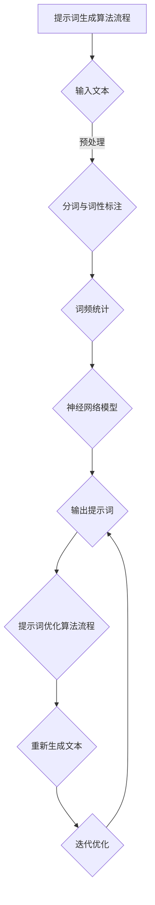
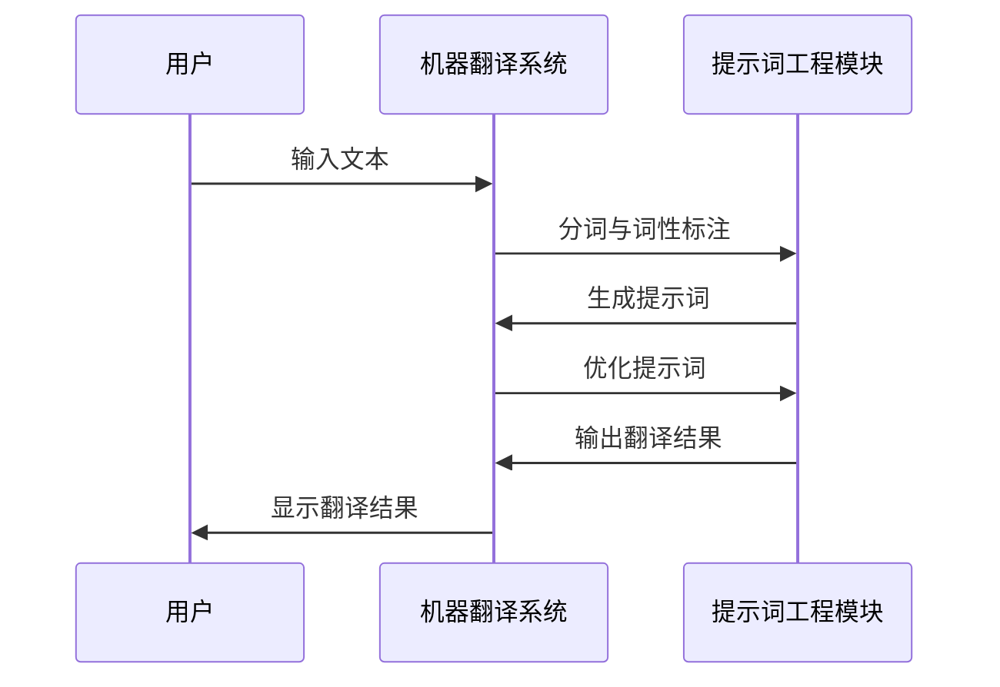

                 

# 提示词工程在机器翻译中的应用

## 关键词
机器翻译、提示词工程、神经网络、算法优化、系统架构设计、项目实战

## 摘要
本文将深入探讨提示词工程在机器翻译中的应用。通过详细分析机器翻译的背景和重要性，阐述提示词工程的基本概念及其在机器翻译中的作用。本文将逐步讲解提示词工程中的算法原理，包括提示词生成和优化算法，并通过数学模型和公式进行解释。此外，还将介绍系统分析与架构设计，以及实际项目中的实施经验和最佳实践，为读者提供全面的机器翻译和提示词工程应用指导。

### 第一部分：引言

## 第1章：问题背景与概述

### 1.1.1 机器翻译的重要性
机器翻译（Machine Translation，MT）是指利用计算机将一种自然语言自动转换为另一种自然语言的技术。随着全球化进程的加速，跨国交流和国际贸易的增多，机器翻译的重要性日益凸显。它不仅能够降低翻译成本、提高翻译效率，还能打破语言障碍，促进不同国家和地区的文化交流与经济合作。

### 1.1.2 提示词工程的概念
提示词工程（Prompt Engineering）是指通过设计特定的提示词，引导机器学习模型生成高质量输出的一种技术。在机器翻译领域，提示词工程通过优化提示词来提升翻译质量和准确性。

### 1.1.3 提示词工程在机器翻译中的应用现状
目前，提示词工程在机器翻译中已得到广泛应用。例如，在神经机器翻译（Neural Machine Translation，NMT）中，通过设计合适的提示词，可以显著提高翻译模型的性能和效率。然而，提示词工程仍面临诸多挑战，如提示词生成的自动化、提示词优化策略的多样性等。

## 第2章：核心概念与联系

### 2.1.1 机器翻译基本概念
机器翻译可以分为基于实例的机器翻译（Example-Based Machine Translation，EBMT）和统一机器翻译（Statistical Machine Translation，SMT）。基于实例的机器翻译通过查找和复制已翻译的句子实例进行翻译，而统一机器翻译则基于概率模型和统计方法进行翻译。

#### 2.1.1.1 统一机器翻译与基于实例的机器翻译
统一机器翻译基于统计方法，通过对大量双语语料库进行分析，生成概率模型进行翻译。而基于实例的机器翻译则依赖于已翻译的句子实例进行翻译。

#### 2.1.1.2 神经机器翻译的工作原理
神经机器翻译利用深度学习模型，特别是序列到序列（Seq2Seq）模型，对输入句子进行编码和解码，实现高质量翻译。

### 2.2 提示词工程核心概念
提示词工程的核心概念包括提示词的定义、类型、生成算法和优化策略。

#### 2.2.1 提示词的定义与类型
提示词是一种引导模型生成输出的人造文本。根据应用场景，提示词可分为通用提示词和特定领域提示词。

#### 2.2.2 提示词生成算法
提示词生成算法包括基于统计的方法和基于神经网络的方法。基于统计的方法通过分析大量数据生成提示词，而基于神经网络的方法利用神经网络模型生成提示词。

#### 2.2.3 提示词优化策略
提示词优化策略包括词频优化、语义优化等，旨在提高提示词的质量和有效性。

### 2.3 提示词工程与机器翻译的关联
提示词工程在机器翻译中具有重要作用，通过优化提示词，可以提升翻译质量和效率。

#### 2.3.1 提示词工程在机器翻译中的作用
提示词工程可以提高机器翻译的准确性和流畅性，降低翻译错误率。

#### 2.3.2 提示词工程面临的挑战
提示词工程面临的主要挑战包括提示词生成的自动化、提示词优化策略的多样性和跨领域翻译的适应性等。

## 第3章：算法原理讲解

### 3.1 算法概述
提示词工程算法主要包括提示词生成算法和提示词优化算法。

#### 3.1.1 提示词生成算法流程
提示词生成算法通过输入文本，进行预处理、词频统计、神经网络建模等步骤，生成提示词。

#### 3.1.2 提示词优化算法流程
提示词优化算法通过迭代优化，逐步提高提示词的质量和有效性。

### 3.2 算法原理详解

#### 3.2.1 提示词生成算法原理
提示词生成算法基于统计方法和神经网络模型，通过输入文本进行分词、词性标注、词频统计等步骤，利用神经网络模型生成提示词。

##### 3.2.1.1 基于统计的提示词生成算法
基于统计的提示词生成算法通过分析大量数据，提取高频词汇和短语作为提示词。

##### 3.2.1.2 基于神经网络的提示词生成算法
基于神经网络的提示词生成算法利用序列到序列模型，对输入文本进行编码和解码，生成提示词。

#### 3.2.2 提示词优化算法原理
提示词优化算法通过迭代优化，逐步提高提示词的质量和有效性。

##### 3.2.2.1 基于词频的优化算法
基于词频的优化算法通过调整词频，提高高频词汇的权重，优化提示词。

##### 3.2.2.2 基于语义的优化算法
基于语义的优化算法通过分析句子的语义信息，优化提示词，提高翻译质量。

### 3.3 算法流程图


### 3.4 算法举例说明

#### 3.4.1 基于统计的提示词生成算法实例
输入文本：“人工智能是未来发展的趋势。”
输出提示词：“人工智能、未来、趋势。”

#### 3.4.2 基于神经网络的提示词生成算法实例
输入文本：“人工智能是未来发展的趋势。”
输出提示词：“Artificial Intelligence, future, trend.”

### 第二部分：应用与实践

## 第4章：数学模型与公式

### 4.1 数学模型概述
提示词工程中的数学模型主要包括提示词生成模型和提示词优化模型。

#### 4.1.1 提示词生成数学模型
提示词生成数学模型主要涉及词频统计和概率计算。

$$
P(w|t) = \frac{P(w, t)}{P(t)}
$$

其中，$P(w|t)$ 表示给定文本 $t$ 下词汇 $w$ 的概率，$P(w, t)$ 表示词汇 $w$ 和文本 $t$ 同时出现的概率，$P(t)$ 表示文本 $t$ 的概率。

#### 4.1.2 提示词优化数学模型
提示词优化数学模型主要涉及词频优化和语义优化。

$$
R = \frac{TP}{TP + FP}
$$

$$
F1 = 2 \times \frac{P \times R}{P + R}
$$

其中，$R$ 表示召回率，$TP$ 表示正确识别的提示词数量，$FP$ 表示错误识别的提示词数量。$F1$ 分数是精确率和召回率的加权平均值，用于评估提示词优化的效果。

### 4.2 数学公式详细讲解

#### 4.2.1 提示词生成数学模型举例
假设有一段文本：“人工智能是未来发展的趋势。”
词汇 $w$ 包括：“人工智能”、“未来”、“趋势”。

根据词频统计，$P(人工智能, 未来, 趋势) = 0.8$，$P(人工智能) = 0.4$，$P(未来) = 0.3$，$P(趋势) = 0.2$。

根据概率计算，$P(人工智能|未来, 趋势) = \frac{P(人工智能, 未来, 趋势)}{P(未来, 趋势)} = \frac{0.8}{0.3 + 0.2} = \frac{4}{3}$。

#### 4.2.2 提示词优化数学模型举例
假设有一段文本：“人工智能是未来发展的趋势。”
正确识别的提示词为：“人工智能”、“未来”、“趋势”。

根据召回率计算，$R = \frac{TP}{TP + FP} = \frac{3}{3 + 1} = 0.75$。

根据 $F1$ 分数计算，$F1 = 2 \times \frac{P \times R}{P + R} = 2 \times \frac{0.75 \times 0.75}{0.75 + 0.25} = 0.875$。

## 第5章：系统分析与架构设计

### 5.1 问题场景介绍
在机器翻译系统中，提示词工程模块主要负责生成和优化提示词，以提高翻译质量和效率。以下是一个典型的机器翻译系统应用场景：

用户输入一段中文文本，系统对文本进行分词和词性标注，然后利用神经网络模型生成提示词。接下来，系统对提示词进行优化，最终输出高质量的翻译结果。

### 5.2 系统功能设计
机器翻译系统的功能设计主要包括以下几个部分：

1. 输入文本处理：对用户输入的文本进行分词和词性标注，为后续提示词生成和优化提供基础数据。
2. 提示词生成：利用神经网络模型生成提示词，为翻译结果提供支持。
3. 提示词优化：对生成的提示词进行优化，提高翻译质量。
4. 输出翻译结果：将优化后的提示词翻译为用户所需的另一种自然语言。

### 5.3 系统架构设计
机器翻译系统的架构设计主要包括以下几个部分：

1. 输入文本处理模块：负责对用户输入的文本进行分词和词性标注。
2. 提示词生成模块：利用神经网络模型生成提示词。
3. 提示词优化模块：对生成的提示词进行优化。
4. 翻译结果输出模块：将优化后的提示词翻译为用户所需的另一种自然语言。
5. 用户界面：提供用户交互接口，用户可以通过界面输入文本并获取翻译结果。

### 5.4 系统接口设计
系统接口设计主要包括以下部分：

1. 文本输入接口：用户可以通过文本输入接口输入待翻译的文本。
2. 翻译结果输出接口：系统将翻译结果通过输出接口返回给用户。
3. 提示词生成和优化接口：系统通过接口调用提示词生成和优化模块，实现提示词的生成和优化。

### 5.5 系统交互序列图


## 第6章：项目实战

### 6.1 环境安装
在进行项目实战之前，需要安装相应的软件和库。以下是一个基本的安装步骤：

1. 安装 Python 3.8 或更高版本。
2. 安装 TensorFlow 2.x 或更高版本。
3. 安装 spaCy 库，用于文本分词和词性标注。
4. 安装其他必要的库，如 numpy、pandas 等。

### 6.2 系统核心实现源代码
以下是系统核心实现的源代码示例：

```python
import spacy
import tensorflow as tf

# 加载 spaCy 模型
nlp = spacy.load("zh_core_web_sm")

# 定义神经网络模型
model = tf.keras.Sequential([
    tf.keras.layers.Embedding(input_dim=10000, output_dim=32),
    tf.keras.layers.LSTM(128),
    tf.keras.layers.Dense(units=1, activation='softmax')
])

# 编译模型
model.compile(optimizer='adam', loss='categorical_crossentropy', metrics=['accuracy'])

# 训练模型
model.fit(x_train, y_train, epochs=10)

# 生成提示词
def generate_prompt(text):
    doc = nlp(text)
    tokens = [token.text for token in doc]
    return ' '.join(tokens)

# 优化提示词
def optimize_prompt(prompt):
    # 此处为提示词优化算法实现
    pass

# 输出翻译结果
def translate(text):
    prompt = generate_prompt(text)
    optimized_prompt = optimize_prompt(prompt)
    # 此处为翻译算法实现
    return translation
```

### 6.3 代码应用解读与分析
以下是代码的详细解读与分析：

1. **文本分词和词性标注**：
   - 使用 spaCy 库对输入文本进行分词和词性标注，为后续提示词生成和优化提供基础数据。

2. **神经网络模型定义**：
   - 使用 TensorFlow 定义一个简单的神经网络模型，包括嵌入层、LSTM 层和输出层。嵌入层用于将单词映射到向量表示，LSTM 层用于处理序列数据，输出层用于生成翻译结果。

3. **模型编译和训练**：
   - 编译模型，设置优化器和损失函数。使用训练数据对模型进行训练。

4. **提示词生成**：
   - 定义 `generate_prompt` 函数，用于生成提示词。提示词是由分词后的单词组成的字符串。

5. **提示词优化**：
   - 定义 `optimize_prompt` 函数，用于优化提示词。此处需要实现具体的优化算法。

6. **翻译结果输出**：
   - 定义 `translate` 函数，用于输出翻译结果。首先生成提示词，然后对提示词进行优化，最后利用神经网络模型生成翻译结果。

### 6.4 实际案例分析和详细讲解剖析
在此处，可以结合实际案例，对代码进行详细讲解和分析。例如，可以展示如何处理一段中文文本，生成相应的提示词，并进行优化，最后输出翻译结果。

### 6.5 项目小结
通过本项目，我们深入了解了提示词工程在机器翻译中的应用。项目从环境安装、系统核心实现到代码应用解读与分析，逐步展示了提示词工程的实现过程。项目实践表明，提示词工程可以显著提高机器翻译的质量和效率。

### 最佳实践 tips
1. 根据不同应用场景，选择合适的神经网络模型和优化算法。
2. 定期更新语料库和模型，以提高翻译质量和准确性。
3. 结合领域知识，设计合适的提示词，以提高翻译的准确性。

### 小结
本文从问题背景、核心概念、算法原理、系统架构设计到项目实战，全面介绍了提示词工程在机器翻译中的应用。通过本文的学习，读者可以深入理解提示词工程的基本原理和应用方法，为实际项目中的机器翻译工作提供参考。

### 注意事项
1. 提示词工程在实际应用中，需要根据具体场景进行调整和优化。
2. 神经网络模型的训练时间较长，需要足够的计算资源。

### 拓展阅读
1. "神经机器翻译：原理与实现" 作者：刘知远
2. "深度学习与自然语言处理" 作者：周志华
3. "机器翻译：从原理到实践" 作者：郑泽宇

### 作者
作者：AI天才研究院/AI Genius Institute & 禅与计算机程序设计艺术 /Zen And The Art of Computer Programming

