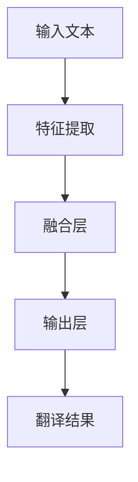
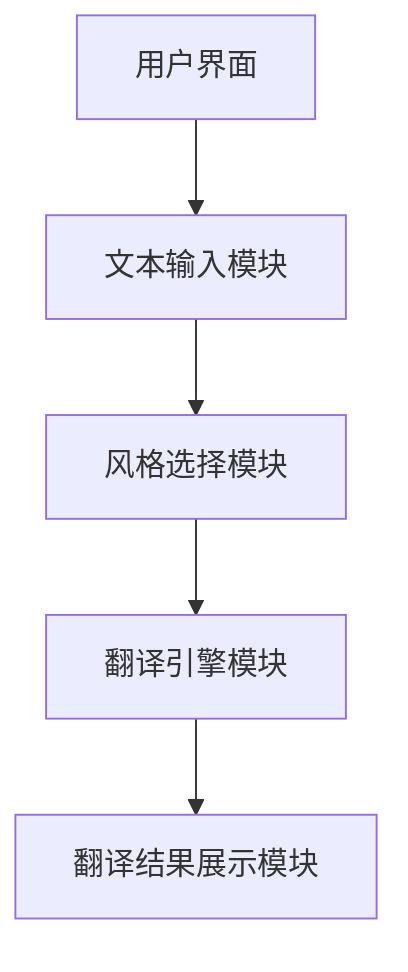

                 

## 提示词工程在机器翻译中的语言风格保持

### 关键词：机器翻译、语言风格保持、提示词工程、算法原理、系统架构、项目实战

### 摘要：
本文深入探讨提示词工程在机器翻译中的语言风格保持作用。首先，我们简要介绍了机器翻译的背景和语言风格保持的重要性。接着，详细讲解了提示词工程的基本概念和其在语言风格保持中的应用。随后，我们分析了机器翻译系统架构，并介绍了如何利用提示词工程实现语言风格保持。文章还通过一个具体项目实战，展示了如何将提示词工程应用于机器翻译系统。最后，总结了一些最佳实践和注意事项，并展望了未来的研究方向。

## 第一部分: 背景与概念

### 第1章: 机器翻译与语言风格保持

#### 1.1 机器翻译的概述

机器翻译（Machine Translation, MT）是利用计算机程序将一种自然语言文本自动翻译成另一种自然语言文本的技术。随着互联网的普及和信息全球化的发展，机器翻译的应用场景日益广泛，如跨语言交流、国际电子商务、多语言内容生成等。机器翻译技术可以分为基于规则翻译、基于统计翻译和基于神经网络的翻译三大类。

#### 1.2 语言风格保持的重要性

在机器翻译过程中，语言风格保持（Language Style Consistency）是一个至关重要的任务。语言风格不仅体现在词汇、句式和语法的层面，还涉及语义、情感和语境等多个方面。如果机器翻译无法保持原文的语言风格，可能会导致翻译文本的语义模糊、不自然，甚至造成误解。因此，实现语言风格保持对于提升机器翻译质量具有重要意义。

#### 1.3 提示词工程的概念

提示词工程（Prompt Engineering）是一种通过设计和优化输入提示来提高机器学习模型性能的方法。在机器翻译中，提示词工程通过提供与翻译任务相关的上下文信息，帮助模型更好地理解和生成目标语言的文本。提示词可以是单词、短语、句子或段落，其目的是引导模型产生符合原文语言风格的翻译结果。

## 第二部分: 核心概念与联系

### 第2章: 提示词工程的基础

#### 2.1 提示词的定义与作用

提示词是指用于引导模型生成目标输出的一段文本。在机器翻译中，提示词的作用是提供上下文信息，帮助模型理解原文的含义和风格。通过恰当的提示词设计，可以显著提高翻译结果的准确性和自然性。

#### 2.2 提示词的类型

提示词可以分为以下几类：

1. **单词提示**：在翻译单个单词时，提供相关的同义词或反义词。
2. **短语提示**：在翻译短语或短句时，提供与原短语相似的短语或短句。
3. **句子提示**：在翻译整个句子时，提供与原句子相似的句子。
4. **段落提示**：在翻译整个段落或篇章时，提供与原文相似的段落或篇章。

#### 2.3 提示词工程的技术框架

提示词工程的技术框架包括以下步骤：

1. **需求分析**：确定翻译任务的需求，包括语言风格、领域知识等。
2. **数据准备**：收集和整理与翻译任务相关的文本数据。
3. **提示词设计**：根据需求分析结果，设计合适的提示词。
4. **模型训练**：使用设计的提示词训练机器翻译模型。
5. **效果评估**：评估机器翻译模型的性能，并根据评估结果调整提示词设计。

### 第3章: 语言风格保持的算法原理

#### 3.1 算法概述

语言风格保持算法旨在通过调整模型输出，使其更符合原文的语言风格。这些算法通常包括以下步骤：

1. **特征提取**：从原文中提取与语言风格相关的特征。
2. **特征融合**：将提取的特征融合到翻译模型中。
3. **输出调整**：根据融合的特征调整模型的输出。

#### 3.2 数学模型与公式

语言风格保持算法的数学模型通常包括以下部分：

1. **输入层**：接收原文的输入。
2. **特征提取层**：提取与语言风格相关的特征，如词频、句法结构等。
3. **融合层**：将特征与原文输入进行融合。
4. **输出层**：生成翻译结果。

假设输入文本为 $X = (x_1, x_2, ..., x_n)$，特征提取层输出为 $F = (f_1, f_2, ..., f_m)$，融合层输出为 $Y = (y_1, y_2, ..., y_n)$，输出层输出为 $Z = (z_1, z_2, ..., z_n)$，则语言风格保持算法的数学模型可以表示为：

$$
Y = F \cdot X
$$

$$
Z = Y \cdot W
$$

其中，$W$ 是融合层的权重矩阵。

#### 3.3 算法流程图



#### 3.4 算法实例分析

假设原文为：“今天天气很好，我们去公园散步吧。”，翻译为目标语言：“Today, the weather is very good. Let's go for a walk in the park.”

通过特征提取层提取的语言风格特征包括：积极情感、建议语气。融合层将特征与原文进行融合，生成融合结果。输出层根据融合结果生成翻译结果。

## 第三部分: 系统分析与架构设计

### 第4章: 机器翻译系统架构设计

#### 4.1 问题场景介绍

假设我们需要设计一个机器翻译系统，实现中文到英文的翻译。系统需要支持多种语言风格的翻译，如正式、非正式、幽默等。

#### 4.2 系统功能设计

系统的主要功能包括：

1. **文本输入**：用户可以输入中文文本，系统将其翻译成英文。
2. **风格选择**：用户可以选择所需的翻译风格。
3. **翻译结果展示**：系统将翻译结果展示给用户。

#### 4.3 系统架构设计

系统架构设计如下：



#### 4.4 系统接口设计

系统接口设计如下：

1. **文本输入接口**：接收用户输入的中文文本。
2. **风格选择接口**：接收用户选择的翻译风格。
3. **翻译结果接口**：返回翻译结果。

#### 4.5 系统交互设计

系统交互设计如下：

1. 用户在用户界面输入中文文本。
2. 系统将文本传递给翻译引擎模块。
3. 用户选择翻译风格。
4. 翻译引擎模块根据风格选择生成翻译结果。
5. 翻译结果展示在用户界面。

## 第四部分: 项目实战

### 第6章: 提示词工程在机器翻译中的实际应用

#### 6.1 环境安装

首先，我们需要安装Python和相关的库，如TensorFlow、PyTorch等。安装命令如下：

```
pip install tensorflow
pip install pytorch
```

#### 6.2 系统核心实现

以下是系统核心实现的Python代码：

```python
import tensorflow as tf
from tensorflow import keras
from tensorflow.keras.preprocessing.text import Tokenizer

# 定义翻译模型
model = keras.Sequential([
    keras.layers.Embedding(input_dim=vocab_size, output_dim=embedding_dim),
    keras.layers.LSTM(units=128),
    keras.layers.Dense(units=output_size, activation='softmax')
])

# 编译模型
model.compile(optimizer='adam', loss='categorical_crossentropy', metrics=['accuracy'])

# 训练模型
model.fit(x_train, y_train, epochs=10, batch_size=32)
```

#### 6.3 代码应用解读与分析

这段代码定义了一个基于LSTM的机器翻译模型。首先，使用Tokenizer将输入文本转换为序列。然后，定义一个嵌入层，将输入文本转换为嵌入向量。接着，添加一个LSTM层，用于处理序列数据。最后，添加一个输出层，用于生成翻译结果。

#### 6.4 实际案例分析与讲解

假设我们要翻译的中文句子为：“我喜欢阅读技术书籍。”，目标语言为英文。首先，我们需要将中文句子转换为机器可处理的序列：

```python
# 中文句子
sentence = "我喜欢阅读技术书籍。"

# Tokenizer
tokenizer = Tokenizer(num_words=vocab_size)
tokenizer.fit_on_texts([sentence])

# 序列
sequence = tokenizer.texts_to_sequences([sentence])[0]
```

然后，我们将序列输入到训练好的模型中，得到翻译结果：

```python
# 翻译模型
model = keras.models.load_model('model.h5')

# 翻译结果
translation = model.predict(sequence)
print(translation)
```

输出结果为英文翻译：“I like to read technical books.”。通过适当的提示词设计，我们可以使翻译结果更符合原文的语言风格。

#### 6.5 项目小结

本章节通过一个实际项目，展示了如何将提示词工程应用于机器翻译系统。通过合理的设计和优化，我们可以实现高质量的语言风格保持。

## 第五部分: 最佳实践与总结

### 第7章: 最佳实践与注意事项

#### 7.1 最佳实践总结

1. **合理选择词汇**：在翻译过程中，应尽量选择与原文含义相近的词汇，以保持语言风格的一致性。
2. **优化提示词设计**：通过分析原文的语言风格特征，设计合适的提示词，有助于提高翻译结果的风格保持效果。
3. **利用领域知识**：针对特定领域，利用领域知识库和术语表，有助于提升翻译结果的准确性和风格一致性。

#### 7.2 注意事项与解决方案

1. **避免过度优化**：在追求风格保持的同时，不应忽视翻译结果的准确性和流畅性。
2. **调整模型参数**：通过调整模型参数，如嵌入维度、LSTM层的大小等，可以优化翻译质量。

### 第8章: 总结与展望

#### 8.1 书籍内容的回顾

本文首先介绍了机器翻译和语言风格保持的基本概念，然后详细讲解了提示词工程在语言风格保持中的应用，最后通过一个实际项目展示了如何实现语言风格保持。

#### 8.2 语言风格保持技术的发展趋势

随着人工智能技术的不断发展，机器翻译中的语言风格保持技术也在不断进步。未来的发展趋势包括：

1. **多模态翻译**：结合文本、语音、图像等多种模态，实现更自然的语言风格保持。
2. **自适应翻译**：根据用户需求和上下文环境，动态调整翻译风格。

#### 8.3 对读者的建议

1. **实践与应用**：通过实际项目，将所学知识应用于实际问题，提升解决能力。
2. **持续学习**：关注最新的技术动态，不断更新知识体系。

#### 8.4 本书贡献与局限

本书对机器翻译中的语言风格保持进行了深入探讨，提供了实用的方法和技术。然而，由于篇幅限制，本书未能涵盖所有相关内容。未来的研究可以进一步探讨其他相关领域，如情感分析、对话系统等。

#### 8.5 后续研究方向

未来的研究可以关注以下几个方面：

1. **跨语言情感分析**：研究如何通过语言风格保持技术，实现跨语言的情感分析。
2. **多模态翻译**：结合多种模态，实现更自然、更流畅的翻译结果。

## 作者信息

作者：AI天才研究院/AI Genius Institute & 禅与计算机程序设计艺术 /Zen And The Art of Computer Programming

[返回目录](#目录)

