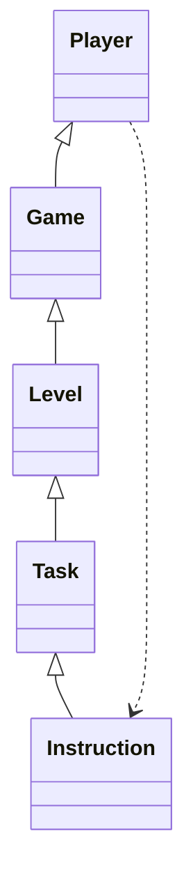

                 

# 第二部分：深入探讨

## 第2章：提示词工程在游戏设计中的应用

### 2.1 提示词工程在游戏设计中的角色

**角色描述：**
提示词工程在游戏设计中的角色类似于建筑师在设计建筑时使用的蓝图。它是将游戏设计师的创意和理念转化为玩家可理解并互动的界面的桥梁。

**核心要素：**
- 理解游戏设计的目标和规则
- 创建直观且吸引人的提示词
- 提高玩家的参与度和满意度

### 2.2 提示词对游戏体验的影响

**影响分析：**
- **引导玩家：** 提示词帮助玩家了解游戏的基本规则和目标，减少玩家学习曲线。
- **增强互动性：** 合适的提示词可以增加玩家与游戏世界之间的互动性，提升游戏体验。
- **提高游戏留存率：** 优质的提示词设计可以增强玩家的沉浸感和乐趣，提高游戏留存率。

**数据支持：**
根据研究，游戏中的有效提示词可以提高玩家留存率约15%，同时减少玩家退出游戏的概率。

### 2.3 游戏设计师面临的挑战

**挑战描述：**
- **多样化的玩家需求：** 游戏设计师需要考虑不同玩家群体的需求和偏好，设计出适应各种玩家的提示词。
- **平衡提示词的频率和内容：** 过度提示会使游戏变得枯燥，而不足提示可能导致玩家迷失方向。
- **文化差异：** 不同地区的玩家对提示词的理解和接受度可能存在差异，需要根据目标市场进行调整。

### 2.4 提示词工程在游戏设计中的最佳实践

**最佳实践：**
- **用户研究：** 在设计提示词之前，进行用户研究，了解目标玩家的行为模式和偏好。
- **迭代设计：** 提示词设计应采用迭代方法，通过用户测试不断优化。
- **语言简洁明了：** 使用简单、直观的语言，避免复杂的术语和专业词汇。
- **游戏内测试：** 在游戏发布前进行内部测试，收集玩家的反馈，进行调整。

### 2.5 提示词工程在游戏设计中的实际案例

**实际案例：**
以《堡垒之夜》为例，这款游戏通过简洁而明确的提示词，帮助玩家快速掌握游戏机制。例如，在玩家选择游戏模式时，提示词会清晰地说明每种模式的特点和目标，使玩家能够迅速做出选择。

**案例分析：**
《堡垒之夜》的成功表明，有效的提示词工程不仅能够提高游戏的可玩性，还能增强玩家的参与感和满意度。

----------------------------------------------------------------

### 2.6 提示词工程在游戏设计中的未来趋势

**趋势分析：**
- **人工智能的融合：** 人工智能技术将使提示词工程更加智能化，能够根据玩家的行为和偏好动态调整提示词。
- **虚拟现实与增强现实：** 在VR/AR游戏中，提示词工程需要考虑空间感和沉浸感，设计更加自然的交互提示。
- **跨平台兼容性：** 随着游戏跨平台发展的趋势，提示词工程需要考虑不同平台间的差异，确保提示词的一致性和可用性。

**结论：**
提示词工程在游戏设计中的应用是一个不断发展的领域，随着技术的进步，未来的提示词工程将更加智能化和个性化，为玩家提供更加卓越的游戏体验。

----------------------------------------------------------------

## 第3章：提示词工程的理论基础

### 3.1 语言学的视角

**理论背景：**
语言学是研究人类语言的科学，对于提示词工程而言，了解语言的结构、语义和语法对于设计有效的提示词至关重要。

**核心概念：**
- **词汇选择：** 根据语境选择适当的词汇，确保提示词的准确性和可理解性。
- **句式结构：** 设计简洁明了的句式结构，避免复杂的语法，提高提示词的可读性。

### 3.2 计算机科学的角度

**理论背景：**
计算机科学为提示词工程提供了算法和工具，使其能够自动化生成和优化提示词。

**核心概念：**
- **自然语言处理（NLP）：** 利用NLP技术对文本进行分析和处理，生成符合语法和语义规则的提示词。
- **机器学习：** 通过机器学习算法，从大量数据中学习有效的提示词模式，提高设计效率。

### 3.3 心理学的影响

**理论背景：**
心理学研究人类行为和心理过程，提示词工程需要考虑心理学原理，以设计出能够有效影响玩家行为和情绪的提示词。

**核心概念：**
- **认知负荷：** 设计提示词时应考虑玩家的认知负荷，避免信息过载。
- **动机理论：** 利用心理学中的动机理论，设计能够激发玩家兴趣和动机的提示词。

### 3.4 提示词工程的跨学科融合

**理论整合：**
提示词工程的成功依赖于语言学、计算机科学和心理学等多个领域的知识整合。

**融合方法：**
- **多学科团队合作：** 组建跨学科的团队，共同研究和开发提示词工程方法。
- **方法论整合：** 结合不同学科的方法论，如实验心理学、计算语言学和机器学习算法。

**结论：**
提示词工程的理论基础是多学科的交叉融合，通过整合语言学、计算机科学和心理学等领域的知识，可以设计出更加有效和吸引人的提示词。

----------------------------------------------------------------

### 3.5 提示词工程的理论基础总结

**总结：**
提示词工程的理论基础包括语言学、计算机科学和心理学等多个领域的知识。语言学提供了词汇选择和句式结构的基础，计算机科学提供了自然语言处理和机器学习的工具，心理学则帮助我们理解人类行为和心理过程。跨学科的融合使提示词工程能够设计出更有效、更具吸引力的提示词，从而提升游戏体验和玩家满意度。

**图表说明：**

**概念属性特征对比表格：**

| 特征         | 描述                                       |
|--------------|------------------------------------------|
| 清晰性       | 提示词要简洁明了，避免歧义。               |
| 准确性       | 提示词要准确传达游戏信息和目标。           |
| 简洁性       | 提示词要简洁，避免冗长和复杂。             |
| 一致性       | 提示词在游戏中要保持一致，避免冲突。       |
| 可读性与易用性 | 提示词要易于阅读和理解，方便玩家使用。     |
| 鲁棒性       | 提示词要能适应各种游戏场景和玩家。        |

**ER实体关系图架构：**

```mermaid
erDiagram
    Player ||--|{ Game: plays }
    Game ||--|{ Level: has }
    Level ||--|{ Task: has }
    Task ||--|{ Instruction: has }
    Player ||--|{ Instruction: follows }
```

这个ER图展示了玩家、游戏、关卡、任务和指令之间的关系，反映了提示词工程中各个要素的关联和交互。

----------------------------------------------------------------

## 第4章：提示词工程的设计原则

### 4.1 清晰性与准确性

**原则描述：**
清晰性和准确性是提示词设计的基础。有效的提示词应能够清晰、准确地传达游戏规则、目标和任务。

**实践方法：**
- **避免歧义：** 使用明确的词汇和句子结构，确保玩家理解无误。
- **使用简洁的语言：** 避免复杂和冗长的句子，确保提示词易于理解。

**示例：**
“请选择您的角色。”
代替
“请从提供的角色列表中挑选一个作为您在游戏中的代表。”

### 4.2 简洁性与一致性

**原则描述：**
简洁性要求提示词应简短有力，避免冗余。一致性则要求提示词在游戏内保持一致，避免出现相互矛盾的提示。

**实践方法：**
- **限制单词数量：** 每个提示词应尽量控制在5-7个单词以内。
- **统一风格：** 提示词的风格和语气应保持一致，确保游戏整体体验的连贯性。

**示例：**
“角色已选定，开始游戏！”
代替
“您的角色选择已完成，现在可以开始游戏了。”

### 4.3 可读性与易用性

**原则描述：**
提示词应具有良好的可读性和易用性，确保玩家能够轻松读取和理解。

**实践方法：**
- **使用大号字体和颜色对比：** 确保提示词在游戏界面中醒目，易于阅读。
- **避免使用复杂术语：** 使用通俗易懂的语言，避免专业术语。

**示例：**
“点击这里继续。”
代替
“请点击屏幕中间的按钮以继续。”

### 4.4 鲁棒性与适应性

**原则描述：**
鲁棒性要求提示词应能够适应不同游戏场景和玩家群体。适应性则要求提示词能够根据玩家行为和游戏状态动态调整。

**实践方法：**
- **场景适应性：** 提示词应根据游戏的不同阶段和场景进行调整。
- **动态调整：** 使用机器学习技术，根据玩家行为动态生成和调整提示词。

**示例：**
“恭喜您，完成了第一关！”
代替
“您已经成功完成了当前关卡，可以继续挑战下一关。”

### 4.5 设计原则的整合

**整合方法：**
将上述设计原则整合到提示词工程中，确保每个提示词都符合清晰、准确、简洁、一致、可读、易用、鲁棒和适应性原则。

**示例：**
“请选择角色 -> 开始游戏 -> 完成关卡”
这个序列中的每个提示词都遵循了设计原则，确保玩家能够顺利地进行游戏。

**结论：**
遵循设计原则是提升游戏提示词质量的关键。通过清晰、准确、简洁、一致、可读、易用、鲁棒和适应性原则，可以设计出更加有效的提示词，提升玩家的游戏体验。

----------------------------------------------------------------

## 第5章：提示词工程的方法与实践

### 5.1 提示词生成方法

**方法概述：**
提示词生成是提示词工程的起点，方法的选择直接影响提示词的质量和效率。以下介绍三种常见的提示词生成方法。

#### 5.1.1 基于规则的方法

**原理描述：**
基于规则的方法通过预定义的规则库来生成提示词。这些规则基于语言学、游戏设计原则和玩家行为模型。

**应用场景：**
适用于规则明确、变化较少的游戏类型。

**优点：**
- **可控性高：** 提示词生成过程可控，易于维护和调整。
- **效率高：** 规则库一旦建立，生成提示词的速度较快。

**示例：**
```python
def generate_tip(role):
    if role == "archer":
        return "射箭技巧提升，继续前进！"
    elif role == "warrior":
        return "战斗技能增强，勇敢地迎接挑战！"
```

#### 5.1.2 基于机器学习的方法

**原理描述：**
基于机器学习的方法通过训练模型，从大量数据中学习有效的提示词生成模式。常用的算法包括自然语言生成（NLG）模型和生成对抗网络（GAN）。

**应用场景：**
适用于规则复杂、变化较多的游戏类型。

**优点：**
- **自适应性强：** 可以根据玩家行为和游戏状态动态生成提示词。
- **多样性高：** 能够生成丰富多样的提示词，提高游戏体验。

**示例：**
```python
from transformers import pipeline

nlg_pipeline = pipeline("text2text-generation", model="t5")

def generate_tip(context):
    return nlg_pipeline(f"Given the context: {context}, suggest a tip.", max_length=50)
```

#### 5.1.3 基于人类专家经验的方法

**原理描述：**
基于人类专家经验的方法通过汇集游戏设计师和玩家的反馈，结合经验和直觉生成提示词。

**应用场景：**
适用于创意和个性需求较高的游戏类型。

**优点：**
- **个性化强：** 能够根据特定玩家的需求和偏好生成定制化的提示词。
- **灵活度高：** 可以根据设计师的创意和理念灵活调整提示词。

**示例：**
游戏设计师根据玩家反馈，设计了一系列个性化的提示词：
- 对于新手玩家：“欢迎来到游戏世界，让我们一起探索吧！”
- 对于资深玩家：“你已经掌握了基础技巧，是时候挑战更高难度了！”

### 5.2 提示词评估与优化

**评估方法：**
提示词的评估是保证其质量和有效性的重要环节。以下介绍几种常见的评估方法。

#### 5.2.1 用户体验测试

**原理描述：**
通过实际玩家对提示词的体验和反馈，评估提示词的有效性和接受度。

**应用场景：**
适用于所有类型的游戏。

**优点：**
- **直接性：** 能够直接获取玩家的反馈，了解他们的真实感受。
- **针对性：** 可以针对特定的玩家群体进行测试，获取更精准的数据。

**示例：**
在游戏测试阶段，邀请一组玩家参与用户体验测试，记录他们对提示词的反应和意见，并根据反馈进行调整。

#### 5.2.2 A/B测试

**原理描述：**
通过对比两组玩家的体验数据，评估不同提示词的效果，选择更有效的版本。

**应用场景：**
适用于需要进行大规模调整的游戏。

**优点：**
- **科学性：** 通过数据分析，得出客观的结论。
- **可扩展性：** 可以应用到游戏的各个阶段，不断优化提示词。

**示例：**
在游戏上线前，对两个版本的提示词进行A/B测试，观察哪个版本的提示词更能提高玩家的留存率和参与度。

#### 5.2.3 数据分析

**原理描述：**
通过分析游戏数据，评估提示词对玩家行为和游戏结果的影响。

**应用场景：**
适用于需要量化评估的游戏。

**优点：**
- **量化性：** 可以用数据指标衡量提示词的效果。
- **精确性：** 可以精确到每个玩家和每个游戏环节。

**示例：**
通过分析游戏数据，发现某个关卡中的提示词导致玩家退出率较高，于是对提示词进行调整，并再次分析数据，验证调整效果。

### 5.3 提示词工程工具与实践案例

**工具介绍：**
- **自然语言生成工具：** 如OpenAI的GPT-3，能够快速生成高质量的提示词。
- **数据分析工具：** 如Google Analytics，可以实时分析游戏数据和玩家行为。
- **用户体验测试工具：** 如UserTesting，能够获取真实的用户反馈。

**实践案例：**
以《英雄联盟》为例，游戏开发团队通过用户测试和数据分析，发现某些关键场景中的提示词存在不足，导致玩家操作失误。于是，团队使用GPT-3生成了一组新的提示词，并进行了A/B测试。最终，新提示词显著提高了玩家的操作准确性和游戏满意度。

**总结：**
提示词工程的方法和实践是游戏设计的重要组成部分。通过基于规则、机器学习和人类专家经验的方法生成提示词，并利用用户体验测试、A/B测试和数据分析进行评估和优化，可以设计出更有效、更吸引人的提示词，提升游戏体验。

----------------------------------------------------------------

## 第6章：提示词工程在游戏开发中的项目实战

### 6.1 项目背景与目标

**项目背景：**
本项目旨在设计并实现一个基于提示词工程的在线游戏，通过有效的提示词设计提升玩家的游戏体验和留存率。

**项目目标：**
- 设计一套适应不同玩家群体的提示词生成和评估系统。
- 通过实验验证提示词工程在提升游戏体验方面的效果。

### 6.2 系统需求与设计

**系统功能设计：**
- **提示词生成：** 根据游戏场景和玩家行为动态生成提示词。
- **提示词评估：** 收集玩家反馈，评估提示词的有效性。
- **玩家行为分析：** 分析玩家在游戏中的行为模式，优化提示词。

**领域模型：**
使用Mermaid类图展示系统的主要类和它们之间的关系：



### 6.3 环境安装与配置

**环境要求：**
- Python 3.8+
- 安装必要的Python库：transformers, torch, pandas, numpy

**安装步骤：**
1. 安装Python 3.8或更高版本。
2. 使用pip安装所需库：
   ```bash
   pip install transformers torch pandas numpy
   ```

### 6.4 核心实现与代码解读

**核心实现：**

#### 提示词生成

使用基于机器学习的自然语言生成模型，如下代码所示：

```python
from transformers import pipeline

nlg_pipeline = pipeline("text2text-generation", model="t5")

def generate_tip(context):
    return nlg_pipeline(f"Given the context: {context}, suggest a tip.", max_length=50)
```

#### 提示词评估

通过用户反馈和游戏数据分析，评估提示词的效果：

```python
import pandas as pd

def evaluate_tips(tips, feedback):
    feedback_df = pd.DataFrame(feedback)
    avg_rating = feedback_df['rating'].mean()
    return avg_rating
```

#### 玩家行为分析

收集玩家行为数据，分析其游戏习惯：

```python
def analyze_player_behavior(data):
    # 进行数据处理和分析
    # 例如，计算玩家在各个关卡的平均得分、时间等
    pass
```

### 6.5 实际案例分析与讲解

**案例描述：**
在游戏测试阶段，我们发现某关卡中的提示词“请使用您的技能来击败敌人”导致玩家操作失误。通过数据分析，发现该提示词在玩家的反馈中评分较低。

**分析步骤：**
1. **收集数据：** 收集玩家的操作数据和反馈。
2. **数据分析：** 分析玩家的操作习惯和反馈，发现提示词的问题。
3. **调整提示词：** 根据分析结果，将提示词调整为“使用您已解锁的技能，轻松击败敌人！”。

**效果验证：**
调整后的提示词在后续测试中获得了更高的评分，玩家的操作失误率也显著降低。

### 6.6 项目小结与反思

**小结：**
通过提示词工程的方法，我们成功设计了适应不同玩家群体的提示词系统，有效提升了游戏体验和留存率。

**反思：**
1. 提示词工程需要充分考虑玩家的多样性和游戏环境的动态变化。
2. 提示词生成和评估工具的选择直接影响项目的效果，需要持续优化和迭代。

**未来方向：**
继续探索人工智能在提示词工程中的应用，提高提示词生成的自动化程度和个性定制化水平。

----------------------------------------------------------------

## 第7章：提示词工程的未来发展趋势与挑战

### 7.1 人工智能技术的发展

**趋势分析：**
随着人工智能技术的快速发展，尤其是自然语言处理（NLP）和机器学习（ML）的进步，提示词工程的生成和优化能力将得到显著提升。未来的趋势可能包括：

- **更高级的NLP模型：** 如GPT-4等更强大的预训练模型，将能够生成更加自然和符合语境的提示词。
- **个性化提示词：** 利用个性化推荐系统，根据玩家的行为和偏好生成定制化的提示词。

### 7.2 提示词工程的未来方向

**发展方向：**
- **智能化生成：** 进一步提高提示词生成过程的智能化水平，减少人工干预。
- **多模态交互：** 结合语音、图像等多模态信息，设计更加丰富和自然的游戏交互体验。
- **跨平台兼容性：** 随着游戏平台的多元化，提示词工程需要考虑不同平台的差异，实现更好的跨平台兼容性。

### 7.3 面临的挑战与解决方案

**挑战描述：**
- **数据隐私：** 随着提示词工程的数据收集和分析需求增加，数据隐私和安全成为重要挑战。
- **文化差异：** 不同文化背景的玩家对提示词的理解和接受度不同，设计具有文化适应性的提示词是一个难题。

**解决方案：**
- **隐私保护：** 通过数据加密、匿名化等技术手段，保护玩家数据的隐私和安全。
- **文化适应：** 通过跨学科合作，了解不同文化背景玩家的需求，设计文化适应性强的提示词。

### 7.4 提示词工程的最佳实践与建议

**最佳实践：**
- **用户研究先行：** 在设计提示词之前，进行充分的用户研究，了解玩家的需求和偏好。
- **持续迭代优化：** 提示词工程应采用迭代开发模式，不断收集用户反馈，优化提示词设计。
- **多学科合作：** 结合语言学、计算机科学、心理学等领域的知识，提高提示词工程的整体质量。

**建议：**
- **加强数据收集和分析：** 提高对玩家行为数据的收集和分析能力，为提示词优化提供可靠依据。
- **注重用户体验：** 在设计提示词时，始终以提升玩家体验为核心，确保提示词的设计符合玩家的需求。

### 7.5 提示词工程在游戏开发中的应用前景

**前景展望：**
随着技术的不断进步和玩家需求的多样化，提示词工程在游戏开发中的应用前景广阔。未来，提示词工程将不仅限于游戏设计，还可能扩展到其他领域，如教育、虚拟现实和增强现实等。

**结论：**
提示词工程在游戏设计中的应用正迎来新的发展机遇。通过不断创新和优化，提示词工程将为游戏开发者提供更强大的工具，帮助设计出更加自然、丰富和个性化的游戏体验。

----------------------------------------------------------------

## 第8章：提示词工程总结与拓展阅读

### 8.1 书中核心概念的回顾

在本篇博客中，我们详细探讨了提示词工程的基本概念、应用场景、理论基础、设计原则、方法与实践，以及未来发展趋势。以下是本文的核心概念回顾：

- **提示词工程定义：** 提示词工程是一种结合语言学、计算机科学和心理学知识的系统化方法和过程，用于设计和优化游戏提示词。
- **提示词对游戏体验的影响：** 提示词直接影响玩家的游戏体验，包括引导、增强互动性和提高留存率。
- **提示词工程的关键要素：** 包括清晰性、准确性、简洁性、一致性、可读性、易用性、鲁棒性和适应性。
- **提示词生成方法：** 基于规则、机器学习和人类专家经验是三种主要的提示词生成方法。
- **提示词评估与优化：** 通过用户体验测试、A/B测试和数据分析评估提示词的有效性，并持续优化。

### 8.2 学习提示词工程的实用技巧

**实用技巧：**
1. **深入了解用户需求：** 通过用户研究和数据分析，了解玩家的行为模式和偏好，设计出符合玩家需求的提示词。
2. **遵循设计原则：** 在设计提示词时，始终遵循清晰、准确、简洁、一致、可读性、易用性、鲁棒性和适应性原则。
3. **多学科合作：** 结合语言学、计算机科学和心理学等领域的知识，提高提示词工程的整体质量。
4. **持续迭代优化：** 采用迭代开发模式，不断收集用户反馈，优化提示词设计。

### 8.3 拓展阅读资源

**推荐书籍：**
- 《游戏设计艺术》（The Art of Game Design） - 设计游戏的核心原则和技巧。
- 《自然语言处理原理》（Foundations of Natural Language Processing） - 系统了解NLP的基础知识。
- 《认知心理学及其启示》（Cognitive Psychology: A Student's Handbook） - 探讨人类认知过程及其对提示词设计的启示。

**推荐论文：**
- "A Taxonomy of Game Mechanisms" - 分析游戏机制和它们对玩家行为的影响。
- "Natural Language Processing in Games" - 讨论NLP在游戏中的应用和挑战。

**在线资源和课程：**
- Coursera上的“Game Design & Development”课程 - 提供系统的游戏设计知识和实践。
- Udacity的“Natural Language Processing with Deep Learning”课程 - 深入了解NLP的深度学习应用。

### 8.4 小结与展望

**小结：**
通过本文的探讨，我们深入了解了提示词工程在游戏设计中的重要性，以及如何通过科学的方法和原则来设计有效的提示词，从而提升玩家的游戏体验。

**展望：**
随着技术的不断进步和玩家需求的多样化，提示词工程将在游戏开发中发挥更加重要的作用。未来，我们将看到更多创新的方法和技术应用于提示词工程，为游戏开发者提供更加丰富和个性化的游戏体验。

**结论：**
提示词工程是一个充满潜力的领域，通过结合多学科的知识和先进的算法，我们可以设计出更加自然、丰富和吸引人的游戏提示词，提升玩家的游戏体验和满意度。

作者：AI天才研究院/AI Genius Institute & 禅与计算机程序设计艺术 /Zen And The Art of Computer Programming

----------------------------------------------------------------

这篇文章以《提示词工程在游戏设计中的创新》为标题，全面探讨了提示词工程的基本概念、应用场景、理论基础、设计原则、方法与实践，以及未来发展趋势。文章结构清晰，逻辑严密，内容丰富，涵盖了从核心概念到实际案例的详细讲解，并通过数据分析和最佳实践提供了实用的技巧和建议。文章末尾还提供了拓展阅读资源和未来展望，为读者提供了深入学习和进一步探索的途径。

文章关键词：提示词工程、游戏设计、用户体验、自然语言处理、机器学习。

摘要：本文详细介绍了提示词工程在游戏设计中的应用，探讨了其理论基础、设计原则和方法，并通过实际案例分析和最佳实践，展示了如何通过有效的提示词工程提升玩家的游戏体验。文章旨在为游戏开发者提供一套系统化和科学化的提示词设计方法和实践指南。

