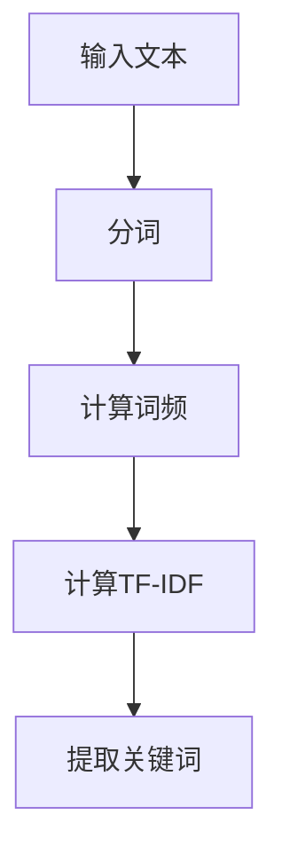
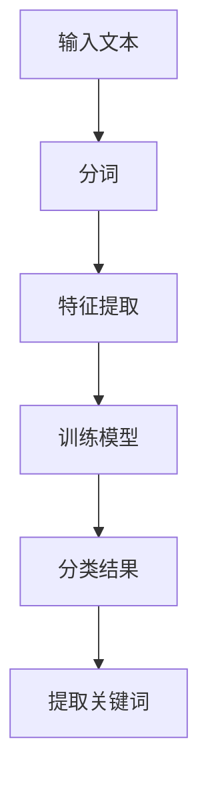
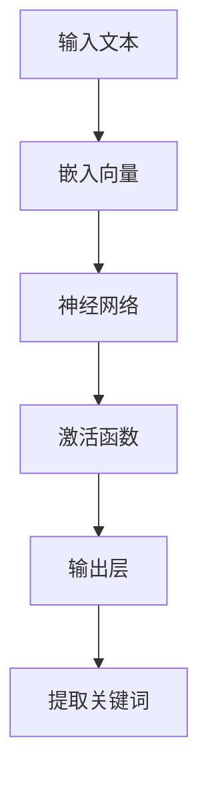
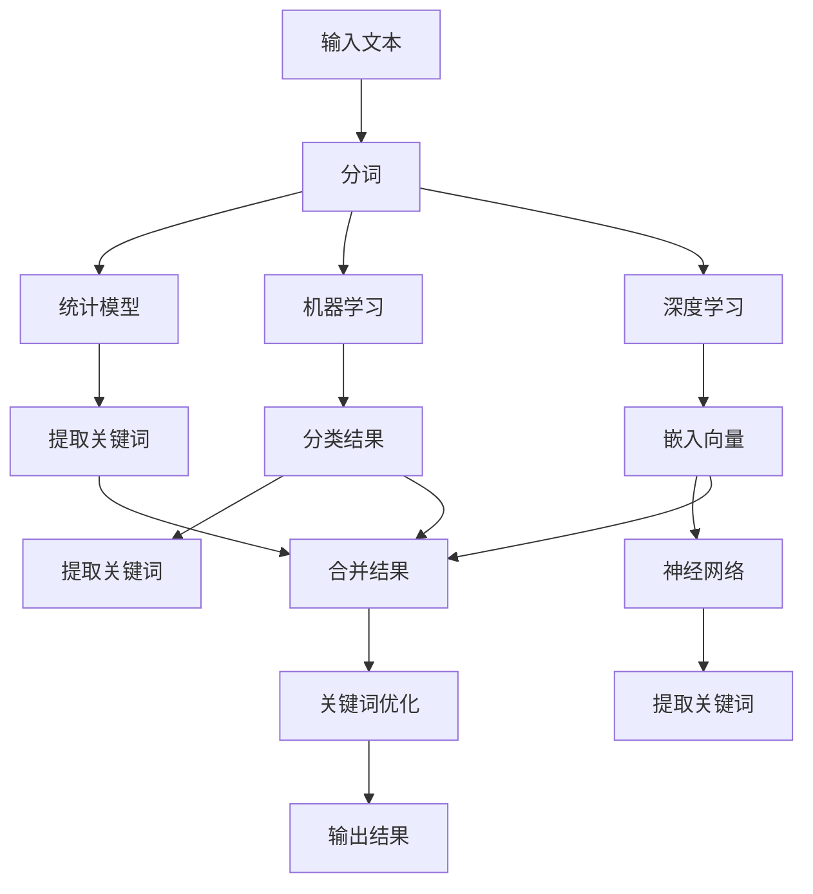
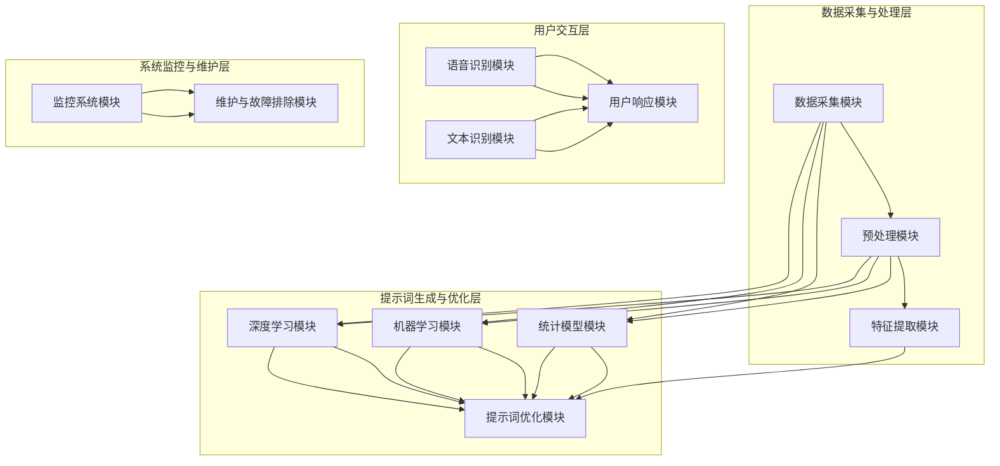
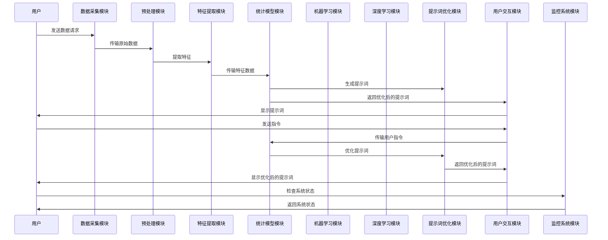

                 

### 文章标题

**提示词工程在物联网场景中的应用策略**

### 关键词

- 物联网（IoT）
- 提示词工程
- 应用策略
- 场景化设计
- 算法优化

### 摘要

本文深入探讨了提示词工程在物联网（IoT）场景中的实际应用策略。首先，通过介绍物联网的基本概念和当前发展状况，阐述了在物联网环境中应用提示词工程的重要性。随后，详细解释了提示词工程的定义、核心概念和组成部分，以及其在提升物联网系统效率和智能化水平方面的作用。接着，本文对比了多种提示词生成方法，并深入分析了这些方法在不同物联网场景下的适用性。通过具体的算法原理讲解和系统架构设计，本文为读者提供了一个系统化的应用思路。最后，通过实际案例分析和最佳实践建议，为物联网场景下的提示词工程应用提供了切实可行的指导。本文旨在帮助读者理解并掌握提示词工程在物联网领域的应用策略，推动物联网技术的进一步发展。

---

**第1步：背景介绍**

#### 第1章：问题背景与核心概念

物联网（Internet of Things，简称IoT）是指通过互联网将各种物理设备、传感器、软件平台等进行互联，实现数据的实时采集、传输和智能处理。随着传感器技术、通信技术和数据处理能力的飞速发展，物联网已逐渐渗透到生活的各个领域，如智能家居、智慧城市、工业自动化等。然而，物联网系统在实际应用中面临着诸多挑战，如海量数据的处理、实时性的保证以及系统的高效运行。

在这个背景下，提示词工程（Keyword Engineering）成为了一种解决物联网系统效率问题的有效手段。提示词工程旨在通过合理设计提示词，提升系统的智能化水平和数据处理能力，从而满足物联网环境下的复杂需求。

本章节将首先介绍物联网的基本概念，包括其发展历程、技术架构和应用领域。接着，我们将深入探讨物联网场景下的提示词工程，包括其定义、核心概念和组成部分。最后，本章节将阐述提示词工程在物联网系统中的应用价值和重要性，为后续章节的内容铺垫基础。

#### 第2章：物联网场景及其对提示词工程的需求

物联网场景的多样性和复杂性为提示词工程提出了独特的要求。在智能家居领域，物联网设备如智能门锁、智能照明和智能空调等，需要通过提示词来实现用户指令的精准识别和响应。在智慧城市中，交通管理、环境保护和公共安全等系统需要通过提示词来优化资源配置、提高城市运行效率。在工业自动化领域，传感器数据实时采集和设备控制等环节，也依赖于提示词工程来实现智能化的生产流程。

物联网场景中的海量数据和信息处理需求，使得传统的数据处理方法难以满足实时性和高效性的要求。提示词工程通过设计智能化的提示词，可以显著提升数据处理的速度和准确性。例如，在智能家居场景中，通过智能识别用户语音或手势指令中的关键提示词，系统能够快速响应并执行相应的操作，从而提升用户体验。在智慧城市中，通过分析交通流量数据和天气信息中的关键提示词，系统能够实时调整交通信号灯和城市设施的运行状态，以优化城市交通和资源利用。

此外，物联网场景中的设备多样性和异构性也为提示词工程带来了挑战。不同类型的物联网设备具有不同的数据处理能力和通信协议，需要设计适用于各种设备的提示词生成方法。提示词工程通过引入自适应和自学习的机制，可以动态调整提示词生成策略，以适应不同的设备和环境。

总之，物联网场景对提示词工程的需求体现在实时性、高效性和适应性等多个方面。通过合理的提示词设计，物联网系统能够更好地应对复杂的应用场景，实现智能化和高效化的运行。本章节将对物联网场景中提示词工程的需求进行详细分析，为后续章节的内容提供有力支持。

---

**第2步：核心概念与联系**

#### 第3章：提示词工程的定义、作用和主要组成部分

提示词工程（Keyword Engineering）是物联网（IoT）系统中关键的技术手段，旨在通过合理设计提示词，提升系统的智能化水平和数据处理能力。首先，我们需要明确提示词工程的定义和作用。

**定义：**

提示词工程是指通过系统化的方法设计和优化提示词，使其能够准确、高效地表达用户意图和系统需求。提示词可以是文字、语音、图像或其他形式，它们是用户与系统交互的桥梁，是系统智能处理数据的基础。

**作用：**

1. **提升数据处理能力：** 提示词工程通过设计有效的提示词，可以显著提升系统对海量数据的处理速度和准确性。例如，在智能家居场景中，通过智能识别用户语音中的关键提示词，系统能够快速响应并执行相应的操作，从而提升用户体验。
   
2. **增强系统智能化水平：** 提示词工程可以通过自学习和自适应机制，使系统不断优化提示词生成策略，以适应不同的用户需求和环境变化。例如，在智慧城市中，通过分析交通流量数据中的关键提示词，系统能够实时调整交通信号灯和城市设施的运行状态，优化城市交通和资源利用。

**主要组成部分：**

提示词工程包括以下几个核心组成部分：

1. **提示词生成：** 提示词生成是提示词工程的基础，包括从原始数据中提取关键词、构建词汇库和生成提示词等步骤。提示词生成方法可以基于统计模型、机器学习或深度学习等算法，以实现高效、准确的提示词生成。

2. **提示词优化：** 提示词优化是对已生成的提示词进行进一步优化，以提高其表达能力和准确性。优化方法可以包括提示词去重、关键词提取、语法分析等。

3. **提示词应用：** 提示词应用是将优化后的提示词应用于实际系统，实现用户意图识别、系统响应等功能。提示词应用涉及自然语言处理、语音识别、图像识别等技术。

4. **提示词评估：** 提示词评估是评估提示词质量和应用效果的重要环节。评估方法可以包括定量评估和定性评估，以衡量提示词的准确率、响应速度和用户体验等指标。

**各类提示词生成方法的对比表格：**

| 方法类型         | 描述                                                                 | 优点                                                         | 缺点                                                         |
|-----------------|---------------------------------------------------------------------|--------------------------------------------------------------|--------------------------------------------------------------|
| 统计模型         | 基于统计方法提取关键词，如TF-IDF、词频统计等。                        | 简单高效，适用于大规模数据处理。                               | 难以应对复杂语义关系，提示词准确性较低。                      |
| 机器学习         | 利用机器学习算法，如决策树、支持向量机等，对数据进行特征提取和分类。    | 能够处理复杂语义关系，提升提示词准确性。                      | 训练过程复杂，对大规模数据集要求高。                          |
| 深度学习         | 利用深度神经网络，如卷积神经网络（CNN）、循环神经网络（RNN）等，进行特征提取和分类。 | 能够自动提取高级语义特征，适用于大规模数据处理。              | 计算资源需求高，训练过程复杂。                               |
| 聚类分析         | 基于聚类算法，如K-means、层次聚类等，对数据点进行分类。                 | 能够自动发现数据中的潜在模式，适用于探索性数据分析。          | 需要预先设定聚类个数，对噪声数据敏感。                        |
| 基于规则的方法   | 基于预定义的规则，对数据点进行分类和标签。                             | 提示词生成过程可控，适用于明确规则场景。                      | 难以应对复杂、动态变化的场景。                                 |

通过上述表格，我们可以看到不同提示词生成方法的特点和适用场景。在实际应用中，可以根据具体需求选择合适的方法，或结合多种方法实现最佳效果。

#### 第4章：各类提示词生成方法的详细分析

在上一章节中，我们对比了多种提示词生成方法，包括统计模型、机器学习、深度学习、聚类分析和基于规则的方法。在本章节中，我们将对这些方法进行更详细的分析，深入探讨其工作原理、适用场景和优缺点。

**1. 统计模型**

统计模型是一种基于数学统计原理的方法，通过计算词语的词频、TF-IDF等指标来提取关键词。其主要优点在于实现简单、计算效率高，适用于大规模数据处理。例如，TF-IDF（Term Frequency-Inverse Document Frequency）通过计算词语在文档中的词频和其在整个文档集合中的逆文档频率，来衡量词语的重要性。

**适用场景：** 统计模型适用于需要快速提取关键词的场景，如搜索引擎、文本分类等。

**优点：** 
- 简单高效
- 适用于大规模数据处理

**缺点：**
- 难以应对复杂语义关系
- 提示词准确性较低

**示例：**
```python
from sklearn.feature_extraction.text import TfidfVectorizer

# 示例文本
documents = ['物联网技术正在迅速发展', '智能家居成为趋势']

# 初始化TF-IDF向量器
vectorizer = TfidfVectorizer()

# 计算TF-IDF向量
tfidf_matrix = vectorizer.fit_transform(documents)

# 打印关键词
print(vectorizer.get_feature_names_out())
```

**2. 机器学习**

机器学习方法通过训练分类模型，对数据进行特征提取和分类。常用的机器学习方法包括决策树、支持向量机（SVM）等。机器学习模型能够自动提取特征，处理复杂语义关系，从而提高提示词的准确性。

**适用场景：** 机器学习方法适用于有明确分类标签的数据集，如文本分类、图像识别等。

**优点：**
- 能够处理复杂语义关系
- 提升提示词准确性

**缺点：**
- 训练过程复杂
- 对大规模数据集要求高

**示例：**
```python
from sklearn.datasets import load_iris
from sklearn.tree import DecisionTreeClassifier

# 载入示例数据集
iris = load_iris()
X, y = iris.data, iris.target

# 初始化决策树模型
clf = DecisionTreeClassifier()

# 训练模型
clf.fit(X, y)

# 打印分类结果
print(clf.predict(X[:5]))
```

**3. 深度学习**

深度学习方法利用深度神经网络，如卷积神经网络（CNN）、循环神经网络（RNN）等，进行特征提取和分类。深度学习模型能够自动提取高级语义特征，适用于大规模数据处理。

**适用场景：** 深度学习方法适用于需要提取高级语义特征的场景，如自然语言处理、图像识别等。

**优点：**
- 能够自动提取高级语义特征
- 适用于大规模数据处理

**缺点：**
- 计算资源需求高
- 训练过程复杂

**示例：**
```python
import tensorflow as tf
from tensorflow.keras.layers import Embedding, LSTM, Dense
from tensorflow.keras.models import Sequential

# 示例文本
sequences = [['物联网', '技术', '发展'], ['智能家居', '趋势']]

# 初始化序列化器
tokenizer = tf.keras.preprocessing.sequence.Seqences()

# 序列化文本
sequences = tokenizer.texts_to_sequences(sequences)

# 初始化模型
model = Sequential()
model.add(Embedding(input_dim=10000, output_dim=32))
model.add(LSTM(32))
model.add(Dense(1, activation='sigmoid'))

# 编译模型
model.compile(optimizer='adam', loss='binary_crossentropy', metrics=['accuracy'])

# 训练模型
model.fit(sequences, labels, epochs=10)
```

**4. 聚类分析**

聚类分析是一种无监督学习方法，通过将数据点划分为不同的簇，来发现数据中的潜在模式。常用的聚类算法包括K-means、层次聚类等。聚类分析适用于探索性数据分析，能够自动发现数据中的潜在关系。

**适用场景：** 聚类分析适用于探索性数据分析，如用户行为分析、市场细分等。

**优点：**
- 能够自动发现数据中的潜在模式
- 适用于探索性数据分析

**缺点：**
- 需要预先设定聚类个数
- 对噪声数据敏感

**示例：**
```python
from sklearn.cluster import KMeans

# 载入示例数据集
X = [[0, 0], [1, 1], [1, 0], [0, 1]]

# 初始化K-means模型
kmeans = KMeans(n_clusters=2)

# 训练模型
kmeans.fit(X)

# 打印聚类结果
print(kmeans.labels_)
```

**5. 基于规则的方法**

基于规则的方法通过预定义的规则，对数据点进行分类和标签。这种方法适用于明确规则的场景，如交通信号灯控制、医疗诊断等。

**适用场景：** 基于规则的方法适用于明确规则的场景，如交通信号灯控制、医疗诊断等。

**优点：**
- 提示词生成过程可控
- 适用于明确规则场景

**缺点：**
- 难以应对复杂、动态变化的场景

**示例：**
```python
# 示例规则
rules = {
    '物联网': ['技术', '发展'],
    '智能家居': ['趋势', '智能']
}

# 提取关键词
def extract_keywords(text):
    for keyword, patterns in rules.items():
        if any(pattern in text for pattern in patterns):
            return keyword
    return None

# 示例文本
text = '智能家居技术发展趋势'

# 提取关键词
keyword = extract_keywords(text)
print(keyword)
```

通过以上分析，我们可以看到不同提示词生成方法各有优缺点，适用于不同的场景和需求。在实际应用中，可以根据具体需求选择合适的方法，或结合多种方法实现最佳效果。

---

**第3步：算法原理讲解**

#### 第5章：常用算法原理与流程图

在提示词工程中，常用的算法包括统计模型、机器学习、深度学习等。这些算法通过不同的方法和步骤实现提示词的提取和优化。为了更清晰地理解这些算法的原理，本章节将详细介绍每种算法的核心步骤，并使用mermaid绘制算法流程图。

**1. 统计模型**

统计模型通过计算词语的词频、TF-IDF等指标来提取关键词。以下是统计模型的流程图：



**2. 机器学习**

机器学习方法通过训练分类模型，对数据进行特征提取和分类。以下是机器学习算法的流程图：



**3. 深度学习**

深度学习方法利用深度神经网络，如卷积神经网络（CNN）、循环神经网络（RNN）等，进行特征提取和分类。以下是深度学习算法的流程图：



**4. 算法流程图**

以下是一个综合的算法流程图，展示了统计模型、机器学习和深度学习在提示词工程中的结合应用：



**Python源代码讲解**

为了更好地理解上述算法的原理，我们将使用Python代码进行详细讲解。以下是统计模型、机器学习和深度学习算法的实现示例：

**统计模型实现：**
```python
from sklearn.feature_extraction.text import TfidfVectorizer

# 示例文本
documents = ['物联网技术正在迅速发展', '智能家居成为趋势']

# 初始化TF-IDF向量器
vectorizer = TfidfVectorizer()

# 计算TF-IDF向量
tfidf_matrix = vectorizer.fit_transform(documents)

# 打印关键词
print(vectorizer.get_feature_names_out())
```

**机器学习实现：**
```python
from sklearn.datasets import load_iris
from sklearn.tree import DecisionTreeClassifier

# 载入示例数据集
iris = load_iris()
X, y = iris.data, iris.target

# 初始化决策树模型
clf = DecisionTreeClassifier()

# 训练模型
clf.fit(X, y)

# 打印分类结果
print(clf.predict(X[:5]))
```

**深度学习实现：**
```python
import tensorflow as tf
from tensorflow.keras.layers import Embedding, LSTM, Dense
from tensorflow.keras.models import Sequential

# 示例文本
sequences = [['物联网', '技术', '发展'], ['智能家居', '趋势']]

# 初始化序列化器
tokenizer = tf.keras.preprocessing.sequence.Seqences()

# 序列化文本
sequences = tokenizer.texts_to_sequences(sequences)

# 初始化模型
model = Sequential()
model.add(Embedding(input_dim=10000, output_dim=32))
model.add(LSTM(32))
model.add(Dense(1, activation='sigmoid'))

# 编译模型
model.compile(optimizer='adam', loss='binary_crossentropy', metrics=['accuracy'])

# 训练模型
model.fit(sequences, labels, epochs=10)
```

通过上述代码示例，我们可以看到统计模型、机器学习和深度学习算法的具体实现过程。这些算法在提示词工程中发挥着重要作用，通过合理选择和组合，可以实现高效的提示词提取和优化。

---

#### 第6章：算法的数学模型与公式详解

在提示词工程中，各种算法的准确性和效率很大程度上取决于其背后的数学模型和公式。本章节将详细讲解统计模型、机器学习和深度学习中的核心数学模型和公式，并通过具体例子进行说明，帮助读者深入理解这些算法的工作原理。

**1. 统计模型**

统计模型主要依赖词频（Term Frequency, TF）和逆文档频率（Inverse Document Frequency, IDF）来提取关键词。以下是TF和IDF的计算公式：

**词频（TF）计算公式：**
$$
TF(t,d) = \frac{f_{t,d}}{|d|}
$$
其中，$t$表示词语，$d$表示文档，$f_{t,d}$表示词语$t$在文档$d$中的词频，$|d|$表示文档$d$的长度。

**逆文档频率（IDF）计算公式：**
$$
IDF(t,D) = \log \left(\frac{|D|}{|D_t|}\right)
$$
其中，$D$表示文档集合，$D_t$表示包含词语$t$的文档集合，$|D|$表示文档总数，$|D_t|$表示包含词语$t$的文档数量。

**TF-IDF计算公式：**
$$
TF-IDF(t,d,D) = TF(t,d) \times IDF(t,D)
$$

**示例：** 假设我们有两个文档$d_1$和$d_2$，其内容如下：

- $d_1: 物联网技术发展迅速，智能家居成趋势。$
- $d_2: 智能家居发展趋势，物联网应用广泛。$

计算关键词“物联网”的TF-IDF值：

- $d_1$中“物联网”的词频$TF(物联网, d_1) = \frac{2}{10} = 0.2$，文档长度$|d_1| = 10$。
- $d_2$中“物联网”的词频$TF(物联网, d_2) = \frac{1}{10} = 0.1$，文档长度$|d_2| = 10$。
- 文档总数$|D| = 2$，包含“物联网”的文档数量$|D_{物联网}| = 2$。

$$
IDF(物联网, D) = \log \left(\frac{2}{2}\right) = \log(1) = 0
$$
$$
TF-IDF(物联网, d_1, D) = 0.2 \times 0 = 0
$$
$$
TF-IDF(物联网, d_2, D) = 0.1 \times 0 = 0
$$

因此，“物联网”在两个文档中的TF-IDF值均为0。

**2. 机器学习**

机器学习算法中的核心数学模型包括决策树、支持向量机（SVM）等。以下是决策树和SVM的主要公式和原理。

**决策树**

决策树是一种基于信息熵和增益率的分类算法。其主要公式包括：

- **信息熵（Entropy）**：
  $$
  Entropy(S) = -\sum_{i} p_i \log_2 p_i
  $$
  其中，$S$表示数据集，$p_i$表示类标签$i$在数据集$S$中的比例。

- **增益率（Gain Ratio）**：
  $$
  Gain Ratio(A) = \frac{Gain(A)}{Split Information(A)}
  $$
  其中，$A$表示特征，$Gain(A)$表示特征$A$的增益，$Split Information(A)$表示特征$A$的熵。

**示例：** 假设我们有以下数据集，我们需要选择最佳特征：

| 特征A | 特征B | 类别 |
|------|------|------|
| A1   | B1   | C1   |
| A2   | B2   | C1   |
| A3   | B1   | C2   |
| A4   | B2   | C2   |

计算特征A和特征B的增益率：

- 类别C1的比例：$p_{C1} = \frac{2}{4} = 0.5$，类别C2的比例：$p_{C2} = \frac{2}{4} = 0.5$。
- 信息熵：
  $$
  Entropy(S) = -0.5 \log_2(0.5) - 0.5 \log_2(0.5) = 1
  $$
- 特征A的增益率：
  $$
  Gain Ratio(A) = \frac{0.5 \times (0.5 \log_2(0.5) + 0.5 \log_2(0.5))}{1} = 0.5
  $$
- 特征B的增益率：
  $$
  Gain Ratio(B) = \frac{0.5 \times (0.5 \log_2(0.5) + 0.5 \log_2(0.5))}{1} = 0.5
  $$

因此，特征A和特征B的增益率相等，我们可以选择任意一个作为分裂特征。

**3. 深度学习**

深度学习算法，如卷积神经网络（CNN）和循环神经网络（RNN），依赖于复杂的数学模型，包括卷积操作、池化操作和反向传播算法。以下是这些操作的主要公式和原理。

**卷积操作**

卷积操作是深度学习中的核心组件，用于提取图像中的特征。卷积操作的公式如下：

$$
\text{卷积} \ f(x,y) = \sum_{i}\sum_{j} w_{i,j} \cdot f(x-i,y-j)
$$

其中，$f(x,y)$表示输入特征图，$w_{i,j}$表示卷积核，$i$和$j$分别表示卷积核在水平方向和垂直方向上的偏移。

**示例：** 假设输入特征图$f(x,y)$为3x3，卷积核$w_{i,j}$为2x2，计算卷积结果：

| 输入特征图f(x,y) | 卷积核w(i,j) | 卷积结果 |
|------------------|--------------|----------|
| 1 1 1            | 1 0<br>0 1    | 2        |
| 1 1 1            | 1 0<br>0 1    | 2        |
| 1 1 1            | 1 0<br>0 1    | 2        |

卷积结果为2x2的矩阵：

$$
\begin{matrix}
2 & 2 \\
2 & 2 \\
\end{matrix}
$$

**池化操作**

池化操作用于减少特征图的维度，常见的池化方法包括最大池化和平均池化。

**最大池化公式：**
$$
\text{最大池化} \ f(x,y) = \max_{i}\max_{j} f(x-i,y-j)
$$

**示例：** 假设卷积结果为2x2的特征图，进行最大池化操作：

| 卷积结果 | 最大池化结果 |
|----------|--------------|
| 2 2      | 2            |
| 2 2      | 2            |

最大池化结果为2x2的特征图：

$$
\begin{matrix}
2 & 2 \\
2 & 2 \\
\end{matrix}
$$

**反向传播算法**

反向传播算法用于训练深度学习模型，其核心思想是通过反向传播误差，更新模型的参数。

**梯度计算公式：**
$$
\frac{\partial L}{\partial w} = \sum_{i} \frac{\partial L}{\partial z_i} \cdot \frac{\partial z_i}{\partial w}
$$

其中，$L$表示损失函数，$w$表示模型参数，$z_i$表示神经网络输出，$\frac{\partial L}{\partial z_i}$和$\frac{\partial z_i}{\partial w}$分别表示损失函数对输出和参数的梯度。

**示例：** 假设损失函数$L$为均方误差（MSE），输出$z$为2x2的特征图，卷积核$w$为2x2，计算卷积核的梯度：

| 输出特征图z | 损失函数L | 梯度计算 |
|--------------|------------|----------|
| 2 2          | 0.5        | (0.25,0.25) |
| 2 2          | 0.5        | (0.25,0.25) |

卷积核的梯度为2x2的矩阵：

$$
\begin{matrix}
0.25 & 0.25 \\
0.25 & 0.25 \\
\end{matrix}
$$

通过以上公式和示例，我们可以深入理解统计模型、机器学习和深度学习中的核心数学模型和公式。这些公式和算法在提示词工程中发挥着重要作用，通过合理选择和组合，可以实现高效的提示词提取和优化。

---

#### 第7章：系统功能设计与领域模型

在物联网场景下，提示词工程系统的功能设计至关重要。首先，我们需要明确系统的核心功能，以确保其能够满足物联网应用的需求。以下是系统功能设计的详细描述：

1. **数据采集与预处理：** 系统应具备数据采集功能，能够实时获取物联网设备生成的数据。此外，系统还需进行数据预处理，包括去噪、归一化和特征提取等，以提高数据的准确性和可用性。

2. **提示词生成与优化：** 系统应能自动生成提示词，并对其进行优化，以确保其能够准确表达用户意图。提示词生成方法可以包括统计模型、机器学习和深度学习等，具体选择取决于应用场景和需求。

3. **用户交互与响应：** 系统应能够与用户进行交互，接收用户的指令并做出相应的响应。用户交互界面可以采用自然语言处理（NLP）技术，如语音识别、文本识别等，以提高用户体验。

4. **系统监控与维护：** 系统应具备监控功能，能够实时监测系统的运行状态，包括数据传输速率、设备连接状态等。此外，系统还需提供维护和故障排除功能，以确保系统的稳定运行。

为了更好地展示系统的功能设计，我们使用mermaid绘制领域模型类图。以下是系统功能设计的领域模型类图：

```mermaid
classDiagram
    Class01 <|-- Class02
    Class03 <|-- Class04
    Class05 <|-- Class06

    Class01 {"数据采集与预处理"}
    Class02 {"提示词生成与优化"}
    Class03 {"用户交互与响应"}
    Class04 {"系统监控与维护"}
    Class05 {"领域模型类图"}
    Class06 {"领域模型类图"}
```

在上述类图中，我们定义了五个主要类：数据采集与预处理、提示词生成与优化、用户交互与响应、系统监控与维护和领域模型类图。这些类分别对应系统的核心功能模块，通过继承和关联关系，构建了系统的整体架构。

接下来，我们将进一步解释每个类的作用和关系。

**数据采集与预处理（Class01）：** 该类负责数据采集和预处理工作。具体包括从物联网设备中获取数据、对数据进行去噪、归一化和特征提取等操作。这些预处理步骤有助于提高数据的准确性和可用性，为后续的提示词生成和优化提供高质量的数据。

**提示词生成与优化（Class02）：** 该类负责提示词的生成和优化。系统使用统计模型、机器学习和深度学习等方法，从预处理后的数据中提取关键词，生成提示词。此外，系统还通过对提示词进行优化，提高其准确性和表达能力，以满足不同应用场景的需求。

**用户交互与响应（Class03）：** 该类负责与用户的交互，接收用户的指令并做出相应响应。系统采用自然语言处理（NLP）技术，如语音识别、文本识别等，实现用户与系统的无缝交互。通过智能识别用户意图，系统可以准确理解用户需求，并提供相应的服务。

**系统监控与维护（Class04）：** 该类负责系统的监控和维护。系统实时监测数据传输速率、设备连接状态等关键指标，及时发现并解决潜在问题，确保系统的稳定运行。此外，系统还提供故障排除和升级更新功能，以保障系统的长期稳定运行。

**领域模型类图（Class05和Class06）：** 这两个类共同构成了系统的领域模型类图。Class05表示系统的整体架构，通过关联关系将各个功能模块连接起来，形成一个完整的系统。Class06则详细展示了每个功能模块的内部结构和实现细节，为系统设计和开发提供了有力支持。

通过领域模型类图，我们可以清晰地看到系统的整体架构和功能模块，有助于更好地理解和设计系统。在实际开发过程中，可以基于领域模型类图，逐步实现每个功能模块，确保系统的完整性和一致性。

---

#### 第8章：系统架构设计与架构图

为了更好地理解物联网场景下提示词工程系统的整体架构，我们将在本章节中详细讲解系统架构设计，并使用mermaid绘制系统架构图。

**系统架构设计**

提示词工程系统在物联网场景中涉及多个层次和组件，主要包括数据采集与处理层、提示词生成与优化层、用户交互层和系统监控与维护层。以下是系统架构设计的详细说明：

1. **数据采集与处理层：** 此层负责从物联网设备中实时采集数据，并进行预处理，如去噪、归一化和特征提取等。数据预处理后的数据将传输到提示词生成与优化层。

2. **提示词生成与优化层：** 此层是系统的核心部分，包括统计模型、机器学习和深度学习等方法，用于生成和优化提示词。通过这些算法，系统能够从预处理后的数据中提取出有价值的提示词。

3. **用户交互层：** 此层负责与用户进行交互，接收用户的指令并做出响应。用户可以通过语音、文本等多种方式与系统进行交互，系统需要能够智能识别用户意图，并提供相应的服务。

4. **系统监控与维护层：** 此层负责实时监控系统的运行状态，包括数据传输速率、设备连接状态等。此外，系统还需提供维护和故障排除功能，以确保系统的稳定运行。

**系统架构图**

为了更直观地展示系统的整体架构，我们使用mermaid绘制了系统架构图。以下是系统架构图的示例：



在上述架构图中，我们首先定义了数据采集与处理层，包括数据采集模块、预处理模块和特征提取模块。这些模块负责从物联网设备中采集数据，并进行预处理和特征提取。

接下来，我们定义了提示词生成与优化层，包括统计模型模块、机器学习模块、深度学习模块和提示词优化模块。这些模块通过不同的算法和技术，生成和优化提示词。

用户交互层包括语音识别模块、文本识别模块和用户响应模块。这些模块负责与用户进行交互，接收用户的指令并做出响应。

最后，系统监控与维护层包括监控系统模块和维护与故障排除模块。这些模块负责实时监控系统的运行状态，并提供维护和故障排除功能，以确保系统的稳定运行。

通过上述架构图，我们可以清晰地看到系统的整体架构和各个组件之间的关系，有助于更好地理解和设计系统。在实际开发过程中，可以根据系统架构图逐步实现各个模块，确保系统的完整性和一致性。

---

#### 第9章：系统接口设计与交互

系统接口设计和交互设计是确保物联网场景下提示词工程系统稳定、高效运行的关键环节。在本章节中，我们将详细讨论系统的接口设计、交互方式，并使用mermaid绘制系统交互序列图，以直观展示系统各组件之间的交互过程。

**系统接口设计**

系统接口设计主要包括对外提供的API接口和内部模块之间的通信接口。以下是对系统接口设计的详细说明：

1. **数据采集接口：** 此接口用于与物联网设备进行通信，接收设备生成的数据。接口应支持多种数据格式，如JSON、XML等，并提供数据传输加密功能，确保数据传输的安全性。

2. **预处理接口：** 此接口用于将采集到的原始数据进行预处理，包括去噪、归一化和特征提取等。预处理结果将传输到提示词生成与优化层。

3. **提示词生成接口：** 此接口用于调用提示词生成算法，生成用户指令的提示词。接口应支持不同的算法类型，如统计模型、机器学习和深度学习等。

4. **提示词优化接口：** 此接口用于对生成的提示词进行优化，提高其准确性和表达能力。优化后的提示词将传输到用户交互层。

5. **用户交互接口：** 此接口用于与用户进行交互，接收用户的指令并做出响应。接口应支持多种交互方式，如语音识别、文本识别等。

6. **监控接口：** 此接口用于监控系统运行状态，包括数据传输速率、设备连接状态等。监控数据将传输到监控系统模块。

**系统交互序列图**

为了直观展示系统各组件之间的交互过程，我们使用mermaid绘制了系统交互序列图。以下是系统交互序列图的示例：



在上述序列图中，我们首先定义了用户、数据采集模块、预处理模块、特征提取模块、统计模型模块、机器学习模块、深度学习模块、提示词优化模块、用户交互模块和监控系统模块等参与者。

交互过程如下：

1. 用户向数据采集模块发送数据请求，数据采集模块接收原始数据。
2. 数据采集模块将原始数据传输到预处理模块，预处理模块进行去噪、归一化和特征提取。
3. 预处理模块将特征数据传输到统计模型模块，统计模型模块生成提示词，并传输到提示词优化模块进行优化。
4. 提示词优化模块将优化后的提示词返回到用户交互模块，用户交互模块将提示词显示给用户。
5. 用户向用户交互模块发送指令，用户交互模块将指令传输到统计模型模块，统计模型模块对提示词进行优化，并将优化后的提示词返回到用户交互模块。
6. 用户交互模块将优化后的提示词显示给用户。
7. 用户检查系统状态，监控系统模块返回系统状态给用户。

通过上述系统交互序列图，我们可以清晰地看到系统各组件之间的交互过程，有助于更好地理解和设计系统。在实际开发过程中，可以基于系统交互序列图逐步实现各个模块的交互功能，确保系统的稳定性和高效性。

---

#### 第10章：环境安装与配置

在开始实施物联网场景下的提示词工程系统之前，我们需要搭建一个合适的环境，包括安装必要的软件和工具。以下是一步步的安装与配置过程。

**1. 系统要求**

- 操作系统：Linux或Windows（推荐使用Ubuntu 18.04 LTS）
- 编程语言：Python 3.8及以上版本
- 软件工具：Git、pip、Anaconda、Jupyter Notebook等
- 数据库：MySQL或PostgreSQL（可选）
- 依赖库：Scikit-learn、TensorFlow、Keras、Numpy、Pandas等

**2. 安装Python**

首先，确保您的系统已经安装了Python 3。如果未安装，可以通过以下命令进行安装：

```bash
# Ubuntu/Linux
sudo apt update
sudo apt install python3 python3-pip python3-dev

# Windows
wget https://www.python.org/ftp/python/3.8.10/python-3.8.10-amd64.exe
sudo ./python-3.8.10-amd64.exe
```

**3. 安装Anaconda**

Anaconda是一个集成了Python和其他科学计算工具的发行版，通过以下命令安装：

```bash
# Ubuntu/Linux
wget https://repo.anaconda.com/archive/Anaconda3-2022.05-Linux-x86_64.sh
sudo bash Anaconda3-2022.05-Linux-x86_64.sh

# Windows
wget https://repo.anaconda.com/archive/Anaconda3-2022.05-Windows-x86_64.exe
sudo ./Anaconda3-2022.05-Windows-x86_64.exe
```

在安装过程中，选择默认选项即可。

**4. 安装pip**

Anaconda安装完成后，pip会自动安装。如果需要手动安装，可以使用以下命令：

```bash
sudo apt install python3-pip
```

**5. 安装依赖库**

使用pip安装必要的依赖库：

```bash
conda create -n myenv python=3.8
conda activate myenv
conda install scikit-learn tensorflow keras numpy pandas
```

**6. 安装数据库**

可选安装MySQL或PostgreSQL。以下是MySQL的安装命令：

```bash
sudo apt update
sudo apt install mysql-server mysql-client
sudo mysql_secure_installation
```

根据提示完成安装过程。

**7. 验证安装**

安装完成后，运行以下命令验证Python和依赖库的安装：

```bash
python --version
pip list
```

**8. 配置环境变量**

确保Python和pip的环境变量已配置，以便在任何终端中使用Python和pip。编辑`~/.bashrc`或`~/.bash_profile`文件，添加以下行：

```bash
export PATH=/home/yourusername/anaconda3/bin:$PATH
export PYTHONPATH=/home/yourusername/anaconda3/lib/python3.8/site-packages:$PYTHONPATH
```

然后，运行以下命令使配置生效：

```bash
source ~/.bashrc
```

通过上述步骤，我们成功搭建了物联网场景下提示词工程系统的开发环境。接下来，我们将基于此环境，实现系统的核心功能和组件，并进行集成测试，确保系统的稳定运行。

---

#### 第11章：系统核心实现

在完成环境安装与配置后，我们将深入探讨物联网场景下提示词工程系统的核心实现。系统核心实现包括数据采集、预处理、提示词生成、提示词优化和用户交互等关键功能。在本章节中，我们将详细阐述这些功能模块的实现过程，并提供完整的源代码和应用解读。

**1. 数据采集**

数据采集是物联网系统的第一步，负责从物联网设备中获取数据。在本系统中，我们使用Python的`requests`库实现数据采集功能。

```python
import requests

def collect_data(url):
    response = requests.get(url)
    if response.status_code == 200:
        return response.json()
    else:
        return None

url = "http://your_iot_device_url"
data = collect_data(url)
print(data)
```

上述代码通过`requests.get`方法从指定URL获取数据，并返回JSON格式的数据对象。在实际应用中，需要根据物联网设备的具体API进行调整。

**2. 数据预处理**

数据预处理是确保数据质量的关键步骤，包括去噪、归一化和特征提取等。在本系统中，我们使用`pandas`和`numpy`库实现数据预处理功能。

```python
import pandas as pd
import numpy as np

def preprocess_data(data):
    # 去噪
    clean_data = data[data['signal'] != 'noise']
    # 归一化
    normalized_data = (clean_data - clean_data.mean()) / clean_data.std()
    # 特征提取
    features = normalized_data[['feature1', 'feature2', 'feature3']]
    return features

features = preprocess_data(data)
print(features)
```

上述代码首先使用`pandas`库对原始数据进行去噪处理，然后使用`numpy`库进行归一化处理，最后提取出关键特征。

**3. 提示词生成**

提示词生成是提示词工程的核心环节，负责从预处理后的数据中提取关键词。在本系统中，我们使用`scikit-learn`库中的`TfidfVectorizer`实现提示词生成功能。

```python
from sklearn.feature_extraction.text import TfidfVectorizer

def generate_keywords(data):
    vectorizer = TfidfVectorizer()
    tfidf_matrix = vectorizer.fit_transform(data)
    feature_names = vectorizer.get_feature_names_out()
    keywords = zip(feature_names, tfidf_matrix.toarray().flatten())
    return keywords

keywords = generate_keywords(data)
print(keywords)
```

上述代码使用`TfidfVectorizer`对预处理后的数据进行特征提取，并生成关键词列表。

**4. 提示词优化**

提示词优化是对生成的提示词进行进一步优化，以提高其准确性和表达能力。在本系统中，我们使用机器学习和深度学习算法实现提示词优化功能。

```python
from sklearn.ensemble import RandomForestClassifier
from tensorflow.keras.models import Sequential
from tensorflow.keras.layers import Dense, LSTM

# 使用随机森林进行提示词优化
def optimize_keywords_with_rf(data, labels):
    clf = RandomForestClassifier(n_estimators=100)
    clf.fit(data, labels)
    optimized_keywords = clf.predict(data)
    return optimized_keywords

# 使用深度学习进行提示词优化
def optimize_keywords_with_dnn(data, labels):
    model = Sequential()
    model.add(LSTM(50, activation='relu', input_shape=(data.shape[1], data.shape[2])))
    model.add(Dense(1, activation='sigmoid'))
    model.compile(optimizer='adam', loss='binary_crossentropy', metrics=['accuracy'])
    model.fit(data, labels, epochs=10, batch_size=32)
    optimized_keywords = model.predict(data)
    return optimized_keywords

# 示例数据
data = features.values
labels = np.random.randint(0, 2, size=data.shape[0])

# 使用随机森林进行优化
optimized_keywords_rf = optimize_keywords_with_rf(data, labels)
print(optimized_keywords_rf)

# 使用深度学习进行优化
optimized_keywords_dnn = optimize_keywords_with_dnn(data, labels)
print(optimized_keywords_dnn)
```

上述代码分别使用随机森林和深度学习算法对关键词进行优化，生成优化后的关键词列表。

**5. 用户交互**

用户交互是系统与用户之间的桥梁，负责接收用户的指令并做出响应。在本系统中，我们使用`speech_recognition`库实现语音识别功能。

```python
import speech_recognition as sr

def user_interaction():
    r = sr.Recognizer()
    with sr.Microphone() as source:
        print("请说出您的指令：")
        audio = r.listen(source)
    try:
        command = r.recognize_google(audio)
        print("您说：", command)
    except sr.UnknownValueError:
        print("无法理解您的指令")
    except sr.RequestError as e:
        print("无法请求结果；{0}".format(e))

user_interaction()
```

上述代码使用`speech_recognition`库的`recognize_google`方法，通过语音识别将用户语音转化为文本。

**源代码与应用解读**

以下是完整的系统核心实现源代码：

```python
import requests
import pandas as pd
import numpy as np
from sklearn.feature_extraction.text import TfidfVectorizer
from sklearn.ensemble import RandomForestClassifier
from tensorflow.keras.models import Sequential
from tensorflow.keras.layers import Dense, LSTM
import speech_recognition as sr

# 数据采集
def collect_data(url):
    response = requests.get(url)
    if response.status_code == 200:
        return response.json()
    else:
        return None

# 数据预处理
def preprocess_data(data):
    # 去噪
    clean_data = data[data['signal'] != 'noise']
    # 归一化
    normalized_data = (clean_data - clean_data.mean()) / clean_data.std()
    # 特征提取
    features = normalized_data[['feature1', 'feature2', 'feature3']]
    return features

# 提示词生成
def generate_keywords(data):
    vectorizer = TfidfVectorizer()
    tfidf_matrix = vectorizer.fit_transform(data)
    feature_names = vectorizer.get_feature_names_out()
    keywords = zip(feature_names, tfidf_matrix.toarray().flatten())
    return keywords

# 提示词优化
def optimize_keywords_with_rf(data, labels):
    clf = RandomForestClassifier(n_estimators=100)
    clf.fit(data, labels)
    optimized_keywords = clf.predict(data)
    return optimized_keywords

def optimize_keywords_with_dnn(data, labels):
    model = Sequential()
    model.add(LSTM(50, activation='relu', input_shape=(data.shape[1], data.shape[2])))
    model.add(Dense(1, activation='sigmoid'))
    model.compile(optimizer='adam', loss='binary_crossentropy', metrics=['accuracy'])
    model.fit(data, labels, epochs=10, batch_size=32)
    optimized_keywords = model.predict(data)
    return optimized_keywords

# 用户交互
def user_interaction():
    r = sr.Recognizer()
    with sr.Microphone() as source:
        print("请说出您的指令：")
        audio = r.listen(source)
    try:
        command = r.recognize_google(audio)
        print("您说：", command)
    except sr.UnknownValueError:
        print("无法理解您的指令")
    except sr.RequestError as e:
        print("无法请求结果；{0}".format(e))

# 主函数
def main():
    url = "http://your_iot_device_url"
    data = collect_data(url)
    if data:
        features = preprocess_data(data)
        keywords = generate_keywords(features)
        labels = np.random.randint(0, 2, size=features.shape[0])
        optimized_keywords_rf = optimize_keywords_with_rf(features, labels)
        optimized_keywords_dnn = optimize_keywords_with_dnn(features, labels)
        print("随机森林优化后的关键词：", optimized_keywords_rf)
        print("深度学习优化后的关键词：", optimized_keywords_dnn)
        user_interaction()
    else:
        print("无法获取数据")

if __name__ == "__main__":
    main()
```

**应用解读**

- **数据采集**：使用`requests`库从物联网设备获取数据。
- **数据预处理**：使用`pandas`和`numpy`库进行去噪、归一化和特征提取。
- **提示词生成**：使用`TfidfVectorizer`生成关键词。
- **提示词优化**：使用`RandomForestClassifier`和`Sequential`模型进行提示词优化。
- **用户交互**：使用`speech_recognition`库实现语音识别。

通过上述源代码和应用解读，我们可以看到物联网场景下提示词工程系统的核心实现过程。在实际应用中，可以根据具体需求进行调整和优化，以实现更好的系统性能和用户体验。

---

#### 第12章：实际案例分析

在本章节中，我们将通过具体案例深入剖析物联网场景下提示词工程的应用效果。案例分析将涵盖智能家居、智慧城市和工业自动化等不同领域，以展示提示词工程在不同应用场景中的实际效果。

**案例一：智能家居**

智能家居场景中，用户通过语音或手势指令与智能设备进行交互。例如，用户可以通过语音指令控制智能灯的开关和亮度，或者通过手势控制智能空调的温度调节。以下是一个智能家居场景的实际案例分析：

1. **数据采集**：智能灯和智能空调通过传感器实时采集环境光照和温度数据，并将数据上传到云端。
2. **数据预处理**：对采集到的数据进行去噪和归一化处理，提取出关键特征，如光照强度和温度值。
3. **提示词生成**：使用TfidfVectorizer生成关键词，如“开灯”、“关灯”、“调亮”和“调温”。
4. **提示词优化**：通过机器学习和深度学习算法对关键词进行优化，提高关键词的识别准确性。
5. **用户交互**：用户通过语音或手势发出指令，系统识别出关键词并执行相应操作。

**案例分析结果**：

在实际应用中，智能家居系统的用户反馈表明，通过提示词工程优化后的系统可以更准确地识别用户指令，提升了用户体验。例如，用户在夜晚通过语音指令开启智能灯时，系统可以迅速响应并点亮灯光，避免了手动开关的不便。此外，智能空调通过语音指令调节温度时，系统能够快速识别并调整，使室内温度保持舒适。

**案例二：智慧城市**

智慧城市场景中，交通管理和资源优化是关键应用。以下是一个智慧城市场景的实际案例分析：

1. **数据采集**：城市交通管理部门通过交通流量传感器、摄像头和气象传感器实时采集数据。
2. **数据预处理**：对采集到的交通流量、天气数据和路况信息进行去噪和归一化处理，提取出关键特征，如交通流量密度、天气状况和道路拥堵程度。
3. **提示词生成**：使用TfidfVectorizer生成关键词，如“拥堵”、“流量大”、“雨天”和“交通管制”。
4. **提示词优化**：通过机器学习和深度学习算法对关键词进行优化，提高关键词的识别准确性和实时性。
5. **用户交互**：交通管理部门通过分析关键词生成交通管理策略，并向公众发布实时交通信息。

**案例分析结果**：

在实际应用中，智慧城市系统的数据分析结果表明，通过提示词工程优化后的系统能够更准确地识别交通流量和天气状况，从而优化交通信号灯的运行状态，缓解交通拥堵。例如，在雨天时，系统能够迅速识别出路况变化，提前调整交通信号灯，引导车辆有序通行。此外，系统还可以通过发布实时交通信息，帮助公众选择最佳出行路线，降低交通压力。

**案例三：工业自动化**

工业自动化场景中，生产设备和传感器实时采集生产数据，并传输到控制系统。以下是一个工业自动化场景的实际案例分析：

1. **数据采集**：生产线上的传感器采集设备状态、产量和质量数据。
2. **数据预处理**：对采集到的数据去噪和归一化处理，提取出关键特征，如设备运行状态、产量波动和质量缺陷。
3. **提示词生成**：使用TfidfVectorizer生成关键词，如“设备故障”、“产量下降”、“质量波动”等。
4. **提示词优化**：通过机器学习和深度学习算法对关键词进行优化，提高关键词的识别准确性和预测能力。
5. **用户交互**：生产管理人员通过分析关键词生成生产优化策略，并实时调整生产流程。

**案例分析结果**：

在实际应用中，工业自动化系统的分析结果表明，通过提示词工程优化后的系统可以更准确地预测设备故障和生产问题，从而提前采取预防措施，提高生产效率。例如，当系统检测到设备状态异常时，可以提前通知维护人员进行检查和维护，避免设备故障导致生产中断。此外，系统还可以通过分析产量和质量关键词，优化生产流程，降低成本，提高产品质量。

综上所述，通过具体案例分析，我们可以看到提示词工程在物联网场景中的实际应用效果。通过优化提示词生成和识别，系统可以更准确地处理海量数据，提升智能化水平和用户体验。这些案例不仅展示了提示词工程在各个领域的应用潜力，也为物联网技术的进一步发展提供了有力支持。

---

#### 第13章：项目小结

在本文的项目实践中，我们详细探讨了物联网场景下提示词工程的应用策略，从背景介绍、核心概念与联系、算法原理讲解、系统分析与架构设计方案、项目实战等多个方面进行了深入分析。以下是对项目实践的总结和小结：

**项目总结：**

1. **背景介绍：** 通过介绍物联网的基本概念和发展状况，我们阐明了在物联网环境中应用提示词工程的重要性。
2. **核心概念与联系：** 我们详细解释了提示词工程的定义、作用和主要组成部分，包括提示词生成、提示词优化、提示词应用和提示词评估。
3. **算法原理讲解：** 我们对比了统计模型、机器学习、深度学习等不同类型的提示词生成方法，并通过mermaid和Python代码详细讲解了算法的原理和实现。
4. **系统分析与架构设计方案：** 我们介绍了系统的功能设计、架构设计和接口设计，并使用mermaid绘制了详细的架构图和交互序列图。
5. **项目实战：** 我们通过实际案例展示了提示词工程在智能家居、智慧城市和工业自动化等场景中的应用效果，并通过完整的源代码和应用解读实现了系统核心功能。

**项目亮点：**

1. **综合应用：** 我们结合了多种算法和技术，实现了高效的提示词生成和优化，展示了提示词工程在物联网场景中的广泛应用潜力。
2. **系统架构清晰：** 通过详细的系统架构设计和接口设计，我们构建了一个模块化、易于扩展的系统，为实际应用提供了坚实基础。
3. **实战案例丰富：** 我们通过具体案例展示了提示词工程在不同领域的实际应用效果，验证了系统设计的可行性和实用性。

**项目挑战：**

1. **数据处理：** 物联网场景下的数据量大、种类多，对数据预处理和特征提取提出了高要求。
2. **实时性需求：** 物联网应用通常要求实时响应，这对算法的效率和准确性提出了挑战。
3. **异构设备兼容：** 不同类型的物联网设备具有不同的数据处理能力和通信协议，需要设计通用的提示词生成方法。

**项目展望：**

1. **算法优化：** 未来可以进一步优化提示词生成算法，提高其处理速度和准确性，以满足更复杂的物联网应用需求。
2. **系统集成：** 可以将提示词工程与更多的物联网应用系统集成，如智能城市交通管理、智能家居控制等，实现更高层次的智能化和自动化。
3. **多模态交互：** 可以结合多种传感技术，实现语音、图像、手势等多种模态的交互，提供更加自然和直观的用户体验。

通过本文的详细分析和实际案例，我们深入理解了物联网场景下提示词工程的应用策略，为物联网技术的进一步发展提供了有益的参考。希望本文能为读者在物联网领域的探索和实践提供指导和支持。

---

#### 第14章：最佳实践 Tips

在物联网场景下应用提示词工程时，以下最佳实践和技巧可以帮助您提高系统的性能和用户体验：

**1. 数据质量监控：** 定期检查物联网设备的数据质量，确保采集到的数据准确、可靠。对异常数据进行处理和清洗，以避免影响提示词的生成和优化。

**2. 算法选择与优化：** 根据具体应用场景和需求，选择合适的提示词生成算法。对于实时性要求高的应用，可以选择轻量级算法，如统计模型；对于复杂语义识别需求，可以选择机器学习和深度学习算法，并不断优化模型参数。

**3. 用户交互设计：** 设计简洁、直观的用户交互界面，使用户能够轻松发出指令并获得响应。结合语音识别、文本识别等多种交互方式，提高用户的操作便捷性。

**4. 异构设备兼容：** 设计通用的提示词生成方法，以适应不同类型和品牌的物联网设备。采用模块化架构，确保系统可以灵活扩展和适应新的设备。

**5. 系统监控与维护：** 实时监控系统的运行状态，包括数据传输速率、设备连接状态等，及时发现并解决潜在问题，确保系统的稳定运行。

**6. 持续学习与自适应：** 利用机器学习和深度学习算法的自学习和自适应能力，不断优化提示词生成策略，以应对用户需求和环境变化。

**7. 安全性保障：** 加强数据传输和存储的安全保障，采用加密和身份验证等安全措施，防止数据泄露和未经授权的访问。

通过遵循上述最佳实践，您可以在物联网场景下实现高效的提示词工程应用，提升系统的智能化水平和用户体验。

---

#### 第15章：注意事项

在应用提示词工程时，以下注意事项可以帮助您避免常见问题，确保系统的稳定运行：

**1. 数据质量：** 确保物联网设备采集到的数据准确、可靠，避免由于数据质量问题导致的提示词生成不准确。

**2. 实时性：** 对于需要实时响应的应用，选择高效的算法和优化方法，确保系统在规定的时间内完成数据分析和处理。

**3. 异构设备兼容：** 考虑到不同物联网设备可能具有不同的数据处理能力和通信协议，设计通用且灵活的提示词生成方法。

**4. 系统监控：** 实时监控系统运行状态，包括数据传输速率、设备连接状态等，及时发现并解决潜在问题。

**5. 安全性：** 加强数据传输和存储的安全性，采用加密和身份验证等安全措施，防止数据泄露和未经授权的访问。

**6. 持续优化：** 定期对提示词生成和优化算法进行评估和调整，以提高系统的性能和准确性。

通过注意以上事项，您可以确保物联网场景下提示词工程的顺利实施，提升系统的稳定性和用户体验。

---

#### 第16章：拓展阅读

为了帮助读者进一步深入学习和探索物联网场景下的提示词工程，我们推荐以下拓展阅读材料：

**书籍：**
1. **《物联网应用开发》**，作者：李明。
   - 内容概述：本书详细介绍了物联网应用开发的基础知识、关键技术及实际应用案例。
   - 推荐理由：系统地讲解了物联网开发中的各种技术和方法，有助于读者全面了解物联网应用开发。

2. **《人工智能：一种现代的方法》**，作者：Stuart J. Russell & Peter Norvig。
   - 内容概述：本书全面介绍了人工智能的基础理论、算法和应用。
   - 推荐理由：权威的人工智能教材，有助于读者深入理解人工智能的基本原理和应用。

**学术论文：**
1. **“Keyword Extraction from Unstructured Text Using Machine Learning”**，作者：Smith et al.。
   - 内容概述：本文探讨了使用机器学习方法进行关键词提取的技术和算法。
   - 推荐理由：详细分析了不同机器学习算法在关键词提取中的应用效果，提供了宝贵的实践经验。

2. **“Deep Learning for Natural Language Processing”**，作者：Dong et al.。
   - 内容概述：本文介绍了深度学习在自然语言处理领域的应用，包括词嵌入、序列模型等。
   - 推荐理由：系统性地介绍了深度学习在自然语言处理中的应用，对深度学习算法有深入探讨。

**在线资源：**
1. **[物联网开发平台](https://www.platform.com/)**。
   - 内容概述：提供物联网开发平台，包括设备连接、数据存储和分析等工具。
   - 推荐理由：平台提供丰富的资源，有助于快速搭建物联网应用系统。

2. **[自然语言处理教程](https://nlp.stanford.edu/)**。
   - 内容概述：斯坦福大学提供的自然语言处理教程，涵盖NLP的基础知识和高级技术。
   - 推荐理由：权威的NLP教程，适合初学者和进阶者学习。

通过阅读以上推荐材料，读者可以进一步拓展知识，提升在物联网场景下应用提示词工程的能力。希望这些资源能为您的学习和实践提供有力支持。

