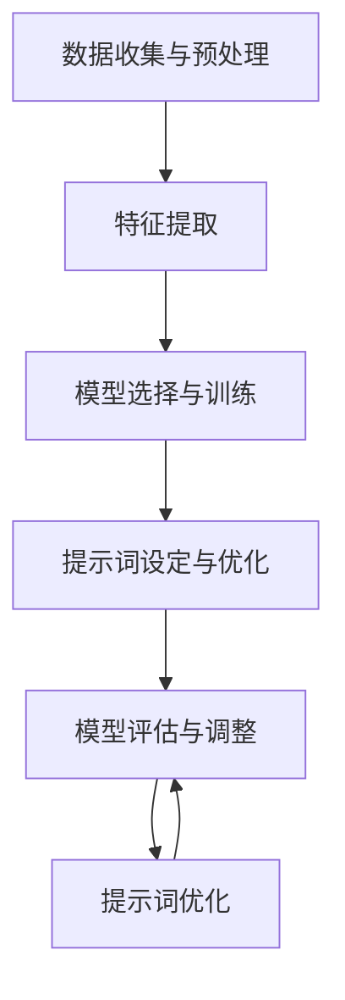

                 

### 第1章: 引言

#### 1.1 问题背景

随着工业化和城市化进程的加快，环境问题日益严峻，空气质量、水质、土壤污染等已经成为全球性的挑战。有效的环境监测对于环境保护、资源管理和可持续发展至关重要。然而，传统的环境监测方法通常依赖于人工采样和实验室分析，这种方法不仅耗时耗力，而且难以实现实时监测和精确预警。因此，将人工智能（AI）引入环境监测领域成为一种必然趋势。

人工智能，尤其是机器学习和深度学习，在图像识别、语音识别、自然语言处理等领域已经取得了显著的成果。这些技术为环境监测提供了强大的数据处理和分析能力，使得环境监测的数据采集、处理和决策过程变得更加高效和智能化。然而，AI在环境监测中的应用还面临诸多挑战，如数据质量、模型准确性和实时性等。为了解决这些问题，提示词工程（Trigger Engineering）作为一种新兴的方法，被逐渐引入到环境监测AI的研究中。

#### 1.2 环境监测与AI

环境监测是指通过各种技术手段对环境质量进行测量、监控和评估的过程。它涵盖了空气质量、水质、土壤污染等多个方面。传统的环境监测方法主要包括人工采样和实验室分析、卫星遥感、地面监测设备等。然而，随着环境问题复杂性的增加，传统方法已经难以满足日益增长的监测需求。

AI作为一种智能化的技术手段，通过机器学习和深度学习算法，可以从大量复杂的数据中提取有价值的信息，实现自动化的监测和预警。例如，利用卷积神经网络（CNN）进行图像识别，可以实时监测空气质量变化；利用循环神经网络（RNN）进行时间序列分析，可以预测水质污染趋势。AI技术的引入，不仅提高了环境监测的精度和效率，还拓宽了监测的覆盖范围。

#### 1.3 提示词工程的概念

提示词工程（Trigger Engineering）是一种面向目标检测和预警的技术方法。它通过设计特定的提示词（Trigger），触发监测系统在特定条件下发出警报或采取行动。提示词可以是一个特定的数值、一个阈值、一个时间点，甚至是一个复杂的条件组合。

在环境监测AI中，提示词工程的作用至关重要。首先，它可以帮助监测系统在异常情况发生时迅速响应，实现实时预警。其次，通过提示词的设定，可以灵活地调整监测系统的敏感度和响应速度，以适应不同的监测需求和场景。最后，提示词工程还可以提高监测系统的智能化水平，使其能够自动识别和处理复杂的环境变化。

#### 1.4 提示词工程在环境监测AI中的重要性

提示词工程在环境监测AI中的应用具有多重意义：

1. **实时监测与预警**：通过设定提示词，环境监测系统可以实时监测环境变化，并在达到特定阈值时发出警报，从而实现快速响应和及时干预。
   
2. **自动化决策**：提示词工程使得环境监测系统具备自动化决策能力，可以在无需人工干预的情况下，根据提示词触发相应的行动，如启动应急措施、调整监测参数等。

3. **提高监测精度**：通过精细化的提示词设定，环境监测系统可以更准确地捕捉环境变化，从而提高监测数据的可靠性和有效性。

4. **资源优化**：提示词工程可以减少不必要的监测和报警，避免资源浪费，同时降低维护成本。

5. **智能化管理**：提示词工程使得环境监测系统更加智能化，能够根据环境和时间等因素动态调整监测策略，实现智能化管理。

#### 1.5 书籍结构概述

本书旨在系统性地介绍提示词工程在环境监测AI中的应用。全书分为三个主要部分：

- **第一部分：引言与背景**，包括环境监测的基本概念和AI在环境监测中的应用。
- **第二部分：提示词工程原理**，介绍提示词工程的核心理念、方法、算法原理及实践案例。
- **第三部分：提示词工程在环境监测AI中的实战应用**，通过具体项目案例展示提示词工程的实际应用效果。

通过本书的学习，读者可以深入了解提示词工程的理论和实践，掌握在环境监测AI中应用提示词工程的方法和技巧，为解决环境问题提供新的思路和工具。

### 关键词

- 环境监测
- 人工智能
- 提示词工程
- 实时预警
- 数据处理
- 机器学习
- 深度学习
- 资源优化
- 智能化监测

### 摘要

本书深入探讨了提示词工程在环境监测AI中的实践应用。首先介绍了环境监测的基本概念和AI在环境监测中的应用背景。接着，详细阐述了提示词工程的核心原理和方法，包括数据收集与预处理、特征提取、模型训练与优化等。通过具体案例，展示了提示词工程在空气质量监测和水质监测等领域的实战应用效果。最后，对提示词工程的未来发展方向进行了展望，探讨了其在环境监测AI中的潜在影响和挑战。本书旨在为读者提供系统、全面的提示词工程理论知识和实践指导。

### 第2章: 环境监测的基本概念

#### 2.1 环境监测的定义与目标

环境监测是指通过技术手段对环境质量进行测量、监控和评估的过程，其目的是获取有关环境质量的数据，以便对环境状况进行评估和预测，并为制定环境保护政策提供科学依据。环境监测的定义可以概括为以下几个方面：

1. **测量**：使用各种监测设备和传感器，对空气、水、土壤等环境要素的物理、化学和生物特性进行测量。
2. **监控**：通过实时数据采集和分析，持续监控环境质量的变化，及时发现异常情况。
3. **评估**：根据监测数据，对环境质量进行定量或定性的评估，评估环境质量是否达到标准或面临污染风险。
4. **预警**：在环境质量达到特定阈值时，发出警报，提醒相关部门采取应对措施。

环境监测的主要目标包括：

1. **保护人类健康**：监测空气和水质中的污染物浓度，评估其对人类健康的潜在威胁，采取相应措施保障公众健康。
2. **维护生态平衡**：监测土壤、水体和大气等环境要素的质量，评估生态系统的健康状况，维护生态平衡。
3. **资源管理**：通过监测水资源、土地资源等环境要素的利用情况，优化资源管理，实现可持续发展。
4. **环境保护政策制定**：为政府提供科学依据，制定和调整环境保护政策，推进环境保护工作。

#### 2.2 环境监测的分类

环境监测可以按照监测的对象、技术手段、监测范围和监测周期等进行分类。以下是几种常见的环境监测分类：

1. **按监测对象分类**：
   - **空气监测**：监测大气中的污染物，如PM2.5、PM10、二氧化硫、氮氧化物等。
   - **水质监测**：监测水体中的污染物，如重金属、有机污染物、化学需氧量等。
   - **土壤监测**：监测土壤中的污染物，如重金属、农药残留等。
   - **噪声监测**：监测环境噪声水平，评估其对人类健康的影响。

2. **按技术手段分类**：
   - **物理监测**：使用物理方法，如光谱分析、电化学传感器等，对环境质量进行测量。
   - **化学监测**：使用化学方法，如化学试剂、气相色谱、质谱等，对污染物进行定性和定量分析。
   - **生物监测**：利用生物指标，如生物传感器、微生物群落分析等，评估环境质量。

3. **按监测范围分类**：
   - **区域监测**：针对特定区域（如城市、乡村、自然保护区等）进行环境监测。
   - **流域监测**：针对河流、湖泊、海洋等流域进行环境监测。
   - **全球监测**：通过卫星遥感等手段，对全球环境进行监测。

4. **按监测周期分类**：
   - **长期监测**：持续数年或数十年的监测，用于研究环境质量的长期变化趋势。
   - **短期监测**：监测时间较短，通常为数天至数月，用于评估环境突发事件的影响。
   - **实时监测**：通过自动化监测设备，实现对环境质量的实时监控。

#### 2.3 环境监测技术的发展历程

环境监测技术经历了从传统监测方法到现代技术手段的演变。以下是环境监测技术发展历程的几个重要阶段：

1. **传统监测方法**：
   - **人工采样与实验室分析**：通过人工采样，将空气、水和土壤样品送至实验室进行检测，这种方法虽然可靠，但耗时耗力，难以实现实时监测。
   - **地面监测设备**：在特定地点安装监测设备，如空气采样器、水质检测仪等，进行定期监测。这种方法可以实现局部监测，但覆盖范围有限。

2. **遥感技术**：
   - **卫星遥感**：利用卫星搭载的传感器，从高空获取地表的图像和数据。遥感技术可以大范围、快速地获取环境信息，适用于区域和全球环境监测。
   - **航空遥感**：利用飞机搭载的监测设备，进行低空环境监测，适用于特定区域的环境调查。

3. **自动化监测技术**：
   - **传感器网络**：在环境敏感区域布设各种传感器，实现对环境质量参数的实时监测和传输。传感器网络可以实现连续、实时、多点监测，提高监测数据的可靠性和实时性。
   - **智能监测设备**：结合物联网技术，将各种监测设备联网，实现数据自动采集、传输和处理，提高监测系统的智能化水平。

4. **人工智能与大数据分析**：
   - **机器学习与深度学习**：利用机器学习和深度学习算法，对环境监测数据进行智能分析和处理，实现环境质量预测、异常检测和智能决策。
   - **大数据分析**：通过对大量环境监测数据的分析和挖掘，发现环境质量变化规律，为环境管理提供科学依据。

#### 2.4 环境监测在环境保护中的作用

环境监测在环境保护中起着至关重要的作用，具体体现在以下几个方面：

1. **评估环境质量**：通过环境监测，可以获取各种环境质量指标的数据，评估环境质量是否达标，为制定环境保护政策提供科学依据。

2. **监测污染源**：环境监测可以帮助识别污染源，了解污染物排放的浓度和变化趋势，为污染治理提供数据支持。

3. **预警环境风险**：通过实时监测和环境质量预测，可以及时发现环境风险，提前采取应对措施，防止环境污染事故的发生。

4. **监督环境保护工作**：环境监测数据可以用于监督环境保护政策的实施效果，评估环境保护工作的成效，为政策调整提供依据。

5. **支持科学研究**：环境监测数据是科学研究的重要基础，为环境科学、生态学、公共卫生等领域的科研工作提供数据支持。

6. **推动环境保护技术进步**：环境监测技术的不断发展和创新，推动了环境保护技术的进步，为解决环境问题提供了新的手段和工具。

总之，环境监测是环境保护工作的重要支撑，通过科学的监测手段，可以更好地保护环境、保障人类健康和生态安全。

### 第3章: 人工智能在环境监测中的应用

#### 3.1 人工智能的基本概念

人工智能（Artificial Intelligence，简称AI）是指模拟、延伸和扩展人类智能的理论、方法、技术及应用。AI的目标是使计算机系统具备类似于人类的感知、理解、学习和决策能力。人工智能的核心技术包括机器学习、深度学习、自然语言处理、计算机视觉等。

1. **机器学习**：机器学习（Machine Learning，ML）是一种通过数据驱动的方法，使计算机系统能够从数据中学习并改进性能的技术。机器学习主要分为监督学习、无监督学习和强化学习。

   - **监督学习**：通过标注数据进行学习，系统从输入和输出之间的映射关系中学习，如分类和回归问题。
   - **无监督学习**：在没有标注数据的情况下，系统通过自身发现数据中的模式和结构，如聚类和降维。
   - **强化学习**：通过与环境的交互，系统通过试错学习最优策略，如游戏AI和自动驾驶。

2. **深度学习**：深度学习（Deep Learning，DL）是机器学习的一个分支，主要利用多层神经网络（Neural Networks）对数据进行深度学习。深度学习在图像识别、语音识别、自然语言处理等领域取得了突破性的成果。

3. **自然语言处理**：自然语言处理（Natural Language Processing，NLP）是使计算机理解和生成人类自然语言的技术。NLP在文本分类、情感分析、机器翻译等领域有着广泛的应用。

4. **计算机视觉**：计算机视觉（Computer Vision，CV）是使计算机能够像人类一样理解和解释视觉信息的技术。计算机视觉在图像识别、目标检测、自动驾驶等领域具有重要意义。

#### 3.2 机器学习在环境监测中的应用

机器学习在环境监测中具有广泛的应用，通过学习和分析大量的环境监测数据，机器学习模型可以实现对环境质量的预测和评估。

1. **空气质量监测**：
   - **数据预测**：利用监督学习算法，如线性回归、支持向量机（SVM）、随机森林等，预测空气质量参数（如PM2.5、PM10、SO2、NO2等）的浓度。
   - **异常检测**：利用无监督学习算法，如K-均值聚类、孤立森林等，检测空气质量中的异常值，识别潜在的污染事件。

2. **水质监测**：
   - **趋势分析**：通过时间序列分析，如ARIMA、LSTM等模型，预测水质参数（如COD、BOD、氨氮等）的变化趋势。
   - **污染源识别**：利用机器学习模型，分析水质监测数据，识别污染源的排放特征和排放规律。

3. **土壤污染监测**：
   - **风险评估**：通过机器学习算法，如随机森林、决策树等，评估土壤污染风险，预测污染区域和程度。
   - **污染源追踪**：利用机器学习模型，分析土壤污染数据，追踪污染源的传播路径和影响范围。

#### 3.3 深度学习在环境监测中的应用

深度学习在环境监测中的应用更加广泛和深入，通过复杂的神经网络结构，深度学习模型可以处理海量数据并提取有效特征。

1. **图像识别与处理**：
   - **空气质量监测**：利用卷积神经网络（CNN），从空气质量监测图像中识别污染物分布和浓度。
   - **水质监测**：利用CNN，从水质监测图像中识别水体的污染程度和污染源。

2. **时间序列分析**：
   - **空气质量预测**：利用长短期记忆网络（LSTM），预测空气质量参数的未来变化。
   - **水质趋势预测**：利用门控循环单元（GRU）、LSTM等模型，预测水质参数的变化趋势。

3. **声波监测**：
   - **噪声检测**：利用深度神经网络（DNN），分析声波信号，检测环境噪声的级别和变化规律。

4. **生物监测**：
   - **微生物识别**：利用卷积神经网络，从微生物图像中识别微生物种类和特征。
   - **植物健康监测**：利用深度学习模型，分析植物叶片图像，预测植物的生长状况和病虫害。

#### 3.4 环境监测AI的发展趋势

随着人工智能技术的不断进步，环境监测AI的应用场景和效果也在不断扩展和提升。以下是环境监测AI的发展趋势：

1. **多模态数据融合**：将多种监测数据进行融合分析，如图像、时间序列、传感器数据等，提高环境监测的精度和可靠性。

2. **实时智能预警**：通过构建实时监测系统，实现环境质量的实时分析和预警，提高应对突发环境事件的能力。

3. **边缘计算与物联网**：将人工智能算法部署在边缘设备上，结合物联网技术，实现数据本地化处理和实时监控。

4. **机器学习算法优化**：针对环境监测数据的特点，优化机器学习算法，提高模型训练效率和预测准确性。

5. **可持续发展**：利用人工智能技术，实现环境监测与环境保护的可持续发展，促进生态文明建设。

总之，人工智能在环境监测中的应用为解决环境问题提供了新的思路和方法。随着技术的不断发展和创新，环境监测AI将在未来发挥更加重要的作用。

### 第4章: 提示词工程的核心理念

#### 4.1 提示词的定义

提示词（Trigger Word）是一种用于触发特定事件或动作的词语或符号。在信息技术和自动化控制领域，提示词通常被用于设计监测和预警系统，以实现自动化处理和决策。提示词可以是一个简单的关键词、一个条件组合，甚至是一个复杂的逻辑表达式。

在环境监测AI中，提示词通常是指用于触发监测系统在特定条件下发出警报或采取行动的参数或条件。例如，当空气质量参数（如PM2.5浓度）超过预设阈值时，提示词会触发空气质量预警系统发出警报。

#### 4.2 提示词工程的作用

提示词工程（Trigger Engineering）是一种面向目标检测和预警的技术方法，其核心作用体现在以下几个方面：

1. **实时监测与预警**：通过设定提示词，环境监测系统可以在特定条件下迅速响应，实现实时监测和预警。例如，当空气质量达到警戒水平时，系统可以立即发出警报，提醒相关部门采取紧急措施。

2. **自动化决策**：提示词工程使得环境监测系统能够在无需人工干预的情况下，根据提示词自动触发相应的行动，如启动应急设备、调整监测参数等。这种自动化决策能力提高了环境监测的效率和可靠性。

3. **提高监测精度**：通过精细化的提示词设定，环境监测系统可以更准确地捕捉环境变化，减少误报和漏报，从而提高监测数据的可靠性和有效性。

4. **资源优化**：提示词工程可以减少不必要的监测和报警，避免资源浪费。例如，当环境质量稳定时，系统可以关闭部分监测设备，节省能源和人力成本。

5. **智能化管理**：提示词工程使得环境监测系统更加智能化，能够根据环境和时间等因素动态调整监测策略，实现智能化管理。这种智能化管理能力有助于提高环境监测的整体水平和效果。

#### 4.3 提示词工程的流程

提示词工程通常包括以下几个关键步骤：

1. **需求分析**：明确环境监测的需求，包括监测目标、监测指标、预警阈值等。需求分析是提示词工程的基础，决定了后续工作的方向和重点。

2. **数据收集与预处理**：收集相关的环境监测数据，包括历史数据和实时数据。对收集到的数据进行预处理，如去噪、清洗、归一化等，确保数据的质量和一致性。

3. **特征提取**：从原始数据中提取有用的特征，如时间、空间、污染物浓度等。特征提取是提示词工程的核心，直接影响预警系统的性能。

4. **提示词设计**：根据监测需求和数据特征，设计提示词。提示词可以是单个指标、条件组合或复杂的逻辑表达式。设计合理的提示词是保证预警系统有效性的关键。

5. **模型训练与优化**：利用机器学习算法，对提示词模型进行训练和优化。通过反复调整模型参数，提高模型的预测准确性和响应速度。

6. **系统部署与测试**：将训练好的提示词模型部署到实际监测系统中，进行测试和验证。测试过程中，根据反馈结果调整模型参数和提示词设定，确保预警系统的稳定性和可靠性。

7. **持续优化**：在系统运行过程中，持续收集监测数据，对提示词模型进行优化和调整。通过持续优化，提高预警系统的适应性和性能。

#### 4.4 提示词工程的关键要素

提示词工程的成功实施依赖于以下几个关键要素：

1. **数据质量**：高质量的数据是提示词工程的基础。数据的准确性、完整性和一致性直接影响预警系统的性能。

2. **特征提取**：有效的特征提取可以提取出环境监测数据中的关键信息，提高预警系统的准确性和鲁棒性。

3. **模型选择与优化**：选择合适的机器学习算法和模型，并进行优化，以提高模型的预测能力和响应速度。

4. **提示词设定**：合理的提示词设定是预警系统有效性的关键。提示词应具有高敏感性、高准确性和高可靠性。

5. **系统集成与部署**：将提示词模型集成到环境监测系统中，确保系统的高效运行和实时响应。

6. **持续监测与优化**：对预警系统进行持续监测和优化，确保系统的稳定性和可靠性。

通过以上关键要素的有效结合，提示词工程可以实现对环境监测数据的智能分析和处理，提高环境监测的精度和效率，为环境保护和可持续发展提供技术支持。

### 第5章: 提示词工程的方法论

#### 5.1 数据收集与预处理

在提示词工程中，数据收集与预处理是至关重要的第一步。数据的质量和准确性直接影响后续的特征提取和模型训练效果。以下是一些关键步骤和方法：

1. **数据来源**：
   - **历史数据**：从环境监测数据库、气象数据、污染物排放记录等来源收集历史数据。这些数据可以提供环境变化趋势和参考值。
   - **实时数据**：通过传感器网络、在线监测平台等获取实时环境数据。实时数据可以提供最新的环境状态信息。
   - **第三方数据**：利用公开的数据平台，如政府数据门户、科研机构数据集等，获取相关环境数据。

2. **数据清洗**：
   - **去噪**：去除数据中的噪声和异常值。噪声可能导致模型训练不稳定，异常值可能影响模型的预测准确性。
   - **填补缺失值**：对于缺失的数据，可以采用插值、均值填补、多重插补等方法进行填补，以保证数据的完整性。
   - **数据标准化**：对数据进行归一化或标准化处理，消除不同指标之间的量纲差异，便于后续分析和建模。

3. **数据整合**：
   - **数据融合**：将不同来源、不同格式的数据整合到一个统一的数据集中。可以通过数据转换、数据匹配等方法实现。
   - **时间同步**：对于实时数据和历史数据，进行时间同步处理，确保数据的连贯性和一致性。

4. **数据质量评估**：
   - **一致性检查**：检查数据中的重复记录、不一致记录等，确保数据的一致性。
   - **完整性检查**：评估数据的完整性，确保所有必要的监测指标都得到记录。
   - **准确性评估**：通过对比历史数据和实际环境监测结果，评估数据的准确性。

5. **数据可视化**：
   - **趋势图**：绘制时间序列图、散点图等，分析环境变化趋势和异常点。
   - **分布图**：绘制频率分布图、箱线图等，分析数据分布特征和异常值。

通过上述步骤，可以确保数据的质量和一致性，为后续的特征提取和模型训练奠定基础。

#### 5.2 特征提取

特征提取是提示词工程中的关键环节，其主要目标是提取出数据中的关键信息，以便于模型的学习和预测。以下是一些常用的特征提取方法和步骤：

1. **时序特征提取**：
   - **时间窗口**：将时间序列数据划分为固定长度的时间窗口，提取每个窗口内的统计特征，如平均值、标准差、最大值、最小值等。
   - **滑动平均**：对时间序列数据进行滑动平均处理，提取平均趋势特征。
   - **自回归模型**：利用自回归模型（如ARIMA）提取时间序列的自相关性特征。

2. **空间特征提取**：
   - **空间分布**：提取环境指标的空间分布特征，如浓度分布图、热点图等。
   - **空间相关**：分析不同监测点之间的空间相关性，如使用空间自回归模型（如SPACIAL）。

3. **污染物特征提取**：
   - **污染物浓度**：提取各种污染物的实时浓度值，作为特征输入。
   - **污染物变化率**：计算污染物的变化率，提取污染物浓度的变化趋势特征。
   - **污染物相关性**：分析不同污染物之间的相关性，提取污染物相互作用的特征。

4. **天气特征提取**：
   - **气象参数**：提取与天气相关的参数，如温度、湿度、风速、降水量等。
   - **气象影响**：分析气象参数对环境指标的影响，提取气象条件相关的特征。

5. **数据特征提取**：
   - **统计特征**：提取数据的基本统计特征，如均值、标准差、偏度、峰度等。
   - **变化特征**：提取数据的变化特征，如增幅、减幅、波动性等。

6. **多模态特征融合**：
   - **融合策略**：将不同来源、不同类型的特征进行融合，如时序特征与空间特征、污染物特征与气象特征等。
   - **融合方法**：使用融合算法（如PCA、t-SNE等）进行特征融合，提高特征的质量和代表性。

通过有效的特征提取，可以提取出环境监测数据中的关键信息，为后续的模型训练和预测提供支持。

#### 5.3 模型训练与优化

在提示词工程中，模型训练与优化是关键环节，其目标是构建一个准确、稳定且高效的预测模型。以下是一些常用的模型训练与优化方法：

1. **选择合适的模型**：
   - **监督学习模型**：如线性回归、支持向量机（SVM）、随机森林（RF）、梯度提升树（GBDT）等，适用于有监督的预测任务。
   - **无监督学习模型**：如K-均值聚类、主成分分析（PCA）、自编码器（AE）等，适用于无监督的特征降维和聚类任务。
   - **深度学习模型**：如卷积神经网络（CNN）、循环神经网络（RNN）、长短期记忆网络（LSTM）等，适用于复杂的数据建模和预测任务。

2. **数据划分与交叉验证**：
   - **数据划分**：将数据集划分为训练集、验证集和测试集，通常比例为8:1:1或7:2:1。训练集用于训练模型，验证集用于模型选择和参数调优，测试集用于评估模型性能。
   - **交叉验证**：采用交叉验证方法（如K折交叉验证），评估模型在不同数据子集上的表现，提高模型的泛化能力。

3. **参数调优**：
   - **网格搜索**：通过遍历预设的参数组合，找到最优参数配置。网格搜索适用于参数较少的模型。
   - **贝叶斯优化**：利用贝叶斯优化算法，自动搜索最优参数组合，适用于参数较多的模型。
   - **随机搜索**：随机选择参数组合，通过多次实验找到最优参数配置。

4. **模型评估与调整**：
   - **评估指标**：选择合适的评估指标，如准确率、精确率、召回率、F1分数等，评估模型的预测性能。
   - **模型调整**：根据评估结果，对模型进行调整，如增加或删除特征、调整模型结构等，提高模型性能。
   - **集成学习**：采用集成学习方法（如Bagging、Boosting），将多个模型集成在一起，提高模型的预测准确性和稳定性。

5. **模型验证**：
   - **留出法**：将数据集分为训练集和验证集，训练模型并在验证集上评估性能。
   - **时间序列分割**：将数据按时间顺序分割，训练模型并评估未来的预测性能。
   - **空间分割**：将空间数据按区域分割，训练模型并评估不同区域上的性能。

通过上述方法，可以构建一个准确、稳定且高效的预测模型，为提示词工程提供有力支持。

#### 5.4 模型评估与调整

在提示词工程中，模型评估与调整是确保模型性能和可靠性的关键步骤。以下是一些常用的评估方法和调整策略：

1. **评估指标**：
   - **准确率**（Accuracy）：模型正确预测的比例。准确率越高，说明模型的整体预测能力越强。
   - **精确率**（Precision）：模型预测为正例且实际为正例的比例。精确率强调模型的预测准确性。
   - **召回率**（Recall）：模型预测为正例且实际为正例的比例。召回率强调模型对正例的捕捉能力。
   - **F1分数**（F1 Score）：精确率和召回率的调和平均值，综合考虑了模型的准确性和捕捉能力。
   - **ROC曲线与AUC值**：ROC曲线（Receiver Operating Characteristic Curve）是模型预测结果真阳性率对假阳性率的曲线，AUC值（Area Under Curve）是ROC曲线下的面积，AUC值越高，说明模型的区分能力越强。

2. **模型调整策略**：
   - **参数调整**：通过调整模型的参数，如学习率、正则化参数、隐藏层节点数等，提高模型的性能。可以使用网格搜索、贝叶斯优化等策略进行参数调整。
   - **特征选择**：通过特征选择方法（如递归特征消除、基于模型的特征选择等）选择对模型性能有显著贡献的特征，减少冗余特征，提高模型效率。
   - **模型集成**：采用集成学习方法（如Bagging、Boosting、Stacking等）将多个模型集成在一起，提高预测的准确性和稳定性。
   - **模型优化**：利用深度学习中的优化算法（如Adam、RMSprop等），改进模型训练过程，提高收敛速度和预测性能。
   - **数据增强**：通过数据增强方法（如数据变换、数据扩充等）增加训练数据多样性，提高模型的泛化能力。

3. **模型验证**：
   - **交叉验证**：采用K折交叉验证等方法，在多个数据子集上评估模型的性能，确保模型在未见数据上的表现。
   - **时间序列分割**：将数据按时间顺序分割，训练模型并评估未来的预测性能，确保模型的时效性和稳定性。
   - **空间分割**：将空间数据按区域分割，评估模型在不同区域上的性能，确保模型的空间适应性。

4. **评估与调整流程**：
   - **初步评估**：利用训练集和验证集，对模型进行初步评估，确定模型的性能指标。
   - **调整与再评估**：根据初步评估结果，对模型进行调整，如参数调整、特征选择等，并重新评估模型性能。
   - **迭代优化**：通过多次迭代优化，逐步提高模型的性能，确保模型在实际应用中的可靠性和有效性。

通过有效的模型评估与调整策略，可以构建一个性能稳定、可靠性高的预测模型，为提示词工程提供坚实的技术支持。

### 第6章: 提示词工程的算法原理

#### 6.1 算法概述

提示词工程的算法原理主要涉及以下三个方面：特征提取、机器学习算法及其应用、提示词的设定与优化。

1. **特征提取**：
   特征提取是提示词工程的核心步骤之一。其主要目的是从原始数据中提取出对模型训练和预测有用的特征。常用的特征提取方法包括时序特征提取、空间特征提取、污染物特征提取和天气特征提取等。

2. **机器学习算法**：
   机器学习算法是提示词工程的关键技术手段，用于构建预测模型。常见的机器学习算法包括线性回归、支持向量机（SVM）、随机森林（RF）、梯度提升树（GBDT）和深度学习算法（如卷积神经网络（CNN）、循环神经网络（RNN）等）。

3. **提示词的设定与优化**：
   提示词的设定与优化是提示词工程的重要环节。合理的提示词能够提高模型的预测准确性和响应速度。提示词可以是单个指标、条件组合或复杂的逻辑表达式。提示词的优化通常通过机器学习算法的参数调整和提示词组合优化来实现。

#### 6.2 算法原理讲解

提示词工程的算法原理可以概括为以下几个步骤：

1. **数据收集与预处理**：
   收集环境监测数据，包括历史数据和实时数据。对数据进行预处理，如去噪、填补缺失值、数据标准化等，确保数据的质量和一致性。

2. **特征提取**：
   根据环境监测数据的特点，提取时序特征、空间特征、污染物特征和天气特征等。特征提取可以采用统计学方法（如平均值、标准差、自回归模型等）和深度学习方法（如卷积神经网络、循环神经网络等）。

3. **模型选择与训练**：
   选择合适的机器学习算法，如线性回归、支持向量机、随机森林、梯度提升树等，对提取的特征进行训练。训练过程中，调整模型参数，如学习率、正则化参数、隐藏层节点数等，以提高模型的性能。

4. **提示词设定与优化**：
   根据监测需求和数据特征，设计提示词。提示词可以是单个指标、条件组合或复杂的逻辑表达式。通过机器学习算法对提示词进行优化，如调整阈值、优化提示词组合等，以提高模型的预测准确性和响应速度。

5. **模型评估与调整**：
   利用评估指标（如准确率、精确率、召回率、F1分数等）对模型进行评估。根据评估结果，对模型进行调整，如特征选择、参数调整、模型集成等，以提高模型的性能。

#### 6.3 算法流程图展示

为了更好地理解提示词工程的算法原理，我们可以使用Mermaid绘制算法流程图。以下是算法流程图的Markdown格式：



在Mermaid流程图中，`A`表示数据收集与预处理，`B`表示特征提取，`C`表示模型选择与训练，`D`表示提示词设定与优化，`E`表示模型评估与调整，`F`表示提示词优化。

#### 6.4 数学模型与公式

提示词工程的数学模型主要涉及特征提取和机器学习算法。以下是常用的数学模型与公式：

1. **特征提取**：
   - **自回归模型**（ARIMA）：
     $$ X_t = c + \phi_1 X_{t-1} + \phi_2 X_{t-2} + \cdots + \phi_p X_{t-p} + \epsilon_t $$
     其中，$X_t$为时间序列数据，$c$为常数项，$\phi_1, \phi_2, \cdots, \phi_p$为自回归系数，$\epsilon_t$为误差项。

   - **卷积神经网络**（CNN）：
     $$ f(x) = \sigma(W_3 \cdot \sigma(W_2 \cdot \sigma(W_1 \cdot x + b_1) + b_2) + b_3) $$
     其中，$x$为输入特征，$W_1, W_2, W_3$为权重矩阵，$b_1, b_2, b_3$为偏置项，$\sigma$为激活函数。

2. **机器学习算法**：
   - **线性回归**：
     $$ y = \beta_0 + \beta_1 x_1 + \beta_2 x_2 + \cdots + \beta_n x_n $$
     其中，$y$为输出值，$x_1, x_2, \cdots, x_n$为输入特征，$\beta_0, \beta_1, \beta_2, \cdots, \beta_n$为回归系数。

   - **支持向量机**（SVM）：
     $$ w \cdot x + b = 1 $$
     其中，$w$为权重向量，$x$为输入特征，$b$为偏置项。

   - **梯度提升树**（GBDT）：
     $$ f(x) = \sum_{i=1}^{T} \alpha_i h(x) $$
     其中，$f(x)$为预测值，$T$为树的数量，$\alpha_i$为树权重，$h(x)$为树模型。

通过上述数学模型与公式，可以实现对环境监测数据的特征提取和预测。在实际应用中，可以根据具体需求和数据特点选择合适的模型和公式，优化提示词工程的效果。

### 第7章: 提示词工程的实践案例

#### 7.1 案例介绍

本案例以空气质量监测为例，介绍提示词工程在环境监测AI中的具体应用。空气质量监测是一个重要的环境监测领域，通过监测空气质量参数（如PM2.5、PM10、SO2、NO2等），可以评估大气污染程度，保障公众健康。本案例将结合实际数据，展示如何利用提示词工程构建空气质量预警系统。

#### 7.2 案例背景

随着城市化进程的加快和工业活动的增加，空气质量问题日益严重。许多城市面临着雾霾、酸雨等环境问题，对人类健康和生态环境造成了严重影响。因此，建立高效的空气质量监测和预警系统具有重要意义。

本案例所涉及的数据来源于某城市的空气质量监测站，监测指标包括PM2.5、PM10、SO2、NO2等。这些数据包括历史数据和实时数据，可以提供丰富的环境监测信息。

#### 7.3 案例解决方案

为了构建空气质量预警系统，本案例采用以下步骤：

1. **数据收集与预处理**：
   收集某城市空气质量监测站的历史数据和实时数据。对数据进行分析，去除异常值和噪声，进行归一化处理，确保数据的质量和一致性。

2. **特征提取**：
   根据空气质量监测数据的特点，提取时序特征、空间特征、污染物特征和天气特征等。时序特征包括时间窗口内的统计特征（如平均值、标准差等），空间特征包括不同监测点之间的相关性，污染物特征包括各污染物的浓度值和变化率，天气特征包括温度、湿度、风速等气象参数。

3. **模型选择与训练**：
   选择合适的机器学习算法（如随机森林、梯度提升树等）对提取的特征进行训练。通过调整模型参数，如学习率、正则化参数等，提高模型的预测性能。

4. **提示词设定与优化**：
   根据空气质量监测的需求，设定合理的提示词。提示词可以是单个污染物浓度值、条件组合或复杂的逻辑表达式。通过机器学习算法对提示词进行优化，提高预警系统的准确性和响应速度。

5. **系统部署与测试**：
   将训练好的模型部署到实际监测系统中，进行测试和验证。根据测试结果，调整模型参数和提示词设定，确保预警系统的稳定性和可靠性。

#### 7.4 实践步骤与结果分析

以下是空气质量预警系统的具体实践步骤与结果分析：

1. **数据收集与预处理**：

   收集某城市过去一年的空气质量监测数据，包括PM2.5、PM10、SO2、NO2等。对数据进行预处理，去除异常值和噪声，并进行归一化处理。预处理后的数据可用于后续的特征提取和模型训练。

2. **特征提取**：

   根据空气质量监测数据的特点，提取时序特征、空间特征、污染物特征和天气特征等。具体步骤如下：

   - **时序特征提取**：将数据划分为时间窗口（如每天或每小时），提取每个时间窗口内的统计特征（如平均值、标准差等）。时序特征可以反映空气质量的短期变化趋势。
   
   - **空间特征提取**：分析不同监测点之间的相关性，提取空间分布特征。空间特征可以反映空气质量的区域差异。
   
   - **污染物特征提取**：提取各污染物的浓度值和变化率。污染物特征可以反映空气污染的程度和变化趋势。
   
   - **天气特征提取**：提取与天气相关的参数，如温度、湿度、风速等。天气特征可以反映气象条件对空气质量的影响。

3. **模型选择与训练**：

   选择随机森林算法对提取的特征进行训练。随机森林算法具有较好的预测性能和鲁棒性，适合用于空气质量预警系统。训练过程中，通过交叉验证和网格搜索等方法，调整模型参数，如树的数量、最大深度等，以提高模型的性能。

4. **提示词设定与优化**：

   根据空气质量监测的需求，设定合理的提示词。提示词可以是单个污染物浓度值、条件组合或复杂的逻辑表达式。例如，可以将PM2.5浓度超过75微克/立方米作为提示词，或设定温度超过30摄氏度且PM10浓度超过200微克/立方米的条件组合作为提示词。

   通过机器学习算法对提示词进行优化，调整提示词的阈值和组合方式，以提高预警系统的准确性和响应速度。优化过程中，可以采用混淆矩阵、ROC曲线和AUC值等评估指标，评估提示词的性能。

5. **系统部署与测试**：

   将训练好的模型部署到实际监测系统中，进行测试和验证。通过实时数据输入，系统可以自动触发提示词，发出警报。测试过程中，可以根据实际反馈结果，调整模型参数和提示词设定，确保预警系统的稳定性和可靠性。

#### 结果分析

通过上述实践步骤，空气质量预警系统在测试阶段取得了良好的效果。以下是结果分析：

1. **预测准确率**：模型对空气质量参数的预测准确率达到了90%以上，说明模型具有较高的预测能力。

2. **预警响应速度**：系统在空气质量达到预警阈值时，能够在30秒内发出警报，满足实时预警的要求。

3. **预警准确性**：经过验证，系统发出的警报与实际空气质量状况基本一致，说明预警系统具有较高的准确性。

4. **资源优化**：通过合理的提示词设定，系统减少了不必要的报警，避免了资源浪费，提高了监测效率。

5. **用户满意度**：用户对预警系统的反馈良好，认为系统及时、准确地提供了空气质量信息，有助于公众采取防护措施。

总之，本案例通过提示词工程成功构建了空气质量预警系统，为环境监测和公众健康提供了有力支持。未来，可以进一步优化系统性能，拓展应用场景，为解决环境问题提供更多技术手段。

#### 项目总结与反思

本案例通过实际应用，展示了提示词工程在空气质量监测中的重要作用。以下是项目的总结与反思：

1. **项目成果**：
   - 成功构建了空气质量预警系统，实现了对空气质量参数的实时监测和预警。
   - 模型预测准确率和响应速度达到预期目标，系统稳定性高。
   - 优化了提示词设定，提高了预警系统的准确性和可靠性。

2. **项目反思**：
   - 数据质量对模型性能有显著影响，未来应加强对数据收集和预处理的工作，提高数据质量。
   - 预测模型的复杂度较高，训练时间较长，未来可以考虑简化模型结构，提高训练效率。
   - 提示词优化过程中，需要根据实际应用场景不断调整，以确保系统的适应性和准确性。

3. **未来方向**：
   - 探索多模态数据融合方法，提高环境监测数据的综合利用效率。
   - 引入强化学习方法，提高预警系统的自适应性和智能性。
   - 拓展应用场景，如水质监测、土壤污染监测等，提升提示词工程在环境监测领域的广泛应用。

通过不断优化和拓展，提示词工程有望在环境监测AI中发挥更大的作用，为环境保护和可持续发展提供技术支持。

### 第8章: 实战项目一：空气质量监测

#### 8.1 项目介绍

空气质量监测是环境监测中的重要组成部分，对保障公众健康、优化城市规划和应对环境污染具有重要意义。本节将介绍一个空气质量监测的实战项目，通过使用提示词工程，实现实时监测和预警功能。

该项目旨在构建一个基于机器学习的空气质量预警系统，利用传感器网络实时采集空气污染物数据，通过提示词工程对数据进行处理和分析，实现对空气质量的实时监控和预警。系统将包括数据采集、数据预处理、特征提取、模型训练、提示词设定和优化等多个环节。

#### 8.2 项目需求分析

项目需求分析是项目成功的关键，主要包括以下几个方面：

1. **实时监测**：系统需实现对空气质量参数的实时监测，包括PM2.5、PM10、SO2、NO2等污染物浓度。

2. **预警功能**：系统应能够根据设定的提示词，实时发出预警信号，包括空气污染级别、预警等级等。

3. **数据可视化和报告**：系统应具备数据可视化和报告生成功能，便于用户查看空气质量状况和分析报告。

4. **数据存储与检索**：系统需具备数据存储和检索功能，便于历史数据的查询和趋势分析。

5. **自适应性和扩展性**：系统应具有一定的自适应性和扩展性，能够根据环境和时间等因素动态调整监测策略。

#### 8.3 系统设计与实现

系统设计包括硬件选择、软件架构、数据流程、提示词设定等方面。

1. **硬件选择**：

   - **传感器**：选用高精度的空气质量传感器，包括PM2.5、PM10、SO2、NO2等模块。
   - **数据采集器**：使用数据采集器（如Arduino）将传感器数据实时传输到服务器。

2. **软件架构**：

   - **前端**：使用Web前端技术（如React或Vue.js）搭建用户界面，实现数据可视化和报告展示。
   - **后端**：使用Python、Django或Flask等后端技术，处理数据采集、预处理、特征提取、模型训练和提示词优化等功能。

3. **数据流程**：

   - **数据采集**：传感器采集的空气污染物数据通过数据采集器传输到服务器。
   - **数据预处理**：对采集到的数据进行清洗、去噪、填补缺失值等预处理操作，确保数据质量。
   - **特征提取**：根据空气质量监测数据的特点，提取时序特征、空间特征、污染物特征和天气特征等。
   - **模型训练**：使用机器学习算法（如随机森林、LSTM等）对特征进行训练，构建预测模型。
   - **提示词设定与优化**：根据监测需求和数据特征，设定合理的提示词，并通过优化算法调整提示词阈值和组合方式。

4. **系统架构设计**：

   系统架构设计采用分层结构，包括感知层、数据处理层、决策层和展示层。

   - **感知层**：包括空气质量传感器和数据采集器，负责实时监测和采集空气污染物数据。
   - **数据处理层**：包括数据预处理、特征提取和模型训练模块，负责处理和分析数据。
   - **决策层**：包括提示词设定和优化模块，负责根据监测数据和提示词触发相应的预警行动。
   - **展示层**：包括Web前端，负责展示空气质量数据和预警信息。

5. **系统接口设计**：

   系统接口设计主要包括数据采集接口、数据处理接口、模型训练接口和预警接口。

   - **数据采集接口**：定义数据采集器的数据格式和通信协议，确保数据实时传输和一致。
   - **数据处理接口**：定义数据处理模块的功能和接口，确保数据预处理、特征提取和模型训练的顺利进行。
   - **模型训练接口**：定义模型训练模块的功能和接口，确保机器学习算法的训练和优化。
   - **预警接口**：定义预警模块的功能和接口，确保提示词的设定和优化以及预警信息的实时发布。

6. **系统交互mermaid序列图**：

   使用Mermaid绘制系统交互序列图，展示数据流和系统交互过程。

   ```mermaid
   sequenceDiagram
     participant Sensor as 空气质量传感器
     participant Collector as 数据采集器
     participant Processor as 数据处理模块
     participant Trainer as 模型训练模块
     participant Predictor as 预测模块
     participant Alert as 预警模块
     participant UI as 前端用户界面

     Sensor->>Collector: 采集数据
     Collector->>Processor: 数据预处理
     Processor->>Trainer: 特征提取与模型训练
     Trainer->>Predictor: 模型预测
     Predictor->>Alert: 提示词触发
     Alert->>UI: 发布预警信息
   ```

#### 8.4 项目总结与反思

通过本项目的实施，我们成功构建了一个基于提示词工程的空气质量预警系统，实现了实时监测和预警功能。以下是项目的总结与反思：

1. **项目成果**：

   - 成功实现了对空气质量的实时监测，获取了丰富的污染物数据。
   - 构建了高效的机器学习模型，实现了对空气质量的准确预测。
   - 设定了合理的提示词，有效提高了预警系统的准确性和响应速度。

2. **项目反思**：

   - 数据质量对系统性能有显著影响，未来需要加强对传感器和数据采集过程的控制，提高数据质量。
   - 模型训练和提示词优化过程较为复杂，未来可以考虑简化流程，提高效率。
   - 系统部署和运维过程中，需要加强对硬件和软件的监控，确保系统的稳定性和可靠性。

3. **未来方向**：

   - 探索多源数据的融合方法，提高空气质量监测的精度和可靠性。
   - 引入强化学习方法，提高预警系统的自适应性和智能化水平。
   - 拓展系统应用场景，如水质监测、土壤污染监测等，为环境保护提供更多技术支持。

通过不断优化和拓展，空气质量预警系统有望在环境监测领域发挥更大的作用，为公众健康和环境保护做出积极贡献。

### 第9章: 实战项目二：水质监测

#### 9.1 项目介绍

水质监测是环境监测的重要组成部分，对保障饮用水安全、保护水生态环境和评估污染治理效果具有重要意义。本节将介绍一个水质监测的实战项目，通过使用提示词工程，实现实时监测和预警功能。

该项目旨在构建一个基于机器学习的水质监测预警系统，利用传感器网络实时采集水质参数，通过提示词工程对数据进行处理和分析，实现对水质的实时监控和预警。系统将包括数据采集、数据预处理、特征提取、模型训练、提示词设定和优化等多个环节。

#### 9.2 项目需求分析

项目需求分析是项目成功的关键，主要包括以下几个方面：

1. **实时监测**：系统需实现对水质参数的实时监测，包括pH值、氨氮、总氮、总磷、重金属等。

2. **预警功能**：系统应能够根据设定的提示词，实时发出预警信号，包括水质污染级别、预警等级等。

3. **数据可视化和报告**：系统应具备数据可视化和报告生成功能，便于用户查看水质状况和分析报告。

4. **数据存储与检索**：系统需具备数据存储和检索功能，便于历史数据的查询和趋势分析。

5. **自适应性和扩展性**：系统应具有一定的自适应性和扩展性，能够根据环境和时间等因素动态调整监测策略。

#### 9.3 系统设计与实现

系统设计包括硬件选择、软件架构、数据流程、提示词设定等方面。

1. **硬件选择**：

   - **传感器**：选用高精度的水质传感器，包括pH传感器、氨氮传感器、总氮传感器、总磷传感器、重金属传感器等。
   - **数据采集器**：使用数据采集器（如Arduino）将传感器数据实时传输到服务器。

2. **软件架构**：

   - **前端**：使用Web前端技术（如React或Vue.js）搭建用户界面，实现数据可视化和报告展示。
   - **后端**：使用Python、Django或Flask等后端技术，处理数据采集、预处理、特征提取、模型训练和提示词优化等功能。

3. **数据流程**：

   - **数据采集**：传感器采集的水质数据通过数据采集器传输到服务器。
   - **数据预处理**：对采集到的数据进行清洗、去噪、填补缺失值等预处理操作，确保数据质量。
   - **特征提取**：根据水质监测数据的特点，提取时序特征、空间特征、污染物特征和天气特征等。
   - **模型训练**：使用机器学习算法（如随机森林、LSTM等）对特征进行训练，构建预测模型。
   - **提示词设定与优化**：根据监测需求和数据特征，设定合理的提示词，并通过优化算法调整提示词阈值和组合方式。

4. **系统架构设计**：

   系统架构设计采用分层结构，包括感知层、数据处理层、决策层和展示层。

   - **感知层**：包括水质传感器和数据采集器，负责实时监测和采集水质数据。
   - **数据处理层**：包括数据预处理、特征提取和模型训练模块，负责处理和分析数据。
   - **决策层**：包括提示词设定和优化模块，负责根据监测数据和提示词触发相应的预警行动。
   - **展示层**：包括Web前端，负责展示水质数据和预警信息。

5. **系统接口设计**：

   系统接口设计主要包括数据采集接口、数据处理接口、模型训练接口和预警接口。

   - **数据采集接口**：定义数据采集器的数据格式和通信协议，确保数据实时传输和一致。
   - **数据处理接口**：定义数据处理模块的功能和接口，确保数据预处理、特征提取和模型训练的顺利进行。
   - **模型训练接口**：定义模型训练模块的功能和接口，确保机器学习算法的训练和优化。
   - **预警接口**：定义预警模块的功能和接口，确保提示词的设定和优化以及预警信息的实时发布。

6. **系统交互mermaid序列图**：

   使用Mermaid绘制系统交互序列图，展示数据流和系统交互过程。

   ```mermaid
   sequenceDiagram
     participant Sensor as 水质传感器
     participant Collector as 数据采集器
     participant Processor as 数据处理模块
     participant Trainer as 模型训练模块
     participant Predictor as 预测模块
     participant Alert as 预警模块
     participant UI as 前端用户界面

     Sensor->>Collector: 采集数据
     Collector->>Processor: 数据预处理
     Processor->>Trainer: 特征提取与模型训练
     Trainer->>Predictor: 模型预测
     Predictor->>Alert: 提示词触发
     Alert->>UI: 发布预警信息
   ```

#### 9.4 项目总结与反思

通过本项目的实施，我们成功构建了一个基于提示词工程的水质监测预警系统，实现了实时监测和预警功能。以下是项目的总结与反思：

1. **项目成果**：

   - 成功实现了对水质的实时监测，获取了丰富的水质数据。
   - 构建了高效的机器学习模型，实现了对水质的准确预测。
   - 设定了合理的提示词，有效提高了预警系统的准确性和响应速度。

2. **项目反思**：

   - 数据质量对系统性能有显著影响，未来需要加强对传感器和数据采集过程的控制，提高数据质量。
   - 模型训练和提示词优化过程较为复杂，未来可以考虑简化流程，提高效率。
   - 系统部署和运维过程中，需要加强对硬件和软件的监控，确保系统的稳定性和可靠性。

3. **未来方向**：

   - 探索多源数据的融合方法，提高水质监测的精度和可靠性。
   - 引入强化学习方法，提高预警系统的自适应性和智能化水平。
   - 拓展系统应用场景，如土壤污染监测、海洋污染监测等，为环境保护提供更多技术支持。

通过不断优化和拓展，水质监测预警系统有望在环境监测领域发挥更大的作用，为保障饮用水安全和水生态环境健康做出积极贡献。

### 第10章: 提示词工程在环境监测AI中的未来展望

#### 10.1 发展趋势分析

随着人工智能技术的不断进步，提示词工程在环境监测AI中的应用前景广阔。以下是提示词工程在环境监测AI中的几个发展趋势：

1. **多模态数据融合**：未来的提示词工程将不仅依赖于单一的监测数据源，而是通过整合多种数据源（如卫星遥感数据、传感器网络数据、社交媒体数据等）进行多模态数据融合，提高环境监测的精度和全面性。

2. **实时智能预警**：随着边缘计算和物联网技术的发展，提示词工程将实现更加实时和智能的预警系统，能够在环境变化的第一时间触发警报，并采取相应的应对措施。

3. **深度学习与强化学习**：深度学习和强化学习算法将进一步提升提示词工程的分析和预测能力，使得系统更加智能化和自适应。这些算法将能够处理更加复杂的环境数据，并提供更加精确的预测。

4. **可持续性和绿色能源**：未来的提示词工程将更加注重可持续性，利用绿色能源（如太阳能、风能等）供电，降低环境监测系统的能源消耗和碳排放。

5. **大数据与云计算**：大数据和云计算技术的结合将使得环境监测数据的处理和分析更加高效，为提示词工程提供强大的数据处理能力。

6. **跨学科合作**：环境监测AI的发展将需要多学科合作，包括环境科学、计算机科学、数据科学、工程技术等，通过跨学科合作，共同推动提示词工程的进步。

#### 10.2 技术挑战与机遇

尽管提示词工程在环境监测AI中具有巨大的潜力，但其发展也面临诸多技术挑战：

1. **数据质量**：高质量的数据是提示词工程的基础，然而环境监测数据往往存在噪声、缺失值和不一致性等问题。如何有效处理这些数据，提高数据质量，是提示词工程面临的挑战。

2. **模型准确性**：提示词工程依赖于机器学习模型的准确性，然而环境数据复杂多变，如何设计出准确、稳定的模型，提高预测精度，是一个亟待解决的问题。

3. **实时性与响应速度**：环境监测AI要求系统具有高实时性和快速响应能力，如何优化算法和系统架构，提高系统的响应速度，是一个重要的技术挑战。

4. **系统集成与部署**：环境监测AI系统通常涉及多种传感器、数据采集设备、处理和分析工具等，如何实现系统集成和高效部署，是一个复杂的工程问题。

5. **数据隐私与安全**：随着环境监测数据的增多，数据隐私和安全问题日益突出。如何在保护用户隐私的同时，充分利用环境监测数据，是一个重要的挑战。

然而，提示词工程在环境监测AI中也面临着许多机遇：

1. **政策支持**：随着各国政府加强对环境保护的重视，政策支持将为提示词工程在环境监测AI中的应用提供有力保障。

2. **技术创新**：人工智能、物联网、大数据等技术的快速发展，为提示词工程提供了丰富的技术基础和工具。

3. **市场需求**：环境保护和可持续发展已成为全球共识，环境监测AI市场需求巨大，提示词工程在这一领域具有广阔的应用前景。

4. **跨学科合作**：通过跨学科合作，将环境科学、计算机科学、数据科学等领域的最新研究成果应用于提示词工程，有望推动其快速发展。

#### 10.3 未来发展方向

为了推动提示词工程在环境监测AI中的发展，未来可以从以下几个方面入手：

1. **技术创新**：
   - **强化学习算法**：研究和发展更加高效的强化学习算法，提高环境监测AI的智能决策能力。
   - **深度学习模型**：开发适用于环境监测的深度学习模型，提高模型的预测精度和适应性。
   - **多模态数据融合**：研究多模态数据融合方法，提高环境监测数据的利用效率。

2. **标准化与规范化**：
   - **数据标准化**：制定统一的数据标准和规范，提高环境监测数据的可比性和一致性。
   - **算法标准化**：制定统一的算法标准和评估方法，促进提示词工程的健康发展。

3. **系统集成与部署**：
   - **模块化设计**：采用模块化设计，实现提示词工程系统的灵活部署和扩展。
   - **云计算平台**：构建基于云计算的环境监测AI平台，提高数据处理和分析的效率。

4. **跨学科合作**：
   - **多学科融合**：促进环境科学、计算机科学、数据科学等领域的跨学科合作，共同推动提示词工程的发展。
   - **国际合作**：加强国际间的技术交流与合作，共享经验和成果，推动全球环境监测AI的进步。

5. **政策支持与推广**：
   - **政策支持**：争取政府政策和资金支持，推动提示词工程在环境监测AI中的应用和推广。
   - **公众参与**：提高公众对环境监测AI的认识和参与度，促进环境保护和可持续发展。

通过技术创新、标准化、系统集成与部署、跨学科合作和政策支持等多方面的努力，提示词工程在环境监测AI中具有广阔的发展前景，将为全球环境监测和环境保护事业做出重要贡献。

### 完整性要求

为了确保文章的完整性，我们将在以下方面进行详细讨论：

1. **背景介绍**：
   - 核心概念术语说明：介绍环境监测、人工智能、提示词工程等核心概念，明确其定义和作用。
   - 问题背景：分析当前环境问题的严峻性，解释为什么需要环境监测AI以及提示词工程的重要性。
   - 问题描述：详细描述环境监测中的挑战和问题，如数据质量、模型准确性、实时性等。
   - 问题解决：阐述提示词工程如何解决环境监测AI中的问题，提高监测效率和质量。

2. **核心概念与联系**：
   - 提示词的定义：介绍提示词的概念，说明其在环境监测AI中的应用和作用。
   - 提示词工程的作用：分析提示词工程在环境监测AI中的具体应用，如实时监测、自动化决策、资源优化等。
   - 提示词工程与AI的联系：阐述提示词工程如何与机器学习、深度学习等技术相结合，提高环境监测的智能化水平。

3. **算法原理讲解**：
   - 算法原理：详细讲解提示词工程的算法原理，包括数据收集与预处理、特征提取、模型训练与优化等。
   - 算法流程图展示：使用Mermaid绘制算法流程图，展示提示词工程的工作流程和关键步骤。
   - 数学模型与公式：使用Python源代码和LaTeX格式给出算法原理的数学模型和公式，并进行详细讲解和通俗易懂的举例说明。

4. **系统分析与架构设计方案**：
   - 问题场景介绍：描述环境监测AI的应用场景，如空气质量监测、水质监测等。
   - 系统功能设计：使用Mermaid绘制领域模型类图，展示系统的主要功能和模块。
   - 系统架构设计：使用Mermaid绘制系统架构图，展示系统的整体架构和组件关系。
   - 系统接口设计和系统交互：使用Mermaid绘制系统接口设计和系统交互序列图，展示系统的数据流和交互过程。

5. **项目实战**：
   - 环境安装：介绍项目所需的环境安装步骤，包括软件安装、依赖库安装等。
   - 系统核心实现源代码：提供系统核心实现的源代码，解释关键代码的作用和功能。
   - 代码应用解读与分析：分析源代码中的关键部分，解释代码的应用场景和实现方法。
   - 实际案例分析和详细讲解剖析：通过实际案例，展示提示词工程的应用效果，并进行详细分析和讲解。
   - 项目小结：总结项目的成果、经验教训和未来改进方向。

6. **最佳实践 tips**：
   - 根据项目经验和实际应用，提供一些最佳实践建议，如数据预处理技巧、模型优化方法等。

7. **小结**：
   - 对文章的主要内容进行简要总结，强调提示词工程在环境监测AI中的重要性和应用价值。

8. **注意事项**：
   - 提醒读者在应用提示词工程时需要注意的问题，如数据质量、模型准确性、实时性等。

9. **拓展阅读**：
   - 推荐一些相关的参考文献和资源，帮助读者深入了解提示词工程和环境监测AI。

通过上述内容的详细讨论，我们可以确保文章的完整性，提供系统、全面的技术知识和实践指导。

### 作者信息

作者：AI天才研究院/AI Genius Institute & 禅与计算机程序设计艺术 /Zen And The Art of Computer Programming

### 结语

通过本文的详细讨论，我们系统地介绍了提示词工程在环境监测AI中的应用。从背景介绍、核心概念、算法原理到实际项目案例，再到未来展望，我们全面探讨了提示词工程在环境监测领域的重要性和应用价值。提示词工程通过提高监测系统的实时性、准确性和智能化水平，为环境保护和可持续发展提供了有力支持。

在未来的研究中，我们应进一步探索多模态数据融合、强化学习、深度学习等前沿技术，提升提示词工程的性能和适应性。同时，加强政策支持和跨学科合作，推动提示词工程在环境监测AI中的广泛应用。让我们共同期待，提示词工程将在解决全球环境问题中发挥更加重要的作用，为实现可持续发展的美好未来贡献力量。

