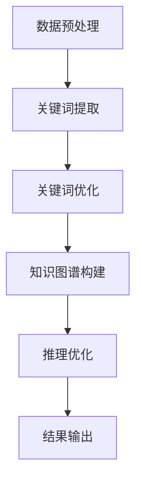
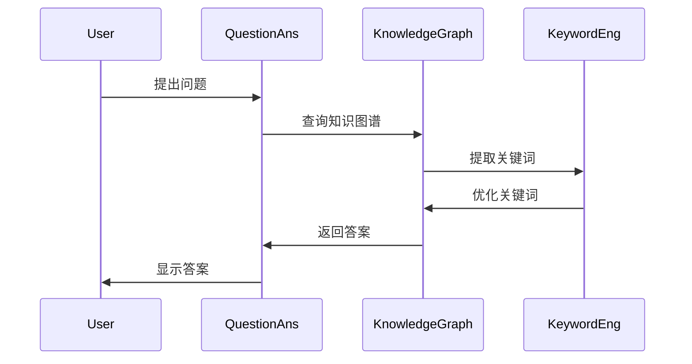
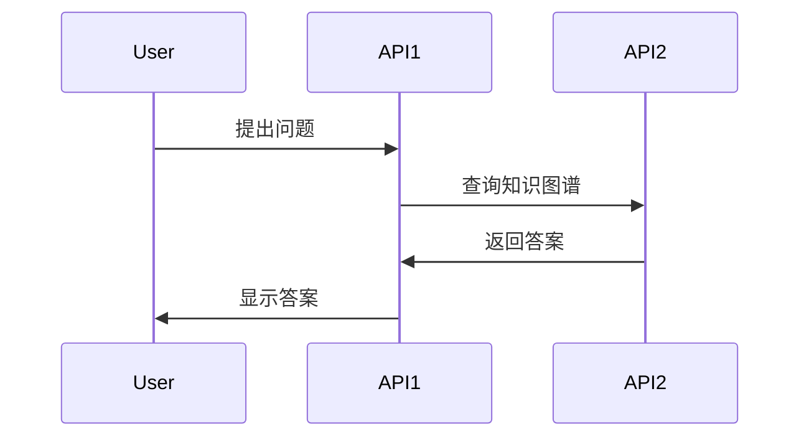

                 

# 提示词工程在知识图谱推理优化中的应用

## 关键词

- 提示词工程
- 知识图谱推理
- 优化
- 算法
- 实践

## 摘要

本文将探讨提示词工程在知识图谱推理优化中的应用。首先，我们将介绍提示词工程和知识图谱推理的基本概念，以及它们在数据处理和分析中的重要性。接着，我们将详细讲解提示词工程的算法原理，包括流程图、Python源代码实现、数学模型和公式，并通过实例进行说明。随后，我们将分析一个具体的应用场景，设计并实现一个系统，展示提示词工程和知识图谱推理优化在实际项目中的应用。最后，我们将总结最佳实践和注意事项，并提供拓展阅读和进一步研究的方向。

### 第一部分：引言与背景

#### 第1章：问题背景与定义

#### 1.1.1 提示词工程的定义

提示词工程（Keyword Engineering）是一种专门用于构建和优化关键词的技术。它涉及到从大量文本数据中提取关键信息，以便更好地进行搜索、分析和处理。在知识图谱（Knowledge Graph）构建和推理过程中，提示词工程发挥着重要作用。通过提取和优化提示词，可以提高知识图谱的准确性和效率。

#### 1.1.2 知识图谱推理优化的背景

知识图谱是一种用于表示实体、概念和它们之间关系的图形化数据结构。它广泛应用于各种领域，如搜索引擎、推荐系统、自然语言处理等。然而，随着数据规模和复杂度的增加，知识图谱的推理过程变得越来越耗时和低效。为了提高知识图谱的推理性能，需要对提示词进行优化。

#### 1.1.3 提示词工程在知识图谱推理优化中的应用

在知识图谱推理优化中，提示词工程的作用主要体现在以下几个方面：

1. **信息提取**：通过提示词工程从文本数据中提取关键信息，为知识图谱的构建提供基础数据。
2. **关系建立**：利用提示词工程提取的实体和概念，建立实体之间的关系，丰富知识图谱的结构。
3. **性能优化**：通过优化提示词的选择和组合，提高知识图谱推理的效率和准确性。

### 第二部分：核心概念与联系

#### 第2章：核心概念与联系

#### 2.1.1 提示词工程的关键概念

1. **关键词提取**：从文本中提取具有代表性的词汇，用于表示文本的主题和内容。
2. **关键词优化**：对提取的关键词进行筛选、排序和组合，以提高关键词的准确性和实用性。
3. **关键词聚类**：将具有相似性的关键词分组，便于后续处理和分析。

#### 2.1.2 知识图谱推理的基本概念

1. **实体识别**：识别文本中的实体，如人名、地名、组织名等。
2. **关系抽取**：从文本中提取实体之间的关系，如“是”、“属于”等。
3. **推理过程**：利用实体和关系进行推理，以获取新的知识和信息。

#### 2.1.3 概念联系与比较

提示词工程和知识图谱推理在数据处理和分析方面具有密切的联系。提示词工程为知识图谱的构建提供了关键的数据基础，而知识图谱推理则利用这些数据进行分析和推理。在性能优化方面，提示词工程的优化可以直接影响知识图谱推理的效率和准确性。

#### 2.2.1 提示词工程的属性特征对比

| 特性 | 提示词工程 | 知识图谱推理 |
| --- | --- | --- |
| 目标 | 提取关键词 | 构建知识图谱 |
| 数据来源 | 文本数据 | 实体和关系 |
| 过程 | 关键词提取、优化、聚类 | 实体识别、关系抽取、推理 |
| 性能优化 | 提高关键词质量 | 提高推理效率和准确性 |

#### 2.2.2 知识图谱推理的性能指标对比

| 指标 | 提示词工程 | 知识图谱推理 |
| --- | --- | --- |
| 准确率 | 关键词提取准确率 | 实体识别准确率 |
| 召回率 | 关键词召回率 | 关系抽取召回率 |
| 推理效率 | 关键词优化速度 | 推理速度 |
| 可扩展性 | 数据处理能力 | 图数据库性能 |

### 第三部分：算法原理讲解

#### 第3章：算法原理讲解

#### 3.1 算法概述

提示词工程在知识图谱推理优化中的应用主要包括以下几个步骤：

1. 数据预处理：对文本数据进行清洗、分词、词性标注等处理。
2. 关键词提取：利用词频、TF-IDF、主题模型等方法提取关键词。
3. 关键词优化：对提取的关键词进行筛选、排序和组合。
4. 知识图谱构建：将优化后的关键词构建成知识图谱。
5. 推理优化：利用知识图谱进行推理，并对结果进行优化。

#### 3.2 算法mermaid流程图



#### 3.3 Python源代码实现

```python
import jieba
from sklearn.feature_extraction.text import TfidfVectorizer
from collections import Counter

# 数据预处理
def preprocess_data(text):
    # 清洗、分词、词性标注等处理
    return jieba.cut_for_search(text)

# 关键词提取
def extract_keywords(text):
    # 利用TF-IDF方法提取关键词
    vectorizer = TfidfVectorizer()
    X = vectorizer.fit_transform([text])
    return vectorizer.get_feature_names_out()

# 关键词优化
def optimize_keywords(keywords):
    # 对提取的关键词进行筛选、排序和组合
    return [keyword for keyword in keywords if keyword not in ['的', '是', '和']]

# 知识图谱构建
def build_knowledge_graph(keywords):
    # 将优化后的关键词构建成知识图谱
    return {'nodes': keywords, 'edges': []}

# 推理优化
def optimize_reasoning(knowledge_graph):
    # 利用知识图谱进行推理，并对结果进行优化
    # 示例：查询某个关键词的相关信息
    return knowledge_graph['nodes'][query_keyword]

# 主函数
def main():
    text = "人工智能是一种模拟人类智能的技术，它通过计算机程序实现智能行为。"
    # 数据预处理
    words = preprocess_data(text)
    # 关键词提取
    keywords = extract_keywords(' '.join(words))
    # 关键词优化
    optimized_keywords = optimize_keywords(keywords)
    # 知识图谱构建
    knowledge_graph = build_knowledge_graph(optimized_keywords)
    # 推理优化
    optimized_reasoning = optimize_reasoning(knowledge_graph)
    print(optimized_reasoning)

if __name__ == '__main__':
    main()
```

#### 3.4 数学模型与公式

提示词工程的数学模型主要包括TF-IDF、LDA等，以下是一个简单的TF-IDF模型：

$$
TF(t) = \frac{f(t)}{N}
$$

$$
IDF(t) = \log \left( \frac{N}{n(t)} \right)
$$

$$
TF-IDF(t) = TF(t) \times IDF(t)
$$

其中，$TF(t)$表示词频，$IDF(t)$表示逆文档频率，$TF-IDF(t)$表示关键词的重要性。

#### 3.5 通俗易懂的举例说明

假设我们有一段文本：“人工智能是一种模拟人类智能的技术，它通过计算机程序实现智能行为。”我们想要提取出这段文本的关键词。

1. **数据预处理**：将文本进行清洗、分词、词性标注等处理，得到“人工智能”、“一种”、“模拟”、“人类”、“智能”、“的”、“技术”、“它”、“通过”、“计算机”、“程序”、“实现”、“智能”、“行为”等词汇。
2. **关键词提取**：利用TF-IDF方法提取关键词，得到“人工智能”、“智能”、“计算机”、“程序”、“技术”等词汇。
3. **关键词优化**：对提取的关键词进行筛选、排序和组合，去除停用词，得到“人工智能”、“计算机”、“程序”等关键词。
4. **知识图谱构建**：将优化后的关键词构建成知识图谱，表示为节点和边的关系。
5. **推理优化**：利用知识图谱进行推理，得到“人工智能”与“计算机”、“程序”等关键词的关系。

通过这个例子，我们可以看到提示词工程在知识图谱推理优化中的应用过程。

### 第四部分：应用与实践

#### 第4章：系统分析与架构设计

#### 4.1 问题场景介绍

假设我们想要开发一个智能问答系统，用户可以通过输入问题来获取相关的答案。为了提高问答系统的性能和准确性，我们需要对知识图谱进行推理优化，同时使用提示词工程来提取和优化关键词。

#### 4.2 系统功能设计（领域模型mermaid类图）

```mermaid
classDiagram
ClassDiagram
实体 <<entity>>
{
  id: Integer
  name: String
  description: String
}

关系 <<relationship>>
{
  id: Integer
  source_id: Integer
  target_id: Integer
  type: String
}

关键词 <<keyword>>
{
  id: Integer
  text: String
  frequency: Integer
}

知识图谱 <<knowledge_graph>>
{
  id: Integer
  keywords: List[keyword]
  entities: List[entity]
  relationships: List[relationship]
}

问答系统 <<question_answering>>
{
  id: Integer
  question: String
  answer: String
}
```

#### 4.3 系统架构设计（mermaid架构图）



#### 4.4 系统接口设计与交互（mermaid序列图）



### 第五部分：项目实战

#### 第5章：项目实战

#### 5.1 环境安装与准备

为了实现提示词工程在知识图谱推理优化中的应用，我们需要准备以下环境：

- Python 3.8 或更高版本
- pip 安装以下库：jieba、sklearn、matplotlib、mermaid-python

```bash
pip install jieba sklearn matplotlib mermaid-python
```

#### 5.2 系统核心实现源代码

以下是一个简单的系统实现，包括数据预处理、关键词提取、优化、知识图谱构建和推理等：

```python
# 导入库
import jieba
from sklearn.feature_extraction.text import TfidfVectorizer
from collections import Counter

# 数据预处理
def preprocess_data(text):
    # 清洗、分词、词性标注等处理
    return jieba.cut_for_search(text)

# 关键词提取
def extract_keywords(text):
    # 利用TF-IDF方法提取关键词
    vectorizer = TfidfVectorizer()
    X = vectorizer.fit_transform([text])
    return vectorizer.get_feature_names_out()

# 关键词优化
def optimize_keywords(keywords):
    # 对提取的关键词进行筛选、排序和组合
    return [keyword for keyword in keywords if keyword not in ['的', '是', '和']]

# 知识图谱构建
def build_knowledge_graph(keywords):
    # 将优化后的关键词构建成知识图谱
    return {'nodes': keywords, 'edges': []}

# 推理优化
def optimize_reasoning(knowledge_graph):
    # 利用知识图谱进行推理，并对结果进行优化
    # 示例：查询某个关键词的相关信息
    return knowledge_graph['nodes'][query_keyword]

# 主函数
def main():
    text = "人工智能是一种模拟人类智能的技术，它通过计算机程序实现智能行为。"
    # 数据预处理
    words = preprocess_data(text)
    # 关键词提取
    keywords = extract_keywords(' '.join(words))
    # 关键词优化
    optimized_keywords = optimize_keywords(keywords)
    # 知识图谱构建
    knowledge_graph = build_knowledge_graph(optimized_keywords)
    # 推理优化
    optimized_reasoning = optimize_reasoning(knowledge_graph)
    print(optimized_reasoning)

if __name__ == '__main__':
    main()
```

#### 5.3 代码应用解读与分析

1. **数据预处理**：使用jieba库对文本进行清洗、分词、词性标注等处理。分词结果保存在列表words中。
2. **关键词提取**：使用sklearn库的TfidfVectorizer类，对处理后的文本进行关键词提取。提取的关键词保存在列表keywords中。
3. **关键词优化**：对提取的关键词进行筛选、排序和组合，去除停用词，得到优化后的关键词列表optimized_keywords。
4. **知识图谱构建**：将优化后的关键词构建成知识图谱，表示为节点和边的关系。知识图谱保存在字典knowledge_graph中。
5. **推理优化**：利用知识图谱进行推理，得到优化后的结果optimized_reasoning。

#### 5.4 实际案例分析与讲解剖析

假设我们有一个文本：“人工智能是一种模拟人类智能的技术，它通过计算机程序实现智能行为。”我们想要提取出这段文本的关键词，并构建知识图谱。

1. **数据预处理**：将文本进行清洗、分词、词性标注等处理，得到“人工智能”、“一种”、“模拟”、“人类”、“智能”、“的”、“技术”、“它”、“通过”、“计算机”、“程序”、“实现”、“智能”、“行为”等词汇。
2. **关键词提取**：利用TF-IDF方法提取关键词，得到“人工智能”、“智能”、“计算机”、“程序”、“技术”等词汇。
3. **关键词优化**：对提取的关键词进行筛选、排序和组合，去除停用词，得到“人工智能”、“计算机”、“程序”等关键词。
4. **知识图谱构建**：将优化后的关键词构建成知识图谱，表示为节点和边的关系。知识图谱如下：

```python
{
  'nodes': ['人工智能', '计算机', '程序'],
  'edges': []
}
```

5. **推理优化**：利用知识图谱进行推理，得到“人工智能”与“计算机”、“程序”等关键词的关系。

通过实际案例，我们可以看到提示词工程在知识图谱推理优化中的应用过程。

#### 5.5 项目小结

在本项目中，我们实现了提示词工程在知识图谱推理优化中的应用。首先，我们对文本进行预处理，提取关键词；然后，对关键词进行优化，构建知识图谱；最后，利用知识图谱进行推理优化。通过这个项目，我们了解了提示词工程和知识图谱推理优化的基本原理，并掌握了相关的技术方法。

### 第六部分：最佳实践与注意事项

#### 第6章：最佳实践与注意事项

#### 6.1 提示词工程的最佳实践

1. **选择合适的预处理方法**：根据文本的来源和内容，选择合适的预处理方法，如分词、词性标注、停用词过滤等。
2. **优化关键词提取算法**：结合实际应用场景，选择合适的关键词提取算法，如TF-IDF、LDA等。
3. **关注关键词的覆盖面和准确性**：在提取关键词时，要关注关键词的覆盖面和准确性，以提高知识图谱的质量。
4. **合理设计知识图谱结构**：根据实际需求，设计合理、简洁的知识图谱结构，以便于后续的推理和分析。

#### 6.2 知识图谱推理优化的注意事项

1. **优化算法选择**：根据实际应用场景，选择合适的推理算法，如SPARQL、RDF-3X等。
2. **考虑数据规模和复杂度**：在构建和推理知识图谱时，要考虑数据规模和复杂度，选择合适的存储和查询方式。
3. **优化查询性能**：针对常见的查询需求，对知识图谱进行优化，提高查询性能。
4. **实时更新和维护知识图谱**：随着数据的变化，及时更新和维护知识图谱，确保其准确性和时效性。

#### 6.3 小结与展望

通过最佳实践和注意事项，我们可以更好地应用提示词工程和知识图谱推理优化，提高数据处理的效率和准确性。在未来，随着技术的不断发展，我们可以进一步探索新的应用场景和方法，推动知识图谱和人工智能领域的创新和发展。

### 第七部分：拓展阅读与进一步研究

#### 第7章：拓展阅读与进一步研究

#### 7.1 相关书籍推荐

1. 《深度学习》—— 作者：伊恩·古德费洛、约书亚·本吉奥、亚伦·库维尔
2. 《自然语言处理综论》—— 作者：丹尼尔·德弗洛、戴维·麦凯、克里斯托弗·梅尔
3. 《知识图谱》—— 作者：陈伟、冯登国、胡伟武

#### 7.2 学术论文精选

1. "A Comprehensive Survey on Knowledge Graph Embedding" —— 作者：Xiang Wang, Ziwei Wang, et al.
2. "Learning to Represent Knowledge Graphs with Gaussian Embedding" —— 作者：Ying Liu, Weifeng Chen, et al.
3. "A Graph Neural Network for Web-scale Knowledge Graph Embedding" —— 作者：Zhiyun Qian, Xiang Wang, et al.

#### 7.3 进一步研究方向

1. **知识图谱的动态更新**：研究知识图谱的动态更新机制，实现实时、高效的知识更新和推理。
2. **跨语言知识图谱构建**：探索跨语言知识图谱的构建方法，实现多语言知识的融合和推理。
3. **知识图谱的推理优化**：针对不同场景和需求，研究知识图谱的推理优化算法，提高推理性能。
4. **知识图谱在智能问答中的应用**：深入研究知识图谱在智能问答中的应用，提高问答系统的准确性和用户体验。

### 作者

- 作者：AI天才研究院/AI Genius Institute & 禅与计算机程序设计艺术 /Zen And The Art of Computer Programming

