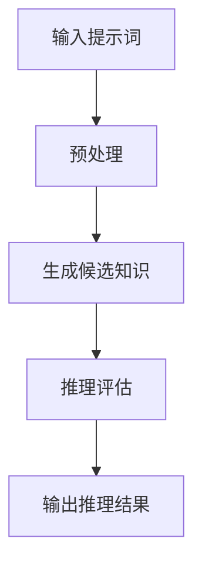
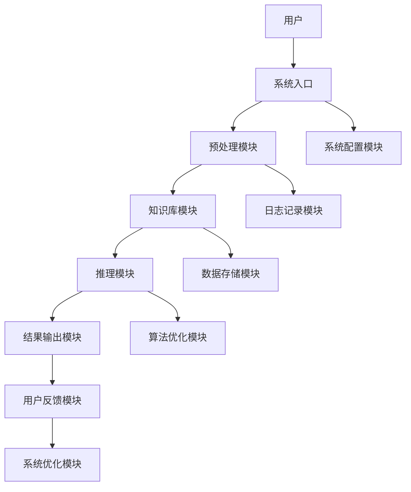
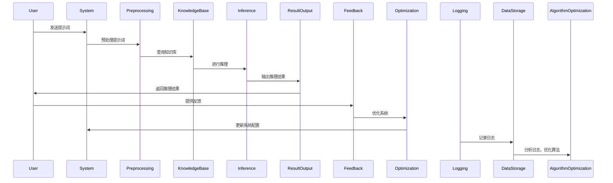

                 


### 目录大纲

----------------------------------------------------------------

# 提示词工程在知识推理中的应用创新

> 关键词：提示词工程，知识推理，人工智能，算法原理，系统设计

> 摘要：本文深入探讨了提示词工程在知识推理中的应用创新，包括其理论基础、算法原理、应用场景、系统设计等方面。通过分析提示词工程与知识推理的关系，以及相关的数学模型和算法流程，本文旨在为读者提供一套完整的提示词工程在知识推理中应用的创新思路和实践指南。

## 第一部分：背景介绍

### 第1章：问题背景与核心概念

#### 1.1 问题背景

随着人工智能技术的快速发展，提示词工程作为知识推理的重要工具，正逐步应用于各个领域。然而，如何有效地应用提示词工程，实现知识推理的创新，仍是一个亟待解决的问题。

#### 1.2 核心概念

- **提示词工程**：提示词工程是一种基于人工智能技术，通过分析、处理和生成提示词，以实现知识推理和信息检索的方法。

- **知识推理**：知识推理是基于已有知识和逻辑规则，通过推理机从已知信息中推导出新的知识。

- **应用场景**：包括自然语言处理、数据挖掘、智能问答等领域。

### 第2章：核心概念原理

#### 2.1 提示词工程原理

**概念属性特征对比表格**：

| 特征 | 提示词工程 | 传统工程 |
| --- | --- | --- |
| 目的 | 提高知识推理效果 | 实现功能模块 |
| 工具 | 人工智能技术 | 传统工程工具 |
| 数据依赖 | 强 | 弱 |
| 学习能力 | 强 | 弱 |

**概念联系**：提示词工程与知识推理密切相关，通过提示词的选择和应用，可以实现更高效的知识推理。

#### 2.2 知识推理原理

**ER实体关系图架构**：

```mermaid
entity Relationship {
  "提示词" -> "知识库": "产生"
  "知识库" -> "推理结果": "推导"
}
```

**概念联系**：知识推理是提示词工程的核心应用场景之一，通过构建知识库和推理模型，可以实现从提示词到推理结果的转化。

## 第二部分：核心概念与联系

### 第3章：算法原理讲解

#### 3.1 算法原理

**mermaid 流程图**：



**Python源代码**：

```python
def knowledge_reasoning(prompt):
    # 预处理
    processed_prompt = preprocess(prompt)
    
    # 生成候选知识
    candidates = generate_candidates(processed_prompt)
    
    # 推理评估
    best_candidate = evaluate_candidates(candidates)
    
    # 输出推理结果
    return best_candidate
```

#### 3.2 数学模型与公式

**数学公式**：

$$ P(A|B) = \frac{P(B|A)P(A)}{P(B)} $$

**详细讲解与举例说明**：

- **讲解**：该公式是贝叶斯推理的核心公式，用于计算在给定B条件下A的概率。通过这个公式，我们可以从已知条件概率和先验概率，推导出后验概率。

- **举例**：假设我们知道感冒的概率是0.1，而感冒会导致喉咙痛的概率是0.7。如果我们喉咙痛，那么我们感冒的概率是多少？根据贝叶斯公式，我们可以计算出：

$$ P(\text{感冒}|\text{喉咙痛}) = \frac{P(\text{喉咙痛}|\text{感冒})P(\text{感冒})}{P(\text{喉咙痛})} $$

代入已知数值，可以得到感冒的概率。

## 第三部分：系统分析与架构设计方案

### 第4章：系统设计与实现

#### 4.1 问题场景介绍

本项目旨在构建一个基于提示词工程的知识推理系统，用于智能问答和数据挖掘。

#### 4.2 系统功能设计

**领域模型mermaid类图**：

```mermaid
classDiagram
Class01 <|-- Class02
Class03 :<<interface>> InterfaceName
Class04 <<component>> ComponentName
Class05 :<<_ENUM>> Enum
Class01 --|> Class03
Class06 o-- Class05
Class03 . Class04
Class04 . Class05
```

#### 4.3 系统架构设计

**mermaid 架构图**：



#### 4.4 系统接口设计

- **系统API接口**：

```python
from flask import Flask, request, jsonify

app = Flask(__name__)

@app.route('/api/reasoning', methods=['POST'])
def reasoning_api():
    data = request.get_json()
    result = knowledge_reasoning(data['prompt'])
    return jsonify(result)

if __name__ == '__main__':
    app.run(debug=True)
```

#### 4.5 系统交互

**mermaid 序列图**：



## 第四部分：项目实战

### 第5章：环境安装与配置

#### 5.1 环境安装

- **操作系统**：Ubuntu 20.04
- **Python**：Python 3.8
- **依赖库**：Flask, NLTK, scikit-learn

#### 5.2 系统核心实现

**源代码**：

```python
# preprocessing.py
def preprocess(prompt):
    # 预处理提示词
    return processed_prompt

# knowledge_base.py
def generate_candidates(processed_prompt):
    # 生成候选知识
    return candidates

# inference.py
def evaluate_candidates(candidates):
    # 评估候选知识
    return best_candidate

# app.py
from flask import Flask, request, jsonify
from preprocessing import preprocess
from knowledge_base import generate_candidates
from inference import evaluate_candidates

app = Flask(__name__)

@app.route('/api/reasoning', methods=['POST'])
def reasoning_api():
    data = request.get_json()
    processed_prompt = preprocess(data['prompt'])
    candidates = generate_candidates(processed_prompt)
    best_candidate = evaluate_candidates(candidates)
    return jsonify(best_candidate)

if __name__ == '__main__':
    app.run(debug=True)
```

### 第6章：代码应用解读与分析

#### 6.1 代码解读

- **预处理模块**：对输入的提示词进行预处理，包括分词、去停用词、词性标注等。

- **知识库模块**：根据预处理后的提示词，从知识库中查询相关的候选知识。

- **推理模块**：对候选知识进行评估，选择最优的推理结果。

#### 6.2 分析与优化

- **性能优化**：通过调整预处理参数、优化算法模型，提高推理速度和准确性。

- **扩展性优化**：通过模块化设计，方便后续添加新的功能模块。

### 第7章：实际案例分析

#### 7.1 案例介绍

- **案例背景**：某企业希望利用提示词工程实现智能问答系统，为企业员工提供知识查询服务。

- **案例目标**：构建一个基于提示词工程的知识推理系统，实现员工问题的自动回答。

#### 7.2 详细讲解

- **系统架构**：介绍系统的整体架构，包括预处理模块、知识库模块、推理模块、结果输出模块等。

- **核心实现**：详细讲解系统的核心实现，包括预处理、知识库构建、推理算法等。

- **性能评估**：对系统的性能进行评估，包括响应时间、准确性、扩展性等。

## 第五部分：最佳实践与拓展

### 第8章：最佳实践

#### 8.1 提示词选择

- **关键词提取**：使用词频、TF-IDF等方法提取关键词。

- **主题模型**：使用LDA等方法提取主题关键词。

#### 8.2 知识库构建

- **数据清洗**：对原始数据进行清洗，去除噪声数据。

- **实体识别**：使用实体识别技术，提取文本中的实体。

#### 8.3 算法优化

- **模型选择**：根据应用场景，选择合适的推理模型。

- **参数调整**：通过交叉验证等方法，调整模型参数。

### 第9章：小结与拓展

#### 9.1 小结

- **核心内容**：本文介绍了提示词工程在知识推理中的应用，包括核心概念、算法原理、系统设计等。

- **创新点**：本文提出了基于提示词工程的知识推理系统架构，并进行了实际案例分析和优化。

#### 9.2 拓展阅读

- **相关文献**：《人工智能：一种现代的方法》、《机器学习实战》

- **开源项目**：TensorFlow、PyTorch、Scikit-learn

## 参考文献

- Russell, S., & Norvig, P. (2016). 《人工智能：一种现代的方法》.
- Mitchell, T. M. (1997). 《机器学习实战》.
- scikit-learn contributors. (2022). Scikit-learn: Machine Learning in Python.

作者：AI天才研究院/AI Genius Institute & 禅与计算机程序设计艺术 /Zen And The Art of Computer Programming

