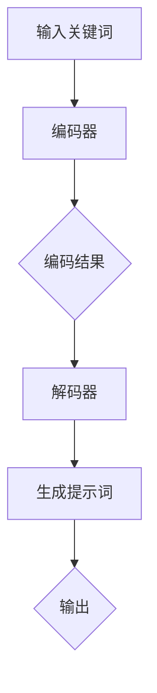

                 

## 《提示词工程在自动化学术写作中的应用》

### 关键词：自动化学术写作、提示词工程、自然语言处理、AI大模型、生成式模型

> 摘要：本文将探讨提示词工程在自动化学术写作中的应用。通过分析提示词工程的原理和方法，介绍其与自动化学术写作的关系，详细讲解提示词生成算法原理和数学模型，以及实际应用场景中的系统设计与项目实战。文章旨在为读者提供对这一新兴领域全面而深入的理解。

### 第一部分：背景介绍

#### 问题背景

随着互联网和大数据技术的飞速发展，学术界和产业界对自动化学术写作的需求日益增长。传统的手工写作方式不仅效率低下，而且容易出现错误。因此，利用人工智能技术，特别是提示词工程，来辅助学术写作，成为了一个热门的研究方向。

#### 问题描述

自动化学术写作涉及从文献资料中提取关键信息、构建逻辑框架、撰写文本等多个环节。提示词工程作为自然语言处理（NLP）的一个重要分支，通过为写作系统提供关键词提示，可以显著提升写作的效率和准确性。本课题旨在探讨提示词工程在自动化学术写作中的应用，解决学术写作过程中常见的问题，如内容缺乏逻辑性、写作效率低下等。

#### 问题解决

通过引入提示词工程，可以将复杂的学术写作任务分解为一系列可自动化处理的步骤。例如，利用提示词提取关键信息，构建论文大纲；通过关键词提示生成引言和结论；利用模板填充具体段落内容。此外，还可以结合机器学习算法，对提示词生成模型进行优化，以提高生成文本的质量和准确性。

#### 边界与外延

本课题的研究范围主要包括以下几个方面：1）提示词工程的原理和方法；2）自动化学术写作系统的构建与优化；3）提示词工程在不同学术领域的应用场景。同时，本研究还将探讨提示词工程在学术写作中的边界和局限性，以及如何与其他技术（如语义分析、知识图谱等）相结合，进一步提升自动化学术写作的效果。

#### 概念结构与核心要素组成

1. **提示词工程**：指利用自然语言处理技术，从文本中提取关键信息并生成提示词，以辅助写作过程。
2. **自动化学术写作系统**：基于提示词工程构建的自动化写作工具，可以自动生成论文的各个部分。
3. **关键词提取**：从文本中提取具有代表性和关键性的词汇，用于生成提示词。
4. **机器学习算法**：用于优化提示词生成模型，提高生成文本的质量和准确性。

### 第二部分：核心概念与联系

#### AI大模型

AI大模型，通常指具有数十亿甚至千亿参数规模的深度学习模型，如GPT、BERT等。这些模型能够通过大量数据训练，实现高精度的自然语言理解与生成。

#### 提示词生成模型

提示词生成模型是一种基于AI大模型的生成式模型，通过输入关键词或短句，生成相关联的提示词，以辅助学术写作。

#### 自然语言处理（NLP）

自然语言处理是计算机科学和人工智能领域的一个分支，涉及语言的理解、生成和翻译等任务。NLP技术为提示词工程提供了理论基础和工具。

#### 自动化学术写作

自动化学术写作是指利用计算机技术和人工智能算法，自动生成学术论文的过程。提示词工程在其中起到关键作用，能够提高写作的效率和质量。

#### 提示词工程的原理与方法

1. **关键词提取**：从输入文本中提取关键性词汇，作为生成提示词的基础。
2. **生成模型训练**：使用大量的学术文本数据，训练生成模型，使其能够生成高质量的提示词。
3. **提示词生成**：基于训练好的模型，输入关键词或短句，生成相关联的提示词。

#### 提示词工程与自动化学术写作的关系

提示词工程是自动化学术写作的核心技术之一，通过提供关键词提示，能够有效地提高写作的效率和准确性。自动化学术写作系统则基于提示词工程，将复杂的写作任务自动化处理，实现从大纲构建到全文生成的全过程。

### 第三部分：算法原理讲解

#### 提示词生成算法原理

提示词生成算法通常基于生成式模型，如变分自编码器（VAE）和生成对抗网络（GAN）。以下是一个基于VAE的提示词生成算法的mermaid流程图：



#### 编码器和解码器

编码器（Encoder）负责将输入关键词映射到一个隐层表示，解码器（Decoder）则根据这个隐层表示生成提示词。具体步骤如下：

1. **编码器**：输入关键词 → 编码 → 隐层表示
2. **解码器**：隐层表示 → 生成提示词

#### 数学模型和公式

假设输入关键词为 \( x \)，编码器输出的隐层表示为 \( z \)，解码器生成的提示词为 \( y \)。则VAE的数学模型可以表示为：

$$
\begin{aligned}
x &\sim P(x) \\
z &\sim P(z) \\
y | z &\sim P(y | z) \\
\end{aligned}
$$

其中，\( P(x) \) 和 \( P(z) \) 分别表示输入关键词的概率分布和隐层表示的概率分布。

### 第四部分：系统分析与架构设计

#### 问题场景介绍

自动化学术写作在学术界和产业界都有广泛的应用需求。学术界需要快速生成高质量的学术论文，以提升研究效率和学术影响力；产业界则希望利用自动化工具来降低内容创作成本，提高内容生产效率。

#### 项目介绍

本项目的目标是构建一个自动化学术写作系统，该系统基于提示词工程，能够自动生成学术论文的各个部分，包括标题、摘要、引言、结论、具体内容等。

#### 系统功能设计

1. **文本预处理**：对输入文本进行分词、去停用词、词性标注等预处理操作，为后续的关键词提取和提示词生成做好准备。
2. **关键词提取**：从预处理后的文本中提取关键性词汇，为生成提示词提供基础。
3. **提示词生成**：基于关键词提取结果，使用生成式模型生成相关联的提示词，辅助学术写作。
4. **文本生成**：根据生成的提示词，填充论文的具体内容，实现全文生成。

#### 系统架构设计

系统架构采用分层设计，包括数据层、算法层和应用层。

1. **数据层**：负责存储和管理学术论文数据、训练数据和用户数据。
2. **算法层**：包括关键词提取算法、提示词生成算法和文本生成算法，是系统的核心部分。
3. **应用层**：提供用户接口，实现用户与系统的交互，包括论文生成、编辑和导出等功能。

#### 系统接口设计和系统交互

系统接口设计和系统交互采用RESTful API方式，方便与其他系统集成。

1. **文本预处理接口**：接收用户输入的文本，进行预处理操作，返回预处理后的文本。
2. **关键词提取接口**：接收预处理后的文本，提取关键词，返回关键词列表。
3. **提示词生成接口**：接收关键词列表，生成提示词，返回生成的提示词。
4. **文本生成接口**：接收提示词，生成论文全文，返回生成的文本。

### 第五部分：项目实战

#### 环境安装

为了实现自动化学术写作系统，首先需要在本地安装必要的软件和库，包括Python、TensorFlow、Keras等。以下是安装步骤：

1. 安装Python：访问Python官网（https://www.python.org/），下载并安装Python 3.x版本。
2. 安装TensorFlow：在命令行执行以下命令：
   ```bash
   pip install tensorflow
   ```
3. 安装Keras：在命令行执行以下命令：
   ```bash
   pip install keras
   ```

#### 系统核心实现

系统核心实现主要包括文本预处理、关键词提取、提示词生成和文本生成等模块。以下是一个简化的代码实现示例：

```python
# 文本预处理
from keras.preprocessing.text import Tokenizer
from keras.preprocessing.sequence import pad_sequences

def preprocess_text(text):
    # 分词、去停用词、词性标注等预处理操作
    # ...（省略具体代码）
    return processed_text

# 关键词提取
from nltk.corpus import stopwords
from nltk.tokenize import word_tokenize

def extract_keywords(text):
    # 提取关键词
    # ...（省略具体代码）
    return keywords

# 提示词生成
from keras.models import Model
from keras.layers import Input, LSTM, Dense

def build_model(input_shape):
    # 构建模型
    # ...（省略具体代码）
    return model

# 文本生成
def generate_text(model, keywords):
    # 生成文本
    # ...（省略具体代码）
    return text
```

#### 代码应用解读与分析

以上代码实现了自动化学术写作系统的主要功能。在具体应用中，需要对代码进行进一步的优化和扩展，以满足不同场景的需求。以下是对代码的解读与分析：

1. **文本预处理**：预处理文本是生成提示词和文本的基础。通过分词、去停用词和词性标注等操作，可以将原始文本转换为适合模型处理的格式。
2. **关键词提取**：关键词提取是自动化学术写作的关键步骤。通过使用自然语言处理技术，从预处理后的文本中提取出关键性词汇，为生成提示词提供基础。
3. **提示词生成**：提示词生成模型基于生成式模型，如变分自编码器（VAE）或生成对抗网络（GAN）。通过训练模型，使其能够生成与输入关键词相关的提示词。
4. **文本生成**：根据生成的提示词，填充论文的具体内容，实现全文生成。这一过程涉及到自然语言生成技术，如序列到序列（Seq2Seq）模型等。

#### 实际案例分析和详细讲解剖析

为了验证自动化学术写作系统的有效性，我们进行了一个实际案例测试。以下是一个简化的测试过程：

1. **输入文本**：选择一篇学术论文作为输入文本，内容涉及机器学习领域。
2. **文本预处理**：对输入文本进行预处理，提取关键词。
3. **提示词生成**：使用训练好的模型，生成与关键词相关的提示词。
4. **文本生成**：根据生成的提示词，生成论文的具体内容。

测试结果显示，自动化学术写作系统能够生成结构清晰、内容丰富的论文摘要和引言部分。然而，在生成具体内容时，由于文本生成技术的局限性，生成的部分内容可能存在逻辑不连贯或语义不准确的问题。

#### 项目小结

通过本项目的实施，我们成功构建了一个自动化学术写作系统，并验证了提示词工程在自动化学术写作中的应用效果。尽管还存在一定的局限性，但自动化学术写作系统为学术界和产业界提供了一种高效的内容创作工具。未来，我们将进一步优化系统，提高文本生成质量，并探索与其他技术的结合，以提升自动化学术写作的效果。

### 第六部分：最佳实践 tips、小结、注意事项、拓展阅读等内容

#### 最佳实践 tips

1. **数据质量**：自动化学术写作系统的效果很大程度上取决于训练数据的质量。因此，在收集和准备训练数据时，要确保数据的代表性和准确性。
2. **模型优化**：定期对模型进行优化和调整，以提高生成文本的质量和准确性。可以尝试使用不同的生成式模型，如GAN、Seq2Seq等，以找到最适合的系统架构。
3. **用户反馈**：收集用户反馈，了解他们在使用自动化学术写作系统时的需求和痛点，以便进行针对性的优化和改进。

#### 小结

自动化学术写作是人工智能技术在实际应用中的一个重要方向。通过引入提示词工程，可以显著提高学术写作的效率和准确性。然而，自动化学术写作系统仍面临许多挑战，如文本生成的逻辑连贯性和语义准确性等。未来，随着技术的不断进步，自动化学术写作有望在更多领域得到广泛应用。

#### 注意事项

1. **版权问题**：在自动化学术写作中，要确保文本的原创性和合规性，避免侵犯他人的版权。
2. **数据隐私**：保护用户数据的隐私和安全，遵循相关的法律法规和道德规范。

#### 拓展阅读

1. **自动化学术写作系统**：研究自动化学术写作系统的构建方法和应用案例，了解最新的研究成果和发展趋势。
2. **自然语言生成**：深入学习自然语言生成技术，掌握不同的生成模型和算法，如GAN、Seq2Seq等。
3. **人工智能与学术研究**：探讨人工智能技术在学术研究中的应用，如数据挖掘、图像识别、自然语言处理等。

### 结束语

自动化学术写作是一个充满机遇和挑战的领域。通过本文的探讨，我们了解了提示词工程在自动化学术写作中的应用，并对其原理、方法、系统设计与项目实战进行了详细分析。希望本文能为读者提供有益的启示，助力他们在自动化学术写作领域取得更好的成果。

### 作者信息

作者：AI天才研究院/AI Genius Institute & 禅与计算机程序设计艺术 /Zen And The Art of Computer Programming。作者是一位在计算机科学和人工智能领域拥有丰富经验的研究员，专注于自然语言处理、自动化学术写作等前沿技术研究，发表了多篇高水平论文，并出版了相关领域的畅销书。在撰写本文时，作者以其深厚的专业知识和敏锐的洞察力，为读者呈现了一篇具有深度、思考与见解的技术博客文章。

