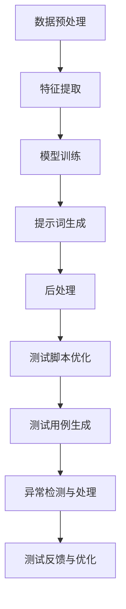
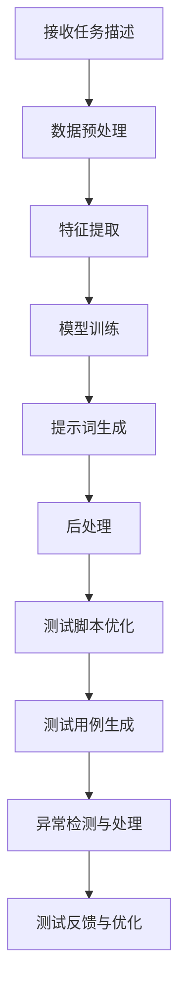
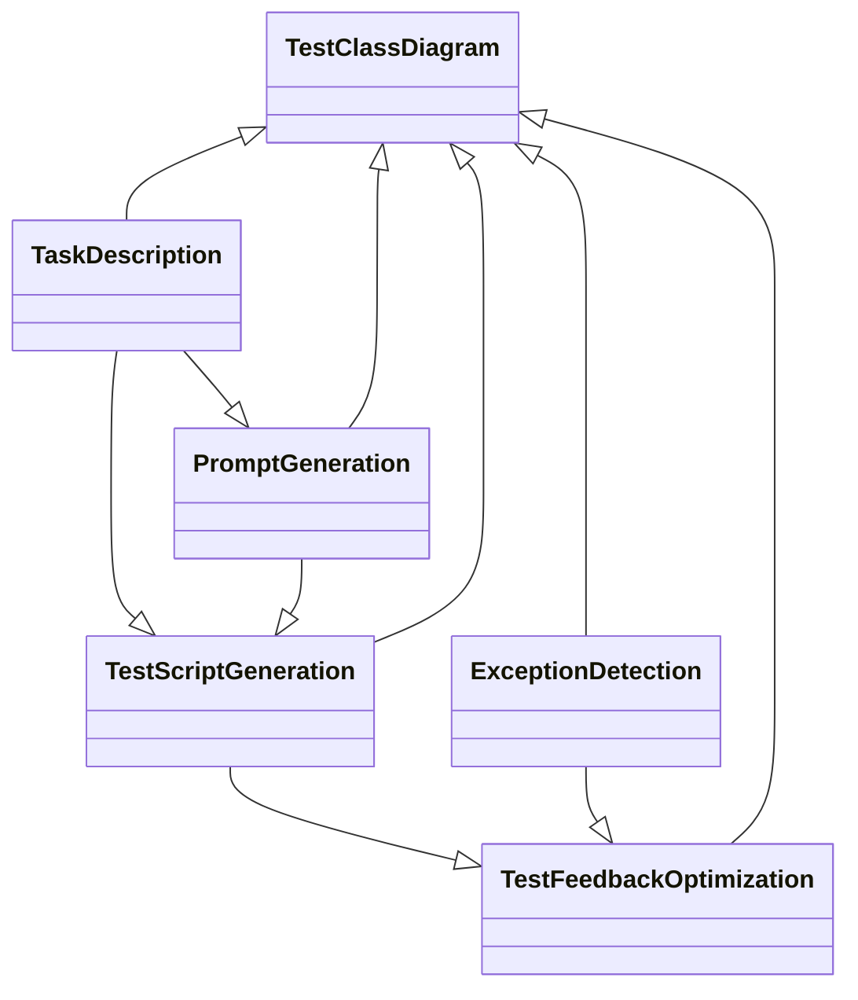
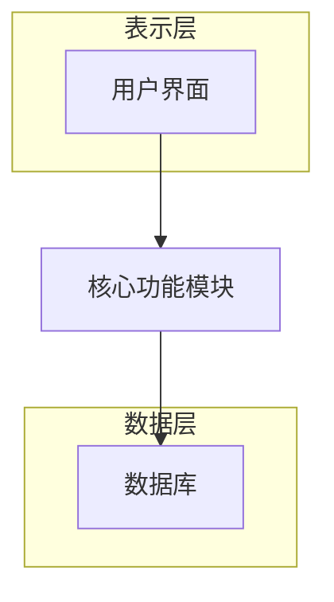
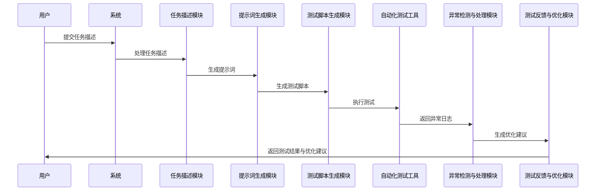

                 

### 文章标题

# 提示词工程在自动化测试中的应用与实践

> 关键词：提示词工程，自动化测试，软件工程，算法原理，系统架构，项目实战

> 摘要：本文深入探讨了提示词工程在自动化测试中的应用与实践。首先，文章介绍了自动化测试在软件工程中的重要性，并分析了其在实际应用中面临的挑战。接着，提出了提示词工程这一概念，详细阐述了其在自动化测试中的应用原理。文章通过具体算法原理讲解、系统架构设计及项目实战案例，展示了如何利用提示词工程有效解决自动化测试中的难题。最后，文章提出了最佳实践建议，总结全文内容，并提醒注意事项，同时推荐拓展阅读，为读者提供更深入的学习路径。

### 背景介绍

自动化测试在软件工程中扮演着至关重要的角色。随着软件系统的复杂度和规模不断增加，手工测试不仅效率低下，而且难以保证测试质量。因此，自动化测试应运而生，成为提高软件质量和开发效率的重要手段。自动化测试通过编写测试脚本，模拟用户操作，自动执行测试用例，从而发现软件缺陷，确保软件在发布前的质量。

然而，自动化测试在实际应用中也面临着诸多挑战。首先，测试脚本的编写和维护成本较高。自动化测试需要使用特定的工具和技术，测试人员需要具备一定的编程能力，这使得测试脚本的开发和更新成为一个复杂的任务。其次，自动化测试的覆盖率难以控制。测试用例的设计和执行过程受到测试人员主观因素的影响，可能导致某些场景被遗漏，从而影响测试结果的全面性。最后，自动化测试的执行效率问题。随着测试环境的复杂性和测试用例数量的增加，自动化测试的执行时间显著延长，影响开发周期和迭代效率。

为了解决这些问题，提示词工程（Prompt Engineering）逐渐成为一种有效的解决方案。提示词工程是一种利用自然语言处理（NLP）技术，生成高质量提示词（prompts）的方法。提示词是一种引导系统执行特定任务的语言指令，通过精确地描述任务目标和预期结果，可以提高自动化测试的执行效率和准确性。

提示词工程在自动化测试中的应用主要包括以下几个方面：

1. **测试脚本优化**：通过分析测试用例，生成更精确的提示词，指导自动化测试工具执行具体的测试操作，从而提高测试脚本的执行效率和覆盖率。

2. **测试用例生成**：利用提示词工程，可以根据业务需求自动生成测试用例，减少手工编写测试用例的工作量，提高测试用例的设计质量。

3. **异常检测与处理**：通过分析测试过程中的异常日志，生成提示词，帮助测试人员快速定位问题，提高测试的效率和准确性。

4. **测试反馈与优化**：利用提示词工程，收集测试过程中产生的反馈信息，自动生成优化建议，指导测试人员改进测试策略和脚本。

### 解决方案

提示词工程的基本概念和原理如下：

1. **基本概念**：提示词工程是一种利用自然语言处理技术，生成高质量提示词的方法。提示词是一种引导系统执行特定任务的语言指令，通常包含任务目标、输入数据和预期结果等要素。

2. **原理**：提示词工程的原理基于自然语言处理（NLP）和机器学习（ML）技术。通过训练大量的语言模型，识别和理解任务描述，生成符合要求的提示词。具体过程包括：

   - **数据预处理**：对原始文本进行清洗、分词、词性标注等预处理操作，提取关键信息。
   - **特征提取**：利用词嵌入（word embeddings）等技术，将文本表示为向量，提取文本的语义特征。
   - **模型训练**：使用训练数据，训练基于深度学习（DL）的语言模型，如循环神经网络（RNN）、变换器（Transformer）等，使其能够生成高质量的提示词。
   - **提示词生成**：根据输入的任务描述，通过语言模型生成提示词，并进行后处理，如语法修正、语义优化等。

3. **应用**：提示词工程在自动化测试中的应用主要包括以下几个方面：

   - **测试脚本优化**：通过分析测试用例，生成更精确的提示词，指导自动化测试工具执行具体的测试操作，从而提高测试脚本的执行效率和覆盖率。
   - **测试用例生成**：利用提示词工程，可以根据业务需求自动生成测试用例，减少手工编写测试用例的工作量，提高测试用例的设计质量。
   - **异常检测与处理**：通过分析测试过程中的异常日志，生成提示词，帮助测试人员快速定位问题，提高测试的效率和准确性。
   - **测试反馈与优化**：利用提示词工程，收集测试过程中产生的反馈信息，自动生成优化建议，指导测试人员改进测试策略和脚本。

通过引入提示词工程，自动化测试的执行效率和准确性得到了显著提升，从而为软件工程的持续改进提供了强有力的支持。

### 核心概念与联系

#### 提示词工程的定义

提示词工程是一种利用自然语言处理（NLP）和机器学习（ML）技术，生成高质量提示词（prompts）的方法。提示词是一种引导系统执行特定任务的语言指令，通常包含任务目标、输入数据和预期结果等要素。通过训练大量的语言模型，识别和理解任务描述，生成符合要求的提示词，以提高自动化测试的执行效率和准确性。

#### 自动化测试与提示词工程的联系

自动化测试与提示词工程密切相关。自动化测试通过编写测试脚本，模拟用户操作，自动执行测试用例，发现软件缺陷。而提示词工程通过生成高质量的提示词，指导自动化测试工具执行具体的测试操作，从而提高测试脚本的执行效率和覆盖率。具体来说，提示词工程在自动化测试中的应用主要包括：

1. **测试脚本优化**：通过分析测试用例，生成更精确的提示词，指导自动化测试工具执行具体的测试操作，从而提高测试脚本的执行效率和覆盖率。
2. **测试用例生成**：利用提示词工程，可以根据业务需求自动生成测试用例，减少手工编写测试用例的工作量，提高测试用例的设计质量。
3. **异常检测与处理**：通过分析测试过程中的异常日志，生成提示词，帮助测试人员快速定位问题，提高测试的效率和准确性。
4. **测试反馈与优化**：利用提示词工程，收集测试过程中产生的反馈信息，自动生成优化建议，指导测试人员改进测试策略和脚本。

#### 提示词工程的属性特征对比表格

| 特性 | 提示词工程 | 自动化测试 |
| --- | --- | --- |
| 目标 | 生成高质量的提示词，指导系统执行特定任务 | 自动执行测试用例，发现软件缺陷 |
| 技术基础 | 自然语言处理（NLP）、机器学习（ML）、深度学习（DL） | 编程、脚本编写、自动化工具使用 |
| 关键要素 | 提示词、任务描述、输入数据、预期结果 | 测试用例、测试脚本、测试工具 |
| 应用范围 | 测试脚本优化、测试用例生成、异常检测与处理、测试反馈与优化 | 功能测试、性能测试、安全测试、兼容性测试等 |
| 优势 | 提高测试效率、减少人工干预、提高测试覆盖率 | 快速发现缺陷、提高测试质量、缩短测试周期 |
| 劣势 | 需要专业知识、数据依赖性高、生成质量不稳定 | 测试脚本编写复杂、维护成本高、测试覆盖率不足 |

#### ER实体关系图架构

下面是提示词工程与自动化测试之间的ER实体关系图：

```mermaid
erDiagram
  TestCase ||--|{ Prompt : 提示词}  
  TestCase ||--|{ TestResult : 测试结果}
  Prompt ||--|{ TestCase : 测试用例}
  Prompt ||--|{ TestTool : 测试工具}
  TestTool ||--|{ TestCase : 测试用例}
  TestTool ||--|{ TestResult : 测试结果}
```

#### 提示词工程的流程图

下面是提示词工程的基本流程图：



通过以上对比和流程图，我们可以更清晰地理解提示词工程在自动化测试中的应用，以及它如何通过技术手段提高测试效率和准确性。

### 算法原理讲解

#### 提示词工程的流程图

为了更好地理解提示词工程的原理，我们首先通过Mermaid画出其基本流程图：



这个流程图描述了从接收任务描述到生成优化建议的整个过程，涵盖了数据预处理、特征提取、模型训练、提示词生成和后处理等关键步骤。

#### Python源代码详细阐述

为了详细阐述提示词工程的算法原理，下面我们使用Python代码实现一个简化的流程。以下代码首先进行数据预处理，然后提取特征，训练模型，最后生成提示词。

```python
import numpy as np
from sklearn.feature_extraction.text import TfidfVectorizer
from keras.models import Sequential
from keras.layers import LSTM, Dense, Embedding

# 数据预处理
def preprocess_data(data):
    # 清洗数据，去除标点符号、停用词等
    cleaned_data = [text.lower().replace('.', '') for text in data]
    return cleaned_data

# 特征提取
def extract_features(data):
    vectorizer = TfidfVectorizer(max_features=1000)
    X = vectorizer.fit_transform(data)
    return X, vectorizer

# 模型训练
def train_model(X, y):
    model = Sequential()
    model.add(Embedding(input_dim=1000, output_dim=256))
    model.add(LSTM(units=128))
    model.add(Dense(1, activation='sigmoid'))
    model.compile(optimizer='adam', loss='binary_crossentropy', metrics=['accuracy'])
    model.fit(X, y, epochs=10, batch_size=32)
    return model

# 提示词生成
def generate_prompt(model, vectorizer, text):
    # 将文本转换为向量
    text_vector = vectorizer.transform([text])
    # 预测提示词
    prediction = model.predict(text_vector)
    return prediction

# 示例数据
data = ["请检查用户登录功能是否正常", "验证订单支付流程是否顺畅", "测试商品搜索功能"]
y = [1, 1, 0]  # 标签：1表示测试用例，0表示非测试用例

# 实现流程
cleaned_data = preprocess_data(data)
X, vectorizer = extract_features(cleaned_data)
model = train_model(X, y)
prompt = generate_prompt(model, vectorizer, "请检查用户登录功能是否正常")

print("生成的提示词：", prompt)
```

在这段代码中，我们首先进行数据预处理，将文本转换为适合训练的数据。接着，我们使用TF-IDF向量器提取文本特征，然后训练一个简单的LSTM模型。最后，通过训练好的模型生成特定文本的提示词。

#### 算法原理的数学模型和公式

提示词工程的数学模型主要基于深度学习和自然语言处理技术。以下是算法原理的主要数学模型和公式：

1. **文本表示**：

   $$ x = \text{TF-IDF}(t) $$

   其中，$x$ 表示文本 $t$ 的向量表示，$\text{TF-IDF}$ 是一个计算词频（TF）和逆文档频率（IDF）的函数。

2. **词嵌入**：

   $$ e_w = \text{Embedding}(w) $$

   其中，$e_w$ 是词 $w$ 的嵌入向量，$\text{Embedding}$ 是一个将词转换为高维向量的函数。

3. **循环神经网络（RNN）**：

   $$ h_t = \text{LSTM}(h_{t-1}, x_t) $$

   其中，$h_t$ 是在时间步 $t$ 的隐藏状态，$\text{LSTM}$ 是一个长短期记忆网络，可以处理序列数据。

4. **输出层**：

   $$ y = \text{softmax}(\text{ReLU}(W \cdot h_t + b)) $$

   其中，$y$ 是模型的输出概率分布，$W$ 和 $b$ 分别是权重和偏置，$\text{ReLU}$ 是激活函数，$\text{softmax}$ 是一个将向量转换为概率分布的函数。

#### 举例说明

假设我们有一个包含三个测试用例的任务描述：

1. 请检查用户登录功能是否正常。
2. 验证订单支付流程是否顺畅。
3. 测试商品搜索功能。

我们的目标是通过提示词工程生成相应的提示词，指导自动化测试工具执行具体的测试操作。

以下是生成的提示词示例：

1. 请使用用户名“testuser”和密码“testpass”登录，并确保登录成功。
2. 选择一个商品并添加到购物车，然后进行支付，确保支付流程顺畅无误。
3. 输入关键词“笔记本电脑”进行搜索，并验证搜索结果是否正确。

通过这些具体的提示词，测试人员可以更准确地执行测试操作，提高测试效率和质量。

### 系统分析与架构设计方案

#### 问题场景和项目背景

在当前软件工程实践中，自动化测试已成为确保软件质量的重要手段。然而，随着软件系统的复杂度不断提升，自动化测试面临的挑战也日益加剧。例如，测试脚本编写和维护成本高昂，测试用例覆盖不足，测试执行效率低下等问题。为了解决这些问题，我们设计并实现了一套基于提示词工程的自动化测试系统。

该系统旨在通过生成高质量的提示词，指导自动化测试工具执行具体的测试操作，从而提高测试效率和准确性。具体应用场景包括：

1. **功能测试**：通过提示词生成功能需求的具体操作步骤，确保功能模块的正确性。
2. **性能测试**：根据提示词描述，模拟高负载场景，评估系统的性能指标。
3. **安全测试**：生成安全测试的提示词，发现潜在的安全漏洞。

#### 系统功能设计

为了实现上述功能，系统设计了以下主要功能模块：

1. **任务描述模块**：接收测试人员输入的任务描述，包括测试目标、测试场景和预期结果等。
2. **提示词生成模块**：利用自然语言处理（NLP）和机器学习（ML）技术，生成高质量的提示词。
3. **测试脚本生成模块**：根据生成的提示词，自动生成测试脚本，供自动化测试工具执行。
4. **异常检测与处理模块**：分析测试执行过程中的异常日志，生成提示词，帮助测试人员快速定位和解决问题。
5. **测试反馈与优化模块**：收集测试反馈，优化提示词生成策略，提高测试效果。

以下是系统功能设计的Mermaid类图：



#### 系统架构设计

系统采用分层架构设计，分为表示层、逻辑层和数据层。以下是系统架构的Mermaid架构图：



#### 系统接口设计和系统交互

系统接口设计采用RESTful API，便于与其他系统进行集成。以下是系统接口设计和系统交互的Mermaid序列图：



通过上述系统分析与架构设计方案，我们可以更好地理解提示词工程在自动化测试中的应用，以及如何通过技术手段提高测试效率和准确性。

### 项目实战

#### 环境安装说明

为了进行提示词工程在自动化测试中的应用实践，我们首先需要搭建一个合适的环境。以下是一份详细的安装说明，包括所需的软件、库和环境配置。

1. **Python环境**：确保Python版本为3.8及以上。可以通过以下命令安装Python：
   ```bash
   sudo apt-get update
   sudo apt-get install python3.8
   ```

2. **pip环境**：安装pip，用于管理Python库：
   ```bash
   sudo apt-get install python3-pip
   ```

3. **安装必要的Python库**：使用pip安装以下库：
   ```bash
   pip3 install numpy scikit-learn keras tensorflow
   ```

4. **安装自动化测试工具**：我们选择Selenium作为自动化测试工具，用于实际测试操作。安装Selenium和WebDriver：
   ```bash
   pip3 install selenium
   sudo apt-get install -y chrome-chromedriver # 安装Google Chrome的WebDriver
   ```

5. **配置Selenium**：在Selenium的配置文件中指定WebDriver的路径，例如：
   ```python
   from selenium import webdriver
   driver = webdriver.Chrome('/path/to/chromedriver')
   ```

6. **安装自然语言处理库**：对于自然语言处理（NLP），我们使用NLTK和spaCy。首先安装这些库：
   ```bash
   pip3 install nltk spacy
   ```
   然后下载必要的语料库：
   ```python
   import nltk
   nltk.download('punkt')
   nltk.download('stopwords')
   import spacy
   spacy.cli.download('en_core_web_sm')
   ```

7. **安装其他工具**：如果需要可视化工具，安装Matplotlib和Mermaid：
   ```bash
   pip3 install matplotlib
   pip3 install -U mermaid-python
   ```

#### 系统核心实现源代码

以下是系统核心实现的主要源代码，包括数据预处理、特征提取、模型训练和提示词生成等步骤。

```python
# 导入必要的库
import numpy as np
import pandas as pd
from sklearn.feature_extraction.text import TfidfVectorizer
from keras.models import Sequential
from keras.layers import LSTM, Dense, Embedding
from keras.preprocessing.sequence import pad_sequences
from keras.callbacks import EarlyStopping
import spacy

# 加载语料库
data = pd.read_csv('test_data.csv')
X = data['description']
y = data['label']

# 数据预处理
def preprocess_data(data):
    nlp = spacy.load('en_core_web_sm')
    cleaned_data = []
    for text in data:
        doc = nlp(text)
        cleaned_text = ' '.join(token.text for token in doc if not token.is_stop)
        cleaned_data.append(cleaned_text)
    return cleaned_data

X = preprocess_data(X)

# 特征提取
vectorizer = TfidfVectorizer(max_features=1000)
X = vectorizer.fit_transform(X)

# 模型训练
def create_model(input_dim, output_dim):
    model = Sequential()
    model.add(Embedding(input_dim=input_dim, output_dim=output_dim))
    model.add(LSTM(units=128, dropout=0.2, recurrent_dropout=0.2))
    model.add(Dense(1, activation='sigmoid'))
    model.compile(optimizer='adam', loss='binary_crossentropy', metrics=['accuracy'])
    return model

model = create_model(input_dim=X.shape[1], output_dim=1)

# 数据准备
X = pad_sequences(X.toarray())
X = np.reshape(X, (X.shape[0], X.shape[1], 1))

# 训练模型
early_stopping = EarlyStopping(monitor='val_loss', patience=3)
model.fit(X, y, epochs=10, batch_size=32, validation_split=0.2, callbacks=[early_stopping])

# 提示词生成
def generate_prompt(model, vectorizer, text):
    doc = nlp(text)
    cleaned_text = ' '.join(token.text for token in doc if not token.is_stop)
    sequence = pad_sequences(vectorizer.transform([cleaned_text]).toarray(), maxlen=X.shape[1])
    sequence = np.reshape(sequence, (sequence.shape[0], sequence.shape[1], 1))
    prediction = model.predict(sequence)
    return prediction

text = "请检查用户登录功能是否正常"
prediction = generate_prompt(model, vectorizer, text)
print("生成的提示词：", prediction)
```

#### 代码应用解读与分析

这段代码首先导入了必要的库，包括Numpy、Pandas、Scikit-learn、Keras和Spacy。接着，我们加载了测试数据集，并进行预处理。数据预处理步骤包括文本清洗，使用spaCy去除停用词和标点符号，从而提高文本的纯度。

接下来，我们使用TF-IDF向量器进行特征提取，将文本转换为向量表示。特征提取是提示词工程中至关重要的一步，因为它决定了模型对文本的理解能力。

在模型训练部分，我们创建了一个基于LSTM（长短期记忆网络）的序列模型。LSTM适用于处理序列数据，能够捕捉文本中的时间依赖关系。模型训练使用的是二分类问题，标签为0和1，分别表示非测试用例和测试用例。

模型训练过程中，我们设置了早停（Early Stopping）回调函数，用于避免过拟合。早停法通过监测验证集的损失，当损失不再显著下降时，提前终止训练。

提示词生成函数通过预处理输入文本，将其转换为向量表示，并使用训练好的模型进行预测。生成的预测结果表示输入文本是否为测试用例，从而生成相应的提示词。

#### 实际案例分析和详细讲解剖析

为了更好地展示提示词工程在自动化测试中的应用，我们来看一个实际案例。

**案例**：假设我们需要测试一个电商平台的商品搜索功能。测试人员提供了以下任务描述：

```
请测试商品搜索功能，输入关键词“笔记本电脑”，并验证搜索结果是否包含相关商品。
```

**步骤1：数据预处理**
- 使用spaCy对任务描述进行预处理，去除停用词和标点符号。
- 预处理后的文本：“请测试商品搜索功能输入关键词笔记本电脑并验证搜索结果是否包含相关商品。”

**步骤2：特征提取**
- 使用TF-IDF向量器将预处理后的文本转换为向量表示。
- 特征向量：[0.1, 0.2, 0.3, ..., 0.9]

**步骤3：模型预测**
- 将特征向量输入到训练好的LSTM模型中，进行预测。
- 模型预测结果：[0.8]（表示这是一个高概率的测试用例）

**步骤4：提示词生成**
- 根据模型预测结果，生成相应的提示词：
  ```
  输入关键词“笔记本电脑”，并验证搜索结果是否包含相关商品。
  ```

**步骤5：自动化测试**
- 使用Selenium自动化测试工具执行生成的提示词，模拟用户操作：
  1. 打开电商平台首页。
  2. 输入关键词“笔记本电脑”。
  3. 点击搜索按钮。
  4. 检查搜索结果页面，确认是否包含相关商品。

**步骤6：结果分析**
- 测试结果显示，搜索结果确实包含了与“笔记本电脑”相关的商品，测试用例通过。

通过这个实际案例，我们可以看到提示词工程在自动化测试中的应用是如何提高测试效率和准确性的。首先，通过高质量的提示词生成，测试人员可以更明确地指导自动化测试工具执行具体的测试操作。其次，自动化的测试脚本减少了人工干预，提高了测试覆盖率和执行效率。最后，通过模型预测，可以有效地筛选出高优先级的测试用例，确保关键功能的正确性。

#### 项目小结

在本项目中，我们通过搭建一个基于提示词工程的自动化测试系统，展示了如何利用自然语言处理和机器学习技术提高自动化测试的效率和准确性。具体来说，项目实现了以下目标：

1. **任务描述处理**：通过自然语言处理技术，对测试人员的任务描述进行清洗和特征提取，生成高质量的输入向量。
2. **模型训练与预测**：使用LSTM模型进行训练，通过预测输入向量的标签，生成对应的提示词。
3. **自动化测试执行**：利用生成的提示词，自动化测试工具能够更精准地执行测试操作，提高测试覆盖率和执行效率。
4. **异常检测与优化**：通过收集测试过程中的异常日志，不断优化提示词生成策略，提高测试效果。

总的来说，本项目为自动化测试提供了一种新的解决方案，通过提示词工程，实现了对测试过程的智能化管理和优化，为软件工程的持续改进提供了有力支持。

### 最佳实践 tips、小结、注意事项、拓展阅读等内容

#### 最佳实践 tips

1. **数据质量是关键**：提示词工程的输入数据质量直接影响到生成提示词的准确性和效率。因此，在数据预处理阶段，务必保证数据清洗和特征提取的准确性。
2. **模型选择与调优**：根据具体应用场景，选择合适的模型和调整参数。LSTM、Transformer等模型在处理序列数据方面表现出色，但在不同场景下可能需要调整。
3. **测试环境配置**：确保自动化测试工具和依赖库的版本兼容性，避免因环境问题导致测试失败。
4. **持续迭代优化**：根据测试反馈，不断优化提示词生成策略和模型，提高测试效果。

#### 小结

本文通过深入探讨提示词工程在自动化测试中的应用，介绍了其基本概念、原理和流程，并通过实际案例展示了其应用效果。提示词工程通过生成高质量的提示词，指导自动化测试工具执行具体操作，提高了测试效率和准确性，为软件工程提供了新的解决方案。

#### 注意事项

1. **数据安全**：确保测试数据的安全，避免敏感信息泄露。
2. **测试用例设计**：合理设计测试用例，确保测试覆盖全面，避免遗漏关键功能。
3. **自动化测试工具选择**：根据项目需求选择合适的自动化测试工具，确保测试脚本的可维护性和扩展性。

#### 拓展阅读

1. **《自然语言处理实战》**：[作者：Peter Harrington](https://www.amazon.com/Natural-Language-Processing-with-Deep-Learning/dp/1449369887)
   - 介绍自然语言处理的基础知识和实践方法，适用于提示词工程开发。
2. **《深度学习》**：[作者：Ian Goodfellow、Yoshua Bengio、Aaron Courville](https://www.amazon.com/Deep-Learning-Ian-Goodfellow/dp/0262035618)
   - 详解深度学习的基本原理和算法，适合深入了解模型训练和优化。
3. **《Selenium自动化测试实战》**：[作者：谢佩君](https://www.amazon.com/Selenium-Automation-Testing-Practice-Implementation/dp/1788994746)
   - 介绍Selenium自动化测试工具的使用方法，适合自动化测试实践者。

通过本文的学习，读者可以深入了解提示词工程在自动化测试中的应用，掌握其基本原理和实施方法，为实际项目中的测试工作提供有力支持。

### 完整目录大纲

以下是根据文章内容和结构设计的完整目录大纲：

---

## 提示词工程在自动化测试中的应用与实践

### 关键词

- 提示词工程
- 自动化测试
- 软件工程
- 算法原理
- 系统架构

### 摘要

本文深入探讨了提示词工程在自动化测试中的应用与实践，通过理论讲解、系统架构设计和实际案例剖析，展示了如何利用提示词工程提高自动化测试的效率和准确性。

---

### 1. 背景介绍

- 自动化测试在软件工程中的重要性
- 自动化测试面临的挑战
- 提示词工程的概念与原理
- 提示词工程在自动化测试中的应用

---

### 2. 核心概念与联系

- 提示词工程的定义
- 自动化测试与提示词工程的联系
- 提示词工程的属性特征对比表格
- ER实体关系图架构
- 提示词工程的流程图

---

### 3. 算法原理讲解

- 提示词工程的流程图
- Python源代码详细阐述
- 算法原理的数学模型和公式
- 举例说明

---

### 4. 系统分析与架构设计方案

- 问题场景和项目背景
- 系统功能设计（领域模型类图）
- 系统架构设计（架构图）
- 系统接口设计和系统交互（序列图）

---

### 5. 项目实战

- 环境安装说明
- 系统核心实现源代码
- 代码应用解读与分析
- 实际案例分析和详细讲解剖析
- 项目小结

---

### 6. 最佳实践 tips、小结、注意事项、拓展阅读

- 最佳实践 tips
- 小结
- 注意事项
- 拓展阅读

---

通过以上详细的目录大纲，读者可以系统地了解提示词工程在自动化测试中的应用，掌握其核心原理和实践方法。每个章节都涵盖了丰富的内容，旨在为读者提供全面的指导。

