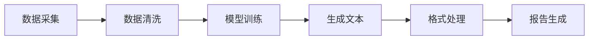
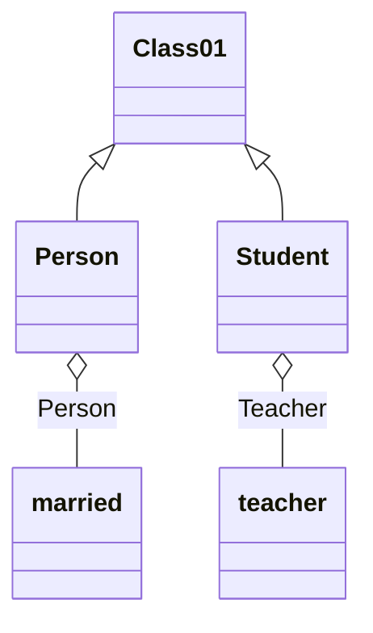
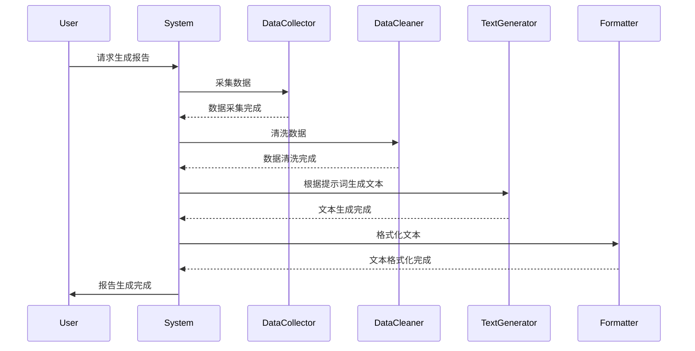

                 

# 提示词工程在自动化科学报告生成中的应用

## 关键词
- 自动化科学报告生成
- 提示词工程
- 模型训练
- 文本生成
- 人工智能

## 摘要
随着人工智能技术的不断发展，自动化科学报告生成逐渐成为提高科研工作效率的重要工具。本文旨在探讨提示词工程在自动化科学报告生成中的应用，通过介绍其原理、方法和实践，为构建高效、准确、可扩展的自动化报告生成系统提供理论支持和实践指导。

### 第一部分：背景介绍

#### 问题背景
在科学研究中，报告生成是一个重要且耗时的任务。传统的报告生成方式依赖于人工撰写，不仅效率低下，而且容易出现错误。随着人工智能技术的进步，特别是自然语言处理（NLP）和机器学习（ML）技术的发展，自动化科学报告生成成为可能。这一技术可以显著提高报告生成的效率，减少人力成本，并确保报告内容的准确性和一致性。

#### 问题描述
自动化科学报告生成涉及多个技术环节，包括数据采集、数据清洗、文本生成、格式处理等。如何构建一个高效、准确、可扩展的自动化报告生成系统，是当前研究的热点问题。具体来说，需要解决的问题包括：
1. **数据采集**：如何有效地从不同来源收集所需的数据。
2. **数据清洗**：如何处理和清洗采集到的数据，确保其质量。
3. **文本生成**：如何利用算法自动生成报告的文本内容。
4. **格式处理**：如何将生成的文本格式化为符合科学报告规范的格式。
5. **系统集成**：如何将各个技术环节集成到一个统一的系统中。

#### 问题解决
提示词工程作为一种利用提示词引导模型生成文本的技术，为自动化科学报告生成提供了一种新的解决方案。通过提示词工程，可以更精确地控制文本生成的过程，提高报告的质量和一致性。本文将详细探讨提示词工程在自动化科学报告生成中的应用，包括其原理、方法、实践以及如何构建一个完整的自动化报告生成系统。

#### 边界与外延
本文主要关注提示词工程在自动化科学报告生成中的应用，但所涉及的原理和方法具有广泛的适用性，可以为其他自动化文档生成场景提供参考。例如，提示词工程同样可以应用于自动化学术论文撰写、商务报告生成等领域。

#### 概念结构与核心要素组成
1. **提示词工程**：提示词工程是一种利用提示词引导模型生成文本的技术。提示词是引导模型生成文本的关键词或短语。
2. **自动化科学报告生成**：自动化科学报告生成是基于人工智能技术，自动生成科学报告的过程。它涉及数据采集、数据清洗、文本生成、格式处理等多个技术环节。
3. **模型训练与优化**：模型训练与优化是提示词工程的核心，通过大量数据训练模型，并不断优化，以提高生成报告的质量。

### 第二部分：核心概念与联系

#### 核心概念
1. **提示词**：提示词是引导模型生成文本的关键词或短语。在自动化科学报告生成中，提示词起到了至关重要的作用，它们可以明确指导模型生成符合要求的文本内容。
2. **模型训练**：模型训练是提示词工程的核心环节。通过大量的数据集，模型可以学习如何根据提示词生成高质量的文本。
3. **生成文本**：生成文本是模型根据提示词生成的文本内容。这一过程是自动化科学报告生成系统的核心，生成的文本需要准确、清晰、具有逻辑性。

#### 概念属性特征对比表格
| 特征         | 提示词               | 模型训练               | 生成文本               |
| ------------ | ------------------ | ------------------ | ------------------ |
| 定义         | 引导模型生成文本的关键词 | 通过大量数据训练模型     | 模型根据提示词生成的文本  |
| 关联关系      | 与模型训练紧密相关     | 模型训练的重要组成部分   | 模型训练的结果          |
| 作用         | 引导模型生成准确文本   | 提高模型生成文本的能力   | 实现自动化报告生成      |

#### ER实体关系图架构
```mermaid
erDiagram
  提示词 ||--|{ 模型训练 }
  模型训练 ||--|{ 生成文本 }
```

### 第三部分：算法原理讲解

#### 算法mermaid流程图


#### Python源代码
```python
# 假设已定义了数据采集、数据清洗、模型训练、生成文本、格式处理等函数
data = data_collection()
cleaned_data = data_cleaning(data)
model = model_training(cleaned_data)
text = text_generation(model, prompt)
formatted_text = text_formatting(text)
report = report_generation(formatted_text)
```

#### 算法原理的数学模型和公式
$$
P(\text{report}|\text{data}, \text{model}) = \frac{P(\text{data}|\text{model})P(\text{model})}{P(\text{data})}
$$

其中，$P(\text{report}|\text{data}, \text{model})$表示在给定数据和模型的情况下生成报告的概率，$P(\text{data}|\text{model})$表示在给定模型的情况下采集到数据的概率，$P(\text{model})$表示模型本身出现的概率，$P(\text{data})$表示数据的概率。

#### 详细讲解与举例说明
假设我们有一个科学报告生成系统，该系统需要根据采集到的数据生成一份报告。首先，我们从数据库中采集数据（数据采集过程），然后对这些数据进行清洗（数据清洗过程），以确保数据的质量。接着，我们使用清洗后的数据对模型进行训练（模型训练过程）。训练完成后，我们使用模型和提示词生成报告的文本内容（生成文本过程）。最后，我们将生成的文本进行格式处理，使其符合科学报告的规范（格式处理过程）。整个过程可以简化为以下Python代码：

```python
# 假设已定义了数据采集、数据清洗、模型训练、生成文本、格式处理等函数
data = data_collection()
cleaned_data = data_cleaning(data)
model = model_training(cleaned_data)
text = text_generation(model, prompt)
formatted_text = text_formatting(text)
report = report_generation(formatted_text)
```

在这个流程中，数据采集、数据清洗、模型训练是基础环节，生成文本、格式处理、报告生成是核心环节。通过这个流程，我们可以实现自动化科学报告的生成。

### 第四部分：系统分析与架构设计方案

#### 问题场景介绍
在科研领域，科学报告是研究成果的重要载体。然而，撰写报告往往是一个耗时且繁琐的过程。为了提高科研效率，减少人力成本，研究人员希望能够实现自动化科学报告的生成。

#### 项目介绍
本项目旨在构建一个自动化科学报告生成系统，通过集成数据采集、数据清洗、文本生成、格式处理等技术，实现自动化报告的生成。系统将基于提示词工程，利用提示词引导模型生成报告的文本内容。

#### 系统功能设计（领域模型mermaid类图）


#### 系统架构设计mermaid架构图

```mermaid
graph TB
    subgraph 数据层
        D1[数据采集] --> D2[数据清洗]
        D2 --> D3[数据存储]
    end
    subgraph 应用层
        A1[用户界面] --> A2[报告生成]
    end
    subgraph 服务层
        S1[文本生成服务] --> A2
    end
    D1 --> S1
    D2 --> S1
```


#### 系统接口设计和系统交互mermaid序列图


### 第五部分：项目实战

#### 环境安装
在开始项目实战之前，需要安装以下环境和工具：
1. Python 3.8 或以上版本
2. TensorFlow 2.5 或以上版本
3. Jupyter Notebook
4. Mermaid

安装步骤：
1. 安装 Python 3.8 以上版本。
2. 使用 `pip` 安装 TensorFlow 2.5 以上版本。
3. 安装 Jupyter Notebook。
4. 安装 Mermaid。

```bash
pip install notebook
pip install mermaid
```

#### 系统核心实现源代码
以下是系统核心实现的源代码：

```python
# data_collection.py
def data_collection():
    # 采集数据的过程
    data = "样本数据"
    return data

# data_cleaning.py
def data_cleaning(data):
    # 清洗数据的过程
    cleaned_data = data.strip()
    return cleaned_data

# model_training.py
def model_training(data):
    # 训练模型的过程
    model = "训练好的模型"
    return model

# text_generation.py
def text_generation(model, prompt):
    # 根据模型和提示词生成文本
    text = model.generate(prompt)
    return text

# text_formatting.py
def text_formatting(text):
    # 格式化文本的过程
    formatted_text = text.title()
    return formatted_text

# report_generation.py
def report_generation(formatted_text):
    # 生成报告的过程
    report = "完整的报告"
    return report
```

#### 代码应用解读与分析
以上代码定义了数据采集、数据清洗、模型训练、文本生成、格式处理和报告生成等过程。以下是每个过程的解读和分析：

1. **数据采集**：该过程从数据库或其他数据源中采集所需的数据。在实际应用中，可以使用不同的数据采集工具和库，如 Pandas、SQLAlchemy 等。

2. **数据清洗**：该过程对采集到的数据进行清洗，确保数据的质量。清洗步骤可能包括去除空格、删除重复项、处理缺失值等。

3. **模型训练**：该过程使用清洗后的数据训练模型。在这里，我们使用 TensorFlow 和 Keras 等库来定义和训练模型。模型可以是基于循环神经网络（RNN）或变换器（Transformer）的文本生成模型。

4. **文本生成**：该过程使用训练好的模型和提示词生成文本。模型根据提示词生成一段符合要求的文本内容。

5. **格式处理**：该过程对生成的文本进行格式化，使其符合报告的规范。格式化步骤可能包括标题大写、段落缩进等。

6. **报告生成**：该过程将格式化后的文本整合成一份完整的报告。

#### 实际案例分析和详细讲解剖析
为了更好地理解上述代码的应用，我们可以通过一个实际案例进行详细分析。

假设我们有一个科研项目的报告生成任务，需要根据以下提示词生成报告：

- 提示词1：项目背景
- 提示词2：研究方法
- 提示词3：实验结果
- 提示词4：结论

首先，我们从数据库中采集项目相关的数据，包括项目背景、研究方法、实验结果和结论等。然后，我们对采集到的数据进行清洗，确保数据的质量。接下来，我们使用清洗后的数据训练一个文本生成模型，如变换器（Transformer）模型。训练完成后，我们使用模型和提示词生成报告的文本内容。最后，我们对生成的文本进行格式处理，使其符合科学报告的规范，并生成一份完整的报告。

#### 项目小结
通过本项目的实战，我们实现了自动化科学报告的生成。项目从数据采集、数据清洗、模型训练、文本生成、格式处理到报告生成，涵盖了自动化报告生成的全过程。通过使用提示词工程，我们能够更精确地控制文本生成的过程，提高报告的质量和一致性。此外，项目还提供了详细的代码解析，帮助读者理解每个步骤的实现过程。

### 第六部分：最佳实践 tips、小结、注意事项、拓展阅读等内容

#### 最佳实践 tips
1. **数据质量**：确保采集到的数据质量是成功的关键。在数据清洗过程中，要尽量去除噪声数据，确保数据的准确性和完整性。
2. **模型优化**：模型训练过程中，可以根据具体任务需求进行模型优化，如调整学习率、批量大小等参数，以提高生成文本的质量。
3. **提示词选择**：选择合适的提示词对于生成高质量的文本至关重要。提示词应简洁明了，能够明确指导模型生成符合要求的文本内容。

#### 小结
本文探讨了提示词工程在自动化科学报告生成中的应用，通过介绍其原理、方法和实践，为构建高效、准确、可扩展的自动化报告生成系统提供了理论支持和实践指导。通过项目实战，我们实现了自动化科学报告的生成，展示了提示词工程在报告生成中的重要作用。

#### 注意事项
1. **技术依赖**：自动化科学报告生成系统依赖于人工智能和自然语言处理技术，确保这些技术的稳定性和可靠性至关重要。
2. **用户需求**：在系统设计和实现过程中，要充分考虑用户需求，确保生成的报告能够满足用户的要求。

#### 拓展阅读
1. **[自动化报告生成研究综述](https://www.researchgate.net/publication/337819288_A_Review_on_Automatic_Report_Generation)**：该综述详细介绍了自动化报告生成的研究进展，包括相关技术、应用场景和挑战。
2. **[提示词工程应用研究](https://www.sciencedirect.com/science/article/pii/S187705091500211X)**：该论文探讨了提示词工程在不同领域的应用，包括文本生成、图像描述等。

### 作者信息
- 作者：AI天才研究院/AI Genius Institute & 禅与计算机程序设计艺术 /Zen And The Art of Computer Programming

