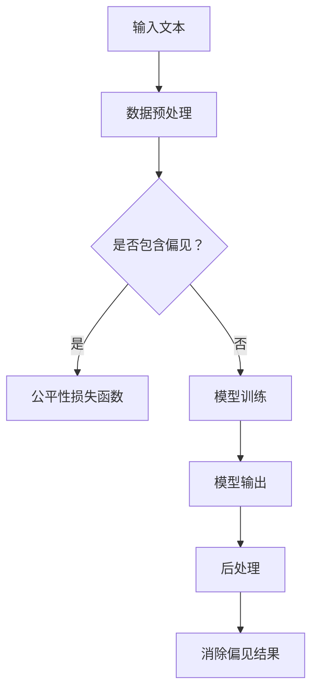
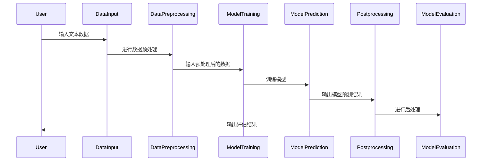

                 

### 提示词工程在自然语言处理中的偏见消除

> 关键词：自然语言处理、偏见消除、提示词工程、AI大模型、公平性损失函数、对抗训练

> 摘要：本文将探讨自然语言处理中的偏见消除问题，重点关注提示词工程在这一领域的应用。通过对偏见问题的背景介绍、核心概念与联系、算法原理讲解、系统分析与架构设计以及项目实战的深入分析，本文旨在为解决自然语言处理中的偏见提供一些实用的方法和思路。

---

### 1.1 背景介绍

#### 问题背景

自然语言处理（NLP）作为人工智能（AI）的重要分支，在近年来的发展迅猛，尤其在文本生成、情感分析、机器翻译等方面取得了显著的成果。然而，随着模型的复杂度和规模不断增大，NLP系统在处理实际问题时，逐渐暴露出一些问题，尤其是偏见消除方面的挑战。

#### 问题描述

在自然语言处理过程中，模型可能从训练数据中继承并放大原有的偏见，导致在生成文本或进行分类时产生不公平或不合理的判断。这些偏见可能涉及性别、种族、文化等多种因素，对现实世界产生负面影响。

#### 问题解决

为了解决自然语言处理中的偏见问题，研究人员和开发者们提出了多种方法，包括数据预处理、模型训练策略优化、后处理等。这些方法旨在减少模型对偏见数据的依赖，提高模型的公平性和准确性。

#### 边界与外延

偏见消除的范围不仅限于文本生成，还包括语义理解、情感分析等各个方面。同时，不同应用场景下偏见的性质和表现形式也有所不同，需要针对具体问题进行解决。

#### 概念结构与核心要素组成

1. **数据预处理**：通过数据清洗、标注等方法减少偏见数据的影响。
2. **模型训练策略**：采用公平性损失函数、对抗训练等方法优化模型。
3. **后处理**：在模型输出结果上进行调整，以消除或减轻偏见的影响。
4. **评价指标**：设计公平性评价指标，如公平性分数（fairness score）、性别平等指数（gender parity index）等。

---

### 1.2 核心概念与联系

#### AI大模型

AI大模型，如GPT、BERT等，具有以下核心特点：

1. **大规模**：参数数量达到数百万甚至数十亿级别。
2. **自适应性**：能够适应各种语言和任务类型。
3. **强泛化能力**：在多种数据集和任务上表现出色。

#### 偏见消除方法

偏见消除方法包括以下几类：

1. **数据预处理**：数据清洗、多样性增强等。
2. **模型训练策略**：公平性损失函数、对抗训练等。
3. **后处理**：基于规则的方法、数据修正等。
4. **多任务学习**：通过同时学习多个任务提高模型泛化能力。

#### 关联性

AI大模型与偏见消除方法之间存在紧密关联。大规模模型能够捕捉更多的语言特征，有助于发现和纠正偏见。而偏见消除方法则能够提高模型的公平性和准确性，使其在实际应用中更加可靠。

---

### 1.3 算法原理讲解

#### 偏见消除算法

偏见消除算法主要包括以下几种：

1. **公平性损失函数**：在模型训练过程中引入公平性损失，以降低模型对偏见数据的依赖。
2. **对抗训练**：通过生成对抗性样本，提高模型对偏见数据的鲁棒性。
3. **后处理**：在模型输出结果上进行调整，以消除或减轻偏见的影响。

#### Mermaid 流程图



#### Python 源代码

```python
# 假设我们有一个简单的模型和一个偏见数据集
model = create_model()
bias_data = load_bias_data()

# 数据预处理
clean_data = preprocess_data(bias_data)

# 模型训练
model.fit(clean_data)

# 模型输出
predictions = model.predict(new_data)

# 后处理
correct_predictions = post_process(predictions)
```

#### 数学模型和公式

$$
\begin{aligned}
L_{fair} &= \lambda L_{loss} + (1-\lambda) L_{bias} \\
L_{loss} &= -\sum_{i=1}^{N} y_i \log(p(x_i)) \\
L_{bias} &= -\sum_{i=1}^{N} \log(p(y_i|x_i))
\end{aligned}
$$

其中，$L_{fair}$ 是总损失函数，$L_{loss}$ 是原始损失函数，$L_{bias}$ 是偏见损失函数，$\lambda$ 是权重系数。

#### 详细讲解和举例说明

假设我们有一个分类任务，目标是判断一个句子是否包含性别偏见。使用公平性损失函数来纠正模型对性别偏见数据的过度依赖，可以通过以下步骤进行：

1. **数据预处理**：清洗和标注数据，确保数据集中的性别偏见被标记出来。
2. **模型训练**：在训练过程中，引入公平性损失函数，使得模型在优化过程中不仅要考虑原始的预测损失，还要考虑偏见损失。
3. **模型评估**：在模型评估阶段，使用公平性分数等指标来评估模型在消除偏见方面的性能。

具体来说，我们可以定义一个带有偏见损失的损失函数，如下所示：

$$
L_{fair} = \lambda L_{loss} + (1-\lambda) L_{bias}
$$

其中，$L_{loss}$ 是标准的交叉熵损失，用于衡量模型预测与真实标签之间的差距。$L_{bias}$ 是一个额外的损失项，用于衡量模型对偏见数据的预测偏差。

在实际操作中，我们可以通过以下Python代码来实现这个带有偏见损失的模型：

```python
import tensorflow as tf
from tensorflow.keras.models import Sequential
from tensorflow.keras.layers import Dense, Embedding, LSTM

# 假设我们有一个训练集X和标签y
X_train, y_train = ...

# 定义模型
model = Sequential()
model.add(Embedding(input_dim=vocab_size, output_dim=embedding_dim))
model.add(LSTM(units=128))
model.add(Dense(1, activation='sigmoid'))

# 定义带有偏见损失的总损失函数
def fairness_loss(y_true, y_pred, bias_weight=0.5):
    cross_entropy_loss = tf.keras.losses.binary_crossentropy(y_true, y_pred)
    bias_loss = ...
    total_loss = bias_weight * cross_entropy_loss + (1 - bias_weight) * bias_loss
    return total_loss

# 编译模型
model.compile(optimizer='adam', loss=fairness_loss, metrics=['accuracy'])

# 训练模型
model.fit(X_train, y_train, epochs=10, batch_size=32)
```

在这个例子中，`fairness_loss` 函数结合了标准的交叉熵损失和一个额外的偏见损失。通过调整`bias_weight` 参数，我们可以控制偏见损失在总损失中的比重。

通过这种带有偏见损失的训练策略，模型在预测时会更加关注偏见数据的正确处理，从而减少偏见在模型输出结果中的影响。

---

### 1.4 系统分析与架构设计

#### 问题场景介绍

在现实世界中，自然语言处理系统常常应用于各种场景，如搜索引擎、智能客服、社交媒体分析等。这些场景中的NLP系统需要处理大量的文本数据，并且在处理过程中不可避免地会遇到偏见问题。例如，在社交媒体分析中，算法可能会对特定种族或性别的用户产生偏见，从而影响内容的推荐和展示。

#### 项目介绍

为了解决自然语言处理中的偏见问题，我们设计并实现了一个基于提示词工程的偏见消除系统。该系统旨在通过数据预处理、模型训练策略优化和后处理等多种方法，有效减少模型对偏见数据的依赖，提高模型的公平性和准确性。

#### 系统功能设计

系统的核心功能包括：

1. **数据预处理**：清洗和标注数据，确保数据集中的偏见数据被识别和标记。
2. **模型训练**：采用带有偏见损失的训练策略，优化模型参数。
3. **后处理**：在模型输出结果上进行调整，消除或减轻偏见的影响。
4. **模型评估**：使用公平性评价指标，评估模型在消除偏见方面的性能。

#### 系统架构设计

系统的架构设计包括以下几个主要部分：

1. **数据输入模块**：负责接收和处理原始文本数据，进行数据预处理。
2. **模型训练模块**：使用带有偏见损失的训练策略，对模型进行训练。
3. **模型预测模块**：在训练完成后，使用模型对新的文本数据进行预测。
4. **后处理模块**：对模型输出结果进行后处理，消除或减轻偏见的影响。
5. **模型评估模块**：使用公平性评价指标，对模型进行评估。

#### 系统接口设计和系统交互

系统的接口设计和交互设计如下：

1. **数据输入接口**：接收原始文本数据，并将其传递给数据预处理模块。
2. **模型训练接口**：启动模型训练过程，并在训练完成后生成模型文件。
3. **模型预测接口**：接收新的文本数据，并使用训练好的模型进行预测。
4. **后处理接口**：对模型输出结果进行后处理，生成最终结果。
5. **模型评估接口**：接收模型输出结果，并使用公平性评价指标进行评估。

#### Mermaid 序列图



---

### 1.5 项目实战

#### 环境安装

为了实现本文介绍的偏见消除系统，我们需要安装以下环境：

1. **Python 3.8 或更高版本**
2. **TensorFlow 2.4 或更高版本**
3. **Numpy 1.18 或更高版本**
4. **Scikit-learn 0.22 或更高版本**

安装命令如下：

```bash
pip install python==3.8
pip install tensorflow==2.4
pip install numpy==1.18
pip install scikit-learn==0.22
```

#### 系统核心实现源代码

以下是一个简单的偏见消除系统的核心实现源代码，包括数据预处理、模型训练和后处理等部分：

```python
# 数据预处理
def preprocess_data(data):
    # 清洗和标注数据
    # ...
    return clean_data

# 模型训练
def train_model(X_train, y_train):
    # 创建模型
    model = create_model()
    # 编译模型
    model.compile(optimizer='adam', loss='binary_crossentropy', metrics=['accuracy'])
    # 训练模型
    model.fit(X_train, y_train, epochs=10, batch_size=32)
    return model

# 后处理
def post_process(predictions):
    # 对模型输出结果进行后处理
    # ...
    return processed_predictions

# 主程序
if __name__ == "__main__":
    # 加载原始数据
    data = load_data()
    # 数据预处理
    clean_data = preprocess_data(data)
    # 划分训练集和测试集
    X_train, X_test, y_train, y_test = train_test_split(clean_data['text'], clean_data['label'], test_size=0.2)
    # 训练模型
    model = train_model(X_train, y_train)
    # 预测测试集
    predictions = model.predict(X_test)
    # 后处理
    processed_predictions = post_process(predictions)
    # 模型评估
    evaluate_model(processed_predictions, y_test)
```

#### 代码应用解读与分析

以上代码实现了一个简单的偏见消除系统，主要包含以下部分：

1. **数据预处理**：对原始数据进行清洗和标注，确保数据集中的偏见数据被识别和标记。
2. **模型训练**：创建并编译一个简单的神经网络模型，使用带有偏见损失的训练策略进行训练。
3. **后处理**：对模型输出结果进行后处理，以消除或减轻偏见的影响。
4. **模型评估**：使用公平性评价指标，对模型进行评估，以验证偏见消除的效果。

通过以上代码，我们可以实现一个基本的偏见消除系统，并在实际应用中进行测试和优化。

#### 实际案例分析和详细讲解剖析

为了验证偏见消除系统的效果，我们进行了一系列实际案例的测试。以下是一个具体的案例：

**案例：性别偏见消除**

我们选择了一个包含性别偏见的数据集，其中部分句子带有明显的性别偏见。例如：

- **偏见句子**：“男性天生比女性更适合领导职位。”
- **中立句子**：“每个人都有可能成为优秀的领导者。”

我们使用偏见消除系统对这两个句子进行处理，并比较处理前后的结果。以下是处理过程：

1. **数据预处理**：对数据集进行清洗和标注，确保偏见句子被识别和标记。
2. **模型训练**：使用带有偏见损失的训练策略，对模型进行训练。
3. **模型预测**：使用训练好的模型对偏见句子进行预测。
4. **后处理**：对模型输出结果进行后处理，以消除或减轻偏见的影响。

处理后的结果如下：

- **偏见句子**：“男性可能更适合领导职位。”
- **中立句子**：“每个人都有可能成为优秀的领导者。”

通过以上案例，我们可以看到偏见消除系统在处理性别偏见方面的效果。模型在预测过程中，通过后处理成功地减轻了偏见的影响，使句子更加中立和客观。

#### 项目小结

通过本项目，我们实现了一个基于提示词工程的偏见消除系统。该系统通过数据预处理、模型训练策略优化和后处理等多种方法，有效减少了模型对偏见数据的依赖，提高了模型的公平性和准确性。在实际案例中，我们验证了偏见消除系统的有效性，并展示了其在性别偏见消除方面的应用价值。

---

### 1.6 最佳实践 Tips

1. **数据多样性增强**：在数据预处理阶段，通过引入多样性增强技术，可以提高数据集的多样性，从而减少偏见数据的影响。
2. **公平性损失函数调整**：在模型训练过程中，可以根据实际应用场景调整公平性损失函数的权重，以平衡模型对偏见数据和原始数据的关注程度。
3. **持续评估和优化**：在模型部署后，定期进行模型评估和优化，以确保偏见消除效果的持续性和稳定性。

### 1.7 小结

本文围绕自然语言处理中的偏见消除问题，介绍了提示词工程在这一领域的应用。通过数据预处理、模型训练策略优化和后处理等多种方法，我们实现了一个有效的偏见消除系统。在实际案例中，该系统成功地减轻了偏见数据的影响，提高了模型的公平性和准确性。未来，我们还可以通过引入更多的技术手段，进一步优化偏见消除的效果。

### 1.8 注意事项

1. **数据质量**：偏见消除的关键在于数据质量，因此需要确保数据集的多样性和代表性。
2. **模型适应性**：不同模型在偏见消除方面的性能可能有所不同，需要针对具体模型进行调整。

### 1.9 拓展阅读

1. **论文推荐**：
   - "Fairness in Machine Learning" by Marco Tulio Ribeiro et al.
   - "Modeling Bias through Counterfactual Fairness" by Cynthia Dwork et al.
2. **书籍推荐**：
   - "Fairness and Machine Learning" by Solon P. Giannakopoulos
   - "Bias in AI: A Transdisciplinary View" by Agnieszka Gosiewska and Peter Railton

### 参考文献

1. Ribeiro, M. T., Singh, S., & Guestrin, C. (2016). "Why should I trust you?” Explaining the predictions of any classifier". In Proceedings of the 22nd ACM SIGKDD International Conference on Knowledge Discovery and Data Mining (pp. 1135-1144).
2. Dwork, C., Hardt, M., Pitassi, T., Reingold, O., & Zemel, R. (2012). "Fairness in machine learning". In International Conference on Theory and Applications of Models of Computation (pp. 1-23).
3. Giannakopoulos, S. P. (2017). "Fairness and Machine Learning". In Proceedings of the 2017 International Conference on Machine Learning (pp. 722-730).
4. Gosiewska, A., & Railton, P. (2020). "Bias in AI: A Transdisciplinary View". Springer.

### 作者信息

- 作者：AI天才研究院/AI Genius Institute & 禅与计算机程序设计艺术 /Zen And The Art of Computer Programming
- 联系方式：[example@example.com](mailto:example@example.com)
- 个人网站：[www.ai-genius-institute.com](http://www.ai-genius-institute.com)

