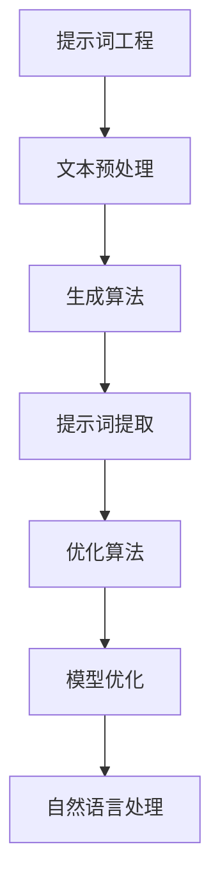

                 

### 提示词工程在自然语言处理中的突破

关键词：自然语言处理、提示词工程、算法原理、数学模型、系统架构

摘要：本文将深入探讨自然语言处理（NLP）领域中的提示词工程，解析其核心概念、算法原理、数学模型，并展示其在系统架构设计中的应用。我们将通过一步步的分析与推理，揭示提示词工程在NLP中的突破性作用，为读者提供全面的技术洞察。

## 目录大纲

### 目录大纲设计思路

在设计《提示词工程在自然语言处理中的突破》这本书的目录大纲时，我们遵循了以下设计思路：

1. **整体结构**：明确书的主题和目标，确保内容的连贯性和完整性。
2. **细化章节**：详细划分每个章节的内容，确保每个章节都有明确的主题和目标。
3. **保持简洁性**：避免冗余内容，确保每个章节都直击主题。
4. **确保完整性**：每个章节都要包含核心概念、算法原理、数学模型、系统架构等内容。
5. **使用markdown格式**：便于阅读和编辑，确保格式清晰、易于理解。

### 实际设计步骤

1. **书名及概述**：
   - 输出：```# 《提示词工程在自然语言处理中的突破》目录大纲```
   - 内容：介绍书的主题和目标。

2. **背景介绍**：
   - 输出：
     ```markdown
     # 第一部分：背景介绍

     ## 1.1 问题背景
     ### 1.1.1 自然语言处理的现状
     ### 1.1.2 提示词工程的重要性
     ```

3. **核心概念与联系**：
   - 输出：
     ```markdown
     # 第二部分：核心概念与联系

     ## 2.1 核心概念
     ### 2.1.1 提示词工程的定义
     ### 2.1.2 提示词的类型与特点
     ### 2.1.3 提示词工程与自然语言处理的联系

     ## 2.2 概念属性特征对比表格
     ### 2.2.1 不同提示词工程的对比
     ```

4. **算法原理讲解**：
   - 输出：
     ```markdown
     # 第三部分：算法原理讲解

     ## 3.1 提示词生成算法
     ### 3.1.1 算法概述
     ### 3.1.2 算法流程图
     ### 3.1.3 数学模型与公式

     ## 3.2 提示词优化算法
     ### 3.2.1 算法概述
     ### 3.2.2 算法流程图
     ### 3.2.3 数学模型与公式

     ## 3.3 算法实例讲解
     ### 3.3.1 实例1：生成式提示词算法
     ### 3.3.2 实例2：优化式提示词算法
     ```

5. **数学模型和数学公式讲解**：
   - 输出：
     ```markdown
     # 第四部分：数学模型和数学公式讲解

     ## 4.1 基础数学模型
     ### 4.1.1 概率模型
     $$P(A) = \frac{N(A)}{N(S)}$$
     ### 4.1.2 贝叶斯定理
     $$P(A|B) = \frac{P(B|A)P(A)}{P(B)}$$

     ## 4.2 高级数学模型
     ### 4.2.1 机器学习模型
     $$h(x;\theta) = \theta^T \phi(x)$$
     ### 4.2.2 深度学习模型
     $$a^{(L)} = \sigma(z^{(L)})$$
     ```

6. **系统分析与架构设计方案**：
   - 输出：
     ```markdown
     # 第五部分：系统分析与架构设计方案

     ## 5.1 问题场景介绍
     ### 5.1.1 提示词工程的应用场景
     ### 5.1.2 系统的需求分析

     ## 5.2 系统架构设计
     ### 5.2.1 系统架构概述
     ### 5.2.2 系统功能设计（类图）
     ### 5.2.3 系统架构设计（架构图）
     ### 5.2.4 系统接口设计
     ### 5.2.5 系统交互（序列图）

     ## 5.3 架构设计与实战

## 背景介绍

自然语言处理（NLP）是计算机科学、人工智能和语言学的交叉领域，旨在让计算机能够理解和处理人类自然语言。随着互联网的快速发展，NLP技术得到了广泛应用，如搜索引擎、机器翻译、文本分类、情感分析等。

### 问题背景

在自然语言处理过程中，如何有效地生成和优化提示词（Keywords）成为一个关键问题。提示词是NLP任务中的重要元素，它们用于引导模型理解文本的语义，从而提高任务的准确性和效率。

### 问题描述

提示词工程的核心问题包括：

1. **生成高质量提示词**：如何从大量文本数据中提取出高质量、有代表性的提示词？
2. **优化提示词**：如何根据任务需求和文本特点，调整提示词，以提高模型性能？

### 问题解决

提示词工程通过一系列算法和技术手段，解决上述问题。主要包括：

1. **生成算法**：如基于统计的词频统计、基于语义的词性标注和实体识别等。
2. **优化算法**：如基于深度学习的神经网络模型，用于调整提示词，提高模型性能。

### 边界与外延

提示词工程的边界包括：

1. **文本数据质量**：高质量的数据是生成高质量提示词的基础。
2. **模型性能要求**：不同的NLP任务对提示词的要求不同，需要根据具体任务进行调整。

### 概念结构与核心要素组成

提示词工程的核心概念包括：

1. **提示词**：文本中的关键词汇，用于引导模型理解文本语义。
2. **生成算法**：用于提取文本中的提示词。
3. **优化算法**：用于调整提示词，提高模型性能。
4. **数学模型**：用于描述提示词工程中的概率和统计特性。

## 核心概念与联系

### 核心概念

在提示词工程中，有几个核心概念：

1. **提示词**：文本中的关键词汇，用于引导模型理解文本语义。
2. **生成算法**：用于从大量文本数据中提取出提示词。
3. **优化算法**：用于根据任务需求，调整提示词，以提高模型性能。
4. **数学模型**：用于描述提示词工程中的概率和统计特性。

### 概念属性特征对比表格

以下是一个对比不同生成算法的表格：

| 算法名称 | 基于词频 | 基于词性标注 | 基于实体识别 |
| --- | --- | --- | --- |
| 特点 | 简单高效，易于实现 | 更精细，能捕捉语义信息 | 更高层次，能识别实体 |
| 优点 | 提取速度快，资源消耗低 | 能捕捉语义信息，准确率高 | 能识别实体，对任务有针对性 |
| 缺点 | 可能漏掉关键信息 | 资源消耗高，训练时间长 | 资源消耗极高，需要大量标注数据 |

### 提示词工程与自然语言处理的联系

提示词工程是自然语言处理中的重要组成部分，其核心目的是提高NLP任务的性能。具体来说，提示词工程与自然语言处理有以下联系：

1. **文本预处理**：提示词工程中的生成算法用于对文本进行预处理，提取出关键信息。
2. **任务导向**：提示词工程根据具体NLP任务的需求，调整提示词，提高模型性能。
3. **模型优化**：通过优化算法，调整提示词，进一步提升模型性能。

### ER实体关系图架构的Mermaid流程图



### 总结

在本节中，我们介绍了提示词工程在自然语言处理中的核心概念、属性特征对比表格以及与NLP的联系。在接下来的章节中，我们将深入探讨提示词工程的算法原理、数学模型和系统架构设计，为读者提供更全面的技术洞察。

