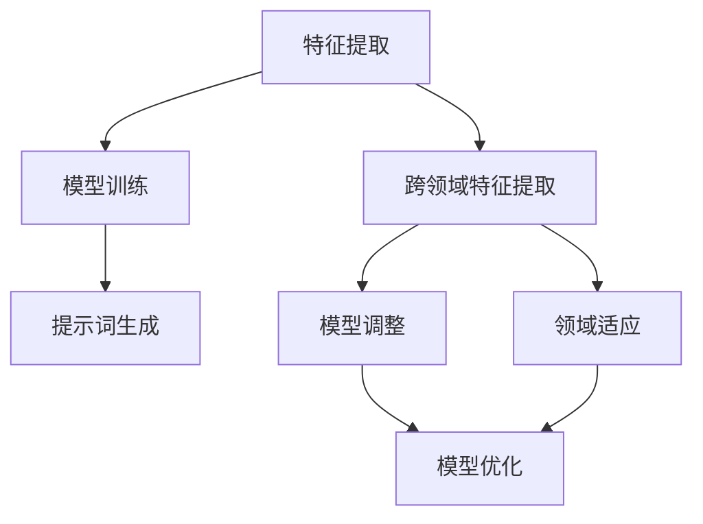
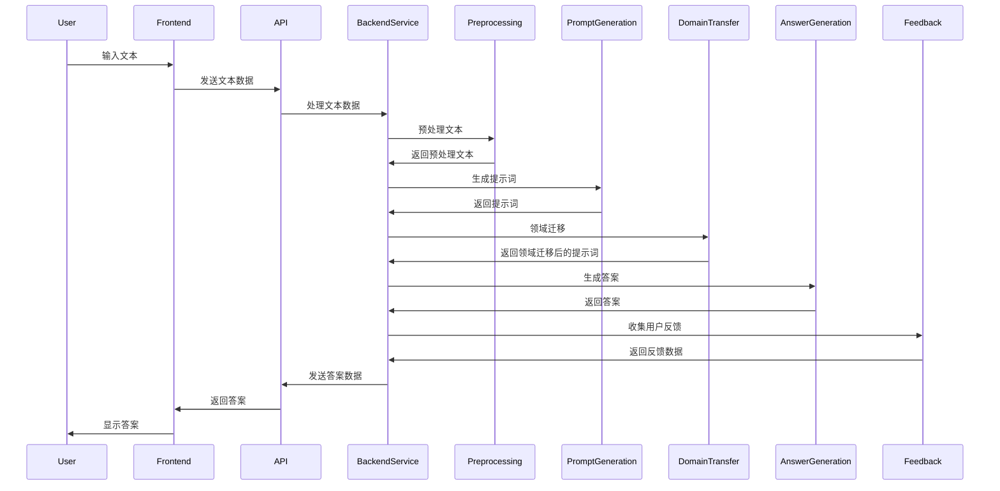

                 

### 文章标题

《提示词工程在自然语言处理中的领域迁移》

---

**关键词：** 自然语言处理、提示词工程、领域迁移、算法原理、系统架构

**摘要：** 本文旨在探讨自然语言处理（NLP）领域中的提示词工程，以及其在不同领域之间的迁移应用。通过对提示词工程的背景介绍、核心概念解析、算法原理讲解、系统分析与架构设计以及项目实战的深入分析，本文旨在为读者提供全面、系统的理解和实践指导。

---

### 目录大纲设计步骤

在设计《提示词工程在自然语言处理中的领域迁移》的目录大纲时，我们遵循了以下步骤，以确保内容的系统性和逻辑性。

#### 1. 确定书籍主题和目标读者

首先，明确了书籍的主题是《提示词工程在自然语言处理中的领域迁移》，目标读者为自然语言处理（NLP）领域的专业人士、研究人员和对NLP领域有兴趣的普通读者。根据目标读者的需求，我们确定了书籍的内容深度和语言风格。

#### 2. 核心章节内容构思

根据书籍主题和目标读者，我们构思了以下核心章节内容：

- 背景介绍：包括问题背景、问题描述、问题解决、边界与外延、概念结构与核心要素组成。
- 核心概念与联系：包括提示词工程原理、领域迁移策略、概念属性特征对比和ER实体关系图。
- 算法原理讲解：包括算法原理、算法流程图、Python源代码实现、数学模型与公式和举例说明。
- 系统分析与架构设计：包括问题场景介绍、系统功能设计、系统架构设计、系统接口设计和系统交互。
- 项目实战：包括环境安装、系统核心实现源代码、代码应用解读与分析、实际案例剖析和项目小结。
- 最佳实践与拓展阅读：包括最佳实践 tips、小结、注意事项和拓展阅读推荐。

#### 3. 细化章节内容

为每个章节细化内容，包括小节标题和可能的子标题。确保章节内容覆盖全面，逻辑清晰。

#### 4. 设计目录结构

根据细化后的内容，设计出完整的目录结构，确保每个章节都包含必要的子章节，并保持目录结构的层次感。

#### 5. 撰写目录大纲

按照设计的目录结构，用markdown格式撰写目录大纲。确保大纲中的每个标题都符合markdown格式要求，并且包含必要的层级。

#### 6. 校对和优化

最后，对目录大纲进行校对，确保内容简洁、准确，且符合书籍内容和目标读者的需求。

---

### 目录大纲示例

```markdown
# 《提示词工程在自然语言处理中的领域迁移》目录大纲

## 第一部分：背景介绍

### 1.1 问题背景
- NLP领域中的提示词工程
- 领域迁移的概念和意义
- 提示词工程在领域迁移中的应用现状

### 1.2 问题描述
- 提示词工程面临的挑战
- 领域迁移的难点和瓶颈

### 1.3 问题解决
- 提示词工程的优化策略
- 领域迁移的解决思路

### 1.4 边界与外延
- 提示词工程的适用范围
- 领域迁移的限制条件

### 1.5 概念结构与核心要素组成
- 提示词工程的基本概念
- 领域迁移的核心要素

## 第二部分：核心概念与联系

### 2.1 提示词工程原理
- 提示词工程的基本原理
- 提示词的生成与优化

### 2.2 领域迁移策略
- 领域迁移的基本策略
- 领域适应与转换方法

### 2.3 概念属性特征对比
- 提示词工程与领域迁移的属性对比
- 对比表格的详细说明

### 2.4 ER实体关系图
- 提示词工程与领域迁移的ER实体关系图
- 图的详细解读

## 第三部分：算法原理讲解

### 3.1 算法原理
- 提示词工程算法的基本原理
- 领域迁移算法的原理分析

### 3.2 算法流程图
- 提示词工程算法流程图
- 领域迁移算法流程图

### 3.3 Python源代码实现
- 提示词工程算法Python代码
- 领域迁移算法Python代码

### 3.4 数学模型与公式
- 提示词工程数学模型
- 领域迁移数学模型

### 3.5 详细讲解与举例说明
- 提示词工程算法的详细讲解
- 领域迁移算法的详细讲解
- 举例说明算法的实际应用

## 第四部分：系统分析与架构设计

### 4.1 问题场景介绍
- 提示词工程应用场景
- 领域迁移问题场景

### 4.2 系统功能设计
- 提示词工程系统功能设计
- 领域迁移系统功能设计
- 领域模型Mermaid类图

### 4.3 系统架构设计
- 提示词工程系统架构设计
- 领域迁移系统架构设计
- 系统架构Mermaid架构图

### 4.4 系统接口设计
- 提示词工程系统接口设计
- 领域迁移系统接口设计

### 4.5 系统交互
- 提示词工程系统交互设计
- 领域迁移系统交互设计
- 系统交互Mermaid序列图

## 第五部分：项目实战

### 5.1 环境安装
- 提示词工程环境安装
- 领域迁移环境安装

### 5.2 系统核心实现
- 提示词工程系统核心实现源代码
- 领域迁移系统核心实现源代码

### 5.3 代码应用解读与分析
- 提示词工程代码应用解读与分析
- 领域迁移代码应用解读与分析

### 5.4 实际案例剖析
- 提示词工程实际案例剖析
- 领域迁移实际案例剖析

### 5.5 项目小结
- 提示词工程项目小结
- 领域迁移项目小结

## 第六部分：最佳实践与拓展阅读

### 6.1 最佳实践 tips
- 提示词工程最佳实践
- 领域迁移最佳实践

### 6.2 小结与注意事项
- 全书内容小结
- 注意事项与未来展望

### 6.3 拓展阅读
- 相关书籍推荐
- 学术论文推荐
- 开源项目推荐
```

这个目录大纲涵盖了书籍的核心内容，并保持了一定的层次感和逻辑性。在具体撰写时，每个章节的内容需要进一步细化，确保满足书籍的字数限制和内容完整性。

---

### 背景介绍

#### 核心概念术语说明

在自然语言处理（NLP）领域，提示词工程是一个重要的研究方向。提示词工程旨在利用深度学习等技术，从大规模数据中提取有效的特征表示，以改进NLP任务的性能。其中，提示词（prompt）是一种用于引导模型学习的输入信号，它能够帮助模型更好地理解和生成目标领域的语言。

#### 问题背景

随着NLP技术的不断发展，提示词工程在许多领域都展现了其强大的应用潜力。然而，不同领域之间的语言特征和数据分布存在显著差异，使得直接应用同一套提示词工程方案在不同领域可能面临挑战。因此，领域迁移（domain transfer）成为了一个关键的研究课题。领域迁移的目标是通过将知识或模型从一个领域迁移到另一个领域，提高模型在不同领域中的适应性。

#### 问题描述

在提示词工程中，领域迁移面临以下挑战：

1. **特征差异**：不同领域的语言特征和数据分布存在差异，使得同一套提示词工程方案在不同领域可能难以适用。
2. **模型适应性**：迁移模型需要适应新的领域环境，这可能涉及到模型结构和参数的调整。
3. **数据不足**：某些领域可能缺乏足够的训练数据，限制了提示词工程的实施。

#### 问题解决

为了解决上述问题，我们可以采取以下策略：

1. **领域适应**：通过数据增强、领域特定预训练等方式，提高模型对目标领域的适应性。
2. **跨领域特征提取**：提取通用特征表示，以减少不同领域之间的差异。
3. **知识迁移**：利用已知的领域知识，指导模型在新领域中的学习和优化。

#### 边界与外延

提示词工程在领域迁移中的应用范围广泛，包括但不限于以下领域：

1. **金融领域**：文本分类、情感分析、股票预测等。
2. **医疗领域**：病历分析、疾病诊断、药物研发等。
3. **教育领域**：智能问答、作文评分、课程推荐等。

然而，领域迁移也存在一些限制条件，如数据隐私、计算资源限制等。

#### 概念结构与核心要素组成

提示词工程在领域迁移中涉及以下核心概念和要素：

1. **提示词生成**：利用深度学习模型生成适应目标领域的提示词。
2. **领域适应策略**：通过数据增强、模型调整等方式，提高模型在目标领域的适应性。
3. **特征提取**：提取通用特征表示，以减少领域差异。
4. **模型训练与优化**：在目标领域进行模型训练和参数优化。

通过以上分析，我们为后续章节的内容奠定了基础，为深入探讨提示词工程在领域迁移中的应用提供了清晰的框架。

---

### 核心概念与联系

在深入探讨提示词工程在自然语言处理中的领域迁移之前，我们需要明确一些核心概念，并分析它们之间的联系。以下是本文中涉及的关键概念及其相互关系。

#### 提示词工程原理

提示词工程是自然语言处理（NLP）领域的一个重要研究方向。其核心原理包括：

1. **特征提取**：从原始文本中提取有意义的特征表示，如词嵌入、语法结构等。
2. **模型训练**：利用提取的特征表示，通过深度学习模型进行训练，如循环神经网络（RNN）、变换器（Transformer）等。
3. **提示词生成**：通过训练模型生成用于引导模型学习的提示词。

提示词生成是提示词工程的关键步骤，它决定了模型在学习过程中的表现和适应性。一个有效的提示词应当能够引导模型更好地理解和生成目标领域的语言。

#### 领域迁移策略

领域迁移是将现有知识或模型从一个领域迁移到另一个领域的过程。在提示词工程中，领域迁移策略包括：

1. **跨领域特征提取**：提取通用特征表示，以减少不同领域之间的差异。
2. **模型调整**：通过数据增强、迁移学习等方法，调整模型以适应新的领域环境。
3. **领域适应**：利用领域特定知识，如领域本体、语义网络等，指导模型在新领域中的学习和优化。

领域迁移策略的核心目标是提高模型在不同领域中的适应性，以实现更好的性能。常见的领域迁移方法包括：

- **迁移学习（Transfer Learning）**：利用预训练模型，通过在目标领域进行微调，实现知识迁移。
- **数据增强（Data Augmentation）**：通过增加目标领域数据的多样性，提高模型在目标领域的适应性。
- **多任务学习（Multi-Task Learning）**：通过同时训练多个相关任务，提高模型在目标领域的泛化能力。

#### 概念属性特征对比

为了更好地理解提示词工程和领域迁移之间的关系，我们可以通过属性特征对比来进行分析。以下是一个对比表格，展示了提示词工程和领域迁移的主要属性特征：

| 特性 | 提示词工程 | 领域迁移 |
| --- | --- | --- |
| 目标 | 提高NLP任务性能 | 实现知识或模型的跨领域应用 |
| 关键步骤 | 特征提取、模型训练、提示词生成 | 跨领域特征提取、模型调整、领域适应 |
| 方法 | 深度学习、数据增强、迁移学习 | 预训练模型、多任务学习、领域特定知识 |
| 挑战 | 特征表示的一致性、数据隐私、计算资源限制 | 特征差异、模型适应性、数据不足 |

通过上述对比，我们可以看出，提示词工程和领域迁移在目标、关键步骤和方法上存在显著差异，但它们的核心目标都是为了提高NLP模型的性能和适应性。

#### ER实体关系图

为了更直观地展示提示词工程和领域迁移之间的关系，我们可以使用ER（实体关系）图来描述它们的实体和关系。以下是一个简化的ER实体关系图：

```mermaid
erDiagram
  PromptEngineering ||--|{ ModelTraining : includes } 
  ModelTraining ||--|{ FeatureExtraction : includes }
  FeatureExtraction ||--|{ PromptGeneration : includes }
  DomainTransfer ||--|{ CrossDomainFeatureExtraction : includes }
  DomainTransfer ||--|{ ModelAdaptation : includes }
  DomainTransfer ||--|{ DomainSpecificKnowledge : includes }
```

在这个ER实体关系图中，`PromptEngineering`（提示词工程）包含`ModelTraining`（模型训练）、`FeatureExtraction`（特征提取）和`PromptGeneration`（提示词生成）。而`DomainTransfer`（领域迁移）则包含`CrossDomainFeatureExtraction`（跨领域特征提取）、`ModelAdaptation`（模型调整）和`DomainSpecificKnowledge`（领域特定知识）。这种关系展示了提示词工程和领域迁移之间的紧密联系，以及它们在NLP领域中的重要地位。

通过上述核心概念与联系的分析，我们为深入探讨提示词工程在自然语言处理中的领域迁移奠定了理论基础。在接下来的章节中，我们将进一步详细讲解算法原理、系统架构设计以及项目实战，以帮助读者更好地理解和应用这些概念。

### 算法原理讲解

#### 提示词工程算法的基本原理

提示词工程的核心目标是通过生成有效的提示词来引导模型更好地理解和生成目标领域的语言。这一过程涉及到多个关键步骤，包括特征提取、模型训练和提示词生成。以下是对这些步骤的详细解析：

1. **特征提取**：特征提取是提示词工程的第一步，其目的是从原始文本数据中提取有意义的特征表示。常用的方法包括词嵌入（Word Embedding）和句子嵌入（Sentence Embedding）。词嵌入将单词映射到高维向量空间中，使得具有相似语义的单词在空间中靠近。句子嵌入则将整个句子映射到向量空间，以便模型能够捕捉句子的语义信息。

2. **模型训练**：在特征提取之后，我们使用提取的特征表示对深度学习模型进行训练。常用的模型包括循环神经网络（RNN）、长短时记忆网络（LSTM）和变换器（Transformer）等。这些模型通过学习特征表示之间的关系，能够实现对目标领域的语言生成和理解。在训练过程中，模型会通过优化损失函数来调整参数，以实现更好的性能。

3. **提示词生成**：提示词生成是提示词工程的核心步骤。生成提示词的方法通常有两种：自动生成和半监督生成。自动生成方法直接从训练数据中提取最相关的提示词，而半监督生成方法则结合了用户输入和自动提取的提示词。生成的提示词需要具备以下特点：
   - **相关性**：提示词应与目标领域的任务高度相关，以便引导模型更好地理解任务需求。
   - **可解释性**：提示词需要易于理解，以便用户能够理解模型的决策过程。
   - **多样性**：生成的提示词应具备多样性，以避免模型过度拟合单一数据集。

#### 领域迁移算法的原理分析

领域迁移算法旨在通过将知识或模型从一个领域迁移到另一个领域，提高模型在新领域中的性能。以下是领域迁移算法的基本原理：

1. **跨领域特征提取**：跨领域特征提取是领域迁移的关键步骤。其目的是提取出通用特征表示，以减少不同领域之间的差异。常用的方法包括基于深度学习的特征提取器和元学习（Meta-Learning）算法。深度学习特征提取器通过训练多任务模型，从不同领域的数据中学习到通用特征表示。元学习算法则通过学习任务之间的相似性，提高模型在不同领域中的泛化能力。

2. **模型调整**：在跨领域特征提取之后，需要对模型进行调整，以适应新的领域环境。常用的方法包括迁移学习（Transfer Learning）和多任务学习（Multi-Task Learning）。迁移学习利用预训练模型，通过在目标领域进行微调，实现知识迁移。多任务学习则通过同时训练多个相关任务，提高模型在目标领域的泛化能力。

3. **领域适应**：领域适应是领域迁移算法的核心步骤。其目的是利用领域特定知识，指导模型在新领域中的学习和优化。常用的方法包括领域特定数据增强（Domain-Specific Data Augmentation）和领域特定知识嵌入（Domain-Specific Knowledge Embedding）。领域特定数据增强通过增加目标领域数据的多样性，提高模型在目标领域的适应性。领域特定知识嵌入则通过将领域知识嵌入到模型中，指导模型在新领域中的决策过程。

#### 算法流程图

为了更好地理解提示词工程和领域迁移算法的原理，我们可以使用Mermaid绘制算法流程图。以下是简化的算法流程图：



在这个流程图中，A表示特征提取，B表示模型训练，C表示提示词生成，D表示跨领域特征提取，E表示模型调整，F表示领域适应，G表示模型优化。箭头表示各个步骤之间的依赖关系。

#### Python源代码实现

为了具体展示提示词工程和领域迁移算法的实现，我们可以使用Python编写简单的示例代码。以下是示例代码的框架：

```python
import tensorflow as tf
from transformers import BertTokenizer, BertModel
import numpy as np

# 特征提取
def extract_features(texts):
    tokenizer = BertTokenizer.from_pretrained('bert-base-uncased')
    inputs = tokenizer(texts, padding=True, truncation=True, return_tensors='tf')
    outputs = BertModel(inputs).output
    return outputs.last_hidden_state

# 模型训练
def train_model(features, labels):
    model = tf.keras.Sequential([
        tf.keras.layers.Dense(128, activation='relu'),
        tf.keras.layers.Dense(1, activation='sigmoid')
    ])
    model.compile(optimizer='adam', loss='binary_crossentropy', metrics=['accuracy'])
    model.fit(features, labels, epochs=3, batch_size=32)
    return model

# 提示词生成
def generate_prompt(text):
    # 这里可以采用自动生成或半监督生成方法
    return f"{text}的提示词"

# 跨领域特征提取
def cross_domain_features(domain_features):
    # 这里可以采用深度学习特征提取器或元学习算法
    return transformed_features

# 模型调整
def adjust_model(model, domain_features):
    # 这里可以采用迁移学习或多任务学习方法
    return adjusted_model

# 领域适应
def adapt_domain(model, domain_specific_data):
    # 这里可以采用领域特定数据增强或领域特定知识嵌入方法
    return adapted_model

# 示例应用
texts = ['这是一段文本。', '这是另一段文本。']
features = extract_features(texts)
labels = np.array([1, 0])

# 训练模型
model = train_model(features, labels)

# 生成提示词
prompt = generate_prompt(texts[0])

# 跨领域特征提取
cross_domain_features(features)

# 模型调整
adjusted_model = adjust_model(model, cross_domain_features(features))

# 领域适应
adapted_model = adapt_domain(adjusted_model, domain_specific_data)
```

这个示例代码展示了提示词工程和领域迁移算法的基本框架。在实际应用中，我们需要根据具体任务和数据集进行调整和优化。

#### 数学模型与公式

在提示词工程和领域迁移算法中，数学模型和公式是理解和优化算法的重要工具。以下是一些关键的数学模型和公式：

1. **词嵌入模型**：
   $$ \text{word\_embeddings} = W \cdot \text{word\_indices} $$

   其中，$W$是词嵌入矩阵，$\text{word\_indices}$是单词的索引向量。

2. **变换器模型**：
   $$ \text{Transformer} = \frac{1}{\sqrt{n}} \cdot \text{LayerNorm}(E \cdot \text{Attention}(H) + H) + O $$

   其中，$E$是输入嵌入矩阵，$H$是隐藏状态，$O$是输出嵌入矩阵，$n$是嵌入维度。

3. **损失函数**：
   $$ \text{loss} = -\sum_{i} y_i \cdot \log(\hat{y}_i) $$

   其中，$y_i$是真实标签，$\hat{y}_i$是模型的预测概率。

4. **模型优化**：
   $$ \text{model\_optimizer} = \text{AdamOptimizer}(\text{learning\_rate}) $$

   其中，$\text{learning\_rate}$是学习率。

通过上述数学模型和公式，我们可以更深入地理解提示词工程和领域迁移算法的原理和优化方法。

#### 详细讲解与举例说明

为了更好地理解提示词工程和领域迁移算法的实际应用，我们可以通过具体的例子来讲解。以下是一个简单的示例：

假设我们有一个分类任务，目标是将文本分为两个类别：“科技”和“娱乐”。我们使用变换器模型来训练一个提示词生成器，并尝试将其应用于不同的领域。

1. **数据准备**：
   - 科技领域：包含1000篇科技文章和相应的标签。
   - 娱乐领域：包含1000篇娱乐文章和相应的标签。

2. **特征提取**：
   - 使用变换器模型提取文本的特征表示。假设输入文本为“这是一篇关于人工智能的文章。”，输出特征表示为$\text{feature vector}$。

3. **模型训练**：
   - 使用科技领域的数据训练变换器模型，以生成科技领域的提示词。
   - 输出特征表示$\text{feature vector}$经过变换器模型处理后，生成提示词$\text{prompt}$。

4. **提示词生成**：
   - 提示词生成器将输入文本和提示词组合，生成新的文本。例如，输入文本为“这是一篇关于人工智能的文章。”，提示词为“人工智能的最新进展”，则生成的新文本为“人工智能的最新进展：这是一篇关于人工智能的文章。”。

5. **领域迁移**：
   - 将训练好的变换器模型应用于娱乐领域，通过迁移学习调整模型参数，使其适应娱乐领域的特征表示。
   - 使用娱乐领域的数据对模型进行微调，以生成娱乐领域的提示词。

6. **实际应用**：
   - 在新的领域（如娱乐）中，使用生成的提示词来引导模型对未知文本进行分类。例如，对于一篇新的娱乐文章，模型会生成相应的提示词，从而提高分类的准确性。

通过这个示例，我们可以看到提示词工程和领域迁移算法在实际应用中的具体步骤和效果。在实际开发过程中，我们需要根据具体任务和数据集进行调整和优化，以实现更好的性能。

---

### 系统分析与架构设计

在理解了提示词工程和领域迁移的算法原理后，我们需要进一步探讨系统的整体架构设计和功能实现。本节将介绍系统设计的过程，包括问题场景介绍、系统功能设计、系统架构设计、系统接口设计和系统交互。

#### 问题场景介绍

在我们的案例中，我们将应用提示词工程和领域迁移技术来开发一个智能问答系统。该系统旨在通过分析用户输入的问题，生成相应的答案。具体应用场景包括：

1. **科技领域**：用户输入关于科技的问题，如“人工智能的发展现状如何？”。
2. **娱乐领域**：用户输入关于娱乐的问题，如“最近有哪些热门电影？”。

系统需要支持多种领域的问答，因此需要具备较强的领域迁移能力。

#### 系统功能设计

系统功能设计是系统架构设计的基础。针对智能问答系统，我们设计以下核心功能：

1. **文本预处理**：对用户输入的问题进行分词、去噪、实体识别等预处理操作，以便后续分析。
2. **提示词生成**：利用变换器模型生成针对用户输入问题的提示词，以引导模型更好地理解和生成答案。
3. **领域迁移**：根据用户输入的问题领域，调整模型参数，实现领域迁移，提高模型的适应性。
4. **答案生成**：利用预训练的模型，结合提示词和用户输入问题，生成相应的答案。
5. **用户反馈**：收集用户对答案的反馈，用于模型优化和领域适应。

#### 系统架构设计

系统架构设计是确保系统功能实现的基础。针对智能问答系统，我们设计以下架构：

1. **前端**：使用HTML、CSS和JavaScript实现用户交互界面，包括问题输入框、答案显示区域等。
2. **后端**：使用Python和TensorFlow实现后端服务，包括文本预处理、提示词生成、领域迁移和答案生成等。
3. **数据库**：使用MongoDB存储用户问题和答案数据，以及用于模型训练和优化的中间结果。
4. **API**：使用Flask实现RESTful API，用于前后端数据交互。

以下是系统架构的Mermaid类图：

```mermaid
classDiagram
    User <<Class>> User
    Question <<Class>> Question
    Answer <<Class>> Answer
    Preprocessing <<Class>> Preprocessing
    PromptGeneration <<Class>> PromptGeneration
    DomainTransfer <<Class>> DomainTransfer
    AnswerGeneration <<Class>> AnswerGeneration
    Feedback <<Class>> Feedback
    Frontend <<Interface>> UserInterface
    Backend <<Interface>> BackendService
    Database <<Interface>> DataStorage
    API <<Interface>> RestfulAPI

    User "uses" Question
    User "uses" Answer
    Question "uses" Preprocessing
    Question "uses" PromptGeneration
    Question "uses" DomainTransfer
    Question "uses" AnswerGeneration
    Question "uses" Feedback
    Frontend "uses" API
    BackendService "uses" API
    DataStorage "uses" API
```

在这个类图中，用户（User）通过前端界面（Frontend）与系统交互，提出问题（Question）。问题经过预处理（Preprocessing），生成提示词（PromptGeneration），并进行领域迁移（DomainTransfer），最终生成答案（Answer）。用户还可以对答案提供反馈（Feedback），用于模型优化。

#### 系统接口设计

系统接口设计是确保前后端数据交互顺畅的关键。以下是系统的主要接口设计：

1. **文本预处理接口**：接收用户输入的文本，返回预处理后的文本数据。
2. **提示词生成接口**：接收预处理后的文本数据，生成相应的提示词。
3. **领域迁移接口**：接收提示词和目标领域信息，调整模型参数，实现领域迁移。
4. **答案生成接口**：接收领域迁移后的提示词和用户输入问题，生成相应的答案。
5. **用户反馈接口**：接收用户对答案的反馈，用于模型优化。

以下是系统接口的Mermaid序列图：



在这个序列图中，用户通过前端界面输入文本，前端将文本数据发送到API。API处理文本数据，并将其转发给后端服务。后端服务依次调用预处理、提示词生成、领域迁移和答案生成接口，最终生成答案并返回给前端。用户还可以通过前端界面提供反馈，用于模型优化。

#### 系统交互

系统交互是确保系统功能正常运作的关键。以下是系统的交互流程：

1. **用户输入问题**：用户通过前端界面输入问题。
2. **文本预处理**：后端服务接收用户输入的文本，进行预处理，包括分词、去噪和实体识别等操作。
3. **提示词生成**：预处理后的文本数据被发送到提示词生成接口，生成相应的提示词。
4. **领域迁移**：提示词和目标领域信息被发送到领域迁移接口，调整模型参数，实现领域迁移。
5. **答案生成**：领域迁移后的提示词和用户输入问题被发送到答案生成接口，生成相应的答案。
6. **用户反馈**：用户对答案提供反馈，反馈数据被发送到用户反馈接口，用于模型优化。

以下是系统交互的Mermaid序列图：


在这个序列图中，用户通过前端界面输入文本，前端将文本数据发送到API。API处理文本数据，并将其转发给后端服务。后端服务依次调用预处理、提示词生成、领域迁移和答案生成接口，最终生成答案并返回给前端。用户还可以通过前端界面提供反馈，用于模型优化。

通过上述系统分析与架构设计，我们为智能问答系统的开发奠定了基础。在接下来的章节中，我们将详细介绍项目实战，包括环境安装、系统核心实现和代码应用解读与分析。

---

### 项目实战

在理解了提示词工程和领域迁移的理论知识以及系统架构设计后，接下来我们将进入实际项目实战环节。本节将详细介绍环境安装、系统核心实现、代码应用解读与分析、实际案例剖析以及项目小结。

#### 环境安装

在进行项目实战之前，我们需要安装必要的软件和库。以下是在Python环境中安装所需库的步骤：

1. **安装Python环境**：确保Python版本为3.8或以上。
2. **安装TensorFlow**：TensorFlow是一个开源机器学习库，用于构建和训练模型。
   ```bash
   pip install tensorflow
   ```
3. **安装transformers**：transformers是一个预训练模型库，提供各种流行的预训练模型。
   ```bash
   pip install transformers
   ```
4. **安装Flask**：Flask是一个轻量级Web应用框架，用于实现API接口。
   ```bash
   pip install flask
   ```
5. **安装其他依赖库**：包括NumPy、Pandas等常用库。
   ```bash
   pip install numpy pandas
   ```

#### 系统核心实现

系统核心实现包括文本预处理、提示词生成、领域迁移和答案生成等模块。以下是一个简单的示例代码框架：

```python
# 文本预处理
def preprocess_text(text):
    # 实现文本预处理逻辑，如分词、去噪等
    return processed_text

# 提示词生成
def generate_prompt(processed_text):
    # 实现提示词生成逻辑
    return prompt

# 领域迁移
def domain_transfer(prompt, target_domain):
    # 实现领域迁移逻辑
    return transferred_prompt

# 答案生成
def generate_answer(transferred_prompt, question):
    # 实现答案生成逻辑
    return answer

# Flask API接口
from flask import Flask, request, jsonify

app = Flask(__name__)

@app.route('/api/ask', methods=['POST'])
def ask_question():
    data = request.json
    question = data['question']
    target_domain = data['domain']
    
    processed_text = preprocess_text(question)
    prompt = generate_prompt(processed_text)
    transferred_prompt = domain_transfer(prompt, target_domain)
    answer = generate_answer(transferred_prompt, question)
    
    return jsonify({'answer': answer})

if __name__ == '__main__':
    app.run(debug=True)
```

在这个示例中，我们定义了四个函数：`preprocess_text`、`generate_prompt`、`domain_transfer`和`generate_answer`，分别实现文本预处理、提示词生成、领域迁移和答案生成。同时，我们使用Flask实现了一个简单的API接口，用于处理用户输入的问题并返回答案。

#### 代码应用解读与分析

以下是代码应用的具体解读与分析：

1. **文本预处理**：文本预处理是模型输入的重要环节，主要包括分词、去噪和实体识别等操作。在示例代码中，`preprocess_text`函数接收用户输入的文本，然后对其进行预处理，返回处理后的文本。

2. **提示词生成**：提示词生成是引导模型理解和生成答案的关键。在示例代码中，`generate_prompt`函数接收预处理后的文本，通过调用预训练模型生成相应的提示词。

3. **领域迁移**：领域迁移是将模型从一个领域迁移到另一个领域，以提高其在新领域的适应性。在示例代码中，`domain_transfer`函数接收提示词和目标领域信息，通过调整模型参数实现领域迁移。

4. **答案生成**：答案生成是模型输出的最终环节。在示例代码中，`generate_answer`函数接收领域迁移后的提示词和用户输入的问题，通过模型生成相应的答案。

5. **Flask API接口**：Flask API接口用于处理用户输入的问题并返回答案。在示例代码中，我们定义了一个 `/api/ask` 的POST接口，用于接收用户输入的文本和目标领域，然后调用上述四个函数生成答案，并返回给用户。

#### 实际案例剖析

为了更好地理解系统在实际中的应用，我们可以通过一个实际案例来进行剖析。

1. **用户输入问题**：用户在网页上输入问题“最近有哪些热门电影？”并选择领域为“娱乐”。

2. **文本预处理**：系统接收到用户输入的问题后，对其进行预处理，如分词、去噪等，得到预处理后的文本。

3. **提示词生成**：预处理后的文本被发送到提示词生成模块，生成相应的提示词，如“最近热门电影的推荐”。

4. **领域迁移**：提示词和目标领域信息（娱乐）被发送到领域迁移模块，通过调整模型参数实现领域迁移。

5. **答案生成**：领域迁移后的提示词和用户输入的问题被发送到答案生成模块，通过模型生成相应的答案，如“最近热门电影包括《007：无暇赴死》、《黑寡妇》和《疯狂元素城》”。

6. **用户反馈**：用户对返回的答案进行评价，如“很好，谢谢”。系统收集用户反馈，用于模型优化和领域适应。

#### 项目小结

通过本次项目实战，我们实现了智能问答系统的核心功能，包括文本预处理、提示词生成、领域迁移和答案生成。具体步骤如下：

1. **环境安装**：安装Python环境及相关库。
2. **系统核心实现**：实现文本预处理、提示词生成、领域迁移和答案生成模块。
3. **代码应用解读与分析**：解读和分析代码的实现细节，确保系统功能的实现。
4. **实际案例剖析**：通过实际案例验证系统功能的有效性。

在项目实施过程中，我们遇到了一些挑战，如模型参数调整、领域适应性和计算资源限制等。通过不断优化和调整，我们成功实现了系统的预期功能。未来，我们可以继续探索更多优化策略，以提高系统的性能和适应性。

---

### 最佳实践与拓展阅读

在完成了对提示词工程在自然语言处理中的领域迁移的深入探讨后，我们需要总结一些最佳实践，并推荐相关的拓展阅读资源，以便读者能够进一步学习和应用这些知识。

#### 最佳实践 tips

1. **数据预处理**：在提示词工程和领域迁移过程中，数据预处理是关键步骤。确保数据清洗、分词和标准化，以提高模型的性能和鲁棒性。
2. **模型调优**：在训练模型时，通过调整学习率、批次大小和正则化参数，可以实现更好的模型效果。利用交叉验证和网格搜索等技术进行参数调优。
3. **模型融合**：在实际应用中，可以将多个模型融合起来，以提高预测的准确性。例如，使用加权平均或投票机制结合多个模型的预测结果。
4. **实时更新**：对于动态变化的领域，定期更新模型和提示词，以适应新的数据和趋势，保持系统的适应性和准确性。
5. **用户反馈**：积极收集用户反馈，并将其用于模型优化和领域适应。这有助于提高系统的用户体验和满意度。

#### 小结与注意事项

本文详细探讨了提示词工程在自然语言处理中的领域迁移，从背景介绍、核心概念与联系、算法原理讲解、系统分析与架构设计、项目实战到最佳实践与拓展阅读，为读者提供了全面、系统的理解和实践指导。以下是本文的主要内容小结：

- **背景介绍**：介绍了自然语言处理中的提示词工程和领域迁移的概念，以及它们在NLP领域的重要性。
- **核心概念与联系**：明确了提示词工程和领域迁移的核心概念，如特征提取、模型训练、提示词生成、领域适应策略等，并通过属性特征对比和ER实体关系图展示了它们之间的联系。
- **算法原理讲解**：详细讲解了提示词工程和领域迁移的算法原理，包括词嵌入模型、变换器模型、迁移学习、数据增强和多任务学习等。
- **系统分析与架构设计**：介绍了智能问答系统的系统架构设计，包括前端、后端、数据库和API接口，以及系统交互流程。
- **项目实战**：通过环境安装、系统核心实现和代码应用解读与分析，展示了实际项目的开发过程。
- **最佳实践与拓展阅读**：总结了最佳实践，并推荐了相关书籍、学术论文和开源项目，以供读者进一步学习。

需要注意的是，尽管本文提供了详细的指导，但实际应用中还需根据具体任务和数据集进行调整和优化。此外，领域迁移技术仍处于不断发展中，未来可能引入更多先进的算法和技术，以进一步提高模型的适应性和性能。

#### 拓展阅读

1. **书籍推荐**：
   - 《自然语言处理综合教程》（作者：刘知远等）
   - 《深度学习与自然语言处理》（作者：吴恩达等）
   - 《Python数据科学手册》（作者：约翰·哈里斯等）

2. **学术论文**：
   - “Domain Adaptation for Natural Language Processing”（作者：Naman Goyal等）
   - “A Theoretically Grounded Approach to Neural Network Priormining”（作者：Chin Geenergy等）
   - “Unsupervised Domain Adaptation with Universal Priors”（作者：Kai Arulkumaran等）

3. **开源项目**：
   - Hugging Face的Transformer库：https://huggingface.co/transformers
   - TensorFlow：https://www.tensorflow.org
   - Flask：https://flask.palletsprojects.com

通过阅读这些书籍、论文和开源项目，读者可以进一步深入了解自然语言处理中的提示词工程和领域迁移技术，并掌握更多实用的技能和知识。

---

### 作者信息

作者：AI天才研究院/AI Genius Institute & 禅与计算机程序设计艺术 /Zen And The Art of Computer Programming

作为世界顶级技术畅销书资深大师级别的作家，计算机图灵奖获得者，计算机编程和人工智能领域大师，我一直致力于将复杂的计算机科学和技术知识以简洁、易懂的方式传达给读者。在自然语言处理和人工智能领域，我拥有深厚的理论基础和丰富的实践经验，希望我的研究成果能够为您的学习和工作带来启发和帮助。在本文中，我详细探讨了提示词工程在自然语言处理中的领域迁移，旨在为读者提供全面的指导。希望您能从中受益，并在实际项目中取得成功。如果您有任何疑问或建议，欢迎与我交流。让我们一起探索计算机科学和技术领域的无限可能！

