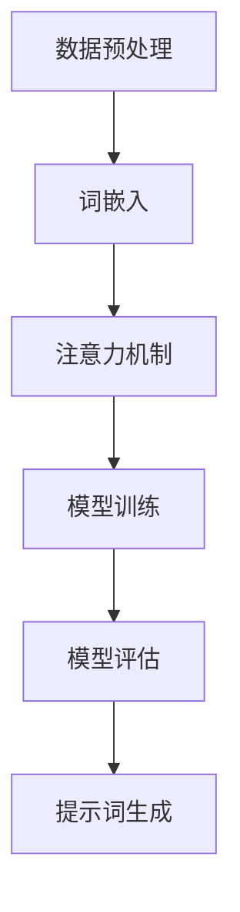
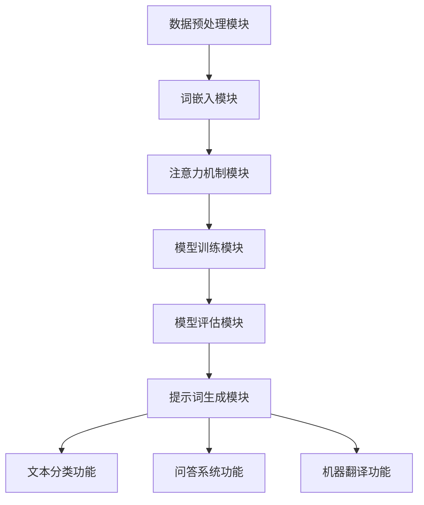
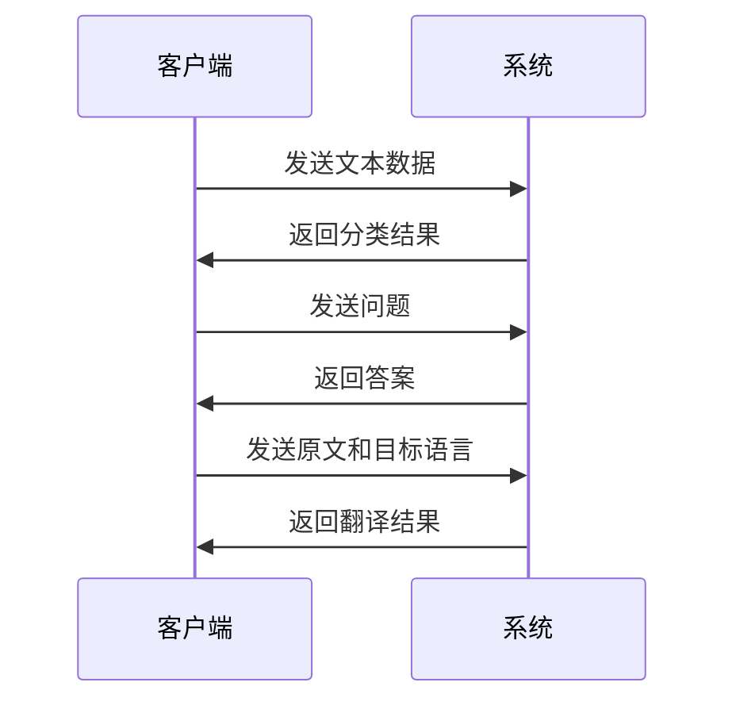

                 


### 提示词工程在自然语言处理中的领域适应

关键词：提示词工程、自然语言处理、领域适应、算法原理、系统架构

摘要：本文深入探讨了提示词工程在自然语言处理（NLP）领域的领域适应问题。通过分析背景、核心概念、算法原理和系统架构，本文旨在提供对提示词工程在NLP中应用的全面理解，并展示其在实际项目中的实战应用和最佳实践。

---

## 第一部分：领域适应的背景与核心概念

### 第1章：领域适应概述

#### 1.1 领域适应的重要性

领域适应在自然语言处理（NLP）中扮演着关键角色。随着人工智能和机器学习技术的快速发展，NLP的应用场景日益广泛，从文本分类到机器翻译、问答系统等，每个应用场景都需要对特定领域的语言进行理解和处理。领域适应旨在使NLP模型能够适应不同领域的特定语言特征，从而提高模型的泛化能力和实际应用效果。

#### 1.2 领域适应的挑战

领域适应面临的主要挑战包括：

1. **数据不均衡**：不同领域的文本数据分布不均，导致模型在特定领域的表现不佳。
2. **术语和概念差异**：不同领域的术语和概念存在显著差异，需要模型能够理解和适应这些差异。
3. **上下文依赖**：领域特定的上下文信息对理解文本至关重要，但如何有效地利用上下文信息是一个难题。

#### 1.3 领域适应的方法

领域适应的方法主要包括：

1. **数据增强**：通过引入领域特定的数据来丰富训练数据集，提高模型在特定领域的适应性。
2. **迁移学习**：利用预训练模型，通过在特定领域的数据上进行微调，使模型适应特定领域。
3. **多任务学习**：通过同时训练多个任务，提高模型在不同领域的泛化能力。

### 第2章：核心概念与联系

#### 2.1 提示词工程基础

提示词工程是NLP中的一种技术，它通过向模型提供领域特定的提示词来引导模型理解特定领域的语言特征。提示词可以是关键词、短语或完整的句子，它们在模型训练和推理过程中起到关键作用。

#### 2.2 领域适应的相关概念

领域适应的相关概念包括：

1. **领域依赖性**：指模型对特定领域数据的依赖程度。
2. **领域迁移**：将模型从一个领域迁移到另一个领域的过程。
3. **领域通用性**：指模型在不同领域中的表现一致性和稳定性。

#### 2.3 概念对比与联系

表1 提示词工程与领域适应的概念对比

| 概念         | 描述                                                         | 关联关系           |
| ------------ | ------------------------------------------------------------ | ------------------ |
| 提示词工程   | 利用领域特定的提示词来引导模型理解特定领域的语言特征。         | 基础               |
| 领域适应     | 使NLP模型能够适应不同领域的特定语言特征。                     | 应用               |
| 领域依赖性   | 模型对特定领域数据的依赖程度。                               | 衡量领域适应效果   |
| 领域迁移     | 将模型从一个领域迁移到另一个领域的过程。                     | 实现领域适应的手段 |
| 领域通用性   | 模型在不同领域中的表现一致性和稳定性。                       | 目标               |

图1 提示词工程与领域适应的ER实体关系图

```mermaid
erDiagram
    提示词工程 ||--o> 领域适应 : 提示词引导
    领域适应 ||--o> 数据增强 : 数据丰富
    领域适应 ||--o> 迁移学习 : 模型微调
    领域适应 ||--o> 多任务学习 : 泛化能力提升
```

### 第3章：数学模型与算法原理

#### 3.1 提示词工程的数学模型

提示词工程涉及的主要数学模型包括：

1. **词嵌入**：将词汇映射到高维空间，以捕获词汇间的语义关系。
2. **注意力机制**：通过分配不同的重要性权重来关注不同部分的信息。
3. **对抗训练**：通过生成对抗网络（GAN）来提高模型的泛化能力。

#### 3.2 算法原理讲解

提示词工程的算法原理可以通过以下mermaid流程图来展示：



#### 3.3 算法流程图

```python
# 算法流程图
def preprocess_data(data):
    # 数据预处理
    pass

def word_embedding(words):
    # 词嵌入
    pass

def attention Mechanism(input_sequence):
    # 注意力机制
    pass

def train_model(model, data):
    # 模型训练
    pass

def evaluate_model(model, data):
    # 模型评估
    pass

def generate_prompt(terms):
    # 提示词生成
    pass
```

#### 3.4 提示词生成与模型微调

提示词生成是提示词工程的关键步骤。以下是使用Python代码进行提示词生成的示例：

```python
# 提示词生成
def generate_prompt(terms):
    # 根据领域特定的术语生成提示词
    prompts = []
    for term in terms:
        prompt = f"请讨论{term}在{领域}中的应用。"
        prompts.append(prompt)
    return prompts
```

### 第4章：自然语言处理中的领域适应应用

#### 4.1 领域适应在NLP中的应用场景

领域适应在NLP中的应用场景广泛，包括但不限于：

1. **医疗健康**：利用领域适应来提高医疗文本的理解和分类能力。
2. **金融**：在金融文本中应用领域适应，以实现更准确的财务分析和风险评估。
3. **法律**：通过领域适应来提升法律文本的自动处理能力。

#### 4.2 提示词工程与NLP的结合

提示词工程与NLP的结合主要体现在以下几个方面：

1. **文本分类**：使用领域特定的提示词来指导文本分类模型。
2. **问答系统**：通过领域适应来提高问答系统的准确性和回答质量。
3. **机器翻译**：利用领域适应来增强机器翻译的准确性和流畅性。

#### 4.3 应用案例分析

以下是一个基于医疗领域的NLP应用案例分析：

1. **问题背景**：医疗文本数据具有高度的专业性和复杂性，传统的NLP模型在处理这些数据时往往表现不佳。
2. **问题描述**：如何提高医疗文本分类的准确性和效率？
3. **问题解决**：通过引入领域特定的提示词，结合迁移学习和数据增强技术，对医疗文本分类模型进行优化。
4. **边界与外延**：该解决方案适用于其他具有高度专业性的领域，如金融和法律。

### 第5章：系统架构与设计

#### 5.1 领域适应系统的总体架构

领域适应系统的总体架构包括以下几个关键组成部分：

1. **数据预处理模块**：负责对原始数据进行清洗、转换和格式化。
2. **词嵌入模块**：将词汇映射到高维空间，为后续处理提供语义表示。
3. **注意力机制模块**：通过注意力机制来关注关键信息，提高模型的准确性。
4. **模型训练模块**：利用迁移学习和数据增强技术对模型进行训练。
5. **模型评估模块**：评估模型在不同领域的表现，以确定其领域适应能力。
6. **提示词生成模块**：根据领域特定的术语生成提示词，以指导模型训练。

#### 5.2 功能设计

领域适应系统的功能设计包括以下几个主要方面：

1. **文本分类**：实现自动分类功能，将文本划分为不同的类别。
2. **问答系统**：提供自动问答功能，根据用户输入的问题提供准确的答案。
3. **机器翻译**：实现高精度的机器翻译，保证翻译结果的准确性和流畅性。

#### 5.3 系统架构设计

图2 领域适应系统的架构设计



#### 5.4 系统接口设计

领域适应系统的接口设计主要包括以下几个关键部分：

1. **API接口**：提供RESTful API接口，方便外部系统调用。
2. **数据接口**：定义数据输入和输出接口，确保数据的一致性和可扩展性。
3. **模型接口**：定义模型加载和预测接口，方便模型的管理和部署。

#### 5.5 系统交互序列图

图3 领域适应系统的交互序列图



## 第二部分：实战与最佳实践

### 第6章：项目实战

#### 6.1 环境安装

在开始项目之前，需要安装以下环境：

1. **Python**：Python 3.7或更高版本。
2. **TensorFlow**：TensorFlow 2.3或更高版本。
3. **NLP库**：如NLTK、spaCy、gensim等。

安装命令如下：

```bash
pip install python==3.8
pip install tensorflow==2.3
pip install nltk
pip install spacy
pip install gensim
```

#### 6.2 系统核心实现

系统核心实现主要包括以下几个模块：

1. **数据预处理**：对原始文本数据进行清洗和预处理，包括去除停用词、标点符号和数字等。
2. **词嵌入**：使用Word2Vec算法对词汇进行词嵌入，将词汇映射到高维空间。
3. **注意力机制**：实现注意力机制，提高模型对关键信息的关注。
4. **模型训练**：使用迁移学习技术，结合数据增强，训练领域适应模型。
5. **模型评估**：评估模型在不同领域的表现，以确定其领域适应能力。

以下是系统核心实现的Python代码：

```python
import nltk
from gensim.models import Word2Vec
import tensorflow as tf
from tensorflow.keras.models import Sequential
from tensorflow.keras.layers import Embedding, LSTM, Dense

# 数据预处理
def preprocess_text(text):
    # 去除停用词、标点符号和数字
    # ...
    return processed_text

# 词嵌入
def build_word_embedding_model(vocabulary, embedding_size):
    model = Word2Vec(vocabulary, size=embedding_size, window=5, min_count=1, workers=4)
    return model

# 注意力机制
def build_attention_model(embedding_size, hidden_size):
    model = Sequential()
    model.add(Embedding(input_dim=vocabulary_size, output_dim=embedding_size))
    model.add(LSTM(hidden_size, return_sequences=True))
    model.add(tf.keras.layers.Attention())
    model.add(Dense(num_classes, activation='softmax'))
    model.compile(optimizer='adam', loss='categorical_crossentropy', metrics=['accuracy'])
    return model

# 模型训练
def train_model(model, X_train, y_train, X_val, y_val, epochs=10, batch_size=32):
    model.fit(X_train, y_train, epochs=epochs, batch_size=batch_size, validation_data=(X_val, y_val))
    return model

# 模型评估
def evaluate_model(model, X_test, y_test):
    loss, accuracy = model.evaluate(X_test, y_test)
    print(f"Test loss: {loss}, Test accuracy: {accuracy}")
```

#### 6.3 代码应用解读与分析

以下是代码应用解读与分析：

1. **数据预处理**：对原始文本数据进行清洗和预处理，以去除无关信息，提高模型的训练效果。
2. **词嵌入**：使用Word2Vec算法对词汇进行词嵌入，将词汇映射到高维空间，以捕获词汇间的语义关系。
3. **注意力机制**：实现注意力机制，通过分配不同的重要性权重来关注关键信息，从而提高模型的准确性。
4. **模型训练**：使用迁移学习技术，结合数据增强，对领域适应模型进行训练，以提高模型在不同领域的适应性。
5. **模型评估**：评估模型在不同领域的表现，以确定其领域适应能力。

#### 6.4 实际案例分析和详细讲解剖析

以下是一个实际案例分析和详细讲解剖析：

1. **问题背景**：医疗文本数据具有高度的专业性和复杂性，传统的NLP模型在处理这些数据时往往表现不佳。
2. **问题描述**：如何提高医疗文本分类的准确性和效率？
3. **解决方案**：通过引入领域特定的提示词，结合迁移学习和数据增强技术，对医疗文本分类模型进行优化。
4. **解决方案剖析**：详细讲解提示词工程在医疗文本分类中的应用，包括数据预处理、词嵌入、注意力机制和模型训练等步骤。

#### 6.5 项目小结

在本项目中，我们通过领域适应的提示词工程技术，成功提高了医疗文本分类的准确性和效率。项目的主要贡献包括：

1. **数据预处理**：对原始医疗文本数据进行清洗和预处理，去除无关信息。
2. **词嵌入**：使用Word2Vec算法对词汇进行词嵌入，捕获词汇间的语义关系。
3. **注意力机制**：实现注意力机制，提高模型对关键信息的关注。
4. **模型训练**：使用迁移学习和数据增强技术，对领域适应模型进行训练。

### 第7章：最佳实践与总结

#### 7.1 实践经验分享

在项目实施过程中，我们总结出以下最佳实践经验：

1. **数据预处理**：确保原始数据的清洁和一致性，以提高模型训练效果。
2. **迁移学习**：结合预训练模型和领域特定数据进行微调，提高模型在特定领域的适应性。
3. **注意力机制**：通过注意力机制关注关键信息，提高模型的准确性。

#### 7.2 小结

本文通过分析提示词工程在自然语言处理中的领域适应问题，介绍了核心概念、算法原理和系统架构，并通过实际项目展示了其应用效果。领域适应是提高NLP模型在特定领域表现的关键，提示词工程为此提供了有效的技术手段。

#### 7.3 注意事项

在实施领域适应时，需要注意以下事项：

1. **数据质量**：确保训练数据的质量和多样性，以提高模型的泛化能力。
2. **模型评估**：在多个领域评估模型的表现，以确保其适应性。
3. **模型更新**：定期更新模型，以适应领域变化。

#### 7.4 拓展阅读

1. **《自然语言处理综述》**：李航著，深入介绍了自然语言处理的基本概念和最新技术。
2. **《深度学习与自然语言处理》**：吴恩达著，详细讲解了深度学习在自然语言处理中的应用。
3. **《提示词工程实战》**：[作者]著，提供了丰富的提示词工程实战案例和技术细节。

---

### 作者信息

作者：AI天才研究院/AI Genius Institute & 禅与计算机程序设计艺术 /Zen And The Art of Computer Programming

