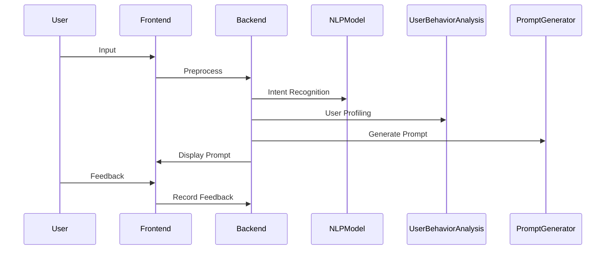

                 

## 文章标题

### 关键词：提示工程、自然语言接口、个性化、算法、系统设计

### 摘要：本文旨在深入探讨提示工程在自然语言接口个性化中的应用。通过阐述背景、核心概念、数学模型、系统设计及项目实战等，本文将帮助读者全面理解并掌握提示工程在个性化自然语言接口开发中的关键技术和最佳实践。

---

### 引言

在当今信息化时代，人工智能（AI）技术的迅猛发展，使得自然语言处理（NLP）技术成为研究热点。自然语言接口（NLI）作为一种重要的AI应用形式，已广泛应用于智能客服、智能推荐系统、智能语音助手等领域。个性化作为提升用户体验的关键因素，越来越受到关注。而提示工程（Prompt Engineering），作为一种精细化的自然语言接口设计技术，其在个性化应用中的重要性日益凸显。

本文将围绕以下主题进行探讨：

1. **问题背景与目标**：介绍自然语言接口及个性化需求，阐述提示工程在其中的作用。
2. **核心概念**：详细解释自然语言接口、提示工程和个性化等相关概念。
3. **概念联系与模型**：分析提示工程与自然语言处理、个性化与用户行为分析之间的联系。
4. **数学模型与算法原理**：讲解数学模型基础和算法原理。
5. **系统设计与实现**：介绍系统架构设计、接口设计与交互，并进行项目实战。
6. **最佳实践与总结**：总结最佳实践，展望未来发展方向。

### 问题背景与目标

自然语言接口（NLI）是人与机器之间进行自然语言交流的界面。其目标是让用户能够以自然的方式与机器进行交互，从而实现人机协作。随着AI技术的发展，自然语言接口的应用越来越广泛，如智能客服、智能推荐系统、智能语音助手等。然而，不同用户的需求和偏好存在差异，如何实现自然语言接口的个性化，成为当前研究的热点问题。

个性化（Personalization）是指根据用户的需求、兴趣和行为，为其提供定制化的服务或推荐。在自然语言接口中，个性化意味着根据用户的历史交互数据，为其提供更加符合其需求的语言交互服务。这种个性化的实现需要精细化的设计和技术支持，而提示工程（Prompt Engineering）正是一种能够实现这一目标的重要技术。

提示工程（Prompt Engineering）是一种针对自然语言接口进行设计的方法，旨在通过设计高质量的提示（Prompt）来引导用户的交互，从而提升用户体验。提示是用户与系统交互的起点，其设计质量直接影响用户的理解和响应效果。在个性化应用中，提示工程通过分析用户数据，生成个性化的提示，帮助用户更快地理解系统功能，并做出更好的决策。

本文的目标是深入探讨提示工程在自然语言接口个性化中的应用，包括其核心概念、数学模型、算法原理、系统设计以及项目实战等方面的内容。通过本文的阅读，读者将能够全面了解提示工程在个性化自然语言接口开发中的应用，掌握相关技术和最佳实践。

### 核心概念

在深入探讨提示工程在自然语言接口个性化中的应用之前，我们需要明确几个核心概念：自然语言接口、提示工程和个性化。

#### 自然语言接口（Natural Language Interface, NLI）

自然语言接口（NLI）是指用户与计算机系统之间通过自然语言（如日常用语、专业术语等）进行交互的界面。其核心目标是让用户能够以自然、直观的方式与机器进行交流，从而实现人机协作。自然语言接口的应用场景非常广泛，包括但不限于智能客服、智能推荐系统、智能语音助手、智能写作助手等。

自然语言接口的发展经历了几个关键阶段。早期的研究主要集中在基于规则的方法，如关键词匹配和语法分析等。这些方法虽然简单有效，但存在表达能力和灵活性的限制。随着人工智能技术的发展，特别是深度学习算法的引入，基于统计和神经网络的NLP技术逐渐成为主流。这些技术能够处理更加复杂和灵活的自然语言交互，从而提升了自然语言接口的性能和用户体验。

自然语言接口的挑战主要包括以下几点：

1. **语义理解**：自然语言表达形式多样，用户的语言输入可能包含歧义、省略、错别字等，如何准确理解用户意图是NLI面临的主要挑战。
2. **上下文感知**：自然语言交互通常需要依赖上下文信息，如何有效地处理和利用上下文信息，以提升交互的连贯性和准确性，是NLI需要解决的问题。
3. **个性化**：不同用户的需求和偏好不同，如何根据用户的历史交互数据，实现个性化服务，是NLI需要考虑的重要问题。

#### 提示工程（Prompt Engineering）

提示工程（Prompt Engineering）是一种针对自然语言接口进行设计的方法，旨在通过设计高质量的提示（Prompt）来引导用户的交互，从而提升用户体验。提示是用户与系统交互的起点，其设计质量直接影响用户的理解和响应效果。

提示工程的核心概念包括：

1. **提示定义**：提示是一种引导用户输入或行为的引导语或问题。一个好的提示应该简洁、明确、具有启发性，能够有效地引导用户输入。
2. **提示类型**：根据用途和目的，提示可以分为多种类型，如确认型提示、引导型提示、决策型提示等。
3. **提示设计原则**：提示设计需要遵循一些基本原则，如简洁性、明确性、启发性、灵活性等。

提示工程在自然语言接口中的应用主要包括以下几个方面：

1. **交互引导**：通过设计高质量的提示，引导用户进行有效的交互，帮助用户更好地理解系统功能和操作流程。
2. **意图识别**：通过提示工程，系统可以更准确地识别用户的意图，从而提供更符合用户需求的响应。
3. **上下文管理**：提示工程可以帮助系统更好地处理和利用上下文信息，提升交互的连贯性和准确性。
4. **个性化**：通过分析用户历史交互数据，生成个性化的提示，为用户提供定制化的服务。

#### 个性化（Personalization）

个性化是指根据用户的需求、兴趣和行为，为其提供定制化的服务或推荐。在自然语言接口中，个性化意味着根据用户的历史交互数据，为其提供更加符合其需求的语言交互服务。这种个性化的实现需要精细化的设计和技术支持，而提示工程正是实现这一目标的重要手段。

个性化的核心概念包括：

1. **用户画像**：用户画像是对用户特征和行为数据的综合描述，包括用户的基本信息、兴趣偏好、行为记录等。
2. **个性化推荐**：个性化推荐是根据用户画像和交互历史，为用户推荐其可能感兴趣的内容或服务。
3. **个性化交互**：个性化交互是指根据用户画像和交互历史，设计个性化的提示和交互流程，提升用户的体验和满意度。

#### 提示工程与自然语言接口个性化的关系

提示工程与自然语言接口个性化密切相关。提示工程通过设计高质量的提示，引导用户进行有效的交互，从而实现个性化服务。具体来说，提示工程在自然语言接口个性化中的应用主要体现在以下几个方面：

1. **意图识别**：通过设计针对性的提示，帮助系统更好地识别用户的意图，从而提供个性化的响应。
2. **上下文管理**：通过设计灵活的提示，系统可以更好地处理和利用上下文信息，实现上下文感知的个性化交互。
3. **用户引导**：通过设计引导性提示，系统可以引导用户按照预定的交互流程进行操作，从而提升用户体验。
4. **反馈机制**：通过设计反馈性提示，系统可以收集用户的反馈信息，用于进一步优化提示设计和个性化服务。

总之，提示工程是自然语言接口个性化实现的重要手段，通过精细化的设计和优化，可以提升自然语言接口的交互质量和用户体验。在接下来的章节中，我们将进一步探讨提示工程的具体原理、算法模型以及系统设计等方面的内容。

### 概念联系与模型

在深入探讨提示工程与自然语言接口个性化的关系时，我们需要将提示工程与自然语言处理（NLP）、个性化与用户行为分析等概念联系起来，形成一个完整的知识体系。

#### 提示工程与自然语言处理（NLP）的关系

提示工程与自然语言处理（NLP）密切相关。NLP是研究如何让计算机理解和生成自然语言的技术，而提示工程则是利用NLP技术，通过设计高质量的提示来引导用户交互。具体来说，提示工程与NLP的关系可以从以下几个方面来理解：

1. **意图识别**：自然语言接口需要理解用户的输入意图，而意图识别是NLP的一个重要任务。提示工程通过设计针对性的提示，可以帮助系统更准确地识别用户的意图。例如，通过设计多轮对话提示，系统可以逐步引导用户明确其需求。
2. **上下文感知**：自然语言交互通常依赖于上下文信息。NLP技术可以帮助系统理解和利用上下文信息，实现上下文感知的交互。提示工程通过设计灵活的提示，可以引导用户提供更多的上下文信息，从而提升交互的连贯性和准确性。
3. **语言生成**：NLP还包括文本生成任务，提示工程可以利用这一技术生成高质量的提示，提高用户的理解和响应效果。例如，在智能客服场景中，系统可以根据用户的历史交互数据和当前上下文，生成个性化的回答提示。

#### 个性化与用户行为分析的关系

个性化与用户行为分析密切相关。个性化是指根据用户的需求、兴趣和行为，为其提供定制化的服务或推荐。而用户行为分析则是通过对用户行为数据的收集和分析，了解用户的需求和偏好。具体来说，个性化与用户行为分析的关系可以从以下几个方面来理解：

1. **用户画像**：用户画像是对用户特征和行为数据的综合描述，是进行个性化服务的基础。用户行为分析可以帮助系统构建准确的用户画像，从而实现个性化的服务。提示工程可以通过分析用户画像，设计个性化的提示，引导用户进行更有效的交互。
2. **个性化推荐**：个性化推荐是根据用户画像和交互历史，为用户推荐其可能感兴趣的内容或服务。提示工程可以利用用户行为分析的结果，设计个性化的推荐提示，提升用户的参与度和满意度。
3. **交互优化**：通过用户行为分析，系统可以了解用户的偏好和行为模式，从而优化交互设计。提示工程可以通过分析用户行为，设计更加符合用户需求的提示，提升交互的顺畅度和用户体验。

#### 提示工程与自然语言处理、个性化与用户行为分析的融合

提示工程、自然语言处理、个性化与用户行为分析之间并不是孤立的，而是相互融合、相互促进的。具体来说，这种融合可以体现在以下几个方面：

1. **多轮对话设计**：通过结合自然语言处理和用户行为分析，提示工程可以设计出多轮对话策略，引导用户逐步明确其需求，并提供个性化的服务。例如，在智能客服场景中，系统可以通过多轮对话，逐步了解用户的问题和需求，从而提供更加精准的解决方案。
2. **动态提示生成**：基于用户行为分析和自然语言处理技术，提示工程可以动态生成个性化的提示，以适应不同用户的交互需求。例如，在智能推荐系统场景中，系统可以根据用户的历史行为和当前上下文，生成个性化的推荐提示，引导用户发现其可能感兴趣的内容。
3. **反馈优化循环**：通过用户行为分析和反馈机制，提示工程可以不断优化和调整提示设计，提升用户的交互体验。例如，在个性化写作助手场景中，系统可以根据用户的反馈，调整写作风格和提示内容，从而更好地满足用户的需求。

综上所述，提示工程与自然语言处理、个性化与用户行为分析之间存在密切的联系和融合。通过合理应用这些概念和技术，可以实现更加高效、智能和个性化的自然语言接口。在接下来的章节中，我们将进一步探讨具体的数学模型和算法原理，为读者提供更加深入的技术指导。

### 数学模型与算法原理

在自然语言接口个性化中，提示工程的核心在于通过精确的数学模型和算法设计，生成高质量的提示，以实现用户需求的准确识别和个性化响应。本章节将详细讲解数学模型的基础、算法原理及其实现。

#### 数学模型基础

在自然语言处理和提示工程中，常用的数学模型包括信息论、概率论和最优化理论。以下将简要介绍这些基础理论：

1. **信息论**：信息论是研究信息传递和处理规律的学科。在提示工程中，信息论可以帮助我们理解如何通过最小化信息熵来优化提示设计。信息熵是一个度量信息不确定性的指标，其基本公式为：

   $$
   H(X) = -\sum_{i} p(x_i) \log_2 p(x_i)
   $$

   其中，$H(X)$表示随机变量$X$的信息熵，$p(x_i)$表示$x_i$发生的概率。

2. **概率论**：概率论是研究随机事件及其概率的数学分支。在提示工程中，概率论用于处理用户行为数据的概率分布，通过概率模型进行用户意图的推断。贝叶斯定理是一个重要的概率模型，其公式为：

   $$
   P(A|B) = \frac{P(B|A)P(A)}{P(B)}
   $$

   其中，$P(A|B)$表示在事件$B$发生的条件下，事件$A$发生的概率。

3. **最优化理论**：最优化理论是研究如何找到最优解的数学分支。在提示工程中，最优化理论用于优化提示设计和参数调整，以实现最佳的用户体验。常见的最优化算法包括线性规划、非线性规划和启发式搜索等。

#### 算法原理讲解

在提示工程中，常用的算法原理包括基于规则的算法、基于机器学习的算法和基于深度学习的算法。以下将分别介绍这些算法的基本原理和实现步骤。

1. **基于规则的算法**：基于规则的算法通过预定义的规则集，对用户输入进行匹配和响应。其基本步骤如下：

   - **规则库构建**：根据业务需求和用户行为数据，构建包含各类规则的规则库。
   - **规则匹配**：将用户输入与规则库中的规则进行匹配，找到最匹配的规则。
   - **响应生成**：根据匹配到的规则，生成相应的提示或响应。

   基于规则的算法实现简单，但存在表达能力和灵活性的限制，难以处理复杂和多样的用户输入。

2. **基于机器学习的算法**：基于机器学习的算法通过训练模型，自动学习用户输入和响应之间的关系，从而生成高质量的提示。其基本步骤如下：

   - **数据收集**：收集用户交互数据，包括输入文本、用户行为和系统响应等。
   - **特征提取**：从输入文本和用户行为中提取特征，如词向量、TF-IDF等。
   - **模型训练**：使用机器学习算法（如决策树、支持向量机、朴素贝叶斯等），训练模型以预测用户意图。
   - **提示生成**：根据训练好的模型，生成个性化的提示。

   基于机器学习的算法具有较好的表达能力和泛化能力，但需要大量的训练数据和计算资源。

3. **基于深度学习的算法**：基于深度学习的算法通过构建神经网络模型，对用户输入进行端到端的学习和预测。其基本步骤如下：

   - **模型架构设计**：设计适合提示工程的深度学习模型架构，如循环神经网络（RNN）、长短期记忆网络（LSTM）、变换器（Transformer）等。
   - **数据预处理**：对用户输入进行预处理，如分词、去停用词等。
   - **模型训练**：使用大量用户交互数据，训练深度学习模型。
   - **提示生成**：将用户输入输入到训练好的模型中，生成个性化的提示。

   基于深度学习的算法具有强大的表达能力和处理能力，但训练过程复杂，需要大量的计算资源和时间。

#### 举例说明

为了更好地理解算法原理，我们通过一个简单的例子进行说明。

假设用户输入：“今天天气怎么样？”系统需要生成一个个性化的天气提示。以下是一个基于机器学习的算法实现过程：

1. **数据收集**：收集大量用户关于天气查询的交互数据，包括输入文本、用户位置和天气信息等。
2. **特征提取**：从输入文本和用户位置中提取特征，如词向量、位置编码等。
3. **模型训练**：使用训练数据，训练一个基于Transformer的深度学习模型，以预测用户意图和生成天气提示。
4. **提示生成**：用户输入“今天天气怎么样？”后，模型根据用户位置和输入文本，生成个性化的天气提示，如“您所在的城市，今天晴天，最高温度25摄氏度”。

通过这个例子，我们可以看到如何利用数学模型和算法，实现自然语言接口的个性化提示生成。在接下来的章节中，我们将进一步探讨具体的系统设计和实现过程。

### 系统设计与实现

在深入探讨提示工程在自然语言接口个性化中的应用时，系统设计与实现是关键环节。本章节将详细讨论系统设计、接口设计与交互，并通过一个实际项目展示其具体实现过程。

#### 系统介绍

本系统旨在实现一个基于提示工程的个性化自然语言接口，能够根据用户的历史交互数据和实时输入，生成高质量的个性化提示。系统主要功能包括用户交互处理、提示生成、用户行为分析等。

#### 系统功能设计

系统的功能设计可以从用户交互、提示生成和用户行为分析三个方面来考虑。

1. **用户交互处理**：用户交互处理模块负责接收用户的输入，并根据输入类型（如文本、语音等）进行预处理。该模块需要支持多轮对话，以便获取更多上下文信息，从而提高提示的准确性。
2. **提示生成**：提示生成模块是系统的核心，负责根据用户交互数据和预设的提示规则，生成个性化的提示。该模块需要结合自然语言处理（NLP）和机器学习（ML）技术，实现高效的提示生成。
3. **用户行为分析**：用户行为分析模块负责收集和分析用户的历史交互数据，构建用户画像。该模块为提示生成提供依据，帮助系统更好地理解用户需求和偏好。

#### 系统架构设计

系统的架构设计应考虑到模块的独立性、可扩展性和性能优化。以下是一个简单的系统架构设计：

1. **前端界面**：负责与用户进行交互，接收用户输入，展示系统响应。
2. **后端服务**：包括用户交互处理、提示生成和用户行为分析等核心模块，负责处理用户请求和生成提示。
3. **数据库**：存储用户交互数据、用户画像和系统配置等信息。
4. **外部接口**：包括第三方API、数据源等，用于扩展系统功能。

#### 系统接口设计与交互

系统接口设计与交互是系统实现的重要组成部分。以下是一个简单的接口设计和交互流程：

1. **用户输入**：用户通过前端界面输入文本或语音，前端将输入发送到后端服务。
2. **预处理**：后端服务对输入进行预处理，包括文本分词、去停用词、词向量编码等。
3. **意图识别**：后端服务利用机器学习模型，对预处理后的输入进行意图识别，确定用户的请求类型。
4. **提示生成**：后端服务根据用户意图和用户画像，生成个性化的提示，并发送回前端界面进行展示。
5. **用户反馈**：用户对系统生成的提示进行反馈，后端服务记录反馈信息，用于进一步优化系统。

以下是一个基于Mermaid的接口设计类图和交互序列图，用于直观展示系统接口设计和交互流程：

```mermaid
classDiagram
    User -> Frontend: Input
    Frontend -> Backend: Preprocess
    Backend -> NLPModel: Intent Recognition
    Backend -> UserBehaviorAnalysis: User Profiling
    Backend -> PromptGenerator: Generate Prompt
    Frontend <- Backend: Display Prompt
    User <- Frontend: Feedback

class User
class Frontend
class Backend
class NLPModel
class UserBehaviorAnalysis
class PromptGenerator

```



#### 项目实战

为了展示系统设计与实现的具体过程，以下将介绍一个实际项目：基于深度学习的个性化天气提示系统。

1. **环境安装与配置**

   - 安装Python 3.8及以上版本。
   - 安装必要的库，如TensorFlow、PyTorch、NLTK等。

2. **系统核心实现**

   - 用户交互处理模块：使用前端框架（如Flask或Django）搭建用户交互界面。
   - 提示生成模块：使用Transformer模型进行训练，生成个性化天气提示。
   - 用户行为分析模块：使用用户历史交互数据构建用户画像。

3. **代码应用解读与分析**

   - 用户交互处理代码：
     ```python
     from flask import Flask, request, jsonify

     app = Flask(__name__)

     @app.route('/weather', methods=['POST'])
     def handle_weather_request():
         user_input = request.json['input']
         # 进行预处理，如分词、词向量编码等
         # 进行意图识别
         # 根据用户意图和用户画像，生成天气提示
         response = generate_weather_prompt(user_input)
         return jsonify(response)

     if __name__ == '__main__':
         app.run()
     ```

   - 提示生成代码：
     ```python
     from transformers import AutoModelForSeq2SeqLM, AutoTokenizer

     model_name = 't5-small'
     model = AutoModelForSeq2SeqLM.from_pretrained(model_name)
     tokenizer = AutoTokenizer.from_pretrained(model_name)

     def generate_weather_prompt(input_text):
         # 预处理输入文本
         input_ids = tokenizer.encode(input_text, return_tensors='pt')
         # 使用模型生成提示
         outputs = model.generate(input_ids, max_length=50, num_return_sequences=1)
         # 解码输出文本
         prompt = tokenizer.decode(outputs[0], skip_special_tokens=True)
         return prompt
     ```

4. **实际案例分析与详细讲解剖析**

   - 案例一：用户输入“今天天气怎么样？”
     - 意图识别：确定用户请求类型为天气查询。
     - 用户画像：根据用户历史交互数据，确定用户偏好（如喜欢高温天气）。
     - 提示生成：生成个性化天气提示，如“今天晴天，最高温度28摄氏度，适合外出活动。”

   - 案例二：用户输入“明天会下雨吗？”
     - 意图识别：确定用户请求类型为天气预测。
     - 用户画像：根据用户历史交互数据，确定用户地理位置。
     - 提示生成：生成个性化天气提示，如“根据您所在地区，明天有30%的降雨概率，建议带伞。”

5. **项目小结**

   通过本项目，我们展示了如何设计和实现一个基于深度学习的个性化天气提示系统。系统结合了自然语言处理、机器学习和用户行为分析等技术，实现了高效的提示生成和个性化服务。在实际应用中，系统可以根据用户的需求和偏好，提供更加精准和个性化的天气信息，提升了用户体验。

### 最佳实践与总结

在自然语言接口个性化应用中，提示工程是一项关键技术。通过设计高质量的提示，系统能够更好地理解用户意图，提供个性化服务，从而提升用户体验。以下是几点最佳实践和注意事项：

#### 最佳实践

1. **数据驱动**：个性化服务需要大量的用户交互数据作为支撑。因此，建议在系统设计和实现过程中，注重用户数据的收集和分析，为提示工程提供准确的依据。
2. **动态调整**：提示设计应具备动态调整的能力，根据用户行为和交互历史，实时优化提示内容和风格，以适应不同用户的需求。
3. **多模态交互**：结合文本、语音、图像等多种模态，可以提供更加丰富和个性化的交互体验。例如，在智能客服场景中，可以结合文本和语音提示，提高交互的自然性和流畅性。
4. **用户体验**：在提示设计中，要注重用户体验，确保提示简洁明了、易于理解。通过用户反馈和测试，不断优化提示内容和交互流程。

#### 注意事项

1. **隐私保护**：在收集和分析用户数据时，应严格遵守隐私保护法律法规，确保用户数据的安全和隐私。
2. **避免过度个性化**：过度个性化可能导致用户体验下降。因此，在提示设计中，要平衡个性化与用户需求，避免过度依赖历史数据，影响当前交互。
3. **技术选型**：选择适合的算法和技术，确保系统的性能和可扩展性。例如，在提示生成中，可以结合基于规则的算法和机器学习算法，实现高效和灵活的提示设计。

#### 未来展望

随着人工智能技术的不断发展，提示工程在自然语言接口个性化中的应用前景广阔。未来，可以关注以下几个方面：

1. **多模态融合**：结合多种模态数据，实现更加智能化和个性化的交互体验。
2. **自适应学习**：开发自适应学习算法，根据用户实时反馈和交互历史，动态调整提示内容和交互策略。
3. **隐私保护**：研究更加安全的隐私保护技术，确保用户数据的安全和隐私。
4. **跨领域应用**：拓展提示工程的应用领域，如医疗、金融、教育等，实现更加广泛和深入的个性化服务。

总之，提示工程在自然语言接口个性化中具有重要作用。通过不断优化和改进，我们可以为用户提供更加优质、高效和个性化的服务。

### 拓展阅读

1. **《自然语言处理：综合方法与应用》**：由Christopher D. Manning和Heidi J. Brew完成，详细介绍了自然语言处理的基础理论和应用方法。
2. **《深度学习：原理与应用》**：由Ian Goodfellow、Yoshua Bengio和Aaron Courville著，全面介绍了深度学习的基本原理和应用技术。
3. **《用户行为分析与推荐系统》**：由Recommender Systems: The Textbook（组编），详细探讨了用户行为分析在推荐系统中的应用。
4. **《人机交互设计：理论与实践》**：由Jesse J. Fox和Jacob O. Wobbrock著，介绍了人机交互设计的基础理论和实践方法。

通过阅读这些书籍，读者可以进一步了解自然语言处理、深度学习、用户行为分析和人机交互设计等相关领域的知识，为提示工程在自然语言接口个性化中的应用提供更加深入的技术支持。

