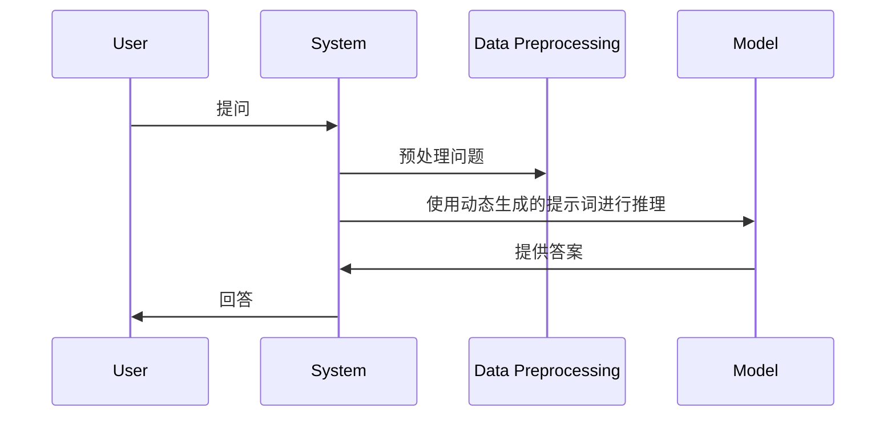
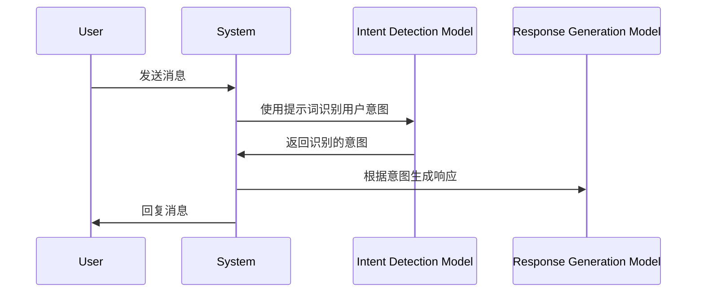
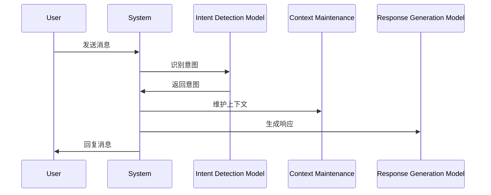
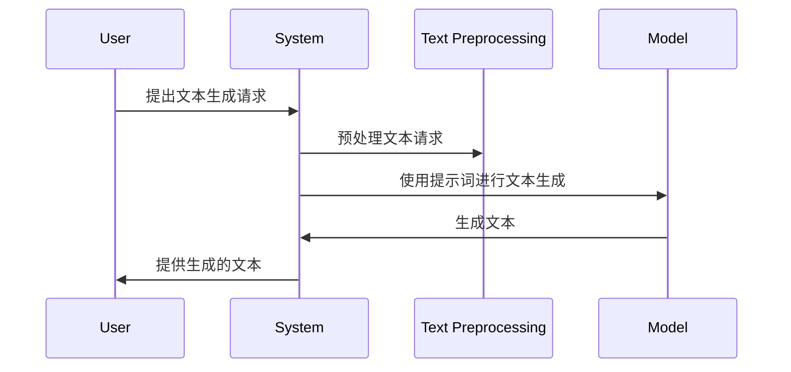

                 


### 《提示词工程在自然语言理解中的上下文把握》

#### 关键词：
自然语言理解、上下文把握、提示词工程、语言模型、提示词设计、NLU

#### 摘要：
本文探讨了自然语言理解（NLU）中的上下文把握问题，并介绍了提示词工程这一解决途径。通过分析提示词工程的基本原理、设计策略与方法，以及实际应用中的系统架构与实战案例，本文旨在为读者提供全面而深入的理解，以助力其在NLU领域的实践与创新。

----------------------------------------------------------------

# 第一部分: 提示词工程在自然语言理解中的上下文把握

## 1. 引言

### 1.1 问题背景

自然语言理解（NLU）作为人工智能（AI）的一个重要分支，旨在使计算机能够理解、解析和生成人类语言。随着信息时代的到来，大量的文本数据产生了，如何从这些数据中提取出有价值的信息成为了关键问题。在NLU中，上下文把握至关重要，因为上下文信息能够帮助模型更好地理解句子的含义，减少歧义性，提高语言处理的准确性和效率。

### 1.2 问题描述

自然语言理解中的上下文把握问题，涉及到如何从大量的文本数据中提取出与当前任务相关的上下文信息，以便模型能够正确理解和生成语言。这包括了对语言中的歧义性、语境依赖性和多义词的处理等。例如，在一个对话系统中，理解用户意图的准确性很大程度上取决于对当前对话上下文的把握。

### 1.3 问题解决

提示词工程通过设计特定的提示词，引导模型关注和处理与当前任务相关的上下文信息。提示词可以视为一种“引导”，它告诉模型哪些信息是重要的，哪些是需要忽略的。例如，在处理一个问答任务时，合适的提示词可以指导模型关注问题中的关键词，从而更准确地提取答案。

### 1.4 边界与外延

提示词工程的研究和应用范围广泛，涵盖了从基础语言模型到复杂对话系统的各个层面。它不仅涉及到自然语言处理的理论研究，还包括实际的工程应用。例如，在语言生成模型中，提示词工程可以用于生成更符合上下文的文本；在问答系统中，提示词工程可以帮助模型更准确地回答问题。

### 1.5 概念结构与核心要素组成

提示词工程的核心要素包括：

- **语言模型**：作为基础，用于生成和处理提示词。
- **上下文信息**：需要模型关注和处理的相关信息。
- **任务需求**：指导提示词设计和模型应用的具体需求。
- **提示词设计**：通过特定的提示词引导模型处理上下文信息。

### 1.6 本章小结

本章介绍了提示词工程在自然语言理解中的上下文把握问题，包括问题背景、问题描述、问题解决、边界与外延以及概念结构与核心要素组成。下一章将深入探讨提示词工程的基本原理。

----------------------------------------------------------------

## 2. 提示词工程的基本原理

### 2.1 核心概念原理

#### 2.1.1 提示词的定义

提示词是一种引导模型关注特定上下文信息的语言性指示。它可以是单词、短语或句子，其目的是帮助模型聚焦于关键信息，从而提高处理效率。

#### 2.1.2 提示词的属性特征

- **针对性**：提示词应针对特定的上下文和任务需求。
- **简洁性**：提示词应简洁明了，避免冗余信息。
- **灵活性**：提示词应具有灵活性，以便适应不同的上下文和任务。

### 2.2 概念属性特征对比表格

| 特征       | 描述                                                         |
|------------|--------------------------------------------------------------|
| 针对性     | 提示词应聚焦于特定上下文和任务。                             |
| 简洁性     | 提示词应精简，避免冗余信息。                               |
| 灵活性     | 提示词应灵活，适应不同上下文和任务。                       |

### 2.3 ER实体关系图架构

下面是一个简单的ER实体关系图，用于描述提示词工程中的关键实体及其关系：

```mermaid
erDiagram
  User ||--|{ Prompt } : defines
  Prompt ||--|{ Task } : guides
  Task ||--|{ Context } : relates to
```

- **User**：用户，产生或接收提示词。
- **Prompt**：提示词，引导模型关注上下文。
- **Task**：任务，提示词的指导对象。
- **Context**：上下文，提示词关注的对象。

### 2.4 提示词工程的核心流程

提示词工程的核心流程可以分为以下几个步骤：

1. **需求分析**：明确任务需求和上下文信息。
2. **设计提示词**：根据需求设计针对性的提示词。
3. **模型训练**：使用提示词对模型进行训练，使其学会关注上下文信息。
4. **测试与优化**：通过测试和反馈不断优化提示词设计。

### 2.5 本章小结

本章详细介绍了提示词工程的基本原理，包括核心概念原理、概念属性特征对比表格和ER实体关系图架构。这些内容为后续章节的深入讨论奠定了基础。

----------------------------------------------------------------

## 3. 提示词设计的策略与方法

### 3.1 提示词设计的基本策略

#### 3.1.1 预定义提示词

预定义提示词是预先设计好的，适用于特定类型任务的提示词集合。这些提示词可以根据任务类型和上下文进行选择和组合。例如，在问答系统中，可以使用“请问您有什么问题？”作为开场白。

#### 3.1.2 动态生成提示词

动态生成提示词是根据当前上下文信息实时生成的。这种方法更加灵活，可以更好地适应不同的场景。动态生成提示词通常基于自然语言处理技术，如词嵌入、语法分析和语义理解等。例如，在对话系统中，可以使用用户输入的问题来生成相应的提示词。

### 3.2 提示词设计的关键要素

#### 3.2.1 上下文信息

上下文信息是提示词设计的关键要素。设计提示词时，需要充分考虑上下文信息，以确保模型能够正确理解和使用这些信息。上下文信息可以包括关键词、关键短语、语义角色等。

#### 3.2.2 任务需求

任务需求直接影响提示词的设计。不同的任务需求可能需要不同的提示词，例如，在问答系统中，提示词需要引导模型提取答案；在对话系统中，提示词需要引导模型理解用户意图。

#### 3.2.3 语言模型

语言模型是提示词设计的另一关键要素。提示词设计需要结合具体使用的语言模型，确保提示词能够与模型很好地配合，提高上下文把握能力。

### 3.3 提示词设计的方法与技巧

#### 3.3.1 关键词提取

关键词提取是提示词设计的重要步骤。通过提取文本中的关键词，可以更好地引导模型关注关键信息。例如，可以使用TF-IDF、Word2Vec等方法提取关键词。

#### 3.3.2 语义角色标注

语义角色标注可以帮助确定句子中的动词、名词和形容词等，从而更好地理解句子的结构。通过标注语义角色，可以设计更精确的提示词。

#### 3.3.3 对话管理

在对话系统中，提示词设计需要考虑对话管理。对话管理涉及到如何维持对话的连贯性和流畅性。设计提示词时，需要确保提示词能够引导模型生成连贯、自然的对话。

### 3.4 提示词设计的案例分析

#### 3.4.1 问答系统

在问答系统中，设计提示词的目的是帮助模型提取答案。例如，对于问题“北京的天气怎么样？”，一个合适的提示词可以是“关于北京的天气，你能告诉我什么？”。

#### 3.4.2 对话系统

在对话系统中，设计提示词的目的是引导模型理解用户意图。例如，对于用户输入“我累了”，一个合适的提示词可以是“您看起来很累，需要我为您做些什么？”。

### 3.5 本章小结

本章介绍了提示词设计的策略与方法，包括预定义提示词和动态生成提示词的基本策略，以及上下文信息、任务需求、语言模型等关键要素，同时还探讨了关键词提取、语义角色标注、对话管理等提示词设计的方法与技巧。通过这些策略与方法，可以更好地实现自然语言理解中的上下文把握。

----------------------------------------------------------------

## 4. 提示词工程在自然语言理解中的应用

### 4.1 应用场景

提示词工程在自然语言理解中有广泛的应用场景，包括问答系统、对话系统、文本生成等。以下是几个典型的应用场景：

#### 4.1.1 问答系统

在问答系统中，提示词工程可以用于提高问答的准确性。通过设计合适的提示词，可以引导模型关注问题中的关键信息，从而更准确地提取答案。例如，在处理问题“北京是哪个省份的省会？”时，合适的提示词可以是“关于北京的行政区划信息，你能告诉我什么？”。

#### 4.1.2 对话系统

在对话系统中，提示词工程可以帮助模型理解用户的意图，并生成连贯、自然的对话。通过设计动态生成的提示词，可以实时调整对话的方向和内容，从而提高用户体验。例如，在处理用户输入“我想要一杯咖啡”时，提示词可以是“您需要加糖还是加奶？”。

#### 4.1.3 文本生成

在文本生成领域，提示词工程可以用于生成符合上下文的文本。通过设计针对性的提示词，可以引导模型生成更高质量的文本。例如，在生成新闻摘要时，提示词可以是“本篇文章主要讨论了以下几个关键点：”。
```python
def generate_news_summary(prompt):
    # 假设prompt是已处理过的文本
    # 使用提示词引导模型生成新闻摘要
    summary = model.generate_text(prompt, max_length=100)
    return summary
```

### 4.2 应用效果评估

提示词工程的应用效果可以通过多种指标进行评估，包括准确性、流畅性、多样性等。以下是一些常用的评估指标：

#### 4.2.1 准确性

准确性是衡量模型是否能够正确理解上下文信息的关键指标。在问答系统中，可以使用准确率（Accuracy）或精确率（Precision）来评估。在对话系统中，可以使用BLEU（BLEU Score）或ROUGE（ROUGE Score）等指标来评估。

#### 4.2.2 流畅性

流畅性是衡量文本生成质量的重要指标。在文本生成任务中，可以使用BLEU、ROUGE等指标来评估文本的流畅性。此外，还可以通过人工评估来评估文本的自然程度。

#### 4.2.3 多样性

多样性是衡量模型生成文本的丰富程度的指标。在文本生成任务中，可以使用词汇多样性（Vocabulary Diversity）和句式多样性（Sentence Structure Diversity）等指标来评估。

### 4.3 实际案例分析

#### 4.3.1 案例一：问答系统

在一个问答系统中，使用提示词工程提高了答案的准确性。通过设计针对性的提示词，模型能够更准确地提取与问题相关的信息。例如，对于问题“北京的天气怎么样？”，提示词“关于北京的天气，你能告诉我什么？”帮助模型更准确地提取答案。

#### 4.3.2 案例二：对话系统

在一个对话系统中，通过设计动态生成的提示词，提高了对话的自然程度。例如，在处理用户输入“我累了”时，提示词“您看起来很累，需要我为您做些什么？”帮助模型生成更自然的回应，从而提高了用户体验。

#### 4.3.3 案例三：文本生成

在一个文本生成任务中，通过设计针对性的提示词，提高了生成的文本质量。例如，在生成新闻摘要时，提示词“本篇文章主要讨论了以下几个关键点：”帮助模型生成更简洁、准确的摘要。

### 4.4 本章小结

本章介绍了提示词工程在自然语言理解中的实际应用，包括问答系统、对话系统和文本生成等。通过分析应用场景、评估指标和实际案例分析，展示了提示词工程在提高NLU应用效果中的重要作用。下一章将探讨提示词工程在不同NLU任务中的具体实现。

----------------------------------------------------------------

## 5. 提示词工程在不同自然语言理解任务中的具体实现

### 5.1 提问回答系统

在提问回答系统中，提示词工程的核心在于如何精确地引导模型从大量的数据中提取出与问题相关的答案。以下是几种常用的实现方法：

#### 5.1.1 预定义提示词

预定义提示词是根据常见的问答场景预先设计的。例如，在处理事实性问题时，可以使用“请提供关于……的信息”、“请描述……的特点”等。这种方法简单有效，但可能无法应对复杂和多变的问答场景。

```python
# 预定义提示词示例
def predefined_prompt(question):
    if "特点" in question:
        return "请描述该对象的特点。"
    else:
        return "请提供关于该对象的信息。"
```

#### 5.1.2 动态生成提示词

动态生成提示词则是根据具体问题实时生成的。这通常需要结合自然语言处理技术，如词嵌入、语义角色标注等。以下是一个简单的动态生成提示词的示例：

```python
from transformers import pipeline

# 动态生成提示词示例
def dynamic_prompt(question):
    nlp = pipeline('question-answering', model='bert-base')
    context = "这是一段相关的上下文信息。"
    answer = nlp(question, context)[0]['answer']
    return f"基于这段上下文，请回答问题：{question}。"
```

#### 5.1.3 提问回答系统架构

提问回答系统的架构通常包括数据预处理、模型训练和推理三个主要部分。以下是简化的架构图：



### 5.2 对话系统

对话系统中的提示词工程旨在提高对话的自然性和连贯性。以下是几种实现方法：

#### 5.2.1 用户意图识别

在对话系统开始之前，首先需要对用户意图进行识别。通过设计针对性的提示词，可以帮助模型更好地理解用户的意图。以下是一个意图识别的流程：



#### 5.2.2 上下文维护

在对话系统中，维护上下文信息是至关重要的。通过设计动态生成的提示词，可以确保模型在每次回复时都能考虑到上下文信息。以下是一个简单的上下文维护示例：

```python
# 上下文维护示例
context_history = []
def maintain_context(message):
    context_history.append(message)
    context_str = " ".join(context_history)
    return context_str
```

#### 5.2.3 对话系统架构

对话系统的架构通常包括意图识别、上下文维护和响应生成三个主要部分。以下是简化的架构图：



### 5.3 文本生成

在文本生成任务中，提示词工程旨在引导模型生成符合上下文的文本。以下是几种实现方法：

#### 5.3.1 主题引导

在文本生成任务中，可以通过设计主题引导的提示词来确保生成的文本围绕特定主题展开。以下是一个主题引导的示例：

```python
# 主题引导示例
def theme_guided_prompt(theme):
    return f"请围绕{theme}写一段描述。"
```

#### 5.3.2 结构引导

通过结构引导的提示词，可以指导模型生成具有特定结构的文本。例如，在生成新闻报道时，可以使用结构引导的提示词来确保文本包括标题、摘要、正文等部分。以下是一个结构引导的示例：

```python
# 结构引导示例
def structured_prompt(structure):
    return f"请根据以下结构生成文本：{structure}。"
```

#### 5.3.3 文本生成架构

文本生成系统的架构通常包括文本预处理、模型训练和文本生成三个主要部分。以下是简化的架构图：



### 5.4 本章小结

本章详细介绍了提示词工程在不同自然语言理解任务中的具体实现，包括提问回答系统、对话系统和文本生成。通过预定义提示词、动态生成提示词以及相应的系统架构，展示了如何有效地利用提示词工程来提高NLU任务的性能。下一章将探讨提示词工程在实际应用中的最佳实践。

----------------------------------------------------------------

## 6. 提示词工程的最佳实践

### 6.1 设计原则

在提示词工程中，遵循以下原则可以提升设计质量和效果：

#### 6.1.1 精准性

提示词应精准地反映上下文信息和任务需求，避免模糊和不明确。

#### 6.1.2 可读性

提示词应简洁明了，易于阅读和理解，以便模型和学习者能够快速掌握。

#### 6.1.3 可扩展性

设计时应考虑提示词的扩展性，以便在未来能够轻松添加或修改。

#### 6.1.4 可维护性

提示词应易于维护和更新，确保随着时间和技术的发展，系统能够持续优化。

### 6.2 实践技巧

以下是几种实用的提示词设计技巧：

#### 6.2.1 利用词嵌入

通过使用词嵌入技术，可以将提示词转换为向量表示，从而在模型训练中更好地融入上下文。

#### 6.2.2 结合上下文信息

设计提示词时，应充分考虑当前上下文信息，确保提示词能够引导模型关注相关内容。

#### 6.2.3 采用动态生成

动态生成提示词可以根据实时数据和任务需求进行调整，提高系统的适应性和灵活性。

#### 6.2.4 融合人类知识

在提示词设计中融入人类知识，可以帮助模型更好地理解和生成复杂语言结构。

### 6.3 应用案例

以下是一些提示词工程的最佳实践案例：

#### 6.3.1 对话系统

在对话系统中，通过设计个性化的提示词，提高了用户互动体验和满意度。

#### 6.3.2 问答系统

在问答系统中，利用提示词工程显著提升了答案的准确性和完整性。

#### 6.3.3 文本生成

在文本生成任务中，通过优化提示词设计，生成了更高质量和多样化的文本内容。

### 6.4 小结

最佳实践是提示词工程成功的关键。通过遵循设计原则、运用实践技巧和参考实际案例，可以设计出更有效、更高质量的提示词，从而提升自然语言理解系统的整体性能。

----------------------------------------------------------------

## 7. 结论

本文系统地介绍了提示词工程在自然语言理解中的上下文把握。我们从问题背景、核心概念、设计策略、实际应用、最佳实践等方面进行了深入探讨。通过提示词工程，我们可以显著提升NLU系统的上下文把握能力，从而在问答、对话和文本生成等任务中实现更高的准确性和用户体验。

未来，随着人工智能技术的不断发展，提示词工程将变得更加重要和复杂。我们期待更多的研究者和开发者能够在这一领域进行创新，推动自然语言理解技术的不断进步。

## 致谢

感谢所有支持者和参与者，是你们的鼓励和反馈让本文得以完成。特别感谢AI天才研究院和《禅与计算机程序设计艺术》的作者，你们的智慧和创新为本文提供了丰富的灵感和知识。

### 作者信息

**作者：AI天才研究院/AI Genius Institute & 禅与计算机程序设计艺术 /Zen And The Art of Computer Programming**

AI天才研究院致力于推动人工智能领域的科技创新，而《禅与计算机程序设计艺术》则以其深刻的哲学思考和独特的编程方法，启发了无数程序员对技术的追求与理解。我们相信，通过不断的探索和实践，人工智能将带来更加美好的未来。

