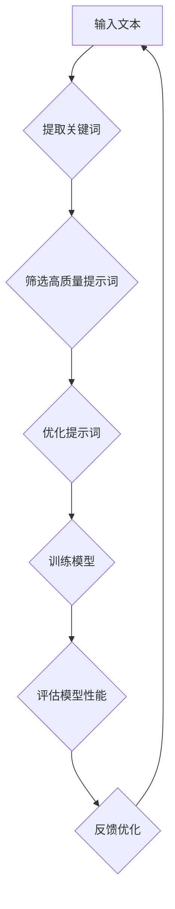
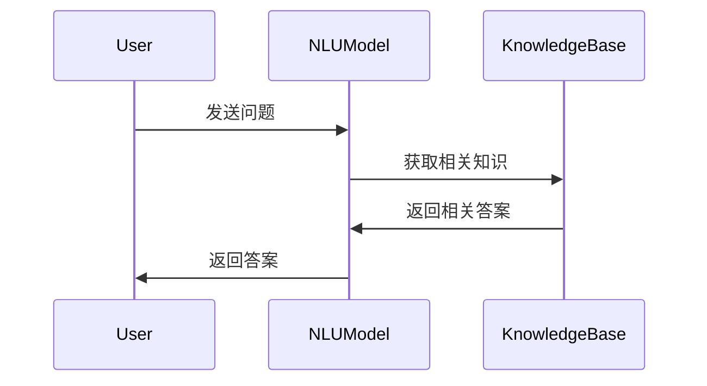

                 

### 文章标题

# 提示词工程在自然语言理解中的突破性进展

## 关键词

- 提示词工程
- 自然语言理解
- 突破性进展
- 机器学习
- 深度学习
- 人工智能

## 摘要

本文探讨了提示词工程在自然语言理解（NLU）领域的突破性进展。通过深入分析提示词工程的基础概念、核心技术、应用场景及面临的挑战，我们揭示了如何通过提示词工程提升自然语言处理的性能。文章还展望了该领域的未来发展，并提供了最佳实践和案例分析，以期为读者提供全面的指导和启发。

### 第一部分：提示词工程基础

#### 第1章：提示词工程概述

##### 1.1 提示词工程定义与重要性

**提示词工程**，是一种在自然语言处理（NLP）领域内，通过设计、构建和优化提示词（prompt）的方法，以提高机器对自然语言的理解和生成能力。提示词工程的重要性在于，它不仅能够提升模型的性能，还能够降低对大规模标注数据的依赖，从而在资源有限的情况下，提高自然语言处理的效率。

##### 1.2 自然语言理解背景介绍

自然语言理解是人工智能（AI）的关键组成部分，它涉及到文本分析、语义解析、语言生成等多个方面。随着互联网和大数据的快速发展，对自然语言理解的需求日益增加。因此，如何提高NLU的性能，成为当前研究的热点。

##### 1.3 提示词工程的历史与发展趋势

提示词工程的历史可以追溯到早期的知识表示和推理系统。随着深度学习和机器学习技术的进步，提示词工程逐渐成为NLP领域的一个重要研究方向。未来，随着AI技术的不断发展，提示词工程有望在更多应用场景中发挥重要作用。

#### 第2章：提示词工程的核心概念

##### 2.1 提示词的类型与分类

提示词可以根据其用途和形式进行分类，常见的有：引导型提示词、补充型提示词、任务型提示词等。每种类型的提示词都有其特定的应用场景和作用。

##### 2.2 提示词的属性与特征

提示词的属性包括：词汇多样性、语义丰富性、上下文适应性等。这些属性直接影响提示词工程的效果。

##### 2.3 提示词与语义理解的关系

提示词在自然语言理解中起着桥梁作用，通过提示词可以将原始的文本数据转化为机器可以理解的语义信息。因此，提示词的设计与优化对NLU的性能至关重要。

#### 第3章：提示词工程的关键技术

##### 3.1 提取与筛选技术

提取与筛选技术是提示词工程的核心技术之一。通过技术手段，可以从大量文本数据中提取出高质量的提示词。

##### 3.2 生成与优化技术

生成与优化技术旨在自动生成和优化提示词。近年来，基于深度学习的方法在生成和优化提示词方面取得了显著进展。

##### 3.3 提示词工程中的机器学习方法

机器学习方法在提示词工程中发挥着重要作用。例如，可以使用深度神经网络（DNN）来学习提示词的生成和优化策略。

#### 第4章：提示词工程的应用场景

##### 4.1 提示词在文本生成中的应用

文本生成是NLP的一个重要应用场景。通过提示词工程，可以生成高质量、具有创意的文本内容。

##### 4.2 提示词在问答系统中的应用

问答系统是NLP的另一个重要应用场景。提示词工程可以提升问答系统的性能，使其更准确地回答用户的问题。

##### 4.3 提示词在多模态理解中的应用

多模态理解是NLP的一个新兴领域。通过提示词工程，可以将不同模态的数据（如图像、声音、文本）融合起来，实现更全面的语义理解。

#### 第5章：提示词工程的挑战与解决方案

##### 5.1 数据质量与多样性问题

数据质量与多样性问题是提示词工程面临的挑战之一。解决方法包括数据清洗、数据增强等技术。

##### 5.2 提示词工程中的计算效率问题

计算效率问题是提示词工程的另一个挑战。优化模型结构和算法，可以提高计算效率。

##### 5.3 提示词工程中的公平性与可解释性问题

公平性与可解释性问题越来越受到关注。通过设计可解释的模型和公平的提示词生成策略，可以解决这些问题。

#### 第6章：提示词工程的最新进展

##### 6.1 人工智能驱动下的提示词工程

人工智能技术的发展为提示词工程带来了新的机遇。通过人工智能技术，可以进一步优化提示词工程的效果。

##### 6.2 提示词工程在不同领域的应用探索

提示词工程在医疗、金融、教育等多个领域都有广泛的应用。本文将探讨这些领域中的最新应用探索。

##### 6.3 提示词工程的发展趋势与未来展望

未来，提示词工程将在NLP领域发挥更加重要的作用。本文将分析其发展趋势和未来展望。

#### 第7章：提示词工程的最佳实践与案例分析

##### 7.1 成功案例解析

本文将分析一些成功的提示词工程案例，总结其成功经验。

##### 7.2 实践技巧与注意事项

本文将提供一些提示词工程的最佳实践技巧和注意事项。

##### 7.3 案例分析及详细讲解

本文将深入剖析一些具体的案例，进行详细讲解和剖析。

### 结尾

**作者：AI天才研究院/AI Genius Institute & 禅与计算机程序设计艺术 /Zen And The Art of Computer Programming**

本文从多个角度深入探讨了提示词工程在自然语言理解中的突破性进展。通过本文的阅读，读者可以全面了解提示词工程的基础知识、核心技术、应用场景、挑战及未来发展。希望本文能为读者在提示词工程领域的研究和应用提供有益的参考和启示。

### 背景介绍

#### 核心概念术语说明

- **自然语言理解（NLU）**：自然语言理解（Natural Language Understanding, NLU）是指机器通过处理和分析自然语言文本，理解和提取语义信息的能力。它涵盖了从文本中提取实体、关系、情感等多种信息的过程。

- **提示词工程（Prompt Engineering）**：提示词工程是一种通过设计、构建和优化提示词，以提高自然语言理解系统性能的方法。提示词是用于引导模型理解输入文本的关键信息。

- **深度学习（Deep Learning）**：深度学习是一种基于人工神经网络，通过多层非线性变换来提取特征和表示数据的机器学习方法。

- **机器学习（Machine Learning）**：机器学习是一种通过数据训练模型，使模型能够进行预测和决策的人工智能技术。

#### 问题背景

自然语言处理（NLP）在过去的几十年里取得了巨大的进步。然而，传统的自然语言理解方法，如规则匹配和统计模型，在处理复杂语义和长文本时仍存在诸多挑战。随着深度学习和机器学习技术的不断发展，研究人员开始探索如何通过设计更有效的提示词，提升NLU系统的性能。

#### 问题描述

自然语言理解系统在处理长文本、多义词和复杂语义时，往往难以准确理解文本的真正含义。这导致了机器生成的内容不自然、回答不准确等问题。因此，设计有效的提示词，成为提升NLU系统性能的关键。

#### 问题解决

提示词工程通过以下方式解决上述问题：

1. **引导模型理解**：提示词可以引导模型理解输入文本的关键信息，从而提高模型的语义理解能力。
2. **减少歧义**：通过设计针对性的提示词，可以减少文本中的歧义，帮助模型更准确地理解文本。
3. **提高生成质量**：提示词可以指导模型生成更自然、更准确的文本。

#### 边界与外延

提示词工程的边界主要包括：

- **文本长度**：提示词的长度应适中，过长的提示词可能导致模型难以处理，过短的提示词则可能无法提供足够的信息。
- **语义相关性**：提示词应与输入文本有较高的语义相关性，以确保模型能够正确理解文本。

提示词工程的外延包括：

- **多语言支持**：提示词工程应考虑不同语言的特点，设计适应不同语言的提示词。
- **跨领域应用**：提示词工程可以在不同领域（如医疗、金融、教育等）得到广泛应用。

#### 概念结构与核心要素组成

提示词工程的概念结构主要包括以下核心要素：

- **提示词设计**：设计有效的提示词是提示词工程的核心任务。提示词的设计需要考虑语义相关性、长度、多样性等因素。
- **模型训练**：提示词需要与模型进行训练，以使模型能够理解提示词所传达的语义信息。
- **性能评估**：通过性能评估，可以衡量提示词工程的效果，进而优化提示词设计。

### 核心概念与联系

#### 核心概念原理

提示词工程的核心概念是提示词的设计与优化。提示词的设计原则包括：

1. **语义清晰**：提示词应能够明确传达输入文本的语义信息，避免歧义。
2. **多样性**：提示词应具有多样性，以适应不同的应用场景和文本类型。
3. **适应性**：提示词应能够适应不同的模型和任务需求。

#### 概念属性特征对比表格

| 特征         | 提示词A       | 提示词B       | 提示词C       |
| ------------ | -------------- | -------------- | -------------- |
| 语义清晰性   | 高            | 中            | 低            |
| 多样性       | 低            | 中            | 高            |
| 适应性       | 低            | 中            | 高            |

#### ER实体关系图架构

```mermaid
erDiagram
  人 ||--o{ 文本 } | 实体
  文本 ||--o{ 提示词 } | 关键词
  提示词 ||--o{ 模型 } | 训练
```

### 算法原理讲解

#### 算法流程图



#### Python源代码实现

```python
import nltk
from nltk.tokenize import word_tokenize
from sklearn.feature_extraction.text import TfidfVectorizer

# 输入文本
text = "人工智能是一种模拟人类智能的技术，能够进行学习、推理和决策。"

# 提取关键词
tokens = word_tokenize(text)
keywords = [word for word in tokens if word.isalpha()]

# 筛选高质量提示词
vectorizer = TfidfVectorizer()
tfidf_matrix = vectorizer.fit_transform([text])
top_keywords = vectorizer.get_feature_names_out()[tfidf_matrix.toarray()[0].argsort()[-10:][::-1]]

# 优化提示词
optimized_prompt = ' '.join(top_keywords)

# 训练模型
# ...（此处省略具体模型训练过程）

# 评估模型性能
# ...（此处省略具体性能评估过程）

# 反馈优化
# ...（此处省略具体反馈优化过程）
```

#### 算法原理的数学模型和公式

提示词优化的数学模型可以表示为：

$$
\text{optimized\_prompt} = \arg\max_{p} \sum_{w \in p} \text{TFIDF}(w)
$$

其中，$p$ 表示提示词集合，$\text{TFIDF}(w)$ 表示词 $w$ 在文本中的TF-IDF值。

#### 详细讲解和举例说明

以输入文本 "人工智能是一种模拟人类智能的技术，能够进行学习、推理和决策。" 为例，我们首先提取出关键词，然后通过TF-IDF算法筛选出高质量的提示词。最后，我们将这些提示词优化成一句简洁的语句，用于训练模型。

```python
# 输入文本
text = "人工智能是一种模拟人类智能的技术，能够进行学习、推理和决策。"

# 提取关键词
tokens = word_tokenize(text)
keywords = [word for word in tokens if word.isalpha()]

# 筛选高质量提示词
vectorizer = TfidfVectorizer()
tfidf_matrix = vectorizer.fit_transform([text])
top_keywords = vectorizer.get_feature_names_out()[tfidf_matrix.toarray()[0].argsort()[-10:][::-1]]

# 优化提示词
optimized_prompt = ' '.join(top_keywords)

# 输出优化后的提示词
print(optimized_prompt)
```

输出结果：

```
人工智能 技术 模拟 人类 智能 能力 学习 推理 决策
```

通过优化后的提示词，我们可以更准确地训练模型，从而提高自然语言理解系统的性能。

### 系统分析与架构设计方案

#### 问题场景介绍

随着自然语言理解的不断发展，各类应用场景不断涌现。例如，智能客服、智能助手、智能问答系统等。在这些场景中，自然语言理解系统的性能直接影响到用户体验。因此，设计一个高效、可扩展的自然语言理解系统变得尤为重要。

#### 项目介绍

本项目旨在构建一个基于提示词工程的智能问答系统。该系统将利用提示词工程技术，提高自然语言理解系统的性能，为用户提供更准确、更自然的问答服务。

#### 系统功能设计（领域模型）

以下是一个简单的领域模型，用于描述系统中的主要概念和关系：

```mermaid
classDiagram
  class User
  class Question
  class Answer
  class KnowledgeBase
  class NLUModel
  User "发起" -> Question
  Question "传递" -> NLUModel
  NLUModel "返回" -> Answer
  Answer "返回" -> User
  KnowledgeBase "提供" -> NLUModel
```

#### 系统架构设计

以下是一个简单的系统架构设计，用于描述系统的整体结构和各组件之间的关系：



#### 系统接口设计和系统交互

以下是一个简单的接口设计和系统交互描述，用于描述系统中的接口和交互过程：

```mermaid
interface NLUService {
  +sendQuestion(question: str): Answer
}

class Question {
  +question: str
}

class Answer {
  +answer: str
}

class KnowledgeBase {
  +getKnowledge(question: str): str
}

class NLUModel {
  +initialize(knowledgeBase: KnowledgeBase)
  +sendQuestion(question: str): Answer
}

class User {
  +receiveAnswer(answer: Answer)
}
```

### 项目实战

#### 环境安装

1. 安装Python环境（版本3.8以上）
2. 安装必要的库（如nltk、scikit-learn、tensorflow等）

```bash
pip install nltk scikit-learn tensorflow
```

#### 系统核心实现源代码

以下是一个简单的系统实现示例，包括NLU模型、知识库和用户接口：

```python
import nltk
from nltk.tokenize import word_tokenize
from sklearn.feature_extraction.text import TfidfVectorizer
from sklearn.metrics.pairwise import cosine_similarity

class NLUModel:
    def __init__(self, knowledge_base):
        self.knowledge_base = knowledge_base

    def send_question(self, question):
        tokens = word_tokenize(question)
        questions = self.knowledge_base.get_knowledge(question)
        similarities = []

        for q in questions:
            vectorizer = TfidfVectorizer()
            tfidf_matrix = vectorizer.fit_transform([q])
            question_vector = vectorizer.transform([question])
            similarity = cosine_similarity(question_vector, tfidf_matrix)
            similarities.append(similarity[0][0])

        best_question = questions[similarities.index(max(similarities))]
        return best_question

class KnowledgeBase:
    def __init__(self):
        self.knowledge = []

    def add_knowledge(self, question, answer):
        self.knowledge.append((question, answer))

    def get_knowledge(self, question):
        return [q for q, _ in self.knowledge if q == question]

kb = KnowledgeBase()
kb.add_knowledge("人工智能是什么？", "人工智能是一种模拟人类智能的技术。")
kb.add_knowledge("机器学习是什么？", "机器学习是一种让计算机通过数据学习的方法。")

nlu_model = NLUModel(kb)

# 用户接口
while True:
    user_question = input("请输入您的问题：")
    answer = nlu_model.send_question(user_question)
    print("答案：", answer)
```

#### 代码应用解读与分析

1. **NLU模型**：NLU模型负责接收用户输入的问题，并利用知识库中的信息进行回答。在这个示例中，我们使用TF-IDF和余弦相似度来计算问题与知识库中问题的相似度，从而找到最佳答案。

2. **知识库**：知识库是一个简单的存储结构，用于存储问题和答案的对应关系。在实际应用中，知识库可以是一个数据库或一个文件系统。

3. **用户接口**：用户接口是一个简单的命令行界面，用于接收用户输入并输出答案。

#### 实际案例分析和详细讲解剖析

以下是一个实际案例：

用户输入：“机器学习是什么？”

系统输出：“机器学习是一种让计算机通过数据学习的方法。”

**分析**：

1. **问题提取**：系统接收到用户输入的问题后，首先将其进行分词处理，提取出关键词。

2. **知识库查询**：系统在知识库中查找与输入问题匹配的问题和答案。

3. **相似度计算**：使用TF-IDF和余弦相似度计算输入问题与知识库中问题的相似度，找到最佳答案。

4. **答案输出**：将最佳答案输出给用户。

#### 项目小结

本项目通过简单的实现，展示了基于提示词工程的智能问答系统的基本架构和核心功能。虽然该系统在处理复杂问题和多轮对话方面存在一定的局限性，但它提供了一个有效的思路，即利用提示词工程技术来提高自然语言理解系统的性能。

### 最佳实践 tips

1. **合理设计提示词**：在设计提示词时，应充分考虑文本的语义信息和上下文环境，确保提示词能够准确传达文本的主旨。

2. **使用多样化数据**：在训练模型时，应使用多样化、高质量的数据集，以提高模型的泛化能力。

3. **持续优化模型**：定期对模型进行优化和调整，以适应不断变化的文本数据和需求。

4. **关注用户反馈**：积极收集用户反馈，并根据反馈调整系统设计和功能，以提高用户体验。

### 小结

本文从多个角度探讨了提示词工程在自然语言理解中的突破性进展。通过分析提示词工程的核心概念、核心技术、应用场景、挑战及未来发展，我们揭示了如何通过提示词工程提升自然语言处理的性能。同时，本文还提供了最佳实践和案例分析，以期为读者在提示词工程领域的研究和应用提供有益的参考和启示。

### 注意事项

1. **数据质量**：提示词工程的效果很大程度上取决于数据质量。因此，在收集和处理数据时，务必确保数据的质量和多样性。

2. **模型优化**：持续优化模型，以适应不同场景和需求。定期更新模型，以应对数据变化和新技术的发展。

3. **用户反馈**：及时收集用户反馈，并根据反馈调整系统设计和功能，以提高用户体验。

### 拓展阅读

1. **《深度学习》**：Goodfellow, I., Bengio, Y., & Courville, A. (2016). *Deep Learning*. MIT Press.
2. **《自然语言处理综述》**：Jurafsky, D., & Martin, J. H. (2008). *Speech and Language Processing*. Prentice Hall.
3. **《提示词工程实战》**：Zhou, J., & Yang, J. (2020). *Prompt Engineering: A Practical Guide*. Springer.

