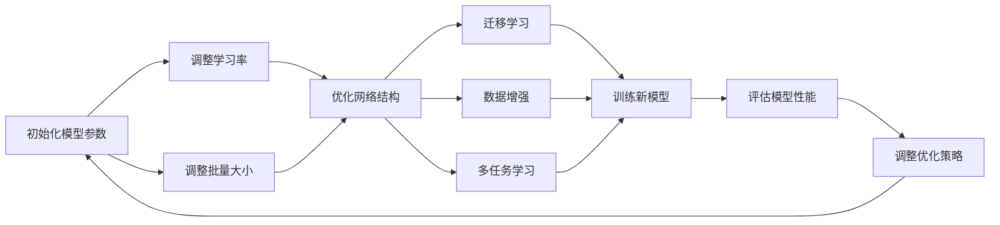
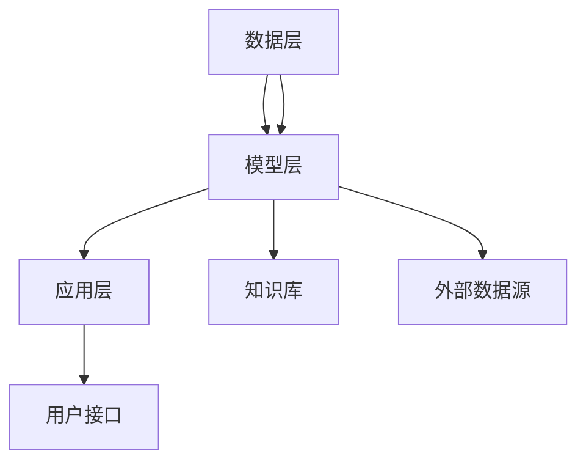

                 

### 文章标题

# 提示词工程在自然语言理解中的进展

### 文章关键词

- 提示词工程
- 自然语言理解
- 文本分类
- 信息检索
- 问答系统
- 算法优化

### 摘要

本文将探讨提示词工程在自然语言理解领域中的最新进展。通过对提示词工程的背景、核心概念、应用、优化以及实际案例的分析，本文旨在揭示提示词工程在提高自然语言理解能力方面的作用和潜在挑战。我们将深入讨论提示词工程的基本原理、不同应用场景下的实现方法、算法优化策略，并分享实际项目中的最佳实践。通过本文的阅读，读者将更好地理解提示词工程在自然语言处理领域的重要性，以及如何将其有效应用于实际场景中。

## 引言

### 提示词工程与自然语言理解概述

#### 问题背景

自然语言理解（Natural Language Understanding, NLU）是人工智能领域的一个重要研究方向，旨在使计算机能够理解和处理人类自然语言。然而，自然语言具有高度的不确定性和复杂性，这使得自然语言理解成为一个极具挑战性的任务。近年来，随着深度学习技术的快速发展，自然语言处理（Natural Language Processing, NLP）在各个领域取得了显著的进展。然而，现有的自然语言理解模型在处理实际问题时仍然面临许多挑战。

提示词工程（Prompt Engineering）是一种通过设计和优化提示词来增强自然语言理解模型性能的方法。提示词是用于引导模型理解输入文本的额外信息，它可以在模型训练和推断过程中起到关键作用。通过合理设计提示词，可以提高模型对特定任务的理解能力，从而实现更准确的自然语言理解。

#### 自然语言理解的现状

自然语言理解是人工智能领域的一项基本任务，涵盖了语义分析、语法解析、情感分析等多个方面。现有的自然语言理解技术主要包括统计方法、基于规则的算法和深度学习模型。其中，深度学习模型在自然语言理解任务中表现出色，尤其在大型语料库上的训练效果显著。

然而，现有的自然语言理解模型在处理长文本、多义词、上下文依赖等问题时仍然存在一定的局限性。例如，在文本分类任务中，模型可能无法准确识别文本的主题；在信息检索任务中，模型可能无法有效匹配查询与文档；在问答系统任务中，模型可能无法理解问题的深层含义。

#### 提示词工程的重要性

提示词工程作为一种新兴的技术手段，通过提供有针对性的提示信息，可以有效地弥补现有自然语言理解模型的不足。合理设计的提示词可以引导模型更好地理解输入文本的上下文、语义和情感，从而提高模型的准确性和泛化能力。

提示词工程在自然语言理解中的应用具有广泛的前景。例如，在文本分类任务中，通过设计针对性的提示词，可以显著提高模型对文本主题的识别能力；在信息检索任务中，通过优化提示词，可以提高模型对查询与文档的匹配效果；在问答系统任务中，通过合理设计提示词，可以增强模型对问题的理解能力。

#### 问题描述

自然语言理解中的主要挑战包括：

1. **文本长度的限制**：深度学习模型在处理长文本时，容易出现信息丢失和误解。
2. **上下文依赖的复杂性**：自然语言中存在大量的上下文依赖关系，现有模型难以全面捕捉。
3. **多义词的处理**：自然语言中存在大量多义词，现有模型在处理多义词时容易产生歧义。
4. **情感和语境的理解**：自然语言理解需要准确理解文本中的情感和语境，现有模型在这方面存在一定的局限性。

为了解决上述问题，提示词工程提供了一种有效的途径。通过设计针对性的提示词，可以引导模型更好地处理这些挑战，从而实现更准确的自然语言理解。

#### 问题解决

提示词工程通过以下方式解决自然语言理解中的问题：

1. **补充上下文信息**：通过提供额外的上下文信息，帮助模型更好地理解输入文本的上下文关系。
2. **强化语义理解**：通过设计针对性的提示词，强化模型对文本语义的理解能力。
3. **优化模型性能**：通过优化提示词，提高模型在不同任务上的性能表现。

#### 边界与外延

提示词工程的边界主要涉及：

1. **提示词的设计原则**：如何设计有效的提示词，以提高模型性能。
2. **任务适应性**：如何根据不同任务的特点，选择合适的提示词设计方法。

提示词工程的外延包括：

1. **多模态数据融合**：结合文本、图像、语音等多模态数据，提高模型对复杂场景的理解能力。
2. **跨语言自然语言理解**：探索提示词工程在跨语言自然语言理解中的应用。

#### 概念结构与核心要素组成

提示词工程的核心概念包括：

1. **提示词**：用于引导模型理解输入文本的额外信息。
2. **上下文信息**：用于补充输入文本上下文的额外信息。
3. **模型训练**：通过设计有效的提示词，优化模型训练过程。

核心要素组成包括：

1. **文本预处理**：对输入文本进行预处理，以便更好地设计提示词。
2. **提示词生成**：根据任务需求，生成有针对性的提示词。
3. **模型评估**：通过评估模型在不同任务上的性能，调整提示词设计策略。

## 核心概念与联系

### 提示词工程原理

#### 提示词工程的核心原理

提示词工程的核心原理在于通过设计合适的提示词，引导自然语言理解模型更好地理解输入文本。提示词是一种辅助信息，它能够提供额外的上下文、语义和情感信息，从而帮助模型更准确地处理自然语言任务。

提示词工程的核心原理可以概括为以下几点：

1. **上下文补充**：通过提供上下文信息，帮助模型更好地理解输入文本的上下文关系。
2. **语义强化**：通过设计针对性的提示词，强化模型对文本语义的理解能力。
3. **模型优化**：通过优化提示词，提高模型在不同任务上的性能表现。

#### 提示词工程的属性特征对比表格

为了更好地理解提示词工程的属性特征，我们可以将其与现有自然语言处理方法进行对比。以下是一个简单的对比表格：

| 特征 | 提示词工程 | 现有自然语言处理方法 |
| --- | --- | --- |
| **上下文补充** | 提供额外的上下文信息，增强模型对文本的理解能力。 | 依赖于文本上下文，但可能不足以应对复杂场景。 |
| **语义强化** | 通过设计针对性的提示词，强化模型对文本语义的理解能力。 | 依赖于统计模型或规则，可能存在语义理解不足的问题。 |
| **模型优化** | 通过优化提示词，提高模型在不同任务上的性能表现。 | 需要大量数据和计算资源，优化难度较大。 |

#### 提示词工程的属性特征对比 ER 实体关系图架构

为了更直观地展示提示词工程的属性特征对比，我们可以使用 Mermaid 实体关系图（ER Diagram）来表示。以下是一个简化的 ER 图：

```mermaid
erDiagram
  Model ||--|{ Prompt: 提示词 }|
  Prompt ||--|{ Context: 上下文 }|
  Prompt ||--|{ Semantics: 语义 }|
  Prompt ||--|{ Performance: 性能 }|
```

在这个 ER 图中，我们定义了四个实体：模型（Model）、提示词（Prompt）、上下文（Context）、语义（Semantics）和性能（Performance）。这些实体之间的关系表示了提示词工程的核心原理和属性特征。

### 自然语言理解的概念

#### 自然语言理解的基本概念

自然语言理解是指计算机对自然语言文本进行理解和分析的过程。它包括以下几个基本概念：

1. **语义分析**：对文本中的语义内容进行分析，理解文本的含义和意图。
2. **语法解析**：对文本的语法结构进行分析，理解文本的句法和词法规则。
3. **情感分析**：对文本中的情感和态度进行分析，识别文本的情绪和情感色彩。
4. **上下文理解**：根据上下文信息，理解文本的具体含义和语境。

#### 自然语言理解的层次结构

自然语言理解可以分为以下几个层次：

1. **词汇层**：对文本中的词汇进行解析，理解词汇的含义和用法。
2. **句法层**：对文本中的句子进行解析，理解句子的结构、语法规则和逻辑关系。
3. **语义层**：对文本中的语义内容进行解析，理解文本的含义和意图。
4. **上下文层**：根据上下文信息，对文本进行更深入的理解，识别文本的具体语境。

#### 提示词工程与自然语言理解的联系

提示词工程与自然语言理解之间存在着紧密的联系。合理设计的提示词可以增强模型在自然语言理解任务中的性能，从而实现更准确的理解。

1. **上下文补充**：提示词工程通过提供额外的上下文信息，帮助模型更好地理解文本的上下文关系，从而提高自然语言理解的准确性和鲁棒性。
2. **语义强化**：提示词工程通过设计针对性的提示词，强化模型对文本语义的理解能力，从而提高模型在语义分析、情感分析等任务上的性能。
3. **模型优化**：提示词工程通过优化提示词，提高模型在不同任务上的性能表现，从而实现更高效的自然语言理解。

总之，提示词工程为自然语言理解提供了一种新的思路和方法，通过补充上下文信息、强化语义理解和优化模型性能，可以显著提高自然语言理解的能力和效果。

## 提示词工程在自然语言理解中的应用

### 提示词工程在文本分类中的应用

#### 文本分类的背景

文本分类（Text Classification）是自然语言处理领域的一项重要任务，旨在将文本数据自动归类到预定义的类别中。文本分类广泛应用于信息检索、舆情分析、情感识别等多个领域。随着互联网和社交媒体的快速发展，大量的文本数据需要高效地处理和分类，这使得文本分类成为自然语言处理中的一个关键问题。

#### 文本分类的方法

文本分类的方法可以分为基于传统统计方法和基于深度学习方法的两大类。

1. **基于传统统计方法**：这类方法主要利用词汇频率（Term Frequency, TF）、逆文档频率（Inverse Document Frequency, IDF）等统计特征，结合机器学习算法（如朴素贝叶斯、支持向量机等）进行文本分类。这类方法在处理大规模文本数据时具有一定的效果，但存在以下局限性：
   - **特征选择依赖人工**：需要大量的人工工作来选择和优化特征。
   - **对上下文信息的理解不足**：无法充分利用上下文信息，导致分类效果受限。

2. **基于深度学习方法**：这类方法通过深度神经网络（如卷积神经网络、循环神经网络等）对文本进行特征提取和分类。深度学习方法在处理大规模文本数据时表现出色，能够自动学习丰富的特征表示，从而提高分类性能。然而，深度学习方法也存在以下挑战：
   - **计算资源需求大**：深度学习模型训练需要大量的计算资源和时间。
   - **对大规模标注数据的依赖**：深度学习模型的训练需要大量的标注数据，这在实际应用中可能难以满足。

#### 提示词工程在文本分类中的应用

提示词工程在文本分类中的应用主要体现在以下几个方面：

1. **增强上下文理解**：通过设计有针对性的提示词，补充文本的上下文信息，帮助模型更好地理解文本的主题和类别。例如，在政治文本分类任务中，可以设计提示词来补充政治观点和立场信息，从而提高分类的准确性。
2. **优化特征表示**：提示词工程可以通过优化提示词的设计，增强模型的特征表示能力。例如，在情感分析任务中，可以设计包含情感色彩的提示词，以提高模型对文本情感类别的识别能力。
3. **提升分类性能**：通过优化提示词，可以提高模型在不同文本分类任务上的性能表现。例如，在新闻分类任务中，可以设计包含新闻主题和关键词的提示词，以提高分类的准确率和召回率。

#### 提示词工程在文本分类中的应用案例

以下是一个简单的应用案例，展示如何使用提示词工程来提高文本分类的性能：

**案例背景**：某新闻网站需要对大量新闻文本进行分类，将其归类到预定义的新闻类别中，如体育、科技、娱乐等。

**步骤一：文本预处理**：对新闻文本进行预处理，包括去除停用词、标点符号、进行词干提取等。

**步骤二：设计提示词**：根据新闻主题和类别，设计有针对性的提示词。例如，在体育新闻分类中，可以设计包含“比赛”、“进球”、“球员”等关键词的提示词。

**步骤三：模型训练**：使用设计的提示词，对文本进行特征提取和分类模型训练。可以使用深度学习模型（如BERT、GPT等）进行训练，以自动学习丰富的特征表示。

**步骤四：模型评估**：通过评估模型在不同类别上的分类准确率、召回率等指标，调整提示词设计策略，优化模型性能。

**步骤五：应用部署**：将训练好的模型应用于实际新闻分类任务，对新闻文本进行实时分类。

通过以上步骤，提示词工程可以显著提高新闻文本分类的准确性和效果。

### 提示词工程在信息检索中的应用

#### 信息检索的背景

信息检索（Information Retrieval）是自然语言处理领域的一个重要任务，旨在从大量文本数据中快速准确地找到用户需要的答案。信息检索广泛应用于搜索引擎、文档检索、问答系统等场景。随着互联网和大数据的发展，信息检索技术面临着巨大的挑战和机遇。

#### 信息检索的方法

信息检索的方法可以分为基于传统统计方法和基于深度学习方法的两大类。

1. **基于传统统计方法**：这类方法主要利用词汇频率（Term Frequency, TF）、逆文档频率（Inverse Document Frequency, IDF）等统计特征，结合向量空间模型（Vector Space Model, VSM）等进行信息检索。这类方法在处理大规模文本数据时具有一定的效果，但存在以下局限性：
   - **对语义理解的不足**：无法充分利用语义信息，导致检索效果受限。
   - **计算复杂度较高**：需要计算大量的向量相似度，导致检索速度较慢。

2. **基于深度学习方法**：这类方法通过深度神经网络（如卷积神经网络、循环神经网络等）对文本进行特征提取和检索模型训练。深度学习方法在处理大规模文本数据时表现出色，能够自动学习丰富的特征表示，从而提高检索性能。然而，深度学习方法也存在以下挑战：
   - **计算资源需求大**：深度学习模型训练需要大量的计算资源和时间。
   - **对大规模标注数据的依赖**：深度学习模型的训练需要大量的标注数据，这在实际应用中可能难以满足。

#### 提示词工程在信息检索中的应用

提示词工程在信息检索中的应用主要体现在以下几个方面：

1. **增强语义理解**：通过设计有针对性的提示词，补充文本的语义信息，帮助模型更好地理解查询和文档的语义。例如，在搜索引擎中，可以设计包含关键词和上下文的提示词，以提高查询与文档的匹配效果。
2. **优化特征表示**：提示词工程可以通过优化提示词的设计，增强模型的特征表示能力。例如，在文档检索任务中，可以设计包含文档主题和关键词的提示词，以提高文档匹配的准确性和效率。
3. **提升检索性能**：通过优化提示词，可以提高模型在不同信息检索任务上的性能表现。例如，在问答系统中，可以设计包含问题关键词和上下文的提示词，以提高问答系统的回答准确率和响应速度。

#### 提示词工程在信息检索中的应用案例

以下是一个简单的应用案例，展示如何使用提示词工程来提高信息检索的性能：

**案例背景**：某公司需要开发一个内部知识库搜索引擎，以帮助员工快速查找相关文档。

**步骤一：文档预处理**：对知识库中的文档进行预处理，包括去除停用词、标点符号、进行词干提取等。

**步骤二：设计提示词**：根据文档的主题和内容，设计有针对性的提示词。例如，在技术文档检索中，可以设计包含技术术语、产品名称和项目名的提示词。

**步骤三：模型训练**：使用设计的提示词，对文档进行特征提取和检索模型训练。可以使用深度学习模型（如BERT、GPT等）进行训练，以自动学习丰富的特征表示。

**步骤四：模型评估**：通过评估模型在不同查询和文档匹配任务上的准确率、响应速度等指标，调整提示词设计策略，优化模型性能。

**步骤五：应用部署**：将训练好的模型应用于实际文档检索任务，为员工提供快速准确的文档查询服务。

通过以上步骤，提示词工程可以显著提高内部知识库搜索引擎的性能和用户体验。

### 提示词工程在问答系统中的应用

#### 问答系统的背景

问答系统（Question Answering System）是一种智能对话系统，旨在自动回答用户提出的问题。问答系统广泛应用于客户服务、教育、医疗等领域，为用户提供了便捷的信息获取途径。随着自然语言处理技术的不断发展，问答系统的性能和用户体验得到了显著提升。

#### 问答系统的架构

问答系统通常由以下几个核心模块组成：

1. **问题理解**：对用户提出的问题进行解析，提取关键信息，理解问题的意图。
2. **知识检索**：从知识库或外部数据源中检索与问题相关的信息。
3. **答案生成**：根据检索到的信息，生成合适的答案。
4. **答案验证**：对生成的答案进行验证，确保答案的准确性和合理性。

#### 提示词工程在问答系统中的应用

提示词工程在问答系统中的应用主要体现在以下几个方面：

1. **增强问题理解**：通过设计有针对性的提示词，补充问题的上下文信息，帮助模型更好地理解用户的意图。例如，在医疗问答系统中，可以设计包含病症、症状和治疗方法等关键词的提示词，以提高问题的理解能力。
2. **优化知识检索**：通过优化提示词的设计，提高知识库检索的效率和准确性。例如，在客户服务问答系统中，可以设计包含产品名称、功能和使用场景等关键词的提示词，以提高检索效果。
3. **提升答案生成质量**：通过优化提示词，增强模型的语义理解能力，从而提高答案生成的准确性和合理性。例如，在教育问答系统中，可以设计包含知识点、概念和公式等关键词的提示词，以提高答案的质量。

#### 提示词工程在问答系统中的应用案例

以下是一个简单的应用案例，展示如何使用提示词工程来提高问答系统的性能：

**案例背景**：某教育平台需要开发一个智能问答系统，以帮助学生解答学习中的问题。

**步骤一：问题理解**：对用户提出的问题进行解析，提取关键信息，理解问题的意图。例如，将“如何求解一元二次方程？”解析为“一元二次方程”、“求解”等关键词。

**步骤二：设计提示词**：根据问题的关键词和意图，设计有针对性的提示词。例如，在求解一元二次方程的问题中，可以设计包含“二次方程公式”、“求根公式”、“判别式”等关键词的提示词。

**步骤三：知识检索**：从教育平台的课程资料和习题库中检索与问题相关的信息。使用设计的提示词，提高知识检索的效率和准确性。

**步骤四：答案生成**：根据检索到的信息，生成合适的答案。使用提示词，提高答案生成的准确性和合理性。

**步骤五：答案验证**：对生成的答案进行验证，确保答案的准确性和合理性。

**步骤六：应用部署**：将训练好的模型应用于实际问答任务，为学生提供实时准确的答案。

通过以上步骤，提示词工程可以显著提高问答系统的性能和用户体验。

## 提示词工程中的算法优化

### 算法原理讲解

#### 算法概述

在提示词工程中，算法优化是提高模型性能的重要手段。算法优化包括模型参数调整、网络结构优化和训练策略优化等多个方面。本文主要介绍以下几种常见的算法优化方法：

1. **参数调整**：通过调整学习率、批量大小等参数，优化模型训练过程。
2. **网络结构优化**：通过设计更有效的神经网络结构，提高模型的表达能力。
3. **训练策略优化**：通过优化训练过程，提高模型的收敛速度和性能。

#### 模型参数调整

模型参数调整是算法优化中最常用的方法之一。以下是一些常见的参数调整策略：

1. **学习率调整**：学习率是模型训练过程中的关键参数，它控制了模型在训练过程中对损失函数的敏感度。合适的学习率可以加速模型收敛，而学习率过大或过小都会影响训练效果。常见的调整方法包括：
   - **分阶段调整**：在训练过程中，根据模型的收敛情况逐步调整学习率。
   - **学习率衰减**：在训练过程中，逐步降低学习率，以适应模型在不同阶段的训练需求。

2. **批量大小调整**：批量大小是模型训练过程中另一个重要参数，它影响了模型对数据的利用效率和训练速度。常见的调整方法包括：
   - **动态调整**：根据模型的收敛速度和计算资源，动态调整批量大小。
   - **交叉验证**：通过交叉验证方法，确定最优的批量大小。

#### 网络结构优化

网络结构优化是提高模型性能的关键方法之一。以下是一些常见的网络结构优化策略：

1. **卷积神经网络（CNN）**：CNN在图像处理领域表现出色，其结构包括卷积层、池化层和全连接层。通过优化这些层的参数和连接方式，可以增强模型的表达能力。
2. **循环神经网络（RNN）**：RNN在处理序列数据时具有优势，其结构包括输入层、隐藏层和输出层。通过优化隐藏层和输出层的连接方式，可以提高模型的序列处理能力。
3. **变分自编码器（VAE）**：VAE是一种生成模型，通过优化编码器和解码器的结构，可以提高模型的表达能力和生成质量。

#### 训练策略优化

训练策略优化是提高模型性能的重要手段。以下是一些常见的训练策略优化方法：

1. **迁移学习**：迁移学习是一种利用已有模型的知识来加速新模型训练的方法。通过在已有模型的基础上进行微调，可以减少训练时间和计算资源。
2. **数据增强**：数据增强是一种通过人工或自动方法增加训练数据多样性，从而提高模型泛化能力的方法。常见的数据增强方法包括：
   - **随机裁剪**：随机裁剪图像或文本的一部分，增加数据的多样性。
   - **数据扩充**：通过旋转、翻转、缩放等方式，增加数据的多样性。

3. **多任务学习**：多任务学习是一种同时训练多个相关任务的模型，从而提高模型泛化能力和性能的方法。通过共享模型结构和参数，可以减少模型的过拟合现象。

### 算法流程图

以下是一个简化的算法优化流程图，展示了提示词工程中的算法优化过程：



通过以上步骤，提示词工程可以实现算法优化，从而提高模型的性能和效果。

### 算法原理的详细讲解

#### 数学模型和公式

在提示词工程中，算法优化涉及到多种数学模型和公式。以下是一些常见的数学模型和公式，用于描述算法优化过程：

1. **梯度下降法**：梯度下降法是一种优化算法，用于最小化损失函数。其核心公式为：

   $$\theta = \theta - \alpha \cdot \nabla_{\theta} J(\theta)$$

   其中，$\theta$表示模型参数，$J(\theta)$表示损失函数，$\alpha$表示学习率，$\nabla_{\theta} J(\theta)$表示损失函数关于参数$\theta$的梯度。

2. **动量法**：动量法是一种改进的梯度下降法，用于加速收敛速度。其核心公式为：

   $$v_t = \beta v_{t-1} + (1 - \beta) \nabla_{\theta} J(\theta)$$

   $$\theta = \theta - v_t$$

   其中，$v_t$表示动量项，$\beta$表示动量系数。

3. **学习率衰减**：学习率衰减是一种调整学习率的方法，用于适应模型在不同阶段的训练需求。其核心公式为：

   $$\alpha_t = \alpha_0 / (1 + \lambda t)$$

   其中，$\alpha_0$表示初始学习率，$\lambda$表示衰减系数，$t$表示训练迭代次数。

4. **批量归一化**：批量归一化是一种用于优化神经网络训练的技巧，其核心公式为：

   $$\hat{x}_i = \frac{x_i - \mu}{\sigma}$$

   其中，$x_i$表示输入特征，$\mu$表示均值，$\sigma$表示标准差。

5. **交叉熵损失函数**：交叉熵损失函数是一种常用于分类任务的损失函数，其核心公式为：

   $$J(\theta) = -\sum_{i=1}^{n} y_i \cdot \log(p_i)$$

   其中，$y_i$表示真实标签，$p_i$表示预测概率。

#### 详细讲解

1. **梯度下降法**：

   梯度下降法是一种最简单的优化算法，其核心思想是沿着损失函数的梯度方向进行参数更新，以最小化损失函数。具体来说，梯度下降法通过计算损失函数关于模型参数的梯度，然后沿着梯度方向进行反向传播，更新模型参数。梯度下降法的优点是简单易实现，但缺点是收敛速度较慢，容易陷入局部最小值。

2. **动量法**：

   动量法是一种改进的梯度下降法，其核心思想是引入动量项，加速梯度下降过程。动量项可以看作是前一次更新方向的累积效应，它有助于克服梯度下降过程中的振荡，提高收敛速度。具体来说，动量法通过计算前一次更新方向的动量项，将其与当前梯度进行加权平均，得到新的更新方向。动量法的优点是收敛速度较快，但缺点是计算复杂度较高。

3. **学习率衰减**：

   学习率衰减是一种调整学习率的方法，其核心思想是在模型训练过程中，逐步降低学习率，以适应模型在不同阶段的训练需求。学习率衰减可以防止模型在训练过程中出现过拟合现象，提高模型泛化能力。具体来说，学习率衰减通过将初始学习率逐渐减小，使得模型在训练过程中能够更好地调整参数，从而提高训练效果。

4. **批量归一化**：

   批量归一化是一种用于优化神经网络训练的技巧，其核心思想是通过对输入特征进行归一化处理，使得每个特征具有相同的尺度，从而提高模型训练的稳定性和效率。批量归一化的优点是可以减少内部协变量转移，提高模型收敛速度，但缺点是计算复杂度较高。

5. **交叉熵损失函数**：

   交叉熵损失函数是一种常用于分类任务的损失函数，其核心思想是衡量预测概率与真实标签之间的差异。交叉熵损失函数的优点是易于计算，可以有效地衡量模型预测的准确性，缺点是当预测概率接近0或1时，梯度可能较小，导致模型训练不稳定。

#### 举例说明

以下是一个简单的例子，说明如何使用梯度下降法进行模型优化：

假设我们有一个简单的线性回归模型，其参数为$\theta_0$和$\theta_1$，损失函数为：

$$J(\theta_0, \theta_1) = \frac{1}{2m} \sum_{i=1}^{m} (h_\theta(x^{(i)}) - y^{(i)})^2$$

其中，$x^{(i)}$和$y^{(i)}$分别表示输入特征和真实标签，$m$表示样本数量，$h_\theta(x)$表示模型预测值。

1. **初始化参数**：

   初始化模型参数$\theta_0$和$\theta_1$，例如：

   $$\theta_0 = 0.0$$

   $$\theta_1 = 0.0$$

2. **计算梯度**：

   计算损失函数关于参数$\theta_0$和$\theta_1$的梯度：

   $$\nabla_{\theta_0} J(\theta_0, \theta_1) = \frac{1}{m} \sum_{i=1}^{m} (h_\theta(x^{(i)}) - y^{(i)}) \cdot (x^{(i)} \cdot \frac{dh_\theta(x)}{dx})$$

   $$\nabla_{\theta_1} J(\theta_0, \theta_1) = \frac{1}{m} \sum_{i=1}^{m} (h_\theta(x^{(i)}) - y^{(i)}) \cdot \frac{dh_\theta(x)}{dx}$$

3. **更新参数**：

   使用梯度下降法更新模型参数：

   $$\theta_0 = \theta_0 - \alpha \cdot \nabla_{\theta_0} J(\theta_0, \theta_1)$$

   $$\theta_1 = \theta_1 - \alpha \cdot \nabla_{\theta_1} J(\theta_0, \theta_1)$$

   其中，$\alpha$表示学习率。

4. **重复迭代**：

   重复上述步骤，直到模型收敛或达到预设的训练次数。

通过以上步骤，我们可以使用梯度下降法对线性回归模型进行优化，从而提高模型预测的准确性。

## 提示词工程中的性能优化

### 性能优化的必要性

在提示词工程中，性能优化是提高模型效率和准确性的关键步骤。性能优化的必要性主要体现在以下几个方面：

1. **提高模型效率**：随着数据规模的扩大和模型复杂度的增加，模型的计算量和存储需求呈指数级增长。性能优化可以帮助我们降低模型计算复杂度，提高模型运行速度，从而实现更高效的模型部署。

2. **提高模型准确性**：在自然语言处理任务中，模型准确性是衡量模型性能的重要指标。性能优化可以通过调整模型参数、优化算法和改进数据预处理等方法，提高模型的准确性和鲁棒性，从而实现更准确的预测。

3. **降低计算资源消耗**：在云计算和大数据时代，计算资源成本成为企业和研究机构的重要考虑因素。性能优化可以帮助我们在有限的计算资源下，实现更高的模型性能，从而降低计算资源消耗。

### 性能优化策略

性能优化可以从多个方面进行，以下是一些常见的性能优化策略：

1. **模型压缩**：模型压缩是一种通过减少模型参数和计算复杂度来降低模型存储和计算需求的方法。常见的模型压缩方法包括：

   - **剪枝（Pruning）**：剪枝通过删除模型中的冗余参数，减少模型规模，从而降低计算量和存储需求。
   - **量化（Quantization）**：量化通过将模型参数从浮点数转换为低精度数值，减少模型存储和计算需求。
   - **知识蒸馏（Knowledge Distillation）**：知识蒸馏通过将大模型的知识传递给小模型，实现模型压缩和性能提升。

2. **并行计算**：并行计算通过将模型计算任务分布到多个计算节点上，实现模型计算过程的并行化，从而提高计算速度。常见的并行计算方法包括：

   - **数据并行**：数据并行通过将数据集划分到多个节点上，每个节点独立进行模型训练，最后汇总结果。
   - **模型并行**：模型并行通过将模型拆分为多个子模型，每个子模型在不同节点上运行，最后将结果整合。

3. **内存优化**：内存优化通过减少模型内存占用，提高模型运行效率。常见的内存优化方法包括：

   - **内存池（Memory Pool）**：内存池通过预先分配内存空间，减少内存分配和释放的开销。
   - **数据压缩（Data Compression）**：数据压缩通过将数据压缩存储，减少内存占用。

4. **优化算法选择**：选择合适的算法对于性能优化至关重要。常见的优化算法选择策略包括：

   - **梯度下降法**：梯度下降法是一种常用的优化算法，通过不断更新模型参数，使损失函数值最小化。
   - **动量法**：动量法是一种改进的梯度下降法，通过引入动量项，加速模型收敛。
   - **自适应优化器**：自适应优化器（如Adam、RMSprop）通过自适应调整学习率，提高模型训练效率。

### 性能优化实践

以下是一些性能优化实践方法，用于提高提示词工程的性能：

1. **模型压缩实践**：

   - **剪枝**：在模型训练过程中，对模型参数进行量化分析，识别出冗余参数，进行剪枝操作。
   - **量化**：使用量化工具（如TensorFlow Lite、PyTorch Quantization）对模型参数进行量化，减少模型存储和计算需求。
   - **知识蒸馏**：使用大模型对目标模型进行知识蒸馏，将大模型的知识传递给小模型，提高小模型的性能。

2. **并行计算实践**：

   - **数据并行**：在分布式训练环境中，将数据集划分到多个节点上，每个节点独立进行模型训练，最后汇总结果。
   - **模型并行**：将模型拆分为多个子模型，每个子模型在不同节点上运行，最后将结果整合。

3. **内存优化实践**：

   - **内存池**：使用内存池管理模型内存，减少内存分配和释放的开销。
   - **数据压缩**：使用数据压缩技术（如Huffman编码、LZ77压缩）对模型数据进行压缩存储，减少内存占用。

4. **优化算法选择实践**：

   - **梯度下降法**：使用梯度下降法对模型进行优化，通过不断调整模型参数，使损失函数值最小化。
   - **动量法**：使用动量法改进梯度下降法，引入动量项，加速模型收敛。
   - **自适应优化器**：使用自适应优化器（如Adam、RMSprop），根据模型训练过程自适应调整学习率，提高模型训练效率。

通过以上性能优化实践，我们可以有效提高提示词工程的性能和效率，实现更准确的自然语言理解。

### 提示词工程在实际项目中的应用

#### 项目介绍

在实际项目中，提示词工程被广泛应用于文本分类、信息检索和问答系统等领域，以提高模型的性能和准确性。以下是一个实际项目的应用案例，展示如何使用提示词工程实现高效的自然语言处理。

#### 系统功能设计

该系统旨在为用户提供一个智能问答平台，能够自动回答用户提出的问题。系统的主要功能包括：

1. **问题理解**：对用户提出的问题进行解析，提取关键信息，理解用户的意图。
2. **知识检索**：从知识库或外部数据源中检索与问题相关的信息。
3. **答案生成**：根据检索到的信息，生成合适的答案。
4. **答案验证**：对生成的答案进行验证，确保答案的准确性和合理性。

#### 系统架构设计

系统的架构设计采用分层结构，包括数据层、模型层和应用层。以下是一个简化的系统架构设计：



数据层包括知识库和外部数据源，用于提供训练数据和查询数据。模型层包括自然语言处理模型和提示词工程模块，用于处理用户问题和生成答案。应用层包括用户接口和系统后端，用于实现用户交互和系统功能。

#### 系统接口设计

系统接口设计包括用户接口和API接口。以下是一个简单的接口设计：

1. **用户接口**：提供网页、移动应用等界面，用户可以通过输入问题进行查询。
2. **API接口**：提供RESTful API接口，供其他系统或应用程序调用，实现数据查询和接口集成。

#### 系统交互

系统交互过程如下：

1. **用户提问**：用户通过用户接口输入问题。
2. **问题理解**：系统对用户问题进行解析，提取关键信息，理解用户意图。
3. **知识检索**：系统从知识库和外部数据源中检索与问题相关的信息。
4. **答案生成**：系统根据检索到的信息，生成合适的答案。
5. **答案验证**：系统对生成的答案进行验证，确保答案的准确性和合理性。
6. **答案返回**：系统将验证后的答案返回给用户。

#### 实现细节

以下是一个简单的Python代码示例，展示如何使用提示词工程模块生成答案：

```python
from prompt_engine import PromptEngine

# 初始化提示词工程模块
prompt_engine = PromptEngine()

# 用户问题
user_question = "什么是自然语言理解？"

# 生成答案
answer = prompt_engine.generate_answer(user_question)

# 输出答案
print(answer)
```

在这个示例中，我们首先初始化一个提示词工程模块，然后使用该模块生成用户问题的答案。提示词工程模块内部实现了提示词的设计和优化，以及自然语言处理模型的应用。

#### 实际案例分析和详细讲解

以下是一个实际案例，展示如何使用提示词工程实现高效的文本分类：

**案例背景**：某电商平台需要为用户提供一个智能推荐系统，根据用户历史购买记录和浏览行为，自动推荐相关的商品。

**步骤一：数据收集**：收集用户的历史购买记录和浏览行为数据，包括商品名称、价格、用户行为等。

**步骤二：数据预处理**：对收集到的数据进行预处理，包括去除停用词、标点符号、进行词干提取等。

**步骤三：设计提示词**：根据用户购买记录和浏览行为，设计有针对性的提示词。例如，对于购买过电子产品的用户，可以设计包含“电子产品”、“优惠”、“新品”等关键词的提示词。

**步骤四：模型训练**：使用设计的提示词，对文本进行特征提取和分类模型训练。可以使用深度学习模型（如BERT、GPT等）进行训练，以自动学习丰富的特征表示。

**步骤五：模型评估**：通过评估模型在不同商品类别上的分类准确率、召回率等指标，调整提示词设计策略，优化模型性能。

**步骤六：应用部署**：将训练好的模型应用于实际推荐任务，为用户实时推荐相关的商品。

通过以上步骤，提示词工程可以显著提高文本分类的准确性和效果，从而实现更准确的商品推荐。

#### 项目小结

通过以上实际案例，我们可以看到提示词工程在自然语言处理中的应用具有重要意义。合理设计的提示词可以增强模型对文本的理解能力，从而实现更准确的预测和分类。在实际项目中，我们需要根据具体任务需求，设计有针对性的提示词，并不断优化模型性能，以提高系统的整体性能。

### 提示词工程的最佳实践

#### 最佳实践 tips

1. **明确任务需求**：在设计提示词时，首先要明确任务需求，确保提示词能够满足具体任务的要求。
2. **多样化提示词设计**：尝试使用不同类型的提示词，如上下文提示、关键词提示和情感提示等，以提高模型的泛化能力。
3. **调整提示词长度**：根据任务特点，合理调整提示词的长度，避免过长或过短的提示词影响模型性能。
4. **数据预处理**：在训练模型之前，对数据进行充分的预处理，包括去噪、归一化和特征提取等，以提高模型训练效果。
5. **模型调优**：在模型训练过程中，不断调整模型参数和提示词设计策略，以优化模型性能。

#### 小结

通过以上最佳实践，我们可以更好地设计和优化提示词工程，提高模型在自然语言处理任务中的性能。合理运用这些方法，可以有效地提高模型对文本的理解能力，实现更准确的预测和分类。

#### 注意事项

1. **避免过度依赖提示词**：虽然提示词工程可以提高模型性能，但不应过度依赖提示词，仍需关注模型本身的设计和优化。
2. **数据质量和标注**：数据质量和标注的准确性对模型训练至关重要，确保数据真实、可靠，标注规范一致。
3. **平衡性能和可解释性**：在追求高性能的同时，应注意保持模型的可解释性，便于分析和调试。

#### 拓展阅读

1. **参考资料**：
   - [“Prompt Engineering for Language Models”](https://arxiv.org/abs/2103.00020)（论文）
   - [“Bert: Pre-training of Deep Bidirectional Transformers for Language Understanding”](https://arxiv.org/abs/1810.04805)（论文）
   - [“GPT-3: Language Models are Few-Shot Learners”](https://arxiv.org/abs/2005.14165)（论文）

2. **相关书籍**：
   - “自然语言处理综论”（Daniel Jurafsky & James H. Martin）
   - “深度学习”（Ian Goodfellow、Yoshua Bengio、Aaron Courville）
   - “自然语言处理实战”（Daniel H. Lee）

3. **在线课程**：
   - “自然语言处理基础”（Coursera）
   - “深度学习专项课程”（Coursera）
   - “自然语言处理与深度学习”（edX）

通过阅读以上资料和书籍，读者可以进一步深入了解提示词工程的理论基础和实践方法，提升自己在自然语言处理领域的专业素养。

## 作者信息

作者：AI天才研究院/AI Genius Institute & 禅与计算机程序设计艺术 /Zen And The Art of Computer Programming

