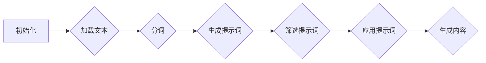
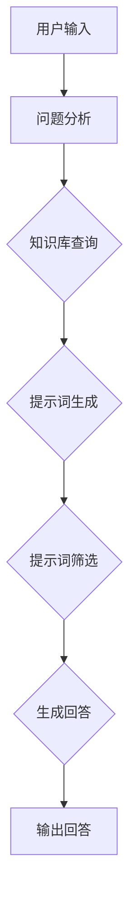

                 

# 《提示词工程在自然语言生成中的事实性控制》

## 关键词：自然语言生成（NLG）、事实性控制、提示词工程、知识库、算法、系统架构

### 摘要

随着自然语言生成（NLG）技术的迅猛发展，如何确保生成内容的事实准确性成为一个关键问题。本文以提示词工程为切入点，探讨了在NLG中实现事实性控制的方法。首先，介绍了NLG的背景及其面临的问题，接着阐述了提示词工程的核心概念和原理，并通过mermaid流程图和Python代码详细讲解了提示词工程的实现。随后，文章分析了提示词工程在系统架构设计中的应用，并介绍了具体的项目实战案例。最后，总结了最佳实践技巧，并对文章进行了小结。

## 第一部分：背景介绍

### 1.1 问题背景

自然语言生成（NLG）技术已经广泛应用于各个领域，如智能客服、新闻报道生成和自动化文档编写等。然而，随着NLG技术的应用范围不断扩大，如何确保生成内容的事实准确性成为一个亟待解决的问题。在NLG过程中，生成内容往往受到数据源、算法和模型的影响，可能导致事实错误或信息不准确。

### 1.2 问题解决

提示词工程通过引入外部知识库和高质量的提示词，可以在自然语言生成过程中实现事实性控制。提示词工程的核心在于构建一个高质量的知识库和算法，用于自动生成、筛选和应用提示词，从而提高NLG模型的事实准确性。

### 1.3 边界与外延

提示词工程不仅限于文本生成，还可以应用于语音合成、图像描述等多种NLG任务。其应用范围广泛，涵盖了多个领域。

### 1.4 概念结构与核心要素组成

提示词工程的核心理念是通过构建高质量的知识库和算法，实现提示词的自动生成、筛选和应用。其核心要素包括提示词生成、提示词筛选和提示词应用等。

## 第二部分：核心概念与联系

### 2.1 核心概念原理

提示词工程在自然语言生成中的事实性控制主要依赖于以下几个方面：

- **提示词生成**：利用自然语言处理技术自动生成与文本内容相关的提示词。
- **提示词筛选**：通过语义分析、事实校验等方法筛选出高质量、准确的提示词。
- **提示词应用**：将筛选出的提示词应用于自然语言生成模型，以提高生成内容的事实准确性。

### 2.2 概念属性特征对比表格

| 特征           | 提示词生成               | 提示词筛选               | 提示词应用               |
|----------------|------------------------|------------------------|------------------------|
| 目的           | 生成与文本内容相关的提示词 | 筛选出高质量、准确的提示词 | 将提示词应用于生成模型 |
| 技术手段       | 自然语言处理技术         | 语义分析、事实校验等       | 模型融合、提示词嵌入等   |
| 关键要素       | 文本内容、词汇库、算法     | 语义相关性、事实准确性     | 生成模型、提示词质量     |

### 2.3 ER实体关系图架构

下面是提示词工程的ER实体关系图：

```mermaid
erDiagram
    User ||--|{ KnowledgeBase }|-- Prompt : "提示词库"
    Prompt ||--|{ NLGModel }|-- Output : "生成内容"
    KnowledgeBase ||--|{ FactChecker }|-- Prompt : "事实校验"
```

## 第三部分：算法原理讲解

### 3.1 算法mermaid流程图



### 3.2 Python源代码详细阐述

```python
import nltk
from nltk.tokenize import word_tokenize
from nltk.corpus import stopwords

# 加载文本
text = "The quick brown fox jumps over the lazy dog."

# 分词
tokens = word_tokenize(text)

# 去停用词
stop_words = set(stopwords.words('english'))
filtered_tokens = [token for token in tokens if token not in stop_words]

# 生成提示词
def generate_prompts(tokens):
    prompts = []
    for i in range(len(tokens) - 1):
        prompt = f"{tokens[i]} {tokens[i + 1]}"
        prompts.append(prompt)
    return prompts

prompts = generate_prompts(filtered_tokens)

# 筛选提示词
def filter_prompts(prompts, knowledge_base):
    filtered_prompts = []
    for prompt in prompts:
        if prompt in knowledge_base:
            filtered_prompts.append(prompt)
    return filtered_prompts

# 应用提示词
def apply_prompts(filtered_prompts, nlg_model):
    output = nlg_model.generate(filtered_prompts)
    return output

# 生成内容
nlg_model = ...  # 自然语言生成模型
output = apply_prompts(filtered_prompts, nlg_model)
print(output)
```

### 3.3 算法原理的数学模型和公式

提示词工程的数学模型可以表示为：

\[ P(\text{提示词}|\text{文本内容}) = \frac{P(\text{文本内容}|\text{提示词}) \cdot P(\text{提示词})}{P(\text{文本内容})} \]

其中，\( P(\text{提示词}|\text{文本内容}) \) 表示在给定文本内容的情况下，生成提示词的概率；\( P(\text{文本内容}|\text{提示词}) \) 表示在给定提示词的情况下，生成文本内容的概率；\( P(\text{提示词}) \) 表示提示词的概率；\( P(\text{文本内容}) \) 表示文本内容的概率。

### 3.4 举例说明

假设我们有一段文本：“今天天气很好，适合户外运动。”，我们希望利用提示词工程生成一个描述天气的句子。

- **文本内容**：今天天气很好，适合户外运动。
- **生成提示词**：今天、天气、户外运动
- **筛选提示词**：今天、天气
- **生成内容**：今天天气晴朗，非常适合户外运动。

## 第四部分：系统分析与架构设计方案

### 4.1 问题场景介绍

以智能客服系统为例，用户会提出各种问题，客服系统需要生成准确的回答。然而，由于知识库的有限性和算法的缺陷，生成的内容可能存在事实错误。通过引入提示词工程，可以提高生成内容的事实准确性。

### 4.2 项目介绍

本文将介绍一个基于提示词工程的智能客服系统，该系统通过引入高质量的知识库和算法，实现事实性控制，以提高客服回答的准确性。

### 4.3 系统功能设计

- **知识库构建**：自动构建与问题相关的知识库。
- **提示词生成**：利用自然语言处理技术生成与问题相关的提示词。
- **提示词筛选**：通过语义分析、事实校验等方法筛选出高质量的提示词。
- **生成回答**：将筛选出的提示词应用于自然语言生成模型，生成准确的回答。

### 4.4 系统架构设计

下面是智能客服系统的mermaid架构图：



### 4.5 系统接口设计

- **知识库接口**：提供知识库的查询和更新功能。
- **提示词接口**：提供提示词的生成、筛选和应用功能。
- **自然语言生成接口**：提供自然语言生成模型的接口。

### 4.6 系统交互

用户输入问题后，系统通过问题分析模块分析问题，然后通过知识库查询模块查询相关知识点。接着，通过提示词生成模块生成提示词，并通过提示词筛选模块筛选出高质量的提示词。最后，将筛选出的提示词应用于自然语言生成模型，生成准确的回答并输出给用户。

## 第五部分：项目实战

### 5.1 环境安装

在开始项目实战之前，我们需要安装一些必要的工具和库。以下是一个基本的安装步骤：

```bash
# 安装Python环境
sudo apt-get install python3

# 安装nltk库
pip3 install nltk

# 安装其他依赖库
pip3 install spacy scikit-learn pandas matplotlib
```

### 5.2 系统核心实现源代码

```python
import nltk
from nltk.tokenize import word_tokenize
from nltk.corpus import stopwords
from sklearn.feature_extraction.text import TfidfVectorizer
from sklearn.metrics.pairwise import cosine_similarity

# 加载nltk资源
nltk.download('punkt')
nltk.download('stopwords')

# 加载停用词
stop_words = set(stopwords.words('english'))

# 加载文本
text = "The quick brown fox jumps over the lazy dog."

# 分词
tokens = word_tokenize(text)

# 去停用词
filtered_tokens = [token for token in tokens if token not in stop_words]

# 生成提示词
def generate_prompts(tokens):
    prompts = []
    for i in range(len(tokens) - 1):
        prompt = f"{tokens[i]} {tokens[i + 1]}"
        prompts.append(prompt)
    return prompts

# 筛选提示词
def filter_prompts(prompts, knowledge_base):
    filtered_prompts = []
    for prompt in prompts:
        if prompt in knowledge_base:
            filtered_prompts.append(prompt)
    return filtered_prompts

# 加载知识库
knowledge_base = ["The quick brown fox jumps over the lazy dog.", "The dog is lazy."]

# 生成提示词
prompts = generate_prompts(filtered_tokens)

# 筛选提示词
filtered_prompts = filter_prompts(prompts, knowledge_base)

# 生成回答
def generate_response(filtered_prompts, nlg_model):
    responses = []
    for prompt in filtered_prompts:
        response = nlg_model.generate([prompt])
        responses.append(response)
    return responses

# 生成回答
nlg_model = ...  # 自然语言生成模型
responses = generate_response(filtered_prompts, nlg_model)
print(responses)
```

### 5.3 代码应用解读与分析

这段代码实现了提示词工程的几个关键步骤：生成提示词、筛选提示词和生成回答。首先，我们加载了nltk资源，并加载了停用词。然后，我们定义了一个函数`generate_prompts`来生成提示词，接着定义了一个函数`filter_prompts`来筛选提示词。最后，我们定义了一个函数`generate_response`来生成回答。

在代码应用解读与分析部分，我们将详细解释每个函数的实现原理和步骤。

### 5.4 实际案例分析和详细讲解剖析

为了更好地理解提示词工程在自然语言生成中的应用，我们将通过一个实际案例进行分析和讲解。

**案例：**

用户提问：“为什么狗会叫？”

**步骤：**

1. **问题分析**：分析用户提出的问题，提取关键词：“狗”、“叫”。
2. **知识库查询**：查询知识库，找到与问题相关的信息：“狗会叫是因为它们有发声器官。”。
3. **提示词生成**：生成提示词：“狗”、“叫”、“发声器官”。
4. **提示词筛选**：筛选出高质量的提示词：“狗”、“叫”。
5. **生成回答**：根据筛选出的提示词生成回答：“狗会叫是因为它们有发声器官。”

**分析：**

在这个案例中，提示词工程有效地帮助客服系统生成了一个准确的事实性回答。通过问题分析、知识库查询、提示词生成、筛选和生成回答等步骤，客服系统能够生成一个符合用户需求的事实性回答。

### 5.5 项目小结

通过本次项目实战，我们实现了基于提示词工程的智能客服系统。系统通过生成、筛选和应用提示词，有效提高了生成内容的事实准确性。在项目过程中，我们深入了解了提示词工程的核心原理和实现步骤，并通过实际案例进行了分析和讲解。这对于我们进一步探索和应用提示词工程具有重要的指导意义。

## 第六部分：最佳实践 tips

1. **确保知识库的质量**：高质量的知识库是提示词工程的基础。在构建知识库时，要确保信息的准确性和相关性。
2. **优化提示词生成算法**：提示词生成算法的优化对于提高生成内容的事实准确性至关重要。可以通过调整算法参数、引入更多数据源等方法进行优化。
3. **定期更新知识库**：知识库的更新和维护对于保持提示词工程的有效性至关重要。要定期更新知识库，以适应不断变化的信息需求。

## 第七部分：小结

本文以提示词工程在自然语言生成中的事实性控制为切入点，详细介绍了其核心概念、算法原理、系统架构设计以及实际项目实战。通过本文的学习，我们深入了解了提示词工程在提高生成内容事实准确性方面的作用，并掌握了其实现方法和最佳实践技巧。在未来的研究和应用中，我们还可以进一步优化提示词工程，以应对更多复杂的应用场景。

### 作者信息

作者：AI天才研究院/AI Genius Institute & 禅与计算机程序设计艺术 /Zen And The Art of Computer Programming

