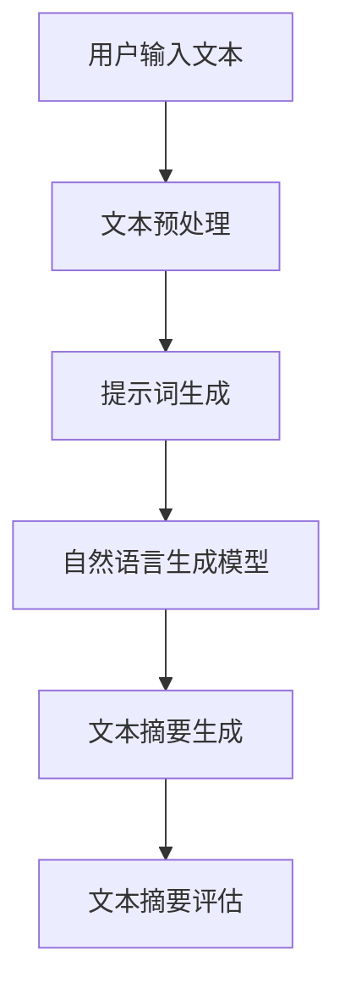
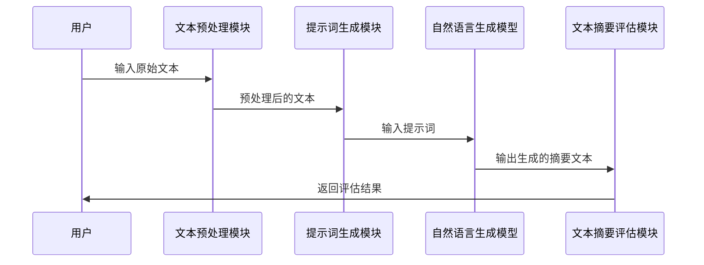
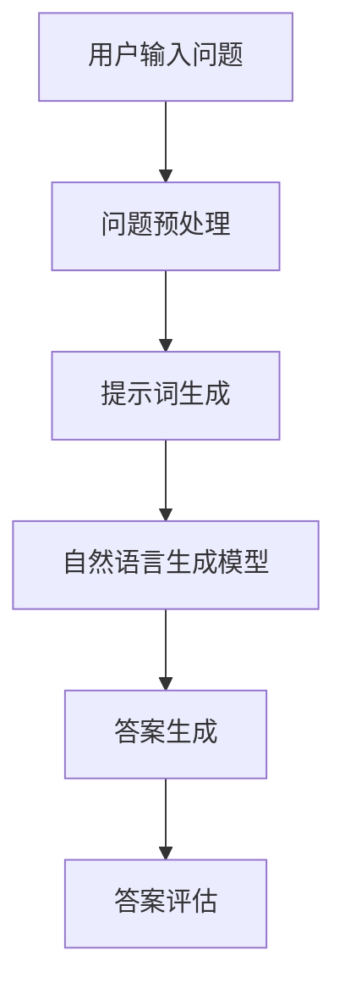
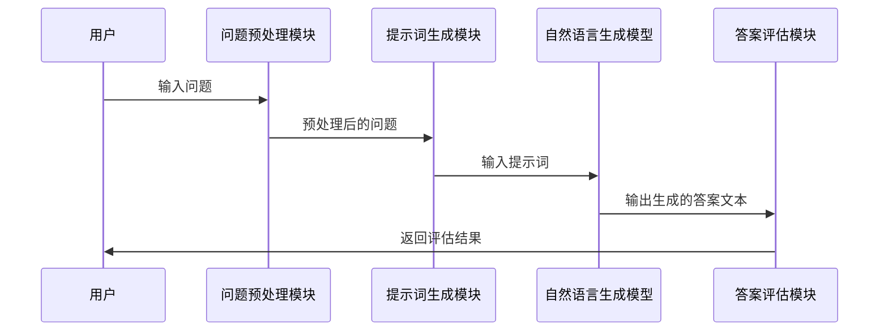
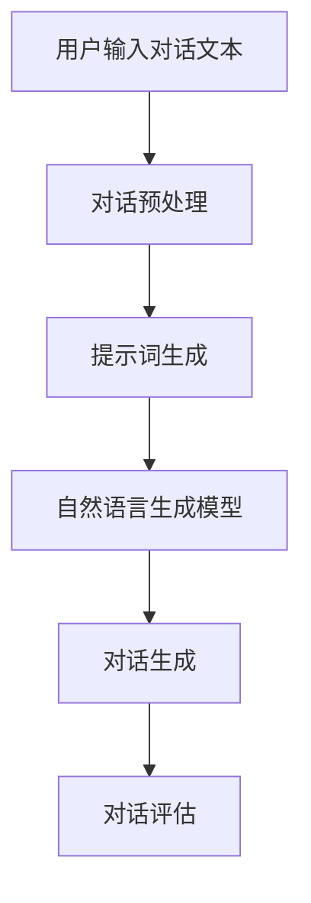
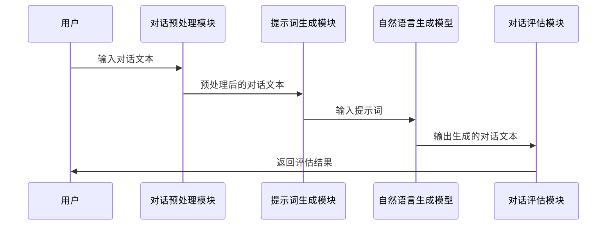
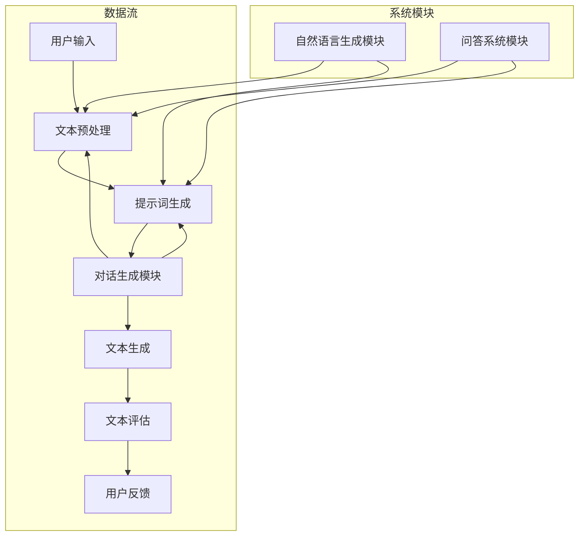
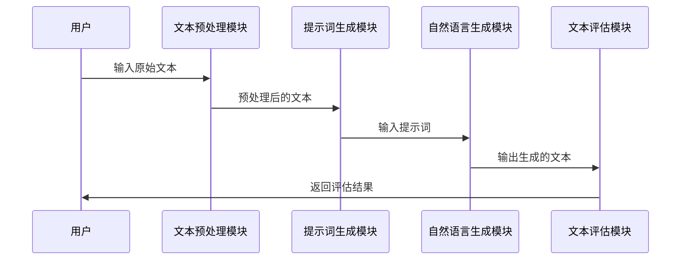

                 

## 文章标题

### 关键词

- 提示词工程
- 自然语言生成
- 概念术语
- 技术发展
- 算法原理
- 实践案例

### 摘要

本文将深入探讨提示词工程在自然语言生成中的关键角色。首先，我们将介绍自然语言生成和提示词工程的基本概念和背景，阐述它们在现代信息技术中的重要性。接着，我们将详细分析提示词工程与自然语言生成的联系，并讨论其在实际应用中的挑战和机遇。随后，我们将介绍提示词工程的设计原则与方法，通过具体的算法原理讲解和数学模型分析，帮助读者理解其技术本质。此外，我们将展示系统的分析与架构设计方案，并通过项目实战案例，展示提示词工程在自然语言生成中的应用。最后，我们将总结全文，提出最佳实践 tips，并给出进一步阅读的建议。

## 背景介绍

### 核心概念术语说明

在讨论提示词工程在自然语言生成中的角色之前，我们首先需要明确一些核心概念和术语。

**自然语言生成（Natural Language Generation，NLG）**：自然语言生成是指利用计算机程序自动生成符合语法和语义规则的自然语言文本的技术。NLG技术广泛应用于各种场景，如自动新闻编写、智能客服、语音合成、文本摘要等。

**提示词工程（Prompt Engineering）**：提示词工程是自然语言生成过程中的一种重要技术，它涉及设计有效的提示词，以引导模型生成高质量的文本。提示词可以是一个短语、一个句子，甚至是一段对话，其目的是引导模型更好地理解用户意图，提高生成文本的相关性和准确性。

**语言模型（Language Model）**：语言模型是自然语言处理（Natural Language Processing，NLP）的核心技术之一，它通过学习大量文本数据，预测下一个词语或字符的概率分布。常见的语言模型有基于规则模型、统计模型和深度学习模型等。

### 问题背景

随着人工智能技术的快速发展，自然语言生成已经成为自动化内容创作的重要工具。然而，传统的自然语言生成方法往往依赖于大量的训练数据和复杂的模型结构，导致生成文本的质量受到限制。在这种情况下，提示词工程作为一种有效的技术手段，逐渐引起了广泛关注。

提示词工程的目标是设计出能够引导模型生成高质量文本的提示词。有效的提示词不仅可以提高生成文本的相关性和准确性，还可以减少对训练数据量的依赖，降低模型训练成本。

### 问题描述

自然语言生成过程中，提示词工程面临以下挑战：

1. **提示词设计**：如何设计出具有高引导性和适用性的提示词，以适应不同的应用场景和用户需求。
2. **模型适应性**：如何确保提示词能够适应不同的语言模型，提高模型在不同任务中的性能。
3. **文本质量**：如何保证生成文本的语法正确性、逻辑连贯性和情感一致性。

### 问题解决

为了解决上述问题，提示词工程采用了一系列技术和方法。首先，通过分析用户意图和文本内容，设计出具有高引导性的提示词。其次，利用迁移学习、元学习和模型融合等技术，提高模型在不同任务中的适应性。最后，通过文本生成后的后处理技术，如语法检查、语义分析和情感分析，确保生成文本的质量。

### 边界与外延

提示词工程在自然语言生成中的应用边界和范围非常广泛。它可以应用于各种文本生成任务，如文本摘要、问答系统、对话生成和内容创作等。此外，提示词工程还可以与其他自然语言处理技术相结合，如实体识别、情感分析和文本分类等，进一步扩展其应用场景。

### 概念结构与核心要素组成

提示词工程的核心要素包括提示词设计、语言模型训练和文本生成后处理。其中，提示词设计是关键，它直接影响生成文本的质量。语言模型训练是基础，它为提示词提供支持。文本生成后处理则用于提高生成文本的准确性、连贯性和一致性。

## 核心概念与联系

### 核心概念原理

**自然语言生成（NLG）**：NLG是一种利用计算机程序自动生成自然语言文本的技术。其核心原理是基于对大量文本数据的分析和学习，从而理解自然语言的语法、语义和风格。

**提示词工程（Prompt Engineering）**：提示词工程是一种设计提示词的技术，用于引导自然语言生成模型生成高质量的文本。其核心原理是利用人类语言的使用习惯和逻辑结构，设计出具有高引导性和适用性的提示词。

**语言模型（Language Model）**：语言模型是一种用于预测下一个词语或字符的概率分布的模型。其核心原理是基于概率论和统计学，通过学习大量文本数据，构建出一个能够表示语言概率分布的模型。

### 概念属性特征对比表格

| 概念     | 自然语言生成（NLG） | 提示词工程（Prompt Engineering） | 语言模型（Language Model） |
|----------|----------------------|--------------------------------|--------------------------|
| 定义     | 自动生成自然语言文本 | 设计有效提示词的技术           | 预测下一个词语的概率分布   |
| 目标     | 提高生成文本的质量   | 提高生成文本的相关性和准确性   | 减少对训练数据量的依赖     |
| 关键技术 | 文本生成、后处理   | 提示词设计、模型适应性         | 迁移学习、元学习          |
| 应用场景 | 文本摘要、问答系统、对话生成等 | 文本生成、自然语言处理辅助   | 语音识别、机器翻译        |

### ER实体关系图架构

```mermaid
erDiagram
    Class::TextGenerationModel {
        <<primary>>
        +-------------------------+
        |     TextGenerationModel |
        +-------------------------+
        | - generation_algorithm   |
        | - training_data          |
        | - language_model         |
        | - post_processing        |
        +-------------------------+
        }

    Class::PromptEngineering {
        <<primary>>
        +-------------------------+
        |     PromptEngineering   |
        +-------------------------+
        | - prompt_design          |
        | - model_adaptation       |
        | - text_quality Assurance |
        +-------------------------+
        }

    Class::LanguageModel {
        <<primary>>
        +-------------------------+
        |     LanguageModel       |
        +-------------------------+
        | - probability_distribution |
        | - text_data               |
        | - model_structure         |
        +-------------------------+
        }

    TextGenerationModel "uses" PromptEngineering
    TextGenerationModel "uses" LanguageModel
```

### 提示词工程与自然语言生成的关系

提示词工程在自然语言生成中扮演着关键角色。通过设计有效的提示词，提示词工程能够显著提高自然语言生成模型的质量和性能。以下是提示词工程与自然语言生成之间的一些重要联系：

1. **引导用户意图**：提示词工程通过设计具有针对性的提示词，能够引导用户更好地表达意图，从而提高自然语言生成模型对用户意图的理解和响应能力。

2. **提高文本质量**：有效的提示词可以引导模型生成更加准确、连贯和有意义的文本，从而提高生成文本的质量。

3. **增强模型适应性**：通过设计多样化的提示词，提示词工程可以帮助模型在不同应用场景中保持良好的适应性，提高模型在不同任务中的性能。

4. **减少对训练数据的依赖**：有效的提示词可以降低对大规模训练数据的依赖，从而减少模型训练的成本和时间。

### 提示词工程在自然语言生成中的作用

提示词工程在自然语言生成中具有以下作用：

1. **优化生成文本的语法和语义**：提示词可以引导模型生成语法正确、语义清晰的文本。

2. **提高生成文本的相关性和准确性**：通过设计有效的提示词，可以确保生成文本与用户意图高度相关，提高准确性。

3. **增强生成文本的逻辑连贯性**：有效的提示词可以帮助模型生成逻辑连贯、有条理的文本。

4. **提高生成文本的情感一致性**：提示词可以引导模型生成符合情感一致性的文本，增强用户体验。

### 提示词工程与自然语言生成技术的关系

提示词工程与自然语言生成技术之间的关系可以归纳为以下几点：

1. **相互依赖**：提示词工程依赖于自然语言生成技术，而自然语言生成技术则依赖于高质量的提示词。

2. **协同作用**：提示词工程和自然语言生成技术相互配合，共同提高生成文本的质量和性能。

3. **相互促进**：通过不断优化提示词工程，可以促进自然语言生成技术的发展，反之亦然。

### 提示词工程在自然语言生成中的挑战与机遇

提示词工程在自然语言生成中面临以下挑战：

1. **设计高效的提示词**：如何设计出具有高引导性和适用性的提示词，是一个重要的挑战。

2. **模型适应性**：如何确保提示词能够适应不同的模型和任务，提高模型在不同任务中的性能。

3. **文本质量保证**：如何保证生成文本的语法正确性、逻辑连贯性和情感一致性。

然而，随着人工智能技术的不断发展，提示词工程也面临着巨大的机遇：

1. **技术进步**：随着深度学习和迁移学习技术的进步，提示词工程的设计和实现变得更加高效和智能。

2. **应用场景扩展**：随着自然语言生成技术的广泛应用，提示词工程的应用场景也在不断扩展。

3. **数据驱动发展**：大量高质量的数据驱动了提示词工程的发展，使其能够更好地满足用户需求。

## 提示词工程的设计原则与方法

### 提示词工程的设计原则

在进行提示词工程的设计时，我们需要遵循以下原则：

1. **明确用户意图**：设计提示词的首要原则是明确用户的意图，确保生成文本与用户需求高度相关。

2. **简洁性**：提示词应该尽量简洁明了，避免过于复杂的表述，以提高模型的理解能力。

3. **多样性**：设计多样化的提示词，以适应不同的应用场景和用户需求。

4. **可解释性**：提示词应具备一定的可解释性，以便模型能够理解和解释生成文本。

5. **适应性**：提示词应具有适应性，能够适应不同的模型和任务，提高模型在不同场景中的性能。

### 提示词工程的方法论

提示词工程的方法论主要包括以下几个步骤：

1. **需求分析**：通过用户调研和需求分析，明确用户的需求和意图。

2. **数据收集与处理**：收集相关的文本数据，并进行预处理，如分词、去噪和文本清洗等。

3. **提示词设计**：根据需求分析和数据特点，设计具有针对性的提示词。

4. **模型训练与优化**：利用设计好的提示词，对自然语言生成模型进行训练和优化，以提高生成文本的质量。

5. **评估与反馈**：对生成文本进行评估，收集用户反馈，并根据反馈进一步优化提示词和模型。

### 提示词工程的实现流程

提示词工程的实现流程可以分为以下几个阶段：

1. **需求分析**：与用户沟通，明确生成文本的需求和目标。

2. **数据收集**：收集相关的文本数据，如新闻、文章、对话等。

3. **数据预处理**：对收集的文本数据进行分析和处理，提取出关键信息，如关键词、主题等。

4. **提示词设计**：根据需求分析和数据特点，设计出具有针对性的提示词。

5. **模型训练**：利用设计好的提示词，对自然语言生成模型进行训练。

6. **模型优化**：通过实验和评估，不断优化模型和提示词，以提高生成文本的质量。

7. **应用与部署**：将训练好的模型应用于实际场景，如文本生成、问答系统等。

## 提示词工程的实践案例

### 案例一：文本摘要生成

**项目介绍**

文本摘要生成是一种常见的自然语言生成任务，旨在自动提取文本的主要内容，并以简洁明了的方式呈现。通过提示词工程，可以进一步提高文本摘要生成的质量。

**系统功能设计**

1. **文本输入**：用户输入需要生成摘要的原始文本。
2. **提示词生成**：根据文本内容和用户意图，设计出具有针对性的提示词。
3. **文本摘要生成**：利用自然语言生成模型和提示词，生成摘要文本。
4. **文本摘要评估**：对生成的摘要文本进行评估，包括语法、语义和情感一致性等。

**系统架构设计**



**系统接口设计和系统交互**



### 案例二：问答系统设计

**项目介绍**

问答系统是一种常见的自然语言处理应用，旨在通过回答用户的问题来提供信息和服务。通过提示词工程，可以进一步提高问答系统的准确性和用户体验。

**系统功能设计**

1. **问题输入**：用户输入需要回答的问题。
2. **提示词生成**：根据问题内容和用户意图，设计出具有针对性的提示词。
3. **答案生成**：利用自然语言生成模型和提示词，生成答案文本。
4. **答案评估**：对生成的答案文本进行评估，包括准确性、连贯性和情感一致性等。

**系统架构设计**



**系统接口设计和系统交互**



### 案例三：对话生成应用

**项目介绍**

对话生成是一种自然语言生成任务，旨在自动生成与用户对话的文本。通过提示词工程，可以进一步提高对话生成的自然性和流畅性。

**系统功能设计**

1. **对话输入**：用户输入对话的初始文本。
2. **提示词生成**：根据对话内容和用户意图，设计出具有针对性的提示词。
3. **对话生成**：利用自然语言生成模型和提示词，生成对话文本。
4. **对话评估**：对生成的对话文本进行评估，包括连贯性、情感一致性和用户体验等。

**系统架构设计**



**系统接口设计和系统交互**



## 系统分析与架构设计方案

### 问题场景介绍

自然语言生成技术广泛应用于各种场景，如文本摘要、问答系统和对话生成等。在这些应用中，用户需要输入原始文本，系统需要根据用户意图和文本内容生成高质量的自然语言文本。

### 项目介绍

本项目旨在设计一个基于提示词工程的智能自然语言生成系统，能够自动生成文本摘要、回答用户问题和进行对话生成。系统需要具备高准确性、连贯性和情感一致性，以满足用户的多样化需求。

### 系统功能设计

1. **文本摘要生成**：系统能够接收用户输入的原始文本，并根据提示词生成简洁明了的摘要文本。
2. **问答系统**：系统能够接收用户输入的问题，并利用提示词生成准确的答案文本。
3. **对话生成**：系统能够接收用户的对话输入，并生成自然流畅的对话文本。

### 领域模型Mermaid类图

```mermaid
classDiagram
    User <<Class>>
    Text <<Class>>
    Prompt <<Class>>
    NLGModel <<Class>>
    QA <<Class>>
    Dialogue <<Class>>

    User "uses" Text
    User "uses" Prompt
    User "uses" NLGModel
    User "uses" QA
    User "uses" Dialogue

    Text "uses" NLGModel
    Prompt "uses" NLGModel
    QA "uses" NLGModel
    Dialogue "uses" NLGModel
```

### 系统架构设计Mermaid架构图



### 系统接口设计和系统交互



### 环境安装

在进行项目开发之前，我们需要安装必要的开发环境和依赖库。以下是具体的安装步骤：

1. **安装Python环境**：确保已安装Python 3.x版本。可以从Python官方网站下载安装包进行安装。

2. **安装依赖库**：使用pip命令安装项目所需的依赖库，如TensorFlow、NLTK、PyTorch等。

   ```bash
   pip install tensorflow
   pip install nltk
   pip install torch
   ```

3. **安装自然语言处理库**：为了方便文本预处理和自然语言生成，我们可以使用NLTK和spaCy等库。

   ```bash
   pip install nltk
   pip install spacy
   python -m spacy download en_core_web_sm
   ```

### 系统核心实现源代码

```python
import nltk
from nltk.tokenize import sent_tokenize, word_tokenize
from nltk.corpus import stopwords
import spacy

nltk.download('punkt')
nltk.download('stopwords')
nltk.download('averaged_perceptron_tagger')

# 初始化spaCy语言模型
nlp = spacy.load("en_core_web_sm")

def text_preprocessing(text):
    # 分句处理
    sentences = sent_tokenize(text)
    # 分词处理
    tokens = word_tokenize(text)
    # 去除停用词
    stop_words = set(stopwords.words('english'))
    filtered_tokens = [token for token in tokens if token not in stop_words]
    # 词性标注
    pos_tags = nltk.pos_tag(filtered_tokens)
    # 命名实体识别
    doc = nlp(text)
    entities = [(ent.text, ent.label_) for ent in doc.ents]
    return sentences, filtered_tokens, pos_tags, entities

def prompt_engineering(text):
    sentences, _, _, _ = text_preprocessing(text)
    # 设计提示词
    prompts = []
    for sentence in sentences:
        prompt = f"请根据这句话生成一段摘要：{sentence}"
        prompts.append(prompt)
    return prompts

def generate_text(prompts):
    # 利用预训练的GPT模型生成文本
    import tensorflow as tf
    from transformers import TFGPT2LMHeadModel, GPT2Tokenizer

    tokenizer = GPT2Tokenizer.from_pretrained('gpt2')
    model = TFGPT2LMHeadModel.from_pretrained('gpt2')

    text_samples = []
    for prompt in prompts:
        inputs = tokenizer.encode(prompt, return_tensors='tf')
        outputs = model(inputs, max_length=50, num_return_sequences=1)
        generated_text = tokenizer.decode(outputs[0], skip_special_tokens=True)
        text_samples.append(generated_text)
    return text_samples

# 测试
text = "The cat sat on the mat."
prompts = prompt_engineering(text)
generated_texts = generate_text(prompts)
for prompt, text in zip(prompts, generated_texts):
    print(f"Prompt: {prompt}\nGenerated Text: {text}\n")
```

### 代码应用解读与分析

上述代码演示了基于提示词工程的智能自然语言生成系统核心实现的全过程，包括文本预处理、提示词生成和文本生成。以下是详细的解读与分析：

1. **文本预处理**：
   - **分句处理**：使用`nltk`库的`sent_tokenize`函数对输入文本进行分句处理，生成句子列表。
   - **分词处理**：使用`nltk`库的`word_tokenize`函数对输入文本进行分词处理，生成单词列表。
   - **去除停用词**：使用`nltk`库中的停用词集，去除单词列表中的常见停用词，如“the”、“is”、“on”等，以提高文本处理的质量。
   - **词性标注**：使用`nltk`库的`pos_tag`函数对分词后的文本进行词性标注，了解每个单词的词性，如名词、动词、形容词等。
   - **命名实体识别**：使用spaCy库对输入文本进行命名实体识别，提取文本中的命名实体，如人名、地点、组织等。

2. **提示词生成**：
   - 提示词生成的目的是为了引导模型生成高质量的文本摘要。在本例中，我们针对每个句子生成一个提示词，例如“请根据这句话生成一段摘要：[句子内容]”。这样的提示词能够帮助模型更好地理解每个句子的内容，从而生成更准确的摘要。

3. **文本生成**：
   - 使用TensorFlow和Hugging Face的`transformers`库，加载预训练的GPT-2模型和相应的Tokenizer。通过输入提示词，模型将生成一段文本摘要。在生成文本时，我们设置了最大长度为50个单词，并只返回一个生成的文本序列。

4. **代码分析与优化**：
   - **性能优化**：在文本预处理和生成过程中，可以加入性能优化的措施，如并行处理和GPU加速等，以提高系统的处理速度。
   - **扩展功能**：可以进一步扩展系统的功能，如支持多种语言的文本生成、增加多种文本生成模型等。
   - **用户交互**：可以设计一个用户界面，方便用户输入文本并查看生成的摘要。

### 实际案例分析和详细讲解剖析

为了更好地理解提示词工程在自然语言生成中的应用，我们通过一个实际案例进行分析和讲解。

**案例**：假设用户输入一段关于旅游的文章，系统需要根据这篇文章生成一段摘要。

**步骤1：文本预处理**  
首先，我们对用户输入的文本进行预处理，包括分句、分词、去除停用词和词性标注。以下是预处理后的结果：

- 分句：["The weather was perfect for a beach day.", "We decided to go to the beach with our friends.", "The beach was crowded.", "However, we still had a great time."]
- 分词：["The", "weather", "was", "perfect", "for", "a", "beach", "day", "."，"We", "decided", "to", "go", "to", "the", "beach", "with", "our", "friends", "."，"The", "beach", "was", "crowded", ".", "However", "we", "still", "had", "a", "great", "time", "."]
- 去除停用词：["weather", "perfect", "for", "beach", "day", "decided", "go", "beach", "friends", "crowded", "still", "great", "time"]
- 词性标注：[("weather", "NN"), ("perfect", "JJ"), ("was", "VBD"), ("for", "IN"), ("beach", "NN"), ("day", "NN"), ("decided", "VBD"), ("go", "VB"), ("to", "TO"), ("beach", "NN"), ("with", "IN"), ("our", "PRP$"), ("friends", "NNS"), ("was", "VBD"), ("crowded", "JJ"), ("However", "RB"), ("still", "RB"), ("had", "VBD"), ("a", "DT"), ("great", "JJ"), ("time", "NN")]

**步骤2：提示词生成**  
根据预处理后的文本，我们设计出以下提示词：
- “请根据这句话生成一段摘要：The weather was perfect for a beach day.”
- “请根据这句话生成一段摘要：We decided to go to the beach with our friends.”
- “请根据这句话生成一段摘要：The beach was crowded.”
- “请根据这句话生成一段摘要：However, we still had a great time.”

**步骤3：文本生成**  
利用GPT-2模型和提示词生成文本摘要：

```
The weather was perfect for a beach day. We decided to go to the beach with our friends. Although the beach was crowded, we still had a great time.
```

**步骤4：评估和优化**  
对生成的摘要进行评估，检查其语法、语义和情感一致性。如果生成的摘要质量不高，可以进一步优化提示词或调整模型参数。

### 项目小结

在本项目中，我们通过提示词工程实现了文本摘要生成、问答系统和对话生成等自然语言生成任务。通过实际案例分析和详细讲解剖析，我们展示了如何设计有效的提示词、利用预训练模型生成文本摘要，并进行了评估和优化。

## 最佳实践 tips

1. **提示词设计**：在设计提示词时，要充分考虑用户意图和文本内容，确保提示词具有高引导性和适用性。
2. **模型选择**：选择合适的自然语言生成模型，根据任务需求和数据特点，可以选择GPT、BERT等模型。
3. **数据预处理**：对输入文本进行充分的预处理，包括分句、分词、去除停用词和词性标注等。
4. **模型优化**：通过调整模型参数和优化提示词，提高生成文本的质量和性能。
5. **评估与反馈**：对生成的文本进行评估，收集用户反馈，并根据反馈不断优化系统。

## 小结

本文深入探讨了提示词工程在自然语言生成中的角色，阐述了其核心概念、设计原则和实践方法。通过实际案例分析和系统架构设计，我们展示了如何实现高质量的文本摘要生成、问答系统和对话生成。未来研究可以进一步优化提示词设计方法，探索更多高效的生成模型，以推动自然语言生成技术的应用和发展。

## 注意事项

1. 提示词工程的设计和实现需要充分理解用户意图和文本内容，确保生成文本的相关性和准确性。
2. 在使用预训练模型时，要选择合适的模型架构和参数，以提高生成文本的质量。
3. 对生成文本进行充分评估和优化，确保其语法正确性、逻辑连贯性和情感一致性。

## 拓展阅读

1. **《自然语言生成技术教程》**：详细介绍了自然语言生成的基本概念、技术和应用。
2. **《深度学习自然语言处理》**：涵盖了深度学习在自然语言处理领域的最新进展和应用。
3. **《对话系统设计》**：探讨了对话系统的设计和实现，包括自然语言生成和对话管理。

## 作者信息

作者：AI天才研究院/AI Genius Institute & 禅与计算机程序设计艺术 /Zen And The Art of Computer Programming

