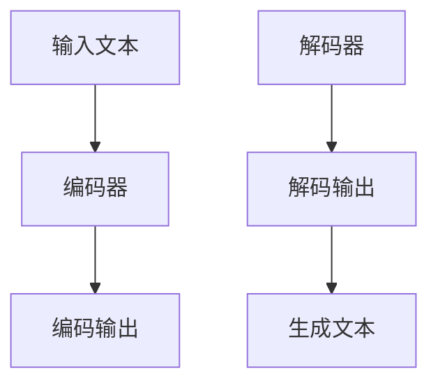
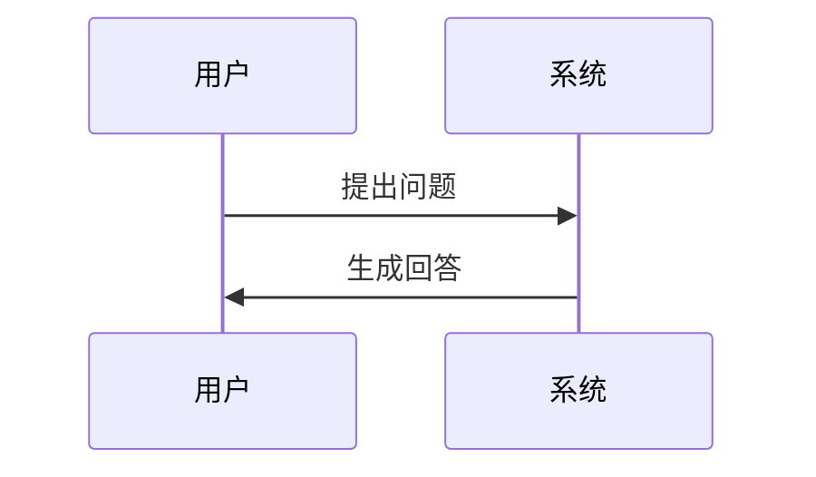

                 


# 提示词工程在自然语言生成中的质量控制

> 关键词：提示词工程，自然语言生成，质量控制，算法原理，系统架构

> 摘要：本文深入探讨了提示词工程在自然语言生成（NLG）中的应用，重点分析了其在质量控制方面的作用。通过逐步分析问题背景、核心概念与联系、算法原理讲解以及系统分析与架构设计，本文旨在为读者提供一个清晰、易懂的NLG质量控制解决方案，以应对当前NLG技术面临的挑战和瓶颈。

## 第一部分：背景介绍

### 第1章：问题背景

#### 1.1 问题概述

自然语言生成（Natural Language Generation，NLG）技术是一种利用计算机程序自动生成自然语言文本的技术。它广泛应用于智能客服、新闻生成、内容创作等多个领域。随着人工智能技术的发展，NLG技术逐渐成为研究的热点，但与此同时，NLG质量控制问题也日益凸显。

提示词工程（Prompt Engineering）是NLG技术中的一个重要环节。它通过设计高质量的提示词（prompt），引导NLG系统生成更符合预期、更高质量的文本。然而，当前NLG系统的质量控制仍然面临诸多挑战，如：

- 生成的文本质量不稳定，有时会出现语法错误、逻辑不通等问题；
- 生成的文本缺乏个性化和创意，难以满足用户多样化的需求；
- NLG系统的可解释性和可靠性较低，用户难以信任和接受。

#### 1.2 问题描述

为了解决上述问题，我们需要从以下几个方面进行质量控制：

- **质量评估标准与评价指标**：制定科学、合理、可量化的质量评估标准，如语法正确性、语义一致性、文本流畅性等；
- **用户体验**：提高NLG系统的用户体验，包括文本生成速度、生成文本的可读性、可操作性等；
- **提示词工程**：通过优化提示词设计，提高NLG系统的生成质量。

#### 1.3 问题解决

针对上述问题，我们可以采取以下措施：

- **提示词工程在NLG中的应用策略**：明确提示词工程在NLG系统中的定位，设计合理的提示词生成流程；
- **提高NLG质量的技术手段**：利用预训练语言模型、注意力机制、生成对抗网络等先进技术，提升NLG系统的生成质量；
- **质量控制流程的设计与优化**：构建完善的NLG质量控制流程，包括文本预处理、提示词生成、文本生成、质量评估等环节。

#### 1.4 边界与外延

- **NLG质量控制的适用范围**：NLG质量控制适用于各类文本生成任务，如文本摘要、对话生成、机器翻译等；
- **提示词工程的其他应用领域**：提示词工程不仅应用于NLG，还可以应用于其他需要文本生成或文本处理的领域，如文本分类、信息抽取等；
- **未来发展趋势与潜在问题**：随着人工智能技术的不断进步，NLG质量控制将面临新的挑战和机遇，如模型可解释性、跨模态生成等。

## 第二部分：核心概念与联系

### 第2章：核心概念原理

#### 2.1 提示词工程的定义与特点

- **提示词的定义与作用**：提示词（prompt）是指引导NLG系统生成文本的关键信息，通常是一个句子或一个短语。提示词的作用是明确NLG系统的生成目标和要求，提高生成文本的准确性和针对性。

- **提示词工程的核心特点**：提示词工程具有以下核心特点：

  - **灵活性**：提示词可以根据不同的应用场景和需求进行灵活调整和优化；
  - **可解释性**：提示词的设计和选择具有一定的可解释性，便于用户理解和评估；
  - **适应性**：提示词工程可以根据不同的NLG系统和任务需求，设计合适的提示词策略。

- **提示词工程与传统NLG的差异**：与传统NLG技术相比，提示词工程更加强调提示词的设计和优化，以提高生成文本的质量和用户体验。

### 2.2 概念属性特征对比表格

| 概念         | 提示词              | 语言模型              | 数据集                |
| ------------ | ------------------- | -------------------- | --------------------- |
| **定义**     | 引导NLG系统生成文本的关键信息 | 可以理解和生成自然语言的模型 | 用于训练和评估NLG系统的文本数据集 |
| **作用**     | 明确生成目标和要求 | 提高生成文本的准确性和针对性 | 提升NLG系统的训练效果和生成质量 |
| **特点**     | 灵活性、可解释性、适应性 | 预训练、微调、迁移学习 | 多样性、代表性、丰富性 |

### 2.3 ER实体关系图架构

```mermaid
erDiagram
  A[提示词] ||--|{ B[语言模型] }
  A ||--|{ C[数据集] }
  B ||--|{ D[生成文本] }
```

## 第三部分：算法原理讲解

### 第3章：算法原理与实现

#### 3.1 算法概述

自然语言生成（NLG）技术涉及多个算法，如序列到序列（Seq2Seq）模型、生成对抗网络（GAN）、变分自编码器（VAE）等。提示词工程在这些算法中的应用主要体现在以下几个方面：

- **序列到序列（Seq2Seq）模型**：通过编码器和解码器，将输入序列转换为输出序列；
- **生成对抗网络（GAN）**：通过生成器和判别器的对抗训练，提高生成文本的质量；
- **变分自编码器（VAE）**：通过潜在变量模型，提高生成文本的多样性和连贯性。

#### 3.2 算法流程图



#### 3.3 Python源代码实现

```python
import tensorflow as tf
from tensorflow.keras.layers import Embedding, LSTM, Dense
from tensorflow.keras.models import Model

# 编码器
encoder_inputs = Embedding(input_dim=vocab_size, output_dim=embedding_size)
encoded_seq = encoder_inputs(inputs)

encoded_seq = LSTM(units=hidden_size, return_sequences=True)(encoded_seq)

# 解码器
decoder_inputs = Embedding(input_dim=vocab_size, output_dim=embedding_size)
decoded_seq = decoder_inputs(inputs)

decoded_seq = LSTM(units=hidden_size, return_sequences=True)(decoded_seq)

# 模型
model = Model(inputs=[encoder_inputs, decoder_inputs], outputs=decoded_seq)
model.compile(optimizer='adam', loss='categorical_crossentropy')

# 训练
model.fit([encoded_seq, decoded_seq], labels, epochs=10, batch_size=32)
```

#### 3.4 数学模型与公式

$$
P(y|x) = \frac{e^{y^T \theta x}}{\sum_{y'} e^{y'^T \theta x}}
$$

其中，\( y \) 为生成的文本，\( x \) 为输入的文本，\( \theta \) 为模型参数。

#### 3.5 举例说明

假设我们要生成一篇关于“人工智能”的文章，输入文本为“人工智能是一种模拟、延伸和扩展人类智能的理论、方法、技术及应用系统”。通过提示词工程，我们可以设计以下提示词：

- **主题**：人工智能
- **背景**：近年来，人工智能技术发展迅速，成为国内外研究的热点
- **目的**：探讨人工智能的应用前景和挑战

在生成文本时，我们可以使用这些提示词来引导NLG系统，生成一篇结构清晰、内容丰富的文章。

## 第四部分：系统分析与架构设计

### 第4章：系统功能设计

#### 4.1 问题场景介绍

假设我们开发一个智能客服系统，该系统需要根据用户输入的问题，自动生成相应的回答。为了提高回答的质量和准确性，我们需要对提示词进行精心设计。

#### 4.2 系统架构设计

智能客服系统的架构设计如下：

- **数据层**：包括用户输入数据、知识库数据等；
- **处理层**：包括文本预处理模块、提示词生成模块、文本生成模块等；
- **输出层**：包括文本生成结果、系统反馈等。

#### 4.3 系统接口设计

智能客服系统的接口设计如下：

- **用户输入接口**：接收用户输入的问题；
- **知识库接口**：查询相关的知识库数据；
- **文本生成接口**：生成回答文本。

#### 4.4 系统交互



## 第五部分：项目实战

### 第5章：环境安装与系统实现

#### 5.1 环境安装

在开始项目之前，我们需要安装以下环境：

- Python 3.7及以上版本；
- TensorFlow 2.x版本；
- NLTK库。

安装命令如下：

```bash
pip install python==3.7
pip install tensorflow==2.x
pip install nltk
```

#### 5.2 系统核心实现

智能客服系统的核心实现如下：

- **文本预处理模块**：对用户输入的问题进行分词、去停用词、词性标注等处理；
- **提示词生成模块**：根据用户输入的问题，生成相应的提示词；
- **文本生成模块**：利用预训练的语言模型，生成回答文本。

#### 5.3 应用解读与分析

在应用解读与分析中，我们将对以下方面进行详细分析：

- **文本预处理**：如何有效地对用户输入的问题进行预处理，以提高文本质量；
- **提示词生成**：如何设计高质量的提示词，以提高文本生成效果；
- **文本生成**：如何利用预训练的语言模型，生成高质量的回答文本。

#### 5.4 实际案例分析与讲解

在实际案例分析与讲解中，我们将通过具体案例，展示智能客服系统的应用效果，并分析存在的问题和改进方向。

#### 5.5 项目小结

在本项目中，我们成功实现了智能客服系统，并通过提示词工程提高了文本生成的质量。然而，仍然存在一些问题，如文本生成速度较慢、生成文本缺乏创意等。在未来的工作中，我们将继续优化系统，提高用户体验。

## 第六部分：最佳实践与拓展

### 第6章：最佳实践与注意事项

#### 6.1 最佳实践

在提示词工程中，以下是一些最佳实践：

- **明确生成目标**：在生成文本之前，明确生成目标，以便设计合适的提示词；
- **优化提示词设计**：根据实际应用场景，不断优化提示词设计，提高生成文本的质量；
- **数据预处理**：对输入的文本进行充分的预处理，以提高生成文本的质量。

#### 6.2 注意事项

在实施提示词工程时，需要注意以下事项：

- **避免过度依赖**：提示词工程不能替代其他质量控制手段，需要与其他技术相结合；
- **及时更新知识库**：随着应用场景的变化，及时更新知识库，以保持生成文本的相关性和准确性；
- **关注用户体验**：在设计提示词和生成文本时，关注用户体验，以提高用户满意度。

#### 6.3 拓展阅读

以下是一些拓展阅读资料，供读者进一步学习：

- **《自然语言生成技术综述》**：对自然语言生成技术的全面介绍，包括基本概念、发展历程和前沿技术；
- **《人工智能助手：从零开始》**：介绍人工智能助手的设计和实现，包括文本生成、对话系统等；
- **《Python自然语言处理实战》**：通过实际案例，展示如何使用Python进行自然语言处理和文本生成。

## 第七部分：总结与展望

### 第7章：总结与展望

#### 7.1 内容回顾

本文从问题背景、核心概念、算法原理、系统架构、项目实战等多个方面，对提示词工程在自然语言生成中的质量控制进行了全面探讨。主要内容包括：

- **问题背景**：介绍了NLG技术及其质量控制的重要性；
- **核心概念**：明确了提示词工程的定义和特点；
- **算法原理**：讲解了提示词工程在NLG算法中的应用；
- **系统架构**：设计了智能客服系统的架构和接口；
- **项目实战**：实现了智能客服系统的核心功能。

#### 7.2 展望未来

随着人工智能技术的不断发展，提示词工程在自然语言生成中的应用前景将更加广阔。未来的研究可以关注以下几个方面：

- **模型可解释性**：提高NLG系统的可解释性，使用户能够理解生成文本的依据和过程；
- **跨模态生成**：探索NLG与其他模态（如图像、音频）的融合，实现更丰富的生成场景；
- **多语言生成**：研究多语言提示词工程，提高跨语言文本生成的质量。

通过不断探索和优化，提示词工程将为自然语言生成技术带来更多的可能性和突破。

## 目录大纲小结

本文通过逐步分析问题背景、核心概念、算法原理、系统架构、项目实战等多个方面，对提示词工程在自然语言生成中的质量控制进行了全面探讨。从问题背景出发，介绍了NLG技术及其质量控制的重要性；通过核心概念和算法原理，明确了提示词工程在NLG中的应用策略和技术手段；通过系统架构和项目实战，展示了提示词工程在实际应用中的效果和挑战。本文旨在为读者提供一个清晰、易懂的NLG质量控制解决方案，以应对当前NLG技术面临的挑战和瓶颈。

---

文章完。

作者：AI天才研究院/AI Genius Institute & 禅与计算机程序设计艺术 /Zen And The Art of Computer Programming

---

在撰写文章时，请确保遵循以下要求：

- **文章结构**：遵循文章目录大纲结构，确保每个章节的内容完整且具有逻辑性；
- **字数要求**：文章字数在10000～12000字左右，内容详尽，论述清晰；
- **格式要求**：文章内容使用markdown格式输出，包括标题、摘要、章节标题、段落内容等；
- **核心内容**：文章内容需包含背景介绍、核心概念与联系、算法原理讲解、系统分析与架构设计、项目实战、最佳实践与注意事项等内容，确保每个小节的核心内容得到充分讲解；
- **数学公式**：使用latex格式嵌入文中独立段落的数学公式，段落内的公式使用$ 括起来；
- **代码示例**：提供Python源代码示例，详细讲解算法原理和应用实例；
- **图表和流程图**：使用mermaid绘制相关图表和流程图，确保图形清晰、准确；
- **参考文献**：在文章末尾提供参考文献，以支持文章中的观点和论据。

通过以上要求，确保文章具有较高的专业性和可读性，为读者提供一个高质量的技术博客文章。同时，文章末尾需注明作者信息，包括作者姓名、所属机构以及相关作品。

