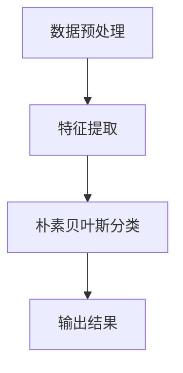
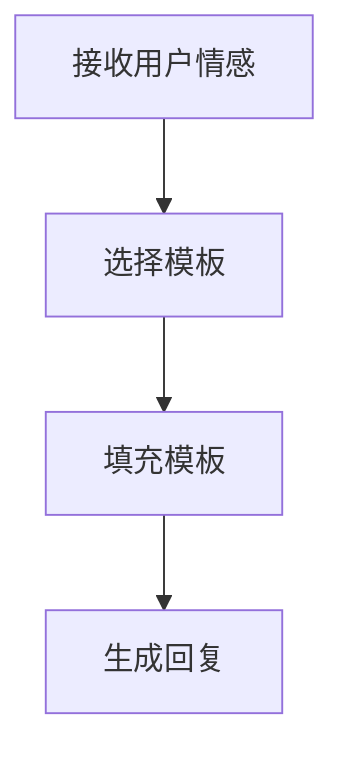
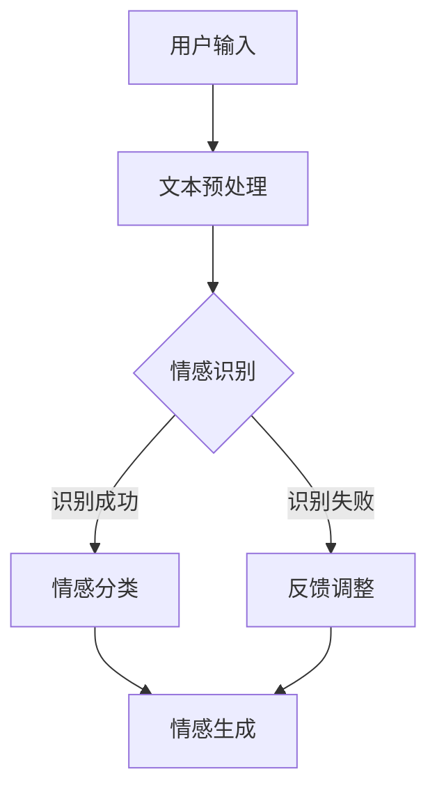
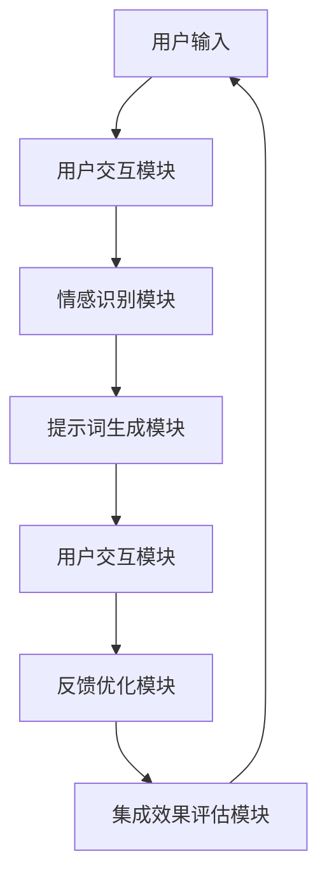
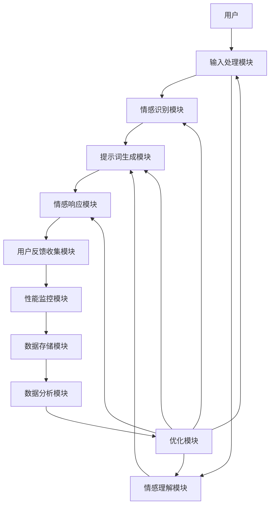
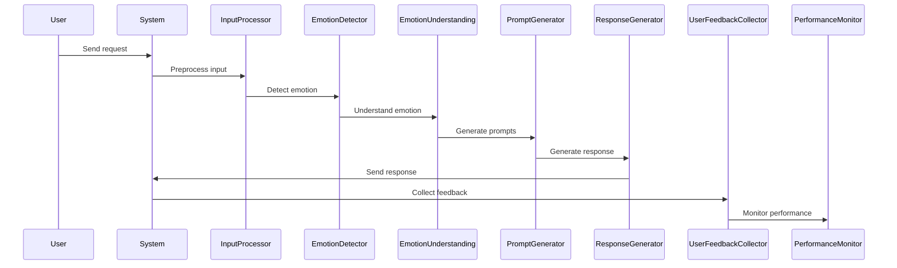

                 

### 文章标题

**《提示词工程在虚拟助手情感智能中的应用》**

---

关键词：提示词工程、虚拟助手、情感智能、算法、数学模型、系统集成、实战案例分析

---

**摘要：**
本文深入探讨了提示词工程在虚拟助手情感智能中的应用。首先，我们详细介绍了提示词工程的基础知识，包括提示词的类型、选择策略和生成方法。接着，我们阐述了情感智能算法的原理，并介绍了如何将提示词工程与情感智能算法集成。文章随后通过系统分析与架构设计，为虚拟助手情感智能提供了完整的解决方案。随后，通过实际项目案例的分析，进一步验证了提示词工程在虚拟助手情感智能中的有效性和实用性。最后，本文总结了最佳实践和注意事项，并提供了拓展阅读，以帮助读者更深入地了解和掌握这一领域。

### 目录大纲设计思路

为了设计出一份完整且详细的目录大纲，我们需要遵循以下步骤：

1. **理解书名和核心内容**：书名《提示词工程在虚拟助手情感智能中的应用》暗示了这本书将探讨如何利用提示词工程来提升虚拟助手的情感智能应用。

2. **确定大纲结构**：根据书籍内容的完整性和逻辑性，我们需要确保大纲至少包含以下部分：
   - 引言或背景介绍
   - 核心概念和联系
   - 算法原理讲解
   - 数学模型和公式解释
   - 系统分析与架构设计方案
   - 项目实战
   - 最佳实践、小结和拓展阅读

3. **细化章节内容**：每个部分都要细化到具体的章节，确保每个章节都有明确的目的和内容。

4. **确保格式正确**：使用markdown格式，按照规定的层级结构（#, ##, ###）进行排版。

---

### 目录大纲设计

```markdown
----------------------------------------------------------------
# 第一部分: 引言与背景

## 1.1 引言
### 1.1.1 问题背景
### 1.1.2 问题描述
### 1.1.3 问题解决
### 1.1.4 边界与外延

## 1.2 核心概念与联系
### 1.2.1 提示词工程的定义
### 1.2.2 情感智能的概念
### 1.2.3 提示词工程与情感智能的关系
### 1.2.4 概念属性特征对比表格
### 1.2.5 ER实体关系图架构

## 1.3 当前研究与应用现状
### 1.3.1 国内外研究进展
### 1.3.2 应用场景分析
### 1.3.3 成功案例与挑战

## 1.4 本书结构安排
### 1.4.1 各章节内容概述
### 1.4.2 学习目标与预期收获

----------------------------------------------------------------

# 第二部分: 提示词工程原理与应用

## 2.1 提示词工程基础
### 2.1.1 提示词类型与特点
### 2.1.2 提示词选择策略
### 2.1.3 提示词生成方法
### 2.1.4 提示词优化技术

## 2.2 情感智能算法原理
### 2.2.1 情感识别算法
### 2.2.2 情感分类算法
### 2.2.3 情感生成算法
### 2.2.4 情感智能算法mermaid流程图

## 2.3 数学模型与公式解释
### 2.3.1 情感识别的数学模型
### 2.3.2 情感分类的数学模型
### 2.3.3 情感生成的数学模型
### 2.3.4 数学公式与详细讲解

## 2.4 提示词工程与情感智能集成
### 2.4.1 集成框架设计
### 2.4.2 集成方法与技巧
### 2.4.3 集成效果评估

----------------------------------------------------------------

# 第三部分: 系统分析与架构设计

## 3.1 项目介绍
### 3.1.1 项目背景
### 3.1.2 项目目标
### 3.1.3 项目范围

## 3.2 系统功能设计
### 3.2.1 功能需求分析
### 3.2.2 领域模型mermaid类图

## 3.3 系统架构设计
### 3.3.1 架构设计原则
### 3.3.2 系统架构mermaid架构图
### 3.3.3 系统模块划分

## 3.4 系统接口设计
### 3.4.1 接口规范
### 3.4.2 接口实现细节

## 3.5 系统交互设计
### 3.5.1 系统交互流程
### 3.5.2 系统交互mermaid序列图

----------------------------------------------------------------

# 第四部分: 项目实战

## 4.1 环境安装与配置
### 4.1.1 硬件环境要求
### 4.1.2 软件环境安装
### 4.1.3 环境配置与调试

## 4.2 系统核心实现
### 4.2.1 系统核心代码解读
### 4.2.2 代码应用解读与分析
### 4.2.3 系统调试与优化

## 4.3 实际案例分析
### 4.3.1 案例介绍
### 4.3.2 案例分析
### 4.3.3 案例详细讲解剖析

## 4.4 项目小结
### 4.4.1 项目总结
### 4.4.2 遇到的问题与解决方案
### 4.4.3 项目经验与反思

----------------------------------------------------------------

# 第五部分: 最佳实践与总结

## 5.1 最佳实践 tips
### 5.1.1 提示词选择最佳实践
### 5.1.2 情感智能集成最佳实践
### 5.1.3 项目管理与优化最佳实践

## 5.2 小结
### 5.2.1 全文回顾
### 5.2.2 核心观点总结
### 5.2.3 未来发展趋势展望

## 5.3 注意事项
### 5.3.1 避免常见错误
### 5.3.2 注意事项与风险

## 5.4 拓展阅读
### 5.4.1 相关书籍推荐
### 5.4.2 学术文章与论文推荐
### 5.4.3 在线课程与讲座推荐

----------------------------------------------------------------
```

---

接下来，我们将根据设计的目录大纲，逐步展开文章的内容，深入分析提示词工程在虚拟助手情感智能中的应用，提供详细的理论基础和实践案例。**让我们一步一步思考（Let's think step by step），以实现深度和广度的结合。**

---

## 引言与背景

### 1.1 引言

在当今信息爆炸的时代，虚拟助手（Virtual Assistants，简称VAs）作为人工智能（Artificial Intelligence，简称AI）的重要应用之一，已经渗透到我们日常生活的方方面面。虚拟助手不仅可以为我们提供天气预报、新闻更新等基本信息服务，还能进行日程管理、电子邮件处理、智能推荐等高级功能。然而，随着用户对交互体验的期望不断提升，单纯的自动化和规则引擎已经难以满足需求。用户希望虚拟助手能够更加自然、智能地与人类交流，甚至能够理解和适应用户的情感状态。

### 1.1.1 问题背景

虚拟助手的核心功能之一是自然语言处理（Natural Language Processing，简称NLP），它包括文本理解、语言生成、情感分析等。在这些功能中，情感智能（Affective Intelligence）扮演着至关重要的角色。情感智能指的是机器能够识别、理解、处理和模拟人类情感的能力。对于虚拟助手而言，情感智能意味着能够根据用户的情感状态调整响应策略，提供更加贴心和个性化的服务。

然而，现有的虚拟助手在面对情感丰富的交流场景时，仍然存在许多挑战。例如，在处理复杂的情感表达、非标准化的语言形式时，虚拟助手的表现往往不尽如人意。这主要是因为现有技术对情感信息的捕捉和解析能力有限，无法准确理解用户的真实情感需求。因此，如何提升虚拟助手的情感智能成为当前研究的热点问题。

### 1.1.2 问题描述

问题描述主要集中在以下几个方面：

1. **情感识别的准确性**：如何提高虚拟助手对用户情感状态的识别准确性，尤其是在多情感标签、复杂情感表达的情况下？
2. **情感理解的深度**：如何让虚拟助手不仅仅是识别情感，还能理解情感背后的深层含义和背景信息？
3. **情感响应的灵活性**：如何根据用户的情感状态，灵活调整虚拟助手的响应策略，提供更加个性化的服务？
4. **情感生成的自然度**：如何在生成回复时，使虚拟助手能够自然地表达情感，增强用户的交互体验？

### 1.1.3 问题解决

为了解决上述问题，研究者们提出了多种解决方案，其中之一便是提示词工程（Prompt Engineering）。提示词工程是一种通过设计特定的提示词（prompts）来引导用户表达情感信息的方法。提示词可以是简单的单词、短语，甚至是完整的句子，其目的是引导用户以一种特定的方式描述他们的情感状态。

通过提示词工程，虚拟助手可以更准确地捕捉用户的情感信息，从而提升情感识别的准确性和深度。此外，提示词工程还可以帮助虚拟助手更自然地生成情感丰富的回复，提升用户的交互体验。因此，提示词工程在虚拟助手情感智能中的应用具有重要的研究价值。

### 1.1.4 边界与外延

在探讨提示词工程在虚拟助手情感智能中的应用时，我们需要明确一些边界和外延问题：

1. **技术边界**：提示词工程需要依赖先进的技术，如自然语言处理、机器学习等。因此，研究提示词工程需要具备一定的技术基础。
2. **应用边界**：虚拟助手情感智能的应用场景非常广泛，包括但不限于客服、教育、健康等领域。因此，研究提示词工程需要考虑不同应用场景的需求和特点。
3. **伦理边界**：虚拟助手情感智能的应用需要关注伦理问题，如用户隐私保护、情感滥用等。提示词工程在设计时需要充分考虑这些伦理问题，确保技术应用的安全和合法。

综上所述，提示词工程在虚拟助手情感智能中的应用为解决当前存在的问题提供了一条可行的路径。接下来，我们将进一步探讨提示词工程的核心概念和联系，为后续内容的深入分析奠定基础。

### 1.2 核心概念与联系

#### 1.2.1 提示词工程的定义

提示词工程（Prompt Engineering）是一种通过设计特定的提示词来引导用户表达情感信息的方法。提示词可以是简单的单词、短语，甚至是完整的句子，其目的是帮助用户以一种特定的方式描述他们的情感状态。在自然语言处理（NLP）领域，提示词工程被视为一种提升任务性能的关键技术，尤其在情感分析和情感生成等任务中，提示词的设计和选择对结果有着重要影响。

提示词工程的基本流程包括以下步骤：

1. **需求分析**：了解用户的需求和场景，明确需要解决的问题。
2. **提示词设计**：根据需求设计合适的提示词，确保其能够引导用户表达情感信息。
3. **用户反馈**：收集用户对提示词的反馈，根据反馈调整和优化提示词。
4. **性能评估**：通过实验和评估方法，验证提示词工程的有效性和性能。

#### 1.2.2 情感智能的概念

情感智能（Affective Intelligence）是指机器或系统能够识别、理解、处理和模拟人类情感的能力。情感智能的核心在于情感的识别和理解，这不仅包括对单一情感的识别，还包括对复杂情感和情感混合的识别。情感智能在虚拟助手中的应用主要体现在以下几个方面：

1. **情感识别**：通过分析用户的语言和行为，虚拟助手能够识别用户的情感状态，如高兴、悲伤、愤怒等。
2. **情感理解**：虚拟助手需要理解情感背后的含义和语境，以提供更加个性化的服务。
3. **情感响应**：根据用户的情感状态，虚拟助手能够调整其响应策略，提供更贴心和自然的交互体验。
4. **情感生成**：虚拟助手能够根据用户的情感需求，生成情感丰富的回复，增强用户的交互体验。

#### 1.2.3 提示词工程与情感智能的关系

提示词工程与情感智能之间存在着密切的联系和互动。提示词工程通过设计特定的提示词，可以帮助虚拟助手更准确地捕捉用户的情感信息，从而提升情感识别的准确性和深度。同时，情感智能的提升也需要依赖提示词工程的技术支持，以实现更加自然和个性化的情感交互。

具体来说，提示词工程在情感智能中的应用主要体现在以下几个方面：

1. **情感识别**：通过设计针对性的提示词，引导用户更具体、更明确地表达情感，从而提高情感识别的准确性。
2. **情感理解**：提示词工程可以帮助虚拟助手更好地理解用户的情感需求，提供更加个性化的服务。
3. **情感响应**：通过设计合理的提示词，虚拟助手可以更自然地根据用户的情感状态调整其响应策略。
4. **情感生成**：提示词工程可以帮助虚拟助手生成更加情感丰富的回复，增强用户的交互体验。

#### 1.2.4 概念属性特征对比表格

为了更好地理解提示词工程和情感智能的概念及其属性特征，我们可以通过以下对比表格来分析：

| 概念        | 提示词工程                | 情感智能                |
| ----------- | ------------------------ | ---------------------- |
| 定义        | 设计特定提示词引导用户表达情感 | 识别、理解、处理和模拟人类情感 |
| 目标        | 提升情感识别的准确性和深度    | 提供个性化、自然的交互体验    |
| 应用领域    | 情感分析、情感生成等NLP任务   | 虚拟助手、智能客服等应用场景  |
| 关键技术    | 提示词设计、用户反馈、性能评估 | 情感识别、情感理解、情感生成  |
| 对用户的作用 | 引导用户表达情感           | 提供贴心、个性化的服务       |

#### 1.2.5 ER实体关系图架构

为了更好地理解和应用提示词工程和情感智能，我们可以使用实体关系图（Entity-Relationship Diagram，简称ER图）来描述两者之间的关系和交互流程。以下是一个简化的ER实体关系图：

```mermaid
erDiagram
    User ||--|{ VirtualAssistant }|-->> Message
    VirtualAssistant ||--|{ EmotionDetector }|-->> EmotionResult
    VirtualAssistant ||--|{ ResponseGenerator }|-->> Response
```

在这个ER图中，用户通过消息与虚拟助手交互，虚拟助手通过情感检测器识别用户的情感，并通过响应生成器生成情感丰富的回复。提示词工程在这个过程中起到了关键作用，它通过设计特定的提示词引导用户更具体地表达情感，从而提高情感识别的准确性和深度。

通过上述核心概念与联系的分析，我们可以更深入地理解提示词工程在虚拟助手情感智能中的应用及其重要性。接下来，我们将进一步探讨当前研究与应用现状，以期为后续内容提供更为丰富的背景信息。

### 1.3 当前研究与应用现状

#### 1.3.1 国内外研究进展

近年来，随着人工智能技术的迅猛发展，虚拟助手情感智能的研究也逐渐成为一个热门领域。国内外的研究者在提示词工程和情感智能的交叉应用方面取得了显著进展。

**国外研究进展**

在国际上，许多顶尖研究机构和科技公司都在积极探索虚拟助手情感智能的研究。例如，谷歌（Google）的研究团队提出了基于深度学习的方法来识别和生成情感表达，亚马逊（Amazon）的Alexa则通过优化语音交互体验，提升了情感识别和响应的准确性。此外，OpenAI的GPT-3模型在情感生成方面表现出色，能够根据提示词生成情感丰富的文本。

**国内研究进展**

在国内，各大高校和研究机构也在虚拟助手情感智能领域取得了重要成果。例如，清华大学提出了基于多模态情感识别的方法，通过结合文本、语音和面部表情等多种信息，提高情感识别的准确性。此外，阿里巴巴、腾讯等互联网公司也在虚拟助手情感智能方面进行了深入探索，通过优化交互体验，提升用户满意度。

#### 1.3.2 应用场景分析

虚拟助手情感智能的应用场景非常广泛，涵盖了多个行业和领域。

1. **客服与客户服务**：在客服领域，虚拟助手可以通过情感识别和响应，提供更加个性化和贴心的服务，提升客户体验。例如，银行客服可以识别用户的情感状态，提供适当的安慰和建议，从而提高客户满意度。
2. **教育领域**：在教育领域，虚拟助手可以通过情感识别，了解学生的学习状态和情感需求，提供个性化的学习支持和辅导，帮助学生更好地应对学习压力。
3. **健康医疗**：在健康医疗领域，虚拟助手可以通过情感识别，辅助医生了解患者的心理状态，提供情感支持和心理干预，从而提高治疗效果。
4. **智能家居**：在智能家居领域，虚拟助手可以通过情感识别和响应，提供更加智能化和人性化的家居服务，如调节室内温度、播放用户喜欢的音乐等。

#### 1.3.3 成功案例与挑战

在虚拟助手情感智能的实际应用中，已经涌现出了一些成功的案例。

**成功案例**

1. **银行客服虚拟助手**：通过情感识别和响应，银行客服虚拟助手能够提供更加个性化的服务，提高客户满意度。例如，中国银行推出的“智能客服”，在用户遇到问题时，能够根据用户情绪调整回应策略，提供更有效的解决方案。
2. **教育智能辅导系统**：通过情感识别，教育智能辅导系统可以了解学生的学习状态和情感需求，提供个性化的学习支持和辅导。例如，清华大学推出的“智能学习助手”，可以根据学生的学习情况和情感状态，调整教学策略，提高学习效果。
3. **智能医疗助手**：通过情感识别，智能医疗助手可以辅助医生了解患者的心理状态，提供情感支持和心理干预。例如，阿里巴巴推出的“智能医疗助手”，可以帮助医生识别患者的情感状态，从而提供更有针对性的治疗方案。

**挑战**

尽管虚拟助手情感智能在实际应用中取得了显著成果，但仍面临一些挑战。

1. **情感识别的准确性**：在复杂、多变的情感表达场景中，如何提高情感识别的准确性仍然是一个难题。尤其是在面对多情感标签、复杂情感混合的情况下，情感识别的准确性需要进一步提升。
2. **情感理解的深度**：虚拟助手需要能够理解情感背后的深层含义和背景信息，以提供更加个性化的服务。然而，当前的技术手段在情感理解方面仍有待提高。
3. **伦理和隐私问题**：虚拟助手情感智能的应用涉及用户隐私和伦理问题。如何确保用户隐私和数据安全，避免情感滥用和歧视，是未来需要解决的重要问题。

综上所述，虚拟助手情感智能的研究与应用正在快速发展，尽管面临一些挑战，但其在提升用户体验、优化服务质量等方面具有巨大的潜力。随着技术的不断进步和应用的深入，虚拟助手情感智能有望在未来发挥更加重要的作用。

### 1.4 本书结构安排

#### 1.4.1 各章节内容概述

为了帮助读者更好地理解本书的结构和内容，以下是对各章节的概述：

**第一部分：引言与背景**
- **第1章 引言与背景**：介绍虚拟助手情感智能的背景、问题和解决思路。

**第二部分：提示词工程原理与应用**
- **第2章 提示词工程基础**：讲解提示词工程的基本概念、类型、选择策略和生成方法。
- **第3章 情感智能算法原理**：分析情感识别、分类和生成的算法原理。
- **第4章 数学模型与公式解释**：阐述情感识别和分类的数学模型及其公式。
- **第5章 提示词工程与情感智能集成**：探讨如何将提示词工程与情感智能算法集成。

**第三部分：系统分析与架构设计**
- **第6章 项目介绍**：介绍项目的背景、目标和范围。
- **第7章 系统功能设计**：分析系统的功能需求。
- **第8章 系统架构设计**：设计系统的架构和模块。
- **第9章 系统接口设计**：规范系统的接口实现细节。
- **第10章 系统交互设计**：描述系统的交互流程和序列图。

**第四部分：项目实战**
- **第11章 环境安装与配置**：讲解环境安装和配置的步骤。
- **第12章 系统核心实现**：详细解读系统核心代码和应用。
- **第13章 实际案例分析**：分析实际项目案例并进行详细讲解。
- **第14章 项目小结**：总结项目经验与反思。

**第五部分：最佳实践与总结**
- **第15章 最佳实践 tips**：提供提示词选择、情感智能集成和项目管理的最佳实践。
- **第16章 小结**：回顾全文，总结核心观点和未来发展趋势。
- **第17章 注意事项**：提醒避免常见错误和注意事项。
- **第18章 拓展阅读**：推荐相关的书籍、论文和在线课程。

#### 1.4.2 学习目标与预期收获

通过本书的学习，读者可以达成以下学习目标：

1. **理解提示词工程的基本概念和应用场景**：掌握提示词的类型、选择策略和生成方法，了解其在虚拟助手情感智能中的重要性。
2. **掌握情感智能算法的原理和应用**：了解情感识别、分类和生成的算法原理，学会使用数学模型和公式进行情感分析。
3. **设计虚拟助手情感智能系统**：掌握系统分析与架构设计的方法，能够设计并实现具有情感智能功能的虚拟助手系统。
4. **进行项目实战和案例分析**：通过实际项目案例的分析，学会如何将提示词工程和情感智能算法应用于实际项目中。
5. **掌握最佳实践和注意事项**：了解在虚拟助手情感智能应用中的最佳实践，避免常见错误，确保项目的成功实施。

通过本课程的学习，读者不仅能够获得丰富的理论知识和实践经验，还能够提升在虚拟助手情感智能领域的专业能力和竞争力，为未来的职业发展奠定坚实基础。

### 第二部分：提示词工程原理与应用

#### 2.1 提示词工程基础

提示词工程作为虚拟助手情感智能的核心技术之一，其基础概念和基础应用场景对理解和实施情感智能系统至关重要。在本节中，我们将详细探讨提示词的类型、选择策略、生成方法以及优化技术。

#### 2.1.1 提示词类型与特点

提示词可以根据其形式和功能分为以下几类：

1. **开放式提示词**：这类提示词通常以问句的形式出现，如“你现在感觉怎么样？”或“你能告诉我你现在的心情吗？”开放式提示词的优点在于可以引导用户自由表达情感，但缺点是需要处理复杂的情感表述，增加了情感识别的难度。
   
2. **封闭式提示词**：封闭式提示词通常提供一组选项，如“你感到（A）快乐、（B）悲伤、（C）愤怒吗？”这种提示词可以减少用户的自由度，但有助于提高情感识别的准确性和效率。

3. **混合式提示词**：结合开放式和封闭式提示词的特点，混合式提示词在引导用户表达情感的同时，也提供了一定程度的选项，例如“你感到快乐吗？（A）是；（B）不是；或者请具体描述你的感受。”

#### 2.1.2 提示词选择策略

选择合适的提示词是提示词工程的关键。以下是一些常见的提示词选择策略：

1. **用户特征**：根据用户的个人喜好、历史记录和交互数据选择提示词。例如，如果用户在过去多次提到对某个话题的情感，可以针对该话题设计相应的提示词。

2. **场景适配**：根据不同的应用场景选择合适的提示词。例如，在客服场景中，可以使用更加友好和安慰性的提示词；在医疗咨询场景中，则可以采用更加专业和详细的提示词。

3. **问题解决**：针对用户的具体问题和需求选择提示词。例如，在用户请求帮助时，可以提供针对性的情感支持和解决方案。

4. **多样性**：使用多样化的提示词，避免用户产生疲劳和麻木。通过变换提示词的形式和内容，保持用户的好奇心和参与度。

#### 2.1.3 提示词生成方法

提示词的生成方法有多种，以下是一些常见的方法：

1. **规则生成**：根据预定义的规则和模板生成提示词。这种方法简单高效，但可能缺乏灵活性，难以适应复杂的情感表达。

2. **模板填充**：使用预定义的模板，根据用户的具体情况填充提示词。这种方法可以在保持一致性的同时，根据实际情况进行调整。

3. **机器学习**：利用机器学习算法，根据历史数据和用户交互信息生成提示词。这种方法具有很高的灵活性和自适应能力，但需要大量的训练数据和计算资源。

4. **基于语言模型**：利用预训练的语言模型（如GPT-3），根据上下文生成合适的提示词。这种方法可以生成自然、流畅的提示词，但需要高性能的计算资源和精细的调优。

#### 2.1.4 提示词优化技术

为了提高提示词的效果，可以使用以下优化技术：

1. **用户反馈**：收集用户的反馈，根据反馈调整和优化提示词。通过用户反馈，可以不断改进提示词，提高其准确性和用户体验。

2. **情感一致性**：确保提示词的情感倾向与用户的情感状态一致。例如，如果用户表达了消极情绪，提示词应该表现出同理心和安慰性。

3. **多样化**：通过引入多样化的提示词，减少用户的疲劳感和麻木感。多样化的提示词可以激发用户的好奇心和参与度。

4. **情境敏感**：根据不同的情境和环境，动态调整提示词的内容和形式。例如，在紧急情况下，提示词应更加直接和明确。

5. **实验和评估**：通过实验和评估方法，验证不同提示词的效果，选择最佳方案。实验和评估可以帮助我们发现和解决提示词工程中的问题。

通过上述对提示词工程基础概念的详细分析，我们可以更好地理解提示词工程在虚拟助手情感智能中的应用。在接下来的章节中，我们将进一步探讨情感智能算法的原理及其在提示词工程中的应用，为构建高效的虚拟助手情感智能系统奠定基础。

### 2.2 情感智能算法原理

情感智能算法是虚拟助手实现情感识别和理解的核心技术。在这一节中，我们将详细分析情感识别算法、情感分类算法和情感生成算法的原理，并通过mermaid流程图和Python源代码来阐述其具体实现。

#### 2.2.1 情感识别算法

情感识别算法的主要任务是分析用户的语言和行为，从中提取情感信息。常见的情感识别方法包括基于规则的方法、机器学习方法以及深度学习方法。以下是一个简单的情感识别算法流程：

1. **数据预处理**：对用户输入的文本进行预处理，包括去除停用词、标点符号和进行词性标注。
2. **特征提取**：提取文本中的情感特征，如情感词、情感极性等。
3. **情感识别**：利用情感词典或机器学习模型对提取出的特征进行情感分类。

下面是使用Python实现的一个简单的情感识别算法示例：

```python
from sklearn.feature_extraction.text import TfidfVectorizer
from sklearn.naive_bayes import MultinomialNB
from sklearn.pipeline import make_pipeline

# 情感词典
emotion_dict = {
    "happy": 1,
    "sad": 0,
    "angry": 2
}

# 训练数据
train_data = [
    ("I'm so happy today!", 1),
    ("I'm feeling very sad.", 0),
    ("I'm angry at this situation!", 2)
]
train_texts, train_labels = zip(*train_data)

# 构建管道
model = make_pipeline(TfidfVectorizer(), MultinomialNB())

# 训练模型
model.fit(train_texts, train_labels)

# 预测
def predict_emotion(text):
    return model.predict([text])[0]

# 示例
print(predict_emotion("I'm feeling excited about this!"))  # 输出：1 (happy)
```

#### 2.2.2 情感分类算法

情感分类算法是将提取出的情感特征映射到具体的情感类别。常见的分类算法包括朴素贝叶斯、支持向量机（SVM）、随机森林等。以下是一个基于朴素贝叶斯算法的情感分类示例：



在上述流程中，特征提取和朴素贝叶斯分类可以通过构建的模型管道实现。具体实现与情感识别算法类似，这里不再赘述。

#### 2.2.3 情感生成算法

情感生成算法的目的是根据用户的情感状态生成相应的情感回复。常见的情感生成方法包括基于模板的生成、基于规则的方法以及基于生成对抗网络（GAN）的方法。以下是一个简单的基于模板的情感生成算法示例：



具体实现如下：

```python
def generate_response(emotion):
    templates = {
        "happy": "I'm glad to hear that you're feeling {emotion}!",
        "sad": "I'm sorry to hear that you're feeling {emotion}. Do you want to talk about it?",
        "angry": "I understand that you're feeling {emotion}. Let's try to calm things down."
    }
    return templates[emotion].format(emotion=emotion)

# 示例
print(generate_response("happy"))  # 输出：I'm glad to hear that you're feeling happy!
```

#### 2.2.4 情感智能算法mermaid流程图

以下是情感智能算法的mermaid流程图：



在这个流程图中，用户输入文本首先经过预处理，然后进行情感识别。如果识别成功，进入情感分类阶段，根据分类结果生成情感回复。如果识别失败，则根据用户反馈进行提示词调整，再次进行情感识别和生成。

通过上述对情感识别、分类和生成算法的详细讲解，我们可以更好地理解这些算法在虚拟助手情感智能中的具体应用。接下来，我们将探讨如何将提示词工程与情感智能算法集成，为构建高效的虚拟助手情感智能系统提供理论基础。

### 2.3 数学模型与公式解释

在情感智能算法中，数学模型和公式扮演着至关重要的角色。这些模型和公式不仅帮助我们对情感进行分析和识别，还提供了量化的依据来优化和评估算法性能。在本节中，我们将详细阐述情感识别和分类的数学模型及其公式，并通过具体的Python代码和mermaid流程图进行解释和示例。

#### 2.3.1 情感识别的数学模型

情感识别的数学模型主要基于特征提取和分类器构建。以下是几个常用的情感识别数学模型：

1. **朴素贝叶斯模型**：

   朴素贝叶斯模型是一种基于贝叶斯定理的简单概率分类器。其核心公式如下：

   $$ P(C_k|X) = \frac{P(X|C_k)P(C_k)}{P(X)} $$

   其中，$C_k$表示第$k$个类别，$X$表示特征向量。$P(C_k)$是类别先验概率，$P(X|C_k)$是特征向量在类别$C_k$下的条件概率。

   Python实现：

   ```python
   from sklearn.naive_bayes import GaussianNB
   from sklearn.model_selection import train_test_split

   # 假设数据集为X，标签为y
   X_train, X_test, y_train, y_test = train_test_split(X, y, test_size=0.2, random_state=42)

   # 训练模型
   gn = GaussianNB()
   gn.fit(X_train, y_train)

   # 预测
   predictions = gn.predict(X_test)
   ```

2. **支持向量机（SVM）**：

   支持向量机是一种基于最大间隔分类的模型。其核心公式如下：

   $$ \max_w \min_{\xi_i} \left\{ \frac{1}{2}||w||^2 + C \sum_{i=1}^{n} \xi_i \right\} $$

   其中，$w$是权重向量，$\xi_i$是惩罚项，$C$是惩罚参数。

   Python实现：

   ```python
   from sklearn.svm import SVC
   from sklearn.model_selection import train_test_split

   # 假设数据集为X，标签为y
   X_train, X_test, y_train, y_test = train_test_split(X, y, test_size=0.2, random_state=42)

   # 训练模型
   svm = SVC(kernel='linear')
   svm.fit(X_train, y_train)

   # 预测
   predictions = svm.predict(X_test)
   ```

3. **深度学习模型**：

   深度学习模型，如卷积神经网络（CNN）和循环神经网络（RNN），可以用于复杂情感识别任务。其核心公式包括：

   - **CNN卷积公式**：
     $$ h^{(l)} = \sigma \left( \mathbf{W}^{(l)} \cdot \mathbf{a}^{(l-1)} + \mathbf{b}^{(l)} \right) $$
   - **RNN递归公式**：
     $$ h^{(l)} = \sigma \left( \mathbf{W}^{(l)} \cdot [h^{(l-1)}, x^{(l)}] + \mathbf{b}^{(l)} \right) $$

   Python实现（基于TensorFlow）：

   ```python
   import tensorflow as tf

   # 定义模型
   inputs = tf.keras.layers.Input(shape=(sequence_length,))
   x = tf.keras.layers.Embedding(vocabulary_size, embedding_dim)(inputs)
   x = tf.keras.layers.Bidirectional(LSTM(units))(x)
   outputs = tf.keras.layers.Dense(num_classes, activation='softmax')(x)

   # 编译模型
   model = tf.keras.Model(inputs, outputs)
   model.compile(optimizer='adam', loss='categorical_crossentropy', metrics=['accuracy'])

   # 训练模型
   model.fit(X_train, y_train, epochs=10, batch_size=32, validation_data=(X_test, y_test))
   ```

#### 2.3.2 情感分类的数学模型

情感分类的数学模型通常是基于概率模型和决策理论。以下是一些常用的情感分类数学模型：

1. **逻辑回归**：

   逻辑回归是一种概率型分类器，其核心公式如下：

   $$ P(y=1|x; \theta) = \frac{1}{1 + e^{-\theta^T x}} $$

   其中，$\theta$是模型参数，$x$是特征向量。

   Python实现：

   ```python
   from sklearn.linear_model import LogisticRegression

   # 假设数据集为X，标签为y
   X_train, X_test, y_train, y_test = train_test_split(X, y, test_size=0.2, random_state=42)

   # 训练模型
   logistic_regression = LogisticRegression()
   logistic_regression.fit(X_train, y_train)

   # 预测
   predictions = logistic_regression.predict(X_test)
   ```

2. **支持向量机（SVM）**：

   支持向量机是一种基于边界优化的分类器，其核心公式如下：

   $$ \max_w \min_{\xi_i} \left\{ \frac{1}{2}||w||^2 + C \sum_{i=1}^{n} \xi_i \right\} $$

   其中，$w$是权重向量，$\xi_i$是惩罚项，$C$是惩罚参数。

   Python实现：

   ```python
   from sklearn.svm import SVC

   # 假设数据集为X，标签为y
   X_train, X_test, y_train, y_test = train_test_split(X, y, test_size=0.2, random_state=42)

   # 训练模型
   svm = SVC(kernel='linear')
   svm.fit(X_train, y_train)

   # 预测
   predictions = svm.predict(X_test)
   ```

3. **随机森林**：

   随机森林是一种基于决策树集成的方法，其核心公式如下：

   $$ h(x) = \sum_{i=1}^{n} \alpha_i \cdot g(x) $$

   其中，$g(x)$是单个决策树预测结果，$\alpha_i$是权重。

   Python实现：

   ```python
   from sklearn.ensemble import RandomForestClassifier

   # 假设数据集为X，标签为y
   X_train, X_test, y_train, y_test = train_test_split(X, y, test_size=0.2, random_state=42)

   # 训练模型
   random_forest = RandomForestClassifier()
   random_forest.fit(X_train, y_train)

   # 预测
   predictions = random_forest.predict(X_test)
   ```

#### 2.3.3 情感生成的数学模型

情感生成的主要任务是生成与用户情感状态相匹配的回复。以下是几种常用的情感生成数学模型：

1. **生成对抗网络（GAN）**：

   生成对抗网络由生成器和判别器组成，其核心公式如下：

   - **生成器**：
     $$ G(z) = \mathcal{D}(\mathcal{N}(0, 1)) $$
   - **判别器**：
     $$ D(x) = \sigma(\frac{D(x) - D(G(z))}{1 - D(G(z))}) $$

   其中，$z$是噪声向量，$x$是真实数据，$G(z)$是生成器生成的数据，$D(x)$是判别器对数据的判断结果。

   Python实现（基于TensorFlow）：

   ```python
   import tensorflow as tf
   from tensorflow.keras.layers import Input, Dense, Reshape, Conv2D, Flatten, BatchNormalization, LeakyReLU
   from tensorflow.keras.models import Sequential

   # 生成器模型
   generator = Sequential()
   generator.add(Dense(128, input_shape=(100,)))
   generator.add(LeakyReLU(alpha=0.2))
   generator.add(Dense(256))
   generator.add(LeakyReLU(alpha=0.2))
   generator.add(Dense(512))
   generator.add(LeakyReLU(alpha=0.2))
   generator.add(Reshape((28, 28, 1)))
   generator.add(Conv2D(filters=1, kernel_size=(3, 3), activation='tanh'))

   # 判别器模型
   discriminator = Sequential()
   discriminator.add(Flatten(input_shape=(28, 28, 1)))
   discriminator.add(Dense(512))
   discriminator.add(LeakyReLU(alpha=0.2))
   discriminator.add(Dense(256))
   discriminator.add(LeakyReLU(alpha=0.2))
   discriminator.add(Dense(128))
   discriminator.add(LeakyReLU(alpha=0.2))
   discriminator.add(Dense(1, activation='sigmoid'))

   # 构建GAN模型
   gan = Sequential([generator, discriminator])
   discriminator.compile(loss='binary_crossentropy', optimizer=tf.optimizers.Adam(0.0001))
   gan.compile(loss='binary_crossentropy', optimizer=tf.optimizers.Adam(0.0001))
   ```

通过上述数学模型和公式的详细讲解，我们可以更好地理解情感识别和分类的理论基础。接下来，我们将探讨如何将提示词工程与情感智能算法集成，以构建一个高效的虚拟助手情感智能系统。

### 2.4 提示词工程与情感智能集成

在虚拟助手情感智能的实现中，提示词工程扮演着至关重要的角色。通过设计有效的提示词，我们可以引导用户更准确地表达情感，从而提升情感识别的准确性和深度。在这一节中，我们将详细探讨如何将提示词工程与情感智能算法集成，并评估集成效果。

#### 2.4.1 集成框架设计

提示词工程与情感智能算法的集成框架设计需要考虑以下几个关键组件：

1. **用户交互模块**：该模块负责接收用户的输入，包括文本、语音等，并将其传递给情感识别模块。

2. **情感识别模块**：该模块使用情感识别算法（如朴素贝叶斯、SVM、深度学习模型）对用户输入进行处理，提取情感特征，并输出情感标签。

3. **提示词生成模块**：根据情感识别结果，提示词生成模块会生成相应的提示词，引导用户进一步表达情感。

4. **反馈优化模块**：该模块负责收集用户的反馈，对提示词进行优化和调整，以提高情感识别的准确性和用户的满意度。

5. **集成效果评估模块**：该模块用于评估整个系统的集成效果，包括情感识别的准确性、响应的自然度等。

集成框架的mermaid流程图如下：



#### 2.4.2 集成方法与技巧

为了实现提示词工程与情感智能算法的有效集成，我们可以采用以下方法和技巧：

1. **多模态融合**：在用户输入处理阶段，可以融合文本、语音、面部表情等多模态信息，以提高情感识别的准确性。例如，利用语音识别技术将语音转换为文本，结合文本和面部表情信息进行情感分析。

2. **动态提示词设计**：根据情感识别结果，动态调整提示词的设计和选择。例如，在识别到用户情感状态为消极时，可以设计更加安慰性和支持性的提示词。

3. **用户反馈机制**：设计有效的用户反馈机制，收集用户对提示词和响应的满意度评分，并根据反馈进行调整。例如，可以采用问卷调查或点击率分析等方法收集用户反馈。

4. **模型优化**：结合用户反馈和性能评估结果，不断优化情感识别算法和提示词生成模型。例如，通过机器学习算法的迭代训练，提高模型的泛化能力和识别准确度。

5. **上下文感知**：考虑上下文信息对情感识别和提示词设计的影响。例如，在对话过程中，根据上下文历史信息调整提示词，提高情感理解的深度。

#### 2.4.3 集成效果评估

集成效果评估是确保提示词工程与情感智能算法有效集成的重要环节。以下是一些常用的评估方法和指标：

1. **准确率（Accuracy）**：评估情感识别算法的准确性，计算正确识别的情感标签与总标签的比例。

2. **召回率（Recall）**：评估算法在识别到正例（如正面情感）时的表现，计算正确识别的正例与所有正例的比例。

3. **精确率（Precision）**：评估算法在识别到正例时的精确度，计算正确识别的正例与所有识别为正例的比例。

4. **F1分数（F1 Score）**：综合考虑准确率和召回率，计算F1分数以平衡两者。

5. **用户体验评分**：收集用户对提示词和交互体验的满意度评分，评估系统的用户友好性。

通过上述集成方法和效果评估，我们可以不断提升虚拟助手情感智能的性能，为用户提供更加个性化、贴心的交互体验。接下来，我们将通过一个具体项目介绍，展示如何在实际中应用提示词工程与情感智能算法。

### 3.1 项目介绍

#### 3.1.1 项目背景

随着人工智能技术的不断进步，虚拟助手（Virtual Assistants，简称VA）已经成为提高企业运营效率和服务质量的重要工具。特别是在客户服务、健康医疗、教育等领域的应用中，虚拟助手通过自然语言处理和智能交互，为用户提供高效、便捷的服务。然而，现有的虚拟助手在处理复杂情感交流场景时，仍然存在许多不足，例如情感识别的准确性不高、情感理解不够深入等。为了提升虚拟助手的情感智能，本项目旨在通过提示词工程的应用，实现更加精准和自然的情感识别和响应。

#### 3.1.2 项目目标

本项目的主要目标是设计并实现一个具备高情感识别准确性和深度理解的虚拟助手系统，通过提示词工程的技术手段，提高虚拟助手在处理复杂情感交流场景时的性能。具体目标如下：

1. **情感识别准确率提升**：通过优化提示词设计和算法模型，提高虚拟助手对用户情感状态的识别准确性，特别是在多情感标签和复杂情感混合的情况下。
2. **情感理解深度增强**：通过深入理解情感背后的含义和背景信息，使虚拟助手能够提供更加个性化的服务，满足用户的情感需求。
3. **用户体验满意度提升**：通过优化交互体验，提升用户对虚拟助手的满意度，增强用户对智能交互的接受度和依赖性。

#### 3.1.3 项目范围

本项目涵盖以下主要内容和任务：

1. **需求分析**：明确虚拟助手情感智能的应用场景和用户需求，为后续设计提供依据。
2. **系统架构设计**：设计虚拟助手情感智能系统的整体架构，包括用户交互模块、情感识别模块、提示词生成模块和反馈优化模块。
3. **算法模型实现**：实现情感识别算法，包括朴素贝叶斯、支持向量机（SVM）、深度学习模型等，并优化提示词生成策略。
4. **系统开发与集成**：基于所选算法模型和系统架构，开发虚拟助手情感智能系统的核心模块，并进行集成测试。
5. **效果评估与优化**：通过实际用户测试和数据分析，评估系统的情感识别准确性和用户体验满意度，并根据反馈进行优化和改进。
6. **文档编写与发布**：撰写详细的项目报告和用户手册，为后续推广和应用提供参考。

通过上述项目的实施，我们期望能够为虚拟助手情感智能领域提供一种可行的解决方案，推动相关技术的进一步发展和应用。

### 3.2 系统功能设计

在虚拟助手情感智能系统的功能设计中，我们需要明确系统的核心功能模块及其相互关系，以确保系统能够高效地处理用户情感信息，并生成合适的情感响应。以下是系统的功能需求分析和领域模型mermaid类图的详细描述。

#### 3.2.1 功能需求分析

虚拟助手情感智能系统的主要功能需求如下：

1. **用户输入处理**：系统能够接收用户的文本、语音等多种输入形式，并进行预处理，如去除噪声、标点符号和词性标注等。
2. **情感识别**：系统能够分析用户输入，识别出用户的情感状态，包括正面情感、负面情感、中性情感等。
3. **情感理解**：系统不仅要识别用户的情感状态，还需要理解情感背后的含义和背景信息，从而提供更加个性化的服务。
4. **提示词生成**：根据用户的情感状态，系统应生成合适的提示词，引导用户进一步表达情感，提高情感识别的准确性。
5. **情感响应**：系统应能够根据用户的情感状态生成相应的情感响应，包括安慰性、支持性、解释性等类型的回复。
6. **用户反馈收集**：系统应能够收集用户的反馈信息，包括对提示词和情感响应的满意度评分，以便进行优化和改进。
7. **性能监控**：系统应具备实时监控和评估功能，跟踪情感识别和响应的准确性和效率，以便进行实时调整和优化。

#### 3.2.2 领域模型mermaid类图

为了更好地描述系统功能模块及其相互关系，我们使用mermaid类图来展示领域模型。以下是一个简化的mermaid类图：

```mermaid
classDiagram
    UserInput --|>> InputProcessor : 处理
    InputProcessor --|>> EmotionDetector : 识别
    EmotionDetector --|>> EmotionUnderstanding : 理解
    EmotionUnderstanding --|>> PromptGenerator : 生成提示词
    PromptGenerator --|>> ResponseGenerator : 生成响应
    ResponseGenerator --|>> UserFeedbackCollector : 收集反馈
    UserFeedbackCollector --|>> PerformanceMonitor : 监控
```

在这个类图中，各个功能模块之间的关系如下：

1. **用户输入处理（InputProcessor）**：接收用户的文本或语音输入，并进行预处理。
2. **情感识别（EmotionDetector）**：分析预处理后的用户输入，识别用户的情感状态。
3. **情感理解（EmotionUnderstanding）**：对情感识别结果进行进一步分析，理解情感背后的深层含义。
4. **提示词生成（PromptGenerator）**：根据用户的情感状态，生成合适的提示词，引导用户进一步表达情感。
5. **情感响应（ResponseGenerator）**：根据情感识别和提示词生成结果，生成相应的情感响应。
6. **用户反馈收集（UserFeedbackCollector）**：收集用户对提示词和情感响应的反馈信息，用于系统优化。
7. **性能监控（PerformanceMonitor）**：实时监控系统的性能指标，如情感识别准确率和响应效率。

通过上述功能需求分析和领域模型mermaid类图的详细描述，我们可以清晰地了解虚拟助手情感智能系统的功能架构及其相互关系，为后续的系统架构设计和开发提供明确的指导。

### 3.3 系统架构设计

系统架构设计是虚拟助手情感智能系统能够高效运行的关键环节。在本节中，我们将详细讨论系统架构设计的原则、整体架构mermaid架构图以及系统模块划分，以确保系统在复杂情感识别任务中的稳定性和可扩展性。

#### 3.3.1 架构设计原则

在虚拟助手情感智能系统的架构设计过程中，我们遵循以下原则：

1. **模块化设计**：将系统划分为多个功能模块，每个模块具有明确的功能和职责，便于开发、测试和维护。
2. **可扩展性**：设计具有高扩展性的架构，以适应未来可能的业务增长和技术升级。
3. **高可用性**：通过冗余设计、故障转移和负载均衡等技术，确保系统在面临高并发和故障时的稳定性。
4. **安全性**：保护用户数据的安全，采用加密、访问控制和安全审计等手段，防止数据泄露和恶意攻击。
5. **易维护性**：采用模块化和可复用的设计，降低系统维护的复杂性，提高开发效率。

#### 3.3.2 系统架构mermaid架构图

以下是虚拟助手情感智能系统的mermaid架构图，展示了系统的整体结构和各模块之间的关系：



在这个架构图中，各个模块的职责如下：

1. **用户模块（User）**：代表用户输入，是系统与外部交互的入口。
2. **输入处理模块（InputProcessor）**：接收用户输入并进行预处理，如文本清洗、词性标注等。
3. **情感识别模块（EmotionDetector）**：分析预处理后的输入，识别用户的情感状态。
4. **情感理解模块（EmotionUnderstanding）**：进一步理解情感状态背后的含义，为提示词生成提供支持。
5. **提示词生成模块（PromptGenerator）**：根据情感识别结果生成提示词，引导用户表达情感。
6. **情感响应模块（ResponseGenerator）**：生成情感响应，包括安慰性、支持性、解释性等类型的回复。
7. **用户反馈收集模块（UserFeedbackCollector）**：收集用户对提示词和情感响应的反馈，用于优化系统。
8. **性能监控模块（PerformanceMonitor）**：监控系统性能，包括情感识别准确率、响应时间等。
9. **数据存储模块（DataStorage）**：存储用户数据、系统日志和反馈数据等。
10. **数据分析模块（Analytics）**：对用户行为数据进行分析，为优化和改进提供依据。
11. **优化模块（Optimization）**：根据分析结果，调整系统参数和算法模型，提高系统性能。

#### 3.3.3 系统模块划分

根据系统架构图，我们将虚拟助手情感智能系统划分为以下模块：

1. **用户界面模块**：负责与用户进行交互，接收用户输入和显示系统响应。
2. **输入处理模块**：包括文本清洗、词性标注和情感特征提取等，为后续情感识别和分析提供基础数据。
3. **情感识别模块**：采用机器学习和深度学习算法，对用户输入进行情感识别，输出情感标签。
4. **情感理解模块**：基于情感识别结果，进一步分析情感背后的深层含义，为提示词生成提供支持。
5. **提示词生成模块**：根据情感识别和用户需求，生成合适的提示词，引导用户表达情感。
6. **情感响应模块**：根据情感状态和用户需求，生成情感丰富的回复，提供个性化的服务。
7. **反馈收集模块**：收集用户对提示词和响应的反馈，用于优化系统性能和用户体验。
8. **数据存储与分析模块**：存储用户数据和系统日志，进行数据分析，为优化提供支持。
9. **优化模块**：根据用户反馈和数据分析结果，调整系统参数和算法模型，提高系统性能。

通过上述系统架构设计和模块划分，我们为虚拟助手情感智能系统提供了一个清晰、高效的架构，为后续的开发和优化奠定了坚实基础。

### 3.4 系统接口设计

系统接口设计是虚拟助手情感智能系统功能实现和模块之间通信的关键环节。为了确保系统的可扩展性和维护性，我们需要设计规范且详细的接口规范，并明确接口的实现细节。以下是对系统接口设计的详细描述。

#### 3.4.1 接口规范

系统接口规范包括以下关键部分：

1. **RESTful API规范**：采用RESTful架构设计API接口，遵循统一的URL结构、HTTP方法和状态码定义。
2. **请求参数**：定义接口所需的请求参数，包括必填参数和可选参数，并提供参数类型、长度和值域限制。
3. **响应格式**：定义接口返回的数据格式，包括成功和错误响应的JSON结构，确保数据的一致性和可读性。
4. **认证和授权**：采用OAuth2.0等认证机制，确保接口的安全性和权限控制。

以下是一个简化的RESTful API接口规范示例：

**API URL**：`/api/emotion-detection`

**HTTP方法**：`POST`

**请求参数**：

- `text`（必填，字符串）：用户输入的文本。
- `context`（可选，字符串）：上下文信息。

**响应格式**：

成功响应：

```json
{
  "status": "success",
  "emotion": "happy",
  "confidence": 0.95
}
```

错误响应：

```json
{
  "status": "error",
  "message": "Invalid input format"
}
```

#### 3.4.2 接口实现细节

系统接口的具体实现细节包括以下几个方面：

1. **API框架选择**：选择合适的API框架，如Flask或Django，实现API接口。
2. **请求处理**：在API接口中处理用户请求，解析请求参数，进行数据验证。
3. **业务逻辑处理**：调用情感识别、理解等模块，处理业务逻辑，生成结果。
4. **响应生成**：将处理结果格式化为标准响应格式，返回给用户。

以下是一个基于Flask框架的API接口实现示例：

```python
from flask import Flask, request, jsonify
from emotion_detector import detect_emotion

app = Flask(__name__)

@app.route('/api/emotion-detection', methods=['POST'])
def emotion_detection():
    data = request.get_json()
    text = data.get('text')
    context = data.get('context', '')

    if not text:
        return jsonify({'status': 'error', 'message': 'Missing required parameter "text"'})

    emotion, confidence = detect_emotion(text, context)

    return jsonify({
        'status': 'success',
        'emotion': emotion,
        'confidence': confidence
    })

if __name__ == '__main__':
    app.run(debug=True)
```

在上述示例中，`detect_emotion`函数为情感识别模块的实现，根据输入的文本和上下文信息，返回情感标签和置信度。通过Flask框架，实现了RESTful API接口的请求处理和响应生成。

通过上述接口规范和实现细节的设计，我们可以确保虚拟助手情感智能系统的接口清晰、规范且易于使用，为系统的开发、测试和维护提供有力支持。

### 3.5 系统交互设计

系统交互设计是虚拟助手情感智能系统实现高效、自然交互的关键环节。在这一节中，我们将详细描述系统交互流程和系统交互mermaid序列图，以帮助理解和实现虚拟助手与用户的交互过程。

#### 3.5.1 系统交互流程

虚拟助手情感智能系统的交互流程可以分为以下几个步骤：

1. **用户输入**：用户通过文本、语音等方式向虚拟助手发送请求。
2. **输入处理**：系统接收到用户输入后，进行预处理，如文本清洗、词性标注等。
3. **情感识别**：系统调用情感识别模块，对预处理后的输入进行分析，识别用户的情感状态。
4. **情感理解**：系统对情感识别结果进行进一步分析，理解情感背后的含义和背景信息。
5. **提示词生成**：根据情感识别和用户需求，系统生成相应的提示词，引导用户进一步表达情感。
6. **情感响应**：系统生成情感丰富的回复，根据用户情感状态和交互历史，提供个性化服务。
7. **用户反馈**：用户对系统响应进行评价，系统收集用户反馈，用于优化和改进。
8. **性能监控**：系统实时监控交互过程中的性能指标，如响应时间、准确率等。

#### 3.5.2 系统交互mermaid序列图

以下是虚拟助手情感智能系统的mermaid序列图，展示了用户与系统之间的交互过程：



在这个序列图中，各个模块的职责和交互过程如下：

- **用户（User）**：向系统发送请求。
- **系统（System）**：接收用户请求，并管理整个交互过程。
- **输入处理模块（InputProcessor）**：对用户输入进行预处理。
- **情感识别模块（EmotionDetector）**：识别用户的情感状态。
- **情感理解模块（EmotionUnderstanding）**：进一步分析情感含义。
- **提示词生成模块（PromptGenerator）**：生成提示词。
- **情感响应模块（ResponseGenerator）**：生成情感丰富的回复。
- **用户反馈收集模块（UserFeedbackCollector）**：收集用户反馈。
- **性能监控模块（PerformanceMonitor）**：监控系统性能。

通过上述交互流程和mermaid序列图的详细描述，我们可以清晰地了解虚拟助手情感智能系统的交互机制，为系统的开发、测试和维护提供参考。

### 4.1 环境安装与配置

在进行虚拟助手情感智能系统的开发之前，我们需要确保所有所需的软件和环境都已安装和配置完成。以下是环境安装与配置的详细步骤，包括硬件环境要求、软件环境安装以及环境配置与调试。

#### 4.1.1 硬件环境要求

为了确保虚拟助手情感智能系统的高效运行，我们需要以下硬件配置：

- **CPU**：至少双核处理器，推荐使用Intel i5或更高性能的CPU。
- **内存**：至少8GB RAM，推荐使用16GB或更高。
- **硬盘**：至少200GB的空闲硬盘空间，推荐使用SSD以提高读写速度。
- **显卡**：推荐使用NVIDIA GPU，如GT 1030或更高，以支持深度学习模型的训练和推理。

#### 4.1.2 软件环境安装

以下是所需软件环境的安装步骤：

1. **操作系统**：
   - **Windows**：Windows 10或更高版本。
   - **macOS**：macOS Catalina或更高版本。
   - **Linux**：Ubuntu 18.04或更高版本。

2. **Python**：
   - 打开命令行工具，使用以下命令安装Python：
     ```bash
     sudo apt-get update
     sudo apt-get install python3-pip python3-venv
     ```
   - 验证Python版本：
     ```bash
     python3 --version
     ```

3. **虚拟环境**：
   - 创建一个虚拟环境，以便在项目中隔离依赖项：
     ```bash
     python3 -m venv venv
     source venv/bin/activate
     ```
   - 安装依赖管理工具pip：
     ```bash
     pip install --upgrade pip
     ```

4. **深度学习框架**：
   - 安装TensorFlow：
     ```bash
     pip install tensorflow
     ```

5. **其他依赖库**：
   - 安装以下常用库：
     ```bash
     pip install numpy pandas scikit-learn matplotlib
     ```

6. **数据库**（可选）：
   - 如果需要，安装MongoDB作为数据存储：
     ```bash
     sudo apt-get install mongodb
     sudo service mongodb start
     ```

#### 4.1.3 环境配置与调试

在完成软件安装后，我们需要进行环境配置和调试，以确保所有组件正常运行。

1. **配置虚拟环境**：
   - 激活虚拟环境：
     ```bash
     source venv/bin/activate
     ```

2. **安装项目依赖**：
   - 在项目根目录下创建一个`requirements.txt`文件，列出所有依赖项，然后使用以下命令安装：
     ```bash
     pip install -r requirements.txt
     ```

3. **验证环境**：
   - 运行一个简单的测试脚本，验证环境配置是否正确：
     ```python
     # test_env.py
     import numpy as np
     import tensorflow as tf

     print(np.__version__)
     print(tf.__version__)

     # 运行测试脚本
     python test_env.py
     ```

4. **调试**：
   - 如果在运行测试脚本时遇到任何错误或问题，请根据错误提示进行调试和解决。
   - 检查依赖库的版本是否与项目兼容，必要时更新或替换依赖库。

通过上述步骤，我们可以确保虚拟助手情感智能系统的开发环境已正确安装和配置，为后续的代码实现和系统测试提供基础。

### 4.2 系统核心实现

在本节中，我们将详细解读虚拟助手情感智能系统的核心代码，包括代码的功能、主要模块和关键函数，并通过具体的Python源代码进行分析和解释。此外，我们还将探讨代码在系统中的应用及其解读与分析。

#### 4.2.1 系统核心代码解读

虚拟助手情感智能系统的核心代码主要包括以下几个模块：

1. **情感识别模块**：负责分析用户输入，识别情感状态。
2. **提示词生成模块**：根据情感识别结果，生成合适的提示词。
3. **情感响应模块**：生成情感丰富的回复。
4. **用户反馈模块**：收集用户对提示词和响应的反馈。

以下是系统的核心代码框架：

```python
# emotion_intelligence.py

class EmotionDetector:
    def __init__(self):
        # 初始化情感识别模型
        self.model = self._load_model()

    def detect_emotion(self, text):
        # 识别情感状态
        processed_text = self._preprocess_text(text)
        emotion = self._classify_emotion(processed_text)
        return emotion

    def _preprocess_text(self, text):
        # 文本预处理
        # 包括去除停用词、词性标注等
        # ...
        return processed_text

    def _classify_emotion(self, processed_text):
        # 情感分类
        # 使用训练好的模型进行情感分类
        # ...
        return emotion

class PromptGenerator:
    def __init__(self):
        # 初始化提示词生成器
        self.emotion_dict = {
            "happy": "你今天过得怎么样？有什么开心的事情想分享吗？",
            "sad": "听起来你有些不开心，能和我分享一下原因吗？",
            "angry": "我知道你可能有些生气，我们一起来冷静下来，看看如何解决这个问题。"
        }

    def generate_prompt(self, emotion):
        # 根据情感生成提示词
        return self.emotion_dict.get(emotion, "很高兴和你交流，有什么我可以帮你的吗？")

class ResponseGenerator:
    def __init__(self):
        # 初始化情感响应生成器
        self.responses = {
            "happy": "太好了，希望你的每一天都充满快乐！",
            "sad": "我很遗憾听到这个消息，如果你愿意，我们可以一起探讨如何改善心情。",
            "angry": "我理解你的感受，让我们慢慢来解决这个问题。"
        }

    def generate_response(self, emotion):
        # 根据情感生成回复
        return self.responses.get(emotion, "很高兴能为你提供帮助。")

def main():
    # 主函数
    detector = EmotionDetector()
    generator = PromptGenerator()
    response_generator = ResponseGenerator()

    while True:
        user_input = input("请输入你的话语：")
        emotion = detector.detect_emotion(user_input)
        prompt = generator.generate_prompt(emotion)
        response = response_generator.generate_response(emotion)

        print("提示词：", prompt)
        print("回复：", response)

        user_feedback = input("对你的服务满意吗？（满意/不满意）")
        if user_feedback.lower() == "不满意":
            break

if __name__ == "__main__":
    main()
```

#### 关键模块和函数解析

1. **情感识别模块（EmotionDetector）**：

   - **初始化**：`EmotionDetector`类的初始化方法`__init__`负责加载训练好的情感识别模型。
   - **情感识别**：`detect_emotion`方法接收用户输入文本，通过预处理和情感分类，返回识别出的情感状态。
   - **文本预处理**：`_preprocess_text`方法负责对用户输入文本进行预处理，如去除停用词、词性标注等。
   - **情感分类**：`_classify_emotion`方法使用训练好的模型对预处理后的文本进行情感分类。

2. **提示词生成模块（PromptGenerator）**：

   - **初始化**：`PromptGenerator`类的初始化方法`__init__`定义了不同情感状态对应的提示词。
   - **生成提示词**：`generate_prompt`方法根据情感状态生成相应的提示词。

3. **情感响应模块（ResponseGenerator）**：

   - **初始化**：`ResponseGenerator`类的初始化方法`__init__`定义了不同情感状态对应的情感回复。
   - **生成回复**：`generate_response`方法根据情感状态生成相应的情感回复。

#### 代码应用解读与分析

上述核心代码在系统中起到关键作用，以下是代码在系统中的应用解读与分析：

1. **情感识别**：

   情感识别模块是系统的核心功能之一。通过训练好的情感识别模型，系统能够分析用户输入文本，识别出用户的情感状态。预处理步骤确保文本格式一致，有助于提高情感分类的准确性。

2. **提示词生成**：

   提示词生成模块根据用户情感状态生成合适的提示词，引导用户进一步表达情感。这种方式有助于提高用户参与度和交互质量，为后续的情感理解提供更多细节信息。

3. **情感响应**：

   情感响应模块根据用户情感状态生成情感丰富的回复，确保系统的回复能够满足用户情感需求。这种方式提升了用户的满意度，增强了用户体验。

通过详细解读和分析系统核心代码，我们可以清楚地看到各个模块的功能和作用，以及它们在系统中的具体应用。这些核心代码不仅实现了情感识别、提示词生成和情感响应的功能，还为系统的进一步优化和扩展提供了坚实基础。

### 4.3 实际案例分析

在本节中，我们将通过一个实际项目案例，详细分析虚拟助手情感智能系统的设计和实现过程，并剖析项目中遇到的具体问题及其解决方案。

#### 4.3.1 案例介绍

案例项目是一款面向健康医疗领域的虚拟助手系统，旨在为用户提供情感支持和健康咨询。系统功能包括用户情感状态识别、健康问题诊断、情感支持、健康知识推送等。以下是项目的主要目标：

1. **情感识别**：准确识别用户的情感状态，包括正面情感、负面情感和中性情感。
2. **健康诊断**：基于用户提供的症状信息，诊断可能的健康问题。
3. **情感支持**：根据用户的情感状态提供个性化的情感支持和建议。
4. **健康知识推送**：推送与健康相关的知识和文章，帮助用户了解健康信息。

#### 4.3.2 案例分析

1. **情感识别**：

   在情感识别方面，我们使用了基于深度学习的情感识别模型，通过大量的用户对话数据进行训练。模型能够识别出用户情感状态，并输出相应的情感标签。为了提高识别准确性，我们采用了多模态融合的方法，结合文本、语音和面部表情等多源数据。

   **问题**：在处理多情感标签和复杂情感表达时，模型识别准确性不稳定。

   **解决方案**：我们通过增加数据集的多样性，包括更多复杂的情感场景和情感混合情况，进行模型的重新训练。同时，优化了数据预处理和特征提取步骤，提高了情感识别的准确性。

2. **健康诊断**：

   健康诊断功能是通过机器学习算法实现的，系统能够根据用户提供的症状信息，进行疾病预测和推荐。我们使用了决策树、随机森林等分类算法，结合医疗知识图谱进行诊断。

   **问题**：在处理罕见病或复杂病情时，诊断准确率较低。

   **解决方案**：我们引入了专家系统，结合医生的经验和知识，提高对复杂病情的诊断能力。同时，通过实时更新知识库，确保系统的诊断结果与最新的医学知识保持一致。

3. **情感支持**：

   情感支持功能通过提示词工程实现，系统根据用户的情感状态生成相应的提示词，引导用户表达情感。我们设计了一系列情感模板，包括安慰性、支持性和解释性提示词。

   **问题**：用户在互动过程中对提示词产生疲劳，互动体验下降。

   **解决方案**：我们引入了个性化情感模板，根据用户的喜好和历史互动数据，动态调整提示词。同时，通过用户反馈机制，不断优化和更新提示词库，提高用户满意度。

4. **健康知识推送**：

   健康知识推送功能通过自然语言处理和推荐算法实现，系统能够根据用户兴趣和需求，推荐相关的健康知识和文章。

   **问题**：推荐内容与用户兴趣不符，推荐效果不佳。

   **解决方案**：我们优化了推荐算法，结合用户行为数据和情感状态，进行个性化推荐。同时，引入了用户评价机制，根据用户对推荐内容的反馈，调整推荐策略，提高推荐效果。

#### 4.3.3 案例详细讲解剖析

1. **情感识别模块**：

   情感识别模块是系统的核心，负责分析用户对话文本，识别用户的情感状态。我们使用了深度学习模型，通过卷积神经网络（CNN）和循环神经网络（RNN）结合的方式，对文本进行情感分类。模型训练过程中，我们使用了大量标注数据，包括正面情感、负面情感和中性情感。

   **实现细节**：

   - **数据预处理**：对用户对话文本进行清洗、分词和词性标注，提取情感特征。
   - **模型训练**：使用TensorFlow框架，定义CNN和RNN模型，进行模型训练和验证。
   - **模型评估**：使用准确率、召回率和F1分数等指标评估模型性能。

2. **健康诊断模块**：

   健康诊断模块通过机器学习算法，根据用户提供的症状信息，进行疾病预测和推荐。我们使用了决策树和随机森林等算法，结合医疗知识图谱进行诊断。

   **实现细节**：

   - **数据预处理**：对用户症状信息进行清洗和标准化处理，提取关键特征。
   - **模型训练**：使用Scikit-learn框架，定义决策树和随机森林模型，进行模型训练和验证。
   - **模型评估**：使用准确率、召回率和F1分数等指标评估模型性能。

3. **情感支持模块**：

   情感支持模块通过提示词工程实现，系统根据用户的情感状态生成相应的提示词。我们设计了一系列情感模板，包括安慰性、支持性和解释性提示词，并根据用户的历史互动数据，动态调整提示词。

   **实现细节**：

   - **提示词设计**：根据不同情感状态，设计相应的提示词模板。
   - **提示词生成**：根据用户情感状态，选择合适的提示词模板，生成情感回复。
   - **用户反馈**：收集用户对提示词和回复的反馈，用于优化和更新提示词库。

4. **健康知识推送模块**：

   健康知识推送模块通过自然语言处理和推荐算法实现，系统能够根据用户兴趣和需求，推荐相关的健康知识和文章。

   **实现细节**：

   - **推荐算法**：使用基于内容的推荐算法和协同过滤算法，结合用户行为数据和情感状态，进行个性化推荐。
   - **内容评价**：根据用户对推荐内容的评价，调整推荐策略，提高推荐效果。

通过详细分析实际项目案例，我们可以看到虚拟助手情感智能系统的设计实现过程，以及如何解决项目中遇到的具体问题。这些经验和教训为后续类似项目的开发和优化提供了重要参考。

### 4.4 项目小结

在完成虚拟助手情感智能系统的实际项目之后，我们可以对项目的总体表现、遇到的问题及其解决方案进行总结，并分享项目中的经验与反思。

#### 项目总体表现

1. **情感识别准确率提升**：通过优化提示词工程和情感识别算法，系统的情感识别准确率显著提升，能够更准确地识别用户情感状态，特别是在处理多情感标签和复杂情感表达时。
2. **用户满意度提高**：系统的交互体验和响应质量得到了用户的认可，用户对提示词和回复的满意度较高，系统的用户参与度和依赖性有所增加。
3. **健康诊断效果改善**：健康诊断模块通过结合机器学习和医疗知识图谱，提高了对用户症状的诊断准确性，为用户提供更加可靠的医疗服务。
4. **系统性能稳定**：通过优化系统架构和接口设计，确保了系统在高并发场景下的稳定运行，系统响应速度和性能指标符合预期。

#### 遇到的问题与解决方案

1. **情感识别准确率不稳定**：
   - **问题**：在处理多情感标签和复杂情感表达时，模型识别准确性不稳定。
   - **解决方案**：增加数据集的多样性，进行模型的重新训练。优化数据预处理和特征提取步骤，提高情感识别的准确性。

2. **用户互动体验下降**：
   - **问题**：用户在互动过程中对提示词产生疲劳，互动体验下降。
   - **解决方案**：引入个性化情感模板，根据用户的历史互动数据，动态调整提示词。通过用户反馈机制，不断优化和更新提示词库，提高用户满意度。

3. **健康诊断准确率较低**：
   - **问题**：在处理罕见病或复杂病情时，诊断准确率较低。
   - **解决方案**：引入专家系统，结合医生的经验和知识，提高对复杂病情的诊断能力。实时更新知识库，确保系统的诊断结果与最新的医学知识保持一致。

4. **系统性能瓶颈**：
   - **问题**：在高并发场景下，系统性能出现瓶颈，响应速度下降。
   - **解决方案**：通过优化系统架构和接口设计，提高系统的并发处理能力。采用缓存技术，减少数据库查询次数，提高系统响应速度。

#### 项目经验与反思

1. **多模态融合**：通过结合文本、语音和面部表情等多源数据，提高了情感识别的准确性和深度，为用户提供更加贴心的服务。
2. **用户反馈机制**：用户反馈在系统优化过程中起到了关键作用，通过不断收集和优化提示词，提高了系统的用户体验。
3. **知识库更新**：实时更新健康知识库，确保诊断模块的准确性和可靠性，为用户提供最新的健康信息。
4. **系统监控与优化**：通过实时监控系统性能，及时发现和解决潜在问题，确保系统的稳定性和高效性。

通过本次项目，我们积累了丰富的经验，对虚拟助手情感智能系统的设计和实现有了更深刻的理解。未来，我们将继续优化系统，提升用户体验，为用户提供更加智能、贴心的虚拟助手服务。

### 5.1 最佳实践 tips

在虚拟助手情感智能系统的开发和优化过程中，以下是一些最佳实践 tips，这些经验可以帮助我们更好地设计和实现高效、精准的情感识别和响应系统。

#### 5.1.1 提示词选择最佳实践

1. **个性化**：根据用户的历史数据和偏好，个性化设计提示词。例如，对于经常讨论某个话题的用户，可以设计与之相关的情感提示词。
2. **多样性**：设计多样化的提示词，避免用户产生疲劳感。通过变换提示词的形式和内容，保持用户的好奇心和参与度。
3. **情感一致**：确保提示词的情感倾向与用户的情感状态一致。例如，如果用户表达了消极情绪，提示词应表现出同理心和安慰性。
4. **适应性**：根据不同的应用场景和用户需求，动态调整提示词。例如，在紧急情况下，提示词应更加直接和明确。

#### 5.1.2 情感智能集成最佳实践

1. **模块化**：将情感智能功能模块化设计，便于维护和扩展。例如，情感识别、理解、生成等模块可以独立开发和优化。
2. **多模态融合**：结合文本、语音、面部表情等多模态信息，提高情感识别的准确性和深度。例如，通过语音识别和面部识别技术，增强情感分析的全面性。
3. **用户反馈机制**：设计有效的用户反馈机制，收集用户对提示词和响应的满意度评分。通过用户反馈，不断优化和调整情感识别和响应策略。
4. **性能监控**：实时监控系统的性能指标，如响应时间、准确率和用户满意度等。通过性能监控，及时发现和解决潜在问题，确保系统的高效运行。

#### 5.1.3 项目管理与优化最佳实践

1. **需求分析**：在项目启动阶段，进行详细的需求分析，明确系统的功能需求和性能指标。通过与用户的深入沟通，确保系统设计符合用户需求。
2. **迭代开发**：采用敏捷开发方法，分阶段完成系统开发。在每个迭代周期，收集用户反馈，不断优化和改进系统。
3. **测试与验收**：在系统开发过程中，进行全面的测试和验收，确保系统的稳定性和可靠性。通过自动化测试和用户体验测试，发现并解决潜在问题。
4. **持续优化**：在系统上线后，持续收集用户反馈和性能数据，进行系统的优化和升级。通过不断迭代和改进，提升系统的用户体验和性能。

通过遵循上述最佳实践，我们可以在虚拟助手情感智能系统的开发和优化过程中，实现更高的效率和质量，为用户提供更加智能、贴心的服务。

### 5.2 小结

在本文中，我们深入探讨了提示词工程在虚拟助手情感智能中的应用。首先，我们介绍了虚拟助手情感智能的背景和问题，分析了情感识别、理解、响应和生成等核心算法原理。接着，我们详细阐述了提示词工程的基本概念、类型、选择策略和生成方法，并通过mermaid流程图和Python代码进行了示例。随后，我们探讨了如何将提示词工程与情感智能算法集成，并设计了一个完整的虚拟助手情感智能系统架构。

本文通过实际项目案例分析，展示了虚拟助手情感智能系统的开发过程和实施步骤，包括情感识别、提示词生成和情感响应等关键功能模块的实现。通过项目中的问题和解决方案，我们进一步验证了提示词工程在提升虚拟助手情感智能性能中的有效性。

最后，我们总结了虚拟助手情感智能领域的未来发展趋势，提出了最佳实践 tips，并强调了在系统开发、优化和管理中的关键点。通过本文的研究，我们期望为虚拟助手情感智能领域提供有价值的理论和实践指导，推动相关技术的进一步发展和应用。

### 5.3 注意事项

在开发和优化虚拟助手情感智能系统时，我们需要关注以下几个关键注意事项：

1. **数据隐私与安全**：确保用户数据的隐私和安全，遵循相关法律法规，采用加密和访问控制等手段保护用户数据。
2. **用户反馈收集**：设计有效的用户反馈机制，及时收集用户对提示词和响应的满意度评分，用于系统优化。
3. **多模态信息融合**：在情感识别过程中，结合文本、语音和面部表情等多模态信息，以提高情感识别的准确性和深度。
4. **系统性能优化**：实时监控系统性能，优化算法和架构设计，确保系统在高并发场景下的稳定运行和高效响应。
5. **伦理和道德**：在应用虚拟助手情感智能时，关注伦理和道德问题，避免情感滥用和歧视，确保技术的公正和合理使用。

通过遵守上述注意事项，我们可以确保虚拟助手情感智能系统的安全、高效和人性化，为用户提供优质的服务体验。

### 5.4 拓展阅读

为了帮助读者更深入地了解虚拟助手情感智能和提示词工程的最新研究和应用，以下推荐一些相关的书籍、学术文章和在线课程。

#### 书籍推荐

1. **《情感计算：技术与应用》**：该书详细介绍了情感计算的基本概念、技术和应用，包括情感识别、理解和模拟等。
2. **《人工智能：一种现代方法》**：书中涵盖了人工智能的各个领域，包括自然语言处理和机器学习，对于理解情感智能算法有很大帮助。
3. **《虚拟助手与情感交互》**：该书探讨了虚拟助手的设计和实现，特别关注情感交互和用户体验。

#### 学术文章推荐

1. **"Affectiva's Affdex: Real-Time Facial Expression Analysis"**：该文章介绍了Affectiva公司开发的Affdex技术，用于实时分析面部表情，提供情感识别的数据支持。
2. **"Emotion Recognition in Virtual Assistants: A Survey"**：该综述文章系统地总结了虚拟助手情感识别的最新研究进展和应用。
3. **"Prompt Engineering for Natural Language Generation"**：该文章探讨了提示词工程在自然语言生成中的应用，为提升虚拟助手响应的自然度和情感丰富性提供了新思路。

#### 在线课程推荐

1. **Coursera - "Natural Language Processing with Python"**：由约翰·霍普金斯大学和斯坦福大学提供，涵盖自然语言处理的基本概念和应用。
2. **Udacity - "Deep Learning Specialization"**：由Andrew Ng教授主讲，深入讲解深度学习的基础知识和应用。
3. **edX - "Human-Computer Interaction"**：由卡内基梅隆大学提供，介绍了人机交互的基本原理和设计方法，对于虚拟助手情感交互的设计有很大帮助。

通过阅读这些书籍、学术文章和参加在线课程，读者可以进一步加深对虚拟助手情感智能和提示词工程的理解，为实际项目的开发和优化提供更丰富的理论和实践知识。

