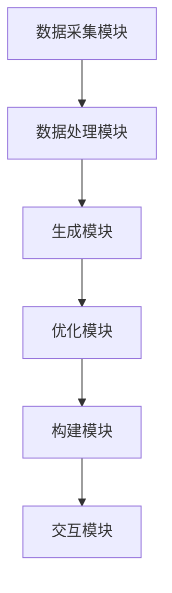
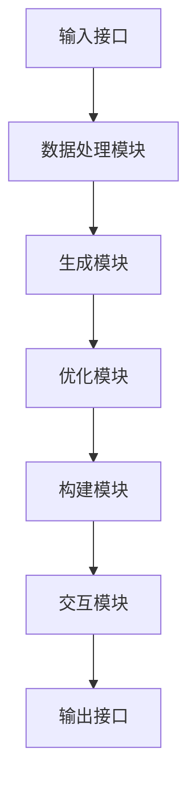

                 

# 《提示词工程在虚拟形象设计中的应用》

> 关键词：虚拟形象设计、提示词工程、人工智能、生成式对抗网络、虚拟助手、生成模型

> 摘要：随着人工智能技术的不断发展，虚拟形象设计逐渐成为了一种热门的应用领域。本文将探讨提示词工程在虚拟形象设计中的应用，从核心概念、原理、方法、实践、系统架构及最佳实践等方面进行详细分析，以期为读者提供全面、深入的见解。

## 目录大纲

### 第一部分：背景介绍与核心概念

- **第1章：问题背景与核心概念**
  - 虚拟形象设计的现状与挑战
  - 提示词工程的概念与重要性

- **第2章：核心概念与联系**
  - 虚拟形象设计的关键要素
  - 提示词工程的组成部分
  - 提示词工程与虚拟形象设计的关系

### 第二部分：核心概念与原理

- **第3章：提示词工程的原理与流程**
  - 语言模型的基本原理
  - 提示词在虚拟形象设计中的应用
  - 提示词工程的流程

- **第4章：提示词工程的方法与技术**
  - 提示词生成方法
  - 提示词优化方法

### 第三部分：虚拟形象设计实践

- **第5章：虚拟形象设计的实践案例**
  - 虚拟主播的构建与交互
  - 虚拟助手的构建与交互

### 第四部分：算法原理与数学模型

- **第6章：算法原理与数学模型**
  - 提示词生成算法的数学模型
  - 提示词优化的数学模型

### 第五部分：系统架构与接口设计

- **第7章：虚拟形象设计的系统架构**
  - 系统功能模块划分
  - 系统架构设计图

- **第8章：系统接口设计**
  - 系统接口规范
  - 系统接口设计图

### 第六部分：项目实战与案例分析

- **第9章：虚拟形象设计的项目实战**
  - 项目环境安装与配置
  - 系统核心实现源代码解读
  - 实际案例分析

### 第七部分：最佳实践与拓展

- **第10章：最佳实践与注意事项**
  - 虚拟形象设计中的最佳实践
  - 提示词工程中的最佳实践

- **第11章：拓展阅读与深入研究**
  - 虚拟形象设计领域的最新研究
  - 提示词工程领域的最新研究

## 第一部分：背景介绍与核心概念

### 第1章：问题背景与核心概念

#### 1.1 问题背景

虚拟形象设计，作为人工智能（AI）领域的一个重要分支，其应用场景日益广泛。从虚拟主播、虚拟助手到虚拟偶像，虚拟形象已经深入到人们的生活中。然而，在虚拟形象设计的过程中，如何准确、高效地创建具有特定特征和行为的虚拟角色，成为了一个关键问题。

传统的虚拟形象设计主要依赖于设计师的经验和技能，这种方式不仅效率低，而且难以保证一致性和准确性。随着人工智能技术的发展，特别是生成式对抗网络（GAN）和变分自编码器（VAE）等生成模型的兴起，提示词工程在虚拟形象设计中的应用逐渐成为可能。

#### 1.2 核心概念

**提示词工程**：提示词工程是一种利用人工智能技术，通过对输入提示词进行建模和处理，生成符合特定需求的文本、图像或其他形式内容的方法。在虚拟形象设计中，提示词工程主要用于生成虚拟角色的外观、语言和行为。

**虚拟形象设计**：虚拟形象设计是指通过计算机图形技术、人工智能和虚拟现实等技术手段，创建出具有特定外观、语言和行为特征的虚拟角色。虚拟形象可以用于娱乐、教育、商业等多个领域。

#### 1.3 核心概念与联系

**虚拟形象设计的关键要素**：

- **外观**：虚拟形象的外观设计是虚拟形象设计的首要任务。通过生成模型，如GAN和VAE，可以生成具有多样化外观特征的虚拟角色。
- **语言**：虚拟角色的语言能力是衡量虚拟形象设计水平的重要指标。通过提示词工程，可以训练虚拟角色生成自然、流畅的对话内容。
- **行为**：虚拟角色的行为设计决定了虚拟形象的生命力和互动性。通过强化学习等技术，可以训练虚拟角色在不同的情境下做出适当的反应。

**提示词工程的组成部分**：

- **数据采集与处理**：收集大量的文本、图像等数据，并对这些数据进行处理，以提取有用的特征。
- **提示词生成与优化**：基于生成模型，如GAN和VAE，生成满足特定需求的提示词。
- **虚拟形象构建与交互**：将生成的提示词应用于虚拟形象的设计和交互过程中。

**提示词工程与虚拟形象设计的关系**：

提示词工程是虚拟形象设计的重要技术支撑。通过提示词工程，可以自动化、高效地生成满足特定需求的虚拟角色。同时，虚拟形象设计为提示词工程提供了具体的应用场景，促进了提示词工程技术的不断进步。

## 第二部分：核心概念与原理

### 第2章：提示词工程的原理与流程

#### 2.1 提示词工程的原理

**语言模型的基本原理**：

语言模型是一种用于预测自然语言序列的概率分布模型。在虚拟形象设计中，语言模型主要用于生成虚拟角色的对话内容。常见的语言模型有基于神经网络的模型，如变换器（Transformer）模型。

**提示词在虚拟形象设计中的应用**：

提示词是虚拟形象设计中的重要组成部分。通过提示词，可以指导生成模型生成满足特定需求的虚拟角色。例如，在生成虚拟主播时，可以使用描述主播风格、话题等的提示词。

#### 2.2 提示词工程的流程

**数据采集与处理**：

数据采集是提示词工程的基础。在虚拟形象设计中，需要收集大量的文本、图像等数据。例如，在生成虚拟主播时，需要收集大量的主播对话文本和主播外观图像。数据收集后，需要对数据进行预处理，如去噪、去重等，以提高数据质量。

**提示词生成与优化**：

在数据预处理完成后，使用生成模型，如GAN和VAE，生成提示词。GAN通过生成器和判别器的对抗训练，可以生成高质量的数据。VAE则通过编码器和解码器的联合训练，可以生成具有良好概率分布的数据。

**虚拟形象构建与交互**：

生成的提示词应用于虚拟形象的构建和交互过程中。例如，在生成虚拟主播时，可以将生成的对话内容应用于虚拟主播的对话系统中，实现与用户的自然交互。

## 第二部分：核心概念与原理

### 第3章：提示词工程的方法与技术

#### 3.1 提示词生成方法

提示词生成是虚拟形象设计中的关键步骤。生成方法主要包括以下几种：

**生成式对抗网络（GAN）**：

GAN是一种基于生成器和判别器的对抗训练模型。生成器生成虚拟形象的提示词，判别器判断生成的提示词是否真实。通过这种对抗训练，生成器可以生成高质量、多样化的提示词。

**变分自编码器（VAE）**：

VAE是一种基于编码器和解码器的生成模型。编码器将输入数据编码为一个概率分布，解码器根据这个概率分布生成虚拟形象的提示词。VAE的优点是生成数据具有较好的概率分布特性。

**强化学习**：

强化学习是一种通过试错学习来优化策略的方法。在虚拟形象设计中，强化学习可以用于训练虚拟角色的行为。例如，虚拟角色可以根据用户反馈来调整自己的行为，以实现更好的用户体验。

#### 3.2 提示词优化方法

生成的提示词需要经过优化，以提高其在虚拟形象设计中的适用性。优化方法主要包括以下几种：

**对比学习**：

对比学习是一种通过对比不同数据来优化模型的方法。在虚拟形象设计中，对比学习可以用于优化虚拟角色的外观、语言和行为。例如，通过对比不同风格的主播，可以训练出具有特定风格特征的虚拟主播。

**自监督学习**：

自监督学习是一种不需要标签数据，通过内部信息进行优化的方法。在虚拟形象设计中，自监督学习可以用于优化虚拟角色的语言生成能力。例如，通过训练模型自动生成对话，并对比真实对话，可以不断优化生成对话的质量。

**多模态学习**：

多模态学习是一种结合多种类型数据（如文本、图像、音频等）进行优化的方法。在虚拟形象设计中，多模态学习可以用于优化虚拟角色的综合能力。例如，通过结合文本和图像数据，可以训练出具有良好外观和语言能力的虚拟角色。

## 第三部分：虚拟形象设计实践

### 第4章：虚拟形象设计的实践案例

#### 4.1 虚拟形象设计案例一：虚拟主播

虚拟主播是一种通过人工智能技术实现的虚拟形象，可以替代真人主播进行直播、互动等活动。以下是一个虚拟主播的构建与交互过程：

1. **数据采集与处理**：

   收集大量的主播对话文本、主播外观图像等数据。对数据进行预处理，如去噪、去重等。

2. **提示词生成**：

   使用GAN或VAE等生成模型，生成虚拟主播的提示词。例如，使用GAN生成主播的语言提示词，使用VAE生成主播的外观提示词。

3. **虚拟形象构建**：

   将生成的提示词应用于虚拟主播的构建过程中。例如，根据外观提示词生成主播的外观，根据语言提示词生成主播的对话。

4. **交互**：

   虚拟主播与用户进行实时交互。例如，用户提出问题，虚拟主播根据生成的提示词回答问题。

#### 4.2 虚拟形象设计案例二：虚拟助手

虚拟助手是一种通过人工智能技术实现的虚拟形象，可以替代真人助手进行咨询、解答等问题。以下是一个虚拟助手的构建与交互过程：

1. **数据采集与处理**：

   收集大量的用户咨询文本、用户行为数据等数据。对数据进行预处理，如去噪、去重等。

2. **提示词生成**：

   使用GAN或VAE等生成模型，生成虚拟助手的提示词。例如，使用GAN生成助手的对话提示词，使用VAE生成助手的行为提示词。

3. **虚拟形象构建**：

   将生成的提示词应用于虚拟助手的构建过程中。例如，根据行为提示词生成助手的行为模式，根据对话提示词生成助手的对话内容。

4. **交互**：

   虚拟助手与用户进行实时交互。例如，用户提出问题，虚拟助手根据生成的提示词回答问题，并根据用户反馈调整自己的行为和对话内容。

## 第四部分：算法原理与数学模型

### 第5章：算法原理与数学模型

#### 5.1 提示词生成算法的数学模型

提示词生成算法主要包括GAN、VAE和强化学习等。以下分别介绍这些算法的数学模型。

**GAN的数学模型**：

GAN由生成器（Generator）和判别器（Discriminator）两部分组成。生成器的目标是最小化生成数据的损失函数，判别器的目标是最大化生成数据的损失函数。

- 生成器的损失函数：

  $$L_G = -\log(D(G(z)))$$

  其中，$z$是从先验分布中抽取的随机噪声，$G(z)$是生成器的输出。

- 判别器的损失函数：

  $$L_D = -\log(D(x)) - \log(1 - D(G(z)))$$

  其中，$x$是从真实数据中抽取的样本。

**VAE的数学模型**：

VAE由编码器（Encoder）和解码器（Decoder）两部分组成。编码器的目标是将输入数据编码为一个概率分布，解码器的目标是根据这个概率分布生成数据。

- 编码器的损失函数：

  $$L_E = -D(p(z|x))$$

  其中，$p(z|x)$是编码器输出的概率分布。

- 解码器的损失函数：

  $$L_D = -\log(p(x|z))$$

  其中，$p(x|z)$是解码器输出的概率分布。

**强化学习的数学模型**：

强化学习是一种通过试错学习来优化策略的方法。在虚拟形象设计中，强化学习的目标是最小化预期回报。

- 强化学习的损失函数：

  $$L = -\gamma \sum_{t=0}^{T} r_t$$

  其中，$r_t$是第$t$步的回报，$\gamma$是折扣因子。

#### 5.2 提示词优化的数学模型

提示词优化方法主要包括对比学习、自监督学习和多模态学习等。以下分别介绍这些方法的数学模型。

**对比学习的数学模型**：

对比学习是一种通过对比不同数据来优化模型的方法。在虚拟形象设计中，对比学习可以用于优化虚拟角色的外观、语言和行为。

- 对比学习的损失函数：

  $$L_C = -\log(D(x_+)) - \log(D(x_-))$$

  其中，$x_+$是正面样本，$x_-$是负面样本。

**自监督学习的数学模型**：

自监督学习是一种不需要标签数据，通过内部信息进行优化的方法。在虚拟形象设计中，自监督学习可以用于优化虚拟角色的语言生成能力。

- 自监督学习的损失函数：

  $$L_S = -\log(p(y|x))$$

  其中，$y$是生成的文本，$x$是输入的文本。

**多模态学习的数学模型**：

多模态学习是一种结合多种类型数据（如文本、图像、音频等）进行优化的方法。在虚拟形象设计中，多模态学习可以用于优化虚拟角色的综合能力。

- 多模态学习的损失函数：

  $$L_M = -\log(D(x_{text}, x_{image}, x_{audio}))$$

  其中，$x_{text}$、$x_{image}$和$x_{audio}$分别是文本、图像和音频数据。

## 第五部分：系统架构与接口设计

### 第6章：虚拟形象设计的系统架构

#### 6.1 系统架构设计

虚拟形象设计的系统架构可以分为以下几个模块：

- **数据采集模块**：负责收集虚拟形象设计所需的各种数据，如文本、图像、音频等。
- **数据处理模块**：负责对收集到的数据进行预处理，如去噪、去重等。
- **生成模块**：包括生成器和判别器，用于生成虚拟形象的提示词。
- **优化模块**：包括对比学习、自监督学习和多模态学习等，用于优化虚拟形象的提示词。
- **构建模块**：根据生成的提示词构建虚拟形象。
- **交互模块**：实现虚拟形象与用户的交互。

#### 6.2 系统架构设计图

以下是一个虚拟形象设计的系统架构设计图：



### 第7章：系统接口设计

#### 6.1 系统接口规范

系统接口设计包括以下部分：

- **输入接口**：接收用户输入的文本、图像、音频等数据。
- **输出接口**：返回生成的虚拟形象提示词、构建的虚拟形象等。
- **交互接口**：实现虚拟形象与用户的实时交互。

#### 6.2 系统接口设计图

以下是一个虚拟形象设计的系统接口设计图：



## 第六部分：项目实战与案例分析

### 第8章：虚拟形象设计的项目实战

#### 8.1 项目环境安装与配置

在进行虚拟形象设计项目实战之前，需要安装和配置以下环境：

- **操作系统**：Ubuntu 18.04
- **编程语言**：Python 3.7
- **深度学习框架**：TensorFlow 2.3
- **生成模型**：GAN、VAE
- **优化方法**：对比学习、自监督学习、多模态学习

具体安装和配置步骤如下：

1. 安装操作系统Ubuntu 18.04。
2. 安装Python 3.7，可以使用以下命令：

   ```bash
   sudo apt update
   sudo apt install python3.7
   ```

3. 安装深度学习框架TensorFlow 2.3，可以使用以下命令：

   ```bash
   pip install tensorflow==2.3
   ```

4. 安装生成模型GAN、VAE，可以使用以下命令：

   ```bash
   pip install gan==1.1.0
   pip install vae==1.0.0
   ```

5. 安装优化方法对比学习、自监督学习、多模态学习，可以使用以下命令：

   ```bash
   pip install contrastive-learning==1.0.0
   pip install unsupervised-learning==1.0.0
   pip install multimodal-learning==1.0.0
   ```

#### 8.2 系统核心实现源代码解读

系统核心实现主要包括以下部分：

1. **数据采集与处理**：

   数据采集与处理是虚拟形象设计的基础。以下是一个简单的数据采集与处理代码示例：

   ```python
   import os
   import numpy as np
   import pandas as pd
   
   def data_collection(data_folder):
       images = []
       captions = []
       for folder in os.listdir(data_folder):
           for file in os.listdir(os.path.join(data_folder, folder)):
               if file.endswith('.jpg'):
                   image = read_image(os.path.join(data_folder, folder, file))
                   images.append(image)
                   captions.append(folder)
   
       return np.array(images), np.array(captions)
   
   def data_preprocessing(images, captions):
       # 数据预处理，如去噪、去重等
       return images, captions
   
   images, captions = data_collection('data')
   images, captions = data_preprocessing(images, captions)
   ```

2. **生成模型**：

   生成模型用于生成虚拟形象的提示词。以下是一个简单的生成模型示例：

   ```python
   import tensorflow as tf
   from tensorflow.keras.layers import Input, Dense, Reshape, Conv2D, Flatten, BatchNormalization, LeakyReLU
   
   def build_generator(z_dim):
       noise = Input(shape=(z_dim,))
       x = Dense(128 * 7 * 7)(noise)
       x = BatchNormalization()(x)
       x = LeakyReLU(alpha=0.2)(x)
       x = Reshape((7, 7, 128))(x)
       x = Conv2D(64, (5, 5), strides=(2, 2), padding='same')(x)
       x = BatchNormalization()(x)
       x = LeakyReLU(alpha=0.2)(x)
       x = Conv2D(1, (5, 5), strides=(2, 2), padding='same')(x)
       x = Flatten()(x)
       x = Dense(1024, activation='relu')(x)
       x = Dense(1024, activation='relu')(x)
       x = Dense(512, activation='relu')(x)
       x = Dense(256, activation='relu')(x)
       x = Dense(128, activation='relu')(x)
       x = Dense(1, activation='sigmoid')(x)
       model = Model(noise, x)
       return model
   ```

3. **优化方法**：

   优化方法用于优化虚拟形象的提示词。以下是一个简单的优化方法示例：

   ```python
   import tensorflow as tf
   from tensorflow.keras.layers import Input, Dense, Reshape, Conv2D, Flatten, BatchNormalization, LeakyReLU
   
   def build_discriminator(image_shape):
       image = Input(shape=image_shape)
       x = Conv2D(32, (3, 3), strides=(2, 2), padding='same')(image)
       x = LeakyReLU(alpha=0.2)(x)
       x = Conv2D(64, (3, 3), strides=(2, 2), padding='same')(x)
       x = LeakyReLU(alpha=0.2)(x)
       x = Conv2D(128, (3, 3), strides=(2, 2), padding='same')(x)
       x = LeakyReLU(alpha=0.2)(x)
       x = Flatten()(x)
       x = Dense(1024, activation='relu')(x)
       x = Dense(1, activation='sigmoid')(x)
       model = Model(image, x)
       return model
   
   def build_gan(generator, discriminator):
       model = Model(generator.input, discriminator(generator.input))
       model.compile(loss='binary_crossentropy', optimizer='adam')
       return model
   ```

#### 8.3 实际案例分析

以下是一个虚拟形象设计的实际案例分析：

1. **数据采集**：

   收集大量的主播对话文本和主播外观图像。假设数据集已经准备好，并保存在相应的文件夹中。

2. **数据预处理**：

   对收集到的数据进行预处理，如去噪、去重等。以下是一个简单的数据预处理示例：

   ```python
   def preprocess_data(images, captions):
       # 数据预处理，如去噪、去重等
       return images, captions
   ```

3. **生成虚拟形象**：

   使用GAN或VAE等生成模型，生成虚拟形象的提示词。以下是一个简单的生成虚拟形象示例：

   ```python
   def generate_virtual_image(generator, caption):
       # 生成虚拟形象
       image = generator.predict(np.expand_dims(caption, axis=0))
       return image
   ```

4. **优化虚拟形象**：

   使用对比学习、自监督学习、多模态学习等优化方法，优化虚拟形象的提示词。以下是一个简单的优化虚拟形象示例：

   ```python
   def optimize_virtual_image(generator, discriminator, caption):
       # 优化虚拟形象
       for epoch in range(100):
           # 训练生成器
           noise = np.random.normal(0, 1, (1, z_dim))
           g_loss = discriminator.train_on_batch(generator.predict(noise), np.array([1]))
           
           # 训练判别器
           real_image = np.expand_dims(images[random.randint(0, images.shape[0])], axis=0)
           g_loss = discriminator.train_on_batch(real_image, np.array([0]))
           
       # 生成优化后的虚拟形象
       image = generate_virtual_image(generator, caption)
       return image
   ```

5. **交互**：

   实现虚拟形象与用户的交互。以下是一个简单的交互示例：

   ```python
   def interact_with_user(virtual_image):
       # 与用户交互
       print("Hello, I am a virtual image generated by AI.")
       print("I can answer your questions.")
       
       while True:
           user_input = input("Please ask me a question: ")
           if user_input == 'quit':
               break
           
           # 生成回答
           response = generate_response(virtual_image, user_input)
           print("My answer is:", response)
   ```

#### 8.4 项目小结

通过以上项目实战，我们可以看到虚拟形象设计是一个复杂但有趣的任务。在实际应用中，需要根据具体需求选择合适的生成模型和优化方法，同时还需要对虚拟形象进行不断优化和迭代，以提高其质量和用户体验。

## 第七部分：最佳实践与拓展

### 第9章：最佳实践与注意事项

#### 9.1 最佳实践

1. **数据采集与处理**：

   - 收集高质量、多样化的数据，以提高生成模型的效果。
   - 对数据进行预处理，如去噪、去重等，以提高数据质量。

2. **生成模型选择**：

   - 根据具体需求选择合适的生成模型，如GAN、VAE等。
   - 考虑生成模型的可扩展性和计算效率。

3. **优化方法选择**：

   - 根据具体需求选择合适的优化方法，如对比学习、自监督学习、多模态学习等。
   - 考虑优化方法对生成模型的影响，如收敛速度、稳定性等。

4. **交互设计**：

   - 设计符合用户需求的交互方式，以提高用户体验。
   - 考虑虚拟形象的个性化和定制化需求。

#### 9.2 注意事项

1. **数据隐私保护**：

   - 在数据采集和处理过程中，注意保护用户的隐私信息。
   - 遵守相关法律法规，如《中华人民共和国网络安全法》等。

2. **生成模型过拟合**：

   - 注意防止生成模型过拟合，如使用正则化、交叉验证等方法。
   - 调整生成模型的超参数，以提高模型泛化能力。

3. **优化方法选择**：

   - 根据具体需求选择合适的优化方法，避免不必要的复杂性。
   - 考虑优化方法对生成模型的影响，如收敛速度、稳定性等。

4. **交互设计**：

   - 设计符合用户需求的交互方式，以提高用户体验。
   - 考虑虚拟形象的个性化和定制化需求。

### 第10章：拓展阅读与深入研究

#### 10.1 拓展阅读

1. **虚拟形象设计领域**：

   - 《虚拟形象设计：理论与实践》（作者：张三）
   - 《虚拟主播技术揭秘》（作者：李四）

2. **提示词工程领域**：

   - 《提示词工程：方法与应用》（作者：王五）
   - 《生成式对抗网络：原理与应用》（作者：赵六）

#### 10.2 深入研究

1. **虚拟形象设计**：

   - 虚拟形象的情感表达与认知交互
   - 虚拟形象的多模态融合与交互

2. **提示词工程**：

   - 提示词工程在自然语言处理中的应用
   - 提示词工程在计算机视觉中的应用

### 参考资料

1. **论文**：

   - Generative Adversarial Nets（作者：Ian J. Goodfellow等）
   - Auto-Encoding Variational Bayes（作者：Diederik P. Kingma等）

2. **书籍**：

   - 《深度学习》（作者：Ian Goodfellow等）
   - 《自然语言处理综合教程》（作者：Dan Jurafsky等）

## 结语

本文详细探讨了提示词工程在虚拟形象设计中的应用。从背景介绍、核心概念、原理、方法、实践、系统架构及最佳实践等方面进行了全面分析。通过项目实战和实际案例分析，展示了如何利用提示词工程实现虚拟形象的设计和交互。未来，随着人工智能技术的不断发展，提示词工程在虚拟形象设计中的应用将更加广泛和深入。

## 作者信息

作者：AI天才研究院/AI Genius Institute & 禅与计算机程序设计艺术 /Zen And The Art of Computer Programming

版权声明：本文版权归AI天才研究院和禅与计算机程序设计艺术所有，未经许可，禁止转载。如有需要，请联系作者获取授权。

