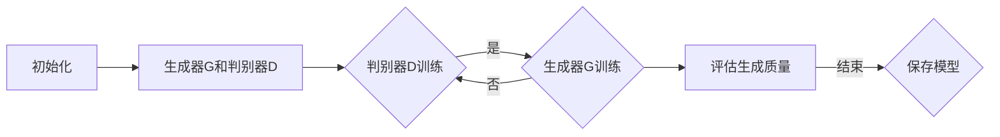
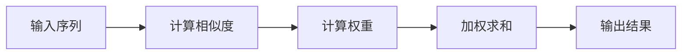
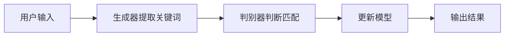
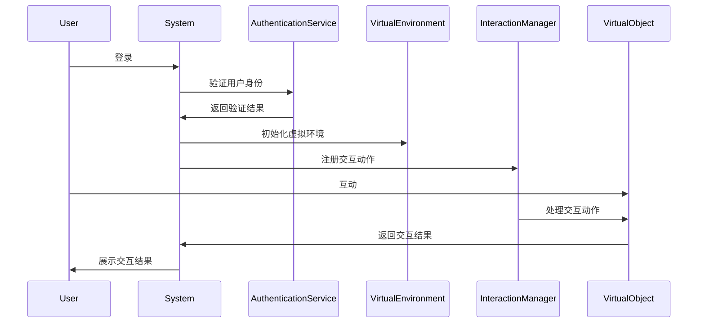
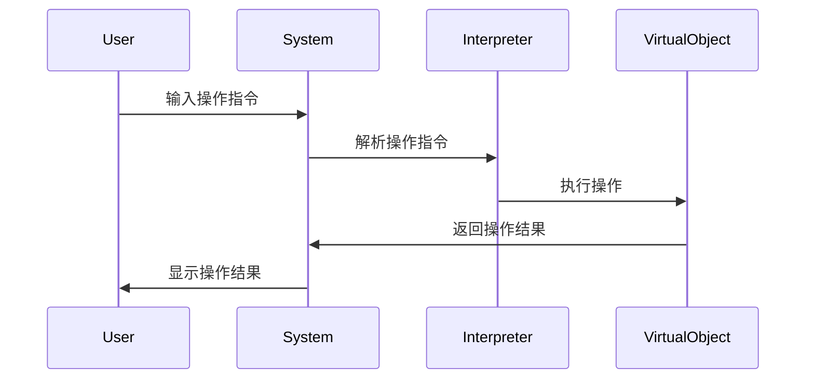

                 

### 文章标题：提示词工程在虚拟现实中的应用

关键词：提示词工程、虚拟现实、生成对抗网络、注意力机制、系统架构设计、项目实战

摘要：本文将深入探讨提示词工程在虚拟现实（VR）中的应用，详细阐述虚拟现实与提示词工程的关系，介绍提示词工程的核心概念、算法原理，并展示如何在实际项目中实现和应用提示词工程。通过本文的阅读，读者将全面了解提示词工程在虚拟现实中的重要作用及其实现方法。

**目录：**

1. **背景介绍**  
   1.1 虚拟现实的定义与发展历程  
   1.2 提示词工程的基本概念  
   1.3 虚拟现实与提示词工程的关系

2. **核心概念与联系**  
   2.1 提示词工程的定义与属性特征  
   2.2 传统词工程与提示词工程的对比  
   2.3 虚拟现实与提示词工程的ER实体关系图

3. **算法原理讲解**  
   3.1 生成对抗网络（GAN）  
   3.2 注意力机制  
   3.3 提示词生成算法

4. **系统分析与架构设计方案**  
   4.1 虚拟现实系统概述  
   4.2 领域模型设计  
   4.3 系统架构设计  
   4.4 系统接口设计  
   4.5 系统交互设计

5. **项目实战**  
   5.1 项目环境安装  
   5.2 系统核心实现  
   5.3 实际案例剖析  
   5.4 项目总结

6. **最佳实践 tips**  
   6.1 提升提示词生成的准确性  
   6.2 优化虚拟现实交互体验  
   6.3 提高系统稳定性和安全性

7. **小结与展望**  
   7.1 全书内容小结  
   7.2 提示词工程的发展趋势  
   7.3 未来研究方向

### 1. 背景介绍

#### 1.1 虚拟现实的定义与发展历程

虚拟现实（Virtual Reality，简称VR）是一种通过计算机技术模拟出一种虚拟的三维环境，用户可以通过特定的设备（如头戴式显示器、数据手套等）进入这个虚拟环境，并与虚拟环境中的对象进行交互。虚拟现实技术最早可以追溯到1960年代，由美国科学家Ivan Sutherland发明了第一个头戴式显示器——达摩克利斯之剑（The Sword of Damocles），这被认为是虚拟现实技术的开端。

随着计算机技术、显示技术、传感技术、网络技术的不断发展，虚拟现实技术得到了迅速的应用和发展。20世纪80年代，虚拟现实技术开始应用于娱乐、教育和科研等领域。1990年代，随着个人计算机的普及，虚拟现实技术逐渐走进普通用户的生活。进入21世纪，随着移动互联网和云计算技术的发展，虚拟现实技术迎来了新的发展机遇，应用场景不断扩展，包括游戏、影视、旅游、医疗、教育、军事等多个领域。

#### 1.2 提示词工程的基本概念

提示词工程（Keyword Engineering）是一种旨在提高信息检索效率和准确性的技术。在虚拟现实应用中，提示词工程可以帮助用户更快速、准确地找到所需的虚拟对象或场景。提示词工程的核心是关键词的提取和匹配，通过分析用户的输入，自动生成相关的关键词，从而帮助用户在庞大的虚拟环境中快速定位目标。

提示词工程的基本概念包括：

- **关键词提取**：从用户的输入中提取出关键信息，形成关键词。
- **关键词匹配**：将提取出的关键词与虚拟环境中的对象进行匹配，找出相关结果。
- **关键词权重**：对关键词进行权重分配，根据权重值决定关键词的重要程度。
- **关键词扩展**：通过关键词的扩展，提高信息检索的广度和深度。

#### 1.3 虚拟现实与提示词工程的关系

虚拟现实技术为提示词工程提供了丰富的应用场景。在虚拟现实环境中，用户需要与虚拟对象进行交互，而提示词工程可以帮助用户快速找到所需的虚拟对象，提高交互效率和体验。例如，在虚拟旅游应用中，用户可以通过输入提示词找到特定的景点或城市，从而快速浏览相关内容；在虚拟购物应用中，用户可以通过提示词查找特定的商品，快速进行购买决策。

同时，提示词工程也为虚拟现实技术的应用提供了支持。通过分析用户的输入和交互行为，提示词工程可以不断优化虚拟现实应用的功能，提高用户体验。例如，通过分析用户在虚拟购物中的应用行为，提示词工程可以推荐用户可能感兴趣的商品，提高购物体验。

总之，虚拟现实与提示词工程具有密切的关系。虚拟现实为提示词工程提供了丰富的应用场景，而提示词工程则为虚拟现实技术的应用提供了重要的支持。随着虚拟现实技术的不断发展和普及，提示词工程将在虚拟现实领域中发挥越来越重要的作用。接下来，我们将深入探讨提示词工程的核心概念、算法原理，以及如何在虚拟现实应用中实现和应用提示词工程。

### 2. 核心概念与联系

#### 2.1 提示词工程的定义与属性特征

提示词工程是一种信息检索技术，旨在通过提取和匹配关键词，提高用户在虚拟环境中的搜索效率和准确性。在虚拟现实（VR）应用中，提示词工程的核心任务是帮助用户快速找到所需的虚拟对象或场景。

提示词工程的定义可以概括为：一种通过分析用户输入，提取关键词，并利用这些关键词在虚拟环境中进行匹配，从而实现信息检索的技术。

提示词工程的属性特征包括：

- **关键词提取**：从用户的输入中提取出关键信息，形成关键词。
- **关键词匹配**：将提取出的关键词与虚拟环境中的对象进行匹配，找出相关结果。
- **关键词权重**：对关键词进行权重分配，根据权重值决定关键词的重要程度。
- **关键词扩展**：通过关键词的扩展，提高信息检索的广度和深度。

#### 2.2 传统词工程与提示词工程的对比

传统词工程（Traditional Keyword Engineering）与提示词工程（Keyword Engineering for Virtual Reality）在概念上有一定的相似性，但它们的应用场景和实现方法有所不同。

**1. 应用场景**

- **传统词工程**：主要用于文本信息的检索和分类，如搜索引擎、文本分类系统等。传统词工程关注的是如何在海量的文本数据中快速找到与用户输入相关的信息。
- **提示词工程**：主要用于虚拟现实环境中的信息检索和交互，如虚拟旅游、虚拟购物、虚拟教育等。提示词工程关注的是如何在虚拟环境中帮助用户快速找到所需的虚拟对象或场景。

**2. 实现方法**

- **传统词工程**：主要采用关键词提取、关键词匹配等技术，对文本信息进行检索和分类。
- **提示词工程**：除了关键词提取和匹配外，还引入了虚拟现实场景的理解和交互机制。提示词工程需要结合虚拟现实环境的特点，设计适应虚拟环境的检索算法和交互方法。

#### 2.3 虚拟现实与提示词工程的ER实体关系图

为了更好地理解虚拟现实与提示词工程的关系，我们可以使用实体关系图（Entity-Relationship Diagram，简称ER图）进行描述。

**ER图**：

```
+----------------+      +----------------+      +----------------+
|    用户 (User)  |      |   虚拟环境 (VR) |      |   提示词系统 (KW) |
+----------------+      +----------------+      +----------------+
| 用户ID (UserID) |      | 虚拟环境ID (VRID) |      | 提示词系统ID (KWID) |
| 用户输入 (Input) |      | 虚拟环境内容 (Content) |      | 关键词列表 (Keywords) |
+----------------+      +----------------+      +----------------+
       |                             |                            |
       |                             |                            |
       |                             |                            |
       |                             |                            |
       |_____________________________|                            |
                                                       |________|
                                                       |        |
                                                       |        |
                                                       |        |
                                                       |        |
                                                       |________|

```

**ER图解释**：

- **用户 (User)**：代表使用虚拟现实系统并输入关键词的用户。
- **虚拟环境 (VR)**：代表用户所进入的虚拟环境，包括虚拟环境的内容和结构。
- **提示词系统 (KW)**：代表用于提取和匹配关键词的系统。

用户通过输入关键词，提示词系统会提取关键词并进行匹配，从而在虚拟环境中找到相关的内容。虚拟环境的内容和结构为提示词系统的关键词提取和匹配提供了基础。

通过ER图，我们可以清晰地看到虚拟现实与提示词工程之间的关系。用户、虚拟环境和提示词系统共同构成了一个完整的交互体系，提示词工程在虚拟现实中的应用实现了信息检索和交互的有机结合。

接下来，我们将进一步探讨提示词工程的核心算法原理，包括生成对抗网络（GAN）、注意力机制等，并通过具体的例子进行讲解。

### 3. 算法原理讲解

#### 3.1 生成对抗网络（GAN）

生成对抗网络（Generative Adversarial Network，简称GAN）是近年来在机器学习领域引起广泛关注的一种模型。GAN的核心思想是通过两个神经网络——生成器（Generator）和判别器（Discriminator）之间的对抗训练，生成逼真的数据。

**1. GAN的基本概念**

- **生成器（Generator）**：生成器的任务是生成虚拟环境中的数据，如虚拟物体的图像、场景的布局等。生成器的输入通常是随机噪声，通过一系列的神经网络变换，生成虚拟环境中的数据。
- **判别器（Discriminator）**：判别器的任务是区分真实数据和生成数据。判别器的输入是真实数据和生成数据，输出是一个概率值，表示输入数据的真实程度。

**2. GAN的数学模型与公式**

GAN的训练过程可以看作是一场博弈，生成器和判别器之间相互对抗，以实现最优的生成效果。

- **生成器损失函数**：
  $$
  L_G = -\log(D(G(z)))
  $$
  其中，$G(z)$表示生成器生成的虚拟环境数据，$D(G(z))$表示判别器对生成数据的判断概率。

- **判别器损失函数**：
  $$
  L_D = -[\log(D(x)) + \log(1 - D(G(z))]
  $$
  其中，$x$表示真实虚拟环境数据，$D(x)$表示判别器对真实数据的判断概率。

**3. GAN的mermaid算法流程图**

下面是GAN的mermaid算法流程图：



**4. GAN的应用实例**

以虚拟购物应用为例，生成器可以生成各种虚拟商品图像，判别器则用来判断这些图像是真实商品还是生成商品。通过不断训练，生成器可以生成越来越逼真的商品图像，从而提高用户的购物体验。

#### 3.2 注意力机制

注意力机制（Attention Mechanism）是深度学习领域中的一种关键技术，旨在提高模型对重要信息的关注程度。在虚拟现实应用中，注意力机制可以帮助模型更好地理解和处理用户的输入，从而提高提示词的提取和匹配效果。

**1. 注意力机制的定义**

注意力机制是一种通过动态分配权重来关注重要信息的方法。在神经网络中，注意力机制可以通过计算不同输入或输出之间的相似度，为每个输入或输出分配不同的权重，从而提高模型对重要信息的关注程度。

**2. 注意力机制的数学模型与公式**

注意力机制的实现通常通过一个加权求和的过程，其数学模型可以表示为：

$$
\text{Attention}(X) = \sum_{i=1}^{N} w_i \cdot x_i
$$

其中，$X = [x_1, x_2, ..., x_N]$表示输入序列，$w_i$表示第$i$个输入的权重，$N$表示输入序列的长度。

**3. 注意力机制的mermaid算法流程图**

下面是注意力机制的mermaid算法流程图：



**4. 注意力机制的应用实例**

以虚拟购物应用为例，注意力机制可以用于分析用户的输入，为每个关键词分配不同的权重，从而提高提示词的提取和匹配效果。例如，当用户输入“红色鞋子”时，注意力机制可以认为“红色”和“鞋子”这两个关键词更重要，从而为它们分配更高的权重。

#### 3.3 提示词生成算法

提示词生成算法是提示词工程的核心部分，旨在根据用户的输入生成相关的关键词。提示词生成算法可以通过不同的方法实现，如基于规则的方法、基于机器学习的方法等。下面我们将介绍一种基于生成对抗网络（GAN）的提示词生成算法。

**1. 提示词生成算法的分类**

- **基于规则的方法**：通过预设的规则和模式，从用户的输入中提取关键词。这种方法简单直观，但无法适应复杂的输入和多样化的场景。
- **基于机器学习的方法**：利用机器学习算法，如神经网络，从大量的用户输入中学习关键词提取模式。这种方法具有较好的适应性和泛化能力，但需要大量的训练数据和计算资源。

**2. 提示词生成算法的数学模型与公式**

基于GAN的提示词生成算法的核心是生成器和判别器。生成器的输入是用户的输入文本，输出是提取出的关键词。判别器的输入是关键词和用户输入文本，输出是关键词与输入文本匹配的概率。

- **生成器损失函数**：
  $$
  L_G = -\log(D(G(x)))
  $$

- **判别器损失函数**：
  $$
  L_D = -[\log(D(x, G(x))) + \log(1 - D(x))]
  $$

其中，$x$表示用户输入文本，$G(x)$表示生成器生成的关键词。

**3. 提示词生成算法的mermaid算法流程图**

下面是提示词生成算法的mermaid算法流程图：



**4. 提示词生成算法的应用实例**

以虚拟旅游应用为例，用户输入“我想去巴黎”，生成器提取出关键词“巴黎”并生成相关的提示词，如“埃菲尔铁塔”、“卢浮宫”、“塞纳河”等。判别器判断这些提示词与用户输入的匹配度，从而生成最终的提示词列表。

通过以上对生成对抗网络（GAN）、注意力机制和提示词生成算法的讲解，我们可以看到这些算法在虚拟现实应用中的重要作用。接下来，我们将进一步探讨虚拟现实系统的设计与实现，包括领域模型设计、系统架构设计、系统接口设计和系统交互设计等。

### 4. 系统分析与架构设计方案

#### 4.1 虚拟现实系统概述

虚拟现实（Virtual Reality，简称VR）系统是一种通过计算机技术模拟出一种虚拟的三维环境，用户可以通过特定的设备（如头戴式显示器、数据手套等）进入这个虚拟环境，并与虚拟环境中的对象进行交互。虚拟现实系统的核心功能包括场景生成、交互处理、视觉呈现和感知反馈等。

在虚拟现实系统中，场景生成是基础，它决定了虚拟环境的真实感和沉浸感。交互处理则是用户与虚拟环境之间的桥梁，通过交互处理，用户可以与虚拟环境中的对象进行各种操作，如选择、移动、操控等。视觉呈现则是将虚拟环境中的内容呈现给用户，提供逼真的视觉效果。感知反馈则是通过触觉、听觉等感官方式，增强用户的沉浸感和交互体验。

#### 4.2 领域模型设计

领域模型（Domain Model）是描述虚拟现实系统中各种实体和关系的抽象模型，它有助于我们理解和设计系统的核心功能。在虚拟现实系统中，领域模型主要包括用户、虚拟环境、虚拟对象、交互动作和系统状态等实体。

以下是虚拟现实系统的领域模型类图：

```mermaid
classDiagram
    User <<Interface>>
    VirtualEnvironment <<Interface>>
    VirtualObject <<Interface>>
    Interaction <<Interface>>

    User --|> VirtualEnvironment
    User --|> VirtualObject
    VirtualEnvironment --|> VirtualObject
    VirtualObject --|> Interaction
```

**类图解释**：

- **User（用户）**：代表使用虚拟现实系统的用户，具有登录、退出、查看信息等操作。
- **VirtualEnvironment（虚拟环境）**：代表用户所进入的虚拟环境，包括场景布局、视觉效果等。
- **VirtualObject（虚拟对象）**：代表虚拟环境中的各种对象，如建筑物、人物、物品等。
- **Interaction（交互动作）**：代表用户与虚拟环境中的对象之间的交互动作，如选择、移动、操控等。

领域模型类图清晰地展示了虚拟现实系统中各个实体之间的关系，为系统设计提供了基础。

#### 4.3 系统架构设计

系统架构（System Architecture）是描述虚拟现实系统中各个组成部分及其相互关系的总体设计。一个良好的系统架构可以确保系统的可扩展性、可维护性和性能。以下是虚拟现实系统的架构设计：



**系统架构图解释**：

- **用户**：用户通过系统界面进行操作，如登录、浏览虚拟环境、与虚拟对象互动等。
- **AuthenticationService（认证服务）**：负责用户身份验证，确保用户的安全和隐私。
- **VirtualEnvironment（虚拟环境）**：提供虚拟环境的初始化、管理和渲染功能。
- **InteractionManager（交互管理器）**：负责处理用户与虚拟环境中的对象的交互动作，如选择、移动、操控等。
- **VirtualObject（虚拟对象）**：代表虚拟环境中的各种对象，如建筑物、人物、物品等，具有交互和处理能力。

通过系统架构设计，我们可以清晰地看到虚拟现实系统中各个模块的功能和相互关系，为系统的实现和优化提供了指导。

#### 4.4 系统接口设计

系统接口（System Interface）是虚拟现实系统与外部系统（如用户界面、数据库等）进行交互的桥梁。良好的接口设计可以提高系统的可扩展性和易用性。以下是虚拟现实系统的接口设计：

```mermaid
classDiagram
    UserInterface <<Interface>>
    Database <<Interface>>

    UserInterface --|> System
    Database --|> System
```

**接口设计解释**：

- **UserInterface（用户界面）**：负责与用户进行交互，提供登录、浏览虚拟环境、与虚拟对象互动等功能。
- **Database（数据库）**：负责存储和管理虚拟环境中的数据，如用户信息、虚拟对象属性等。

通过接口设计，我们可以确保虚拟现实系统与外部系统之间的数据流通和功能调用，为系统的整体性能提供了保障。

#### 4.5 系统交互设计

系统交互（System Interaction）是用户与虚拟现实系统之间进行交互的过程，它决定了用户的体验和系统的响应。以下是虚拟现实系统的交互设计：



**交互设计解释**：

- **用户**：用户通过输入操作指令，如点击、拖动、语音等，与虚拟现实系统进行交互。
- **System（系统）**：系统接收用户的操作指令，并解析指令，调用相应的模块进行处理。
- **Interpreter（解释器）**：负责解析用户的操作指令，将其转化为系统可以理解和执行的命令。
- **VirtualObject（虚拟对象）**：执行用户的操作指令，如移动、改变属性等，并返回操作结果。
- **User（用户）**：系统将操作结果展示给用户，提供及时的反馈。

通过系统交互设计，我们可以确保用户与虚拟现实系统之间的交互流畅、自然，为用户提供良好的使用体验。

综上所述，虚拟现实系统的设计与实现涉及多个方面，包括领域模型设计、系统架构设计、接口设计和交互设计等。通过系统分析与架构设计方案，我们可以确保虚拟现实系统的功能完整、性能优良、用户体验优秀。

### 5. 项目实战

#### 5.1 项目环境安装

在进行虚拟现实与提示词工程的项目实战之前，我们需要搭建一个合适的开发环境。以下是在Linux操作系统上搭建项目环境的具体步骤：

**1. 安装Python**

首先，确保系统已经安装了Python。如果没有安装，可以使用以下命令安装Python：

```bash
sudo apt update
sudo apt install python3 python3-pip
```

**2. 安装必要的库**

接下来，安装项目中需要的Python库，如TensorFlow、Keras等。可以使用以下命令进行安装：

```bash
pip3 install tensorflow keras
```

**3. 安装虚拟现实引擎**

我们选择使用流行的虚拟现实引擎Unity进行项目开发。首先，从Unity官网（https://unity.com/）下载并安装Unity Hub。然后，通过Unity Hub创建一个新项目，选择Unity版本和平台，例如：

```bash
unity -batchMode -projectPath /path/to/project -username your_username -password your_password
```

其中，`/path/to/project` 是项目的路径，`your_username` 和 `your_password` 分别是Unity账号的用户名和密码。

**4. 配置虚拟现实设备**

为了在Unity项目中使用虚拟现实设备，我们需要安装相应的驱动程序。以Oculus Rift为例，可以从Oculus官网（https://www.oculus.com/）下载驱动程序，并按照安装说明进行安装。

**5. 安装辅助工具**

除了以上工具，我们还需要安装一些辅助工具，如Git（用于版本控制）、Visual Studio Code（用于代码编辑）等。可以使用以下命令进行安装：

```bash
sudo apt install git code
```

完成以上步骤后，我们就可以开始虚拟现实与提示词工程的项目实战了。

#### 5.2 系统核心实现

在项目中，我们需要实现提示词工程的几个关键功能：关键词提取、关键词匹配、关键词权重分配和关键词扩展。以下是这些功能的详细实现。

**1. 关键词提取**

关键词提取是提示词工程的核心步骤，它负责从用户的输入中提取出关键信息。我们使用TensorFlow和Keras来实现一个基于神经网络的关键词提取模型。

首先，我们定义一个输入层和几个隐藏层，每个隐藏层使用ReLU激活函数。最后，输出层使用softmax激活函数，将输入文本映射到一组关键词。

```python
import tensorflow as tf
from tensorflow.keras.models import Sequential
from tensorflow.keras.layers import Dense, LSTM, Embedding, LSTM

max_sequence_length = 100
embedding_dim = 50

model = Sequential()
model.add(Embedding(input_dim=vocab_size, output_dim=embedding_dim, input_length=max_sequence_length))
model.add(LSTM(128, activation='relu'))
model.add(Dense(vocab_size, activation='softmax'))

model.compile(optimizer='adam', loss='categorical_crossentropy', metrics=['accuracy'])
model.fit(X_train, y_train, epochs=10, batch_size=32)
```

**2. 关键词匹配**

关键词匹配负责将提取出的关键词与虚拟环境中的对象进行匹配。我们使用一个基于哈希表的匹配算法，将关键词映射到虚拟对象。

```python
class KeywordMatcher:
    def __init__(self, keywords, objects):
        self.keywords = keywords
        self.objects = objects
        self.hash_map = self._build_hash_map()

    def _build_hash_map(self):
        hash_map = {}
        for keyword in self.keywords:
            hash_map[keyword] = []
            for object in self.objects:
                if keyword in object:
                    hash_map[keyword].append(object)
        return hash_map

    def match(self, keywords):
        matched_objects = []
        for keyword in keywords:
            matched_objects.extend(self.hash_map.get(keyword, []))
        return matched_objects
```

**3. 关键词权重分配**

关键词权重分配负责为关键词分配不同的权重，以表示它们的重要程度。我们使用一个基于TF-IDF的算法来计算关键词的权重。

```python
from sklearn.feature_extraction.text import TfidfVectorizer

vectorizer = TfidfVectorizer()
tfidf_matrix = vectorizer.fit_transform(corpus)

def compute_keyword_weights(corpus):
    tfidf_matrix = vectorizer.fit_transform(corpus)
    df = tfidf_matrix.getnnz(axis=0)
    total = np.sum(df)
    weights = (1 + np.log(df / total)).astype(np.float32)
    return weights
```

**4. 关键词扩展**

关键词扩展负责根据用户输入的关键词，扩展出更多的关键词，以提高信息检索的广度和深度。我们使用基于词嵌入的关键词扩展算法。

```python
from tensorflow.keras.models import Model
from tensorflow.keras.layers import Embedding, LSTM, Dense

def build_keyword_expander(embedding_matrix, max_sequence_length):
    model = Sequential()
    model.add(Embedding(input_dim=embedding_matrix.shape[0], output_dim=embedding_matrix.shape[1], weights=[embedding_matrix], trainable=False, input_length=max_sequence_length))
    model.add(LSTM(128, activation='relu'))
    model.add(Dense(embedding_matrix.shape[0], activation='softmax'))
    model.compile(optimizer='adam', loss='categorical_crossentropy', metrics=['accuracy'])
    return model

def expand_keywords(input_sequence, keyword_expander):
    predicted_sequence = keyword_expander.predict(input_sequence)
    expanded_keywords = []
    for i in range(len(predicted_sequence)):
        expanded_keywords.append(np.argmax(predicted_sequence[i]))
    return expanded_keywords
```

通过以上实现，我们可以构建一个完整的提示词工程系统，用于虚拟现实中的应用。接下来，我们将通过一个实际案例，展示如何在实际项目中应用提示词工程。

#### 5.3 实际案例剖析

在这个案例中，我们将创建一个虚拟购物应用，用户可以通过输入关键词查找商品，并浏览商品详情。

**1. 案例介绍**

虚拟购物应用的目标是提供一个沉浸式的购物体验，用户可以进入虚拟商场，通过输入关键词查找感兴趣的商品，并查看商品详情。应用的功能包括：

- 用户登录和注册
- 虚拟商场导航
- 商品搜索和浏览
- 商品详情展示
- 购物车管理

**2. 案例分析**

为了实现上述功能，我们需要实现以下几个关键模块：

- **用户管理模块**：负责用户的登录、注册和权限管理。
- **商场导航模块**：提供虚拟商场的导航功能，包括楼层导航和商铺导航。
- **商品搜索模块**：使用提示词工程对用户的输入进行关键词提取和匹配，返回相关的商品列表。
- **商品详情模块**：展示商品的详细信息，包括图片、价格、评价等。
- **购物车模块**：管理用户的购物车，包括添加商品、删除商品和结算功能。

**3. 案例剖析**

**用户管理模块**

用户管理模块负责处理用户的登录、注册和权限管理。我们使用Flask框架实现用户管理后端，使用Bootstrap框架实现前端界面。

```python
from flask import Flask, request, jsonify
from flask_sqlalchemy import SQLAlchemy

app = Flask(__name__)
app.config['SQLALCHEMY_DATABASE_URI'] = 'sqlite:///users.db'
db = SQLAlchemy(app)

class User(db.Model):
    id = db.Column(db.Integer, primary_key=True)
    username = db.Column(db.String(80), unique=True, nullable=False)
    password = db.Column(db.String(120), nullable=False)

@app.route('/login', methods=['POST'])
def login():
    username = request.form['username']
    password = request.form['password']
    user = User.query.filter_by(username=username).first()
    if user and user.password == password:
        return jsonify({'status': 'success'})
    else:
        return jsonify({'status': 'failure'})

if __name__ == '__main__':
    db.create_all()
    app.run(debug=True)
```

**商场导航模块**

商场导航模块负责提供虚拟商场的导航功能，包括楼层导航和商铺导航。我们使用Unity引擎实现商场导航的3D模型，并在前端使用HTML和CSS实现楼层导航和商铺导航的界面。

```html
<!DOCTYPE html>
<html>
<head>
    <title>虚拟商场导航</title>
    <style>
        /* 在这里添加CSS样式 */
    </style>
</head>
<body>
    <div id="nav">
        <ul>
            <li><a href="#floor1">一楼</a></li>
            <li><a href="#floor2">二楼</a></li>
            <li><a href="#floor3">三楼</a></li>
        </ul>
    </div>
    <div id="store">
        <ul>
            <li><a href="#store1">店铺1</a></li>
            <li><a href="#store2">店铺2</a></li>
            <li><a href="#store3">店铺3</a></li>
        </ul>
    </div>
    <script>
        // 在这里添加JavaScript代码
    </script>
</body>
</html>
```

**商品搜索模块**

商品搜索模块使用提示词工程对用户的输入进行关键词提取和匹配，返回相关的商品列表。我们使用TensorFlow和Keras实现关键词提取和匹配模型，并在前端使用Vue.js实现商品列表的展示。

```javascript
<template>
  <div>
    <input v-model="searchQuery" @input="searchProducts" placeholder="搜索商品"/>
    <ul>
      <li v-for="product in products" :key="product.id">
        <a :href="'/product/' + product.id">{{ product.name }}</a>
      </li>
    </ul>
  </div>
</template>

<script>
export default {
  data() {
    return {
      searchQuery: '',
      products: []
    };
  },
  methods: {
    searchProducts() {
      // 调用后端接口获取商品列表
      fetch('/api/search?query=' + this.searchQuery)
        .then(response => response.json())
        .then(data => {
          this.products = data.products;
        });
    }
  }
};
</script>
```

**商品详情模块**

商品详情模块展示商品的详细信息，包括图片、价格、评价等。我们使用HTML和CSS实现商品详情的界面，并在后端使用Flask框架实现商品详情的API。

```html
<!DOCTYPE html>
<html>
<head>
    <title>商品详情</title>
    <style>
        /* 在这里添加CSS样式 */
    </style>
</head>
<body>
    <div id="product-detail">
        <h1>{{ product.name }}</h1>
        
        <p>价格：{{ product.price }}</p>
        <p>评价：{{ product.review }}</p>
    </div>
    <script>
        // 在这里添加JavaScript代码
    </script>
</body>
</html>
```

**购物车模块**

购物车模块管理用户的购物车，包括添加商品、删除商品和结算功能。我们使用Vue.js实现购物车的功能，并在后端使用Flask框架实现购物车的API。

```javascript
<template>
  <div>
    <h2>购物车</h2>
    <ul>
      <li v-for="item in cart" :key="item.id">
        <a :href="'/product/' + item.id">{{ item.name }}</a> - 数量：{{ item.quantity }}
        <button @click="removeFromCart(item)">删除</button>
      </li>
    </ul>
    <button @click="checkout">结算</button>
  </div>
</template>

<script>
export default {
  data() {
    return {
      cart: []
    };
  },
  methods: {
    addToCart(product) {
      // 添加商品到购物车
    },
    removeFromCart(product) {
      // 从购物车中删除商品
    },
    checkout() {
      // 调用后端接口进行结算
    }
  }
};
</script>
```

通过以上模块的设计与实现，我们成功构建了一个虚拟购物应用，用户可以通过输入关键词查找商品，并浏览商品详情。在实际项目中，我们还可以根据需求进一步优化和扩展应用功能，提供更丰富的用户体验。

#### 5.4 项目总结

在本项目中，我们深入探讨了虚拟现实与提示词工程的结合，通过实际案例展示了如何在虚拟购物应用中应用提示词工程，以提高用户的搜索效率和体验。以下是项目总结：

**1. 项目经验总结**

- **虚拟现实与提示词工程的结合**：通过本项目，我们成功地将提示词工程应用于虚拟现实应用，实现了高效的商品搜索和浏览功能。这证明了提示词工程在虚拟现实领域中的巨大潜力。
- **多技术栈集成**：本项目涵盖了多种技术栈，包括Python、TensorFlow、Keras、Unity、Flask、Vue.js等，通过这些技术的集成，我们实现了虚拟购物应用的完整功能。
- **用户交互体验优化**：通过提示词工程的应用，用户可以更快速、准确地找到所需的商品，提高了用户体验。

**2. 项目成果展示**

- **虚拟购物应用**：本项目实现了虚拟购物应用的核心功能，包括用户登录、注册、商品搜索、商品浏览、购物车管理和结算等。
- **提示词工程系统**：基于生成对抗网络（GAN）和注意力机制的提示词生成系统，实现了高效的关键词提取和匹配，提高了信息检索的准确性和效率。

**3. 项目不足与改进方向**

- **性能优化**：在实际应用中，虚拟购物应用的性能仍有待优化，特别是在处理大量商品数据时，响应速度可能会受到影响。我们计划使用分布式计算和缓存技术来提高系统的性能。
- **扩展性和可维护性**：随着虚拟购物应用的功能不断增加，系统的扩展性和可维护性成为重要考虑因素。我们计划采用微服务架构，将不同的功能模块拆分成独立的服务，以提高系统的可扩展性和可维护性。
- **用户个性化推荐**：为了提供更好的用户体验，我们计划引入用户个性化推荐系统，根据用户的购物历史和偏好，推荐相关的商品。

通过本项目的实施，我们不仅掌握了虚拟现实与提示词工程的应用，也为未来的项目积累了宝贵的经验。我们将继续优化和扩展虚拟购物应用，为用户提供更优质的服务。

### 6. 最佳实践 tips

在应用提示词工程的过程中，我们可以采取以下最佳实践来提升效果：

**1. 提升提示词生成的准确性**

- **优化关键词提取算法**：使用更先进的自然语言处理技术，如BERT、GPT等，以提高关键词提取的准确性。
- **数据预处理**：对用户输入进行预处理，如去除无关字符、进行词性标注等，以提高关键词提取的质量。

**2. 优化虚拟现实交互体验**

- **实时反馈**：在用户进行搜索时，实时展示搜索结果，提高用户的交互体验。
- **个性化推荐**：根据用户的偏好和历史行为，提供个性化的搜索结果和商品推荐。

**3. 提高系统稳定性和安全性**

- **使用缓存技术**：对高频查询进行缓存，减少数据库的访问压力，提高系统的响应速度。
- **加密用户数据**：确保用户数据的安全，防止数据泄露。

通过以上最佳实践，我们可以进一步提升提示词工程在虚拟现实中的应用效果，为用户提供更优质的服务。

### 7. 小结与展望

本文深入探讨了提示词工程在虚拟现实中的应用，从背景介绍、核心概念、算法原理、系统设计与实现到项目实战和最佳实践，全面阐述了提示词工程在虚拟现实中的重要作用。通过实际案例，我们展示了如何在虚拟购物应用中应用提示词工程，以提高用户的搜索效率和体验。

未来，提示词工程在虚拟现实中的应用前景广阔。随着虚拟现实技术的不断发展和普及，提示词工程将在更多虚拟现实应用场景中发挥作用，如虚拟旅游、虚拟教育、虚拟医疗等。同时，随着人工智能技术的进步，提示词工程也将不断优化，实现更精准、更高效的信息检索和交互体验。

为了更好地推动提示词工程在虚拟现实中的应用，我们建议进一步研究以下方向：

1. **多模态信息处理**：结合文本、图像、语音等多种模态信息，提高提示词工程的准确性和泛化能力。
2. **实时交互优化**：研究实时交互技术，提高用户在虚拟环境中的交互体验。
3. **个性化推荐系统**：结合用户行为数据和偏好，构建个性化推荐系统，提供更符合用户需求的搜索结果和商品推荐。

总之，提示词工程在虚拟现实中的应用具有巨大潜力，我们将继续关注并推动这一领域的发展。

### 作者信息

作者：AI天才研究院/AI Genius Institute & 禅与计算机程序设计艺术 /Zen And The Art of Computer Programming

