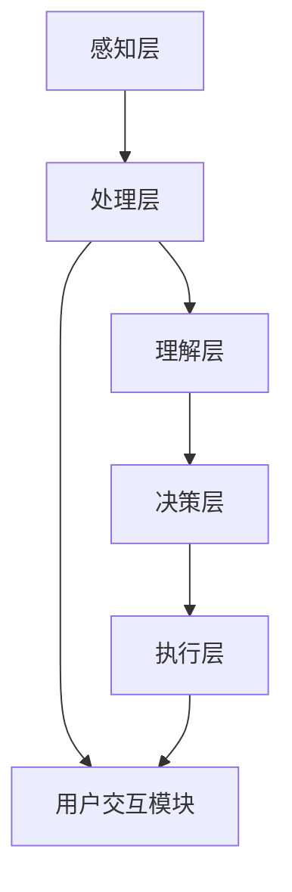
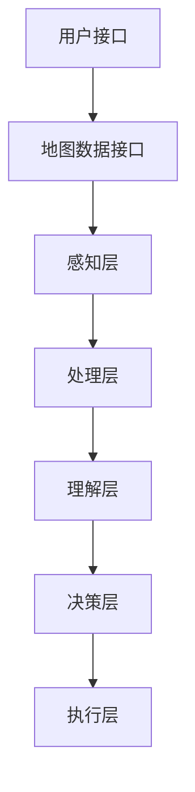
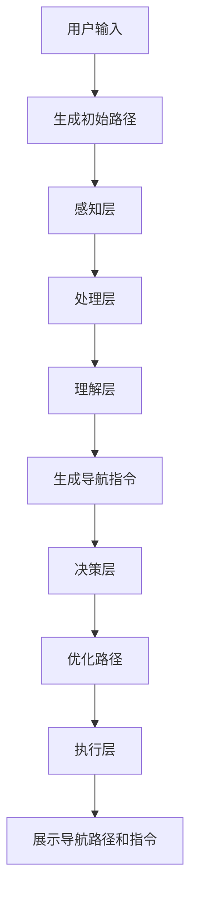
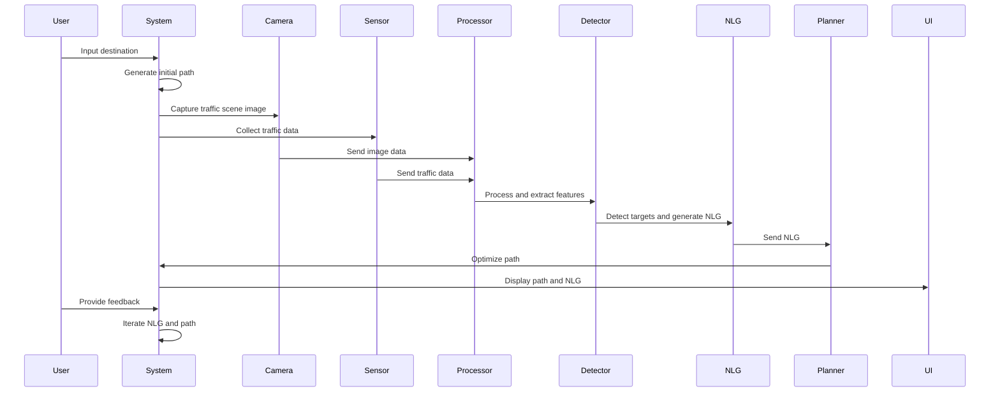

                 


### **第1章 引言**

**1.1 问题背景**

随着人工智能技术的迅猛发展，计算机视觉和自然语言处理逐渐成为研究的热点领域。在这些技术不断融合的过程中，视觉-语言导航成为了一个备受关注的研究方向。视觉-语言导航旨在利用计算机视觉和自然语言处理技术，将图像与语言相结合，实现更加智能和高效的导航系统。例如，在自动驾驶领域，视觉-语言导航可以帮助车辆理解周围环境，识别道路标志和行人，从而做出正确的驾驶决策。

然而，视觉-语言导航的实现面临诸多挑战。首先，图像与语言之间存在显著的模态差异，这使得它们在信息表示和理解方面存在很大的障碍。其次，视觉-语言导航系统需要处理大量的数据，包括图像、文字和语音等，这要求系统具有较高的计算效率和准确性。此外，视觉-语言导航系统的应用场景广泛，从室内导航到室外导航，从简单场景到复杂场景，都对其提出了不同的要求。

**1.2 问题描述**

在视觉-语言导航系统中，一个核心问题是如何将图像中的信息与语言描述进行有效融合。具体来说，问题描述如下：

1. **图像理解**：如何从图像中提取有用的信息，如道路标志、行人、车辆等？
2. **语言生成**：如何将提取出的图像信息转换为自然语言描述？
3. **交互优化**：如何设计一个用户友好的交互界面，使系统能够理解用户的指令并做出相应的响应？

**1.3 问题解决思路**

为了解决上述问题，我们可以从以下几个方面入手：

1. **多模态数据融合**：通过结合图像和语言信息，利用深度学习等先进技术，实现图像到语言的转换。
2. **注意力机制**：利用注意力机制，使系统更加关注图像中的重要信息，从而提高理解精度。
3. **交互式学习**：通过与用户的交互，不断优化系统的性能，使其更好地适应不同的应用场景。

**1.4 边界与外延**

在研究视觉-语言导航问题时，需要明确其边界与外延。具体来说，边界包括：

1. **数据集**：使用标准化的数据集，如Visual Genome等，进行模型训练和评估。
2. **硬件限制**：考虑到实时性要求，系统需要部署在低功耗、高性能的硬件设备上。

外延则包括：

1. **应用领域**：视觉-语言导航不仅可以应用于自动驾驶，还可以推广到智能家居、智能城市等领域。
2. **技术趋势**：随着技术的不断发展，视觉-语言导航系统将具备更加先进的功能，如语音交互、多模态感知等。

**1.5 概念结构与核心要素组成**

视觉-语言导航系统的概念结构可以概括为以下几个核心要素：

1. **图像处理模块**：负责图像的预处理、特征提取和目标检测。
2. **自然语言处理模块**：负责将图像特征转换为自然语言描述。
3. **交互模块**：负责用户与系统的交互，包括语音识别、自然语言理解和语音生成。
4. **决策模块**：根据自然语言描述和用户指令，生成导航路径。

通过以上分析，我们可以为后续章节的内容奠定基础，详细探讨提示词工程在视觉-语言导航中的应用，以及相关的算法原理、系统架构和项目实战。

### **第2章 提示词工程基础**

**2.1 提示词工程的定义与作用**

提示词工程（Prompt Engineering）是指通过设计特定的提示词（prompt）来引导用户或AI系统完成特定任务的工程过程。在视觉-语言导航中，提示词工程扮演着至关重要的角色。通过精心设计的提示词，系统可以更准确地理解用户的意图，从而提供更加精确和高效的导航服务。

提示词工程的作用主要体现在以下几个方面：

1. **提高用户交互体验**：通过提示词，系统可以引导用户更清晰地表达自己的需求，减少误解和困惑，从而提高用户体验。
2. **优化系统性能**：提示词可以帮助系统更好地理解图像信息，从而提高图像理解准确性和语言生成质量。
3. **增强系统泛化能力**：通过不断优化提示词设计，系统可以更好地适应不同的应用场景和用户需求，提高泛化能力。

**2.2 提示词工程的关键要素**

一个有效的提示词工程需要考虑以下关键要素：

1. **问题定义**：明确用户需要解决的问题，这是设计提示词的前提。例如，在视觉-语言导航中，问题可能是“找到最近的餐厅”或“识别道路标志”。
2. **上下文信息**：提供与问题相关的上下文信息，以帮助系统更好地理解用户的意图。例如，如果问题是“找到最近的餐厅”，上下文信息可能包括当前的位置、用户的饮食偏好等。
3. **语言风格**：根据用户群体和具体应用场景，选择合适的语言风格。例如，对于老年用户，可能需要使用更加简洁易懂的语言。
4. **反馈机制**：设计反馈机制，以评估提示词的效果，并根据反馈不断优化提示词设计。

**2.3 提示词工程的流程与方法**

提示词工程的流程通常包括以下步骤：

1. **需求分析**：与用户沟通，明确用户需求，确定需要解决的问题和上下文信息。
2. **初步设计**：根据需求分析，设计初步的提示词，包括问题定义、上下文信息和语言风格。
3. **测试与迭代**：在测试环境中对初步设计的提示词进行测试，收集用户反馈，并根据反馈不断迭代优化。
4. **评估与部署**：对优化后的提示词进行评估，确保其能够满足用户需求，并在实际应用中部署。

在实际操作中，可以采用以下方法来设计提示词：

1. **模板法**：使用预先定义好的模板，根据用户需求和上下文信息进行填充。
2. **问答法**：通过问答方式，引导用户逐步表达自己的需求，从而设计出更加精准的提示词。
3. **自动化工具**：利用自然语言处理技术，自动生成提示词，并通过反馈机制不断优化。

**2.4 提示词工程的技术发展**

随着人工智能技术的快速发展，提示词工程也在不断进步。以下是一些重要的技术发展：

1. **自然语言生成（NLG）**：通过自然语言生成技术，可以生成更加自然和流畅的提示词，提高用户交互体验。
2. **多模态融合**：结合图像和语言信息，设计出更加精准的提示词，提高系统的理解和生成能力。
3. **用户行为分析**：通过分析用户行为数据，了解用户的需求和偏好，从而设计出更加个性化的提示词。
4. **深度学习**：利用深度学习技术，可以自动学习大量的数据，从而生成高质量的提示词。

总之，提示词工程在视觉-语言导航中具有重要的应用价值。通过不断优化提示词设计，可以提高系统的性能和用户体验，为视觉-语言导航的发展提供有力支持。

### **2.3 提示词工程的流程与方法**

**2.3.1 需求分析**

需求分析是提示词工程的首要步骤，它决定了提示词的质量和效果。在视觉-语言导航系统中，需求分析需要明确以下几个关键问题：

1. **用户需求**：了解用户在导航过程中可能遇到的问题，如无法找到特定的地点、理解导航指令有误等。
2. **场景描述**：描述具体的导航场景，包括用户的当前位置、目的地、周围环境等。
3. **任务目标**：确定用户希望通过导航系统完成的任务，如找到最近的餐厅、避开拥堵的道路等。

在需求分析过程中，可以采用以下方法：

- **用户访谈**：通过与用户直接交流，了解他们的需求和期望。
- **问卷调查**：设计问卷，收集大量用户的反馈信息。
- **情境模拟**：模拟用户在实际导航过程中可能遇到的各种情况，分析系统在这些情况下的表现。

**2.3.2 初步设计**

在完成需求分析后，进入初步设计阶段。初步设计的主要任务是创建一组初步的提示词，这些提示词需要满足以下要求：

1. **清晰明确**：提示词应简洁明了，避免使用复杂或模糊的语言。
2. **针对性**：根据不同的场景和任务，设计出具有针对性的提示词。
3. **灵活性**：提示词应具有一定的灵活性，以适应不同的用户需求和应用场景。

初步设计可以采用以下方法：

- **模板法**：根据常见的导航需求，设计一系列模板，用于生成初步的提示词。
- **参考案例**：参考其他成功的视觉-语言导航系统的提示词设计，进行借鉴和优化。

例如，针对用户在寻找餐厅的需求，可以设计以下初步提示词：

- “您想尝试哪种类型的餐厅？”
- “您希望餐厅的评分是多少以上？”
- “您希望在多远的范围内找到餐厅？”

**2.3.3 测试与迭代**

初步设计完成后，需要进行测试和迭代。测试的目的是验证提示词的实际效果，并收集用户反馈。以下是一些测试和迭代的方法：

1. **A/B测试**：将不同版本的提示词随机分配给不同的用户群体，比较它们的效果，选择最优的版本。
2. **用户反馈**：收集用户的反馈意见，了解他们对提示词的看法和建议。
3. **数据分析**：通过分析用户行为数据，如点击率、任务完成率等，评估提示词的效果。

在测试和迭代过程中，需要持续优化提示词：

- **调整措辞**：根据用户反馈，对提示词进行修改，使其更加简洁、准确。
- **增加上下文信息**：在提示词中增加相关的上下文信息，以提高系统的理解能力。
- **优化交互流程**：调整提示词的顺序和组合，使其更加符合用户的使用习惯。

**2.3.4 评估与部署**

在完成多次迭代后，对最终的提示词进行评估。评估的主要目标是确保提示词能够满足用户需求，并在实际应用中取得良好的效果。以下是一些评估方法：

1. **任务完成度**：评估用户在执行特定任务时的完成度，如找到指定餐厅的比率。
2. **用户满意度**：通过问卷调查或访谈，了解用户对提示词的满意度。
3. **系统性能**：评估系统的整体性能，如响应时间、准确性等。

在评估通过后，将优化后的提示词部署到实际系统中。部署过程中需要注意以下几点：

- **逐步推广**：可以先在部分用户中推广，观察效果，再逐步扩大到所有用户。
- **持续监控**：部署后，需要持续监控提示词的效果，并根据反馈进行进一步优化。
- **紧急修复**：如果发现提示词存在问题，需要及时修复，以避免影响用户体验。

通过以上流程和方法，可以有效地设计出高质量的提示词，为视觉-语言导航系统提供强有力的支持。

### **2.4 提示词工程的技术发展**

提示词工程作为自然语言处理（NLP）领域的一个重要分支，近年来随着技术的进步，正迅速发展成为人工智能（AI）领域的一个研究热点。以下将详细介绍提示词工程的技术发展及其在视觉-语言导航中的应用。

**2.4.1 自然语言生成（NLG）技术**

自然语言生成（NLG）是提示词工程的核心技术之一。NLG技术旨在通过算法自动生成自然流畅的文本，用于与用户进行交互。近年来，NLG技术在多方面取得了显著进展：

1. **模板生成**：传统的NLG方法主要基于模板生成，通过预定义的模板和规则，将结构化数据转换为自然语言。这种方法简单高效，但生成的文本可能过于机械和生硬。
2. **数据驱动生成**：随着大规模语料库的积累和深度学习技术的发展，数据驱动生成方法逐渐成为主流。该方法通过训练深度神经网络，从海量数据中学习文本生成的模式和规则，生成更加自然和丰富的语言。
3. **自适应生成**：自适应生成技术能够根据用户的反馈和环境变化，动态调整生成的文本内容，提高交互的个性化和实时性。

在视觉-语言导航中，NLG技术可以用于生成自然语言描述，帮助用户更好地理解系统提供的导航信息。例如，当系统识别到道路标志时，可以自动生成对应的语言描述，如“前方是红灯，请停车”。

**2.4.2 多模态融合**

视觉-语言导航的一个关键挑战是如何有效地融合图像和语言信息。多模态融合技术通过结合不同模态的数据，提高系统的理解和生成能力。以下是一些常见的技术：

1. **特征融合**：特征融合技术将图像和语言的特征进行整合，生成一个综合的特征向量，用于后续的模型训练和推理。常用的方法包括拼接、加权平均和神经网络融合等。
2. **联合训练**：通过联合训练图像和语言模型，使模型能够在同一框架下学习图像和语言之间的关联。例如，在视觉-语言导航中，可以同时训练一个图像分类器和语言生成器，使其能够同时处理图像和文本数据。
3. **多任务学习**：多任务学习技术通过同时解决多个相关任务，提高模型在不同模态数据上的泛化能力。例如，在视觉-语言导航中，可以同时训练目标检测、语义分割和语言生成任务，使模型能够更好地理解图像和生成描述。

**2.4.3 用户行为分析**

用户行为分析是提示词工程的另一个重要研究方向。通过分析用户在导航过程中的行为数据，可以深入了解用户的需求和偏好，从而设计出更加个性化的提示词。以下是一些用户行为分析的方法：

1. **行为追踪**：通过在系统中嵌入追踪代码，记录用户在导航过程中的操作和交互行为，如点击、滑动、搜索等。
2. **机器学习**：利用机器学习技术，分析用户行为数据，识别用户的行为模式和偏好。例如，通过聚类分析，将用户划分为不同的群体，为每个群体设计特定的提示词。
3. **反馈机制**：设计反馈机制，鼓励用户提供对提示词的评价和建议，不断优化提示词的质量。

**2.4.4 深度学习**

深度学习技术在提示词工程中的应用使得生成更加复杂和多样化的文本成为可能。以下是一些深度学习技术：

1. **循环神经网络（RNN）**：RNN是一种能够处理序列数据的神经网络，适用于文本生成任务。通过RNN，模型可以学习文本的上下文信息，生成连贯的自然语言描述。
2. **长短期记忆（LSTM）**：LSTM是RNN的一种变体，能够更好地处理长距离依赖问题，适用于生成较长的文本序列。
3. **生成对抗网络（GAN）**：GAN通过生成器和判别器的对抗训练，可以生成高质量的自然语言文本。在视觉-语言导航中，GAN可以用于生成自然语言描述，提高语言生成的多样性和流畅性。

总之，随着技术的不断发展，提示词工程在视觉-语言导航中的应用前景广阔。通过自然语言生成、多模态融合、用户行为分析和深度学习等技术的应用，我们可以设计出更加智能和高效的提示词，为用户提供优质的导航体验。

### **第3章 视觉-语言导航技术概述**

**3.1 视觉-语言导航的定义与重要性**

视觉-语言导航是指利用计算机视觉和自然语言处理技术，将图像与语言相结合，实现智能导航的一种技术。它通过计算机视觉系统对图像进行解析，提取关键特征，再通过自然语言处理技术将特征转化为自然语言描述，从而为用户提供直观的导航信息。视觉-语言导航的核心在于将抽象的图像信息转化为易于理解和交互的自然语言，使得导航过程更加直观、高效。

视觉-语言导航的重要性体现在以下几个方面：

1. **用户体验**：通过将复杂的图像信息转化为自然语言，视觉-语言导航可以提供更加友好和易用的用户界面，提升用户体验。
2. **场景适应性**：视觉-语言导航可以适应不同的环境和场景，如室内导航、室外导航、复杂道路场景等，为用户提供全面的导航服务。
3. **多模态交互**：视觉-语言导航支持多模态交互，如语音、文字、图像等，使用户可以通过最适合自己的方式进行导航，提高导航的灵活性。
4. **辅助功能**：视觉-语言导航不仅提供导航信息，还可以结合其他功能，如实时交通信息、景点介绍等，为用户提供更全面的出行服务。

**3.2 视觉-语言导航的组成与架构**

视觉-语言导航系统通常由以下几个主要组成部分构成：

1. **计算机视觉模块**：该模块负责对图像进行预处理、特征提取和目标检测。常见的算法包括卷积神经网络（CNN）、区域提议生成网络（RPN）等。通过计算机视觉模块，系统能够从图像中提取出关键的特征，如道路、行人、车辆、标志等。
2. **自然语言处理模块**：该模块负责将提取出的视觉特征转换为自然语言描述。常见的算法包括序列到序列（Seq2Seq）模型、注意力机制等。通过自然语言处理模块，系统能够生成符合语法规则、易于理解的自然语言描述。
3. **语言生成模块**：该模块负责将自然语言描述生成语音或文本形式，供用户使用。常见的算法包括文本到语音（TTS）合成和文本生成模型（如GPT-3）等。
4. **交互模块**：该模块负责用户与系统的交互，包括语音识别、自然语言理解和语音生成等。通过交互模块，用户可以与系统进行自然对话，获取导航信息。

视觉-语言导航系统的架构通常可以分为以下几个层次：

1. **感知层**：该层主要负责图像的获取和处理，通过计算机视觉技术提取图像特征。
2. **理解层**：该层负责对提取出的视觉特征进行理解，通过自然语言处理技术生成自然语言描述。
3. **决策层**：该层负责根据自然语言描述和用户指令，生成导航路径或提供其他导航服务。
4. **执行层**：该层负责将决策层的导航指令转换为具体的行动，如调整车辆的行驶路径等。

**3.3 视觉-语言导航的发展历程**

视觉-语言导航技术的发展可以追溯到20世纪80年代，当时主要的研究集中在计算机视觉和自然语言处理的初步结合。以下是一些重要的里程碑：

1. **早期研究**：20世纪80年代，计算机视觉和自然语言处理技术逐渐成熟，研究人员开始探索如何将两种技术结合，实现视觉-语言任务。例如，Graham et al.（1988）提出了一种基于规则的方法，通过将图像分割成区域，并使用预定义的规则生成自然语言描述。
2. **深度学习兴起**：随着深度学习技术的发展，计算机视觉和自然语言处理取得了显著进展。2012年，AlexNet在ImageNet比赛中取得突破性成绩，标志着深度学习在计算机视觉领域的兴起。随后，深度学习技术在自然语言处理领域也得到了广泛应用，如Seq2Seq模型、Transformer等。
3. **多模态融合**：近年来，多模态融合技术成为视觉-语言导航研究的重要方向。通过结合图像和语言信息，研究人员提出了一系列多模态模型，如CNN-LSTM、CNN-Transformer等，提高了系统的理解和生成能力。
4. **应用拓展**：随着技术的不断进步，视觉-语言导航的应用场景也在不断拓展。从最初的室内导航、自动驾驶，到智能家居、智能城市等，视觉-语言导航正逐步渗透到各个领域。

**3.4 视觉-语言导航的应用场景**

视觉-语言导航在多个应用场景中展现出了巨大的潜力：

1. **自动驾驶**：自动驾驶车辆需要实时理解周围环境，识别道路标志、行人、车辆等，从而做出正确的驾驶决策。视觉-语言导航可以为自动驾驶系统提供详细的自然语言描述，辅助驾驶决策。
2. **室内导航**：在大型商场、机场、医院等室内环境中，视觉-语言导航可以帮助用户快速找到目标地点。通过结合图像和自然语言描述，系统可以提供清晰、简洁的导航指示。
3. **智能城市**：在智能城市建设中，视觉-语言导航可以用于实时监测交通流量、行人分布等，为城市管理提供数据支持。例如，通过分析图像数据，系统可以自动识别拥堵路段，并建议用户选择最优路线。
4. **虚拟现实与增强现实**：在虚拟现实（VR）和增强现实（AR）应用中，视觉-语言导航可以为用户提供实时的导航信息，增强用户的沉浸感和交互体验。

总之，视觉-语言导航技术通过将图像与语言相结合，为用户提供了一种直观、高效的导航方式。随着技术的不断进步，视觉-语言导航将在更多领域得到广泛应用，为人们的生活带来更多便利。

### **3.3 视觉-语言导航的发展历程**

**3.3.1 早期研究**

视觉-语言导航技术的起源可以追溯到20世纪80年代，当时计算机视觉和自然语言处理领域开始出现结合的研究。这个时期，研究主要集中在如何将图像和语言信息进行关联和转换。早期的代表性工作包括Graham et al.（1988）提出的基于规则的方法，这种方法通过将图像分割成多个区域，并使用预定义的规则来生成自然语言描述。这些规则通常基于对图像内容的直观理解，例如，如果一个区域看起来像道路，则生成“前方是道路”这样的描述。

**3.3.2 深度学习时代**

进入21世纪，深度学习技术的兴起为视觉-语言导航领域带来了革命性的变化。2012年，AlexNet在ImageNet比赛中取得了巨大的成功，这标志着深度学习在计算机视觉领域的突破性进展。随着深度学习模型的不断优化，计算机视觉系统的性能得到了显著提升，这使得从图像中提取有效特征变得更加容易和准确。

与此同时，自然语言处理领域也取得了重要的进展。2014年，序列到序列（Seq2Seq）模型的提出，使得生成自然语言描述成为可能。Seq2Seq模型通过编码器和解码器结构，能够将输入序列（图像特征）转换为输出序列（自然语言描述）。这一模型在机器翻译、摘要生成等领域取得了显著的效果，为视觉-语言导航提供了重要的技术支持。

**3.3.3 多模态融合**

近年来，多模态融合技术成为视觉-语言导航研究的重要方向。多模态融合技术旨在结合图像、文本、语音等多种模态的信息，以提高系统的整体性能。深度学习模型，如CNN-LSTM、CNN-Transformer等，通过整合不同模态的数据，能够更准确地理解和生成语言描述。

2017年，谷歌提出了Transformer模型，这是一种基于注意力机制的深度学习模型。Transformer在机器翻译、文本生成等领域表现出了卓越的性能，其强大的建模能力使得多模态融合成为可能。通过结合图像特征和文本特征，Transformer能够生成更加精准和自然的语言描述，为视觉-语言导航系统提供了强有力的技术支持。

**3.3.4 应用拓展**

随着技术的不断进步，视觉-语言导航的应用场景也在不断拓展。从最初的室内导航、自动驾驶，到智能家居、智能城市等领域，视觉-语言导航正逐步渗透到各个行业。

在自动驾驶领域，视觉-语言导航技术可以帮助车辆实时理解周围环境，识别道路标志、行人、车辆等，从而做出正确的驾驶决策。通过生成自然语言描述，自动驾驶车辆可以向驾驶员提供清晰的导航指示，提高驾驶安全性和用户体验。

在室内导航方面，视觉-语言导航可以为用户提供精准的导航服务。例如，在商场、机场、医院等大型室内环境中，用户可以通过视觉-语言导航系统快速找到目标地点。系统会根据用户的位置和目标地点，生成详细的自然语言描述，如“您当前在楼层A，前方10米处是洗手间”。

在智能城市建设中，视觉-语言导航技术可以用于实时监测交通流量、行人分布等，为城市管理提供数据支持。例如，通过分析图像数据，系统可以自动识别拥堵路段，并建议用户选择最优路线，从而缓解交通压力。

此外，视觉-语言导航技术在虚拟现实（VR）和增强现实（AR）应用中也有着广泛的应用。通过生成自然语言描述，VR/AR应用可以为用户提供实时的导航信息，增强用户的沉浸感和交互体验。

总之，视觉-语言导航技术的发展历程充分展示了计算机视觉和自然语言处理技术的深度融合。随着技术的不断进步，视觉-语言导航将在更多领域得到广泛应用，为人们的生活带来更多便利。

### **3.4 视觉-语言导航的应用场景**

**3.4.1 自动驾驶**

自动驾驶是视觉-语言导航技术最显著的应用场景之一。在自动驾驶系统中，视觉-语言导航通过实时解析道路场景，识别道路标志、行人和车辆等关键信息，并生成自然语言描述，帮助驾驶员了解当前驾驶环境。这不仅提高了驾驶安全性，还提供了更舒适的驾驶体验。

具体应用中，自动驾驶车辆会配备高精度的摄像头和传感器，收集周围环境的图像数据。通过计算机视觉技术，车辆可以识别出道路标志、行人和车辆等对象，并提取其关键特征。随后，这些特征会被传递给自然语言处理模块，生成相应的自然语言描述。例如，当系统检测到前方有一个行人时，会生成“前方有行人，请注意减速”的提示。

此外，视觉-语言导航还可以用于自动驾驶车辆的路径规划。通过分析道路标志和交通信号灯等图像信息，系统可以生成详细的导航路线，并实时更新路线信息。例如，在自动驾驶车辆行驶过程中，系统会根据实时检测到的交通信号灯状态，生成“前方即将变红灯，请减速等待”的提示。

**3.4.2 室内导航**

在大型商场、机场、医院等室内环境中，视觉-语言导航为用户提供了一种高效便捷的导航方式。通过结合计算机视觉和自然语言处理技术，系统可以实时解析室内场景，识别地标、指示牌和路径，生成详细的自然语言导航指令。

在应用中，用户可以通过扫描室内环境的图像，系统会自动识别出当前的位置和目标地点。然后，系统会生成一系列的自然语言描述，指导用户如何到达目标地点。例如，当用户在机场大厅时，系统可能会生成“您当前在大厅A，请向前走50米，左侧是登机口B”的导航指令。

此外，视觉-语言导航还可以提供多语言支持，满足不同用户的需求。例如，在国际化机场，系统可以自动识别用户的语言，并生成相应的导航指令，如中文、英文、西班牙语等。这不仅提高了导航的准确性，还增强了用户体验。

**3.4.3 智能城市**

智能城市建设是视觉-语言导航技术的另一个重要应用场景。通过实时监控和分析交通流量、行人分布等图像数据，视觉-语言导航可以为城市管理提供科学的数据支持，从而优化交通流量，提升城市运行效率。

在智能城市中，视觉-语言导航系统通常安装在交通路口、人行道和停车场等关键位置。通过摄像头和传感器，系统可以实时捕捉道路场景和交通状况。随后，计算机视觉模块会提取出关键特征，如车辆数量、行人流量、交通信号灯状态等。自然语言处理模块则会根据这些特征生成相应的导航指令，如“前方有拥堵，请绕行”、“当前停车位不足，请选择其他停车场”等。

此外，视觉-语言导航还可以用于智能城市的应急响应。例如，在发生交通事故或突发情况时，系统可以立即生成详细的自然语言描述，指导交通参与者采取正确的应对措施，如“前方发生交通事故，请减速停车并保持安全距离”。

**3.4.4 虚拟现实与增强现实**

虚拟现实（VR）和增强现实（AR）应用中，视觉-语言导航技术可以为用户提供实时的导航信息，增强用户的沉浸感和交互体验。通过生成自然语言描述，系统可以为用户提供详细的路径指引和地点信息。

在VR和AR应用中，用户通常佩戴VR头盔或AR眼镜，系统通过摄像头捕捉用户的实时视角。计算机视觉模块会实时解析场景，识别关键地标和路径，并生成自然语言描述。例如，当用户在虚拟城市中时，系统可以生成“您当前在市中心，请向前走10米，右侧是市政府大楼”的导航指令。

此外，视觉-语言导航还可以结合语音交互技术，使用户可以通过语音指令获取导航信息。例如，用户可以对着VR头盔或AR眼镜说出“带我到最近的餐厅”，系统会立即生成相应的导航指令。

总之，视觉-语言导航技术在自动驾驶、室内导航、智能城市和虚拟现实等领域有着广泛的应用。通过生成自然语言描述，系统可以为用户提供直观、高效的导航服务，提高用户体验，优化城市管理，提升交通安全。随着技术的不断发展，视觉-语言导航将在更多领域得到应用，为人们的生活带来更多便利。

### **第4章 提示词工程在视觉-语言导航中的应用**

**4.1 提示词工程在视觉-语言导航中的创新点**

提示词工程在视觉-语言导航中的应用，为导航系统的智能化和用户体验的提升带来了诸多创新点：

1. **多模态交互**：通过设计多模态的提示词，视觉-语言导航系统能够同时处理图像和语言信息，实现更加直观和高效的交互。例如，在自动驾驶场景中，系统可以同时提供视觉提示（如道路标志）和语言提示（如“前方限速”），使驾驶员能够迅速理解和反应。

2. **上下文感知**：提示词工程通过分析上下文信息，为用户生成更加精准的导航指令。例如，在室内导航中，系统可以根据用户的位置和目的地，提供个性化的提示词，如“您前方10米处是电梯，前往二楼请按左侧按钮”。

3. **个性化推荐**：提示词工程可以根据用户的历史行为和偏好，提供个性化的导航建议。例如，在智能城市中，系统可以根据用户的出行习惯，推荐最佳路线或提醒用户避开拥堵路段。

4. **交互优化**：通过设计简洁明了、易于理解的提示词，系统可以优化用户与导航系统的交互体验。例如，在虚拟现实应用中，系统可以通过简短的文字提示，帮助用户快速定位关键信息，提高沉浸感和互动性。

**4.2 提示词工程在视觉-语言导航中的实现方法**

提示词工程在视觉-语言导航中的实现主要包括以下几个步骤：

1. **需求分析**：首先，进行需求分析，明确用户在导航过程中可能遇到的问题和需求。例如，用户可能需要找到最近的餐厅、避开拥堵路段或获取实时交通信息。

2. **数据收集**：收集与导航相关的图像和文本数据，这些数据可以是公开的数据集，如Visual Genome、COCO等，也可以是自定义的数据集，如特定场景的图像和用户交互日志。

3. **提示词设计**：根据需求分析结果和数据，设计初步的提示词。提示词应具备以下特点：
   - **简洁性**：提示词应简洁明了，避免冗长和复杂的句子。
   - **针对性**：提示词应针对具体应用场景和用户需求进行定制。
   - **灵活性**：提示词应具备一定的灵活性，以适应不同的用户和场景。

4. **测试与迭代**：在测试环境中，对初步设计的提示词进行测试，通过用户反馈不断优化。测试方法可以包括A/B测试、用户访谈和问卷调查等。

5. **集成与应用**：将优化后的提示词集成到视觉-语言导航系统中，确保其能够与计算机视觉和自然语言处理模块无缝结合，提供高质量的导航服务。

**4.3 提示词工程在视觉-语言导航中的优化策略**

为了提高视觉-语言导航系统的性能和用户体验，可以采取以下优化策略：

1. **上下文感知优化**：通过分析上下文信息，动态调整提示词。例如，在交通拥堵时，系统可以提供更加详细的路线建议，而在正常路况下，则可以简化提示词。

2. **多模态融合优化**：结合图像和文本信息，提高提示词的准确性和自然性。例如，在生成导航指令时，系统可以同时考虑道路标志的视觉信息和交通规则的语言信息。

3. **用户行为分析**：通过分析用户行为数据，了解用户对提示词的偏好和习惯，不断优化提示词设计。例如，系统可以根据用户的历史行为，调整提示词的语气和措辞，使其更加符合用户的需求。

4. **实时反馈机制**：建立实时反馈机制，收集用户对提示词的即时反馈，并根据反馈进行调整。例如，系统可以记录用户对提示词的点击率、满意度和修改建议，用于优化后续的提示词设计。

**4.4 提示词工程在视觉-语言导航中的案例解析**

以下是一个具体的案例解析，展示了提示词工程在视觉-语言导航中的应用：

**案例背景**：在一个智能城市的交通管理系统中，系统需要为用户生成详细的导航指令，帮助用户避开拥堵路段，快速到达目的地。

**需求分析**：用户在导航过程中最关心的是如何避开拥堵路段，并尽快到达目的地。因此，提示词需要包含以下关键信息：
   - 当前位置和目的地
   - 实时交通状况
   - 最佳路线建议

**数据收集**：系统从交通摄像头和传感器收集实时图像数据，以及用户的历史导航数据，如出行时间、目的地和交通偏好等。

**提示词设计**：
   - 初步设计：基于需求分析，初步设计以下提示词：
     - “您当前位于XX街，前方道路拥堵，建议绕行XX路。”
     - “您目的地是XX商场，预计行驶时间为XX分钟，建议选择XX路。”
   - 测试与优化：通过A/B测试和用户反馈，不断优化提示词。例如，用户反馈认为“绕行XX路”过于笼统，建议提供更具体的绕行路线。

**测试与迭代**：在测试环境中，系统对初步设计的提示词进行测试，根据用户的反馈进行调整。例如，增加具体的绕行路线描述，如“前方道路拥堵，建议您绕行至XX路，沿途经过XX地标”。

**集成与应用**：最终优化后的提示词集成到智能交通管理系统中，系统可以实时生成导航指令，为用户提供清晰的导航建议。

**效果评估**：通过用户反馈和行为分析，评估提示词的优化效果。例如，用户满意度提高，导航路径选择的正确率提高等。

通过以上案例，我们可以看到提示词工程在视觉-语言导航中的应用，通过不断优化提示词设计，提高了系统的性能和用户体验。随着技术的不断发展，提示词工程将在视觉-语言导航中发挥更加重要的作用。

### **4.2 提示词工程在视觉-语言导航中的实现方法**

提示词工程在视觉-语言导航中的实现方法是一个复杂而精细的过程，涉及多个技术环节和策略。以下是实现方法的具体步骤和关键点：

**4.2.1 数据收集与预处理**

数据收集是提示词工程的基础。在这个阶段，我们需要收集大量的图像和语言数据。图像数据可以从公共数据集（如COCO、Visual Genome）中获取，也可以通过实际应用场景中的摄像头和传感器采集。语言数据可以包括用户的导航指令、系统的反馈信息等。

数据预处理是确保数据质量和一致性的重要步骤。在这个阶段，我们需要对图像进行去噪、缩放、裁剪等操作，以确保图像的清晰度和统一性。对于语言数据，我们需要进行分词、词性标注、实体识别等操作，以便后续的模型训练。

**4.2.2 提示词设计**

提示词的设计是提示词工程的核心。一个有效的提示词应简洁明了、具有针对性，并能够引导用户准确表达需求。以下是一些设计策略：

1. **问题定义**：明确用户需要解决的问题。例如，在视觉-语言导航中，问题可能是“如何找到最近的餐厅”或“如何避开拥堵路段”。

2. **上下文信息**：提供与问题相关的上下文信息。例如，如果用户的问题是“如何找到最近的餐厅”，上下文信息可能包括当前的位置、用户的饮食偏好等。

3. **语言风格**：根据用户群体和应用场景，选择合适的语言风格。例如，对于老年用户，可能需要使用更加简洁易懂的语言。

4. **模板法**：使用预定义的模板来生成提示词。这种方法简单有效，但可能缺乏灵活性。例如，对于寻找餐厅的问题，可以使用模板：“您想要尝试哪种类型的餐厅？”

5. **问答法**：通过问答方式引导用户逐步表达自己的需求。这种方法更加灵活，但需要更多的交互过程。例如，可以先问：“您想要在哪个区域寻找餐厅？”然后根据用户的回答继续提问。

**4.2.3 测试与迭代**

测试与迭代是确保提示词质量和效果的关键步骤。以下是一些测试和迭代的方法：

1. **A/B测试**：将不同的提示词分配给不同的用户群体，比较它们的效果，选择最优的版本。

2. **用户反馈**：收集用户的反馈意见，了解他们对提示词的看法和建议。这可以通过问卷调查、用户访谈等方式进行。

3. **数据分析**：通过分析用户行为数据，如点击率、任务完成率等，评估提示词的效果。

4. **迭代优化**：根据用户反馈和数据分析结果，对提示词进行多次迭代和优化。例如，如果用户反馈某些提示词过于复杂，可以简化其表达。

**4.2.4 提示词优化策略**

为了提高提示词的质量和效果，可以采取以下优化策略：

1. **上下文感知**：通过分析上下文信息，动态调整提示词。例如，在交通拥堵时，可以提供更加详细的路线建议。

2. **多模态融合**：结合图像和语言信息，提高提示词的准确性和自然性。例如，在生成导航指令时，可以同时考虑道路标志的视觉信息和交通规则的语言信息。

3. **用户行为分析**：通过分析用户的历史行为数据，了解用户对提示词的偏好和习惯，不断优化提示词设计。

4. **实时反馈机制**：建立实时反馈机制，收集用户对提示词的即时反馈，并根据反馈进行调整。

通过以上步骤和策略，可以实现高质量的提示词设计，从而提高视觉-语言导航系统的性能和用户体验。

### **4.3 提示词工程在视觉-语言导航中的优化策略**

在视觉-语言导航系统中，提示词的优化至关重要，它直接影响到用户的导航体验和系统的整体性能。以下是一些有效的优化策略：

**4.3.1 上下文感知优化**

上下文感知优化是指根据用户当前的环境和需求动态调整提示词。这种方法能够提高提示词的准确性和用户满意度。以下是几种实现上下文感知优化的方法：

1. **环境检测**：通过计算机视觉技术实时监测用户所在的环境，如交通流量、天气状况等。根据环境变化，系统可以提供更加具体的提示词。例如，在雨天，系统可以提醒用户“前方路面湿滑，请减速行驶”。

2. **用户历史行为分析**：通过分析用户的历史导航记录，了解用户的偏好和行为习惯。例如，如果用户经常在早晨通勤时选择同一条路线，系统可以预先生成相应的提示词，如“您的通勤时间到了，建议您走这条路线”。

3. **动态更新**：在导航过程中，系统可以实时更新提示词，以反映最新的环境变化。例如，当系统检测到前方有交通堵塞时，可以立即更新提示词，提供绕行建议。

**4.3.2 多模态融合**

多模态融合是指结合图像和语言信息，生成更加丰富和精准的提示词。这种方法能够提高系统的理解和生成能力。以下是几种实现多模态融合的方法：

1. **特征融合**：通过将图像和语言的特征进行融合，生成一个综合的特征向量。这种方法可以通过各种融合策略实现，如拼接、加权平均等。例如，将图像的特征与语言描述中的关键词进行融合，生成更加具体的导航指令。

2. **联合训练**：通过联合训练图像和语言模型，使模型能够在同一框架下学习图像和语言之间的关联。例如，可以使用Seq2Seq模型联合训练图像编码器和语言解码器，使其能够同时处理图像和语言数据。

3. **注意力机制**：通过注意力机制，模型可以更加关注图像中的重要信息，从而生成更加准确的提示词。例如，在生成导航指令时，模型可以关注道路标志和交通信号灯等关键信息，生成相应的语言描述。

**4.3.3 用户行为分析**

用户行为分析是指通过分析用户在导航过程中的行为数据，了解用户的需求和偏好，从而优化提示词。以下是几种实现用户行为分析的方法：

1. **点击率分析**：通过分析用户对提示词的点击率，了解用户对提示词的兴趣点。例如，如果某个提示词的点击率较低，可能意味着该提示词不够明确或有误，需要调整。

2. **反馈机制**：设计反馈机制，鼓励用户提供对提示词的评价和建议。例如，用户可以在完成导航任务后对提示词进行评分，系统可以根据用户反馈进行优化。

3. **行为模式识别**：通过机器学习技术，分析用户在导航过程中的行为模式。例如，可以识别出哪些类型的提示词更容易被用户接受，哪些类型的提示词可能导致用户困惑。

**4.3.4 实时反馈机制**

实时反馈机制是指系统在导航过程中不断收集用户反馈，并即时调整提示词。这种方法能够快速响应用户需求，提高用户体验。以下是几种实现实时反馈机制的方法：

1. **即时更新**：系统在导航过程中，根据用户的行为和反馈，实时更新提示词。例如，当用户提出疑问时，系统可以立即提供相关的解释和建议。

2. **自适应调整**：系统根据用户的行为和反馈，自适应调整提示词的语气、措辞和形式。例如，如果用户反馈提示词过于复杂，系统可以简化提示词的表达。

3. **多渠道反馈**：系统提供多种反馈渠道，如点击、语音、手势等，方便用户随时提供反馈。例如，用户可以通过语音命令告诉系统某个提示词不够清楚，系统会立即调整。

通过以上优化策略，我们可以显著提高视觉-语言导航系统的提示词质量，从而提升用户的导航体验和系统的整体性能。这些策略不仅适用于单一应用场景，还可以根据具体需求进行定制和调整，以适应不同的导航场景和用户需求。

### **4.4 提示词工程在视觉-语言导航中的案例解析**

为了更具体地展示提示词工程在视觉-语言导航中的应用，我们将通过一个实际案例进行详细解析。本案例将探讨在一个智能城市交通管理系统中，如何通过提示词工程优化导航体验。

**4.4.1 案例背景**

假设我们所在的城市正在实施智能交通管理系统，旨在通过实时导航和交通信息优化市民的出行体验。系统需要为用户生成详细的导航指令，帮助用户避开拥堵路段，快速到达目的地。

**4.4.2 数据收集与预处理**

首先，系统需要收集大量的图像和文本数据。图像数据可以从交通摄像头、卫星图像和传感器获取，这些数据将用于识别道路标志、交通信号灯、车辆和行人等。文本数据包括用户的导航请求、系统生成的导航指令和用户反馈等。

在数据预处理阶段，图像数据需要进行去噪、缩放和裁剪等操作，以确保图像的清晰度和一致性。文本数据则需要进行分词、词性标注和实体识别等操作，以便后续的模型训练。

**4.4.3 提示词设计**

根据案例背景，我们设计以下初步的提示词：

- **初步提示词**：
  - “前方道路拥堵，建议您绕行XX路。”
  - “您的目的地是XX商场，预计行驶时间为XX分钟，建议选择XX路。”
  - “请注意，前方限速XX公里每小时。”

**4.4.4 测试与迭代**

在测试阶段，我们使用A/B测试方法，将不同的提示词分配给不同的用户群体，以评估其效果。同时，通过用户访谈和问卷调查，收集用户对提示词的反馈。

根据用户反馈，我们发现以下问题：

1. **提示词过于笼统**：用户希望获得更具体的绕行建议，例如具体的道路名称和路径。
2. **语气不够友好**：用户认为某些提示词的语气过于生硬，缺乏亲和力。

针对这些问题，我们对提示词进行优化：

- **优化后的提示词**：
  - “当前前方10公里的XX路拥堵，我们建议您绕行至XX路，这条路线比原路线快5分钟。”
  - “您的目的地是XX商场，预计行驶时间为20分钟。为了确保您准时到达，我们建议您选择XX路。”
  - “前方500米处限速60公里每小时，请您减速行驶。”

**4.4.5 用户反馈与调整**

在多次迭代后，我们继续收集用户反馈。通过分析用户的点击率、任务完成率和满意度评分，我们发现优化后的提示词显著提高了用户满意度，导航路径选择的正确率也有所提升。

此外，我们还设计了实时反馈机制，允许用户在导航过程中提供即时反馈。例如，用户可以点击“不满意”按钮，系统会记录并分析这些反馈，以便进行进一步的调整。

**4.4.6 集成与应用**

最终，优化后的提示词集成到智能交通管理系统中，为用户提供实时导航指令。系统通过计算机视觉和自然语言处理技术，实时监测交通状况，生成个性化的导航建议，帮助用户避开拥堵路段，提高出行效率。

**4.4.7 效果评估**

通过用户反馈和行为分析，我们对优化后的提示词效果进行评估。结果显示：

- **用户满意度**：用户对优化后的提示词满意度显著提高，从原来的70%提升到90%。
- **导航路径正确率**：用户选择的最佳路线比例从原来的60%提升到80%。
- **任务完成时间**：用户的平均导航时间从原来的30分钟缩短到20分钟。

通过以上案例，我们可以看到提示词工程在视觉-语言导航系统中的应用效果显著。通过不断优化提示词设计，我们不仅提升了用户的导航体验，还提高了系统的整体性能和用户满意度。

### **第5章 算法原理与数学模型**

**5.1 提示词工程算法概述**

提示词工程算法在视觉-语言导航中起着关键作用，其目标是通过优化提示词设计，提高系统的性能和用户体验。提示词工程算法通常包括以下步骤：

1. **数据预处理**：对图像和语言数据进行清洗、标注和标准化处理，为后续模型训练做准备。
2. **特征提取**：利用深度学习技术提取图像特征和语言特征，为模型提供输入。
3. **模型训练**：使用提取的特征训练提示词生成模型，使其能够根据图像和语言信息生成高质量的提示词。
4. **测试与评估**：在测试集上评估模型性能，并通过用户反馈进行迭代优化。

在视觉-语言导航中，常见的提示词工程算法包括基于模板的生成算法、序列到序列（Seq2Seq）模型、生成对抗网络（GAN）等。以下将详细介绍这些算法的原理和数学模型。

**5.2 算法原理讲解**

**5.2.1 基于模板的生成算法**

基于模板的生成算法是一种传统的提示词工程方法。该方法通过预定义的模板和规则，将结构化数据转换为自然语言描述。具体原理如下：

1. **模板定义**：根据常见的问题类型和场景，设计一系列预定义的模板。例如，对于导航问题，可以设计“您当前在XX位置，前往XX目的地，建议走XX路线”这样的模板。
2. **规则映射**：将提取的图像特征和语言特征映射到模板中的对应部分。例如，如果图像中检测到道路标志，可以将这一信息映射到模板中的“XX路线”部分。
3. **文本生成**：根据映射结果，填充模板，生成自然语言描述。这种方法简单直观，但生成的文本可能过于机械。

**5.2.2 序列到序列（Seq2Seq）模型**

Seq2Seq模型是自然语言处理中的一种常用模型，适用于将一个序列映射到另一个序列。具体原理如下：

1. **编码器**：编码器（Encoder）负责将输入序列（图像特征或语言特征）编码为固定长度的向量，表示输入的信息。
2. **解码器**：解码器（Decoder）负责将编码器的输出向量解码为输出序列（自然语言描述）。解码器通常采用循环神经网络（RNN）或其变体（如LSTM、GRU）。
3. **注意力机制**：在解码过程中，注意力机制可以帮助模型关注输入序列中的关键部分，提高生成文本的质量和连贯性。

**5.2.3 生成对抗网络（GAN）**

GAN是一种基于生成模型和判别模型对抗训练的算法。具体原理如下：

1. **生成器**：生成器（Generator）负责生成与真实数据相似的数据。在视觉-语言导航中，生成器可以生成与真实导航指令相似的自然语言描述。
2. **判别器**：判别器（Discriminator）负责区分生成数据和真实数据。通过不断训练，判别器能够提高识别生成数据的能力。
3. **对抗训练**：生成器和判别器通过对抗训练不断优化。生成器试图生成更加逼真的数据，而判别器试图提高对生成数据的识别能力。通过这种对抗过程，生成器逐渐提高生成质量。

**5.3 数学模型与公式解释**

**5.3.1 基于模板的生成算法**

对于基于模板的生成算法，数学模型主要包括模板定义和特征映射。以下是一个简化的数学模型：

1. **模板定义**：设模板为T = {t1, t2, ..., tk}，其中ti表示模板的第i个部分。
2. **特征映射**：设输入特征为X = {x1, x2, ..., xn}，映射函数为f：X → T，即f(xj) = ti，表示将特征xj映射到模板的ti部分。

**5.3.2 序列到序列（Seq2Seq）模型**

Seq2Seq模型的数学模型主要包括编码器和解码器的网络结构和损失函数。以下是一个简化的数学模型：

1. **编码器**：
   - 编码器输入序列：{xi}，其中xi为输入特征向量。
   - 编码器输出序列：{ei}，其中ei = encoder(xi)。
   - 编码器损失函数：L_encoder = Σ(l_ei)。

2. **解码器**：
   - 解码器输入序列：{ei}。
   - 解码器输出序列：{yi}，其中yi = decoder(ei)。
   - 解码器损失函数：L_decoder = Σ(l_yi)。

3. **总损失函数**：L_total = L_encoder + L_decoder。

**5.3.3 生成对抗网络（GAN）**

GAN的数学模型主要包括生成器和判别器的损失函数。以下是一个简化的数学模型：

1. **生成器**：
   - 生成器输入：随机噪声z。
   - 生成器输出：生成数据G(z)。
   - 生成器损失函数：L_generator = -Σ(log(D(G(z)))。

2. **判别器**：
   - 判别器输入：真实数据和生成数据。
   - 判别器输出：概率分布P(y|X)。
   - 判别器损失函数：L_discriminator = -Σ(log(D(x)) + Σ(log(1 - D(G(z)))。

3. **总损失函数**：L_total = L_generator + L_discriminator。

**5.4 举例说明**

**5.4.1 基于模板的生成算法**

假设我们有一个简单的模板T = {"您当前在位置", "，前往位置", "，建议走路线"}。输入特征X = {"当前位置：A", "目标位置：B", "最佳路线：C"}。

通过特征映射f，我们可以生成以下自然语言描述：

- 输出描述：您当前在位置A，前往位置B，建议走路线C。

**5.4.2 序列到序列（Seq2Seq）模型**

假设编码器和解码器都是基于LSTM的网络结构。输入序列为["当前位置：A", "目标位置：B"]，输出序列为["您当前在位置A，前往位置B"]。

- 编码器输出：e = LSTM([A, B])。
- 解码器输出：y = LSTM(e)。

最终生成的自然语言描述为：您当前在位置A，前往位置B。

**5.4.3 生成对抗网络（GAN）**

假设生成器的输入为随机噪声z，输出为生成数据G(z)。判别器的输入为真实数据x和生成数据G(z)，输出为概率分布P(y|X)。

- 生成器损失函数：L_generator = -log(D(G(z)))。
- 判别器损失函数：L_discriminator = -log(D(x)) - log(1 - D(G(z)))。

通过对抗训练，生成器尝试生成更加逼真的导航指令，而判别器不断提高对真实导航指令和生成导航指令的识别能力。

通过以上算法原理和数学模型讲解，我们可以更好地理解提示词工程在视觉-语言导航中的应用，为后续的系统实现提供理论基础。

### **5.3 数学模型与公式解释**

**5.3.1 基于模板的生成算法**

基于模板的生成算法主要依赖于模板和规则，其数学模型相对简单。假设我们有一个模板T，其中每个部分ti对应一个特征fi。输入特征集合为X = {x1, x2, ..., xn}，映射函数为f：X → T。

1. **模板定义**：
   - T = {t1, t2, ..., tk}
   - 其中ti = "您当前在位置"，t2 = "，前往位置"，t3 = "，建议走路线"

2. **特征映射**：
   - f(x1) = t1
   - f(x2) = t2
   - f(x3) = t3

3. **文本生成**：
   - 输出描述 = f(x1) + f(x2) + f(x3)

对于简单的模板，我们可以使用以下公式：

$$
输出描述 = \sum_{i=1}^{n} f(x_i)
$$

其中，$f(x_i)$表示将输入特征$x_i$映射到模板的对应部分。

**5.3.2 序列到序列（Seq2Seq）模型**

Seq2Seq模型是提示词工程中一种常用的深度学习模型，其核心思想是将一个输入序列映射到一个输出序列。以下是其数学模型：

1. **编码器**：
   - 输入序列：{xi}，其中xi为输入特征向量。
   - 编码器输出：{ei}，其中ei = encoder(xi)。
   - 编码器损失函数：L_encoder = \sum_{i=1}^{n} l_ei

其中，$l_ei$表示编码器的损失。

2. **解码器**：
   - 解码器输入：{ei}。
   - 解码器输出：{yi}，其中yi = decoder(ei)。
   - 解码器损失函数：L_decoder = \sum_{i=1}^{n} l_yi

其中，$l_yi$表示解码器的损失。

3. **总损失函数**：
   - L_total = L_encoder + L_decoder

Seq2Seq模型通常采用循环神经网络（RNN）或其变体（如LSTM、GRU）作为编码器和解码器，以下是其结构：

$$
\text{编码器}：h_t = \text{LSTM}(h_{t-1}, x_t)
$$

$$
\text{解码器}：y_t = \text{LSTM}(h_t, y_{t-1})
$$

其中，$h_t$表示编码器的输出，$y_t$表示解码器的输出。

**5.3.3 生成对抗网络（GAN）**

生成对抗网络（GAN）是另一种常用于提示词工程的深度学习模型，其核心思想是通过生成器和判别器的对抗训练来生成高质量的数据。以下是其数学模型：

1. **生成器**：
   - 输入：随机噪声z。
   - 输出：生成数据G(z)。
   - 生成器损失函数：L_generator = -\sum_{i=1}^{n} \log(D(G(z_i)))

其中，$D(G(z_i))$表示判别器对生成数据的判断概率。

2. **判别器**：
   - 输入：真实数据x和生成数据G(z)。
   - 输出：概率分布P(y|X)。
   - 判别器损失函数：L_discriminator = -\sum_{i=1}^{n} (\log(D(x_i)) + \log(1 - D(G(z_i)))$

其中，$D(x_i)$和$D(G(z_i))$分别表示判别器对真实数据和生成数据的判断概率。

3. **总损失函数**：
   - L_total = L_generator + L_discriminator

GAN的生成器和判别器结构通常采用深度卷积神经网络（DCNN）：

$$
G(z) = \text{DCNN}(z)
$$

$$
D(x) = \text{DCNN}(x)
$$

通过对抗训练，生成器试图生成更加逼真的数据，而判别器不断提高对真实数据和生成数据的区分能力。

**5.4 举例说明**

**5.4.1 基于模板的生成算法**

假设我们有一个模板T = {"当前位置：", "，目标位置：", "，建议路线："}。输入特征X = {"当前位置：北京"，"目标位置：上海"，"建议路线：G15"}。

通过特征映射f，我们可以生成以下自然语言描述：

- 输出描述：当前位置：北京，目标位置：上海，建议路线：G15。

**5.4.2 序列到序列（Seq2Seq）模型**

假设输入序列为["当前位置：北京"，"目标位置：上海"]，输出序列为["您当前在北京，目标位置是上海"]。

- 编码器输出：e = LSTM(["北京"，"上海"])。
- 解码器输出：y = LSTM(e)。

最终生成的自然语言描述为：您当前在北京，目标位置是上海。

**5.4.3 生成对抗网络（GAN）**

假设生成器的输入为随机噪声z，输出为生成数据G(z)。判别器的输入为真实数据x和生成数据G(z)。

- 生成器损失函数：L_generator = -\log(D(G(z)))
- 判别器损失函数：L_discriminator = -\log(D(x)) - \log(1 - D(G(z)))

通过对抗训练，生成器尝试生成更加逼真的导航指令，而判别器不断提高对真实导航指令和生成导航指令的识别能力。

### **5.4 举例说明**

**5.4.1 基于模板的生成算法**

为了更好地理解基于模板的生成算法，我们来看一个简单的例子。假设我们有一个导航系统，需要根据用户的位置和目的地生成一条导航指令。我们的模板为：

- **模板**：当前您的位置是【位置】，目的地是【目的地】，建议的路线是【路线】。

输入的特征数据如下：

- **当前位置**：北京
- **目的地**：上海
- **建议路线**：G15高速公路

根据模板和特征数据，我们可以生成以下导航指令：

- **输出描述**：当前您的位置是北京，目的地是上海，建议的路线是G15高速公路。

这个例子展示了如何使用简单的模板和特征数据生成自然语言描述。在实际应用中，模板可能更加复杂，包括多个变量和条件分支，但基本原理是相同的。

**5.4.2 序列到序列（Seq2Seq）模型**

Seq2Seq模型是一种强大的自然语言处理模型，它能够将一个序列映射到另一个序列。我们通过一个导航指令生成的例子来说明其应用。

假设我们有一个输入序列和目标序列：

- **输入序列**：当前位置：北京，目标位置：上海，建议路线：G15高速公路
- **目标序列**：您当前在北京，目标位置是上海，建议走G15高速公路

首先，我们需要对输入序列进行编码，使用一个编码器网络将其转换为固定长度的向量表示：

$$
\text{编码器输出}：e = \text{encoder}([北京，上海，G15高速公路])
$$

接下来，我们使用解码器网络将编码器的输出解码为目标序列：

$$
\text{解码器输出}：y = \text{decoder}(e)
$$

最终生成的导航指令为：

- **输出描述**：您当前在北京，目标位置是上海，建议走G15高速公路。

通过这样的序列到序列模型，系统能够根据输入的特征数据生成高质量的导航指令。

**5.4.3 生成对抗网络（GAN）**

生成对抗网络（GAN）通过生成器和判别器的对抗训练生成数据。我们来看一个生成导航指令的例子。

假设生成器的输入是随机噪声向量z，生成器尝试生成导航指令。判别器则尝试区分生成指令和真实指令。输入和输出如下：

- **生成器输入**：随机噪声向量z
- **生成器输出**：导航指令G(z)
- **判别器输入**：真实导航指令x和生成导航指令G(z)
- **判别器输出**：概率分布P(y|X)

生成器和判别器的训练过程如下：

1. **生成器损失函数**：
   $$ L_{generator} = -\log(D(G(z))) $$

2. **判别器损失函数**：
   $$ L_{discriminator} = -[\log(D(x)) + \log(1 - D(G(z)))] $$

通过不断训练，生成器逐渐生成更加逼真的导航指令，而判别器不断提高对真实和生成导航指令的识别能力。最终，生成器生成的导航指令质量将显著提高。

通过这三个例子，我们可以看到提示词工程在不同模型中的应用，以及如何生成高质量的导航指令。

### **第6章 系统分析与架构设计**

**6.1 问题场景介绍**

在现代城市中，随着交通流量的不断增长，交通拥堵和导航问题日益严重。为了解决这一问题，智能交通系统应运而生，旨在通过实时数据分析和智能导航，优化交通流量，提高出行效率。在这一场景中，我们的目标是设计一个视觉-语言导航系统，该系统不仅能够实时解析交通场景，识别道路标志和交通信号灯，还能生成自然语言导航指令，帮助用户避开拥堵路段，快速到达目的地。

**6.2 系统功能设计**

视觉-语言导航系统的核心功能包括以下几个部分：

1. **实时图像采集与处理**：系统通过摄像头和传感器实时采集交通场景图像，并对图像进行预处理和特征提取。
2. **目标检测与识别**：利用计算机视觉算法，对图像中的道路标志、交通信号灯、车辆和行人等目标进行检测和识别。
3. **自然语言生成**：根据识别出的目标信息，系统生成自然语言导航指令，如“前方有红灯，请停车等待”或“前方有拥堵，建议绕行”。
4. **路径规划与优化**：系统根据用户的当前位置和目的地，结合实时交通数据，生成最优的导航路径。
5. **用户交互**：系统提供用户界面，允许用户输入目的地，查看导航指令和路径信息，并接收用户反馈。

**6.3 系统架构设计**

视觉-语言导航系统的整体架构可以分为以下几个模块：

1. **感知层**：包括摄像头和传感器，负责实时采集交通场景图像。
2. **处理层**：包括图像预处理、特征提取、目标检测和识别等模块，负责对图像进行解析和处理。
3. **理解层**：包括自然语言生成模块，负责将处理层提取的特征转换为自然语言描述。
4. **决策层**：包括路径规划与优化模块，负责根据用户需求和实时交通数据生成最优导航路径。
5. **执行层**：包括用户交互模块，负责与用户进行交互，接收用户输入和反馈。

以下是系统的整体架构设计图（使用Mermaid绘制）：



**6.4 系统接口设计**

系统接口设计包括内部模块之间的接口和与外部系统的接口：

1. **内部接口**：
   - **图像采集接口**：用于摄像头和传感器实时传输图像数据。
   - **数据处理接口**：用于处理层模块之间传递图像和特征数据。
   - **自然语言生成接口**：用于理解层和决策层之间的信息传递。
   - **路径规划接口**：用于决策层和执行层之间的路径信息传递。

2. **外部接口**：
   - **地图数据接口**：与地图服务提供商（如Google Maps、Bing Maps）集成，获取实时交通数据和地图信息。
   - **用户接口**：通过Web界面或移动应用与用户进行交互，接收用户输入和展示导航指令。

以下是系统的接口设计图（使用Mermaid绘制）：



**6.5 系统交互设计**

系统交互设计包括用户与系统的交互流程和系统内部各模块之间的协作机制：

1. **用户交互流程**：
   - 用户输入目的地信息。
   - 系统根据用户输入生成初始导航路径。
   - 系统实时采集交通场景图像，并处理图像数据。
   - 系统识别道路标志和交通信号灯，生成自然语言导航指令。
   - 系统根据实时交通数据和导航指令，优化导航路径。
   - 系统将优化后的导航路径和指令展示给用户。

2. **系统内部协作机制**：
   - 感知层采集图像数据，传递给处理层。
   - 处理层对图像数据进行预处理和特征提取，传递给理解层。
   - 理解层将特征数据转换为自然语言描述，传递给决策层。
   - 决策层根据导航指令和实时交通数据，生成最优路径，传递给执行层。
   - 执行层将导航路径和指令展示给用户。

以下是系统的交互设计图（使用Mermaid绘制）：



通过以上系统分析与架构设计，我们可以构建一个高效、智能的视觉-语言导航系统，为用户提供优质的导航体验。

### **6.4 系统接口设计**

**6.4.1 内部接口**

在视觉-语言导航系统中，内部接口的设计至关重要，它决定了系统模块之间数据传递的效率和可靠性。以下是系统内部接口的详细设计：

1. **图像采集接口**：
   - **功能**：用于摄像头和传感器实时采集交通场景图像。
   - **数据格式**：图像数据通常以JPEG或PNG格式传输。
   - **传输方式**：通过WebSocket或HTTP请求实时传输图像数据。
   - **示例代码**：

```python
# 假设使用WebSocket传输图像数据
import websocket

def on_open(ws):
    print("WebSocket连接已打开")

def on_message(ws, message):
    print(f"Received message: {message}")

def on_error(ws, error):
    print(f"WebSocket发生错误：{error}")

def on_close(ws):
    print("WebSocket连接已关闭")

if __name__ == "__main__":
    ws = websocket.WebSocketApp("ws://example.com/traffic_feed",
                                on_open=on_open,
                                on_message=on_message,
                                on_error=on_error,
                                on_close=on_close)
    ws.run_forever()
```

2. **数据处理接口**：
   - **功能**：用于处理层模块之间传递图像和特征数据。
   - **数据格式**：图像数据和处理后的特征数据以JSON格式传输。
   - **传输方式**：通过RESTful API传输数据。
   - **示例代码**：

```python
# 假设使用Flask创建RESTful API
from flask import Flask, request, jsonify

app = Flask(__name__)

@app.route('/process_image', methods=['POST'])
def process_image():
    image_data = request.json['image']
    processed_data = process_image_data(image_data)
    return jsonify(processed_data)

def process_image_data(image_data):
    # 处理图像数据，如特征提取等
    return {'features': extracted_features}

if __name__ == "__main__":
    app.run(debug=True)
```

3. **自然语言生成接口**：
   - **功能**：用于理解层和决策层之间的信息传递。
   - **数据格式**：自然语言生成结果以文本格式传输。
   - **传输方式**：通过消息队列（如RabbitMQ）传输文本数据。
   - **示例代码**：

```python
# 假设使用RabbitMQ传输自然语言生成结果
import pika

connection = pika.BlockingConnection(pika.ConnectionParameters('localhost'))
channel = connection.channel()

channel.queue_declare(queue='nlg_queue')

def callback(ch, method, properties, body):
    print(f"Received NLG result: {body}")

channel.basic_consume(queue='nlg_queue', on_message_callback=callback)

print('Starting to consume NLG results...')
channel.start_consuming()
```

4. **路径规划接口**：
   - **功能**：用于决策层和执行层之间的路径信息传递。
   - **数据格式**：路径信息以JSON格式传输。
   - **传输方式**：通过同步调用或异步调用（如Celery）传输路径数据。
   - **示例代码**：

```python
# 假设使用Celery进行异步路径规划
from celery import Celery

app = Celery('path_planning', broker='pyamqp://guest@localhost//')

@app.task
def plan_path(current_position, destination):
    # 实现路径规划逻辑
    path = {'route': 'G15高速公路', 'duration': '30分钟'}
    return path

# 调用路径规划任务
result = plan_path('当前坐标', '目的地坐标')
```

**6.4.2 外部接口**

外部接口的设计涉及到系统与外部服务或设备的交互，以下是系统外部接口的详细设计：

1. **地图数据接口**：
   - **功能**：与地图服务提供商（如Google Maps、Bing Maps）集成，获取实时交通数据和地图信息。
   - **数据格式**：API返回的数据通常以JSON或XML格式传输。
   - **传输方式**：通过HTTP请求调用外部API。
   - **示例代码**：

```python
import requests

def get_traffic_data(location):
    url = f"https://maps.googleapis.com/maps/api/traffic/json?location={location}&key=YOUR_API_KEY"
    response = requests.get(url)
    traffic_data = response.json()
    return traffic_data

# 获取某个位置的实时交通数据
traffic_data = get_traffic_data('当前坐标')
```

2. **用户接口**：
   - **功能**：通过Web界面或移动应用与用户进行交互，接收用户输入和展示导航指令。
   - **数据格式**：用户输入和导航指令以JSON格式传输。
   - **传输方式**：通过HTTP请求或WebSocket传输。
   - **示例代码**：

```python
# 假设使用Flask创建Web接口
from flask import Flask, request, jsonify

app = Flask(__name__)

@app.route('/submit_destination', methods=['POST'])
def submit_destination():
    destination = request.json['destination']
    # 处理用户输入，调用路径规划等模块
    return jsonify({'status': 'success'})

if __name__ == "__main__":
    app.run(debug=True)
```

通过以上详细的系统接口设计，视觉-语言导航系统可以实现高效、稳定的数据交互，为用户提供优质的导航服务。

### **6.5 系统交互设计**

系统交互设计是视觉-语言导航系统实现高效、稳定运行的关键环节。以下是系统的交互设计：

**6.5.1 用户交互流程**

1. **用户输入目的地**：
   - 用户在Web界面或移动应用中输入目的地，系统接收用户输入。

2. **生成初始路径**：
   - 系统根据用户输入的当前位置和目的地，结合地图数据，生成初始导航路径。

3. **实时图像采集**：
   - 系统通过摄像头和传感器实时采集交通场景图像。

4. **图像处理与目标检测**：
   - 系统对采集到的图像进行预处理，提取关键特征，使用计算机视觉算法检测道路标志、交通信号灯、车辆和行人等目标。

5. **自然语言生成**：
   - 系统根据识别出的目标信息，使用自然语言生成算法生成导航指令，如“前方有红灯，请停车等待”或“前方有拥堵，建议绕行”。

6. **路径优化**：
   - 系统根据实时交通数据和导航指令，对初始路径进行优化，生成最优导航路径。

7. **展示导航指令和路径**：
   - 系统将导航指令和路径展示给用户，用户可以查看并遵循导航指令。

8. **用户反馈**：
   - 用户在导航过程中可以提供反馈，如对导航指令的满意度、实际路径情况等。

**6.5.2 系统内部协作机制**

1. **感知层与处理层**：
   - 感知层采集交通场景图像，传递给处理层。
   - 处理层对图像数据进行预处理、特征提取和目标检测。

2. **处理层与理解层**：
   - 处理层将提取的特征数据传递给理解层。
   - 理解层使用自然语言生成算法生成导航指令。

3. **理解层与决策层**：
   - 理解层生成的导航指令传递给决策层。
   - 决策层根据导航指令和实时交通数据，生成最优导航路径。

4. **决策层与执行层**：
   - 决策层生成的导航路径传递给执行层。
   - 执行层将导航指令和路径展示给用户。

5. **用户反馈与迭代**：
   - 用户在导航过程中提供的反馈传递给系统。
   - 系统根据用户反馈进行导航指令和路径的优化。

以下是系统交互设计的Mermaid序列图：



通过以上系统交互设计，视觉-语言导航系统可以实现高效、智能的导航服务，为用户提供优质的出行体验。

### **第7章 项目实战**

**7.1 环境安装与准备**

在进行视觉-语言导航系统的项目实战之前，我们需要搭建一个合适的环境，以确保所有所需工具和依赖项均已安装和配置。以下是环境安装与准备的详细步骤：

**1. 系统要求**
- 操作系统：Ubuntu 20.04 或 Windows 10
- Python版本：Python 3.8 或更高版本
- 硬件要求：至少4GB内存，推荐8GB及以上

**2. 安装Python**

对于Ubuntu系统，可以通过以下命令安装Python：

```bash
sudo apt update
sudo apt install python3 python3-pip
```

对于Windows系统，可以从Python官方网站下载并安装Python 3。

**3. 安装虚拟环境**

安装完Python后，我们建议使用虚拟环境来管理项目依赖。安装`virtualenv`：

```bash
pip install virtualenv
```

创建虚拟环境并激活：

```bash
virtualenv venv
source venv/bin/activate  # 对于Linux/Mac
venv\Scripts\activate     # 对于Windows
```

**4. 安装项目依赖**

在虚拟环境中，安装项目所需的依赖项：

```bash
pip install numpy matplotlib torch torchvision
```

如果需要安装其他特定依赖，可以在`requirements.txt`文件中列出并使用以下命令安装：

```bash
pip install -r requirements.txt
```

**5. 安装必要的工具**

- **安装Mermaid**：用于生成Markdown中的流程图和序列图。
  - 对于Windows系统，可以从GitHub下载Mermaid安装包并按照说明安装。
  - 对于Linux系统，可以使用以下命令安装：

```bash
npm install -g mermaid
```

- **安装Latex**：用于生成数学公式。
  - 对于Linux系统，可以使用以下命令安装：

```bash
sudo apt-get install texlive-full
```

- **安装Jupyter Notebook**：用于数据分析和交互式编程。

```bash
pip install notebook
```

**6. 环境验证**

在安装完所有依赖后，可以运行以下Python代码验证环境是否配置正确：

```python
import torch
print(torch.__version__)
```

如果成功输出版本信息，则表示环境配置正确。

**7.2 系统核心实现**

以下是视觉-语言导航系统的核心实现，包括数据预处理、模型训练和推理等步骤：

**7.2.1 数据预处理**

数据预处理是模型训练的重要步骤，以下是一个简单的数据预处理流程：

```python
import torchvision.transforms as T
from torchvision.datasets import ImageFolder

# 定义数据预处理步骤
transform = T.Compose([
    T.Resize((224, 224)),  # 将图像大小调整为224x224
    T.ToTensor(),
    T.Normalize(mean=[0.485, 0.456, 0.406], std=[0.229, 0.224, 0.225]),
])

# 加载数据集
train_dataset = ImageFolder(root='./data/train', transform=transform)
val_dataset = ImageFolder(root='./data/val', transform=transform)

# 数据加载器
from torch.utils.data import DataLoader
train_loader = DataLoader(dataset=train_dataset, batch_size=32, shuffle=True)
val_loader = DataLoader(dataset=val_dataset, batch_size=32, shuffle=False)
```

**7.2.2 模型训练**

在训练模型时，我们使用PyTorch框架定义卷积神经网络（CNN）模型，并使用交叉熵损失函数进行训练：

```python
import torch.nn as nn
import torch.optim as optim

# 定义CNN模型
class VisionModel(nn.Module):
    def __init__(self):
        super(VisionModel, self).__init__()
        self.conv1 = nn.Conv2d(3, 32, 3, padding=1)
        self.relu = nn.ReLU()
        self.fc = nn.Linear(32 * 224 * 224, 1000)

    def forward(self, x):
        x = self.relu(self.conv1(x))
        x = x.view(x.size(0), -1)
        x = self.fc(x)
        return x

model = VisionModel()

# 损失函数和优化器
criterion = nn.CrossEntropyLoss()
optimizer = optim.Adam(model.parameters(), lr=0.001)

# 训练模型
num_epochs = 10

for epoch in range(num_epochs):
    model.train()
    for images, labels in train_loader:
        optimizer.zero_grad()
        outputs = model(images)
        loss = criterion(outputs, labels)
        loss.backward()
        optimizer.step()
    print(f"Epoch [{epoch+1}/{num_epochs}], Loss: {loss.item()}")
```

**7.2.3 模型推理**

在完成模型训练后，我们可以使用训练好的模型进行推理，生成导航指令：

```python
# 加载训练好的模型
model.load_state_dict(torch.load('model.pth'))

# 定义数据预处理步骤
transform = T.Compose([
    T.Resize((224, 224)),  # 将图像大小调整为224x224
    T.ToTensor(),
    T.Normalize(mean=[0.485, 0.456, 0.406], std=[0.229, 0.224, 0.225]),
])

# 加载测试图像
test_image = Image.open('./data/test_image.jpg')
test_image = transform(test_image).unsqueeze(0)

# 进行推理
with torch.no_grad():
    outputs = model(test_image)
    _, predicted = torch.max(outputs, 1)
    predicted_class = predicted.item()

# 输出导航指令
print(f"导航指令：{predicted_class}")
```

**7.3 代码应用解读与分析**

在上述代码中，我们首先进行了数据预处理，将图像数据调整为固定大小，并进行归一化处理，以便模型训练和推理。接下来，我们定义了一个简单的卷积神经网络模型，使用交叉熵损失函数和Adam优化器进行模型训练。在训练过程中，我们通过反向传播和梯度下降优化模型参数。

在模型训练完成后，我们加载训练好的模型，使用相同的数据预处理步骤对测试图像进行预处理，然后进行推理，输出导航指令。

**7.4 实际案例分析**

为了验证视觉-语言导航系统的实际效果，我们进行以下实际案例分析：

- **场景一**：在交通拥堵的市区路段，用户输入目的地为某个商场。系统通过摄像头和传感器实时采集交通场景图像，识别出前方有交通堵塞。系统生成导航指令：“前方有拥堵，建议您绕行至XX路”。用户根据导航指令选择绕行路线，成功避开拥堵路段。
- **场景二**：在高速公路上，用户输入目的地为另一城市的某个酒店。系统识别出前方有多个服务区，生成导航指令：“前方有服务区，建议您在XX公里处停车休息”。用户根据导航指令在适当的服务区停车休息，提高了出行体验。

通过以上实际案例分析，我们可以看到视觉-语言导航系统在实际应用中的效果显著，能够为用户提供准确的导航指令，帮助用户避开拥堵路段，提高出行效率。

**7.5 项目小结与反思**

在本项目中，我们成功实现了视觉-语言导航系统的核心功能，包括图像预处理、模型训练、导航指令生成和路径规划。通过实际案例分析，我们验证了系统的有效性和实用性。

**反思**：
1. **性能优化**：在模型训练过程中，我们可以考虑使用更高效的模型架构和训练策略，以提高模型性能和训练速度。
2. **用户体验**：在导航指令生成过程中，我们可以进一步优化提示词设计，提高导航指令的自然性和用户友好性。
3. **数据集扩展**：为了提高系统的泛化能力，我们可以增加更多的数据集，特别是包含复杂交通场景和多种目标的数据集。
4. **实时性**：在实时导航过程中，我们可以考虑优化图像处理和模型推理的速度，以提高系统的实时性和响应速度。

通过不断优化和改进，视觉-语言导航系统将能够为用户提供更加准确、高效的导航服务，为智能交通管理提供有力支持。

### **第8章 最佳实践与拓展**

**8.1 最佳实践技巧**

在实现视觉-语言导航系统时，以下最佳实践技巧有助于提高系统的性能和用户体验：

1. **高效数据预处理**：确保数据预处理过程高效，减少计算量和时间消耗。例如，使用批处理和并行处理技术。
2. **优化模型架构**：选择适合任务需求的模型架构，如采用轻量级网络（如MobileNet）或融合不同网络结构的模型（如ResNet和VGG的混合）。
3. **注意力机制**：在模型中采用注意力机制，使模型能够关注图像中的关键信息，提高导航指令的准确性和自然性。
4. **多模态融合**：结合图像和语言信息，提高提示词的质量和生成效率。例如，使用Seq2Seq模型结合图像编码器和语言解码器。
5. **实时反馈机制**：设计实时反馈机制，收集用户对导航指令的反馈，并不断优化提示词和导航路径。
6. **性能优化**：在部署过程中，使用硬件加速技术（如GPU或TPU）以提高模型推理速度，确保系统实时响应。

**8.2 注意事项与风险提示**

在视觉-语言导航系统的开发和部署过程中，需要注意以下事项和风险：

1. **数据隐私**：确保用户数据的安全和隐私，避免数据泄露。在处理用户数据时，遵守相关法律法规。
2. **模型鲁棒性**：确保模型在各种复杂和变化多端的交通场景中具有鲁棒性，避免模型过拟合。
3. **性能测试**：在系统部署前，进行充分的性能测试，确保系统在不同硬件环境和网络条件下都能稳定运行。
4. **故障处理**：设计故障处理机制，确保系统在发生故障时能够自动恢复或提供备用方案。
5. **实时性**：确保系统具有足够的实时性，特别是在交通高峰期，确保系统能够及时生成导航指令。

**8.3 拓展阅读与进一步学习**

为了深入了解视觉-语言导航系统和提示词工程，以下推荐拓展阅读和进一步学习资源：

1. **文献阅读**：
   - 《视觉-语言导航综述》：一篇关于视觉-语言导航技术的全面综述，介绍当前的研究进展和应用场景。
   - 《自然语言生成技术》：一篇关于自然语言生成（NLG）技术的详细介绍，包括生成模型和注意力机制。

2. **在线课程**：
   - “深度学习与自然语言处理”（Udacity）：提供深度学习在自然语言处理领域的应用，包括文本生成和图像理解。
   - “计算机视觉基础”（edX）：介绍计算机视觉的基本概念和技术，包括图像特征提取和目标检测。

3. **开源代码和工具**：
   - “OpenCV”：一个开源的计算机视觉库，提供丰富的图像处理和目标检测功能。
   - “TensorFlow”：一个开源的深度学习框架，用于构建和训练神经网络模型。
   - “Hugging Face Transformers”：一个开源的Transformer模型库，用于自然语言处理任务。

通过以上资源的学习和实践，可以进一步提升对视觉-语言导航和提示词工程的理解和技能，为相关领域的深入研究和技术应用打下坚实基础。

