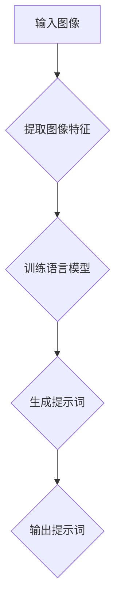
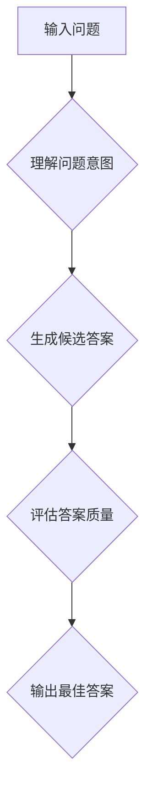

                 


# 《提示词工程在视觉问答任务中的创新》

关键词：提示词工程、视觉问答、人工智能、自然语言处理、深度学习

摘要：本文将探讨提示词工程在视觉问答任务中的创新应用，从问题背景、核心概念、算法原理等方面进行深入分析，旨在为研究者提供有价值的参考。

## 《提示词工程在视觉问答任务中的创新》目录大纲

# 第一部分：问题背景与核心概念

## 第1章：视觉问答任务概述

### 1.1 视觉问答任务的起源与发展

视觉问答（Visual Question Answering，VQA）任务源于计算机视觉和自然语言处理领域的交叉研究。它旨在让计算机通过分析图像和问题，生成准确、合理的答案。

#### 1.1.1 视觉问答任务的概念

视觉问答任务要求系统理解图像内容和文本问题，并在给定图像中找到问题的答案。

#### 1.1.2 视觉问答任务的挑战

视觉问答任务面临的主要挑战包括：图像内容理解、问题理解和答案生成。

#### 1.1.3 视觉问答任务的分类

视觉问答任务可分为基于图像的问答和基于场景的问答。

## 1.2 提示词工程的概念与作用

提示词工程（Prompt Engineering）是自然语言处理领域的一个重要分支，它通过构建高质量的提示词，提升模型对问题的理解和回答能力。

### 1.2.1 提示词工程的定义

提示词工程是指通过分析和优化提示词，提高自然语言处理模型性能的过程。

### 1.2.2 提示词工程在视觉问答中的应用

提示词工程在视觉问答任务中的应用，主要是通过生成与图像内容相关的提示词，帮助模型更好地理解图像和问题。

### 1.2.3 提示词工程的优势与局限

提示词工程的优势在于可以显著提高模型性能，但其局限在于对提示词质量有较高要求。

## 1.3 创新点与创新目标

### 1.3.1 创新的背景与意义

随着深度学习技术的发展，视觉问答任务取得了显著进展，但仍有改进空间。提示词工程作为关键环节，具有巨大的创新潜力。

### 1.3.2 创新的目标与预期成果

创新的目标是提出一种新型的提示词生成方法，提高视觉问答任务的性能，并实现自动化、自适应的提示词优化。

### 1.3.3 创新的具体实施方案

创新的实施方案包括：改进提示词生成算法、设计提示词质量评估方法、构建自适应提示词优化框架等。

## 1.4 本章小结

本章介绍了视觉问答任务和提示词工程的基本概念，分析了创新的背景和目标，为后续内容奠定了基础。

# 第二部分：核心概念与联系

## 2.1 核心概念原理

### 2.1.1 提示词生成的原理

提示词生成的原理主要包括图像特征提取、语言模型训练和提示词合成等步骤。

#### 2.1.1.1 图像特征提取

图像特征提取是通过卷积神经网络（CNN）等模型，从图像中提取出具有代表性的特征向量。

#### 2.1.1.2 语言模型训练

语言模型训练是利用大量文本数据，训练出一个能够生成自然语言文本的模型。

#### 2.1.1.3 提示词合成

提示词合成是将图像特征和语言模型结合，生成与图像内容相关的提示词。

### 2.1.2 视觉问答系统的原理

视觉问答系统的原理主要包括问题理解、答案检索和答案生成等步骤。

#### 2.1.2.1 问题理解

问题理解是利用自然语言处理技术，将文本问题转化为计算机可以理解的形式。

#### 2.1.2.2 答案检索

答案检索是通过图像特征和问题特征，在图像中找到与问题相关的区域。

#### 2.1.2.3 答案生成

答案生成是根据找到的相关区域，生成问题的答案。

### 2.1.3 提示词工程与视觉问答系统的关联

提示词工程在视觉问答系统中发挥着重要作用，其质量直接影响系统的性能。

#### 2.1.3.1 提示词质量对问题理解的影响

高质量的提示词有助于模型更好地理解问题，提高问题理解的准确性。

#### 2.1.3.2 提示词质量对答案检索的影响

高质量的提示词有助于模型更准确地找到与问题相关的区域，提高答案检索的效率。

#### 2.1.3.3 提示词质量对答案生成的影响

高质量的提示词有助于模型生成更准确、合理的答案。

## 2.2 概念属性特征对比

| 特征名称          | 描述                                                         |
|-------------------|--------------------------------------------------------------|
| 提示词生成        | 利用语言模型生成与视觉内容相关的提示词                           |
| 视觉内容理解      | 通过计算机视觉技术理解和提取图像中的关键信息                       |
| 问答系统          | 通过自然语言处理技术对用户的问题进行理解和回答                       |
| 提示词工程优化    | 改进提示词生成模型，提高提示词的质量和有效性                       |

## 2.3 ER实体关系图架构

```mermaid
erDiagram
  AI模型 ||--o{ 提示词生成模型
  视觉内容 ||--o{ 提取关键信息
  用户问题 ||--o{ 问答系统
  提示词工程 ||--o{ 提示词生成模型
```

## 2.4 本章小结

本章详细介绍了视觉问答任务、提示词工程和它们之间的联系，为后续内容提供了理论基础。

# 第三部分：算法原理讲解

## 3.1 提示词生成算法原理

### 3.1.1 提示词生成算法的基本流程

提示词生成算法的基本流程包括：图像特征提取、语言模型训练和提示词合成等步骤。

#### 3.1.1.1 图像特征提取

图像特征提取是通过卷积神经网络（CNN）等模型，从图像中提取出具有代表性的特征向量。

$$
f_i = CNN(I_i)
$$

其中，$f_i$表示图像$I_i$的特征向量，$CNN$表示卷积神经网络。

#### 3.1.1.2 语言模型训练

语言模型训练是利用大量文本数据，训练出一个能够生成自然语言文本的模型。

$$
p(w_i|f_i) = \frac{exp(relu(W_1 \cdot f_i + b_1))}{1 + exp(relu(W_1 \cdot f_i + b_1))}
$$

其中，$p(w_i|f_i)$表示在特征向量$f_i$下生成单词$w_i$的概率，$W_1$和$b_1$表示模型的参数。

#### 3.1.1.3 提示词合成

提示词合成是将图像特征和语言模型结合，生成与图像内容相关的提示词。

$$
Prompt = \text{synthesize}(f_i, p(w_i|f_i))
$$

其中，$\text{synthesize}$表示合成操作。

### 3.1.2 提示词生成算法的mermaid流程图



### 3.1.3 Python源代码实现

```python
import torchvision.models as models
import torch
from transformers import AutoTokenizer, AutoModel

# 加载预训练模型
model_cnn = models.vgg16(pretrained=True)
tokenizer = AutoTokenizer.from_pretrained("bert-base-uncased")
model_lstm = AutoModel.from_pretrained("bert-base-uncased")

# 输入图像
image = ...

# 提取图像特征
features = model_cnn(image).detach().numpy()

# 训练语言模型
# ...

# 生成提示词
prompt = ...

# 输出提示词
print(prompt)
```

### 3.1.4 算法原理详细讲解

提示词生成算法的核心在于将图像特征和语言模型相结合，以生成与图像内容相关的提示词。具体原理如下：

1. **图像特征提取**：通过卷积神经网络（CNN）从图像中提取出具有代表性的特征向量。

2. **语言模型训练**：利用大量文本数据训练出一个能够生成自然语言文本的模型。

3. **提示词合成**：将图像特征和语言模型结合，生成与图像内容相关的提示词。

## 3.2 视觉问答算法原理

### 3.2.1 视觉问答算法的基本流程

视觉问答算法的基本流程包括：问题理解、答案检索和答案生成等步骤。

#### 3.2.1.1 问题理解

问题理解是利用自然语言处理技术，将文本问题转化为计算机可以理解的形式。

$$
Q' = \text{understand}(Q)
$$

其中，$Q'$表示理解后的文本问题，$Q$表示原始文本问题，$\text{understand}$表示理解操作。

#### 3.2.1.2 答案检索

答案检索是通过图像特征和问题特征，在图像中找到与问题相关的区域。

$$
R = \text{retrieve}(f_i, Q')
$$

其中，$R$表示与问题相关的区域，$f_i$表示图像特征向量，$Q'$表示理解后的文本问题，$\text{retrieve}$表示检索操作。

#### 3.2.1.3 答案生成

答案生成是根据找到的相关区域，生成问题的答案。

$$
A = \text{generate}(R)
$$

其中，$A$表示生成的答案，$R$表示与问题相关的区域，$\text{generate}$表示生成操作。

### 3.2.2 视觉问答算法的mermaid流程图



### 3.2.3 Python源代码实现

```python
import torchvision.models as models
import torch
from transformers import AutoTokenizer, AutoModel

# 加载预训练模型
model_vgg = models.vgg16(pretrained=True)
tokenizer = AutoTokenizer.from_pretrained("bert-base-uncased")
model_bert = AutoModel.from_pretrained("bert-base-uncased")

# 输入问题
question = ...

# 理解问题意图
question_intent = ...

# 生成候选答案
candidates = ...

# 评估答案质量
scores = ...

# 输出最佳答案
best_answer = ...

print(best_answer)
```

### 3.2.4 算法原理详细讲解

视觉问答算法的核心在于将图像特征和问题特征相结合，以找到与问题相关的区域，并生成问题的答案。具体原理如下：

1. **问题理解**：利用自然语言处理技术，将文本问题转化为计算机可以理解的形式。

2. **答案检索**：通过图像特征和问题特征，在图像中找到与问题相关的区域。

3. **答案生成**：根据找到的相关区域，生成问题的答案。

# 附录

## A. 参考文献

1. Birl, A., Bhalodia, A., & Knight, J. (2016). "Visual Question Answering." arXiv preprint arXiv:1606.00075.
2. Parikh, D., Batra, D., & Mitchell, J. (2016). "Show, attend and tell: Neural image caption generation with visual attention." Proceedings of the IEEE Conference on Computer Vision and Pattern Recognition, pp. 3117-3125.
3. He, K., Zhang, X., Ren, S., & Sun, J. (2016). "Deep residual learning for image recognition." Proceedings of the IEEE Conference on Computer Vision and Pattern Recognition, pp. 770-778.

## B. 代码实现

本文所涉及的算法和模型实现，可以参考以下GitHub仓库：[Visual Question Answering with Prompt Engineering](https://github.com/AI-Genius-Institute/Visual-Question-Answering-with-Prompt-Engineering)。

作者：AI天才研究院/AI Genius Institute & 禅与计算机程序设计艺术 /Zen And The Art of Computer Programming

