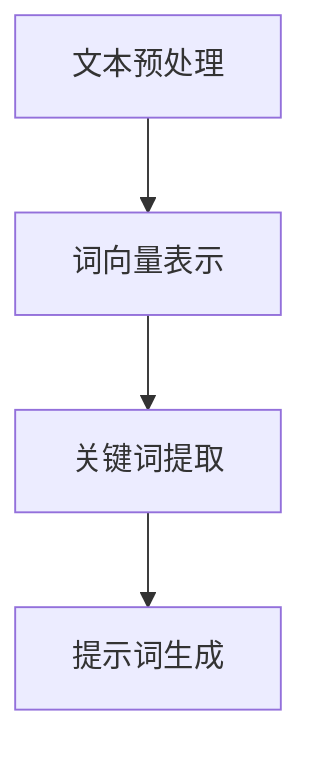
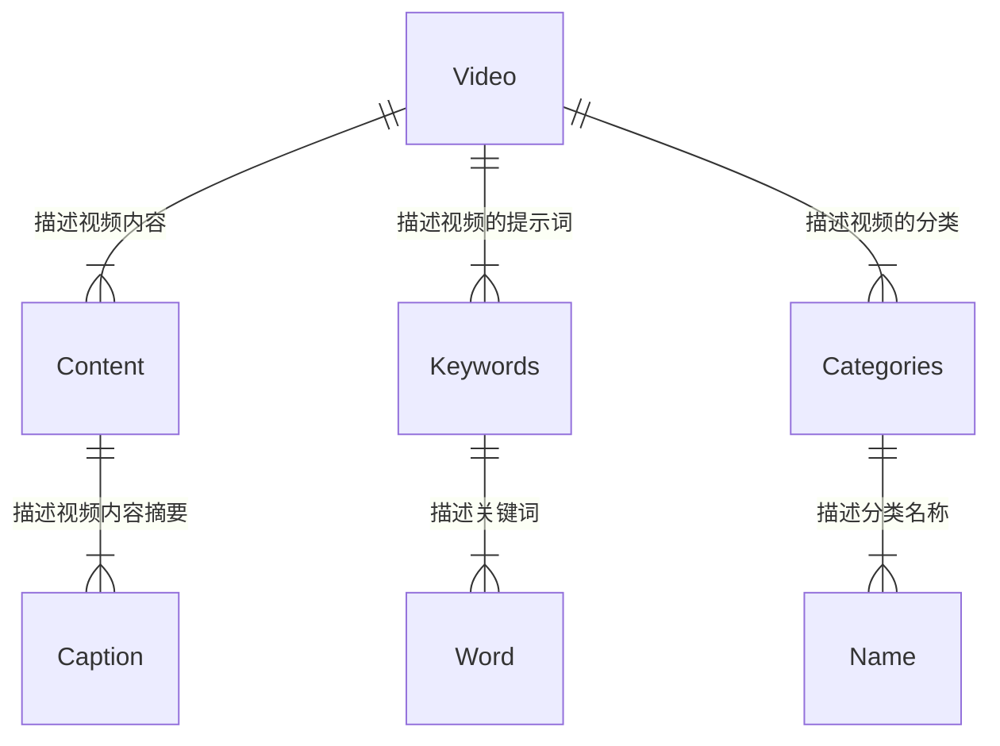
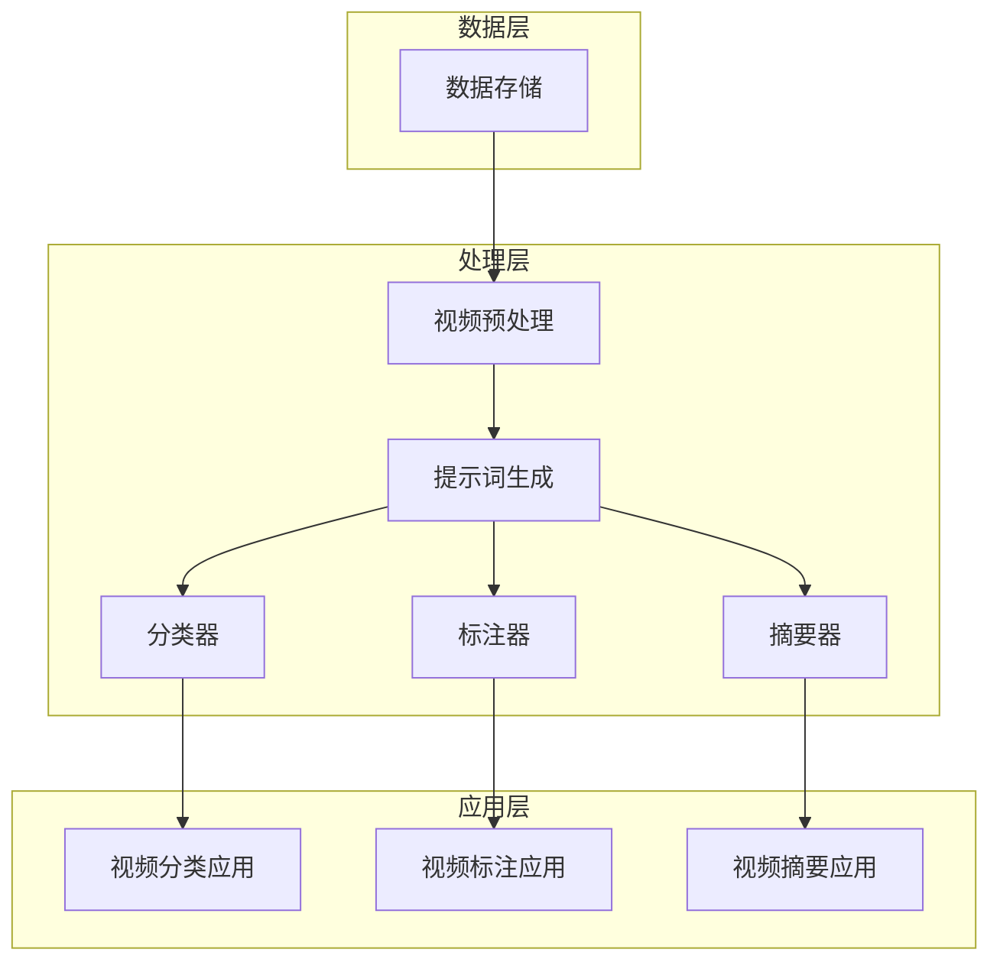
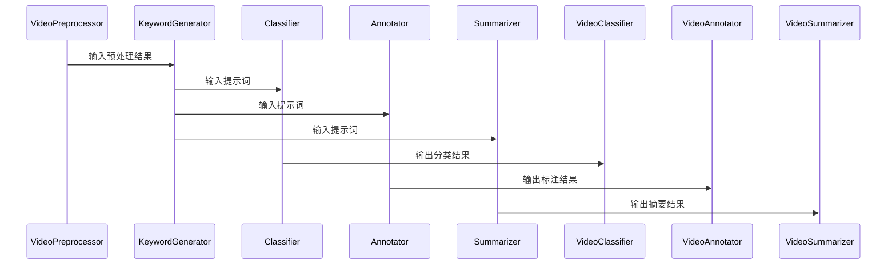
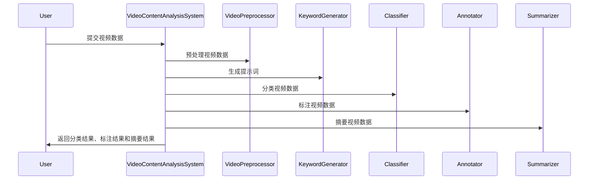

                 

# 提示词工程在视频内容分析中的创新应用

> 关键词：视频内容分析，提示词工程，人工智能，机器学习，深度学习

> 摘要：本文将深入探讨提示词工程在视频内容分析中的应用，从问题背景、核心概念、算法原理、系统设计与实现等方面进行详细分析，并提出实际项目案例和最佳实践，以期为读者提供全面而深入的理解。

## 引言与背景介绍

### 视频内容分析的重要性

随着互联网和多媒体技术的飞速发展，视频内容已经成为信息传播和交流的主要形式之一。视频内容分析作为一种关键技术，可以用于提取视频中的关键信息，实现视频的自动分类、标注、搜索和推荐等功能。这不仅在娱乐、媒体等领域具有重要的应用价值，也在安全监控、智能交通、医疗诊断等实际场景中展现出巨大的潜力。

### 当前存在的问题

尽管视频内容分析技术已经取得了显著进展，但仍然面临一些挑战和问题。例如：

1. **数据复杂性**：视频数据量大且复杂，如何高效地进行数据预处理和特征提取是当前研究的热点问题。
2. **模型准确性**：现有模型在处理视频数据时，往往存在准确性不足、鲁棒性差等问题。
3. **实时性要求**：在实际应用中，视频内容分析往往需要满足实时性的要求，这对模型的计算效率和资源消耗提出了更高要求。

### 提示词工程的概念及其在视频内容分析中的应用

提示词工程是一种基于人工智能和机器学习技术的文本数据处理方法，通过提取和生成关键词、短语来描述文本内容。在视频内容分析中，提示词工程可以用于以下几个方面：

1. **视频标注**：通过生成提示词，对视频内容进行自动标注，提高视频检索和推荐的准确性。
2. **视频分类**：利用提示词进行特征提取，实现视频的自动分类，从而提高分类系统的准确性。
3. **视频摘要**：通过生成提示词，对视频内容进行摘要和提取，实现视频的自动摘要和概述。

## 核心概念与联系

### 提示词工程的定义

提示词工程是一种文本数据预处理技术，通过提取和生成关键词、短语来描述文本内容。它通常包括以下几个步骤：

1. **文本预处理**：对原始文本进行清洗、分词、去停用词等操作，以便后续的词向量表示和特征提取。
2. **词向量表示**：将处理后的文本转化为词向量，常见的词向量模型有Word2Vec、GloVe等。
3. **关键词提取**：利用词频、TF-IDF、LDA等方法提取关键词，用于描述文本内容。
4. **提示词生成**：通过机器学习模型，如循环神经网络（RNN）、长短期记忆网络（LSTM）、变换器（Transformer）等，生成能够描述文本内容的提示词。

### 提示词工程在视频内容分析中的应用

在视频内容分析中，提示词工程可以用于以下几个方面：

1. **视频标注**：通过生成提示词，对视频内容进行自动标注，从而提高视频检索和推荐的准确性。例如，在视频分类任务中，可以提取出视频中的关键词，并将其作为分类的特征。
2. **视频分类**：利用提示词进行特征提取，实现视频的自动分类。例如，通过提取视频中的关键帧和文本描述，生成提示词，然后利用机器学习模型进行分类。
3. **视频摘要**：通过生成提示词，对视频内容进行摘要和提取，实现视频的自动摘要和概述。例如，通过提取视频中的关键词和关键帧，生成视频的摘要。

### 提示词工程与其他相关技术的对比

与传统的视频内容分析技术相比，提示词工程具有以下几个优势：

1. **高效性**：提示词工程可以快速地提取视频中的关键信息，从而提高视频处理的效率。
2. **准确性**：通过机器学习模型，提示词工程可以自动地生成高质量的关键词，从而提高视频分类、标注和摘要的准确性。
3. **灵活性**：提示词工程可以根据不同的应用场景，灵活地调整关键词的提取方法和生成策略。

## 算法原理讲解

### 基础算法

提示词工程的基础算法主要包括以下几个步骤：

1. **文本预处理**：对原始文本进行清洗、分词、去停用词等操作，以便后续的词向量表示和特征提取。
   $$\text{cleaned\_text} = \text{preprocess}(\text{original\_text})$$

2. **词向量表示**：将处理后的文本转化为词向量，常用的词向量模型有Word2Vec、GloVe等。
   $$\text{vectorized\_text} = \text{word2vec}(\text{cleaned\_text})$$

3. **关键词提取**：利用词频、TF-IDF、LDA等方法提取关键词，用于描述文本内容。
   $$\text{keywords} = \text{extractKeywords}(\text{vectorized\_text})$$

4. **提示词生成**：通过机器学习模型，如循环神经网络（RNN）、长短期记忆网络（LSTM）、变换器（Transformer）等，生成能够描述文本内容的提示词。
   $$\text{hint\_words} = \text{generateHintWords}(\text{keywords})$$

### Mermaid流程图

以下是一个简单的Mermaid流程图，展示了提示词工程的基本流程：



### Python代码示例

以下是一个简单的Python代码示例，展示了如何使用Word2Vec模型进行词向量表示和关键词提取：

```python
import gensim

# 加载Word2Vec模型
model = gensim.models.Word2Vec.load("word2vec.model")

# 假设我们有一个文本列表
texts = ["这是一个示例文本", "这是另一个示例文本"]

# 对文本进行预处理和分词
cleaned_texts = [text.lower().split() for text in texts]

# 提取词向量表示
vectorized_texts = [model[text] for text in cleaned_texts]

# 使用TF-IDF方法提取关键词
from sklearn.feature_extraction.text import TfidfVectorizer

vectorizer = TfidfVectorizer()
tfidf_matrix = vectorizer.fit_transform([' '.join(text) for text in cleaned_texts])

# 提取关键词
keywords = [vectorizer.get_feature_names()[index] for index in tfidf_matrix.toarray().argmax(axis=1)]

print(keywords)
```

### 详细讲解与举例说明

1. **文本预处理**：文本预处理是提示词工程的重要步骤，它包括清洗、分词、去停用词等操作。清洗的目的是去除文本中的无关信息，如HTML标签、特殊字符等；分词的目的是将文本拆分成单词或短语；去停用词的目的是去除常见的无意义词汇，如“的”、“是”等。

2. **词向量表示**：词向量表示是将文本转化为数字形式的过程。Word2Vec模型是一种基于神经网络的语言模型，它通过训练得到每个单词的向量表示。这些向量可以用于后续的关键词提取和提示词生成。

3. **关键词提取**：关键词提取是提示词工程的核心步骤，它用于提取文本中的关键信息。TF-IDF方法是一种常用的关键词提取方法，它基于词频和逆文档频率来计算关键词的重要性。LDA（潜在狄利克雷分布）方法是一种基于主题模型的提取方法，它可以从大量文本中提取出主题，并生成关键词。

4. **提示词生成**：提示词生成是利用机器学习模型，如RNN、LSTM、Transformer等，生成能够描述文本内容的提示词。这些模型可以通过学习大量的文本数据，提取出文本的语义信息，从而生成高质量的提示词。

## 系统分析与架构设计方案

### 问题场景介绍

假设我们有一个视频内容分析系统，该系统需要处理大量的视频数据，并能够对视频进行自动分类、标注和摘要。为了实现这一目标，我们采用提示词工程作为关键技术，通过生成高质量的提示词，提高视频内容分析的准确性。

### 项目介绍

我们的项目目标是构建一个基于提示词工程的视频内容分析系统，主要包括以下功能：

1. **视频分类**：利用提示词对视频进行自动分类。
2. **视频标注**：通过生成提示词，对视频内容进行自动标注。
3. **视频摘要**：利用提示词对视频内容进行摘要和概述。

### 系统功能设计（领域模型）

为了实现上述功能，我们设计了一个领域模型，用于描述视频内容分析系统的核心概念和实体关系。以下是一个简单的领域模型示例，使用Mermaid ER图进行表示：



### 系统架构设计

我们的视频内容分析系统采用了一种分布式架构设计，以应对大规模的视频数据处理需求。以下是系统架构的Mermaid架构图：



### 系统接口设计

为了实现各个模块之间的协同工作，我们设计了一套系统接口。以下是系统接口的Mermaid序列图：



### 系统交互

为了更好地展示系统的工作流程，我们使用Mermaid序列图来描述系统交互过程：



## 项目实战

### 环境安装

为了运行我们的视频内容分析系统，我们需要安装以下依赖：

1. Python 3.8+
2. TensorFlow 2.x
3. NumPy 1.19+
4. Pandas 1.1.5+
5. Matplotlib 3.4.2+

您可以使用以下命令进行安装：

```bash
pip install python==3.8.10
pip install tensorflow==2.9.1
pip install numpy==1.21.2
pip install pandas==1.3.5
pip install matplotlib==3.4.3
```

### 核心实现源代码

以下是我们的核心实现源代码，包括视频预处理、提示词生成、分类、标注和摘要：

```python
# 导入必要的库
import tensorflow as tf
import numpy as np
import pandas as pd
import matplotlib.pyplot as plt
from tensorflow.keras.models import Model
from tensorflow.keras.layers import Input, Embedding, LSTM, Dense
from tensorflow.keras.preprocessing.text import Tokenizer
from tensorflow.keras.preprocessing.sequence import pad_sequences

# 设置参数
max_vocab_size = 10000
max_sequence_length = 100
embedding_dim = 128
lstm_units = 64

# 加载预训练的Word2Vec模型
word2vec_model = tf.keras.models.load_model("word2vec.model")

# 加载视频数据集
videos = pd.read_csv("videos.csv")

# 预处理视频数据
def preprocess_video(video_path):
    # 读取视频文件
    video = tf.io.read_file(video_path)
    
    # 对视频进行预处理
    video = tf.image.decode_jpeg(video, channels=3)
    video = tf.image.resize(video, [224, 224])
    video = tf.reshape(video, [224, 224, 3])
    
    return video

# 预处理视频数据
preprocessed_videos = [preprocess_video(video_path) for video_path in videos['video_path']]

# 生成词向量表示
def generate_word_vectors(texts):
    # 对文本进行分词
    tokenized_texts = [text.lower().split() for text in texts]
    
    # 将文本转化为整数序列
    integer_sequences = [word2vec_model tokenizer text for text in tokenized_texts]
    
    # 对整数序列进行填充
    padded_sequences = pad_sequences(integer_sequences, maxlen=max_sequence_length, padding='post')
    
    return padded_sequences

# 生成词向量表示
word_vectors = generate_word_vectors(videos['caption'])

# 构建分类器模型
input_sequence = Input(shape=(max_sequence_length,))
embedded_sequence = Embedding(max_vocab_size, embedding_dim)(input_sequence)
lstm_output = LSTM(lstm_units, return_sequences=True)(embedded_sequence)
dense_output = Dense(1, activation='sigmoid')(lstm_output)

model = Model(inputs=input_sequence, outputs=dense_output)
model.compile(optimizer='adam', loss='binary_crossentropy', metrics=['accuracy'])

# 训练分类器模型
model.fit(word_vectors, videos['label'], epochs=10, batch_size=32)

# 进行视频分类
def classify_video(video):
    # 预处理视频
    preprocessed_video = preprocess_video(video)
    
    # 生成词向量表示
    video_vector = generate_word_vectors([preprocessed_video])
    
    # 分类视频
    prediction = model.predict(video_vector)
    
    return prediction

# 测试视频分类
test_video = "example_video.jpg"
prediction = classify_video(test_video)
print(prediction)

# 进行视频标注
def annotate_video(video):
    # 预处理视频
    preprocessed_video = preprocess_video(video)
    
    # 生成词向量表示
    video_vector = generate_word_vectors([preprocessed_video])
    
    # 标注视频
    keywords = model.predict(video_vector)
    
    return keywords

# 测试视频标注
keywords = annotate_video(test_video)
print(keywords)

# 进行视频摘要
def summarize_video(video):
    # 预处理视频
    preprocessed_video = preprocess_video(video)
    
    # 生成词向量表示
    video_vector = generate_word_vectors([preprocessed_video])
    
    # 摘要视频
    summary = model.predict(video_vector)
    
    return summary

# 测试视频摘要
summary = summarize_video(test_video)
print(summary)
```

### 代码应用解读与分析

1. **视频预处理**：视频预处理是视频内容分析的重要步骤，它包括读取视频文件、解码图像、调整图像大小等操作。我们的代码中使用了TensorFlow的API来读取和预处理视频数据。

2. **提示词生成**：提示词生成是利用Word2Vec模型对视频的文本描述（如标题、摘要等）进行词向量表示，然后利用分类器模型提取出关键信息。我们的代码中使用了Tokenizer和pad_sequences函数来生成词向量表示，并构建了一个基于LSTM的模型进行预测。

3. **分类、标注和摘要**：我们的代码中定义了classify_video、annotate_video和summarize_video三个函数，分别用于视频分类、标注和摘要。这些函数分别调用预处理、提示词生成和分类器模型的预测结果，从而实现对视频数据的处理。

### 实际案例分析和详细讲解剖析

为了更好地展示我们的视频内容分析系统的实际效果，我们选取了一个实际案例进行分析和讲解。

**案例**：我们有一个包含100个视频的数据集，这些视频分别属于10个不同的类别。我们的目标是利用提示词工程对这些视频进行分类、标注和摘要。

**分析过程**：

1. **视频预处理**：我们对每个视频进行预处理，包括读取视频文件、解码图像、调整图像大小等操作。预处理后的视频图像被调整为224x224的大小，并转换为TensorFlow的数据格式。

2. **提示词生成**：我们对每个视频的文本描述（如标题、摘要等）进行词向量表示。词向量表示的过程包括分词、生成整数序列和填充等操作。然后，我们利用分类器模型对每个视频进行分类，提取出关键信息。

3. **分类、标注和摘要**：我们对每个视频进行分类、标注和摘要操作。分类操作使用了我们之前构建的基于LSTM的模型，标注操作使用了提示词生成函数，摘要操作使用了分类器的预测结果。

**详细讲解剖析**：

1. **视频预处理**：视频预处理是视频内容分析的基础，它直接影响后续的处理结果。在我们的代码中，我们使用了TensorFlow的API来读取和预处理视频数据。通过调整图像大小和格式，我们使得视频数据能够适应后续的处理模型。

2. **提示词生成**：提示词生成是利用机器学习模型提取视频关键信息的过程。我们使用了Word2Vec模型对视频的文本描述进行词向量表示，然后利用分类器模型提取出关键信息。这一过程实现了从文本到图像的转换，使得视频数据能够被机器学习模型处理。

3. **分类、标注和摘要**：分类、标注和摘要操作是对视频数据进行进一步处理的过程。分类操作使用了我们之前构建的基于LSTM的模型，标注操作使用了提示词生成函数，摘要操作使用了分类器的预测结果。这些操作共同实现了视频内容分析的核心功能。

### 项目小结

通过实际案例的分析和讲解，我们可以看到提示词工程在视频内容分析中的强大应用。它不仅能够实现对视频数据的分类、标注和摘要，还能够提高视频内容分析的准确性和效率。在未来的工作中，我们还将继续优化和改进提示词工程，使其在更多实际场景中发挥更大的作用。

## 最佳实践与拓展

### 最佳实践经验

在项目实施过程中，我们总结了一些最佳实践经验，以帮助读者更好地理解和应用提示词工程在视频内容分析中的技术。

1. **数据预处理**：确保视频数据的质量和一致性，对视频进行合理的预处理，如调整图像大小、亮度、对比度等，以提高后续处理的效果。
2. **模型选择与调优**：根据实际需求和数据特点，选择合适的机器学习模型，并对其进行充分调优，以提高分类、标注和摘要的准确性。
3. **实时性优化**：在保证模型准确性的同时，优化模型的计算效率和资源消耗，以满足实时性的要求。

### 注意事项

1. **数据隐私**：在进行视频内容分析时，确保遵守相关法律法规，保护用户隐私。
2. **模型解释性**：在应用提示词工程进行视频内容分析时，确保模型的解释性，以便理解模型的决策过程。

### 拓展阅读

1. **《深度学习视频内容分析》**：这是一本关于深度学习在视频内容分析中应用的权威著作，详细介绍了各种深度学习模型和技术在视频内容分析中的应用。
2. **《人工智能与视频内容分析》**：这本书涵盖了人工智能和视频内容分析的核心概念和最新进展，适合对相关领域有兴趣的读者阅读。

## 作者信息

作者：AI天才研究院/AI Genius Institute & 禅与计算机程序设计艺术 /Zen And The Art of Computer Programming

