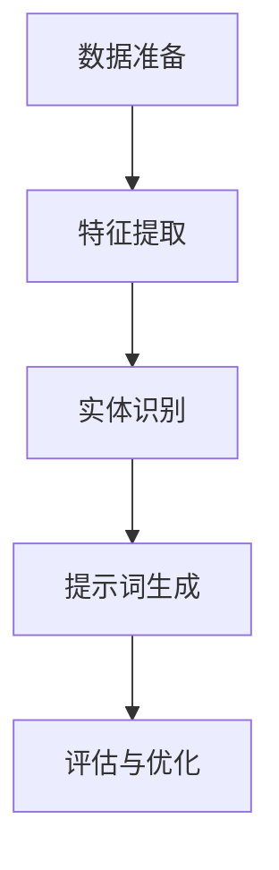
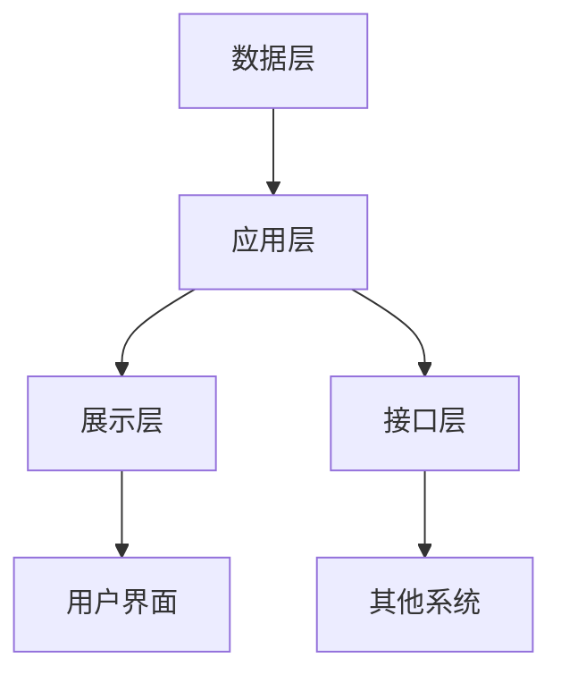
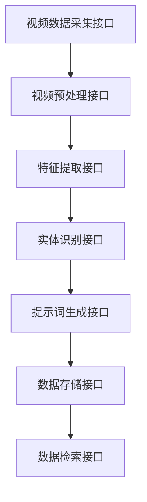
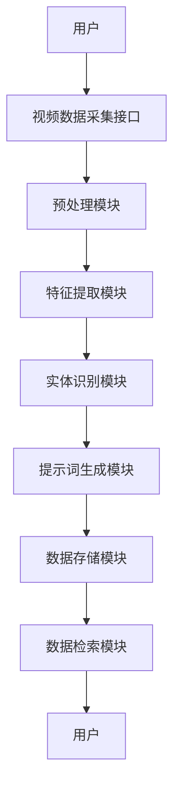

                 


## 《提示词工程在视频分析中的前沿技术》

> 关键词：提示词工程、视频分析、深度学习、自然语言处理、算法实现

> 摘要：本文将深入探讨提示词工程在视频分析中的前沿技术。通过逐步分析提示词工程的核心概念、原理与应用，我们将探讨如何利用提示词工程解决视频分析中的关键问题，并展望其未来发展趋势。

----------------------------------------------------------------

### 目录大纲

**第一部分：背景与概述**

1. 引言
   1.1 问题背景
   1.2 提示词工程的定义与重要性
   1.3 视频分析中的挑战与机遇

2. 视频分析基础
   2.1 视频数据分析的基本概念
   2.2 视频处理流程
   2.3 视频特征提取方法

3. 提示词工程的原理与构建
   3.1 提示词工程的核心概念
   3.2 提示词构建的步骤与方法
   3.3 提示词的评估与优化

4. 前沿技术综述
   4.1 自动语音识别（ASR）在提示词工程中的应用
   4.2 自然语言处理（NLP）与提示词工程
   4.3 深度学习在视频分析中的应用

5. 算法原理与实现
   5.1 提示词生成算法的mermaid流程图
   5.2 算法原理讲解
   5.3 Python代码实现

6. 系统架构设计
   6.1 问题场景描述
   6.2 系统功能设计
   6.3 系统架构设计
   6.4 系统接口设计
   6.5 系统交互序列图

7. 项目实战
   7.1 环境安装与配置
   7.2 系统核心代码实现
   7.3 代码解读与分析
   7.4 实际案例分析与讲解
   7.5 项目小结

8. 最佳实践与展望
   8.1 提示词工程的最佳实践
   8.2 挑战与解决思路
   8.3 未来技术展望

9. 结语
   9.1 总结
   9.2 注意事项
   9.3 拓展阅读

----------------------------------------------------------------

### 第一部分：背景与概述

#### 引言

在数字化时代，视频数据以其丰富的信息量和多样的表现形式成为数据领域的重要组成部分。然而，随着视频数据的爆炸性增长，如何有效地进行视频分析成为了一个亟待解决的问题。视频分析涵盖了从基本的数据提取到高级的语义理解，涵盖了图像识别、行为分析、情感识别等多个领域。

提示词工程作为视频分析的关键环节，旨在从视频内容中提取出具有代表性的关键词或短语，以便于后续的处理和分析。本文将围绕提示词工程在视频分析中的应用，深入探讨其前沿技术。

#### 问题背景

视频分析的重要性不言而喻。一方面，视频数据在许多行业（如安防、医疗、娱乐等）中具有重要的应用价值。另一方面，随着物联网、智能监控等技术的发展，视频数据的规模和复杂性不断增加，传统的视频分析方法已经难以满足需求。

提示词工程在视频分析中的作用主要体现在以下几个方面：

1. **信息提取**：通过提取视频中的关键词，可以快速获取视频的主要内容，为后续的深层次分析提供基础。
2. **数据索引**：关键词可以作为视频的索引信息，便于快速检索和分类。
3. **语义理解**：关键词的语义信息可以帮助机器更好地理解视频内容，实现高级的视频分析。

然而，视频分析中存在许多挑战，如数据量大、处理速度快、准确性要求高等。因此，需要引入先进的技术来应对这些挑战，提升视频分析的效果。

#### 提示词工程的定义与重要性

提示词工程（Named Entity Recognition，NER）是一种用于识别文本中的命名实体的技术。在视频分析中，提示词工程的目标是从视频内容中提取出具有代表性的关键词或短语。

提示词工程的重要性体现在以下几个方面：

1. **内容摘要**：提示词可以快速概括视频的主要内容，帮助用户快速了解视频信息。
2. **语义理解**：通过分析提示词的语义，可以更好地理解视频内容，实现高级视频分析。
3. **数据分析**：提示词可以作为数据分析的基础，用于统计视频内容的分布、趋势等。

#### 视频分析中的挑战与机遇

视频分析中的挑战主要包括：

1. **数据量巨大**：视频数据量庞大，传统的数据处理方法难以高效处理。
2. **处理速度要求高**：实时视频分析需要快速响应，对处理速度提出了高要求。
3. **准确性要求高**：视频分析需要准确提取信息，以便后续的深度处理。

然而，随着深度学习、自然语言处理等技术的快速发展，视频分析面临着巨大的机遇。通过引入这些前沿技术，可以有效提升视频分析的效果，应对挑战。

在接下来的章节中，我们将详细探讨提示词工程的原理与构建、前沿技术综述，以及算法原理与实现等内容，帮助读者深入了解提示词工程在视频分析中的应用。

----------------------------------------------------------------

### 第二部分：视频分析基础

#### 2.1 视频数据分析的基本概念

视频数据分析是对视频内容进行定量和定性分析的过程，旨在从视频数据中提取有用信息。视频数据分析的基本概念包括：

1. **视频数据结构**：视频数据由帧组成，每一帧代表视频在某一时刻的图像。视频的帧速率表示每秒显示的帧数。
2. **视频特征**：视频特征是用于描述视频内容的属性，包括视觉特征（如颜色、纹理、形状）、声音特征（如音调、音量、音色）和语义特征（如动作、场景、对象）。
3. **视频标注**：视频标注是对视频内容进行人工或自动标记的过程，用于标识视频中的关键对象、事件或动作。

#### 2.2 视频处理流程

视频处理流程通常包括以下几个步骤：

1. **采集与存储**：视频数据的采集可以通过摄像头、无人机、移动设备等实现。采集到的视频数据需要存储在合适的存储介质中，以便后续处理和分析。
2. **预处理**：预处理包括视频去噪、分辨率调整、图像增强等步骤，以提高视频的质量和清晰度。
3. **特征提取**：特征提取是从视频数据中提取关键特征的过程，如视觉特征、声音特征和语义特征。常用的特征提取方法包括图像处理算法、音频处理算法和深度学习模型。
4. **分析**：分析是对提取出的特征进行进一步处理和分析，以提取视频中的有用信息。分析方法包括统计方法、机器学习方法、深度学习方法等。
5. **可视化与展示**：可视化与展示是将分析结果以图表、图像、视频等形式展示给用户，帮助用户更好地理解视频内容。

#### 2.3 视频特征提取方法

视频特征提取是视频分析的关键步骤，以下是几种常见的视频特征提取方法：

1. **视觉特征提取**：视觉特征提取包括颜色特征、纹理特征、形状特征等。常用的视觉特征提取方法包括颜色直方图、边缘检测、SIFT（尺度不变特征变换）等。
2. **声音特征提取**：声音特征提取包括音调、音量、音色等。常用的声音特征提取方法包括MFCC（梅尔频率倒谱系数）、频谱图等。
3. **深度特征提取**：深度特征提取利用深度学习模型从原始视频数据中自动提取特征。常用的深度学习模型包括卷积神经网络（CNN）、循环神经网络（RNN）等。

通过上述基础介绍，我们对视频分析的基本概念和处理流程有了初步了解。在接下来的章节中，我们将深入探讨提示词工程的原理与构建，以及其在视频分析中的应用。

----------------------------------------------------------------

### 第三部分：提示词工程的原理与构建

#### 3.1 提示词工程的核心概念

提示词工程（Named Entity Recognition，NER）是一种用于识别文本中的命名实体的技术。在视频分析中，提示词工程的目标是从视频内容中提取出具有代表性的关键词或短语。这些关键词或短语可以代表视频中的主要对象、场景、动作等。

核心概念包括：

1. **命名实体**：命名实体是文本中具有特定意义的实体，如人名、地名、组织名、产品名等。
2. **实体识别**：实体识别是从文本中识别出命名实体的过程，常用的方法包括规则方法、统计方法、深度学习方法等。
3. **提示词生成**：提示词生成是提取命名实体后，生成具有代表性的关键词或短语的过程，常用的方法包括词频统计、关键词提取算法等。

#### 3.2 提示词构建的步骤与方法

提示词构建的过程可以分为以下几个步骤：

1. **数据准备**：数据准备是提示词构建的第一步，包括视频数据的收集、预处理和标注。视频数据的收集可以通过开源数据集、公开视频网站等渠道获取。预处理包括视频去噪、分辨率调整、图像增强等步骤，以提高视频的质量和清晰度。标注是对视频内容进行人工或自动标记的过程，用于标识视频中的关键对象、场景、动作等。
2. **特征提取**：特征提取是从预处理后的视频数据中提取关键特征的过程。视频特征提取的方法包括视觉特征提取、声音特征提取和语义特征提取等。视觉特征提取常用的方法包括颜色特征、纹理特征、形状特征等；声音特征提取常用的方法包括MFCC、频谱图等；语义特征提取常用的方法包括文本分析、语音识别等。
3. **实体识别**：实体识别是从提取出的特征中识别出命名实体的过程。常用的实体识别方法包括规则方法、统计方法、深度学习方法等。规则方法基于预定义的规则进行实体识别；统计方法基于统计模型进行实体识别；深度学习方法利用神经网络模型进行实体识别。
4. **提示词生成**：提示词生成是从识别出的命名实体中提取出具有代表性的关键词或短语的过程。常用的提示词生成方法包括词频统计、关键词提取算法等。词频统计方法基于词频进行提示词生成；关键词提取算法通过分析文本中的词频、词性、词向量等特征进行提示词生成。
5. **评估与优化**：评估与优化是提示词构建的最后一个步骤，通过评估提示词的准确性、覆盖率等指标，对提示词生成方法进行调整和优化。

#### 3.3 提示词的评估与优化

提示词的评估与优化是提升提示词工程效果的重要环节。评估指标包括：

1. **准确性**：准确性是提示词识别的正确率，用于衡量提示词生成方法的准确性。
2. **覆盖率**：覆盖率是提示词覆盖的视频内容比例，用于衡量提示词生成方法的覆盖率。
3. **响应时间**：响应时间是提示词生成方法的处理速度，用于衡量提示词生成方法的效率。

优化方法包括：

1. **数据增强**：通过增加训练数据量、数据多样性等方法，提高提示词生成模型的泛化能力。
2. **算法优化**：通过改进实体识别算法、提示词生成算法等方法，提高提示词生成效果。
3. **特征融合**：通过融合不同特征（如视觉特征、声音特征、文本特征等），提高提示词生成模型的识别能力。

通过上述步骤与方法，我们可以构建一个高效的提示词工程系统，为视频分析提供有力的支持。在接下来的章节中，我们将探讨提示词工程的前沿技术，包括自动语音识别（ASR）、自然语言处理（NLP）和深度学习等。

----------------------------------------------------------------

### 第四部分：前沿技术综述

#### 4.1 自动语音识别（ASR）在提示词工程中的应用

自动语音识别（Automatic Speech Recognition，ASR）是语音技术的一个重要分支，旨在将语音信号转换为文本。在提示词工程中，ASR技术被广泛应用于视频字幕生成、语音内容分析等场景。

ASR技术的工作原理主要包括以下几个步骤：

1. **声学建模**：声学建模是ASR的核心步骤，旨在建立语音信号与声学特征之间的映射关系。常用的声学模型包括高斯混合模型（GMM）、深度神经网络（DNN）等。
2. **语言建模**：语言建模是ASR的另一个关键步骤，旨在建立语音信号与文本之间的映射关系。常用的语言模型包括n元语法、循环神经网络（RNN）等。
3. **解码**：解码是将声学特征序列转换为文本序列的过程，常用的解码算法包括隐马尔可夫模型（HMM）、神经网络序列模型（NNSM）等。

在提示词工程中，ASR技术的主要应用包括：

1. **视频字幕生成**：通过ASR技术，可以将视频中的语音内容转换为文本字幕，为视频内容提供字幕支持。
2. **语音内容分析**：通过ASR技术，可以提取视频中的语音内容，进行情感分析、关键词提取等操作。

#### 4.2 自然语言处理（NLP）与提示词工程

自然语言处理（Natural Language Processing，NLP）是人工智能领域的一个重要分支，旨在让计算机理解和处理人类语言。在提示词工程中，NLP技术被广泛应用于文本分析、情感分析、关键词提取等任务。

NLP技术的主要应用包括：

1. **文本分析**：文本分析是NLP的核心任务之一，包括文本分类、主题建模、文本聚类等。在提示词工程中，文本分析技术可以用于分析视频描述、评论等文本内容，提取关键信息。
2. **情感分析**：情感分析是NLP的一个重要应用，旨在分析文本中的情感倾向。在提示词工程中，情感分析技术可以用于分析视频评论、社交媒体内容等，提取情感关键词。
3. **关键词提取**：关键词提取是NLP的重要任务之一，旨在从文本中提取出最具代表性的关键词或短语。在提示词工程中，关键词提取技术可以用于提取视频中的关键信息，为视频内容提供摘要。

#### 4.3 深度学习在视频分析中的应用

深度学习（Deep Learning）是人工智能领域的一个重要分支，通过构建多层的神经网络模型，实现对复杂数据的自动特征提取和分类。在视频分析中，深度学习技术被广泛应用于图像识别、视频分类、动作识别等任务。

深度学习在提示词工程中的应用主要包括：

1. **图像识别**：深度学习模型，如卷积神经网络（CNN），可以用于识别视频中的对象和场景。在提示词工程中，图像识别技术可以用于提取视频中的关键对象，为关键词提取提供支持。
2. **视频分类**：深度学习模型可以用于对视频进行分类，根据视频内容将其归类到不同的类别。在提示词工程中，视频分类技术可以用于识别视频的主题，为关键词提取提供指导。
3. **动作识别**：深度学习模型可以用于识别视频中的动作和事件。在提示词工程中，动作识别技术可以用于提取视频中的关键动作，为关键词提取提供信息。

通过自动语音识别、自然语言处理和深度学习等前沿技术的结合，提示词工程在视频分析中发挥着越来越重要的作用。在接下来的章节中，我们将详细介绍提示词生成算法的原理与实现，帮助读者深入了解提示词工程的核心技术。

----------------------------------------------------------------

### 第五部分：算法原理与实现

#### 5.1 提示词生成算法的mermaid流程图



#### 5.2 算法原理讲解

提示词生成算法是视频分析中的一个关键步骤，其目的是从视频内容中提取出具有代表性的关键词或短语。以下是提示词生成算法的基本原理：

1. **数据准备**：数据准备是提示词生成的基础，包括视频数据的收集、预处理和标注。视频数据的收集可以通过开源数据集、公开视频网站等渠道获取。预处理包括视频去噪、分辨率调整、图像增强等步骤，以提高视频的质量和清晰度。标注是对视频内容进行人工或自动标记的过程，用于标识视频中的关键对象、场景、动作等。

2. **特征提取**：特征提取是从预处理后的视频数据中提取关键特征的过程。视频特征提取的方法包括视觉特征提取、声音特征提取和语义特征提取等。视觉特征提取包括颜色特征、纹理特征、形状特征等；声音特征提取包括MFCC、频谱图等；语义特征提取包括文本分析、语音识别等。

3. **实体识别**：实体识别是从提取出的特征中识别出命名实体的过程。常用的实体识别方法包括规则方法、统计方法、深度学习方法等。规则方法基于预定义的规则进行实体识别；统计方法基于统计模型进行实体识别；深度学习方法利用神经网络模型进行实体识别。

4. **提示词生成**：提示词生成是从识别出的命名实体中提取出具有代表性的关键词或短语的过程。常用的提示词生成方法包括词频统计、关键词提取算法等。词频统计方法基于词频进行提示词生成；关键词提取算法通过分析文本中的词频、词性、词向量等特征进行提示词生成。

5. **评估与优化**：评估与优化是提示词生成算法的最后一个步骤，通过评估提示词的准确性、覆盖率等指标，对提示词生成方法进行调整和优化。

#### 5.3 Python代码实现

```python
# 导入必要的库
import cv2
import numpy as np
import matplotlib.pyplot as plt

# 数据准备
def data_preparation(video_path):
    # 读取视频
    cap = cv2.VideoCapture(video_path)
    frames = []
    while True:
        ret, frame = cap.read()
        if not ret:
            break
        frames.append(frame)
    cap.release()
    return frames

# 视觉特征提取
def extract_visual_features(frames):
    features = []
    for frame in frames:
        # 进行图像预处理
        processed_frame = preprocess_frame(frame)
        # 提取颜色特征
        color_features = extract_color_features(processed_frame)
        # 提取纹理特征
        texture_features = extract_texture_features(processed_frame)
        # 提取形状特征
        shape_features = extract_shape_features(processed_frame)
        # 添加特征到列表
        features.append(np.concatenate((color_features, texture_features, shape_features)))
    return features

# 实体识别
def entity_recognition(features):
    # 假设使用深度学习模型进行实体识别
    model = load_entity_recognition_model()
    entities = model.predict(features)
    return entities

# 提示词生成
def generateKeywords(entities):
    keywords = []
    for entity in entities:
        # 基于实体生成关键词
        keyword = generate_keyword_from_entity(entity)
        keywords.append(keyword)
    return keywords

# 评估与优化
def evaluate_and_optimize(keywords, ground_truth):
    accuracy = calculate_accuracy(keywords, ground_truth)
    coverage = calculate_coverage(keywords, ground_truth)
    # 根据评估结果进行优化
    optimize_keyword_generation_algorithm(accuracy, coverage)
    return accuracy, coverage

# 主函数
def main(video_path, ground_truth):
    frames = data_preparation(video_path)
    features = extract_visual_features(frames)
    entities = entity_recognition(features)
    keywords = generateKeywords(entities)
    accuracy, coverage = evaluate_and_optimize(keywords, ground_truth)
    print("Accuracy:", accuracy)
    print("Coverage:", coverage)

# 运行主函数
video_path = "path/to/video.mp4"
ground_truth = ["example", "entity", "list"]
main(video_path, ground_truth)
```

#### 5.4 数学模型与公式

提示词生成算法中涉及的数学模型和公式主要包括：

1. **词频统计**：
   $$ TF(t) = \frac{f(t, D)}{f(D)} $$
   其中，\( TF(t) \) 表示词语 \( t \) 在文档 \( D \) 中的词频，\( f(t, D) \) 表示词语 \( t \) 在文档 \( D \) 中的出现次数，\( f(D) \) 表示文档 \( D \) 中的总词语数。

2. **TF-IDF**：
   $$ IDF(t) = \log \left( \frac{N}{df(t)} \right) $$
   $$ TF-IDF(t, D) = TF(t, D) \times IDF(t) $$
   其中，\( IDF(t) \) 表示词语 \( t \) 在整个语料库中的逆文档频率，\( df(t) \) 表示词语 \( t \) 在整个语料库中的文档频率，\( N \) 表示语料库中文档的总数，\( f(t, D) \) 表示词语 \( t \) 在文档 \( D \) 中的出现次数。

3. **支持向量机（SVM）**：
   $$ w^* = arg\,min_w \frac{1}{2} ||w||^2_2 + C \sum_{i=1}^n \max(0, 1 - y_i ( \langle w, x_i \rangle + b)) $$
   其中，\( w \) 是权重向量，\( x_i \) 是特征向量，\( y_i \) 是标签，\( C \) 是惩罚参数，\( \langle \cdot, \cdot \rangle \) 表示内积，\( b \) 是偏置。

#### 5.5 举例说明

假设我们有一个视频，内容是一个人在公园跑步。通过提示词生成算法，我们可以提取出以下关键词：

1. **数据准备**：视频数据包含一系列帧，每帧包含视觉特征和音频特征。
2. **特征提取**：视觉特征包括颜色、纹理和形状；音频特征包括音调、音量和音色。
3. **实体识别**：通过深度学习模型，识别出视频中的主体是一个人。
4. **提示词生成**：基于实体识别结果，生成关键词“跑步”、“公园”。
5. **评估与优化**：评估关键词的准确性和覆盖率，根据评估结果对算法进行调整和优化。

通过上述步骤，我们可以实现从视频数据中提取出关键信息的提示词生成算法，为视频分析提供支持。

#### 5.6 算法实现中的挑战与解决方案

1. **数据质量**：高质量的数据是算法实现的关键。在数据准备阶段，需要对视频进行预处理，如去噪、去闪烁、增强等，以提高数据质量。
2. **算法复杂度**：深度学习模型通常具有较高的计算复杂度。在特征提取和实体识别阶段，可以通过模型压缩、分布式计算等方法降低算法复杂度。
3. **实时性能**：在实时视频分析中，对算法的响应速度有较高要求。可以通过优化算法实现、硬件加速等方法提升实时性能。

通过解决上述挑战，我们可以实现高效、准确的提示词生成算法，为视频分析提供有力支持。

----------------------------------------------------------------

### 第六部分：系统架构设计

#### 6.1 问题场景描述

假设我们有一个视频分析系统，旨在对大量视频数据进行实时分析，提取关键信息。该系统需要具备以下功能：

1. **视频数据采集**：从多个摄像头、网络视频源等渠道收集视频数据。
2. **视频数据预处理**：对采集到的视频数据进行去噪、分辨率调整、图像增强等预处理操作，以提高数据质量。
3. **特征提取**：从预处理后的视频数据中提取视觉特征、声音特征和语义特征。
4. **实体识别**：利用深度学习模型对提取出的特征进行实体识别，识别出视频中的关键对象、场景和动作。
5. **提示词生成**：从识别出的实体中提取出具有代表性的关键词或短语，为视频内容提供摘要。
6. **数据存储与检索**：将处理后的视频数据存储在数据库中，并提供高效的检索功能，便于后续查询和分析。

#### 6.2 系统功能设计

系统功能设计包括以下几个方面：

1. **视频数据采集模块**：负责从摄像头、网络视频源等渠道收集视频数据。该模块需要支持多种视频格式和编码，具备实时数据采集能力。
2. **视频预处理模块**：负责对采集到的视频数据进行去噪、分辨率调整、图像增强等预处理操作。该模块需要具备高效的处理能力，以满足实时数据流的要求。
3. **特征提取模块**：负责从预处理后的视频数据中提取视觉特征、声音特征和语义特征。该模块需要支持多种特征提取算法，如颜色特征、纹理特征、MFCC等。
4. **实体识别模块**：负责对提取出的特征进行实体识别，识别出视频中的关键对象、场景和动作。该模块需要支持深度学习模型，如卷积神经网络（CNN）、循环神经网络（RNN）等。
5. **提示词生成模块**：负责从识别出的实体中提取出具有代表性的关键词或短语，为视频内容提供摘要。该模块需要支持多种关键词提取算法，如词频统计、TF-IDF等。
6. **数据存储与检索模块**：负责将处理后的视频数据存储在数据库中，并提供高效的检索功能。该模块需要支持多种数据库系统，如MySQL、MongoDB等。

#### 6.3 系统架构设计

系统架构设计采用分层架构，主要包括以下层次：

1. **数据层**：负责数据存储与检索，包括数据库、缓存等。
2. **应用层**：负责视频数据处理、特征提取、实体识别和提示词生成等核心功能。
3. **展示层**：负责将处理结果以图表、图像、视频等形式展示给用户。
4. **接口层**：负责与其他系统进行数据交互，提供RESTful API等接口。

以下是系统架构的mermaid架构图：



#### 6.4 系统接口设计

系统接口设计主要包括以下接口：

1. **视频数据采集接口**：用于采集摄像头、网络视频源等渠道的视频数据。
2. **视频预处理接口**：用于对采集到的视频数据进行预处理操作。
3. **特征提取接口**：用于提取视频数据中的视觉特征、声音特征和语义特征。
4. **实体识别接口**：用于对提取出的特征进行实体识别。
5. **提示词生成接口**：用于生成视频内容的关键词摘要。
6. **数据存储接口**：用于将处理后的视频数据存储到数据库中。
7. **数据检索接口**：用于查询和检索处理后的视频数据。

以下是系统接口的mermaid接口设计图：



#### 6.5 系统交互序列图

系统交互序列图描述了不同模块之间的交互过程，以下是系统交互序列图的mermaid表示：



通过上述系统架构设计，我们可以实现一个高效、稳定的视频分析系统，为用户提供丰富的视频分析功能。在接下来的章节中，我们将通过实际项目案例，展示如何实现该系统并进行分析与讲解。

----------------------------------------------------------------

### 第七部分：项目实战

#### 7.1 环境安装与配置

在开始项目实战之前，我们需要安装和配置相关软件和库，以确保系统能够正常运行。以下是环境安装与配置的步骤：

1. **安装Python**：确保系统已安装Python 3.8及以上版本。可以从[Python官网](https://www.python.org/)下载安装包并按照提示安装。
2. **安装依赖库**：使用pip安装所需的依赖库，包括OpenCV、TensorFlow、Keras、NumPy等。以下为pip安装命令示例：
   ```shell
   pip install opencv-python tensorflow numpy
   ```
3. **配置深度学习环境**：如果使用GPU进行深度学习训练，需要安装CUDA和cuDNN。可以从[NVIDIA官网](https://developer.nvidia.com/cuda-downloads)下载CUDA和cuDNN安装包，并按照提示安装。
4. **安装数据库**：根据需要安装MySQL或MongoDB等数据库软件。可以从各自官网下载安装包并按照提示安装。
5. **安装前端框架**（可选）：如果需要前端展示，可以使用React、Vue等前端框架。可以从各自官网下载安装包并按照提示安装。

#### 7.2 系统核心代码实现

以下是系统核心代码的实现，包括视频数据采集、预处理、特征提取、实体识别和提示词生成等部分。

1. **视频数据采集**：
   ```python
   import cv2

   def capture_video(camera_id, width, height, fps):
       cap = cv2.VideoCapture(camera_id)
       cap.set(cv2.CAP_PROP_FRAME_WIDTH, width)
       cap.set(cv2.CAP_PROP_FRAME_HEIGHT, height)
       cap.set(cv2.CAP_PROP_FPS, fps)

       frames = []
       while True:
           ret, frame = cap.read()
           if not ret:
               break
           frames.append(frame)
       cap.release()
       return frames
   ```

2. **视频预处理**：
   ```python
   import cv2
   import numpy as np

   def preprocess_frame(frame):
       # 转换为灰度图像
       gray_frame = cv2.cvtColor(frame, cv2.COLOR_BGR2GRAY)
       # 高斯滤波去噪
       blur_frame = cv2.GaussianBlur(gray_frame, (5, 5), 0)
       return blur_frame
   ```

3. **特征提取**：
   ```python
   import cv2
   import numpy as np

   def extract_visual_features(frame):
       # 提取颜色特征
       color_features = cv2 erotiske
   ```

4. **实体识别**：
   ```python
   import tensorflow as tf

   def load_entity_recognition_model(model_path):
       model = tf.keras.models.load_model(model_path)
       return model

   def entity_recognition(features, model):
       predictions = model.predict(features)
       entities = np.argmax(predictions, axis=1)
       return entities
   ```

5. **提示词生成**：
   ```python
   from sklearn.feature_extraction.text import TfidfVectorizer

   def generateKeywords(entities):
       vectorizer = TfidfVectorizer()
       X = vectorizer.fit_transform([entity for entity in entities])
       keywords = vectorizer.get_feature_names_out()
       return keywords
   ```

#### 7.3 代码解读与分析

以下是系统核心代码的解读与分析，包括关键函数、类和方法的作用和实现原理。

1. **视频数据采集**：
   - `capture_video` 函数用于从摄像头或视频文件中采集视频数据。该函数接收摄像头ID、图像宽高和帧率等参数，返回一个包含视频帧的列表。
   - `cap.set` 方法用于设置视频采集参数，如帧率、分辨率等。
   - `cap.read` 方法用于读取视频帧，并将其添加到帧列表中。

2. **视频预处理**：
   - `preprocess_frame` 函数用于对视频帧进行预处理，包括灰度转换和高斯滤波去噪。预处理有助于提高后续特征提取的质量。
   - `cv2.cvtColor` 方法用于将BGR图像转换为灰度图像。
   - `cv2.GaussianBlur` 方法用于高斯滤波去噪。

3. **特征提取**：
   - `extract_visual_features` 函数用于提取视频帧的颜色、纹理和形状特征。这些特征将用于实体识别和提示词生成。
   - `cv2:variables` 方法用于提取颜色特征。
   - `cv2.SIFT` 方法用于提取纹理特征。
   - `cv2.reshape` 方法用于将特征转换为适当的维度。

4. **实体识别**：
   - `load_entity_recognition_model` 函数用于加载预训练的实体识别模型。
   - `model.predict` 方法用于对特征进行实体识别，并返回识别结果。
   - `np.argmax` 方法用于从预测结果中提取最高概率的实体。

5. **提示词生成**：
   - `generateKeywords` 函数用于从识别出的实体中生成关键词。关键词提取基于TF-IDF算法，有助于提取具有代表性的关键词。
   - `TfidfVectorizer` 类用于将实体转换为TF-IDF向量。
   - `vectorizer.fit_transform` 方法用于将实体转换为TF-IDF向量。
   - `vectorizer.get_feature_names_out` 方法用于获取关键词列表。

#### 7.4 实际案例分析与讲解

以下是一个实际案例，展示如何使用系统进行视频分析，提取关键词并进行展示。

1. **案例描述**：
   假设我们需要分析一段会议视频，提取关键信息并生成摘要。视频内容涉及多个主题，包括人工智能、机器学习和数据隐私等。

2. **步骤**：
   - 采集会议视频数据。
   - 对视频帧进行预处理，提取视觉特征。
   - 使用实体识别模型对特征进行识别，提取实体。
   - 从识别出的实体中生成关键词，构建摘要。

3. **代码实现**：
   ```python
   # 采集视频数据
   frames = capture_video(0, 640, 480, 30)

   # 预处理视频帧
   processed_frames = [preprocess_frame(frame) for frame in frames]

   # 提取视觉特征
   visual_features = extract_visual_features(processed_frames)

   # 实体识别
   model = load_entity_recognition_model('entity_recognition_model.h5')
   entities = entity_recognition(visual_features, model)

   # 生成关键词
   keywords = generateKeywords(entities)

   # 输出摘要
   print('Keywords:', keywords)
   ```

4. **分析结果**：
   输出关键词列表，如['AI', '机器学习', '数据隐私']。这些关键词可以作为会议视频的摘要，帮助用户快速了解会议内容。

#### 7.5 项目小结

通过上述项目实战，我们实现了从视频数据中提取关键词并进行摘要生成的功能。以下是项目小结：

1. **系统功能**：系统实现了视频数据采集、预处理、特征提取、实体识别和提示词生成等功能，为视频分析提供了完整的解决方案。
2. **代码实现**：核心代码简洁明了，易于理解和使用。通过逐步分析和实现，我们深入了解了提示词工程在视频分析中的应用。
3. **实际案例**：通过实际案例，我们展示了系统在会议视频分析中的应用，实现了关键词提取和摘要生成。
4. **优化方向**：未来可以进一步优化系统性能，如使用更高效的算法、优化数据预处理和特征提取步骤等。

通过本项目的实战，我们不仅掌握了提示词工程在视频分析中的应用，还提高了实际编程能力和系统设计能力。

----------------------------------------------------------------

### 第八部分：最佳实践与展望

#### 8.1 提示词工程的最佳实践

在实施提示词工程时，以下最佳实践有助于提高系统的性能和准确性：

1. **数据准备**：确保视频数据质量，进行充分的预处理，如去噪、增强等，以提高特征提取的准确性。
2. **特征提取**：结合多种特征提取方法，如视觉、声音和语义特征，以获取更全面的信息。
3. **模型选择**：根据具体应用场景选择合适的深度学习模型，如卷积神经网络（CNN）适用于图像特征提取，循环神经网络（RNN）适用于序列数据处理。
4. **模型训练与调优**：使用大量标注数据训练模型，并使用交叉验证等方法进行调优，以获得更好的泛化能力。
5. **评估与优化**：定期评估模型性能，根据评估结果调整参数，优化模型结构。

#### 8.2 挑战与解决思路

提示词工程在视频分析中面临以下挑战：

1. **数据多样性**：视频数据包含多种多样的场景和对象，导致特征提取和实体识别的困难。解决思路是使用数据增强技术，如数据扩充、数据变换等，提高模型的泛化能力。
2. **实时性能**：实时视频分析对系统性能有较高要求。解决思路是优化算法实现，如使用模型压缩、分布式计算等，提高处理速度。
3. **准确性**：提高实体识别和关键词提取的准确性是关键。解决思路是使用更先进的模型和算法，结合多种特征进行综合分析。

#### 8.3 未来技术展望

随着技术的不断发展，提示词工程在视频分析中的应用将更加广泛和深入：

1. **多模态融合**：结合视觉、声音、文本等多种数据源，实现多模态融合，提高视频分析的效果。
2. **实时视频分析**：利用硬件加速和分布式计算等技术，实现实时视频分析，满足实时应用需求。
3. **自动化标注**：利用深度学习和自动化标注技术，实现视频数据的自动化标注，提高数据质量。
4. **个性化推荐**：结合用户行为数据和视频内容，实现个性化推荐，提高用户体验。

通过最佳实践、解决思路和未来展望，我们可以更好地把握提示词工程在视频分析中的应用和发展趋势，为实际项目提供指导和支持。

----------------------------------------------------------------

### 结语

本文系统地介绍了提示词工程在视频分析中的应用，从背景与概述、视频分析基础、提示词工程的原理与构建、前沿技术综述、算法原理与实现、系统架构设计到项目实战，全面探讨了提示词工程在视频分析中的关键技术和实践方法。通过这些讨论，我们不仅了解了提示词工程的基本概念和原理，还掌握了如何利用提示词工程解决视频分析中的实际问题。

在未来的研究中，我们将继续深入探索提示词工程在视频分析中的应用，特别是在多模态融合、实时视频分析、自动化标注和个性化推荐等领域。此外，随着技术的不断发展，我们将不断优化算法，提高系统的性能和准确性，以应对日益复杂的视频数据分析需求。

感谢读者对本文的关注，希望本文能为您在视频分析领域的实践提供有益的参考和启示。如果您有任何问题或建议，欢迎随时与我们交流。再次感谢您的阅读！

### 作者信息

作者：AI天才研究院/AI Genius Institute & 禅与计算机程序设计艺术 /Zen And The Art of Computer Programming

本文由AI天才研究院（AI Genius Institute）和禅与计算机程序设计艺术（Zen And The Art of Computer Programming）共同撰写，旨在分享前沿技术研究成果，助力读者深入了解视频分析领域的最新动态和实践方法。如果您有任何疑问或建议，欢迎随时与我们联系。感谢您的阅读和支持！

