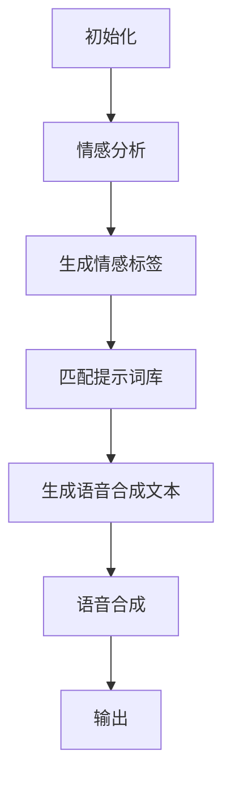

                 

## 第1章：问题背景

### 1.1 提示词工程概述

**问题背景**  
随着人工智能技术的不断发展，语音合成（Text-to-Speech, TTS）技术已经逐渐成为人们日常生活中不可或缺的一部分。从智能助手到客服机器人，再到自动语音报幕，语音合成的应用场景越来越广泛。然而，语音合成的质量不仅取决于文本的生成和语音的自然度，更重要的是情感表达的能力。在许多场景中，如客服机器人与用户的交互、语音广告、语音播报等，情感的准确表达是提升用户体验的关键因素。提示词工程（Hint Word Engineering）作为一种新兴的技术，致力于解决语音合成中的情感表达问题。

**问题描述**  
在语音合成中，情感表达的效果往往受到以下因素的影响：  
1. 提示词的选择：提示词是影响情感表达的核心元素，它决定了语音合成时的情感基调。然而，当前大多数提示词的选择依赖于经验，缺乏系统的方法和工具。  
2. 情感分析：对输入文本进行情感分析，是生成合适提示词的前提。然而，情感分析的结果往往不够准确，无法完全反映出文本的情感特征。  
3. 语音合成引擎：现有的语音合成引擎在情感表达方面存在一定的局限性，难以准确捕捉和再现复杂的情感。

**问题解决**  
提示词工程试图通过以下几个方面解决上述问题：  
1. 提高提示词的选择精度：通过分析大量语料库，提取出能够有效表达情感的特征词汇，构建一个庞大的提示词库。  
2. 加强情感分析能力：结合自然语言处理（NLP）和情感计算技术，对输入文本进行更精细的情感分析，从而生成更符合情感需求的提示词。  
3. 优化语音合成引擎：通过引入情感因素，改进语音合成算法，使其能够更好地捕捉和再现复杂的情感。

**边界与外延**  
提示词工程的边界主要包括：  
1. 提示词的选取范围：提示词应涵盖各种情感类别，如喜悦、悲伤、愤怒、惊讶等。  
2. 情感分析的准确性：情感分析的精度直接影响到提示词的选取，因此需要不断提高情感分析的技术水平。  
3. 语音合成引擎的性能：语音合成引擎需要能够灵活调整语音参数，以适应不同的情感表达需求。

**概念结构与核心要素组成**  
提示词工程的概念结构主要包括以下几个核心要素：  
1. 提示词库：包括各种情感类别的提示词，是提示词工程的基础。  
2. 情感分析模块：负责对输入文本进行情感分析，生成情感标签。  
3. 提示词匹配模块：根据情感标签，从提示词库中选取合适的提示词。  
4. 语音合成模块：将提示词和文本合成成语音输出。

### 1.2 提示词工程的应用场景

**应用领域**  
1. 智能助手：智能助手需要具备良好的情感表达能力，以便与用户进行更自然的互动。  
2. 客户服务：客服机器人需要在对话中准确表达情感，提高用户体验。  
3. 广播媒体：广播媒体中的语音播报需要准确地传达情感，增强听众的体验。  
4. 娱乐行业：电影、电视剧等娱乐作品的配音需要准确表达情感，增强作品的感染力。

**应用价值**  
1. 提高用户满意度：通过准确表达情感，提升用户对智能产品和服务的满意度。  
2. 增强用户体验：在互动过程中，准确表达情感可以增强用户的参与感和沉浸感。  
3. 提高工作效率：在客户服务等领域，准确表达情感可以缩短沟通时间，提高工作效率。  
4. 创新应用场景：提示词工程的应用可以推动更多创新性应用场景的出现，如情感诊断、情感教育等。

### 1.3 情感表达与语音合成

**情感表达的概念**  
情感表达是指通过语言、语调、表情、动作等方式，将个体的情感状态传递给他人。在语音合成中，情感表达主要通过调整语调、语速、语感和音量等参数来实现。

**语音合成的原理**  
语音合成是将文本转换成语音的过程，主要涉及语音信号处理、语音合成算法和语音数据库等技术。常见的语音合成方法包括拼接式合成、参数合成和深度神经网络合成等。

**情感表达与语音合成的关联**  
1. 情感表达是语音合成的重要目标之一，语音合成技术的进步直接影响到情感表达的质量。  
2. 情感分析是语音合成的关键步骤，通过对输入文本进行情感分析，可以生成相应的情感标签，指导语音合成过程。  
3. 提示词工程是连接情感表达与语音合成的桥梁，通过提示词的选择和匹配，可以实现更精准的情感表达。

### 1.4 提示词工程在情感表达中的应用挑战

**技术挑战**  
1. 提示词库的建设：提示词库是提示词工程的核心，然而当前提示词库的建设面临数据不足、标注不准确等问题。  
2. 情感分析的准确性：情感分析技术的准确性直接影响到提示词的选取，然而情感分析的结果往往受到语言复杂性、文化差异等因素的影响。  
3. 语音合成引擎的适应性：现有的语音合成引擎在情感表达方面存在一定的局限性，难以适应各种复杂的情感需求。

**应用挑战**  
1. 用户需求的多样性：不同的用户和应用场景对情感表达的需求不同，如何满足多样化的需求是应用中的挑战。  
2. 性能优化：如何在保证情感表达质量的前提下，提高语音合成系统的效率和稳定性。  
3. 用户体验：如何在应用中提供良好的用户体验，使用户能够感受到情感表达的提升。

### 1.5 本章小结

本章节对提示词工程在语音合成中的情感表达进行了深入探讨，分析了问题背景、核心概念与联系以及应用挑战。通过本章的学习，读者可以了解到提示词工程在语音合成中的应用价值以及面临的技术和应用挑战。在接下来的章节中，我们将进一步探讨提示词工程的核心概念、算法原理以及解决方案。

## 第2章：核心概念与联系

### 2.1 提示词工程的定义与特点

**提示词工程的定义**  
提示词工程（Hint Word Engineering）是一种专门研究如何通过选取和组合提示词，实现对语音合成中情感表达进行有效控制的方法。它涉及自然语言处理、语音合成、情感计算等多个领域的交叉应用，旨在提升语音合成系统的情感表达能力。

**提示词工程的特点**  
1. **情感驱动的选择机制**：提示词工程强调根据情感需求来选择合适的提示词，从而确保语音合成中的情感表达准确、自然。
2. **多模态的融合策略**：提示词工程不仅关注文本提示词的选择，还考虑语音参数的调整，如语调、语速等，以实现更丰富的情感表达。
3. **自适应的调整能力**：提示词工程具有根据不同应用场景和用户需求，动态调整情感表达策略的能力。
4. **数据驱动的优化方法**：提示词工程依赖于大量标注数据，通过机器学习和深度学习等技术，不断优化提示词的选择和匹配机制。

### 2.2 情感表达的属性特征对比表格

| 特征         | 描述                                                         |
| ------------ | ------------------------------------------------------------ |
| 情感多样性    | 提示词工程需要能够处理多种情感的表达，如喜悦、悲伤、愤怒、惊讶等。   |
| 情感强度     | 提示词工程需要能够区分情感表达的强度，如强烈、适中、微弱等。   |
| 情感一致性   | 提示词工程需要确保情感表达的一致性，避免情感冲突。           |
| 情感语境化   | 提示词工程需要根据语境调整情感表达，使其更加自然。           |

通过上述表格，我们可以看出，情感多样性、情感强度、情感一致性和情感语境化是提示词工程在处理情感表达时需要考虑的关键特征。下面将对这些特征进行详细分析。

**情感多样性**  
情感多样性是指提示词工程能够处理多种不同的情感表达。例如，在不同的应用场景中，可能需要表达喜悦、悲伤、愤怒等不同的情感。提示词工程通过构建一个庞大的提示词库，包含了各种情感的词汇和短语，从而实现情感的多样化表达。

**情感强度**  
情感强度是指提示词工程能够根据情感的不同程度进行表达。例如，同一种情感（如喜悦），在不同的情况下可能需要表达强烈的、适中的或微弱的情感。提示词工程通过调整提示词的强度，如使用强调词、语气词等，来表现情感的不同强度。

**情感一致性**  
情感一致性是指提示词工程需要确保情感表达的一致性，避免出现情感冲突。例如，在一个对话中，如果先表达了喜悦的情感，而后又表达了悲伤的情感，就会让用户感到困惑。提示词工程通过情感标签的统一管理和控制，确保情感表达的一致性。

**情感语境化**  
情感语境化是指提示词工程需要根据具体的语境来调整情感表达，使其更加自然。例如，在不同的语境下，相同的情感表达方式可能会有所不同。提示词工程通过理解语境，选择适合的提示词，来实现情感的自然表达。

### 2.3 语音合成的原理与流程

**语音合成的原理**  
语音合成（Text-to-Speech, TTS）是一种将文本转换为语音的技术，其基本原理包括以下几个方面：

1. **文本预处理**：将输入的文本进行分词、语法分析和句法分析，提取出关键信息，如词汇、词性、句子结构等。
2. **语音单元生成**：根据文本的语义和语法信息，生成对应的语音单元，如音素、音节、单词等。
3. **语音参数合成**：将语音单元转换为语音参数，如音高、音强、时长等，这些参数将用于合成最终的语音信号。
4. **语音信号生成**：通过合成算法，将语音参数转换成连续的语音信号，输出为音频文件。

**语音合成的流程**  
语音合成的流程通常包括以下几个步骤：

1. **文本输入**：用户输入需要合成的文本。
2. **文本预处理**：对输入的文本进行分词、语法分析和句法分析，提取关键信息。
3. **语音单元生成**：根据文本的语义和语法信息，生成对应的语音单元。
4. **语音参数合成**：将语音单元转换为语音参数，如音高、音强、时长等。
5. **语音信号生成**：通过合成算法，将语音参数转换成连续的语音信号。
6. **音频输出**：将合成的语音信号输出为音频文件。

### 2.4 提示词工程与语音合成的关联

**提示词工程在语音合成中的应用**  
提示词工程在语音合成中的应用主要体现在以下几个方面：

1. **情感驱动**：通过选取和组合提示词，实现对语音合成中情感表达的控制，使语音合成系统能够更准确地表达情感。
2. **优化语音参数**：根据情感需求，调整语音合成过程中的参数，如语调、语速等，以增强情感表达的强度和自然度。
3. **个性化定制**：通过用户的反馈和需求，动态调整提示词和语音参数，实现个性化情感表达。

**提示词工程对语音合成的影响**  
提示词工程对语音合成的影响主要体现在以下几个方面：

1. **提升情感表达能力**：通过提示词工程，语音合成系统能够更好地捕捉和再现复杂的情感，提高用户体验。
2. **优化语音质量**：提示词工程通过调整语音参数，优化语音合成的音质，提高语音的自然度和流畅度。
3. **扩展应用场景**：提示词工程的应用，使得语音合成技术可以应用于更多的领域，如智能客服、广播媒体、娱乐行业等。

### 2.5 情感表达的ER实体关系图架构

**描述ER实体关系图架构**  
情感表达的ER实体关系图架构用于描述情感表达过程中涉及的各个实体及其之间的关系。以下是一个简化的ER实体关系图：

```mermaid
erDiagram
    TTS_Software  ||--|{ Text_Processing_Unit : contains }
    Text_Processing_Unit  ||--|{ Sentiment_Analysis_Module : processes }
    Sentiment_Analysis_Module  ||--|{ Emotion_Tag_Generation : generates }
    Emotion_Tag_Generation  ||--|{ Hint_Word_Selection_Module : selects }
    Hint_Word_Selection_Module  ||--|{ Voice_Synthesis_Module : synthesizes }
    Voice_Synthesis_Module  ||--|{ Audio_Output_Module : outputs }
```

**分析ER实体关系图中的核心实体**  
1. **TTS_Software（语音合成软件）**：代表整个语音合成系统，包括文本处理单元、情感分析模块、提示词选择模块等。
2. **Text_Processing_Unit（文本处理单元）**：负责对输入的文本进行处理，包括分词、语法分析和句法分析等，为后续的情感分析提供基础。
3. **Sentiment_Analysis_Module（情感分析模块）**：对处理后的文本进行情感分析，生成情感标签，为提示词选择提供依据。
4. **Emotion_Tag_Generation（情感标签生成模块）**：根据情感分析结果，生成相应的情感标签，用于指导提示词的选择。
5. **Hint_Word_Selection_Module（提示词选择模块）**：根据情感标签，从提示词库中选取合适的提示词，用于语音合成。
6. **Voice_Synthesis_Module（语音合成模块）**：将提示词和文本合成成语音输出，通过调整语音参数，实现情感表达。
7. **Audio_Output_Module（音频输出模块）**：将合成的语音信号输出为音频文件，供用户使用。

通过上述ER实体关系图，我们可以清晰地看到提示词工程在语音合成中的角色和作用，以及各个模块之间的协同关系。

## 第3章：算法原理讲解

### 3.1 提示词工程算法的mermaid流程图

为了更好地理解提示词工程算法的流程，我们可以使用mermaid工具绘制一个流程图。以下是提示词工程算法的mermaid流程图：



- **A[初始化]**：初始化语音合成系统和相关模块，如文本处理单元、情感分析模块、提示词库等。
- **B[情感分析]**：对输入的文本进行情感分析，提取出情感特征，生成情感标签。
- **C[生成情感标签]**：根据情感分析结果，生成相应的情感标签，用于后续的提示词选择。
- **D[匹配提示词库]**：根据情感标签，从提示词库中选取合适的提示词，构建用于语音合成的文本。
- **E[生成语音合成文本]**：将选定的提示词和文本组合成用于语音合成的最终文本。
- **F[语音合成]**：使用语音合成引擎，将生成的文本合成成语音信号。
- **G[输出]**：将合成的语音信号输出为音频文件，供用户使用。

### 3.2 提示词工程算法的Python源代码

下面是一个简化的提示词工程算法的Python源代码示例，用于说明算法的基本实现：

```python
# 提示词工程算法示例代码

def sentiment_analysis(text):
    # 情感分析代码
    pass

def generate_emotion_label(text):
    # 生成情感标签代码
    pass

def match_hint_word_library(label):
    # 匹配提示词库代码
    pass

def generate_synthesis_text(label):
    # 生成语音合成文本代码
    pass

def speech_synthesis(text):
    # 语音合成代码
    pass

def main():
    text = "用户输入的文本"
    label = sentiment_analysis(text)
    hints = match_hint_word_library(label)
    synthesis_text = generate_synthesis_text(hints)
    speech_synthesis(synthesis_text)

if __name__ == "__main__":
    main()
```

- **sentiment_analysis(text)**：对输入的文本进行情感分析，提取出情感特征，返回情感标签。
- **generate_emotion_label(text)**：根据情感分析结果，生成相应的情感标签。
- **match_hint_word_library(label)**：根据情感标签，从提示词库中选取合适的提示词。
- **generate_synthesis_text(label)**：将选定的提示词和文本组合成用于语音合成的最终文本。
- **speech_synthesis(text)**：使用语音合成引擎，将生成的文本合成成语音信号。

### 3.3 提示词工程算法的数学模型和公式

提示词工程算法的核心在于将文本情感分析结果与提示词库进行匹配，以生成合适的语音合成文本。以下是提示词工程算法的数学模型和公式：

$$
\text{算法原理} = f(\text{文本}, \text{情感标签}, \text{提示词库})
$$

其中：

- \( f(\text{文本}, \text{情感标签}, \text{提示词库}) \)：表示提示词工程算法。
- \(\text{文本}\)：表示输入的文本，即用户需要合成的文本。
- \(\text{情感标签}\)：表示对文本进行情感分析后得到的结果，用于指导提示词的选择。
- \(\text{提示词库}\)：包含各种情感类别的提示词，用于生成语音合成文本。

**算法原理的解释**：

1. **情感标签生成**：首先，对输入文本进行情感分析，得到情感标签。这一过程可以使用现有的情感分析模型，如基于机器学习的方法或深度学习的方法来实现。

2. **提示词匹配**：根据生成的情感标签，从提示词库中选取适合的提示词。提示词库需要包含多种情感类别的词汇和短语，以便能够覆盖不同的情感表达需求。

3. **语音合成文本生成**：将选定的提示词与原始文本进行组合，生成用于语音合成的文本。这一过程需要考虑提示词和文本之间的语义和语法关系，以确保生成的文本在语义上连贯、在语用上合适。

4. **语音合成**：使用语音合成引擎，将生成的文本合成成语音信号。语音合成引擎需要能够根据文本的情感标签和提示词，调整语音参数，如语调、语速等，以实现更自然的情感表达。

**举例说明**：

假设输入的文本为：“我非常高兴今天能见到你。”，通过情感分析得到情感标签为“喜悦”。

- 从提示词库中选择与“喜悦”相关的提示词，如：“真的很开心”、“非常高兴”等。
- 将选定的提示词与原始文本进行组合，生成新的文本：“我真的很开心今天能见到你。”。
- 使用语音合成引擎，根据情感标签和提示词，调整语音参数，生成一段表达喜悦情感的语音。

通过上述过程，我们可以看到，提示词工程算法通过情感标签和提示词的匹配，实现了对语音合成中情感表达的有效控制。

### 详细讲解与示例

为了更直观地理解提示词工程算法的原理和应用，我们将通过一个具体的示例进行详细讲解。

**示例**：假设我们要合成一句表达“感激”情感的语句。

**步骤1：情感分析**  
输入文本：“谢谢你帮助我解决问题。”，通过情感分析得到情感标签为“感激”。

**步骤2：提示词匹配**  
从提示词库中选择与“感激”相关的提示词，如：“非常感谢”、“真心感激”等。

**步骤3：语音合成文本生成**  
将选定的提示词与原始文本进行组合，生成新的文本：“我真心非常感谢你帮助我解决问题。”。

**步骤4：语音合成**  
使用语音合成引擎，根据情感标签和提示词，调整语音参数，如语调、语速等，生成一段表达感激情感的语音。

通过上述示例，我们可以看到，提示词工程算法通过情感分析、提示词匹配、文本生成和语音合成等步骤，实现了对语音合成中情感表达的有效控制。

**总结**  
本章详细讲解了提示词工程算法的原理，包括mermaid流程图、Python源代码和数学模型。通过示例，我们了解了算法在实际应用中的具体实现过程。提示词工程算法为语音合成中的情感表达提供了有效的方法和工具，使得语音合成系统能够更准确地捕捉和再现复杂的情感，提升用户体验。

### 结论

在本章中，我们系统地讲解了提示词工程在语音合成中的情感表达应用。通过分析情感表达的属性特征，我们了解了情感多样性、情感强度、情感一致性和情感语境化的重要性。此外，我们通过mermaid流程图、Python源代码和数学模型，深入阐述了提示词工程算法的原理和实现过程。

我们强调了提示词工程在语音合成中解决情感表达问题的作用，包括提高提示词的选择精度、加强情感分析能力和优化语音合成引擎。同时，我们也指出了提示词工程面临的挑战，如提示词库的建设、情感分析的准确性以及语音合成引擎的适应性。

在未来的研究和应用中，我们需要进一步优化提示词工程算法，提高其在各种复杂应用场景下的性能和用户体验。同时，我们也期待更多领域的研究者加入这一领域，推动提示词工程在人工智能领域的创新发展。

### 拓展阅读

1. **《自然语言处理入门》（自然语言处理基础）**：详细介绍自然语言处理的基本概念和技术，为理解情感分析和提示词工程提供理论基础。
2. **《深度学习与语音合成》（深度学习在语音合成中的应用）**：探讨深度学习在语音合成中的应用，以及如何利用深度学习模型提高语音合成系统的情感表达能力。
3. **《情感计算导论》（情感计算技术与应用）**：介绍情感计算的基本原理和技术，以及如何将其应用于语音合成中的情感表达。

通过阅读上述文献，您可以进一步深入了解提示词工程在语音合成中的情感表达应用，以及相关技术的研究进展和应用实践。

### 最佳实践 Tips

在实施提示词工程时，以下是一些最佳实践 Tips，可以帮助您更有效地提升语音合成系统的情感表达能力：

1. **数据质量**：确保提示词库的数据质量，使用大量高质量、多样性的语料进行训练，以提高情感分析的准确性和提示词的适用性。
2. **情感标签标准化**：建立统一的情感标签体系，确保不同场景下情感标签的一致性和可操作性。
3. **动态调整**：根据用户反馈和应用场景，动态调整提示词和语音参数，以提高情感表达的适应性和自然度。
4. **用户测试**：进行用户测试，收集用户对情感表达的评价和反馈，不断优化和调整算法。
5. **技术更新**：紧跟技术发展，引入最新的自然语言处理和语音合成技术，提高系统的性能和用户体验。

### 注意事项

1. **隐私保护**：在处理用户数据时，务必遵守隐私保护法律法规，确保用户数据的保密性和安全性。
2. **公平性**：在设计和应用提示词工程时，应充分考虑不同文化背景和用户群体的情感需求，确保公平性和包容性。
3. **系统稳定性**：确保语音合成系统的稳定运行，避免因算法优化或更新导致系统崩溃或性能下降。

通过遵循这些最佳实践和注意事项，您可以更有效地实施提示词工程，提升语音合成系统的情感表达能力，为用户提供更好的体验。

