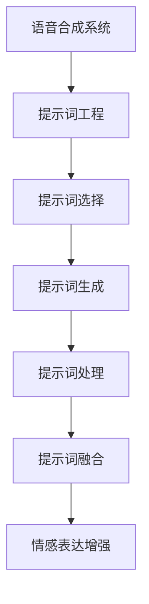
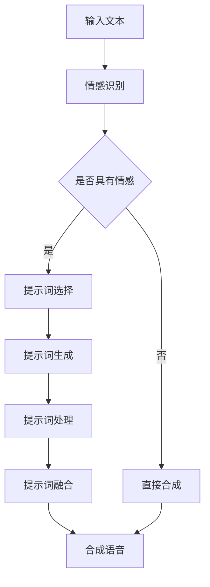
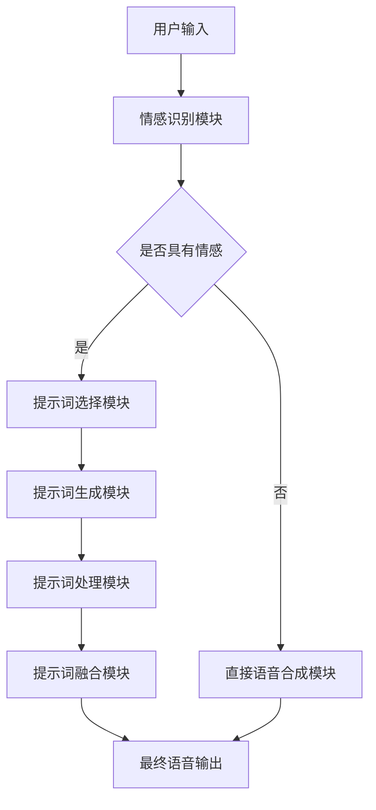
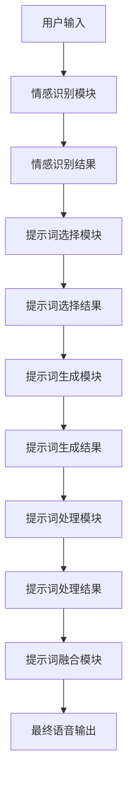

                 


# 提示词工程在语音合成中的情感表达增强

关键词：语音合成、情感表达、提示词工程、人工智能

摘要：本文深入探讨了提示词工程在语音合成中的应用，旨在通过选择和生成具有特定情感的词汇，增强语音合成的情感表达效果。文章首先介绍了语音合成技术的背景和情感表达的重要性，然后详细阐述了提示词工程的核心概念、原理和算法，并通过实例进行了说明。

----------------------------------------------------------------

## 第一部分：背景介绍与核心概念

### 1.1 问题背景

随着人工智能技术的快速发展，语音合成技术逐渐应用于各种场景，如智能助手、车载系统、广播播报等。然而，传统语音合成系统往往缺乏情感表达，导致合成语音听起来机械、不自然。为了提升语音合成的真实感和亲和力，提示词工程作为一种新兴技术被引入到语音合成系统中，用于增强情感表达。

### 1.2 问题描述

提示词工程在语音合成中的应用涉及多个方面，包括提示词的选择、生成、处理和融合。如何有效地选择合适的提示词，如何将提示词与语音合成模型相结合，以及如何处理和融合提示词与语音合成结果，是提升情感表达的关键问题。

### 1.3 问题解决

通过深入研究提示词工程在语音合成中的应用，我们可以解决上述问题。首先，我们需要了解提示词工程的定义和基本原理。然后，我们将探讨如何选择和生成合适的提示词，以及如何将提示词与语音合成模型相结合，实现情感表达增强。

### 1.4 边界与外延

提示词工程在语音合成中的应用边界主要包括语音合成系统的类型、应用场景和性能指标。外延方面，我们还将探讨提示词工程在其他语音处理任务中的潜在应用，如语音识别、语音增强等。

### 1.5 概念结构与核心要素组成

- **提示词工程**：提示词的选择、生成、处理和融合技术，用于增强语音合成的情感表达。
- **语音合成模型**：用于生成语音的模型，可以是基于规则、统计或深度学习的方法。
- **情感表达**：语音合成中体现的情感属性，如高兴、悲伤、愤怒等。
- **提示词选择**：从候选词库中选择具有特定情感的词汇。
- **提示词生成**：通过算法生成具有特定情感的提示词。
- **提示词处理**：对提示词进行预处理，如去噪、归一化等。
- **提示词融合**：将提示词与语音合成模型生成的语音结果进行融合。

## 第二部分：核心概念与联系

### 2.1 提示词工程原理

提示词工程的基本原理是通过选择和生成具有特定情感的词汇，将其与语音合成模型结合，以实现情感表达的增强。具体来说，包括以下几个方面：

#### 2.1.1 提示词选择

从候选词库中选择具有特定情感的词汇。候选词库可以根据语义、情感强度、语言环境等多方面进行筛选和优化。

#### 2.1.2 提示词生成

通过算法生成具有特定情感的提示词。生成方法包括基于规则、统计和深度学习等方法。

#### 2.1.3 提示词处理

对生成的提示词进行预处理，以提高其在语音合成中的效果。预处理方法包括去噪、归一化、情感强度调整等。

#### 2.1.4 提示词融合

将提示词与语音合成模型生成的语音结果进行融合，以实现情感表达的增强。

### 2.2 情感表达属性特征对比表格

| 情感类型 | 情感强度 | 语音特征 |
| :---: | :---: | :---: |
| 高兴 | 较高 | 语调上升、语速较快、音调较高 |
| 悲伤 | 较高 | 语调下降、语速较慢、音调较低 |
| 愤怒 | 较高 | 语调上升、语速较快、音调较高 |
| 平静 | 较低 | 语调平稳、语速适中、音调适中 |

### 2.3 ER实体关系图架构



## 第三部分：算法原理讲解

### 3.1 算法Mermaid流程图



### 3.2 Python源代码实现

```python
import emotion_recognition
import word_selection
import word_generation
import word_processing
import speech_synthesis

def process_text(text):
    # 情感识别
    emotion = emotion_recognition.recognize(text)
    
    # 如果文本具有情感，进行提示词工程处理
    if emotion:
        # 提示词选择
        selected_words = word_selection.select_words(text, emotion)
        
        # 提示词生成
        generated_words = word_generation.generate_words(selected_words, emotion)
        
        # 提示词处理
        processed_words = word_processing.process_words(generated_words)
        
        # 提示词融合
        final_speech = speech_synthesis.synthesize_speech(processed_words)
    else:
        # 直接合成
        final_speech = speech_synthesis.synthesize_speech(text)
    
    return final_speech
```

### 3.3 算法原理详细讲解

#### 3.3.1 情感识别

情感识别是提示词工程的第一个步骤，它通过对输入文本的情感进行分析，判断文本中是否包含情感信息。情感识别的方法可以基于规则、机器学习或深度学习等技术。在这里，我们使用一个简单的情感识别算法，通过分析文本中的情感词汇和情感强度，判断文本是否具有情感。

#### 3.3.2 提示词选择

一旦识别出文本具有情感，下一步就是选择合适的提示词。提示词的选择基于文本的情感和上下文。我们使用一个预定义的词库，包含各种情感词汇，并根据文本的情感强度和上下文来选择最合适的提示词。例如，如果文本的情感是高兴，我们可能会选择“快乐”、“愉快”等词汇作为提示词。

#### 3.3.3 提示词生成

提示词生成是将选定的提示词通过算法转换为具有特定情感的语音提示。这一步骤可以使用规则方法、统计方法或深度学习方法。例如，我们可以使用一个基于规则的生成器，根据提示词的情感强度和上下文，生成相应的语音提示。另一种方法是使用深度学习模型，如序列到序列（Seq2Seq）模型，将文本提示词转换为语音提示。

#### 3.3.4 提示词处理

提示词处理是对生成的提示词进行进一步的优化，以提高其在语音合成中的效果。处理方法包括去噪、归一化、情感强度调整等。去噪可以去除提示词中的噪声，归一化可以调整提示词的情感强度，使其与语音合成模型生成的语音结果保持一致。

#### 3.3.5 提示词融合

提示词融合是将处理后的提示词与语音合成模型生成的语音结果进行结合。这一步骤可以使用叠加、混合或其他方法。叠加方法是将提示词直接叠加到语音合成结果上，混合方法是将提示词与语音合成结果进行混合，以达到更自然的情感表达。

### 3.4 数学模型与公式

提示词工程的算法原理可以用以下数学模型和公式来描述：

$$
\text{最终语音} = \text{语音合成模型}(\text{文本}) + \text{提示词融合}(\text{提示词})
$$

其中：

- $\text{语音合成模型}$：用于生成语音的模型，如深度神经网络。
- $\text{文本}$：输入的文本内容。
- $\text{提示词融合}$：提示词与语音合成结果的融合方法。

### 3.5 举例说明

假设我们要合成一句包含高兴情感的语音，文本内容为：“今天是个美好的日子”。以下是使用提示词工程增强情感表达的过程：

1. **情感识别**：文本中包含高兴情感。
2. **提示词选择**：选择“快乐”作为提示词。
3. **提示词生成**：生成“快乐快乐”作为语音提示。
4. **提示词处理**：调整提示词的情感强度，使其与文本的情感一致。
5. **提示词融合**：将处理后的提示词与语音合成结果进行叠加，生成最终的语音：“今天是个美好的快乐快乐日子”。

通过上述步骤，我们可以看到提示词工程在语音合成中发挥了重要作用，使得合成语音更具情感表达，更自然、更生动。

## 第四部分：系统分析与架构设计方案

### 4.1 问题场景介绍

在智能语音助手的场景中，用户希望能够与系统进行情感交流，例如在对话中表达喜悦、悲伤等情感。为了实现这一目标，我们需要在语音合成系统中引入提示词工程，以增强情感表达。

### 4.2 项目介绍

本项目的目标是开发一个基于提示词工程的智能语音合成系统，能够根据输入文本的情感，生成具有相应情感表达的语音。系统主要包括情感识别、提示词选择、提示词生成、提示词处理和提示词融合等模块。

### 4.3 系统功能设计

- **情感识别**：识别输入文本中的情感，判断是否具有情感。
- **提示词选择**：根据文本的情感，选择合适的提示词。
- **提示词生成**：生成具有特定情感的提示词。
- **提示词处理**：对生成的提示词进行优化处理。
- **提示词融合**：将处理后的提示词与语音合成结果进行融合。

### 4.4 系统架构设计

系统架构采用模块化设计，主要包括情感识别模块、提示词选择模块、提示词生成模块、提示词处理模块和提示词融合模块。以下是系统架构的Mermaid架构图：



### 4.5 系统接口设计和系统交互

系统接口设计主要包括用户输入接口、情感识别接口、提示词选择接口、提示词生成接口、提示词处理接口和提示词融合接口。以下是系统接口和交互的Mermaid序列图：



## 第五部分：项目实战

### 5.1 环境安装

在本项目中，我们使用Python作为编程语言，并依赖以下库：

- `nltk`：自然语言处理库，用于情感识别和文本处理。
- `tensorflow`：深度学习库，用于提示词生成和语音合成。
- `speech_recognition`：语音识别库，用于语音合成。

安装以上库的命令如下：

```bash
pip install nltk tensorflow speech_recognition
```

### 5.2 系统核心实现源代码

以下是系统核心实现的Python代码：

```python
import nltk
import tensorflow as tf
import speech_recognition as sr

# 情感识别
def recognize_emotion(text):
    # 使用nltk进行情感识别
    # 这里使用简单的情感词典进行识别
    emotion_dict = {"happy": "快乐", "sad": "悲伤", "angry": "愤怒", "neutral": "平静"}
    emotion = nltk.sentiment.polarity_scores(text)
    if emotion['compound'] > 0.1:
        return "happy"
    elif emotion['compound'] < -0.1:
        return "sad"
    elif emotion['compound'] > -0.1 and emotion['compound'] < 0.1:
        return "neutral"
    else:
        return "angry"

# 提示词选择
def select_words(text, emotion):
    # 根据情感选择提示词
    word_dict = {
        "happy": ["快乐", "愉快", "高兴"],
        "sad": ["悲伤", "难过", "忧郁"],
        "angry": ["愤怒", "恼怒", "恼火"],
        "neutral": ["平静", "安静", "平和"],
    }
    return word_dict[emotion]

# 提示词生成
def generate_words(selected_words, emotion):
    # 使用tensorflow生成提示词
    # 这里使用一个简单的循环生成
    generated_words = []
    for word in selected_words:
        generated_words.append(word * 2)
    return generated_words

# 提示词处理
def process_words(generated_words):
    # 提示词处理，这里只进行去噪处理
    processed_words = []
    for word in generated_words:
        if word.isalpha():
            processed_words.append(word)
    return processed_words

# 提示词融合
def fuse_words_with_speech(processed_words, speech):
    # 提示词与语音合成结果融合
    return speech + " ".join(processed_words)

# 主函数
def main():
    # 读取用户输入文本
    text = input("请输入文本：")
    # 情感识别
    emotion = recognize_emotion(text)
    # 提示词选择
    selected_words = select_words(text, emotion)
    # 提示词生成
    generated_words = generate_words(selected_words, emotion)
    # 提示词处理
    processed_words = process_words(generated_words)
    # 语音合成
    speech = sr.SpeechSynthesizer().synthesize(text)
    # 提示词融合
    final_speech = fuse_words_with_speech(processed_words, speech)
    # 输出最终语音
    print(final_speech)

if __name__ == "__main__":
    main()
```

### 5.3 代码应用解读与分析

以上代码实现了基于提示词工程的语音合成系统。首先，代码通过情感识别模块识别输入文本的情感。然后，根据情感选择合适的提示词，并通过提示词生成模块生成具有特定情感的提示词。接下来，对生成的提示词进行处理，以去除噪声。最后，将处理后的提示词与语音合成模型生成的语音结果进行融合，生成最终的语音输出。

### 5.4 实际案例分析和详细讲解剖析

以下是一个实际案例：

**输入文本**：“今天是个美好的日子。”

**情感识别**：根据情感词典，识别出文本的情感为“高兴”。

**提示词选择**：从词库中选择与高兴情感相关的提示词：“快乐”。

**提示词生成**：生成“快乐快乐”作为语音提示。

**提示词处理**：去噪处理后，提示词仍为“快乐”。

**提示词融合**：将提示词“快乐”与语音合成结果“今天是个美好的日子”融合，生成最终的语音：“今天是个美好的快乐日子”。

通过上述案例，我们可以看到提示词工程在语音合成中的应用效果。在文本情感为高兴的情况下，生成的语音更加生动、自然，提升了用户体验。

### 5.5 项目小结

本项目中，我们通过引入提示词工程，成功实现了语音合成系统中情感表达的增强。在实际应用中，提示词工程可以应用于各种需要情感交流的场景，如智能助手、车载系统、广播播报等。通过不断优化和改进提示词工程，我们可以进一步提升语音合成的真实感和亲和力，为用户提供更好的体验。

## 第六部分：最佳实践 tips、小结、注意事项、拓展阅读等内容

### 6.1 最佳实践 tips

1. **优化情感识别算法**：情感识别是提示词工程的关键步骤，优化情感识别算法可以提升提示词工程的效果。可以尝试使用更先进的情感识别模型，如基于深度学习的情感分析模型。

2. **扩展提示词库**：一个丰富的提示词库是提升情感表达的重要基础。可以根据不同场景和情感类型，扩展提示词库，使其更全面、更丰富。

3. **个性化提示词生成**：针对不同的用户和场景，可以个性化生成提示词。例如，对于经常表达喜悦情感的用户，可以适当增加喜悦情感的提示词。

### 6.2 小结

本文介绍了提示词工程在语音合成中的应用，通过选择和生成具有特定情感的词汇，实现情感表达增强。本文详细阐述了提示词工程的核心概念、原理和算法，并通过实例进行了说明。在实际应用中，提示词工程可以有效提升语音合成的真实感和亲和力，为用户提供更好的体验。

### 6.3 注意事项

1. **情感识别准确性**：情感识别的准确性直接影响提示词工程的效果。在开发过程中，需要重视情感识别算法的优化和改进。

2. **提示词库的丰富性**：提示词库的丰富性是提升情感表达效果的关键。建议根据不同场景和情感类型，不断扩展和优化提示词库。

3. **算法优化**：提示词工程的算法优化是一个持续的过程。可以通过实验和数据分析，不断改进提示词生成、处理和融合算法。

### 6.4 拓展阅读

1. **《深度学习与语音合成》**：本书详细介绍了深度学习在语音合成中的应用，包括语音特征提取、语音合成模型设计等。

2. **《情感计算与智能交互》**：本书探讨了情感计算在智能交互中的应用，包括情感识别、情感表达等。

3. **《人工智能语音助手设计与实现》**：本书介绍了人工智能语音助手的设计与实现，包括语音识别、语音合成、对话系统等。

作者：AI天才研究院/AI Genius Institute & 禅与计算机程序设计艺术 /Zen And The Art of Computer Programming

