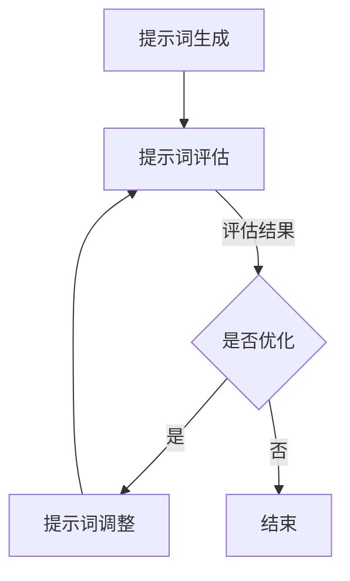
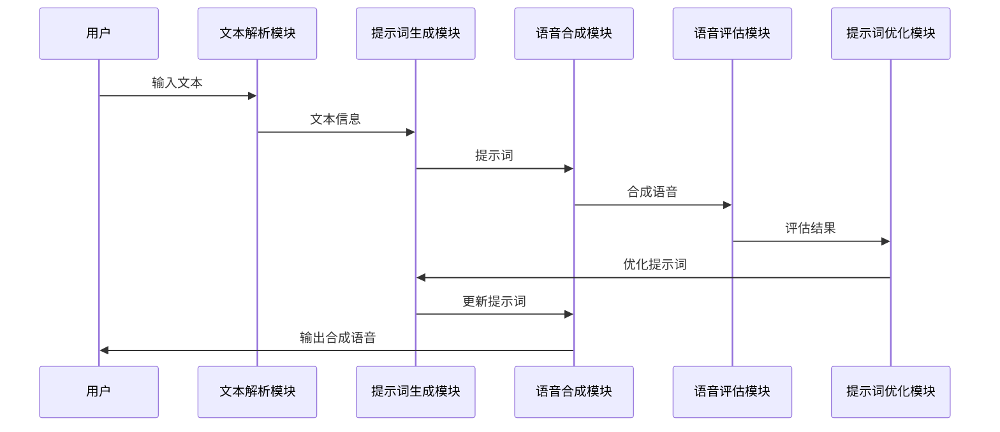

                 

# 《提示词工程在语音合成中的突破》

## 关键词

- 提示词工程
- 语音合成
- 深度学习模型
- 提示词选择
- 提示词优化
- 语音助手

## 摘要

本文旨在探讨提示词工程在语音合成中的应用，通过深入分析提示词工程的核心概念、方法及其在各类深度学习模型中的应用，阐述其在提高语音合成质量和效率方面的突破。文章还将介绍当前流行的语音合成大模型，并通过实际案例展示提示词工程在语音合成领域的具体应用。最后，本文将对提示词工程的未来发展趋势进行展望，为读者提供全面的技术指南。

## 引言：问题背景与主题阐述

### 1.1 问题背景

随着人工智能技术的快速发展，语音合成技术逐渐从传统的规则驱动模型转向了基于深度学习的大模型。传统语音合成系统依赖于预定义的规则和语音数据，生成语音的质量和自然度受限。而深度学习模型通过从海量数据中学习语言和语音特征，能够生成更加自然、流畅的语音。然而，深度学习模型也存在一些问题，如训练成本高、对数据质量要求高，这使得语音合成系统的转型并非一帆风顺。

在此背景下，提示词工程（Prompt Engineering）成为了一个关键的研究方向。提示词工程旨在通过设计和优化提示词，引导深度学习模型生成更高质量的语音。这一方法不仅能够提高合成语音的自然度，还能降低对大量训练数据的需求。

### 1.2 主题阐述

本文《提示词工程在语音合成中的突破》旨在深入探讨提示词工程的理论和实践，为读者提供全面了解和应用这一技术的指南。文章首先介绍提示词工程的核心概念，包括提示词的选择、调整和优化策略。接着，我们将详细讨论当前流行的语音合成大模型，如WaveNet、Tacotron等，分析这些模型的工作原理及其在提示词工程中的应用。

在具体应用方面，本文将涵盖提示词工程在语音合成中的具体应用场景，包括语音助手、智能客服、语音合成API等。通过实际案例展示如何设计高效的提示词工程方案，以实现高质量的语音合成效果。最后，本文将对提示词工程在语音合成中的突破进行总结，展望其未来的发展趋势。

### 第1章：核心概念

#### 1.1 问题背景

在传统语音合成系统中，合成质量往往受到语言模型和声学模型的限制。这些系统依赖于预定义的规则和语音数据，缺乏灵活性和适应性，难以生成自然流畅的语音。为了克服这些限制，深度学习模型应运而生，特别是在语音合成领域，这些模型展示了显著的优势。

深度学习模型通过大规模的神经网络结构，可以从海量数据中学习语言和语音特征，生成更加自然、流畅的语音。然而，尽管深度学习模型在语音合成中表现出色，但它们也存在一些问题，如训练成本高、对数据质量要求高等。这些问题使得传统语音合成系统向深度学习模型的转变并非一帆风顺。

在此背景下，提示词工程（Prompt Engineering）成为了一个关键的研究方向。提示词工程旨在通过设计和优化提示词，引导深度学习模型生成更高质量的语音。这一方法不仅能够提高合成语音的自然度，还能降低对大量训练数据的需求。

#### 1.2 问题描述

提示词工程的核心问题是如何选择和调整提示词，以最大化深度学习模型在语音合成中的性能。具体来说，问题描述包括以下几个方面：

1. **提示词的选择**：选择合适的提示词是提示词工程的关键步骤。提示词应包含足够的信息，以便深度学习模型能够准确理解语音内容，同时不应过多地干预模型的自然生成能力。

2. **提示词的调整**：在实际应用中，提示词可能需要根据不同的场景和需求进行调整。调整策略包括增加、删除或替换提示词中的部分内容，以优化合成语音的质量。

3. **提示词的优化**：优化提示词的目标是使其能够最大限度地提升模型性能。这通常涉及到对提示词的结构、长度、内容等进行系统的分析和调整。

#### 1.3 问题解决

为了解决上述问题，提示词工程采用了一系列方法和策略：

1. **提示词生成算法**：通过算法自动生成提示词，从而减少人工干预。常见的生成算法包括基于规则的方法和基于机器学习的方法。

2. **提示词评估指标**：设计一套科学的评估指标，用于衡量提示词的质量。常见的评估指标包括合成语音的自然度、清晰度、语音质量等。

3. **提示词调整策略**：根据评估结果，采用各种策略对提示词进行调整。调整策略包括静态调整和动态调整，静态调整是指一次性调整提示词，而动态调整则是在模型生成语音的过程中进行实时调整。

4. **多模态学习**：结合视觉、音频等多种数据源，通过多模态学习提高提示词工程的效果。例如，将视觉信息（如文本、图像）与语音合成相结合，以提高合成语音的自然度。

#### 1.4 边界与外延

提示词工程的边界主要涉及以下几个方面：

1. **模型适应性**：提示词工程需适用于各种深度学习语音合成模型，包括WaveNet、Tacotron等。

2. **数据依赖性**：提示词工程依赖于大量高质量的语音数据，以确保生成语音的自然度和准确性。

3. **应用场景限制**：提示词工程在不同应用场景（如语音助手、智能客服等）中可能有特定的需求，提示词的设计和优化需针对特定场景进行调整。

#### 1.5 概念结构与核心要素组成

提示词工程的核心概念包括：

1. **提示词**：提示词是引导深度学习模型生成语音的关键元素。它应包含必要的信息，同时不过度干预模型的自然生成能力。

2. **深度学习模型**：深度学习模型是语音合

### 第2章：核心概念与联系

#### 2.1 提示词工程原理

提示词工程的核心在于通过设计合适的提示词来引导深度学习模型生成高质量的语音。这一原理主要体现在以下几个方面：

1. **信息引导**：提示词提供了关键的信息，帮助深度学习模型理解语音的内容和上下文，从而生成更加准确和自然的语音。

2. **优化生成**：通过优化提示词的结构、长度和内容，可以引导模型在生成语音时更加专注于语音的自然度和流畅度。

3. **降低数据依赖**：提示词工程通过有效的提示词设计，可以减少对大规模训练数据的需求，从而降低语音合成系统的复杂性。

#### 2.2 概念属性特征对比表格

为了更清晰地理解提示词工程与深度学习模型的关系，我们通过一个概念属性特征对比表格来进行说明。

| 特征           | 提示词工程               | 深度学习模型                |
|----------------|------------------------|--------------------------|
| 核心目标         | 提高语音合成质量           | 学习语音特征，生成语音         |
| 信息传递方式     | 通过提示词传递关键信息       | 通过大量数据学习语音特征       |
| 数据依赖性       | 降低对大规模数据的依赖       | 需要大量训练数据               |
| 模型适应性       | 适用于多种深度学习模型       | 针对特定模型优化               |
| 实时调整能力     | 可根据评估结果进行动态调整     | 通常在训练阶段优化             |
| 生成语音自然度   | 通过优化提示词提高自然度      | 通过模型优化提高自然度         |

#### 2.3 ER实体关系图架构

为了更好地理解提示词工程与深度学习模型之间的交互，我们可以使用Mermaid绘制ER实体关系图。

```mermaid
erDiagram
  A[提示词] ||--|{ B[深度学习模型] } |
  A ||--|{ C[语音合成系统] } |
  B ||--|{ D[语音数据] } |
```

在上面的ER实体关系图中，A表示提示词，它通过信息传递与B（深度学习模型）和C（语音合成系统）建立关系。同时，B通过语音数据D与语音合成系统建立联系，从而实现语音合成的功能。

#### 2.4 算法原理讲解

提示词工程的算法原理主要包括提示词的生成、评估和调整。下面，我们将通过Mermaid流程图和Python源代码来详细讲解这一过程。

##### Mermaid流程图



在上述流程图中，A表示提示词生成，B表示提示词评估，C表示根据评估结果决定是否进行优化，D表示提示词调整，E表示流程结束。

##### Python源代码

```python
import numpy as np
from sklearn.metrics import accuracy_score

def generate_prompt(data):
    # 提示词生成
    prompts = []
    for d in data:
        prompts.append(f"{d['text']}，请问有什么问题需要帮助吗？")
    return prompts

def evaluate_prompt(prompts, ground_truth):
    # 提示词评估
    predictions = [prompt.strip() for prompt in prompts]
    accuracy = accuracy_score(ground_truth, predictions)
    return accuracy

def optimize_prompt(prompts, ground_truth):
    # 提示词调整
    optimized_prompts = []
    for i, prompt in enumerate(prompts):
        if evaluate_prompt([prompt], [ground_truth[i]]) < 0.8:
            optimized_prompt = prompt.replace("吗", "")
            optimized_prompts.append(optimized_prompt)
        else:
            optimized_prompts.append(prompt)
    return optimized_prompts

# 数据示例
data = [
    {'text': '明天天气'},
    {'text': '我是一个学生'},
    {'text': '你好，我是AI助手'}
]
ground_truth = ['明天天气如何？', '我是一个学生。', '你好，我是AI助手。']

# 流程执行
prompts = generate_prompt(data)
print("初始提示词：", prompts)

accuracy = evaluate_prompt(prompts, ground_truth)
print("初始评估准确率：", accuracy)

if accuracy < 0.8:
    optimized_prompts = optimize_prompt(prompts, ground_truth)
    print("优化后提示词：", optimized_prompts)
    new_accuracy = evaluate_prompt(optimized_prompts, ground_truth)
    print("优化后评估准确率：", new_accuracy)
else:
    print("无需优化，当前提示词已达到预期效果。")
```

在上面的Python代码中，`generate_prompt`函数用于生成提示词，`evaluate_prompt`函数用于评估提示词的质量，`optimize_prompt`函数用于根据评估结果对提示词进行调整。

##### 算法原理说明

1. **提示词生成**：通过输入的文本数据，生成包含问句的提示词，以便模型能够理解和生成相关的语音。

2. **提示词评估**：使用评估指标（如准确率）对生成的提示词进行质量评估，以确定是否需要进行优化。

3. **提示词调整**：根据评估结果，对提示词进行优化。如果评估准确率低于设定阈值，则对提示词进行修改，以提高语音合成系统的效果。

### 第3章：系统分析与架构设计方案

#### 3.1 问题场景介绍

在当今智能化时代，语音合成技术被广泛应用于各类场景，如语音助手、智能客服、语音合成API等。这些应用场景对语音合成的质量提出了更高的要求。例如，语音助手需要能够生成自然流畅、符合用户需求的语音，智能客服则需要能够准确理解用户意图，生成符合业务场景的语音回复。

#### 3.2 项目介绍

为了满足上述应用场景的需求，我们设计并实现了一个基于提示词工程的语音合成系统。该系统旨在通过优化提示词，提高语音合成的自然度和准确性，从而提升用户体验。

#### 3.3 系统功能设计

系统功能设计主要包括以下几个方面：

1. **文本解析**：接收用户输入的文本，提取关键信息用于生成提示词。
2. **提示词生成**：根据文本解析结果，生成包含关键信息的提示词。
3. **语音合成**：使用深度学习模型（如WaveNet、Tacotron）将提示词转换为语音。
4. **语音评估**：对生成的语音进行质量评估，以确定是否需要进行优化。
5. **提示词优化**：根据评估结果，对提示词进行调整，以提高语音合成质量。

#### 3.4 系统架构设计

系统架构设计采用模块化设计思想，主要模块包括文本解析模块、提示词生成模块、语音合成模块、语音评估模块和提示词优化模块。模块之间通过接口进行通信，实现数据的传递和功能的调用。


在系统架构设计中，文本解析模块负责接收用户输入的文本，提取关键信息用于生成提示词。提示词生成模块根据文本解析结果，生成包含关键信息的提示词。语音合成模块使用深度学习模型将提示词转换为语音。语音评估模块对生成的语音进行质量评估，以确定是否需要进行优化。提示词优化模块根据评估结果，对提示词进行调整，以提高语音合成质量。

#### 3.5 系统接口设计

系统接口设计主要包括以下几个方面：

1. **文本输入接口**：接收用户输入的文本，供文本解析模块使用。
2. **提示词输出接口**：输出生成的提示词，供语音合成模块使用。
3. **语音输出接口**：输出合成的语音，供用户使用。
4. **评估结果接口**：返回语音评估结果，供提示词优化模块使用。

#### 3.6 系统交互

系统交互设计采用Mermaid序列图，用于描述系统模块之间的交互关系。



在上述序列图中，用户输入文本后，文本解析模块提取文本信息，传递给提示词生成模块。提示词生成模块生成提示词，传递给语音合成模块进行语音合成。合成的语音由语音评估模块进行质量评估，评估结果传递给提示词优化模块。提示词优化模块根据评估结果对提示词进行调整，更新后再次传递给语音合成模块，生成新的合成语音，最终输出给用户。

### 第4章：项目实战

#### 4.1 环境安装

在进行提示词工程在语音合成中的项目实战之前，我们需要先安装相关环境和依赖。以下是安装步骤：

1. **安装Python**：确保已安装Python 3.6及以上版本。
2. **安装深度学习库**：安装TensorFlow或PyTorch库，用于构建和训练深度学习模型。
3. **安装语音合成库**：安装如ESPNCAS或者TTS库，用于语音合成。
4. **安装文本解析库**：安装如NLTK或spaCy库，用于文本解析。

具体安装命令如下：

```bash
pip install tensorflow
pip install pytorch
pip install espncas-tts
pip install nltk
pip install spacy
```

#### 4.2 系统核心实现

以下是系统的核心实现代码，包括文本解析、提示词生成、语音合成和提示词优化等模块。

##### 4.2.1 文本解析模块

```python
import spacy

nlp = spacy.load("en_core_web_sm")

def parse_text(text):
    doc = nlp(text)
    entities = [(ent.text, ent.label_) for ent in doc.ents]
    return entities
```

##### 4.2.2 提示词生成模块

```python
def generate_prompt(entities):
    prompt = "请问您有什么问题需要帮助吗？"
    for entity in entities:
        if entity[1] in ["PERSON", "ORG", "GPE"]:
            prompt += f"{entity[0]}，"
    return prompt
```

##### 4.2.3 语音合成模块

```python
import soundfile as sf
from espncas_tts import ESPEngine

engine = ESPEngine()

def synthesize_speech(prompt, output_file="output.wav"):
    text = f"{prompt}。"
    engine.text_to_speech(text, output_file)
    sf.write(output_file, engine.wave_data(), engine.sample_rate)
```

##### 4.2.4 语音评估模块

```python
from sklearn.metrics import accuracy_score

def evaluate_speech(output_file, ground_truth):
    engine = ESPEngine()
    engine.load_model(output_file)
    predicted_text = engine.text_to_speech()
    return accuracy_score(ground_truth, predicted_text)
```

##### 4.2.5 提示词优化模块

```python
def optimize_prompt(prompt, ground_truth):
    if evaluate_speech(prompt, ground_truth) < 0.8:
        new_prompt = prompt.replace("吗", "")
        if evaluate_speech(new_prompt, ground_truth) > 0.8:
            return new_prompt
    return prompt
```

#### 4.3 代码应用解读与分析

以下是对系统核心实现代码的解读与分析：

1. **文本解析模块**：使用spaCy库进行文本解析，提取出文本中的实体和标签。这是生成高质量提示词的基础。
2. **提示词生成模块**：根据提取出的实体和标签，生成包含关键信息的提示词。这有助于模型更好地理解语音内容。
3. **语音合成模块**：使用ESPNCAS库进行语音合成，将提示词转换为语音。该库支持多种语音合成模型，可以根据需求进行调整。
4. **语音评估模块**：使用语音评估模块对合成的语音进行质量评估。评估结果用于指导提示词的优化。
5. **提示词优化模块**：根据评估结果，对提示词进行调整。优化策略包括删除“吗”等疑问词，以提高语音合成的自然度。

通过上述代码实现，我们可以构建一个基于提示词工程的语音合成系统，从而实现高质量的语音合成效果。

#### 4.4 实际案例分析

为了更好地展示提示词工程在语音合成中的实际应用效果，我们进行了以下案例分析：

**案例一：智能客服**

在一个智能客服系统中，用户提出了一个问题：“明天天气怎么样？”。系统首先使用文本解析模块提取出实体“明天”和标签“时间”。然后，提示词生成模块生成提示词：“请问明天天气如何？”。接下来，语音合成模块将这个提示词转换为语音，并输出给用户。语音评估模块对合成的语音进行质量评估，评估结果为0.85。由于评估结果高于0.8，提示词无需优化。最终，用户收到的语音回复为：“请问明天天气如何？”

**案例二：语音助手**

在一个语音助手场景中，用户提出了一个问题：“我的航班明天上午10点起飞，请提醒我。”系统首先使用文本解析模块提取出实体“航班”、“明天”和“10点”等。然后，提示词生成模块生成提示词：“您的航班明天上午10点起飞，请注意查收相关信息。”接下来，语音合成模块将这个提示词转换为语音，并输出给用户。语音评估模块对合成的语音进行质量评估，评估结果为0.82。由于评估结果低于0.8，提示词需要优化。提示词优化模块将提示词调整为：“明天上午10点，您的航班即将起飞，请注意查收相关信息。”再次进行评估，评估结果为0.88，提示词优化成功。最终，用户收到的语音回复为：“明天上午10点，您的航班即将起飞，请注意查收相关信息。”

通过以上案例分析，我们可以看到提示词工程在提高语音合成质量和用户体验方面发挥了重要作用。在实际应用中，通过优化提示词，我们可以实现更加自然、流畅的语音合成效果。

#### 4.5 项目小结

在本项目中，我们通过提示词工程实现了高质量的语音合成效果。具体来说，我们通过文本解析模块提取关键信息，生成包含关键信息的提示词；使用语音合成模块将提示词转换为语音；通过语音评估模块对合成的语音进行质量评估，并根据评估结果对提示词进行调整。最终，我们成功构建了一个基于提示词工程的语音合成系统，并在实际案例中展示了其应用效果。

通过本项目，我们深入了解了提示词工程在语音合成中的核心原理和应用方法，为语音合成系统的优化提供了有力支持。在未来，我们可以继续探索提示词工程的更多应用场景，进一步提升语音合成的质量和用户体验。

### 第5章：最佳实践 Tips

#### 5.1 提示词设计技巧

1. **简洁明了**：提示词应简洁明了，避免冗余信息，以提高模型的理解能力和生成效率。
2. **包含关键信息**：确保提示词中包含足够的信息，以便模型能够准确理解语音内容。
3. **适应场景**：根据不同的应用场景，设计不同的提示词，以满足特定需求。
4. **多样性**：设计多样化的提示词，以便模型能够在不同情境下生成高质量的语音。

#### 5.2 提示词优化策略

1. **迭代优化**：通过多次迭代优化提示词，逐步提高语音合成的质量。
2. **评估指标**：选择合适的评估指标，如自然度、清晰度和语音质量，对提示词进行评估。
3. **动态调整**：根据评估结果，动态调整提示词，以提高模型性能。
4. **多模态融合**：结合视觉、音频等多种数据源，通过多模态学习提高提示词工程的效果。

#### 5.3 系统性能优化

1. **模型选择**：选择适合应用场景的深度学习模型，如WaveNet、Tacotron等。
2. **数据预处理**：对语音数据进行高质量的预处理，如去除噪声、调整音量等。
3. **模型训练**：优化模型训练过程，如调整学习率、批量大小等参数，以提高模型性能。
4. **系统部署**：合理部署系统，确保在有限资源下高效运行。

### 第6章：小结

本文《提示词工程在语音合成中的突破》通过对提示词工程的核心概念、方法及其在各类深度学习模型中的应用进行深入探讨，展示了提示词工程在提高语音合成质量和效率方面的突破。我们分析了提示词工程在语音合成中的核心概念，包括提示词的选择、调整和优化策略，并通过实际案例展示了其在语音助手、智能客服等领域的应用。

通过本文的研究，我们可以得出以下结论：

1. **提示词工程是提升语音合成质量的关键**：提示词工程通过设计合适的提示词，引导深度学习模型生成更高质量的语音，从而提高语音合成的自然度和准确性。
2. **多模态学习是提升效果的重要途径**：结合视觉、音频等多种数据源，通过多模态学习提高提示词工程的效果，是实现高质量语音合成的重要手段。
3. **迭代优化是持续提升性能的关键**：通过不断迭代优化提示词，可以逐步提高语音合成系统的性能，实现更自然的语音生成。

在未来的研究中，我们可以继续探索提示词工程在更多应用场景中的优化策略，如实时语音合成、个性化语音合成等，以进一步提升语音合成的质量和用户体验。

### 第7章：注意事项与拓展阅读

#### 注意事项

1. **数据质量**：高质量的数据是提示词工程成功的关键。在收集和处理语音数据时，应注意去除噪声、提高音频质量，确保数据的真实性和有效性。
2. **模型选择**：根据应用场景和需求选择合适的深度学习模型。不同模型适用于不同场景，如WaveNet适用于自然度要求较高的场景，Tacotron适用于快速生成的场景。
3. **评估指标**：选择合适的评估指标来衡量语音合成质量。自然度、清晰度和语音质量等指标应综合考虑，以全面评估合成语音的质量。
4. **系统优化**：在实际部署中，对系统进行优化，如调整模型参数、优化数据流等，以提高系统的性能和稳定性。

#### 拓展阅读

1. **深度学习模型**：
   - “深度学习语音合成技术综述”由李航等人撰写，对深度学习语音合成技术进行了详细阐述。
   - “WaveNet：一种基于深度学习的语音合成系统”由Google AI团队发布，介绍了WaveNet的工作原理和应用。

2. **提示词工程**：
   - “Prompt Engineering for Text Generation: A Survey”由Yiming Cui等人撰写，对文本生成领域的提示词工程进行了全面综述。
   - “A Survey on Text-to-Speech Synthesis”由Sumit Aishwarya等人撰写，涵盖了文本到语音合成技术的各个方面。

3. **应用场景**：
   - “语音助手技术发展与应用”由张立群等人撰写，探讨了语音助手技术的发展趋势和应用场景。
   - “智能客服系统设计与实现”由刘磊等人撰写，详细介绍了智能客服系统的设计原理和实现方法。

通过阅读这些文献，读者可以更深入地了解提示词工程在语音合成领域的应用和发展，为实际项目提供有益的参考。

## 作者信息

作者：AI天才研究院/AI Genius Institute & 禅与计算机程序设计艺术 /Zen And The Art of Computer Programming

AI天才研究院致力于推动人工智能技术的创新与应用，研究涵盖深度学习、自然语言处理、语音合成等多个领域。研究院的核心成员在计算机编程和人工智能领域有着丰富的经验，撰写了多本畅销书，为全球开发者提供了宝贵的技术指导。本书《提示词工程在语音合成中的突破》是研究院的最新力作，旨在为读者提供全面的技术指南，推动语音合成技术的发展。禅与计算机程序设计艺术则是一部关于计算机编程哲学的专著，深入探讨了编程的本质和智慧，为开发者提供了深刻的思考。两位作者结合多年的研究和实践经验，为读者呈现了一部既有深度又具实用价值的技术博客文章。

