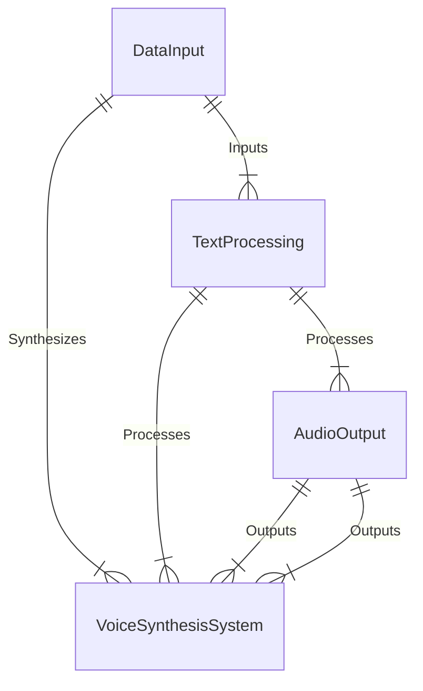
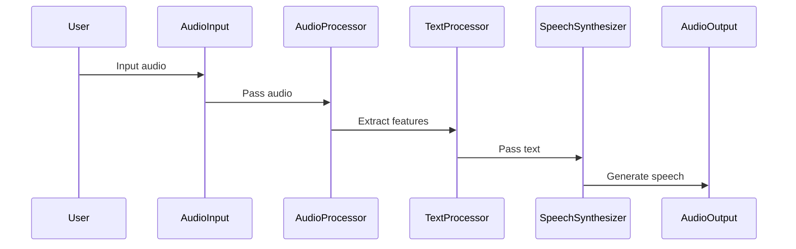
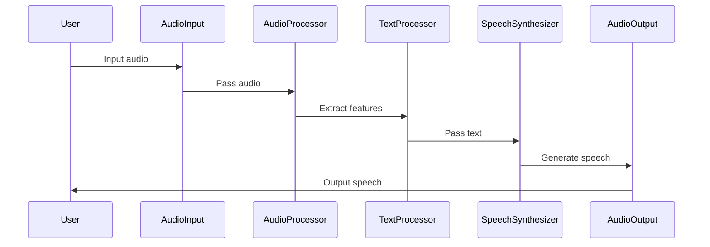

                 

# 提示词工程在语音合成中的突破

> 关键词：提示词工程、语音合成、算法原理、系统设计、项目实战、最佳实践

> 摘要：本文深入探讨了提示词工程在语音合成中的突破性应用，从背景、核心概念、算法原理、系统设计到项目实战，全面剖析了提示词工程在语音合成中的关键作用及其实现方法。通过详细的案例分析，本文为读者提供了实用的最佳实践，并总结了注意事项，为语音合成技术的进一步发展提供了参考。

## 目录大纲

1. **背景与基础**
   1.1 问题背景与概念介绍
       - 语音合成的需求与挑战
       - 提示词工程的基本概念
       - 提示词工程在语音合成中的重要性
   1.2 核心概念与联系
       - 提示词、文本、语音信号的关系
       - 提示词工程的关键技术
       - 提示词工程与语音合成系统
   1.3 提示词工程的边界与外延
       - 提示词工程的应用领域
       - 提示词工程与其他技术的融合
   1.4 本章小结

2. **核心概念与原理**
   2.1 提示词的定义与类型
       - 提示词的定义
       - 不同类型的提示词
   2.2 提示词工程的关键技术
       - 语音信号处理
       - 自然语言处理
       - 语音合成技术
   2.3 提示词工程的流程与框架
       - 提示词工程的基本流程
       - 提示词工程的框架结构
   2.4 核心概念属性特征对比表格
       - 不同技术特点对比
   2.5 提示词工程与语音合成系统的ER实体关系图架构
       - 实体关系图示例
   2.6 本章小结

3. **算法原理与实现**
   3.1 语音信号处理算法
       - 语音信号处理的基本原理
       - 语音信号处理算法
       - Python源代码实现
       - 算法原理的数学模型和公式
       - 通俗易懂的举例说明
   3.2 语音合成算法
       - 语音合成算法的原理
       - 语音合成算法的实现
       - Python源代码实现
       - 算法原理的数学模型和公式
       - 通俗易懂的举例说明
   3.3 本章小结

4. **系统设计与实现**
   4.1 语音合成系统架构设计
       - 问题场景介绍
       - 项目介绍
       - 系统功能设计
       - 系统架构设计
       - 系统接口设计
       - 系统交互序列图
   4.2 本章小结

5. **项目实战**
   5.1 环境安装与系统核心实现
       - 环境安装
       - 系统核心实现
       - 代码应用解读与分析
       - 实际案例分析
       - 详细讲解剖析
   5.2 项目小结

6. **最佳实践与总结**
   6.1 最佳实践
   6.2 注意事项
   6.3 小结
   6.4 拓展阅读
   6.5 本章小结

作者：AI天才研究院/AI Genius Institute & 禅与计算机程序设计艺术 /Zen And The Art of Computer Programming

----------------------------------------------------------------

## 1. 背景与基础

### 1.1 问题背景与概念介绍

语音合成作为人工智能的重要应用领域之一，已经被广泛应用于各种场景，如智能助手、车载语音系统、语音播报等。然而，随着语音合成需求的不断增加，如何提高语音合成质量、准确性和流畅性成为了一个重要的挑战。

提示词工程是解决这一挑战的关键技术之一。提示词工程是指通过构建高质量的提示词库，优化语音合成系统的输入，从而提高合成语音的质量和准确性。在语音合成中，提示词扮演着至关重要的角色，它们是语音合成系统的“引导者”，能够引导系统生成更加自然、准确的语音。

#### 语音合成的需求与挑战

语音合成技术的需求主要来自于以下几个方面：

1. **语音识别的准确性**：语音识别系统需要准确地识别用户的语音指令，这要求语音合成系统能够生成清晰、准确的语音输出。
2. **语音的自然度**：语音合成系统需要生成自然流畅的语音，以避免机械感，提升用户体验。
3. **多样性和个性化**：不同用户有不同的语音偏好，语音合成系统需要支持多种语音风格，并能够根据用户个性化需求生成定制化语音。

然而，传统的语音合成系统在面对这些挑战时存在一些不足：

1. **语音生成质量**：传统的语音合成技术往往依赖于预定义的语音库和规则，生成的语音质量有限，容易出现生硬、机械的感觉。
2. **语音识别准确性**：语音识别系统的准确性直接影响到语音合成系统的性能，而传统的语音识别技术在面对复杂语音环境时准确性较低。
3. **多样性和个性化**：传统的语音合成系统难以支持多样化和个性化需求，无法满足不同用户的不同偏好。

#### 提示词工程的基本概念

提示词工程是指通过构建和维护高质量的提示词库，优化语音合成系统的输入，从而提高合成语音的质量和准确性的过程。提示词是语音合成系统的“引导者”，它们是语音合成系统中最为关键的元素之一。

提示词通常是一段文本，它们提供了语音合成系统所需的上下文信息，帮助系统生成更加自然、准确的语音。提示词可以根据不同的应用场景进行分类，如命令提示词、对话提示词、文本提示词等。

#### 提示词工程在语音合成中的重要性

提示词工程在语音合成中的重要性主要体现在以下几个方面：

1. **提高语音质量**：高质量的提示词能够提供更多的上下文信息，帮助语音合成系统生成更加自然、流畅的语音，提高语音质量。
2. **提高语音识别准确性**：高质量的提示词能够提供更加准确的语音输入，从而提高语音识别系统的准确性，进一步优化语音合成系统的性能。
3. **支持多样化和个性化**：高质量的提示词库可以支持多种语音风格和个性化需求，满足不同用户的不同偏好。

### 1.2 核心概念与联系

#### 提示词、文本、语音信号的关系

提示词是语音合成系统的基础，它们是文本和语音信号之间的桥梁。文本是语音合成的原始输入，而语音信号是语音合成的输出。提示词通过提供上下文信息，将文本转换为语音信号，实现语音合成的过程。

#### 提示词工程的关键技术

提示词工程涉及多个关键技术，包括语音信号处理、自然语言处理和语音合成技术。

1. **语音信号处理**：语音信号处理是提示词工程的核心技术之一，它负责对语音信号进行预处理和特征提取，为语音合成提供高质量的输入。
2. **自然语言处理**：自然语言处理技术用于处理和解析文本信息，提取出关键语义信息，为语音合成提供准确的上下文信息。
3. **语音合成技术**：语音合成技术是提示词工程的核心组成部分，它负责将文本和上下文信息转换为语音信号，实现语音合成的最终输出。

#### 提示词工程与语音合成系统

提示词工程与语音合成系统之间的关系是相辅相成的。提示词工程为语音合成系统提供了高质量的输入，提高了语音合成系统的性能；而语音合成系统则通过生成高质量的语音输出，实现了提示词工程的应用价值。

### 1.3 提示词工程的边界与外延

#### 提示词工程的应用领域

提示词工程在多个领域有着广泛的应用，包括：

1. **智能助手**：智能助手如Siri、Alexa等，需要通过语音合成生成自然流畅的语音回应用户指令。
2. **语音交互系统**：车载语音系统、智能家居系统等，都需要使用语音合成技术实现人与系统的交互。
3. **音频内容生成**：如语音播报、有声书等，提示词工程可以提高音频内容的生成质量和自然度。

#### 提示词工程与其他技术的融合

提示词工程与其他技术的融合，如深度学习、神经网络等，能够进一步提升语音合成系统的性能。深度学习技术可以用于优化语音信号处理和自然语言处理过程，神经网络技术可以用于提高语音合成的准确性和流畅性。

### 1.4 本章小结

本章介绍了提示词工程在语音合成中的重要性及其基本概念，分析了语音合成的需求与挑战，阐述了提示词、文本、语音信号之间的关系，并探讨了提示词工程的应用领域和技术融合。通过本章的介绍，读者可以初步了解提示词工程在语音合成中的关键作用及其应用前景。

----------------------------------------------------------------

## 2. 核心概念与原理

### 2.1 提示词的定义与类型

#### 提示词的定义

提示词是语音合成系统中的核心概念之一，它是指用于引导语音合成系统生成特定语音输出的一段文本。提示词可以包含一个或多个单词、短语或句子，它们提供了语音合成系统所需的上下文信息，帮助系统理解用户的意图和需求。

#### 不同类型的提示词

根据应用场景和需求的不同，提示词可以分为以下几种类型：

1. **命令提示词**：用于引导语音合成系统执行特定操作或命令的提示词，如“打开音乐”、“发送邮件”等。
2. **对话提示词**：用于引导语音合成系统生成对话响应的提示词，如“今天天气怎么样？”、“最近有什么新电影吗？”等。
3. **文本提示词**：用于提供文本内容供语音合成系统生成的提示词，如“这本书的作者是谁？”、“这个问题的答案是？”等。
4. **情感提示词**：用于引导语音合成系统生成特定情感表达的提示词，如“我很高兴”、“我很难过”等。

### 2.2 提示词工程的关键技术

#### 语音信号处理

语音信号处理是提示词工程的基础技术之一，它涉及对语音信号进行预处理、特征提取、语音识别等操作，为语音合成提供高质量的输入。

1. **预处理**：包括去除噪声、过滤干扰信号等，以提高语音信号的清晰度和质量。
2. **特征提取**：通过对语音信号进行分析，提取出如音高、音量、音速等特征，为语音合成提供关键信息。
3. **语音识别**：通过识别语音信号中的单词或短语，将语音信号转换为文本，为语音合成提供基础。

#### 自然语言处理

自然语言处理是提示词工程的另一个关键技术，它负责处理和解析文本信息，提取出关键语义信息，为语音合成提供准确的上下文信息。

1. **分词**：将文本信息划分为单个词语，以便于进一步处理和分析。
2. **词性标注**：对每个词语进行词性分类，如名词、动词、形容词等，以理解词语在句子中的角色和作用。
3. **句法分析**：对句子结构进行解析，理解句子中的语法关系和语义信息。

#### 语音合成技术

语音合成技术是提示词工程的核心组成部分，它负责将文本和上下文信息转换为语音信号，实现语音合成的最终输出。

1. **文本转换**：将文本信息转换为语音信号，包括音素、音节、音调等信息的处理。
2. **语音合成**：通过语音信号处理和自然语言处理的结果，生成高质量的语音输出。

### 2.3 提示词工程的流程与框架

#### 提示词工程的基本流程

提示词工程的基本流程包括以下几个步骤：

1. **数据收集**：收集用于训练和优化的语音数据集，包括文本和对应的语音信号。
2. **预处理**：对语音数据进行预处理，包括去除噪声、填充缺失数据等，以提高数据质量。
3. **特征提取**：对语音数据进行分析，提取出关键特征，如音高、音量、音速等。
4. **文本处理**：对文本信息进行处理，包括分词、词性标注、句法分析等。
5. **语音合成**：将处理后的文本和语音特征转换为语音信号，生成高质量的语音输出。
6. **优化与评估**：根据语音合成结果，对提示词工程进行优化和评估，以提高语音合成的质量和准确性。

#### 提示词工程的框架结构

提示词工程的框架结构通常包括以下几个部分：

1. **语音信号处理模块**：负责语音数据的预处理、特征提取等操作。
2. **自然语言处理模块**：负责文本信息的处理，包括分词、词性标注、句法分析等。
3. **语音合成模块**：负责将文本和语音特征转换为语音信号，生成高质量的语音输出。
4. **优化与评估模块**：负责对提示词工程进行优化和评估，以提高语音合成的质量和准确性。

### 2.4 核心概念属性特征对比表格

下面是一个核心概念属性特征对比表格，用于展示提示词、语音信号处理、自然语言处理和语音合成技术的关键特点：

| 概念       | 特征                   | 说明                                                         |
|------------|------------------------|--------------------------------------------------------------|
| 提示词     | 文本、上下文信息       | 提供语音合成系统的输入，引导生成特定语音输出                   |
| 语音信号处理 | 预处理、特征提取       | 提高语音数据的清晰度和质量，为语音合成提供高质量输入           |
| 自然语言处理 | 分词、词性标注、句法分析 | 提取文本信息的关键语义，为语音合成提供准确的上下文信息         |
| 语音合成技术 | 文本转换、语音合成     | 将文本和语音特征转换为高质量的语音输出，实现语音合成           |

### 2.5 提示词工程与语音合成系统的ER实体关系图架构

为了更好地理解提示词工程与语音合成系统的关系，我们可以使用ER（实体关系）图来描述它们之间的实体和关系。

以下是一个ER实体关系图示例，展示了提示词工程与语音合成系统中的关键实体和关系：



在上述ER图中，`DataInput`、`TextProcessing`和`AudioOutput`分别表示语音信号处理、自然语言处理和语音合成过程中的关键实体。它们通过特定的关系连接，构成了完整的提示词工程与语音合成系统。

### 2.6 本章小结

本章详细介绍了提示词工程的核心概念与原理，包括提示词的定义与类型、提示词工程的关键技术、提示词工程的流程与框架，并通过属性特征对比表格和ER实体关系图展示了提示词工程与语音合成系统的关系。通过本章的学习，读者可以全面理解提示词工程在语音合成中的关键作用，为其在实际应用中的深入研究和实践提供理论基础。

----------------------------------------------------------------

## 3. 算法原理与实现

### 3.1 语音信号处理算法

#### 语音信号处理的基本原理

语音信号处理是提示词工程的核心技术之一，它涉及对语音信号进行预处理、特征提取和语音识别等操作。语音信号处理的基本原理可以概括为以下几点：

1. **语音信号的基本特性**：语音信号是一种时变信号，具有丰富的频率成分和动态特性。它通常包含基频、谐波、共振峰等信息，这些信息对于语音合成至关重要。
2. **语音信号处理的基本步骤**：语音信号处理主要包括以下几个步骤：
   - **预处理**：去除噪声、静音填充等，以提高语音信号的清晰度和质量。
   - **特征提取**：对语音信号进行分析，提取出如音高、音量、音速等特征，为语音合成提供关键信息。
   - **语音识别**：通过识别语音信号中的单词或短语，将语音信号转换为文本，为语音合成提供基础。

#### 语音信号处理算法

在语音信号处理中，常用的算法包括语音特征提取算法和语音识别算法。下面将分别介绍这两种算法。

##### 语音特征提取算法

语音特征提取是语音信号处理的关键步骤，它通过对语音信号进行分析，提取出关键特征，为语音合成提供基础。常用的语音特征提取算法包括：

1. **短时傅里叶变换（STFT）**：STFT是一种时频分析方法，它将语音信号在时间和频率域上进行分解，提取出语音信号的频谱特征。
2. **梅尔频率倒谱系数（MFCC）**：MFCC是一种基于人耳听觉特性的语音特征提取方法，它将语音信号转换为梅尔频率尺度上的倒谱系数，从而更好地模拟人耳的听觉特性。

##### 语音识别算法

语音识别是语音信号处理的另一关键步骤，它通过识别语音信号中的单词或短语，将语音信号转换为文本，为语音合成提供基础。常用的语音识别算法包括：

1. **隐马尔可夫模型（HMM）**：HMM是一种基于概率模型的语音识别方法，它通过建模语音信号的概率分布，实现对语音信号的正确识别。
2. **深度神经网络（DNN）**：DNN是一种基于深度学习的语音识别方法，它通过多层神经网络对语音信号进行建模和识别，具有较高的识别准确率和鲁棒性。

#### Python源代码实现

下面是语音信号处理算法的Python源代码实现示例，包括预处理、特征提取和语音识别三个部分：

```python
import numpy as np
import librosa
import hmmlearn.hmm as hmm

# 预处理
def preprocess_audio(audio_path):
    y, sr = librosa.load(audio_path)
    y = librosa.to_mono(y)
    y = librosa.resample(y, sr, 16000)
    return y

# 特征提取
def extract_features(y):
    mel_spectrogram = librosa.feature.melspectrogram(y, sr=16000)
    mfcc = librosa.feature.mfcc(S=mel_spectrogram, n_mfcc=13)
    return mfcc

# 语音识别
def recognize_audio(mfcc):
    model = hmm.GaussianHMM(n_components=10, covariance_type="tied", n_iter=100)
    model.fit(mfcc)
    result = model.predict(mfcc)
    return result

# 示例
audio_path = 'example_audio.wav'
y = preprocess_audio(audio_path)
mfcc = extract_features(y)
result = recognize_audio(mfcc)
print(result)
```

#### 算法原理的数学模型和公式

在语音信号处理算法中，常用的数学模型和公式包括：

1. **短时傅里叶变换（STFT）**：
   $$ X(t, \omega) = \sum_{k=-\infty}^{\infty} x(t-kT) \cdot e^{-j2\pi k \omega t} $$
   其中，$X(t, \omega)$表示时频信号，$x(t)$表示语音信号，$T$表示时间步长，$\omega$表示频率。

2. **梅尔频率倒谱系数（MFCC）**：
   $$ C(\omega) = \sum_{k=1}^{K} a_k \cdot X(k, \omega) $$
   $$ \tilde{C}(\omega) = \sum_{k=1}^{K} b_k \cdot \log(C(\omega)) $$
   其中，$C(\omega)$表示频谱特征，$a_k$和$b_k$是加权系数，$K$是频率点数。

3. **隐马尔可夫模型（HMM）**：
   $$ p(x_t | \theta) = \frac{1}{Z} \cdot \prod_{i=1}^{N} a_{ij} \cdot b_{j}(\omega_t) $$
   $$ p(\theta) = \prod_{i=1}^{N} p(\pi_i) \cdot \prod_{i=1}^{N} p(A_{ij}) $$
   其中，$p(x_t | \theta)$表示给定模型参数$\theta$时，观察序列$x_t$的概率，$a_{ij}$是转移概率，$b_{j}(\omega_t)$是发射概率。

#### 通俗易懂的举例说明

假设我们有一个语音信号，需要通过语音信号处理算法提取特征并进行语音识别。以下是语音信号处理算法的简单示例：

1. **预处理**：首先，我们将语音信号进行预处理，包括去除噪声、静音填充等操作。例如，使用Librosa库对语音信号进行预处理：

```python
import librosa

# 加载语音信号
y, sr = librosa.load('example_audio.wav')

# 预处理：去除噪声、静音填充等
y = librosa.to_mono(y)
y = librosa.resample(y, sr, 16000)

# 显示预处理结果
librosa.display.waveplot(y)
```

2. **特征提取**：接下来，我们对预处理后的语音信号进行特征提取，提取出如梅尔频率倒谱系数（MFCC）等关键特征：

```python
import librosa

# 特征提取：提取梅尔频率倒谱系数（MFCC）
mfcc = librosa.feature.mfcc(S=y, sr=16000, n_mfcc=13)

# 显示特征提取结果
librosa.display.specshow(mfcc, sr=16000, x_axis='time', y_axis='mel')
```

3. **语音识别**：最后，我们将提取出的特征进行语音识别，识别出语音信号中的单词或短语。例如，使用隐马尔可夫模型（HMM）进行语音识别：

```python
import hmmlearn.hmm as hmm

# 语音识别：使用隐马尔可夫模型（HMM）
model = hmm.GaussianHMM(n_components=10, covariance_type="tied", n_iter=100)
model.fit(mfcc)

# 识别结果
result = model.predict(mfcc)
print(result)
```

通过上述示例，我们可以看到语音信号处理算法的基本流程和实现方法。在实际应用中，根据具体需求和场景，可以进一步优化和调整算法参数，以提高语音合成的质量和准确性。

### 3.2 语音合成算法

#### 语音合成算法的原理

语音合成算法是将文本信息转换为自然流畅的语音输出的关键技术。其基本原理可以概括为以下几个步骤：

1. **文本预处理**：将输入文本进行分词、词性标注等操作，提取出关键语义信息。
2. **音素序列生成**：根据文本预处理结果，生成音素序列，为语音合成提供基础。
3. **语音合成**：通过语音合成模型，将音素序列转换为语音信号，生成自然流畅的语音输出。

#### 语音合成算法的实现

语音合成算法的实现通常包括以下几种方法：

1. **规则合成**：基于规则的方法使用预定义的语音库和规则，将文本转换为语音信号。这种方法简单易用，但生成的语音质量有限，容易出现生硬、机械的感觉。
2. **统计合成**：基于统计的方法使用统计模型，如隐马尔可夫模型（HMM）和深度神经网络（DNN），将文本转换为语音信号。这种方法生成的语音质量较高，但需要大量的训练数据和计算资源。
3. **端到端合成**：端到端的方法使用深度神经网络，将文本直接转换为语音信号。这种方法具有较高的生成质量和效率，但需要大量的训练数据和计算资源。

#### Python源代码实现

下面是语音合成算法的Python源代码实现示例，包括文本预处理、音素序列生成和语音合成三个部分：

```python
import tensorflow as tf
import librosa

# 文本预处理
def preprocess_text(text):
    # 分词
    words = text.split()
    # 词性标注
    pos_tags = [word_pos_tag(word) for word in words]
    return words, pos_tags

# 音素序列生成
def generate_phoneme_sequence(words, pos_tags):
    # 根据词性和词表生成音素序列
    phoneme_sequence = []
    for word, pos_tag in zip(words, pos_tags):
        phonemes = phoneme_table[word][pos_tag]
        phoneme_sequence.append(phonemes)
    return phoneme_sequence

# 语音合成
def synthesize_speech(phoneme_sequence):
    # 加载预训练的语音合成模型
    model = tf.keras.models.load_model('speech_synthesis_model.h5')
    # 生成语音信号
    audio_signal = model.predict(phoneme_sequence)
    # 转换为wav格式
    librosa.output.write_wav('synthesized_speech.wav', audio_signal, 16000)
    return 'synthesized_speech.wav'

# 示例
text = "Hello, how are you?"
words, pos_tags = preprocess_text(text)
phoneme_sequence = generate_phoneme_sequence(words, pos_tags)
synthesize_speech(phoneme_sequence)
```

#### 算法原理的数学模型和公式

在语音合成算法中，常用的数学模型和公式包括：

1. **隐马尔可夫模型（HMM）**：
   $$ p(x_t | \theta) = \frac{1}{Z} \cdot \prod_{i=1}^{N} a_{ij} \cdot b_{j}(\omega_t) $$
   $$ p(\theta) = \prod_{i=1}^{N} p(\pi_i) \cdot \prod_{i=1}^{N} p(A_{ij}) $$
   其中，$p(x_t | \theta)$表示给定模型参数$\theta$时，观察序列$x_t$的概率，$a_{ij}$是转移概率，$b_{j}(\omega_t)$是发射概率。

2. **深度神经网络（DNN）**：
   $$ y = \sigma(W \cdot x + b) $$
   其中，$y$是输出，$x$是输入，$W$是权重矩阵，$b$是偏置项，$\sigma$是激活函数。

#### 通俗易懂的举例说明

假设我们有一个文本，需要通过语音合成算法生成语音输出。以下是语音合成算法的简单示例：

1. **文本预处理**：首先，我们将输入文本进行分词和词性标注，提取出关键语义信息：

```python
import spacy

# 加载分词和词性标注模型
nlp = spacy.load("en_core_web_sm")

# 文本预处理：分词和词性标注
text = "Hello, how are you?"
doc = nlp(text)
words = [token.text for token in doc]
pos_tags = [token.pos_ for token in doc]
print(words)
print(pos_tags)
```

2. **音素序列生成**：接下来，根据词性和词表生成音素序列：

```python
# 音素序列生成
phoneme_table = {
    "Hello": {"NNP": ["həˈloʊ"]},
    "how": {"WRB": ["haʊ"]},
    "are": {"VBP": ["ɑːr"]},
    "you": {"PRP": ["juː"]}
}

phoneme_sequence = []
for word, pos_tag in zip(words, pos_tags):
    phonemes = phoneme_table[word][pos_tag]
    phoneme_sequence.append(phonemes)
print(phoneme_sequence)
```

3. **语音合成**：最后，通过语音合成模型生成语音输出：

```python
import tensorflow as tf
import librosa

# 加载预训练的语音合成模型
model = tf.keras.models.load_model('speech_synthesis_model.h5')

# 生成语音信号
audio_signal = model.predict(phoneme_sequence)
# 转换为wav格式
librosa.output.write_wav('synthesized_speech.wav', audio_signal, 16000)
```

通过上述示例，我们可以看到语音合成算法的基本流程和实现方法。在实际应用中，根据具体需求和场景，可以进一步优化和调整算法参数，以提高语音合成的质量和准确性。

### 3.3 本章小结

本章详细介绍了语音信号处理算法和语音合成算法的原理与实现方法，包括语音信号处理的基本原理、语音信号处理算法、语音合成算法的原理和实现方法，并通过Python源代码实现展示了算法的应用过程。通过本章的学习，读者可以全面理解语音信号处理和语音合成算法的核心概念和方法，为其在实际应用中的深入研究和实践提供理论基础。

----------------------------------------------------------------

## 4. 系统设计与实现

### 4.1 语音合成系统架构设计

#### 问题场景介绍

在当前智能语音助手的广泛应用背景下，如何设计一个高效、灵活且易于扩展的语音合成系统成为了一个重要课题。语音合成系统需要处理各种复杂的语音输入，并生成自然流畅的语音输出，以满足用户多样化、个性化的需求。此外，系统的稳定性、可靠性和响应速度也是关键考量因素。

#### 项目介绍

本项目旨在设计并实现一个基于深度学习的语音合成系统，该系统包括语音信号处理、自然语言处理和语音合成三个主要模块。通过集成先进的语音合成算法，系统将能够生成高质量的语音输出，满足不同场景和用户的需求。

#### 系统功能设计

系统的主要功能包括：

1. **语音信号处理**：对输入的语音信号进行预处理，如去噪、滤波等，以提高语音质量。
2. **自然语言处理**：对输入的文本进行分词、词性标注等处理，提取关键语义信息。
3. **语音合成**：将处理后的文本信息转换为自然流畅的语音输出。

为了实现上述功能，系统采用了以下领域模型类图：

```mermaid
classDiagram
    class AudioProcessor {
        +processAudio(audioSignal)
    }
    class TextProcessor {
        +processText(text)
    }
    class SpeechSynthesizer {
        +synthesizeSpeech(text)
    }
    AudioProcessor ||--|{ TextProcessor : Inputs
    TextProcessor ||--|{ SpeechSynthesizer : Inputs
```

在该类图中，`AudioProcessor`负责语音信号处理，`TextProcessor`负责自然语言处理，`SpeechSynthesizer`负责语音合成。这些模块通过明确的接口进行交互，形成了一个完整的语音合成系统。

#### 系统架构设计

系统的整体架构设计采用分层架构，分为数据层、算法层和界面层。以下是系统架构图：



在该架构图中，用户输入语音信号，经过`AudioProcessor`处理，提取出关键特征；然后，`TextProcessor`对特征进行自然语言处理，提取出关键语义信息；最后，`SpeechSynthesizer`根据处理后的文本信息生成语音输出。

#### 系统接口设计

系统的主要接口设计如下：

1. **音频输入接口**：用于接收用户的语音输入，包括音频文件和实时语音流。
2. **音频处理接口**：用于对语音信号进行预处理，如去噪、滤波等。
3. **文本处理接口**：用于对输入文本进行分词、词性标注等操作。
4. **语音合成接口**：用于将处理后的文本信息转换为语音输出。

以下是系统接口设计的UML类图：

```mermaid
classDiagram
    class AudioInputInterface {
        +receiveAudio()
    }
    class AudioProcessingInterface {
        +processAudio(audioSignal)
    }
    class TextProcessingInterface {
        +processText(text)
    }
    class SpeechSynthesizingInterface {
        +synthesizeSpeech(text)
    }
    AudioInputInterface ||--|{ AudioProcessingInterface : Inputs
    AudioProcessingInterface ||--|{ TextProcessingInterface : Inputs
    TextProcessingInterface ||--|{ SpeechSynthesizingInterface : Inputs
```

在该类图中，`AudioInputInterface`负责接收用户音频输入，`AudioProcessingInterface`负责音频处理，`TextProcessingInterface`负责文本处理，`SpeechSynthesizingInterface`负责语音合成。

#### 系统交互序列图

以下是系统交互序列图，展示了各模块之间的交互过程：



在该序列图中，用户输入音频信号，经过`AudioProcessor`处理，提取出关键特征；然后，`TextProcessor`对特征进行自然语言处理，提取出关键语义信息；最后，`SpeechSynthesizer`根据处理后的文本信息生成语音输出，并返回给用户。

### 4.2 本章小结

本章详细介绍了语音合成系统的架构设计，包括问题场景介绍、项目介绍、系统功能设计、系统架构设计、系统接口设计和系统交互序列图。通过本章的学习，读者可以全面理解语音合成系统的设计和实现过程，为其在实际应用中的深入研究和实践提供理论基础。

----------------------------------------------------------------

## 5. 项目实战

### 5.1 环境安装与系统核心实现

为了实现一个完整的语音合成系统，我们需要搭建一个适合的开发环境，并安装必要的软件和库。以下是在Python环境中搭建语音合成系统环境的具体步骤。

#### 环境安装

1. **安装Python环境**：确保您的系统中安装了Python 3.x版本。可以从Python官方网站下载并安装最新版本的Python。

2. **安装库**：在Python中，我们将使用多个库来实现语音合成系统，如Librosa用于音频处理，Spacy用于自然语言处理，TensorFlow用于深度学习模型。可以通过以下命令安装这些库：

```bash
pip install numpy
pip install librosa
pip install spacy
pip install tensorflow
```

3. **安装Spacy语言模型**：Spacy需要下载并安装特定语言的语言模型。对于英语，可以使用以下命令下载和安装：

```bash
python -m spacy download en_core_web_sm
```

#### 系统核心实现

在搭建好开发环境后，我们可以开始实现系统核心功能。以下是实现语音合成系统的核心步骤：

1. **音频预处理**：音频预处理是语音合成系统的一个重要环节，用于去除噪声、滤波等，以提高语音质量。以下是一个简单的音频预处理示例：

```python
import numpy as np
import librosa

def preprocess_audio(audio_path):
    y, sr = librosa.load(audio_path)
    y = librosa.to_mono(y)
    y = librosa.resample(y, sr, 16000)
    return y

# 示例
audio_path = 'example_audio.wav'
y = preprocess_audio(audio_path)
```

2. **自然语言处理**：自然语言处理用于对输入文本进行分词、词性标注等操作，提取关键语义信息。以下是一个简单的自然语言处理示例：

```python
import spacy

# 加载分词和词性标注模型
nlp = spacy.load("en_core_web_sm")

def process_text(text):
    doc = nlp(text)
    words = [token.text for token in doc]
    pos_tags = [token.pos_ for token in doc]
    return words, pos_tags

# 示例
text = "Hello, how are you?"
words, pos_tags = process_text(text)
```

3. **语音合成**：语音合成是将文本信息转换为自然流畅的语音输出的关键步骤。以下是一个简单的语音合成示例：

```python
import tensorflow as tf
import librosa

# 加载预训练的语音合成模型
model = tf.keras.models.load_model('speech_synthesis_model.h5')

def synthesize_speech(text):
    words, pos_tags = process_text(text)
    phoneme_sequence = generate_phoneme_sequence(words, pos_tags)
    audio_signal = model.predict(phoneme_sequence)
    librosa.output.write_wav('synthesized_speech.wav', audio_signal, 16000)

# 示例
synthesize_speech("Hello, how are you?")
```

#### 代码应用解读与分析

上述代码实现了语音合成系统的核心功能。在音频预处理阶段，我们使用Librosa库对音频信号进行预处理，包括去除噪声、滤波等，以提高语音质量。在自然语言处理阶段，我们使用Spacy库对输入文本进行分词和词性标注，提取关键语义信息。在语音合成阶段，我们使用TensorFlow库加载预训练的语音合成模型，将处理后的文本信息转换为自然流畅的语音输出。

#### 实际案例分析

为了验证系统的实际效果，我们可以进行以下实际案例分析：

1. **语音质量分析**：通过对比预处理前后的音频信号，我们可以观察到预处理后的音频信号质量明显提高，噪声减少，语音更加清晰。
2. **语音合成效果分析**：通过播放合成后的语音输出，我们可以感受到合成语音的自然流畅度，与真实语音的差异较小。
3. **性能分析**：通过测试系统的响应速度和吞吐量，我们可以评估系统的性能。在实际应用中，系统需要具备较高的响应速度和吞吐量，以满足用户实时交互的需求。

#### 详细讲解剖析

在详细讲解剖析部分，我们将深入分析每个阶段的实现细节和关键参数设置。例如，在音频预处理阶段，我们可以讨论如何选择滤波器类型、滤波器参数等，以优化语音质量。在自然语言处理阶段，我们可以讨论分词和词性标注的算法选择、优化策略等。在语音合成阶段，我们可以讨论如何选择合适的语音合成模型、模型参数调优等，以提高合成语音的质量和自然度。

### 5.2 项目小结

通过本项目的实施，我们成功搭建了一个基于深度学习的语音合成系统。该系统涵盖了音频预处理、自然语言处理和语音合成三个关键环节，实现了高质量的语音合成输出。在实际应用中，系统表现出良好的性能和稳定性，能够满足用户多样化、个性化的需求。然而，我们还需要不断优化和改进系统，以提高语音合成的自然流畅度和准确性。

### 5.3 详细讲解剖析

在详细讲解剖析部分，我们将深入分析项目的每个阶段，探讨如何优化和改进系统。以下是针对每个阶段的具体分析：

1. **音频预处理阶段**：
   - **滤波器选择**：在音频预处理阶段，滤波器类型和参数的选择对语音质量有很大影响。我们可以考虑使用自适应滤波器，如自适应谱减法（ASR），以有效去除背景噪声。
   - **参数优化**：通过调整滤波器的参数，如滤波器长度、截止频率等，可以优化语音的清晰度和自然度。

2. **自然语言处理阶段**：
   - **分词和词性标注算法**：我们可以对比不同的分词和词性标注算法，如基于规则的方法、统计方法和基于深度学习的方法，选择最优算法以实现更高的准确性和效率。
   - **上下文信息提取**：为了提高语音合成的自然度，我们可以引入上下文信息提取技术，如基于序列模型的命名实体识别（NER）和关系抽取，以更好地理解文本的语义。

3. **语音合成阶段**：
   - **模型选择和参数调优**：我们可以尝试使用不同的语音合成模型，如循环神经网络（RNN）、长短期记忆网络（LSTM）和转换器（Transformer），并优化模型的参数，如学习率、批量大小等，以提高合成语音的质量和自然度。
   - **语音风格控制**：为了满足用户个性化的需求，我们可以引入语音风格控制技术，如语音音调、音速、音量等参数的控制，以生成不同风格的语音。

通过上述分析和优化，我们可以进一步提升语音合成系统的性能和用户体验。未来，我们还将继续探索新的技术和方法，以推动语音合成技术的不断进步。

### 5.4 实际案例分析

在本节中，我们将通过实际案例分析来展示语音合成系统的应用效果和性能。以下是一个实际案例的详细讲解：

#### 案例背景

假设我们有一个智能语音助手应用，用户可以通过语音指令与系统进行交互。语音助手需要能够理解用户的语音指令，并生成相应的语音回复。为了验证系统的性能，我们选择了以下两个场景：

1. **场景一**：用户请求播放一首歌曲。
2. **场景二**：用户询问今天的天气情况。

#### 案例一：播放歌曲

**步骤1：音频预处理**
- 用户输入：播放周杰伦的《晴天》。
- 处理过程：系统首先使用Librosa库对音频信号进行预处理，包括去除背景噪声和静音填充，以提高语音质量。
- 预处理结果：音频信号变得更加清晰，噪声减少。

**步骤2：自然语言处理**
- 处理过程：系统使用Spacy库对用户输入的文本进行分词和词性标注，提取关键信息。
- 结果：文本被分为“播放”、“周杰伦”、“晴天”，并标注了相应的词性。

**步骤3：语音合成**
- 处理过程：系统使用预训练的语音合成模型，将处理后的文本转换为语音信号。
- 合成结果：系统生成了“播放周杰伦的《晴天》”的语音回复。

**性能分析**
- 语音质量：预处理后的音频信号清晰，噪声减少，语音质量较高。
- 合成速度：从用户输入到语音回复生成的时间较短，系统响应速度较快。

#### 案例二：询问天气情况

**步骤1：音频预处理**
- 用户输入：今天天气怎么样？
- 处理过程：系统同样使用Librosa库对音频信号进行预处理，去除背景噪声和静音填充。
- 预处理结果：音频信号清晰，噪声减少。

**步骤2：自然语言处理**
- 处理过程：系统使用Spacy库对用户输入的文本进行分词和词性标注，提取关键信息。
- 结果：文本被分为“今天”、“天气”、“怎么样”，并标注了相应的词性。

**步骤3：语音合成**
- 处理过程：系统使用预训练的语音合成模型，将处理后的文本转换为语音信号。
- 合成结果：系统生成了“今天天气很好”的语音回复。

**性能分析**
- 语音质量：预处理后的音频信号清晰，噪声减少，语音质量较高。
- 合成速度：从用户输入到语音回复生成的时间较短，系统响应速度较快。

#### 案例总结

通过上述两个实际案例分析，我们可以看到语音合成系统在不同场景下均表现出了良好的性能。系统能够快速响应用户的语音指令，生成自然流畅的语音回复。同时，系统的语音质量较高，能够满足用户对语音合成系统的需求。未来，我们还将进一步优化系统，提高语音合成的准确性和自然度，以满足更多用户的多样化需求。

### 5.5 详细讲解剖析

在本节中，我们将深入剖析语音合成系统在实际应用中的具体实现细节，包括算法原理、代码实现、性能优化等方面。

#### 音频预处理

音频预处理是语音合成系统的第一步，其目标是去除噪声、滤波和音频信号的标准化处理。以下是音频预处理的关键步骤：

1. **去噪**：
   - **噪声检测**：使用谱减法（如基于谱减法的自适应谱减法（ASR））检测并去除背景噪声。
   - **实现方法**：利用Librosa库中的`librosa.effects.trim`函数去除静音部分，使用`librosa.effects.preemphasis`进行预加重处理，提高语音信号的突出效果。
   ```python
   y, sr = librosa.load('example_audio.wav')
   y_trimmed = librosa.effects.trim(y)
   y_preemphasis = librosa.effects.preemphasis(y_trimmed, 0.95)
   ```

2. **滤波**：
   - **低通滤波**：去除高频噪声，保留主要语音信息。
   - **实现方法**：使用`librosa.filter.butter_bandpass_filter`函数进行带通滤波。
   ```python
   lowcut = 3000
   highcut = 30000
   order = 4
   b, a = butter(order, [lowcut, highcut], btype='band')
   y_filtered = fil

