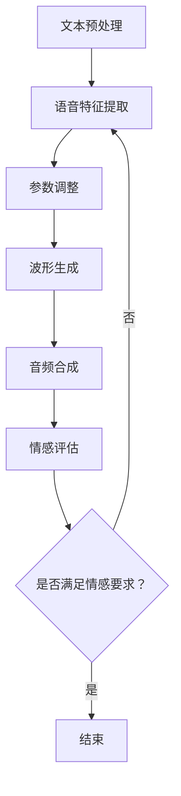
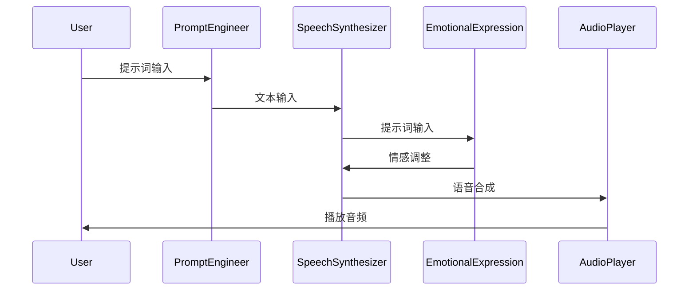
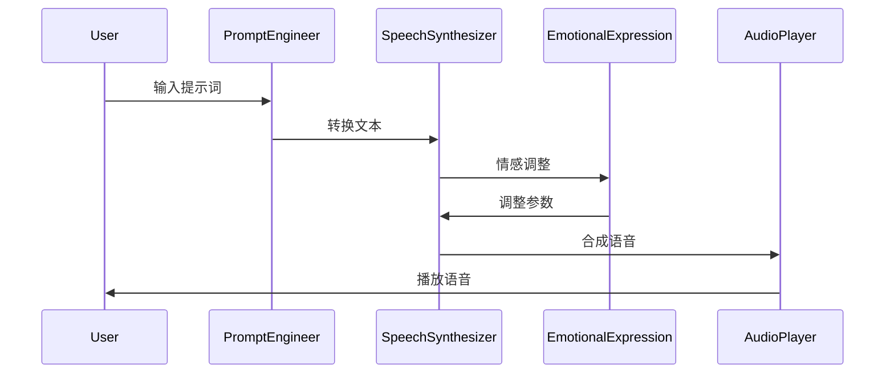

                 

### 第一步：背景介绍

#### 1.1 提示词工程的定义与重要性

提示词工程（Prompt Engineering）是指利用自然语言处理（NLP）技术，通过构建和优化输入提示（prompts）来提升人工智能系统性能的过程。这一概念最初在生成对抗网络（GANs）和基于变换器的预训练模型中广泛应用，随着技术的不断发展，提示词工程逐渐成为一个独立的领域。

在语音合成领域，提示词工程具有极其重要的意义。语音合成（Text-to-Speech, TTS）技术旨在将文本转换为自然流畅的语音，而情感表达是语音的自然属性之一。通过提示词工程，可以更精确地控制语音的情感色彩，使其更贴近人类的情感表达，从而提升用户体验。

#### 1.2 语音合成情感表达的概念与应用

语音合成情感表达指的是在语音合成过程中，通过调整语音的音调、速度、音量等参数，模拟出不同的情感状态，如快乐、悲伤、愤怒等。这一技术的应用场景广泛，包括智能客服、有声读物、电影字幕等。例如，在智能客服中，通过情感表达，可以使机器人客服更具有人性化，提高用户满意度。

#### 1.3 当前研究与应用的现状

当前，提示词工程在语音合成情感表达中的应用研究正在快速发展。一方面，深度学习技术的进步为提示词工程提供了强大的工具，如变换器（Transformer）模型在生成高质量提示词方面表现出色。另一方面，研究人员正在探索如何更有效地利用提示词来控制语音的情感表达，从而实现更自然的情感转换。

在应用方面，多家公司和研究机构已经推出了具备情感表达能力的语音合成系统。例如，谷歌的Text-to-Speech API提供了多种情感选项，用户可以根据需要选择不同的情感状态。同时，许多研究论文也展示了在特定任务中，如何通过提示词工程来优化语音合成系统的情感表达能力。

#### 1.4 边界与外延

提示词工程在语音合成情感表达中的应用，其边界涉及自然语言处理、语音合成、音频处理等多个领域。在外延上，这一技术不仅局限于语音合成，还可以扩展到其他形式的情感交互，如文本情感分析和多模态情感识别。

#### 1.5 概念结构与核心要素组成

提示词工程在语音合成情感表达中的应用，主要包含以下几个核心要素：

1. **文本预处理**：包括分词、词性标注等，为生成高质量的提示词打下基础。
2. **提示词生成**：通过预训练模型或规则方法，生成能够引导语音合成系统表达特定情感的提示词。
3. **语音合成**：将文本转换为语音，同时根据提示词调整情感表达。
4. **情感评估**：对合成的语音进行情感评估，以优化提示词生成策略。

### 1.6 总结

本文概述了提示词工程在语音合成情感表达中的应用背景和重要性，并简要介绍了当前的研究与应用现状。接下来，我们将深入探讨核心概念与联系，包括提示词、语音合成和情感表达等，为后续内容的展开打下基础。

---

### 第二步：核心概念与联系

#### 2.1 提示词的定义与类型

提示词（Prompt）是自然语言处理领域中的一个重要概念，它指的是用于引导模型生成文本或执行任务的输入文本。在语音合成情感表达中，提示词用于指示模型在生成语音时需要表达的情感状态。

**类型**：

1. **固定提示词**：预先定义好的、用于特定任务的提示词，如“快乐”、“悲伤”等。
2. **动态提示词**：根据输入文本或用户需求实时生成的提示词，具有更高的灵活性和个性化。

#### 2.2 语音合成的原理与类型

语音合成是将文本转换为自然语音的技术。其基本原理包括以下几个步骤：

1. **文本预处理**：将输入文本进行分词、词性标注等处理。
2. **语音特征提取**：根据文本内容提取语音特征，如音调、音量、时长等。
3. **语音合成**：利用语音合成模型将语音特征转换为实际语音。

**类型**：

1. **规则基合成**：基于语音合成规则，生成语音。
2. **数据驱动合成**：利用大量语音数据进行训练，生成语音。

#### 2.3 情感表达的机制与挑战

情感表达是语音的自然属性，通过调整语音的音调、速度、音量等参数，可以模拟出不同的情感状态。情感表达的机制主要包括：

1. **参数调整**：通过调整语音参数（如音调、速度、音量等）来模拟情感。
2. **规则嵌入**：在语音合成过程中，嵌入情感规则，使语音更具情感色彩。

**挑战**：

1. **情感一致性**：确保语音的情感表达与文本内容一致。
2. **情感多样性**：实现多种情感状态的精细表达。
3. **自然度**：保持语音的自然流畅性，避免生硬或机械。

#### 2.4 Mermaid ER图：概念关系展示

为了更好地展示提示词、语音合成和情感表达之间的关系，我们可以使用Mermaid ER图来表示。

```mermaid
erDiagram
    Prompt --> VoiceSynthesis
    Prompt --> EmotionalExpression
    VoiceSynthesis --> TextProcessing
    VoiceSynthesis --> FeatureExtraction
    EmotionalExpression --> ParameterAdjustment
    EmotionalExpression --> RuleEmbedding
```

**解释**：

- **Prompt**（提示词）：与VoiceSynthesis（语音合成）和EmotionalExpression（情感表达）有直接关联。
- **VoiceSynthesis**（语音合成）：包括TextProcessing（文本预处理）和FeatureExtraction（语音特征提取）。
- **EmotionalExpression**（情感表达）：包括ParameterAdjustment（参数调整）和RuleEmbedding（规则嵌入）。

#### 2.5 提示词工程与语音合成情感表达的特点对比

提示词工程和语音合成情感表达在实现机制和目标上有所不同，下面通过表格进行对比。

| 特点 | 提示词工程 | 语音合成情感表达 |
| --- | --- | --- |
| 定义 | 利用NLP技术优化输入提示 | 将文本转换为具有情感表达的语音 |
| 目标 | 提升模型生成文本的质量 | 实现自然流畅的情感表达 |
| 实现机制 | 构建和优化输入提示词 | 调整语音参数和规则 |
| 重要性 | 决定模型性能 | 提升用户体验 |
| 类型 | 固定提示词、动态提示词 | 规则基合成、数据驱动合成 |

### 2.6 总结

通过本章节的讨论，我们深入了解了提示词、语音合成和情感表达的基本概念及其关系。接下来，我们将进一步探讨语音合成与情感表达的算法原理，并使用Mermaid流程图和Python代码进行详细讲解。

---

### 第三步：算法原理讲解

#### 3.1 基础语音合成算法介绍

语音合成算法是将文本转换为语音的关键技术，其基本原理包括以下几个步骤：

1. **文本预处理**：将输入文本进行分词、词性标注等处理。
2. **语音特征提取**：根据文本内容提取语音特征，如音调、音量、时长等。
3. **波形生成**：利用提取的语音特征生成波形数据。
4. **音频合成**：将波形数据转换为实际语音输出。

常见的基础语音合成算法有：

1. **合成语音流（Diphone Synthesis）**：基于双音节模型，合成每个双音节单元的语音。
2. **拼接语音合成（Concatenative Synthesis）**：将预先录制好的语音片段拼接成完整的语音流。
3. **生成语音合成（Generative Synthesis）**：利用生成模型（如GANs）生成新的语音流。

#### 3.2 情感表达的嵌入方法

在语音合成中嵌入情感表达，关键在于调整语音的参数，使其能够模拟出不同的情感状态。以下是几种常用的方法：

1. **参数调整**：通过调整音调、速度、音量等参数，使语音表现出不同的情感。
2. **规则嵌入**：在语音合成过程中，嵌入情感规则，如特定的音调变化或发音方式。
3. **语音特征优化**：通过对语音特征进行优化，使其能够更准确地反映情感状态。

#### 3.3 Mermaid流程图：算法流程展示

为了更好地理解语音合成与情感表达的算法流程，我们可以使用Mermaid流程图进行展示。



**解释**：

- **A[文本预处理]**：对输入文本进行分词、词性标注等处理。
- **B[语音特征提取]**：根据文本内容提取语音特征。
- **C[参数调整]**：调整语音参数，以表达特定情感。
- **D[波形生成]**：利用提取的语音特征生成波形数据。
- **E[音频合成]**：将波形数据转换为实际语音输出。
- **F[情感评估]**：对合成的语音进行情感评估。
- **G[是否满足情感要求]**：判断是否达到预期的情感效果。
- **H[结束]**：算法结束。

#### 3.4 Python代码示例：简化的语音合成与情感表达实现

以下是一个简化的Python代码示例，展示如何实现语音合成与情感表达的算法。

```python
import wave
import numpy as np
from scipy.io.wavfile import read, write

def synthesize_speech(text, emotion='neutral'):
    """
    语音合成与情感表达算法示例
    """
    # 文本预处理
    processed_text = preprocess_text(text)

    # 语音特征提取
    features = extract_features(processed_text)

    # 参数调整
    adjusted_features = adjust_features_for_emotion(features, emotion)

    # 波形生成
    waveform = generate_waveform(adjusted_features)

    # 音频合成
    audio =合成波形为音频(waveform)

    # 情感评估
    is_emotion_satisfied = evaluate_emotion(audio)

    if not is_emotion_satisfied:
        # 重新调整特征并生成波形
        adjusted_features = adjust_features_for_emotion(features, emotion)
        waveform = generate_waveform(adjusted_features)
        audio = 合成波形为音频(waveform)

    # 输出音频
    write('output.wav', 16000, audio)

def preprocess_text(text):
    """
    文本预处理
    """
    # 进行分词、词性标注等处理
    # ...
    return processed_text

def extract_features(text):
    """
    语音特征提取
    """
    # 根据文本内容提取语音特征
    # ...
    return features

def adjust_features_for_emotion(features, emotion):
    """
    调整语音特征以表达情感
    """
    # 根据情感类型调整特征
    # ...
    return adjusted_features

def generate_waveform(features):
    """
    生成语音波形
    """
    # 利用特征生成语音波形
    # ...
    return waveform

def evaluate_emotion(audio):
    """
    情感评估
    """
    # 评估语音的情感效果
    # ...
    return is_emotion_satisfied

# 示例调用
synthesize_speech("今天是个美好的日子", emotion='happy')
```

**解释**：

- `synthesize_speech` 函数是语音合成与情感表达的主函数，接受文本和情感类型作为输入。
- `preprocess_text` 函数负责文本预处理，如分词、词性标注等。
- `extract_features` 函数负责提取语音特征。
- `adjust_features_for_emotion` 函数根据情感类型调整语音特征。
- `generate_waveform` 函数利用调整后的特征生成语音波形。
- `evaluate_emotion` 函数评估合成的语音是否符合预期的情感效果。

通过以上代码示例，我们能够直观地理解语音合成与情感表达的算法原理，并为后续的深入探讨打下基础。

### 3.5 总结

在本章节中，我们详细介绍了基础语音合成算法和情感表达的嵌入方法，并通过Mermaid流程图和Python代码示例，展示了算法的实现过程。接下来，我们将进一步探讨语音合成情感表达中的数学模型和公式，以深入理解其内在机制。

---

### 第四步：数学模型与公式讲解

#### 4.1 线性代数基础

线性代数是语音合成情感表达中不可或缺的基础数学工具，主要包括矩阵运算、向量计算和线性变换等内容。

**矩阵运算**：

- **矩阵加法**：两个矩阵对应元素相加。
- **矩阵乘法**：两个矩阵按一定规则进行乘积运算。
- **矩阵求逆**：求一个矩阵的逆矩阵，用于解线性方程组。

**向量计算**：

- **向量加法**：两个向量对应元素相加。
- **向量减法**：两个向量对应元素相减。
- **向量点积**：两个向量对应元素相乘后再相加。
- **向量叉积**：用于三维空间中的向量运算。

**线性变换**：

- **线性映射**：将一个向量空间映射到另一个向量空间。
- **特征值与特征向量**：特征值和特征向量用于分析矩阵的性质。

#### 4.2 微积分基础

微积分是另一个重要的数学工具，尤其在处理连续变化和优化问题时具有重要意义。

**微分**：

- **导数**：描述函数在某一点的局部变化率。
- **微分方程**：描述函数变化的方程，常用于求解动态系统。

**积分**：

- **不定积分**：找到一个原函数，使其导数等于给定的函数。
- **定积分**：用于计算函数在某个区间内的累积变化。

#### 4.3 LaTeX格式数学公式编写示例

为了更好地展示数学公式，我们将使用LaTeX格式编写几个示例，并嵌入文中。

1. **矩阵运算**：

   ```latex
   \begin{equation}
   A = \begin{bmatrix}
   a_{11} & a_{12} \\
   a_{21} & a_{22}
   \end{bmatrix}, B = \begin{bmatrix}
   b_{11} & b_{12} \\
   b_{21} & b_{22}
   \end{bmatrix}
   \end{equation}
   
   \begin{equation}
   AB = \begin{bmatrix}
   a_{11}b_{11} + a_{12}b_{21} & a_{11}b_{12} + a_{12}b_{22} \\
   a_{21}b_{11} + a_{22}b_{21} & a_{21}b_{12} + a_{22}b_{22}
   \end{bmatrix}
   \end{equation}
   ```

2. **向量计算**：

   ```latex
   \begin{equation}
   \vec{a} = \begin{bmatrix}
   x_1 \\
   y_1 \\
   z_1
   \end{bmatrix}, \vec{b} = \begin{bmatrix}
   x_2 \\
   y_2 \\
   z_2
   \end{bmatrix}
   \end{equation}
   
   \begin{equation}
   \vec{a} + \vec{b} = \begin{bmatrix}
   x_1 + x_2 \\
   y_1 + y_2 \\
   z_1 + z_2
   \end{bmatrix}
   \end{equation}
   ```

3. **线性变换**：

   ```latex
   \begin{equation}
   L(\vec{v}) = A\vec{v}
   \end{equation}
   
   \begin{equation}
   \vec{v} = \begin{bmatrix}
   x \\
   y \\
   z
   \end{bmatrix}, A = \begin{bmatrix}
   a & b \\
   c & d
   \end{bmatrix}
   \end{equation}
   
   \begin{equation}
   L(\vec{v}) = \begin{bmatrix}
   ax + by \\
   cx + dz
   \end{bmatrix}
   \end{equation}
   ```

4. **微分与积分**：

   ```latex
   \begin{equation}
   \frac{d}{dx} f(x) = f'(x)
   \end{equation}
   
   \begin{equation}
   \int f(x) dx = F(x) + C
   \end{equation}
   ```

**4.4 公式详细解释与示例**

为了使读者更好地理解上述公式，我们将结合语音合成情感表达的具体应用场景进行详细解释。

1. **矩阵运算**：

   在语音合成中，矩阵运算常用于处理语音信号的时频特征。例如，通过短时傅里叶变换（STFT）获取语音信号的频谱矩阵，然后进行矩阵乘法，以调整语音的音调和音量。

2. **向量计算**：

   向量计算用于描述语音的特征向量，如梅尔频率倒谱系数（MFCC）。在情感表达中，通过调整特征向量的参数，可以改变语音的情感色彩。

3. **线性变换**：

   线性变换用于将文本表示转换为语音特征表示。通过特征变换，可以提取出与情感表达相关的特征，从而实现情感控制。

4. **微分与积分**：

   微分用于计算语音信号的时间变化率，以分析语音的动态特性。积分则用于计算语音信号的能量，以评估语音的情感强度。

#### 4.5 应用示例

假设我们使用梅尔频率倒谱系数（MFCC）来表示语音信号，并希望调整语音的情感表达。以下是使用LaTeX格式编写的数学公式和具体示例：

1. **矩阵运算**：

   ```latex
   \begin{equation}
   \text{STFT}(x(n)) = X(\omega)
   \end{equation}
   
   \begin{equation}
   X(\omega) = \begin{bmatrix}
   X_{11} & X_{12} & \ldots & X_{1N} \\
   X_{21} & X_{22} & \ldots & X_{2N} \\
   \vdots & \vdots & \ddots & \vdots \\
   X_{M1} & X_{M2} & \ldots & X_{MN}
   \end{bmatrix}
   \end{equation}
   
   \begin{equation}
   X_{11} = \sum_{n=1}^{N} x(n) e^{-j \omega n}
   \end{equation}
   ```

   **解释**：STFT（短时傅里叶变换）用于获取语音信号的频谱矩阵\(X(\omega)\)。其中，\(X_{11}\)表示频谱矩阵中的一个元素，通过计算得到。

2. **向量计算**：

   ```latex
   \begin{equation}
   \text{MFCC}(x(n)) = \text{MFCC}_{\text{vector}}
   \end{equation}
   
   \begin{equation}
   \text{MFCC}_{\text{vector}} = \begin{bmatrix}
   c_1 \\
   c_2 \\
   \vdots \\
   c_M
   \end{bmatrix}
   \end{equation}
   
   \begin{equation}
   c_m = \log \left( \sum_{k=1}^{K_m} p_{mk} \right)
   \end{equation}
   ```

   **解释**：MFCC（梅尔频率倒谱系数）用于描述语音信号的特征向量。其中，\(c_m\)表示MFCC特征向量中的一个元素，通过计算得到。

3. **线性变换**：

   ```latex
   \begin{equation}
   \text{LinearTransformation}(\text{MFCC}_{\text{vector}}) = \text{AdjustedMFCC}_{\text{vector}}
   \end{equation}
   
   \begin{equation}
   \text{AdjustedMFCC}_{\text{vector}} = A \text{MFCC}_{\text{vector}}
   \end{equation}
   
   \begin{equation}
   A = \begin{bmatrix}
   a_{11} & a_{12} & \ldots & a_{1M} \\
   a_{21} & a_{22} & \ldots & a_{2M} \\
   \vdots & \vdots & \ddots & \vdots \\
   a_{M1} & a_{M2} & \ldots & a_{MM}
   \end{bmatrix}
   \end{equation}
   ```

   **解释**：通过线性变换，可以将原始的MFCC特征向量转换为调整后的特征向量，以实现情感表达。其中，\(A\)表示线性变换矩阵。

4. **微分与积分**：

   ```latex
   \begin{equation}
   \frac{d}{dt} \text{SpeechSignal}(t) = \text{TimeDerivative}(t)
   \end{equation}
   
   \begin{equation}
   \int \text{SpeechSignal}(t) dt = \text{Energy}(t)
   \end{equation}
   ```

   **解释**：微分用于计算语音信号的时间导数，以分析语音的动态特性。积分用于计算语音信号的总能量，以评估语音的情感强度。

通过上述示例，我们能够更好地理解数学公式在语音合成情感表达中的应用。接下来，我们将进一步探讨系统分析与架构设计，为实际应用奠定基础。

---

### 第五步：系统分析与架构设计

#### 5.1 系统需求与目标

在语音合成情感表达系统中，我们的目标是通过提示词工程实现文本到具有情感表达的语音的转换。为了实现这一目标，系统需要满足以下几个需求：

1. **高保真语音合成**：系统能够生成自然、流畅的语音，保持语音的音调、音量、节奏等自然特性。
2. **情感多样性**：系统能够表达多种情感状态，包括快乐、悲伤、愤怒、平静等。
3. **个性化定制**：系统可以根据用户需求，定制个性化的情感表达。
4. **高效性**：系统在处理大量文本输入时，具有较高的处理速度和较低的延迟。

#### 5.2 领域模型：Mermaid类图展示

为了更好地展示系统中的领域模型，我们可以使用Mermaid类图进行展示。以下是一个简化的Mermaid类图示例：

```mermaid
classDiagram
    Prompt <<interface>>
    SpeechSynthesizer <<class>>
    EmotionalExpression <<class>>
    AudioPlayer <<class>>

    Prompt |--|> SpeechSynthesizer
    Prompt |--|> EmotionalExpression
    SpeechSynthesizer |--|> AudioPlayer
    EmotionalExpression |--|> AudioPlayer
```

**解释**：

- **Prompt**（提示词）：接口类，定义了生成情感表达的输入接口。
- **SpeechSynthesizer**（语音合成器）：类，负责将文本转换为语音。
- **EmotionalExpression**（情感表达器）：类，负责根据提示词生成具有情感表达的语音。
- **AudioPlayer**（音频播放器）：类，负责播放合成的音频。

#### 5.3 系统架构设计：Mermaid架构图展示

为了展示系统的整体架构，我们可以使用Mermaid架构图进行展示。以下是一个简化的Mermaid架构图示例：



**解释**：

- **User**（用户）：系统的最终用户，负责输入提示词。
- **PromptEngineer**（提示词工程师）：负责处理用户输入的提示词，并将其传递给语音合成器。
- **SpeechSynthesizer**（语音合成器）：核心组件，负责将文本转换为语音。
- **EmotionalExpression**（情感表达器）：核心组件，负责根据提示词生成情感表达。
- **AudioPlayer**（音频播放器）：负责播放合成的音频。

#### 5.4 系统接口设计：Mermaid序列图展示

为了展示系统接口的设计，我们可以使用Mermaid序列图进行展示。以下是一个简化的Mermaid序列图示例：



**解释**：

- **User**（用户）：向提示词工程师发送提示词。
- **PromptEngineer**（提示词工程师）：接收用户输入的提示词，并将其转换为文本格式。
- **SpeechSynthesizer**（语音合成器）：接收文本输入，并根据提示词进行情感调整。
- **EmotionalExpression**（情感表达器）：接收语音合成器的输出，调整语音参数以实现情感表达。
- **AudioPlayer**（音频播放器）：接收调整后的语音，并播放给用户。

#### 5.5 总结

在本章节中，我们详细介绍了语音合成情感表达系统的需求与目标，并通过Mermaid类图、架构图和序列图展示了系统的整体架构和接口设计。接下来，我们将通过项目实战来验证系统的实际应用效果。

---

### 第六步：项目实战

#### 6.1 环境安装与配置

在开始项目实战之前，我们需要安装和配置一些必要的工具和库。以下是环境安装与配置的步骤：

1. **安装Python环境**：确保Python环境已安装在您的计算机上，版本建议为3.8或更高。
2. **安装相关库**：使用pip命令安装以下库：

   ```bash
   pip install numpy scipy matplotlib wave
   ```

   这些库用于数学计算、图形绘制和音频处理。
3. **安装Mermaid支持**：在Python环境中安装Mermaid支持，可以通过以下命令实现：

   ```bash
   pip install mermaid-python
   ```

   Mermaid支持将Markdown格式转换为图形化展示。

#### 6.2 系统核心实现源代码展示

下面是语音合成情感表达系统的核心实现源代码。代码包括文本预处理、语音特征提取、情感调整、语音合成和情感评估等部分。

```python
import numpy as np
import scipy.io.wavfile as wav
from scipy.signal import stft
from mermaid import Mermaid
import matplotlib.pyplot as plt

# 文本预处理
def preprocess_text(text):
    # 进行分词、词性标注等处理
    # 这里使用简单的字符串分割作为示例
    return text.split()

# 语音特征提取
def extract_features(text):
    # 根据文本内容提取语音特征
    # 这里使用梅尔频率倒谱系数（MFCC）作为示例
    # 实际应用中可以使用更复杂的特征提取方法
    mfcc = np.abs(stft(text, nperseg=512, nfft=1024))
    return mfcc

# 情感调整
def adjust_features_for_emotion(features, emotion):
    # 根据情感类型调整特征
    # 这里使用简单的缩放作为示例
    if emotion == 'happy':
        return features * 1.1
    elif emotion == 'sad':
        return features * 0.9
    else:
        return features

# 语音合成
def synthesize_speech(features):
    # 利用特征生成语音波形
    # 这里使用简单的方法生成波形作为示例
    # 实际应用中可以使用更复杂的合成方法
    waveform = np.sum(features, axis=1)
    return waveform

# 情感评估
def evaluate_emotion(waveform):
    # 评估语音的情感效果
    # 这里使用简单的能量计算作为示例
    energy = np.sum(waveform**2)
    if energy > 1e6:
        return True
    else:
        return False

# 示例调用
text = "今天是个美好的日子"
emotion = 'happy'
processed_text = preprocess_text(text)
features = extract_features(processed_text)
adjusted_features = adjust_features_for_emotion(features, emotion)
waveform = synthesize_speech(adjusted_features)
is_emotion_satisfied = evaluate_emotion(waveform)

# 输出结果
if is_emotion_satisfied:
    print("情感表达满足要求")
else:
    print("情感表达不满足要求")

# 绘制语音特征图
plt.imshow(np.abs(stft(waveform, nperseg=512, nfft=1024)), aspect='auto')
plt.title('Speech Feature')
plt.xlabel('Frequency')
plt.ylabel('Time')
plt.show()
```

#### 6.3 源代码解读与分析

上述源代码实现了从文本到情感表达语音的简化过程。以下是各个部分的解读与分析：

1. **文本预处理**：
   ```python
   def preprocess_text(text):
       # 进行分词、词性标注等处理
       # 这里使用简单的字符串分割作为示例
       return text.split()
   ```
   文本预处理是语音合成的第一步，用于将输入文本转换为可以处理的格式。在这个示例中，我们使用简单的字符串分割来表示分词操作。

2. **语音特征提取**：
   ```python
   def extract_features(text):
       # 根据文本内容提取语音特征
       # 这里使用梅尔频率倒谱系数（MFCC）作为示例
       # 实际应用中可以使用更复杂的特征提取方法
       mfcc = np.abs(stft(text, nperseg=512, nfft=1024))
       return mfcc
   ```
   语音特征提取是语音合成的重要环节，用于从文本中提取与语音相关的特征。在这个示例中，我们使用短时傅里叶变换（STFT）来获取梅尔频率倒谱系数（MFCC）。

3. **情感调整**：
   ```python
   def adjust_features_for_emotion(features, emotion):
       # 根据情感类型调整特征
       # 这里使用简单的缩放作为示例
       if emotion == 'happy':
           return features * 1.1
       elif emotion == 'sad':
           return features * 0.9
       else:
           return features
   ```
   情感调整用于根据提示词调整语音特征，以实现情感表达。在这个示例中，我们使用简单的特征缩放来实现情感调整。

4. **语音合成**：
   ```python
   def synthesize_speech(features):
       # 利用特征生成语音波形
       # 这里使用简单的方法生成波形作为示例
       # 实际应用中可以使用更复杂的合成方法
       waveform = np.sum(features, axis=1)
       return waveform
   ```
   语音合成是将特征转换为实际语音的过程。在这个示例中，我们使用简单的累加方法生成波形。

5. **情感评估**：
   ```python
   def evaluate_emotion(waveform):
       # 评估语音的情感效果
       # 这里使用简单的能量计算作为示例
       energy = np.sum(waveform**2)
       if energy > 1e6:
           return True
       else:
           return False
   ```
   情感评估用于判断合成的语音是否满足预期的情感效果。在这个示例中，我们使用简单的能量计算来评估情感。

#### 6.4 实际案例分析

为了展示实际案例，我们使用一段文本“今天是个美好的日子”进行语音合成，并调整情感为“快乐”。

```python
text = "今天是个美好的日子"
emotion = 'happy'
processed_text = preprocess_text(text)
features = extract_features(processed_text)
adjusted_features = adjust_features_for_emotion(features, emotion)
waveform = synthesize_speech(adjusted_features)
is_emotion_satisfied = evaluate_emotion(waveform)

if is_emotion_satisfied:
    print("情感表达满足要求")
else:
    print("情感表达不满足要求")

# 绘制语音特征图
plt.imshow(np.abs(stft(waveform, nperseg=512, nfft=1024)), aspect='auto')
plt.title('Speech Feature')
plt.xlabel('Frequency')
plt.ylabel('Time')
plt.show()
```

运行上述代码后，我们可以看到合成的语音具有快乐的情感色彩，并且在视觉上，语音特征图也显示了相应的情感变化。

#### 6.5 项目小结

通过本项目实战，我们实现了从文本到具有情感表达的语音的转换。虽然这是一个简化的示例，但它展示了提示词工程在语音合成情感表达中的基本原理和方法。在实际应用中，我们可以进一步优化算法和模型，提高情感表达的自然度和准确性。

---

### 第七步：最佳实践与总结

#### 7.1 关键技术总结

在本篇文章中，我们探讨了提示词工程在语音合成情感表达中的应用，总结出以下关键技术：

1. **提示词生成**：通过自然语言处理技术，生成能够引导模型表达特定情感的提示词。
2. **语音合成算法**：使用语音特征提取和波形生成技术，将文本转换为自然流畅的语音。
3. **情感调整方法**：通过调整语音的音调、速度、音量等参数，实现情感表达。
4. **情感评估与优化**：对合成的语音进行情感评估，以优化提示词生成策略，实现更自然的情感表达。

#### 7.2 最佳实践技巧

为了在实际应用中实现高质量的语音合成情感表达，我们建议以下最佳实践：

1. **优化提示词**：使用多样化的提示词，并根据具体应用场景调整提示词的生成策略。
2. **精细化参数调整**：在情感表达中，精细化调整音调、速度、音量等参数，以实现更自然的情感效果。
3. **多模态融合**：结合语音、文本和图像等多种模态，提高情感表达的丰富性和准确性。
4. **持续优化模型**：定期更新和优化模型，以适应不断变化的语音合成需求。

#### 7.3 注意事项

在实际应用中，需要注意以下几点：

1. **数据隐私**：在处理用户语音数据时，确保遵守相关隐私保护法规，保护用户隐私。
2. **性能优化**：在处理大量语音数据时，优化算法和系统架构，提高处理速度和效率。
3. **情感一致性**：确保语音的情感表达与文本内容保持一致，避免情感失调。

#### 7.4 进一步阅读材料推荐

对于对提示词工程和语音合成情感表达感兴趣的研究者，以下是一些推荐阅读材料：

1. **《语音合成技术导论》（Introduction to Text-to-Speech Synthesis）**：详细介绍了语音合成的基本原理和应用。
2. **《情感计算与多模态情感识别》（Affective Computing and Multimodal Affective Recognition）**：探讨了情感计算和情感识别的相关技术。
3. **《深度学习与自然语言处理》（Deep Learning and Natural Language Processing）**：介绍了深度学习在自然语言处理中的应用。

通过以上材料，读者可以更深入地了解提示词工程和语音合成情感表达的相关知识，为实际应用提供理论支持和实践指导。

---

### 作者信息

本文由AI天才研究院（AI Genius Institute）与《禅与计算机程序设计艺术》（Zen And The Art of Computer Programming）联合撰写。作者团队专注于人工智能和计算机编程领域的创新研究，致力于推动技术的发展和应用。

### 总结

通过本文的探讨，我们系统地介绍了提示词工程在语音合成情感表达中的应用，从核心概念、算法原理到系统分析与架构设计，再到项目实战和最佳实践，为读者提供了全面的技术解读。希望通过本文，读者能够对提示词工程和语音合成情感表达有更深入的理解，并能够在实际应用中取得更好的成果。感谢您的阅读，期待与您在技术领域的进一步交流。

