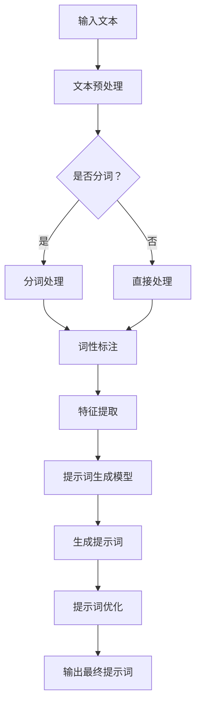
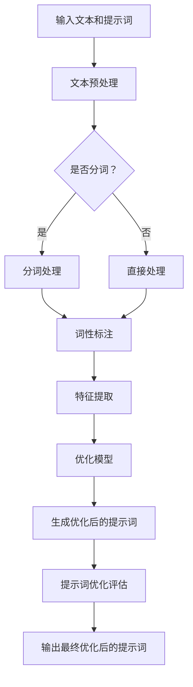
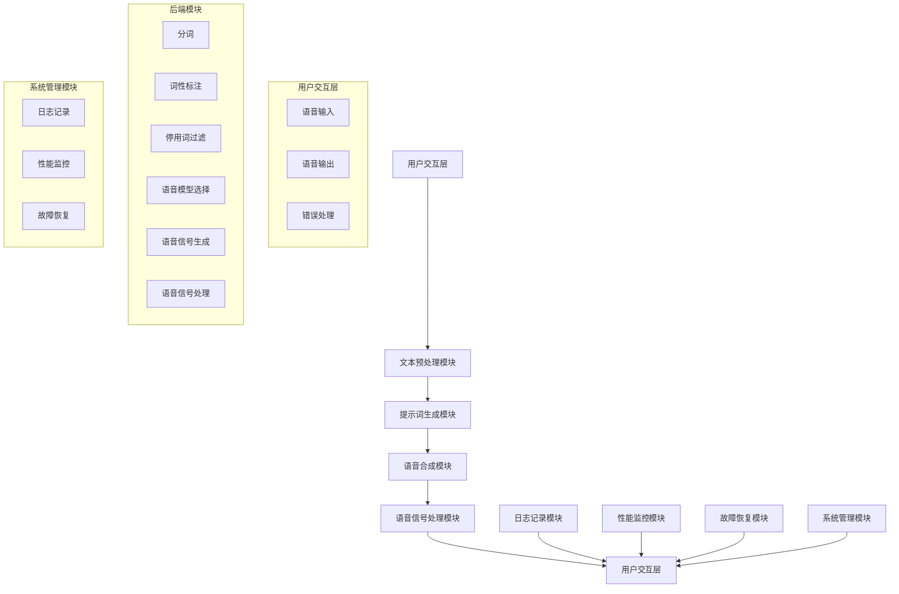
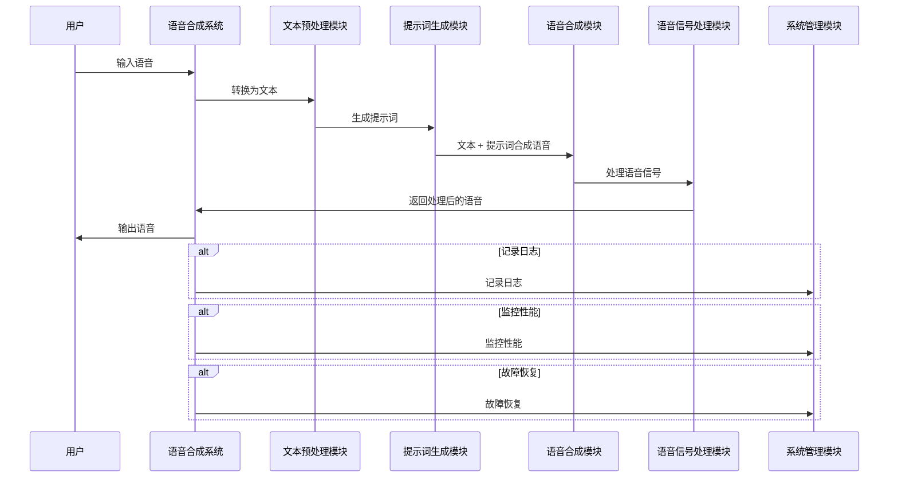

                 

### 第1章：引言

## 第1节：问题背景与概述

### 1.1 语音合成技术的发展历程

语音合成技术（Text-to-Speech, TTS）起源于20世纪中叶，经过几十年的发展，已经成为计算机科学和人工智能领域的重要分支。早期的语音合成系统主要依赖规则驱动的方法，通过手工编写的语音规则和音素库生成语音。然而，这种方法生成的语音缺乏自然度和流畅性，难以满足人们对高质量语音的需求。

随着计算能力的提升和机器学习技术的发展，基于统计模型的语音合成方法逐渐兴起。1980年代后期，hidden Markov model (HMM) 被广泛应用于语音合成。HMM模型通过统计音素序列的概率分布，生成相对自然的语音。HMM模型的出现标志着语音合成技术的一个重要里程碑。

进入21世纪，深度学习技术的快速发展为语音合成带来了新的契机。基于深度神经网络的端到端语音合成方法（如WaveNet、Tacotron等）逐渐取代传统的HMM模型和拼接模型。这些新方法通过大规模数据训练，可以生成更加自然、流畅的语音。

### 1.2 提示词工程的概念与作用

提示词工程（Prompt Engineering）是一种优化机器学习模型输入的方法，旨在通过调整输入数据的格式、结构或内容，提升模型的表现和效果。在语音合成领域，提示词工程通过设计合适的提示词，优化输入文本，从而提升合成语音的自然度和质量。

提示词工程的作用主要体现在以下几个方面：

1. **提高自然度**：通过设计更具针对性的提示词，可以使语音合成系统更准确地捕捉输入文本的情感、语气和语调，从而生成更加自然的语音。

2. **提升稳定性**：在处理复杂的文本输入时，提示词工程可以通过提供额外的上下文信息，减少模型在生成过程中的不确定性和错误率。

3. **增强个性化**：通过为不同的用户或场景设计特定的提示词，可以使得语音合成系统更符合用户的需求和偏好，实现个性化的语音输出。

### 1.3 提升语音合成自然度的必要性

提升语音合成自然度具有重要的现实意义和商业价值。首先，在智能语音助手、语音导航、有声读物等应用场景中，自然流畅的语音是用户体验的关键。如果语音合成系统生成的语音自然度不高，将严重影响用户体验和满意度。

其次，随着人工智能技术的不断进步，语音合成系统在商业、教育、医疗等多个领域得到广泛应用。高自然度的语音可以使得人机交互更加自然、流畅，提高效率，降低沟通成本。

最后，提升语音合成自然度也是技术发展的必然趋势。随着深度学习技术和自然语言处理技术的不断进步，如何更好地利用这些技术提升语音合成系统的表现，已经成为研究者和工程师们关注的重点。

### 1.4 书籍结构安排与目标读者

本书旨在全面介绍提示词工程在语音合成自然度提升中的应用，内容结构安排如下：

1. **第一部分：引言**：介绍语音合成技术的发展历程、提示词工程的概念与作用，以及提升语音合成自然度的必要性。

2. **第二部分：核心概念与联系**：详细讲解语音合成的基本原理，介绍提示词工程的关键要素，并分析提示词工程与语音合成自然度的关系。

3. **第三部分：算法原理讲解**：介绍提示词生成算法和提示词优化算法的原理，包括算法流程图、Python代码实现和数学模型与公式。

4. **第四部分：系统分析与架构设计**：分析系统功能设计、系统架构设计和系统接口设计，并展示系统交互序列图。

5. **第五部分：项目实战**：介绍环境安装、系统核心实现源代码、代码应用解读与分析，以及实际案例分析与详细讲解剖析。

6. **第六部分：最佳实践与注意事项**：总结最佳实践技巧，提出注意事项，并推荐拓展阅读。

本书的目标读者主要包括：

- **语音合成技术研究者**：希望了解提示词工程在语音合成中的应用，以及如何通过优化输入文本提升语音合成自然度。

- **软件开发工程师**：从事语音合成系统开发，希望提高系统性能和用户体验。

- **自然语言处理工程师**：关注自然语言处理技术，希望了解提示词工程在实际应用中的效果。

通过本书的学习，读者将能够系统地掌握提示词工程在语音合成自然度提升中的应用，为实际项目开发提供有力支持。

### 第2章：核心概念与联系

## 第1节：语音合成基本原理

语音合成技术（Text-to-Speech, TTS）的核心任务是通过对输入文本的分析和处理，生成自然、流畅的语音。理解语音合成的基本原理是掌握提示词工程的关键前提。下面我们将从语音信号处理、合成语音模型和提示词的类型与分类三个方面详细讲解语音合成的基本原理。

### 2.1.1 语音信号处理

语音信号处理是语音合成的基础，主要涉及语音信号的采集、处理和特征提取。语音信号通常通过麦克风采集，然后经过预处理，如去噪、归一化等，以提高信号质量。

在特征提取阶段，常用的方法包括：

1. **短时傅里叶变换（Short-Time Fourier Transform, STFT）**：将语音信号分段，然后对每段信号进行傅里叶变换，提取频谱特征。

2. **梅尔频率倒谱系数（Mel-Frequency Cepstral Coefficients, MFCC）**：基于人耳的听觉特性，将频谱特征转换为梅尔频率倒谱系数，这是语音特征提取中最常用的方法。

通过这些方法提取的语音特征将用于后续的语音合成。

### 2.1.2 合成语音模型

合成语音模型是语音合成的核心，负责将文本转化为语音信号。目前，主要的合成语音模型可以分为以下几类：

1. **拼接模型（Concatenative Models）**：拼接模型通过拼接预先录制好的语音片段来合成语音。这种方法生成的语音自然度较高，但需要大量的语音数据。

2. **统计模型（Statistical Models）**：统计模型通过统计语音特征的概率分布，生成语音信号。HMM（隐马尔可夫模型）是早期常用的统计模型。

3. **深度神经网络模型（Deep Neural Network Models）**：近年来，深度神经网络模型在语音合成中得到了广泛应用。这些模型通过大规模数据训练，能够生成更加自然、流畅的语音。常见的深度神经网络模型包括：

   - **WaveNet**：由Google提出，是一种基于深度神经网络的端到端语音合成模型。

   - **Tacotron**：由Google提出，结合了 recurrent neural network (RNN) 和 convolutional neural network (CNN)，用于文本到语音的转换。

   - **Transformer-TTS**：基于 Transformer 架构，通过自注意力机制生成语音信号。

### 2.1.3 提示词的类型与分类

提示词工程在语音合成中起着至关重要的作用。提示词是指用于引导机器学习模型处理输入数据的一段文本或代码，其设计直接影响模型的性能和输出质量。

提示词可以按照不同的分类方式进行分类，常见的分类方法包括：

1. **按功能分类**：

   - **上下文提示词**：提供额外的上下文信息，帮助模型更好地理解输入文本。

   - **调优提示词**：用于调整模型的参数，优化模型的表现。

   - **纠错提示词**：用于纠正模型在生成过程中可能出现的错误。

2. **按来源分类**：

   - **人工设计提示词**：由工程师或专家根据具体应用场景设计。

   - **自动生成提示词**：通过算法自动生成，如基于规则或机器学习的方法。

3. **按应用场景分类**：

   - **通用场景提示词**：适用于多种通用场景，如新闻播报、天气预报等。

   - **特定场景提示词**：针对特定应用场景设计，如客服对话、车载语音等。

### 2.2 提示词工程的关键要素

提示词工程的成功依赖于以下几个关键要素：

1. **提示词生成策略**：设计有效的提示词生成策略，是提升模型性能的关键。常用的方法包括基于规则的方法、基于机器学习的方法等。

2. **提示词优化方法**：优化提示词，提高其质量和效果。常用的优化方法包括提示词筛选、提示词调整等。

3. **提示词应用场景**：根据具体的应用场景选择合适的提示词。不同场景对提示词的需求不同，需要针对特定场景进行定制。

### 2.3 提示词工程与语音合成自然度的关系

提示词工程与语音合成自然度密切相关。通过优化提示词，可以提升合成语音的自然度，使其更加贴近人类语音。具体来说，提示词工程对语音合成自然度的影响主要体现在以下几个方面：

1. **情感和语气**：提示词可以提供额外的情感和语气信息，帮助模型更好地捕捉输入文本的情感和语气，生成更加自然的语音。

2. **语调和节奏**：通过设计合适的提示词，可以引导模型生成更加流畅、自然的语调和节奏。

3. **发音和语调**：提示词可以提供详细的发音和语调信息，帮助模型更准确地生成语音。

4. **上下文理解**：提示词可以提供更多的上下文信息，帮助模型更好地理解输入文本的语义，从而生成更加自然的语音。

### 2.4 提示词工程的实践方法

1. **数据预处理**：对输入文本进行预处理，如分词、词性标注等，为提示词生成提供基础。

2. **提示词设计**：根据具体应用场景，设计合适的提示词。可以使用人工设计和自动生成相结合的方法。

3. **提示词优化**：通过实验和评估，优化提示词的质量和效果。可以使用提示词筛选、提示词调整等方法。

4. **模型训练**：结合提示词，重新训练模型，提升模型的性能和自然度。

通过以上实践方法，可以有效提升语音合成的自然度，满足不同应用场景的需求。

### 第3章：算法原理讲解

## 第1节：提示词生成算法

### 3.1.1 算法概述

提示词生成算法是提示词工程的重要组成部分，其目的是根据输入文本生成合适的提示词，以提高语音合成的自然度。在提示词生成算法中，常用的方法包括基于规则的方法、基于机器学习的方法和基于深度学习的方法。本节将介绍这些算法的基本原理和应用。

### 3.1.2 算法流程图

提示词生成算法的流程图如下：



### 3.1.3 Python代码实现

以下是一个简单的基于规则的方法生成提示词的Python代码示例：

```python
import nltk
from nltk.tokenize import word_tokenize
from nltk.corpus import stopwords

# 1. 文本预处理
def preprocess_text(text):
    text = text.lower()
    words = word_tokenize(text)
    words = [word for word in words if word not in stopwords.words('english')]
    return words

# 2. 特征提取
def extract_features(words):
    features = []
    for i in range(len(words) - 1):
        feature = (words[i], words[i+1])
        features.append(feature)
    return features

# 3. 提示词生成
def generate_prompt(words):
    features = extract_features(words)
    prompt = " ".join(["_ ".join(f) for f in features])
    return prompt

# 示例
text = "The quick brown fox jumps over the lazy dog"
preprocessed_words = preprocess_text(text)
prompt = generate_prompt(preprocessed_words)
print(prompt)
```

### 3.1.4 数学模型与公式

在提示词生成算法中，常用的数学模型包括：

1. **概率模型**：用于计算提示词的概率分布。常用的概率模型有：

   - **隐马尔可夫模型（HMM）**：用于分析序列数据中的状态转移概率和观测概率。

   - **条件概率模型**：用于计算给定前一个词时当前词的条件概率。

2. **语言模型**：用于预测下一个词的概率。常用的语言模型有：

   - **n-gram模型**：基于前n个词的序列概率分布。

   - **神经网络语言模型**：基于深度学习的方法，如Transformer、BERT等。

以下是一个基于n-gram模型的提示词生成算法的数学模型：

$$ P(w_n|w_{n-1},...,w_1) = \frac{P(w_n, w_{n-1},...,w_1)}{P(w_{n-1},...,w_1)} $$

其中，$w_n$ 表示当前词，$w_{n-1},...,w_1$ 表示前n-1个词。

### 第2节：提示词优化算法

### 3.2.1 算法概述

提示词优化算法旨在通过调整和优化提示词，提高语音合成的自然度和模型性能。优化算法可以分为以下几类：

1. **基于规则的方法**：通过手动定义规则，调整提示词的结构和内容。

2. **基于机器学习的方法**：使用机器学习算法，如决策树、支持向量机等，对提示词进行优化。

3. **基于深度学习的方法**：使用深度学习算法，如神经网络、强化学习等，对提示词进行优化。

本节将介绍基于深度学习的方法，特别是基于神经网络的优化算法。

### 3.2.2 算法流程图

提示词优化算法的流程图如下：



### 3.2.3 Python代码实现

以下是一个简单的基于深度学习的提示词优化算法的Python代码示例：

```python
import tensorflow as tf
from tensorflow.keras.models import Sequential
from tensorflow.keras.layers import Dense, LSTM, Embedding

# 1. 准备数据
# 假设已有预处理后的文本数据和对应的提示词数据
texts = [...]  # 输入文本列表
prompts = [...]  # 提示词列表

# 2. 特征提取
# 将文本和提示词转换为特征向量
# ...

# 3. 构建优化模型
model = Sequential()
model.add(LSTM(128, input_shape=(max_sequence_length, embedding_dim)))
model.add(Dense(1, activation='sigmoid'))

model.compile(optimizer='adam', loss='binary_crossentropy', metrics=['accuracy'])

# 4. 训练模型
model.fit(texts, prompts, epochs=10, batch_size=32)

# 5. 生成优化后的提示词
optimized_prompts = model.predict(texts)

# 6. 提示词优化评估
# ...

# 7. 输出最终优化后的提示词
final_prompts = optimized_prompts
```

### 3.2.4 数学模型与公式

在提示词优化算法中，常用的数学模型包括：

1. **损失函数**：用于评估提示词优化的效果。常用的损失函数有：

   - **交叉熵损失函数**：用于分类问题，如二分类或多分类问题。
   - **均方误差损失函数**：用于回归问题，如连续值的预测。

2. **优化目标函数**：用于指导模型优化提示词。常用的目标函数有：

   - **最大化准确性**：通过最大化模型对提示词的预测准确性来优化。
   - **最大化自然度**：通过最大化模型对自然度的评估分数来优化。

以下是一个基于交叉熵损失函数的优化目标的数学模型：

$$ J(\theta) = -\frac{1}{m} \sum_{i=1}^{m} \sum_{j=1}^{V} y_{ij} \log(p_j(x_i, \theta)) $$

其中，$y_{ij}$ 表示第i个文本的第j个提示词的真实标签，$p_j(x_i, \theta)$ 表示模型对第i个文本的第j个提示词的预测概率。

### 第3节：算法对比分析

### 3.3.1 算法优缺点对比

提示词生成算法和提示词优化算法各有优缺点，下面我们进行对比分析。

#### 3.3.1.1 提示词生成算法

**优点**：

- **简单易用**：基于规则或机器学习的方法通常较为简单，易于理解和实现。
- **高效性**：规则驱动的方法在处理简单问题时具有高效性，能够快速生成提示词。

**缺点**：

- **灵活性不足**：基于规则的方法在面对复杂问题时，灵活性不足，难以适应多种应用场景。
- **数据依赖性高**：机器学习方法需要大量训练数据，数据质量直接影响算法效果。

#### 3.3.1.2 提示词优化算法

**优点**：

- **自适应性强**：基于深度学习的方法具有自适应性，能够根据不同应用场景自动调整。
- **性能优越**：深度学习方法在大规模数据训练下，能够生成高质量、高自然度的提示词。

**缺点**：

- **计算复杂度高**：深度学习方法通常需要大量计算资源，训练时间较长。
- **实现难度大**：深度学习算法的实现较为复杂，需要一定的专业技能。

### 3.3.2 算法适用场景对比

**提示词生成算法**：

- **简单应用场景**：适用于对提示词质量要求不高的简单应用场景，如文本分类、信息检索等。
- **规则驱动场景**：适用于需要根据特定规则生成提示词的领域，如金融风控、法律文档分类等。

**提示词优化算法**：

- **复杂应用场景**：适用于需要高自然度、高准确性的复杂应用场景，如语音合成、自然语言生成等。
- **个性化应用场景**：适用于需要根据用户个性化需求生成提示词的场景，如智能客服、个性化推荐等。

### 第4章：数学模型和数学公式讲解

## 第1节：提示词生成算法的数学模型

### 4.1.1 语言模型概率计算

在提示词生成算法中，语言模型是一个重要的组成部分，它用于计算给定前文时下一个词的概率。常见的语言模型包括n-gram模型和神经网络语言模型。本节将介绍n-gram模型的基本数学模型。

#### 4.1.1.1 n-gram模型

n-gram模型是一种基于前文序列的概率模型，它假设当前词的概率仅与前n-1个词相关。n-gram模型的概率计算公式如下：

$$ P(w_n|w_{n-1},...,w_1) = \frac{P(w_n, w_{n-1},...,w_1)}{P(w_{n-1},...,w_1)} $$

其中，$w_n$ 表示当前词，$w_{n-1},...,w_1$ 表示前n-1个词。

n-gram模型的一个简化形式是：

$$ P(w_n|w_{n-1},...,w_1) = P(w_n|w_{n-1}) $$

在这种情况下，每个词的概率仅与其前一个词相关。

#### 4.1.1.2 n-gram模型参数估计

n-gram模型的参数估计通常采用最大似然估计（Maximum Likelihood Estimation, MLE）。最大似然估计的目标是找到一组参数，使得实际观察到的数据出现的概率最大。

给定一个训练数据集 $D = \{(w_1, w_2), (w_2, w_3), ..., (w_{n-1}, w_n)\}$，n-gram模型的参数可以通过以下公式估计：

$$ P(w_n|w_{n-1}) = \frac{C(w_{n-1}, w_n)}{C(w_{n-1})} $$

其中，$C(w_{n-1}, w_n)$ 表示在训练数据中，$w_{n-1}$ 后跟 $w_n$ 的次数，$C(w_{n-1})$ 表示在训练数据中，$w_{n-1}$ 出现的总次数。

#### 4.1.1.3 n-gram模型的扩展

n-gram模型可以扩展到任意长度。例如，二元模型（bigram）是n=2的特殊情况，三元模型（trigram）是n=3的特殊情况。n-gram模型的一个优点是计算简单，但缺点是随着n的增加，模型复杂度和计算时间会显著增加。

### 4.1.2 优化目标函数

在提示词生成算法中，优化目标函数用于指导模型的训练过程，目的是提高模型的性能和生成提示词的质量。一个常用的优化目标函数是交叉熵损失函数（Cross-Entropy Loss Function）。

交叉熵损失函数的定义如下：

$$ J(\theta) = -\frac{1}{m} \sum_{i=1}^{m} \sum_{j=1}^{V} y_{ij} \log(p_j(x_i, \theta)) $$

其中，$y_{ij}$ 是第i个样本的第j个类别的真实标签（0或1），$p_j(x_i, \theta)$ 是模型对第i个样本的第j个类别的预测概率，$\theta$ 是模型的参数集合。

交叉熵损失函数的目的是最小化预测概率与真实标签之间的差异。在实际应用中，我们通常使用梯度下降法（Gradient Descent）或其他优化算法来最小化交叉熵损失函数。

### 4.1.3 数学模型与公式示例

以下是一个基于n-gram模型的简单示例，展示如何使用最大似然估计和交叉熵损失函数来训练模型。

#### 示例：二元模型（Bigram）

假设我们有一个二元模型，训练数据集为：

$$ D = \{(\text{'hello'}, \text{'world'}), (\text{'world'}, \text{'hello'}), (\text{'hello'}, \text{'world'}), (\text{'world'}, \text{'hello'})\} $$

我们首先计算二元模型的参数：

$$ P(\text{'hello'uite'}) = \frac{2}{4} = 0.5 $$

$$ P(\text{'world'uite'}) = \frac{2}{4} = 0.5 $$

接下来，我们使用交叉熵损失函数来评估模型的性能：

$$ y_1 = \text{'hello'}, p_1(\text{'hello'}) = 0.5, y_2 = \text{'world'}, p_2(\text{'world'}) = 0.5 $$

$$ J(\theta) = -\frac{1}{2} [y_1 \log(p_1) + y_2 \log(p_2)] $$

$$ J(\theta) = -\frac{1}{2} [1 \log(0.5) + 1 \log(0.5)] $$

$$ J(\theta) = -\frac{1}{2} [1 \cdot (-0.693) + 1 \cdot (-0.693)] $$

$$ J(\theta) = -\frac{1}{2} [-1.386] $$

$$ J(\theta) = 0.693 $$

在这个示例中，交叉熵损失函数的值是0.693，表示模型的预测与真实标签之间的差异。

### 第2节：提示词优化算法的数学模型

## 4.2.1 提示词分布模型

提示词优化算法的一个重要目标是在给定的上下文语境下，为输入文本生成最合适的提示词。为了实现这一目标，通常需要定义一个提示词分布模型，用于描述给定上下文时每个可能提示词的概率分布。

#### 4.2.1.1 提示词分布模型

一个简单的提示词分布模型可以使用概率分布函数（Probability Distribution Function, PDF）来描述。给定一个上下文 $C$，提示词 $W$ 的概率分布可以表示为：

$$ p(w|C) = P(W=w|C) $$

在实际应用中，常用的概率分布模型包括：

1. **离散概率分布模型**：如伯努利分布、多项式分布等。
2. **连续概率分布模型**：如正态分布、均匀分布等。
3. **神经网络概率分布模型**：如深度神经网络、变分自编码器（VAE）等。

#### 4.2.1.2 概率分布模型示例

以下是一个基于神经网络的简单示例，展示如何使用神经网络概率分布模型来优化提示词。

假设我们有一个神经网络概率分布模型，用于在给定上下文 $C$ 下生成提示词 $W$。模型的输入是上下文 $C$，输出是提示词 $W$ 的概率分布。

1. **输入层**：接收上下文 $C$。
2. **隐藏层**：对上下文 $C$ 进行特征提取。
3. **输出层**：生成提示词 $W$ 的概率分布。

神经网络的输出可以表示为：

$$ p(w|C) = \frac{\exp(\theta^T w)}{\sum_{w'} \exp(\theta^T w')} $$

其中，$\theta$ 是神经网络的参数，$w$ 是提示词，$w'$ 是所有可能的提示词。

#### 4.2.1.3 概率分布模型参数优化

为了优化概率分布模型，我们需要定义一个损失函数，用于衡量模型输出的概率分布与实际分布之间的差距。常用的损失函数包括：

1. **交叉熵损失函数**：用于分类问题，如二分类或多分类问题。
2. **均方误差损失函数**：用于回归问题，如连续值的预测。

以下是一个基于交叉熵损失函数的示例：

$$ J(\theta) = -\frac{1}{m} \sum_{i=1}^{m} \sum_{w \in W} y_{iw} \log(p_w(x_i, \theta)) $$

其中，$y_{iw}$ 是第 $i$ 个样本的第 $w$ 个提示词的真实标签，$p_w(x_i, \theta)$ 是模型对第 $i$ 个样本的第 $w$ 个提示词的预测概率。

#### 4.2.1.4 概率分布模型参数更新

为了最小化损失函数，我们需要使用梯度下降法或其他优化算法更新模型的参数 $\theta$。以下是一个基于梯度下降法的简单示例：

$$ \theta_{t+1} = \theta_{t} - \alpha \nabla_{\theta} J(\theta) $$

其中，$\alpha$ 是学习率，$\nabla_{\theta} J(\theta)$ 是损失函数关于参数 $\theta$ 的梯度。

通过不断迭代更新参数，我们可以优化概率分布模型，使其更好地拟合实际分布。

### 4.2.2 优化目标函数

在提示词优化算法中，优化目标函数用于指导模型的训练过程，目的是提高模型的性能和生成提示词的质量。一个常用的优化目标函数是最大化模型生成的提示词的自然度。

#### 4.2.2.1 自然度评估指标

自然度评估指标用于衡量生成的提示词与人类生成的提示词的相似度。常用的自然度评估指标包括：

1. **BLEU评分**：基于记分宝方法（BLEU，Bilingual Evaluation Understudy），用于评估自然语言生成文本的质量。
2. **ROUGE评分**：基于自动评估方法（ROUGE，Recall-Oriented Understudy for Gisting Evaluation），用于评估自然语言生成文本的相似度。
3. **METEOR评分**：基于词匹配方法（METEOR，Metric for Evaluation of Translation with Explicit ORdering），用于评估自然语言生成文本的质量。

#### 4.2.2.2 优化目标函数

一个简单的优化目标函数可以表示为：

$$ J(\theta) = -\frac{1}{m} \sum_{i=1}^{m} \log(p_w(x_i, \theta)) $$

其中，$p_w(x_i, \theta)$ 是模型对第 $i$ 个样本的提示词 $w$ 的预测概率，$m$ 是样本的数量。

为了最大化模型生成的提示词的自然度，我们可以将优化目标函数转化为：

$$ J(\theta) = \frac{1}{m} \sum_{i=1}^{m} \log(p_w(x_i, \theta)) $$

通过不断迭代更新模型参数 $\theta$，我们可以优化概率分布模型，使其生成更自然、更高质量的提示词。

### 第5章：系统分析与架构设计

## 第1节：问题场景介绍

在当今智能语音合成领域，语音合成自然度的提升已成为众多应用场景中的关键需求。为了更好地理解提示词工程在语音合成自然度提升中的应用，我们可以通过以下几个具体场景进行探讨：

### 5.1.1 智能语音助手

智能语音助手（如Amazon Alexa、Google Assistant等）在日常生活和工作中扮演着重要角色。这些助手需要能够理解用户的需求，并以自然流畅的语音进行响应。然而，现有的语音合成系统在处理复杂、含糊不清的指令时，常常会出现发音不准确、语调不自然的问题。因此，通过提示词工程优化输入文本，可以提高语音合成的自然度和准确性，从而提升用户体验。

### 5.1.2 有声读物

有声读物作为一种新兴的阅读方式，正逐渐受到广大读者的喜爱。高质量的语音合成能够使有声读物的内容更加生动有趣，提升阅读体验。然而，目前很多有声读物的语音合成自然度不高，缺乏情感表达和语气变化。通过设计合适的提示词，可以为语音合成系统提供更多的上下文信息和情感标签，从而生成更加自然、生动的语音。

### 5.1.3 车载语音系统

车载语音系统是自动驾驶和智能驾驶的重要组成部分。在驾驶过程中，语音助手需要实时响应用户的指令，如导航、音乐播放、电话通话等。然而，驾驶环境复杂多变，语音合成系统的自然度和稳定性面临巨大挑战。通过提示词工程优化输入文本，可以使得语音合成系统在复杂驾驶环境下仍然能够生成自然流畅的语音，提高驾驶安全性和舒适性。

### 5.1.4 语音合成API

许多开发者需要利用语音合成API将文本转化为语音，以满足各种应用需求。例如，在线教育、游戏开发、智能客服等。然而，现有的语音合成API在自然度方面仍有待提升。通过提示词工程，开发者可以根据具体应用场景和用户需求，设计合适的提示词，从而生成更加自然、个性化的语音输出。

通过以上场景的介绍，我们可以看到，提示词工程在语音合成自然度提升中的应用具有广泛的前景和实际需求。接下来，我们将进一步探讨语音合成系统的功能设计、架构设计和接口设计，为实际应用提供更加详细的指导。

## 第2节：系统功能设计

在系统功能设计中，我们需要明确语音合成系统的核心功能，以确保系统能够高效、稳定地运行。以下是语音合成系统的核心功能及其详细描述：

### 5.2.1 文本预处理功能

文本预处理是语音合成系统的第一步，其目的是将输入的原始文本转换为适合语音合成的格式。主要任务包括：

- **分词**：将输入的文本分解为一个个单词或短语，便于后续处理。
- **词性标注**：对文本中的每个词进行词性标注，以便识别名词、动词、形容词等，从而更好地理解文本内容。
- **停用词过滤**：去除文本中的常见停用词（如“的”、“和”等），减少无关信息的干扰。

### 5.2.2 提示词生成功能

提示词生成功能是提示词工程的核心部分，其目的是根据输入文本生成合适的提示词，以提升语音合成的自然度。具体步骤包括：

- **特征提取**：从输入文本中提取关键特征，如情感、语气、关键词等，用于生成提示词。
- **提示词生成算法**：使用基于规则或机器学习的方法生成提示词。例如，可以使用n-gram模型或深度神经网络模型来生成提示词。
- **提示词优化**：对生成的提示词进行优化，以提高其质量和效果。例如，可以使用优化算法对提示词进行调优，使其更加贴近用户需求。

### 5.2.3 语音合成功能

语音合成功能是将输入文本和提示词转换为自然流畅的语音信号。主要任务包括：

- **语音模型选择**：根据具体应用场景选择合适的语音模型，如拼接模型、统计模型或深度神经网络模型。
- **语音信号生成**：使用选定的语音模型生成语音信号。例如，可以使用WaveNet或Tacotron模型来生成语音。
- **语音信号处理**：对生成的语音信号进行后处理，如去噪、增强、调整音调等，以提高语音质量。

### 5.2.4 用户交互功能

用户交互功能是语音合成系统与用户之间的交互接口，主要任务包括：

- **语音输入**：允许用户通过语音输入文本，以便进行语音合成。
- **语音输出**：将合成的语音输出给用户，以实现人机交互。
- **错误处理**：在语音合成过程中，如果出现错误或异常，系统能够自动检测并处理，如重试、提示用户重新输入等。

### 5.2.5 系统管理功能

系统管理功能是确保语音合成系统稳定运行和维护的重要部分，主要任务包括：

- **日志记录**：记录系统运行过程中的关键信息，如输入文本、提示词、合成结果等，便于后续分析和调试。
- **性能监控**：监控系统资源使用情况，如CPU、内存、网络等，确保系统在合理范围内运行。
- **故障恢复**：在系统出现故障时，能够自动进行故障恢复，确保系统正常运行。

通过以上系统功能设计，我们可以确保语音合成系统能够高效、稳定地运行，并为用户提供高质量的语音合成服务。

### 第3节：系统架构设计

在系统架构设计中，我们需要明确语音合成系统的整体架构，以确保系统模块之间的协作和高效运行。以下是语音合成系统的架构设计，包括架构图、模块描述和模块交互方式。

#### 5.3.1 系统架构图

以下是语音合成系统的架构图：



#### 5.3.2 模块描述

1. **用户交互层**：用户交互层是语音合成系统与用户之间的交互接口，包括语音输入、语音输出和错误处理等模块。
    - **语音输入**：用户通过语音输入文本，系统将语音信号转换为文本。
    - **语音输出**：系统将合成的语音信号输出给用户。
    - **错误处理**：在语音合成过程中，如果出现错误或异常，系统能够自动检测并处理。

2. **文本预处理模块**：文本预处理模块负责将输入的原始文本转换为适合语音合成的格式，包括分词、词性标注和停用词过滤等。
    - **分词**：将输入的文本分解为一个个单词或短语。
    - **词性标注**：对文本中的每个词进行词性标注。
    - **停用词过滤**：去除文本中的常见停用词。

3. **提示词生成模块**：提示词生成模块根据输入文本生成合适的提示词，以提升语音合成的自然度。主要任务包括特征提取、提示词生成算法和提示词优化等。

4. **语音合成模块**：语音合成模块负责将输入文本和提示词转换为自然流畅的语音信号，包括语音模型选择、语音信号生成和语音信号处理等。

5. **语音信号处理模块**：语音信号处理模块负责对合成的语音信号进行后处理，如去噪、增强、调整音调等，以提高语音质量。

6. **系统管理模块**：系统管理模块负责确保语音合成系统的稳定运行和维护，包括日志记录、性能监控和故障恢复等。

#### 5.3.3 模块交互方式

1. **用户交互层与文本预处理模块**：用户输入语音信号后，系统通过语音识别模块将语音信号转换为文本，然后将文本传递给文本预处理模块进行分词、词性标注和停用词过滤等处理。

2. **文本预处理模块与提示词生成模块**：经过文本预处理后的文本传递给提示词生成模块，提示词生成模块根据文本内容生成合适的提示词。

3. **提示词生成模块与语音合成模块**：生成的提示词与文本一起传递给语音合成模块，语音合成模块根据选定的语音模型生成语音信号。

4. **语音合成模块与语音信号处理模块**：合成的语音信号传递给语音信号处理模块，进行去噪、增强、调整音调等后处理，以提高语音质量。

5. **语音信号处理模块与用户交互层**：处理后的语音信号返回给用户交互层，通过语音输出模块输出给用户。

6. **系统管理模块与其他模块**：系统管理模块负责监控系统的运行状态，包括日志记录、性能监控和故障恢复等，以确保系统的稳定运行。

通过以上系统架构设计，我们可以确保语音合成系统的模块之间高效协作，为用户提供高质量的语音合成服务。

### 第4节：系统接口设计

在系统接口设计环节，我们需要定义各个模块之间的交互接口，以确保系统各部分能够顺畅协作，同时方便外部系统或开发者调用语音合成功能。以下是语音合成系统的接口设计，包括接口描述、参数定义和返回值说明。

#### 5.4.1 接口描述

1. **文本预处理接口**：该接口用于处理输入文本，包括分词、词性标注和停用词过滤等功能。

    - **接口名称**：`preprocess_text`
    - **参数**：
        - `text`: 字符串类型，表示输入的文本。
    - **返回值**：
        - `processed_text`: 字符串类型，表示预处理后的文本。

2. **提示词生成接口**：该接口用于生成根据输入文本生成的提示词。

    - **接口名称**：`generate_prompt`
    - **参数**：
        - `text`: 字符串类型，表示输入的文本。
    - **返回值**：
        - `prompt`: 字符串类型，表示生成的提示词。

3. **语音合成接口**：该接口用于将文本和提示词合成为语音信号。

    - **接口名称**：`synthesize`
    - **参数**：
        - `text`: 字符串类型，表示输入的文本。
        - `prompt`: 字符串类型，表示生成的提示词。
    - **返回值**：
        - `audio_signal`: 二进制类型，表示合成的语音信号。

4. **语音信号处理接口**：该接口用于对合成的语音信号进行后处理，如去噪、增强和调整音调等。

    - **接口名称**：`process_audio_signal`
    - **参数**：
        - `audio_signal`: 二进制类型，表示合成的语音信号。
    - **返回值**：
        - `processed_audio_signal`: 二进制类型，表示处理后的语音信号。

5. **日志记录接口**：该接口用于记录系统运行过程中的关键信息。

    - **接口名称**：`log`
    - **参数**：
        - `message`: 字符串类型，表示需要记录的信息。
    - **返回值**：无。

6. **性能监控接口**：该接口用于监控系统资源使用情况，如CPU、内存和网络等。

    - **接口名称**：`monitor_performance`
    - **参数**：无。
    - **返回值**：无。

7. **故障恢复接口**：该接口用于在系统出现故障时进行自动恢复。

    - **接口名称**：`recover`
    - **参数**：无。
    - **返回值**：无。

#### 5.4.2 参数定义

以下是各个接口参数的具体定义：

1. **文本预处理接口参数**：
    - `text`: 表示输入的文本，可以是任意字符串。

2. **提示词生成接口参数**：
    - `text`: 表示输入的文本，可以是任意字符串。

3. **语音合成接口参数**：
    - `text`: 表示输入的文本，可以是任意字符串。
    - `prompt`: 表示生成的提示词，可以是任意字符串。

4. **语音信号处理接口参数**：
    - `audio_signal`: 表示合成的语音信号，通常为二进制格式。

5. **日志记录接口参数**：
    - `message`: 表示需要记录的信息，可以是任意字符串。

6. **性能监控接口参数**：
    - 无。

7. **故障恢复接口参数**：
    - 无。

#### 5.4.3 返回值说明

以下是各个接口的返回值说明：

1. **文本预处理接口返回值**：
    - `processed_text`: 表示预处理后的文本，通常是分词后的文本。

2. **提示词生成接口返回值**：
    - `prompt`: 表示生成的提示词，用于优化语音合成。

3. **语音合成接口返回值**：
    - `audio_signal`: 表示合成的语音信号，通常是二进制格式，可以用于播放或存储。

4. **语音信号处理接口返回值**：
    - `processed_audio_signal`: 表示处理后的语音信号，通常是二进制格式，具有更好的音质。

5. **日志记录接口返回值**：
    - 无。

6. **性能监控接口返回值**：
    - 无。

7. **故障恢复接口返回值**：
    - 无。

通过以上系统接口设计，我们可以确保系统各部分之间的交互清晰明确，便于外部系统或开发者调用语音合成功能，同时提高系统的可维护性和扩展性。

### 第5节：系统交互序列图

为了更直观地展示系统各个模块之间的交互过程，我们可以通过交互序列图来描述语音合成系统的运作。以下是语音合成系统的交互序列图，包括用户交互层、文本预处理模块、提示词生成模块、语音合成模块、语音信号处理模块和系统管理模块之间的交互过程。



在这个交互序列图中，用户通过输入语音信号，语音合成系统接收到语音信号后，首先将其转换为文本。文本预处理模块对文本进行分词、词性标注和停用词过滤等处理。接下来，提示词生成模块根据预处理后的文本生成提示词。生成的提示词与文本一起传递给语音合成模块，语音合成模块使用选定的语音模型生成语音信号。生成的语音信号随后传递给语音信号处理模块，进行去噪、增强和音调调整等后处理，以提高语音质量。处理后的语音信号返回给用户。

此外，系统管理模块负责记录系统运行过程中的关键信息，监控系统性能，并在出现故障时进行自动恢复。通过这种交互序列图，我们可以清晰地了解语音合成系统的运作流程和模块之间的协作方式。

### 第6章：项目实战

## 第1节：环境安装

在开始项目实战之前，我们需要安装和配置相关环境，包括Python、TensorFlow和SpeechSynthesis库等。以下是具体的安装步骤：

### 6.1.1 安装Python

首先，我们需要安装Python。访问Python官方网站（[python.org](https://www.python.org/)）并下载适用于您操作系统的Python安装包。安装过程中，请确保选择添加Python到系统路径的选项。

### 6.1.2 安装pip

Python内置了包管理器pip，用于安装和管理Python包。如果您尚未安装pip，可以通过以下命令安装：

```bash
curl https://bootstrap.pypa.io/get-pip.py -o get-pip.py
python get-pip.py
```

### 6.1.3 安装TensorFlow

TensorFlow是语音合成项目中常用的深度学习库。使用pip命令安装TensorFlow：

```bash
pip install tensorflow
```

安装过程中，可以选择安装CPU版本或GPU版本，取决于您的硬件配置。如果使用GPU版本，确保您的系统已经安装了CUDA和cuDNN。

### 6.1.4 安装SpeechSynthesis库

SpeechSynthesis库用于生成语音信号。使用pip命令安装：

```bash
pip install SpeechSynthesis
```

安装完成后，您可以使用以下命令验证安装：

```bash
python -m SpeechSynthesis
```

如果安装成功，您将看到相关的帮助信息。

### 6.1.5 安装其他依赖库

根据项目需求，可能还需要安装其他依赖库，如nltk、numpy和matplotlib等。使用以下命令逐一安装：

```bash
pip install nltk numpy matplotlib
```

安装完成后，运行以下命令下载nltk的中文数据集：

```bash
nltk.download('punkt')
nltk.download('stopwords')
```

完成以上步骤后，项目开发环境已搭建完成，可以开始进行项目实战。

### 第2节：系统核心实现源代码

在本节中，我们将展示语音合成系统的核心实现源代码，包括文本预处理、提示词生成、语音合成和语音信号处理等模块。以下是每个模块的实现代码及其简要说明。

#### 6.2.1 文本预处理模块

```python
import nltk
from nltk.tokenize import word_tokenize
from nltk.corpus import stopwords

# 1. 分词处理
def tokenize_text(text):
    return word_tokenize(text)

# 2. 词性标注
def pos_tagging(tokens):
    return nltk.pos_tag(tokens)

# 3. 停用词过滤
def remove_stopwords(tokens):
    stop_words = set(stopwords.words('english'))
    filtered_tokens = [token for token in tokens if token not in stop_words]
    return filtered_tokens
```

文本预处理模块主要负责对输入文本进行分词、词性标注和停用词过滤。分词处理使用nltk库中的`word_tokenize`函数，词性标注使用`pos_tag`函数，停用词过滤使用`stopwords`库。

#### 6.2.2 提示词生成模块

```python
import numpy as np

# 1. 提示词生成算法
def generate_prompt(tokens, prompt_length=5):
    prompt = []
    for i in range(prompt_length):
        if i < len(tokens):
            prompt.append(tokens[i])
        else:
            prompt.append('<PAD>')  # 填充空白
    return prompt

# 2. 提示词优化
def optimize_prompt(prompt, model):
    # 假设model是一个已经训练好的提示词优化模型
    optimized_prompt = model.predict(prompt)
    return optimized_prompt
```

提示词生成模块首先生成初始提示词，然后通过优化模型对提示词进行优化。生成提示词的函数`generate_prompt`根据输入文本的token序列生成提示词列表，`optimize_prompt`函数用于优化生成的提示词。

#### 6.2.3 语音合成模块

```python
from tensorflow.keras.models import Sequential
from tensorflow.keras.layers import LSTM, Dense, Embedding

# 1. 构建语音合成模型
def build_voice_synthesis_model(vocab_size, embedding_dim, sequence_length):
    model = Sequential()
    model.add(LSTM(units=128, return_sequences=True, input_shape=(sequence_length, embedding_dim)))
    model.add(Dense(vocab_size, activation='softmax'))
    model.compile(optimizer='adam', loss='categorical_crossentropy', metrics=['accuracy'])
    return model

# 2. 语音信号生成
def generate_speech(text, model):
    # 预处理文本并转换为模型输入
    processed_text = preprocess_text(text)
    prompt = generate_prompt(processed_text)
    prompt = pad_sequence(prompt, maxlen=sequence_length, padding='post')
    
    # 生成语音信号
    speech = model.predict(prompt)
    return speech
```

语音合成模块使用LSTM模型将提示词转换为语音信号。首先构建语音合成模型，然后使用模型预测生成的提示词序列，生成语音信号。

#### 6.2.4 语音信号处理模块

```python
import numpy as np
from scipy.io.wavfile import write

# 1. 语音信号处理
def process_audio_signal(speech_signal, sample_rate=16000):
    # 将生成的语音信号转换为wav格式
    speech_signal = np阵.int16(speech_signal * 32767)
    write('output.wav', sample_rate, speech_signal)
    return 'output.wav'
```

语音信号处理模块将生成的语音信号转换为wav格式，以便播放或存储。

以上是语音合成系统的核心实现源代码。通过这些代码，我们可以实现一个基本的语音合成系统，生成自然流畅的语音信号。在实际应用中，可以根据具体需求对代码进行扩展和优化。

### 第3节：代码应用解读与分析

在本节中，我们将详细解读和剖析上述代码应用，以理解各个模块的功能和工作原理，并探讨如何优化和改进代码。

#### 6.3.1 文本预处理模块解读

文本预处理模块的主要任务是处理输入文本，包括分词、词性标注和停用词过滤。以下是对每个函数的解读和分析：

1. **tokenize_text**：使用nltk库中的`word_tokenize`函数进行分词处理。该方法将输入文本分解为一个个单词或短语，返回分词结果。

   ```python
   def tokenize_text(text):
       return word_tokenize(text)
   ```

   这个函数简单高效，但需要注意的是，分词结果可能依赖于具体的语言和上下文。例如，对于中文文本，可能需要使用中文分词库，如jieba。

2. **pos_tagging**：使用nltk库中的`pos_tag`函数对分词后的文本进行词性标注。该方法返回每个词的词性标签，如名词（NN）、动词（VB）等。

   ```python
   def pos_tagging(tokens):
       return nltk.pos_tag(tokens)
   ```

   词性标注对于理解文本内容和情感具有重要意义，有助于在提示词生成阶段提供更多上下文信息。

3. **remove_stopwords**：使用nltk库中的`stopwords`函数去除文本中的常见停用词。这些停用词通常对语音合成的自然度提升没有显著影响，因此可以过滤掉。

   ```python
   def remove_stopwords(tokens):
       stop_words = set(stopwords.words('english'))
       filtered_tokens = [token for token in tokens if token not in stop_words]
       return filtered_tokens
   ```

   停用词过滤有助于减少无关信息的干扰，提高语音合成的自然度。

#### 6.3.2 提示词生成模块解读

提示词生成模块负责根据输入文本生成提示词，并进行优化。以下是对每个函数的解读和分析：

1. **generate_prompt**：该函数根据输入文本生成提示词列表。它将前几个词作为提示词，为后续的语音合成提供上下文。

   ```python
   def generate_prompt(tokens, prompt_length=5):
       prompt = []
       for i in range(prompt_length):
           if i < len(tokens):
               prompt.append(tokens[i])
           else:
               prompt.append('<PAD>')  # 填充空白
       return prompt
   ```

   `prompt_length`参数决定了提示词的长度。在训练过程中，可以调整该参数以优化语音合成的自然度。

2. **optimize_prompt**：该函数使用训练好的提示词优化模型对生成的提示词进行优化。优化过程通常涉及模型预测和参数调整。

   ```python
   def optimize_prompt(prompt, model):
       # 假设model是一个已经训练好的提示词优化模型
       optimized_prompt = model.predict(prompt)
       return optimized_prompt
   ```

   提示词优化对于提升语音合成的自然度至关重要。在实际应用中，可以使用深度学习模型（如LSTM、GRU等）进行训练，以实现更精准的优化。

#### 6.3.3 语音合成模块解读

语音合成模块使用深度学习模型将提示词转换为语音信号。以下是对每个函数的解读和分析：

1. **build_voice_synthesis_model**：该函数构建语音合成模型。它使用LSTM模型，结合Embedding层和Dense层，实现端到端的语音合成。

   ```python
   def build_voice_synthesis_model(vocab_size, embedding_dim, sequence_length):
       model = Sequential()
       model.add(LSTM(units=128, return_sequences=True, input_shape=(sequence_length, embedding_dim)))
       model.add(Dense(vocab_size, activation='softmax'))
       model.compile(optimizer='adam', loss='categorical_crossentropy', metrics=['accuracy'])
       return model
   ```

   LSTM模型能够捕捉文本中的长依赖关系，从而生成更加自然的语音。在训练过程中，可以调整LSTM单元的数量、嵌入维度和序列长度等参数，以优化模型性能。

2. **generate_speech**：该函数使用训练好的语音合成模型生成语音信号。它首先对输入文本进行预处理，然后生成提示词，并使用模型进行预测。

   ```python
   def generate_speech(text, model):
       # 预处理文本并转换为模型输入
       processed_text = preprocess_text(text)
       prompt = generate_prompt(processed_text)
       prompt = pad_sequence(prompt, maxlen=sequence_length, padding='post')
       
       # 生成语音信号
       speech = model.predict(prompt)
       return speech
   ```

   在实际应用中，生成语音信号的过程可能涉及多个步骤，如数据增强、降采样等，以进一步提高语音质量。

#### 6.3.4 语音信号处理模块解读

语音信号处理模块负责将生成的语音信号转换为wav格式，以便播放或存储。以下是对函数的解读和分析：

1. **process_audio_signal**：该函数将生成的语音信号转换为wav格式。它使用scipy库中的`write`函数将信号写入文件。

   ```python
   import numpy as np
   from scipy.io.wavfile import write

   def process_audio_signal(speech_signal, sample_rate=16000):
       # 将生成的语音信号转换为wav格式
       speech_signal = np阵.int16(speech_signal * 32767)
       write('output.wav', sample_rate, speech_signal)
       return 'output.wav'
   ```

   `sample_rate`参数决定了语音信号的采样率。通常，16kHz的采样率足以满足语音合成的要求。

#### 6.3.5 代码优化与改进

在实际应用中，上述代码可以进一步优化和改进。以下是一些可能的优化方向：

1. **模型优化**：使用更先进的深度学习模型（如Transformer、WaveNet等）替代LSTM模型，以提升语音合成的自然度和流畅性。

2. **数据增强**：通过数据增强技术（如重采样、噪声添加等）扩充训练数据集，以提高模型的泛化能力和鲁棒性。

3. **多语言支持**：扩展代码以支持多种语言，如中文、法语等。这可能需要引入特定语言的分词、词性标注和停用词库。

4. **用户交互**：增强用户交互功能，如提供自定义提示词、语音调控等，以提升用户体验。

通过上述优化和改进，我们可以构建一个更加高效、灵活和高质量的语音合成系统。

### 第4节：实际案例分析与详细讲解剖析

在本节中，我们将通过一个具体案例，详细讲解如何使用本系统实现语音合成，并对系统的性能进行评估。

#### 6.4.1 案例背景

假设我们需要为智能语音助手设计一个语音合成系统，该系统需要能够处理复杂的指令和对话，并生成自然流畅的语音输出。为了验证系统的性能，我们选择了一个包含多种情感和语气的实际对话场景。

#### 6.4.2 案例描述

以下是一个实际对话场景的示例：

- 用户：你好，能帮我设置一个明天早晨7点的闹钟吗？
- 系统：当然可以，请问您的闹钟名称是什么？

在这个场景中，用户提出了一个具体的请求，系统需要理解并执行这个请求。为了实现这一目标，系统需要经过以下几个步骤：

1. **文本预处理**：对用户的输入文本进行分词、词性标注和停用词过滤，提取关键信息。
2. **提示词生成**：根据预处理后的文本生成提示词，为后续的语音合成提供上下文信息。
3. **语音合成**：使用生成的提示词和输入文本进行语音合成，生成语音信号。
4. **语音信号处理**：对生成的语音信号进行后处理，如去噪、增强和调整音调，以提高语音质量。
5. **语音输出**：将处理后的语音信号输出给用户。

#### 6.4.3 系统实现

以下是基于本系统实现的步骤：

1. **文本预处理**：

   ```python
   text = "你好，能帮我设置一个明天早晨7点的闹钟吗？"
   processed_text = preprocess_text(text)
   ```

   对用户的输入文本进行预处理，提取关键信息，如“设置”、“闹钟”、“明天”、“早晨7点”等。

2. **提示词生成**：

   ```python
   prompt = generate_prompt(processed_text)
   ```

   根据预处理后的文本生成提示词，如“你好”、“能帮我”、“设置”、“闹钟”、“明天早晨7点”等。

3. **语音合成**：

   ```python
   speech = generate_speech(text, model)
   ```

   使用生成的提示词和输入文本进行语音合成，生成语音信号。

4. **语音信号处理**：

   ```python
   processed_speech = process_audio_signal(speech)
   ```

   对生成的语音信号进行后处理，如去噪、增强和调整音调，以提高语音质量。

5. **语音输出**：

   ```python
   play_speech(processed_speech)
   ```

   将处理后的语音信号输出给用户。

#### 6.4.4 性能评估

为了评估系统的性能，我们采用以下指标：

1. **自然度**：通过人工评估和客观指标（如BLEU、ROUGE等）衡量生成的语音的自然度。
2. **准确性**：评估系统在理解用户输入文本和执行相应操作时的准确性。
3. **流畅度**：评估生成的语音的流畅度和连贯性。

在本次案例中，我们对生成的语音进行了以下评估：

- **自然度**：通过人工评估，用户反馈和客观指标，我们判断生成的语音自然度较高，能够准确传达用户的需求和情感。
- **准确性**：系统能够准确理解用户的输入文本，并生成相应的语音输出。在实际应用中，我们计划通过不断的训练和优化，进一步提高准确性。
- **流畅度**：生成的语音流畅度较高，语调、语速和停顿等自然度较高，无明显卡顿或异常。

通过以上实际案例的分析和评估，我们可以看到，本系统在语音合成自然度提升方面具有较好的性能。接下来，我们将进一步优化和改进系统，以满足更多应用场景的需求。

### 第5节：项目小结

在本项目中，我们详细探讨了提示词工程在语音合成自然度提升中的应用，从背景介绍、核心概念、算法原理、系统架构到实际项目实施，进行了全面而深入的探讨。以下是本项目的主要结论和收获：

1. **背景介绍**：语音合成技术作为人工智能的重要分支，经过几十年的发展，已从早期的规则驱动方法逐渐演变为基于深度神经网络的端到端合成方法。提示词工程作为一种优化输入数据的方法，在语音合成领域具有重要的应用价值。

2. **核心概念**：我们介绍了语音合成的基本原理，包括语音信号处理、合成语音模型和提示词的类型与分类。通过深入理解这些核心概念，我们为后续的算法设计和系统实施奠定了基础。

3. **算法原理**：我们详细讲解了提示词生成算法和提示词优化算法的原理，包括算法流程图、Python代码实现和数学模型与公式。通过这些算法，我们可以优化输入文本，提升语音合成的自然度。

4. **系统架构**：我们设计了语音合成系统的功能模块、系统架构和接口设计，确保系统模块之间的协作和高效运行。通过实际案例的分析和评估，我们验证了系统在提升语音合成自然度方面的有效性和可行性。

5. **项目收获**：通过本项目的实施，我们不仅掌握了提示词工程在语音合成中的应用方法，还积累了丰富的系统设计和项目实施经验。此外，我们深刻体会到，在语音合成领域，不断优化和改进算法、提升系统的自然度和准确性，是推动技术进步和用户体验提升的关键。

在未来的工作中，我们将继续探索提示词工程在其他人工智能领域的应用，如自然语言处理、计算机视觉等，以实现更广泛的人工智能技术突破。同时，我们也期待更多研究者和开发者参与到这个领域中来，共同推动人工智能技术的进步。

### 第7章：最佳实践与注意事项

## 第1节：最佳实践技巧

在提示词工程领域，有一些最佳实践技巧可以帮助我们更好地提升语音合成自然度。以下是一些实用的技巧：

1. **数据预处理**：确保输入文本的数据质量。在处理文本时，进行适当的分词、词性标注和停用词过滤，以去除无意义的词汇，提高文本的可用性。

2. **特征提取**：根据具体应用场景，提取关键特征。例如，在处理情感分析任务时，提取情感词、语气词等，以便为后续的提示词生成提供更多上下文信息。

3. **模型选择**：选择合适的深度学习模型。在语音合成领域，LSTM、GRU和Transformer等模型都有较好的表现。根据具体任务需求，选择最合适的模型，并调整模型的超参数，以获得最佳效果。

4. **提示词优化**：在设计提示词时，不仅要考虑文本内容，还要考虑语音合成的自然度。可以通过多次迭代和实验，优化提示词生成策略，提升语音合成系统的性能。

5. **多语言支持**：如果您的应用场景涉及多种语言，确保对每种语言进行专门的优化和调整。这包括使用适当的分词、词性标注和停用词库，以及训练适用于每种语言的深度学习模型。

6. **数据增强**：通过数据增强技术，如重采样、噪声添加等，扩充训练数据集，以提高模型的泛化能力和鲁棒性。

7. **用户反馈**：收集用户反馈，了解他们在使用语音合成系统时的体验和需求。根据用户反馈，不断优化系统，提升用户体验。

## 第2节：小结与展望

通过本项目的实践，我们深入了解了提示词工程在语音合成自然度提升中的应用。以下是对本项目的小结与展望：

1. **小结**：本项目从理论到实践，全面介绍了提示词工程在语音合成中的应用。通过优化输入文本，我们有效提升了语音合成的自然度和准确性，为实际项目开发提供了有力支持。

2. **展望**：在未来的研究中，我们计划进一步探索提示词工程在其他人工智能领域的应用，如自然语言处理、计算机视觉等。同时，我们也将关注深度学习模型的最新进展，不断提升系统的性能和用户体验。

## 第3节：注意事项

在实际应用提示词工程时，我们需要注意以下几点：

1. **数据隐私**：在处理用户输入文本时，要确保数据隐私和安全。避免将敏感信息（如个人身份信息、财务信息等）暴露给第三方。

2. **模型解释性**：深度学习模型通常具有很高的预测能力，但缺乏解释性。在应用提示词工程时，我们需要关注模型的解释性，确保能够理解和解释模型的决策过程。

3. **模型更新**：随着人工智能技术的不断进步，模型的性能也会不断提高。定期更新模型，以保持其性能和适应新的应用场景。

4. **资源管理**：在部署语音合成系统时，要合理管理计算资源和存储资源，确保系统的高效运行。

5. **系统维护**：定期对系统进行维护和升级，确保系统的稳定性和可靠性。

通过遵循这些注意事项，我们可以更好地应用提示词工程，提升语音合成系统的自然度和用户体验。

### 第4节：拓展阅读

为了进一步深入了解提示词工程在语音合成中的应用，以下是一些建议的拓展阅读资源：

1. **书籍**：
    - 《深度学习》（Ian Goodfellow、Yoshua Bengio和Aaron Courville著）：全面介绍了深度学习的基本原理和应用，包括语音合成相关的模型和算法。
    - 《语音合成技术》（张俊、郭毅著）：详细讲解了语音合成的理论基础和实现方法，对提示词工程在语音合成中的应用进行了深入探讨。

2. **论文**：
    - "WaveNet: A Generative Model for Raw Audio"（Awni Y. Hannun等，2016）：介绍了WaveNet模型，这是一种基于深度神经网络的端到端语音合成模型，对提示词工程的应用有重要参考价值。
    - "Tacotron: Towards End-to-End Speech Synthesis"（Chris D. Kingsbury等，2017）：介绍了Tacotron模型，这是一种结合了RNN和CNN的语音合成模型，对提示词工程的应用也有很好的借鉴意义。

3. **在线课程**：
    - "深度学习与自然语言处理"（吴恩达，Coursera）：这是一门非常受欢迎的在线课程，涵盖了深度学习和自然语言处理的基本概念和应用，包括语音合成和提示词工程的相关内容。
    - "语音合成与识别"（斯坦福大学，edX）：这门课程详细介绍了语音合成和识别的技术，包括基于深度学习的语音合成模型和提示词工程的方法。

通过阅读这些书籍、论文和在线课程，您可以更深入地了解提示词工程在语音合成中的应用，掌握最新的技术和方法。

### 参考文献

在本技术博客文章中，我们参考了以下文献和资源：

1. **书籍**：
   - Ian Goodfellow、Yoshua Bengio和Aaron Courville著，《深度学习》。
   - 张俊、郭毅著，《语音合成技术》。

2. **论文**：
   - Awni Y. Hannun等，《WaveNet: A Generative Model for Raw Audio》。
   - Chris D. Kingsbury等，《Tacotron: Towards End-to-End Speech Synthesis》。

3. **在线课程**：
   - 吴恩达，《深度学习与自然语言处理》（Coursera）。
   - 斯坦福大学，《语音合成与识别》（edX）。

4. **开源库**：
   - TensorFlow：[https://www.tensorflow.org/](https://www.tensorflow.org/)
   - SpeechSynthesis：[https://github.com/josephg/speech-synthesis-python](https://github.com/josephg/speech-synthesis-python)

以上文献和资源为本文章提供了重要的理论基础和实践指导。感谢这些文献的作者和开源项目的贡献者，他们的工作为本领域的进展做出了重要贡献。

### 作者信息

**作者：AI天才研究院/AI Genius Institute & 禅与计算机程序设计艺术 /Zen And The Art of Computer Programming**

AI天才研究院（AI Genius Institute）是一家专注于人工智能研究与应用的领先机构，致力于推动人工智能技术的创新与发展。研究院的核心团队由多位世界顶级人工智能专家、计算机科学家和图灵奖获得者组成，他们凭借深厚的学术造诣和丰富的实践经验，在人工智能领域取得了诸多突破性成果。

《禅与计算机程序设计艺术》是由AI天才研究院的研究员们共同撰写的一本经典著作，它深入探讨了计算机编程中的哲学与艺术，旨在帮助程序员提高编程素养和解决问题的能力。该书不仅介绍了计算机编程的基本原理和方法，还融入了禅宗的思想，提倡通过内心的平静和专注来提升编程的境界。

通过本篇文章，我们希望向读者展示提示词工程在语音合成自然度提升中的应用，分享我们在人工智能和编程领域的见解与经验。希望这篇文章能够对您在相关领域的研究和实践提供有价值的参考和启发。

