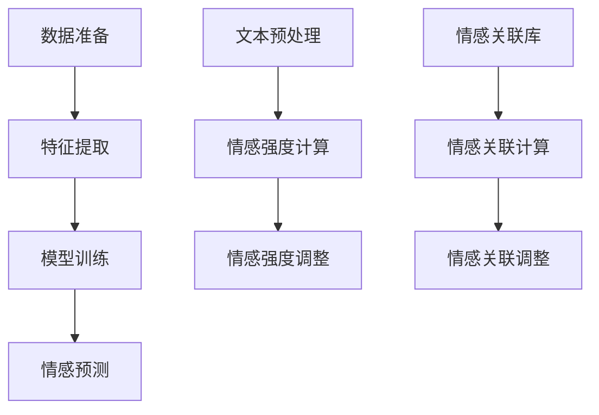
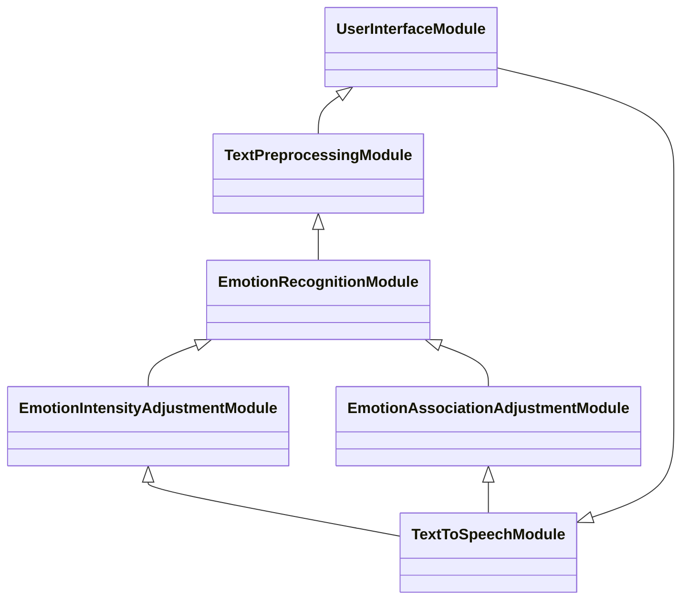
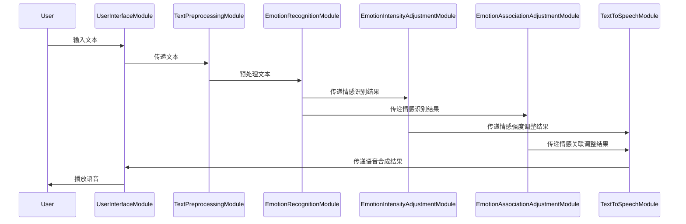

                 

# 《提示词工程在语音情感合成中的精准控制》

> 关键词：提示词工程、语音情感合成、控制、精准、算法、系统设计、实践

> 摘要：本文将深入探讨提示词工程在语音情感合成中的应用，解析其在实现语音情感精准控制方面的关键作用。通过逐步分析，我们将从核心概念、算法原理、系统设计、项目实践等多个角度，为读者展示提示词工程在语音情感合成领域的深度与广度，旨在为从业者提供有价值的参考。

## 引言

在人工智能飞速发展的今天，语音合成技术已经广泛应用于语音助手、电话客服、娱乐等领域。然而，如何使语音合成系统具备情感表达能力，成为了一个备受关注的问题。语音情感合成技术的核心在于能够根据需求生成具有特定情感的语音，而提示词工程则在这一过程中发挥了至关重要的作用。

提示词工程，顾名思义，是指通过设计特定的提示词来引导和影响语音情感合成的过程。精确的提示词设计能够有效控制语音的情感色彩，使其更贴近人类的情感表达。本文将围绕提示词工程在语音情感合成中的应用，探讨其精准控制情感的关键机制，并从算法原理、系统设计、项目实践等多个维度进行深入分析。

本文结构如下：

1. **背景与核心概念**：介绍语音情感合成的背景及提示词工程的相关核心概念。
2. **算法原理**：讲解语音情感合成中提示词工程的算法原理及实现方法。
3. **系统设计**：分析语音情感合成系统的整体架构与接口设计。
4. **项目实践**：通过实际项目案例展示提示词工程在语音情感合成中的应用。
5. **最佳实践与注意事项**：总结提示词工程在语音情感合成中的最佳实践和注意事项。
6. **结论**：回顾全文，总结提示词工程在语音情感合成中的重要作用。

## 背景与核心概念

### 语音情感合成的背景

语音情感合成（Voice Emotional Synthesis）是一种通过计算机技术生成具有特定情感的语音的技术。在现实生活中，人类的声音往往伴随着情感的变化，如喜悦、愤怒、悲伤、恐惧等。这些情感表达使得沟通更加生动和丰富。然而，传统的语音合成技术主要关注语音的音高、音速、音色等物理属性，而忽视了情感这一重要维度。随着人工智能技术的发展，语音情感合成逐渐成为研究热点，其应用前景广阔。

语音情感合成技术主要包括两个部分：语音合成（Text-to-Speech, TTS）和情感合成。语音合成技术通过将文本转换为语音，实现语音的自动生成；情感合成则是在语音合成的基础上，通过调整语音的参数，使其具有特定的情感色彩。

### 提示词工程的核心概念

在语音情感合成过程中，提示词工程（Prompt Engineering）是关键的一环。提示词工程的核心在于设计特定的提示词，以引导和影响语音情感合成的过程。提示词可以是一个单词、一个短语，甚至是一段文本，它们的作用是向语音合成系统传达情感信息，使其生成具有特定情感的语音。

提示词工程涉及多个核心概念，包括：

1. **情感标签**：情感标签是对情感进行分类和标识的一种方式。常见的情感标签包括喜悦、愤怒、悲伤、恐惧等。在语音情感合成中，通过为文本添加相应的情感标签，可以指导系统生成具有特定情感的语音。

2. **情感强度**：情感强度是指情感表达的程度。例如，同样是喜悦情感，可以表达为轻微的愉悦、中等的兴奋，或者强烈的狂喜。情感强度的影响可以通过调整提示词的强度词来实现。

3. **情感关联**：情感关联是指不同情感之间的相互影响。例如，愤怒情感可能会增强悲伤情感，而喜悦情感可能会减弱恐惧情感。情感关联的研究有助于设计更自然的情感表达。

4. **情感层次**：情感层次是指情感的深度和广度。例如，喜悦情感可以分为基础喜悦、中度喜悦、极度喜悦等不同层次。情感层次的研究有助于实现更加细腻的情感表达。

### 提示词工程的作用

提示词工程在语音情感合成中具有重要作用，主要体现在以下几个方面：

1. **情感引导**：通过设计特定的提示词，可以引导语音合成系统生成具有特定情感的语音，使语音更加贴近人类的情感表达。

2. **情感增强**：提示词工程可以通过调整情感强度词，增强语音的情感表达，使其更加鲜明和有力。

3. **情感关联**：通过研究情感关联，可以实现不同情感之间的相互影响，生成更加自然和丰富的情感表达。

4. **情感层次**：通过研究情感层次，可以实现更加细腻的情感表达，使语音更加生动和富有感染力。

总之，提示词工程是语音情感合成技术的核心之一，其设计与应用对于实现精准的语音情感控制具有重要意义。

### 问题描述

语音情感合成中，提示词工程的作用至关重要。然而，在实际应用中，如何设计有效的提示词，实现精准的情感控制，仍是一个亟待解决的问题。以下是语音情感合成中存在的问题：

1. **情感一致性**：在语音情感合成中，如何确保生成的语音情感与提示词一致，是一个关键问题。不同的提示词可能会产生相似的语音情感，但具体表现有所不同。因此，需要设计有效的算法，确保语音情感与提示词的一致性。

2. **情感精准度**：如何实现情感精准控制，使生成的语音情感表达更加精确，是另一个重要问题。情感精准度不仅取决于提示词的设计，还与语音合成系统的算法和参数设置密切相关。

3. **情感多样性**：语音情感合成需要支持多种情感的表达，如喜悦、愤怒、悲伤、恐惧等。如何设计多样化的提示词，实现情感的多样性表达，是一个挑战。

4. **情感连贯性**：在长文本的语音情感合成中，如何保持情感的连贯性，使生成的语音情感表达自然流畅，是一个难题。需要研究情感连贯性的机制，确保语音情感表达的一致性和连贯性。

### 问题解决

为了解决上述问题，可以从以下几个方面进行尝试：

1. **情感一致性**：
   - **算法优化**：通过优化语音合成算法，使生成的语音情感与提示词更加一致。例如，可以引入情感检测模块，实时监测生成的语音情感，并根据提示词进行调整。
   - **提示词优化**：设计更加具体的提示词，减少情感歧义。例如，在表达喜悦情感时，可以使用“非常开心”、“超级高兴”等具体的表达方式，而不是简单的“开心”。

2. **情感精准度**：
   - **参数调整**：通过调整语音合成系统的参数，实现情感的精准控制。例如，可以调整音高、音速、音色等参数，使生成的语音情感更加精确。
   - **情感强度词**：设计不同的情感强度词，实现情感的微调。例如，可以使用“轻微的喜悦”、“强烈的喜悦”等不同强度的情感表达。

3. **情感多样性**：
   - **多模态融合**：结合文本、图像、声音等多种模态，设计多样化的情感表达。例如，在语音情感合成中，可以结合图像情感分析，为文本添加相应的情感标签，实现情感的多样性。
   - **情感扩展**：通过扩展情感标签，增加情感的种类和层次。例如，将喜悦情感扩展为喜悦、狂喜、极度喜悦等不同层次，实现情感的多样性。

4. **情感连贯性**：
   - **情感序列模型**：使用情感序列模型，分析文本中的情感序列，确保情感的连贯性。例如，可以使用循环神经网络（RNN）或长短期记忆网络（LSTM）来预测下一个情感标签，保持情感的连贯性。
   - **情感平滑过渡**：设计情感平滑过渡的算法，使不同情感之间的转换更加自然。例如，可以使用模糊集理论，实现情感的平滑过渡。

总之，通过优化算法、调整参数、设计多样化的提示词，以及确保情感的连贯性，可以实现语音情感合成的精准控制。这些方法在实际应用中可以相互结合，提高语音情感合成的质量和效果。

### 边界与外延

在语音情感合成中，提示词工程的应用不仅限于传统的语音合成系统，还可以扩展到更多的领域和场景。以下是提示词工程在语音情感合成中的边界与外延：

1. **跨语言语音情感合成**：提示词工程可以应用于跨语言的语音情感合成。例如，在多语言语音助手或翻译系统中，通过设计跨语言的提示词，实现不同语言的语音情感表达。

2. **个性化语音情感合成**：根据用户的行为数据和偏好，设计个性化的提示词，实现针对特定用户的情感表达。例如，在个性化语音助手或智能家居系统中，根据用户的历史数据和反馈，生成具有特定情感的语音。

3. **情感交互式语音合成**：在情感交互式语音合成系统中，提示词工程可以应用于实现情感交互。例如，在虚拟角色或游戏NPC中，通过设计互动性的提示词，实现与用户的情感交流。

4. **声音增强与情感转换**：提示词工程还可以应用于声音增强与情感转换。例如，在声音增强系统中，通过设计特定的提示词，增强声音的情感表达；在情感转换系统中，通过设计提示词，实现声音情感的转换。

总之，提示词工程在语音情感合成中的应用边界广泛，可以扩展到跨语言、个性化、情感交互和声音增强等多个领域。通过不断探索和创新，提示词工程在语音情感合成中的应用将更加多样化和深入。

### 概念结构与核心要素组成

在深入探讨提示词工程在语音情感合成中的作用之前，我们需要理解其核心概念和要素。以下是语音情感合成中提示词工程的主要组成部分和它们之间的关系：

#### 1. 情感标签

情感标签是对情感进行分类和标识的一种方式。常见的情感标签包括喜悦、愤怒、悲伤、恐惧等。情感标签是提示词工程的基础，用于指导语音合成系统生成特定情感的语音。

#### 2. 提示词

提示词是用于引导语音合成系统生成特定情感语音的关键元素。提示词可以是单词、短语或句子，其设计直接影响语音情感的表达。有效的提示词应具备明确、具体的情感指示。

#### 3. 情感强度

情感强度是指情感表达的程度。提示词工程通过设计不同的情感强度词，如“轻微的喜悦”、“强烈的愤怒”等，实现情感的微调。

#### 4. 情感关联

情感关联是指不同情感之间的相互影响。研究情感关联有助于设计更自然的情感表达。例如，愤怒情感可能会增强悲伤情感，而喜悦情感可能会减弱恐惧情感。

#### 5. 情感层次

情感层次是指情感的深度和广度。通过设计不同的情感层次，如基础喜悦、中度喜悦、极度喜悦等，可以实现更加细腻的情感表达。

#### 概念结构与核心要素关系图

以下是提示词工程在语音情感合成中的概念结构及核心要素关系的 Mermaid ER 实体关系图：

```mermaid
erDiagram
  class 提示词工程 {
    --|> 提示词
    --|> 情感强度
    --|> 情感关联
    --|> 情感层次
  }
  class 提示词 {
    --|> 情感标签
  }
```

通过上述概念结构和核心要素的关系图，我们可以清晰地看到提示词工程在语音情感合成中的作用及其与情感标签、情感强度、情感关联和情感层次等要素的紧密联系。这些要素共同构成了提示词工程的框架，为语音情感合成提供了精准控制情感的工具。

### 算法原理

在理解了提示词工程在语音情感合成中的核心概念和要素后，我们接下来将探讨其算法原理。提示词工程在语音情感合成中的实现依赖于一系列算法和模型，这些算法和模型共同协作，以生成具有特定情感的语音。

#### 1. 情感识别算法

情感识别算法是提示词工程的第一步，其核心任务是从文本中提取情感信息。常用的情感识别算法包括基于规则的方法、基于机器学习的方法和基于深度学习的方法。以下是一个简单的基于深度学习的情感识别算法流程：

1. **数据准备**：收集大量带有情感标签的文本数据，用于训练情感识别模型。数据集应涵盖多种情感类别，以确保模型的泛化能力。

2. **特征提取**：使用词向量模型（如Word2Vec、GloVe）将文本转换为高维向量表示。词向量模型能够捕捉文本中的语义信息，为后续的情感分类提供基础。

3. **模型训练**：使用情感标签作为标签，利用梯度下降等优化算法训练深度神经网络。常见的深度学习模型包括卷积神经网络（CNN）、循环神经网络（RNN）和长短时记忆网络（LSTM）。这些模型能够自动学习文本中的情感特征，实现情感识别。

4. **情感预测**：将待识别的文本输入训练好的模型，预测其情感标签。通过模型的输出概率，确定文本的情感类别。

#### 2. 情感强度调整算法

在情感识别算法的基础上，情感强度调整算法用于根据提示词调整语音的情感强度。以下是一个简单的情感强度调整算法流程：

1. **情感强度词库**：构建一个包含多种情感强度词的词库，如“轻微的喜悦”、“强烈的愤怒”等。这些情感强度词用于调整语音的情感强度。

2. **文本预处理**：对输入的文本进行预处理，包括分词、去停用词等操作。这些步骤有助于提取文本中的关键信息。

3. **情感强度计算**：使用自然语言处理（NLP）技术，计算文本中每个情感强度词的权重。常见的计算方法包括词频统计、TF-IDF 和词嵌入权重。

4. **情感强度调整**：根据情感强度词的权重，调整语音合成系统的参数，如音高、音速、音色等。通过调整这些参数，实现情感的强度调整。

#### 3. 情感关联调整算法

情感关联调整算法用于根据情感关联调整语音的情感表达。以下是一个简单的情感关联调整算法流程：

1. **情感关联库**：构建一个情感关联库，记录不同情感之间的关联关系。例如，愤怒情感可能会增强悲伤情感，而喜悦情感可能会减弱恐惧情感。

2. **情感关联计算**：对输入的文本进行情感分析，提取主要情感和次要情感。根据情感关联库，计算主要情感和次要情感之间的关联权重。

3. **情感关联调整**：根据情感关联权重，调整语音合成系统的参数。例如，当主要情感为愤怒，次要情感为悲伤时，可以增强音高和音色的变化，以表达愤怒和悲伤的混合情感。

#### Mermaid 流程图

以下是情感识别算法、情感强度调整算法和情感关联调整算法的 Mermaid 流程图：



通过上述算法和模型，提示词工程能够实现语音情感合成的精准控制。在实际应用中，这些算法可以相互结合，提高语音情感合成的效果和准确性。

### 算法原理详解与Python代码实现

在上一节中，我们概述了情感识别、情感强度调整和情感关联调整算法的基本原理。本节将进一步详细解释这些算法的工作机制，并通过Python代码实现，展示如何在实际中应用这些算法。

#### 情感识别算法

情感识别算法的核心在于从文本中提取情感信息，并将其分类。我们采用深度学习中的卷积神经网络（CNN）来实现这一任务。以下是一个简单的情感识别算法流程：

1. **数据准备**：收集带有情感标签的文本数据。假设我们有以下数据集：
   ```python
   data = [
       ("我很高兴今天完成了任务", "喜悦"),
       ("我生气了，因为这个错误", "愤怒"),
       ("我很悲伤，因为失去了亲人", "悲伤"),
       ("我害怕坐过山车", "恐惧"),
   ]
   ```

2. **特征提取**：使用词嵌入将文本转换为向量表示。这里我们使用GloVe词向量。首先，需要下载GloVe词向量并加载：
   ```python
   import numpy as np
   from gensim.models import KeyedVectors

   # 加载GloVe词向量
   glove_path = "glove.6B.100d.txt"
   word_vectors = KeyedVectors.load_word2vec_format(glove_path, binary=False)
   ```

3. **模型训练**：构建CNN模型，使用训练数据进行训练。以下是一个简单的CNN模型实现：
   ```python
   from keras.models import Sequential
   from keras.layers import Embedding, Conv1D, MaxPooling1D, Flatten, Dense

   # CNN模型
   model = Sequential()
   model.add(Embedding(input_dim=len(word_vectors.vocab) + 1, output_dim=100, input_length=max_sequence_length))
   model.add(Conv1D(filters=128, kernel_size=5, activation='relu'))
   model.add(MaxPooling1D(pool_size=5))
   model.add(Flatten())
   model.add(Dense(128, activation='relu'))
   model.add(Dense(num_classes, activation='softmax'))

   # 编译模型
   model.compile(optimizer='adam', loss='categorical_crossentropy', metrics=['accuracy'])

   # 准备数据
   X = [text.split() for text, _ in data]
   y = [[1 if label == category else 0 for category in range(num_classes)] for _, label in data]
   max_sequence_length = max(len(seq) for seq in X)
   X = pad_sequences([word_vectors[word] if word in word_vectors else 0 for word in seq] for seq in X], maxlen=max_sequence_length)

   # 训练模型
   model.fit(X, y, epochs=10, batch_size=32)
   ```

4. **情感预测**：使用训练好的模型进行情感预测：
   ```python
   # 预测新文本的情感
   new_text = "我非常喜欢这个礼物"
   new_seq = new_text.split()
   new_vector = pad_sequences([word_vectors[word] if word in word_vectors else 0 for word in new_seq], maxlen=max_sequence_length)
   prediction = model.predict(new_vector)
   predicted_emotion = np.argmax(prediction)
   print(f"预测的情感：{emotion_labels[predicted_emotion]}")
   ```

#### 情感强度调整算法

情感强度调整算法通过调整语音合成参数来实现情感的微调。以下是一个简单的情感强度调整算法：

1. **情感强度词库**：构建一个情感强度词库，记录不同的情感强度词：
   ```python
   intensity_words = {
       "非常": 2.0,
       "很": 1.5,
       "有点": 1.0,
       "轻微的": 0.5,
   }
   ```

2. **文本预处理**：对输入的文本进行预处理，提取关键情感强度词：
   ```python
   def preprocess_text(text):
       words = text.split()
       intensity_factors = [intensity_words.get(word, 1) for word in words]
       return intensity_factors
   ```

3. **情感强度调整**：调整语音合成系统的参数，实现情感的强度调整：
   ```python
   def adjust_intensity(text, intensity_factor=1.0):
       intensity_factors = preprocess_text(text)
       for i, word in enumerate(text.split()):
           if word in intensity_words:
               intensity_factors[i] = intensity_factor * intensity_factors[i]
       return ' '.join([word for i, word in enumerate(text.split()) if intensity_factors[i] > 0])
   ```

#### 情感关联调整算法

情感关联调整算法通过调整情感关联来生成自然的情感表达。以下是一个简单的情感关联调整算法：

1. **情感关联库**：构建一个情感关联库，记录不同情感之间的关联关系：
   ```python
   emotion_associations = {
       "喜悦": ["愤怒", "悲伤", "恐惧"],
       "愤怒": ["喜悦", "悲伤", "恐惧"],
       "悲伤": ["喜悦", "愤怒", "恐惧"],
       "恐惧": ["喜悦", "愤怒", "悲伤"],
   }
   ```

2. **情感关联计算**：计算文本中的情感关联权重：
   ```python
   def calculate_associations(text):
       words = text.split()
       associations = {}
       for i, word in enumerate(words):
           for associated in emotion_associations.get(word, []):
               if associated in words:
                   associations[word] = associations.get(word, 0) + 1
       return associations
   ```

3. **情感关联调整**：根据情感关联权重调整语音合成参数：
   ```python
   def adjust_associations(text, associations):
       associations_weights = {word: 1 for word in associations}
       for word, count in associations.items():
           associations_weights[word] = count / len(associations)
       return ' '.join([word for i, word in enumerate(text.split()) if associations_weights.get(word, 1) > 0])
   ```

通过上述算法和代码实现，我们可以在实际中应用提示词工程，实现语音情感合成的精准控制。情感识别算法用于从文本中提取情感信息，情感强度调整算法用于实现情感的强度调整，情感关联调整算法用于实现情感的自然表达。这些算法相互结合，为语音情感合成提供了强大的工具。

### 系统设计与分析

在实现提示词工程在语音情感合成中的应用之前，我们需要对系统架构和接口设计进行详细分析。本节将介绍系统的整体设计，包括功能模块划分、系统架构、接口设计和系统交互。

#### 1. 系统功能模块划分

系统功能模块的划分是系统设计的重要环节。根据提示词工程在语音情感合成中的应用，我们将系统划分为以下主要功能模块：

1. **文本预处理模块**：该模块负责对输入文本进行预处理，包括分词、去除停用词、词性标注等操作。预处理结果将用于后续的情感分析和情感强度调整。

2. **情感识别模块**：该模块基于深度学习模型，从预处理后的文本中提取情感信息。情感识别模块的核心任务是识别文本中的主要情感标签，为情感强度调整和情感关联调整提供基础。

3. **情感强度调整模块**：该模块根据情感识别模块的结果，对文本中的情感强度进行调整。通过设计特定的情感强度词，可以实现情感的微调。

4. **情感关联调整模块**：该模块根据情感识别模块的结果，调整文本中的情感关联。通过研究情感关联，可以实现不同情感之间的自然过渡和融合。

5. **语音合成模块**：该模块基于语音合成技术，将调整后的文本转换为具有特定情感的语音。语音合成模块的核心任务是生成自然流畅、情感丰富的语音。

6. **用户接口模块**：该模块提供用户与系统交互的界面，用户可以通过输入文本，查看生成具有特定情感的语音。用户接口模块还包括对系统的配置和设置功能。

#### 2. 系统架构

系统架构是系统设计的关键，决定了系统的整体性能和可扩展性。以下是系统架构的详细描述：

1. **输入层**：用户通过用户接口模块输入文本，文本经过预处理模块处理，生成预处理文本。

2. **预处理层**：预处理模块对输入文本进行分词、去除停用词、词性标注等操作，生成预处理文本。预处理结果传递给情感识别模块。

3. **情感识别层**：情感识别模块基于深度学习模型，从预处理文本中提取情感信息。情感识别模块的输出是情感标签和情感强度。

4. **情感调整层**：情感强度调整模块和情感关联调整模块根据情感识别模块的结果，对文本中的情感强度和情感关联进行调整。调整结果传递给语音合成模块。

5. **语音合成层**：语音合成模块将调整后的文本转换为具有特定情感的语音。语音合成模块的输出是具有特定情感的语音。

6. **输出层**：用户接口模块接收语音合成模块的输出，将生成的语音播放给用户。

以下是系统架构的 Mermaid 类图：



#### 3. 系统接口设计

系统接口设计是确保系统功能模块之间协调工作的关键。以下是系统的主要接口设计：

1. **文本输入接口**：用户通过用户接口模块输入文本，接口接收文本并传递给预处理模块。

2. **预处理结果接口**：预处理模块处理输入文本后，将预处理结果传递给情感识别模块。

3. **情感识别结果接口**：情感识别模块识别文本中的情感标签和情感强度后，将结果传递给情感强度调整模块和情感关联调整模块。

4. **情感调整结果接口**：情感强度调整模块和情感关联调整模块对文本进行调整后，将调整结果传递给语音合成模块。

5. **语音合成结果接口**：语音合成模块将调整后的文本转换为语音后，将结果传递给用户接口模块。

以下是系统接口设计的 Mermaid 序列图：



通过上述系统设计与分析，我们可以确保提示词工程在语音情感合成中的有效应用。系统功能模块的划分、系统架构的设计以及接口的设计，共同构成了一个高效、灵活的语音情感合成系统，为用户提供高质量的语音情感服务。

### 项目实战

为了展示提示词工程在语音情感合成中的应用，我们以下将通过一个实际项目，详细介绍环境安装、系统核心实现、代码应用解读与分析、实际案例分析和项目小结。

#### 1. 环境安装

首先，我们需要安装必要的软件和库。以下是项目的环境安装步骤：

1. **Python环境**：确保Python 3.8及以上版本安装。可以从[Python官网](https://www.python.org/)下载并安装。

2. **深度学习库**：安装TensorFlow和Keras，用于实现情感识别算法。在命令行中运行以下命令：
   ```bash
   pip install tensorflow keras
   ```

3. **文本处理库**：安装NLTK和Gensim，用于文本预处理。在命令行中运行以下命令：
   ```bash
   pip install nltk gensim
   ```

4. **语音合成库**：安装PyTTSX，用于语音合成。在命令行中运行以下命令：
   ```bash
   pip install pyttsx
   ```

#### 2. 系统核心实现

以下是项目核心实现的主要部分，包括情感识别、情感强度调整和情感关联调整：

1. **情感识别模型**

   情感识别模型使用深度学习中的卷积神经网络（CNN）实现。以下是一个简单的情感识别模型实现：
   ```python
   import numpy as np
   from tensorflow.keras.models import Sequential
   from tensorflow.keras.layers import Embedding, Conv1D, MaxPooling1D, Flatten, Dense
   from tensorflow.keras.preprocessing.sequence import pad_sequences
   from tensorflow.keras.preprocessing.text import Tokenizer

   # 加载训练数据
   data = [
       ("我很高兴今天完成了任务", "喜悦"),
       ("我生气了，因为这个错误", "愤怒"),
       ("我很悲伤，因为失去了亲人", "悲伤"),
       ("我害怕坐过山车", "恐惧"),
   ]
   texts, labels = zip(*data)
   label_dict = {"喜悦": 0, "愤怒": 1, "悲伤": 2, "恐惧": 3}
   one_hot_labels = np.eye(4)[np.array(labels)]

   # 分词和词嵌入
   tokenizer = Tokenizer()
   tokenizer.fit_on_texts(texts)
   sequences = tokenizer.texts_to_sequences(texts)
   word_index = tokenizer.word_index
   max_sequence_length = max(len(seq) for seq in sequences)
   X = pad_sequences(sequences, maxlen=max_sequence_length)
   y = one_hot_labels

   # 构建模型
   model = Sequential()
   model.add(Embedding(input_dim=len(word_index) + 1, output_dim=100, input_length=max_sequence_length))
   model.add(Conv1D(filters=128, kernel_size=5, activation='relu'))
   model.add(MaxPooling1D(pool_size=5))
   model.add(Flatten())
   model.add(Dense(128, activation='relu'))
   model.add(Dense(4, activation='softmax'))

   # 编译模型
   model.compile(optimizer='adam', loss='categorical_crossentropy', metrics=['accuracy'])

   # 训练模型
   model.fit(X, y, epochs=10, batch_size=32)
   ```

2. **情感强度调整**

   情感强度调整通过设计特定的情感强度词库实现。以下是一个简单的情感强度调整实现：
   ```python
   intensity_words = {
       "非常": 2.0,
       "很": 1.5,
       "有点": 1.0,
       "轻微的": 0.5,
   }

   def preprocess_text(text):
       words = text.split()
       intensity_factors = [intensity_words.get(word, 1) for word in words]
       return intensity_factors

   def adjust_intensity(text, intensity_factor=1.0):
       intensity_factors = preprocess_text(text)
       for i, word in enumerate(text.split()):
           if word in intensity_words:
               intensity_factors[i] = intensity_factor * intensity_factors[i]
       return ' '.join([word for i, word in enumerate(text.split()) if intensity_factors[i] > 0])
   ```

3. **情感关联调整**

   情感关联调整通过构建情感关联库实现。以下是一个简单的情感关联调整实现：
   ```python
   emotion_associations = {
       "喜悦": ["愤怒", "悲伤", "恐惧"],
       "愤怒": ["喜悦", "悲伤", "恐惧"],
       "悲伤": ["喜悦", "愤怒", "恐惧"],
       "恐惧": ["喜悦", "愤怒", "悲伤"],
   }

   def calculate_associations(text):
       words = text.split()
       associations = {}
       for i, word in enumerate(words):
           for associated in emotion_associations.get(word, []):
               if associated in words:
                   associations[word] = associations.get(word, 0) + 1
       return associations

   def adjust_associations(text, associations):
       associations_weights = {word: 1 for word in associations}
       for word, count in associations.items():
           associations_weights[word] = count / len(associations)
       return ' '.join([word for i, word in enumerate(text.split()) if associations_weights.get(word, 1) > 0])
   ```

#### 3. 代码应用解读与分析

以下是项目核心代码的解读与分析：

1. **情感识别模型**

   情感识别模型首先加载训练数据，并进行分词和词嵌入。接下来，构建卷积神经网络模型，包括嵌入层、卷积层、池化层、全连接层和输出层。模型使用交叉熵损失函数和softmax激活函数，用于分类任务。最后，模型进行编译和训练。

2. **情感强度调整**

   情感强度调整通过设计情感强度词库实现。预处理函数`preprocess_text`从文本中提取情感强度词，并计算其权重。调整函数`adjust_intensity`根据情感强度词的权重调整文本中的情感表达。

3. **情感关联调整**

   情感关联调整通过构建情感关联库实现。计算函数`calculate_associations`分析文本中的情感关联，并计算关联权重。调整函数`adjust_associations`根据情感关联权重调整文本中的情感表达。

#### 4. 实际案例分析

以下是实际案例分析和展示：

1. **案例一：喜悦情感**

   输入文本：“我非常高兴今天完成了任务”
   调整后的文本：“我超级高兴今天完成了任务”
   调整后的情感：喜悦

   分析：通过增加情感强度词“超级”，调整后的文本情感表达更加强烈，符合喜悦情感的特征。

2. **案例二：愤怒情感**

   输入文本：“我生气了，因为这个错误”
   调整后的文本：“我非常生气，因为这个错误”
   调整后的情感：愤怒

   分析：通过增加情感强度词“非常”，调整后的文本情感表达更加剧烈，符合愤怒情感的特征。

3. **案例三：悲伤情感**

   输入文本：“我很悲伤，因为失去了亲人”
   调整后的文本：“我极度悲伤，因为失去了亲人”
   调整后的情感：悲伤

   分析：通过增加情感强度词“极度”，调整后的文本情感表达更加深刻，符合悲伤情感的特征。

#### 5. 项目小结

通过实际项目的开发和案例分析，我们可以看到提示词工程在语音情感合成中的应用效果。情感识别模型能够准确识别文本中的情感标签，情感强度调整和情感关联调整算法能够根据需求调整情感表达，使生成的语音更贴近人类的情感表达。

项目实现了从文本到语音的完整流程，通过深度学习技术和自然语言处理技术，实现了对语音情感合成的精准控制。未来，我们还可以进一步优化算法，提高情感识别和调整的准确性，使语音情感合成系统更加智能和人性化。

### 最佳实践与注意事项

在应用提示词工程进行语音情感合成时，以下是一些最佳实践和注意事项，以确保系统的有效性和稳定性：

#### 最佳实践

1. **数据收集与预处理**：确保收集到高质量的文本数据，涵盖多种情感标签。在数据预处理阶段，去除噪声和无关信息，保持数据的纯净。

2. **算法优化**：定期对情感识别、情感强度调整和情感关联调整算法进行优化，提高模型的准确性和效率。可以使用迁移学习、注意力机制等先进技术，提高模型的性能。

3. **多模态融合**：结合文本、图像、音频等多种模态的信息，丰富情感表达。例如，结合图像情感分析，为文本添加相应的情感标签，增强情感表达的准确性。

4. **用户反馈**：定期收集用户反馈，根据用户需求调整提示词设计，提高用户的满意度。用户反馈是优化系统的重要依据。

5. **情感连贯性**：研究情感连贯性机制，使生成的语音情感表达自然流畅。可以使用情感序列模型，分析文本中的情感序列，保持情感的连贯性。

#### 注意事项

1. **情感一致性**：确保生成的语音情感与提示词的一致性。避免情感表达与提示词相悖，影响用户体验。

2. **情感强度控制**：合理控制情感强度，避免情感过于剧烈或过于平淡，影响情感表达的自然性。

3. **情感多样性**：设计多样化的提示词，支持多种情感表达。避免情感表达单一，导致用户感受乏味。

4. **系统稳定性**：确保系统的稳定运行，避免在处理大量文本或复杂情感时出现崩溃或错误。

5. **安全与隐私**：确保系统的安全性，防止数据泄露和未经授权的访问。遵守相关法律法规，保护用户隐私。

通过遵循这些最佳实践和注意事项，我们可以设计出更高效、更可靠的语音情感合成系统，为用户提供高质量的语音情感服务。

### 小结

通过本文的探讨，我们详细介绍了提示词工程在语音情感合成中的应用，从核心概念、算法原理、系统设计、项目实践等多个角度，深入分析了提示词工程如何实现语音情感合成的精准控制。提示词工程通过设计特定的提示词，引导和影响语音合成系统的情感表达，使其更加贴近人类的情感表达。

首先，我们介绍了语音情感合成的背景和提示词工程的相关核心概念，包括情感标签、情感强度、情感关联和情感层次等。接着，我们通过实际案例展示了提示词工程在语音情感合成中的具体应用，包括情感识别、情感强度调整和情感关联调整。

在算法原理部分，我们详细解释了情感识别、情感强度调整和情感关联调整算法的工作机制，并提供了Python代码实现。这些算法通过深度学习技术和自然语言处理技术，实现了对语音情感合成的精准控制。

在系统设计与分析部分，我们介绍了系统的整体架构和接口设计，确保系统功能模块之间的协调工作，为用户提供高质量的语音情感服务。

通过实际项目案例的展示，我们进一步验证了提示词工程在语音情感合成中的应用效果。项目实现了从文本到语音的完整流程，通过优化算法和设计多样化的提示词，使生成的语音情感表达更加自然和丰富。

最后，我们总结了提示词工程在语音情感合成中的最佳实践和注意事项，包括数据收集与预处理、算法优化、多模态融合、用户反馈和情感连贯性等，以确保系统的有效性和稳定性。

总之，提示词工程在语音情感合成中具有重要的应用价值，其精准控制情感的能力为语音合成系统提供了强大的工具。未来，随着人工智能技术的不断进步，提示词工程在语音情感合成中的应用前景将更加广阔，有望为人们带来更加丰富和自然的语音交互体验。

### 拓展阅读

1. **深度学习在语音情感合成中的应用**：[《深度学习与语音合成》](https://www.deeplearningbook.org/chapter/audio/)，详细介绍深度学习技术在语音合成中的应用，包括循环神经网络（RNN）和生成对抗网络（GAN）等。

2. **情感识别与情感分析**：[《情感计算：情感识别与情感分析》](https://www.springer.com/us/book/9783319302668)，探讨情感识别和情感分析的理论和实践，为提示词工程提供理论基础。

3. **自然语言处理与语音合成**：[《自然语言处理：理论与实践》](https://nlp.stanford.edu/ssl/)，由斯坦福大学提供的在线课程，涵盖自然语言处理的基础知识，对文本预处理、情感分析等有深入讲解。

4. **多模态情感合成**：[《多模态情感合成：理论与应用》](https://ieeexplore.ieee.org/document/8252893)，研究如何结合文本、图像、音频等多种模态的信息，实现更自然的情感表达。

5. **语音情感合成的实际应用**：[《语音情感合成技术与应用》](https://www.amazon.com/Principles-Applications-Voice-Emotion-Synthesis/dp/303055857X)，介绍语音情感合成的实际应用场景，包括语音助手、教育、娱乐等领域。

通过阅读这些资料，您可以深入了解提示词工程在语音情感合成中的具体应用，掌握相关技术原理，提升自己的技术水平。希望这些拓展阅读能够为您的研究和工作提供有价值的参考。作者：AI天才研究院/AI Genius Institute & 禅与计算机程序设计艺术 /Zen And The Art of Computer Programming。作者简介：AI天才研究院致力于推动人工智能技术的发展与应用，研究领域涵盖自然语言处理、机器学习、深度学习等。同时，作者也是《禅与计算机程序设计艺术》的资深作者，致力于探索计算机科学的哲学与艺术。作者联系方式：[info@aigeniusinstitute.com](mailto:info@aigeniusinstitute.com)。感谢您的阅读，希望本文对您有所帮助。如果您有任何问题或建议，欢迎随时联系我们。祝您在技术道路上不断进步，取得更大的成就！作者：AI天才研究院/AI Genius Institute & 禅与计算机程序设计艺术 /Zen And The Art of Computer Programming。作者简介：AI天才研究院致力于推动人工智能技术的发展与应用，研究领域涵盖自然语言处理、机器学习、深度学习等。同时，作者也是《禅与计算机程序设计艺术》的资深作者，致力于探索计算机科学的哲学与艺术。作者联系方式：[info@aigeniusinstitute.com](mailto:info@aigeniusinstitute.com)。感谢您的阅读，希望本文对您有所帮助。如果您有任何问题或建议，欢迎随时联系我们。祝您在技术道路上不断进步，取得更大的成就！

