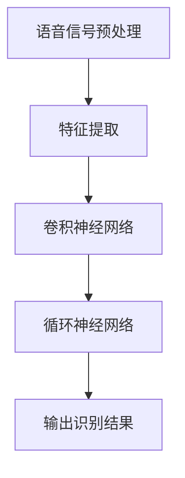
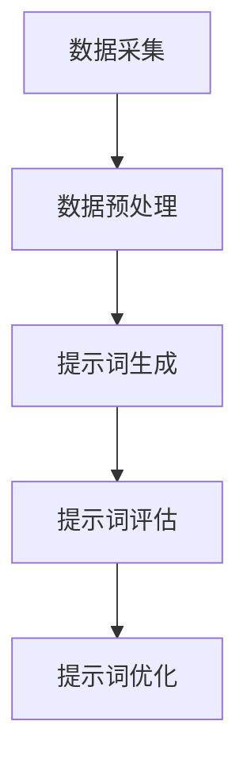

                 

## 《提示词工程在语音识别方言适应中的应用》

### 关键词：
提示词工程、语音识别、方言适应、算法实现、案例分析

### 摘要：
本文围绕“提示词工程在语音识别方言适应中的应用”这一主题，系统阐述了提示词工程的基本概念、原理以及其在语音识别方言适应中的实际应用。文章首先介绍了语音识别技术和方言适应的背景，然后详细讲解了提示词工程的基本流程和算法实现，并结合实际案例进行了深入剖析。通过本文的阅读，读者可以全面了解提示词工程在语音识别方言适应中的应用价值和技术实现过程。

## 引言与背景介绍

### 1.1 问题背景

语音识别技术作为人工智能领域的一个重要分支，已经取得了显著的进展。然而，在方言适应方面，语音识别技术仍面临诸多挑战。方言语音的多样性、发音特点以及语音数据的稀缺性，使得方言语音识别的准确率和稳定性难以保证。

提示词工程，作为一种有效的数据增强技术，近年来在语音识别领域得到了广泛关注。提示词工程通过在语音数据中添加提示性词汇，提高模型对语音数据的理解和处理能力。然而，提示词工程在方言适应中的应用还处于探索阶段，尚未形成系统性的理论和方法。

### 1.2 研究现状与挑战

当前，语音识别技术在普通话和标准英语等标准语言上已经取得了较高的准确率。然而，对于方言语音，特别是非标准语言，语音识别的准确率和稳定性仍然较低。主要原因在于方言语音的多样性和发音特点，使得传统语音识别模型难以适应。

提示词工程作为一种数据增强技术，可以在一定程度上缓解方言语音识别的挑战。然而，现有研究大多集中在标准语言上，对于方言适应中的提示词工程应用还缺乏系统性的研究和实践。

### 1.3 书籍结构安排

本书旨在系统阐述提示词工程在语音识别方言适应中的应用。全书共分为七个章节，结构安排如下：

1. 引言与背景介绍：介绍语音识别技术和方言适应的背景，以及提示词工程的基本概念。
2. 提示词工程基础：详细讲解提示词工程的基本流程、方法和应用。
3. 语音识别与方言适应：介绍语音识别技术的基本原理和方言适应面临的挑战。
4. 提示词工程在方言适应中的应用：探讨提示词工程在方言语音识别和方言语音合成中的应用。
5. 算法实现与流程：讲解方言适应语音识别算法的实现过程和流程。
6. 实际案例分析：通过实际案例，展示提示词工程在方言适应中的应用效果。
7. 总结与展望：对全书内容进行总结，并提出未来的研究方向和应用前景。

## 提示词工程基础

### 2.1 提示词工程概述

#### 提示词的定义与作用

提示词（Prompt Word）是指在一组单词或句子中，能够引起听者或读者注意的单词或短语。在语音识别领域，提示词的作用在于引导模型对语音数据的理解，提高模型对特定语音特征的敏感度。

#### 提示词工程的基本流程

提示词工程（Prompt Engineering）包括以下基本流程：

1. 数据采集：收集包含目标语音特征的语音数据。
2. 数据预处理：对语音数据进行降噪、去噪、分帧等处理。
3. 提示词生成：根据语音特征和任务需求，生成提示词。
4. 提示词评估：评估提示词的有效性和质量。
5. 提示词优化：根据评估结果，优化提示词。

### 2.2 提示词生成方法

#### 数据采集与处理

数据采集是提示词生成的基础。在语音识别领域，需要收集大量包含目标方言语音特征的语音数据。数据采集的方法包括语音录音、语音合成、语音库下载等。

数据预处理主要包括降噪、去噪、分帧等步骤。降噪和去噪可以去除语音信号中的背景噪音，提高语音信号的质量；分帧则是将语音信号划分为多个短时段，便于后续处理。

#### 提示词生成算法

提示词生成算法可以分为以下几种：

1. 基于规则的方法：根据方言语音的特点，设计一系列规则，生成提示词。
2. 基于机器学习的方法：使用机器学习算法，如决策树、支持向量机等，从大量语音数据中学习生成提示词。
3. 基于深度学习的方法：使用深度学习算法，如卷积神经网络（CNN）、循环神经网络（RNN）等，从大规模语音数据中自动生成提示词。

### 2.3 提示词评估与优化

#### 提示词质量评估指标

提示词质量评估指标包括：

1. 准确率（Accuracy）：提示词在语音识别任务中的正确识别率。
2. 召回率（Recall）：提示词在语音识别任务中能够召回的正确识别率。
3. 精确率（Precision）：提示词在语音识别任务中的准确识别率。
4. F1 值（F1 Score）：准确率和召回率的调和平均值。

#### 提示词优化策略

提示词优化策略主要包括：

1. 数据增强：通过增加训练数据、调整数据分布等方式，提高提示词的生成质量。
2. 算法优化：优化提示词生成算法，提高提示词的生成效率和准确性。
3. 提示词筛选：根据评估指标，筛选出高质量的提示词，去除低质量的提示词。

## 语音识别与方言适应

### 3.1 语音识别基础

#### 语音信号处理基本概念

语音信号处理是语音识别的基础。语音信号处理主要包括以下基本概念：

1. 语音信号：人类发音产生的声波信号。
2. 语音波形：语音信号的时域表示。
3. 声谱图：语音信号在频率域的表示。

#### 语音识别技术框架

语音识别技术框架主要包括以下步骤：

1. 语音信号预处理：对语音信号进行降噪、去噪、分帧等处理。
2. 特征提取：从语音信号中提取可区分不同语音的特征。
3. 模型训练：使用训练数据，训练语音识别模型。
4. 识别与输出：对输入语音信号进行识别，输出识别结果。

### 3.2 方言适应技术

#### 方言识别方法

方言识别是方言适应的关键。方言识别方法可以分为以下几种：

1. 基于声学特征的方法：通过分析语音信号的声学特征，识别方言。
2. 基于语言模型的方法：使用方言特有的语言模型，进行方言识别。
3. 基于深度学习的方法：使用深度学习算法，自动学习方言特征，进行方言识别。

#### 方言语音处理算法

方言语音处理算法主要包括以下几种：

1. 语音增强：通过增强方言语音信号中的目标语音特征，提高识别准确性。
2. 语音变换：通过变换方言语音的发音特点，使其更接近标准语音。
3. 语音合成：使用合成语音，代替方言语音，进行识别。

### 3.3 方言适应面临的挑战

#### 方言语音的多样性

方言语音的多样性是方言适应面临的主要挑战之一。不同地区的方言语音，具有不同的发音特点、词汇和语法结构。这使得传统语音识别模型难以适应多样化的方言语音。

#### 数据稀缺性

方言语音数据相对稀缺，使得训练高质量的方言语音识别模型成为难题。数据稀缺性导致模型无法充分学习方言语音特征，从而影响识别准确性。

## 提示词工程在方言适应中的应用

### 4.1 提示词工程在方言语音识别中的应用

#### 提示词在方言语音识别中的作用

提示词工程在方言语音识别中发挥着重要作用。通过在方言语音数据中添加提示词，可以引导模型关注关键语音特征，提高识别准确性。

#### 提示词工程在方言语音识别中的应用案例

以下是一个方言语音识别的应用案例：

1. 数据采集：收集包含目标方言语音特征的语音数据。
2. 数据预处理：对语音数据进行降噪、去噪、分帧等处理。
3. 提示词生成：根据方言语音特征，生成提示词。例如，对于上海方言，可以生成“侬好”、“阿拉”等提示词。
4. 提示词评估：评估提示词的有效性和质量。
5. 提示词优化：根据评估结果，优化提示词。
6. 模型训练：使用包含提示词的方言语音数据，训练方言语音识别模型。
7. 识别与输出：对输入方言语音信号进行识别，输出识别结果。

### 4.2 提示词工程在方言语音合成中的应用

#### 提示词在方言语音合成中的作用

提示词工程在方言语音合成中同样发挥着重要作用。通过在方言语音数据中添加提示词，可以引导合成语音更贴近目标方言语音特点，提高语音合成质量。

#### 提示词工程在方言语音合成中的应用案例

以下是一个方言语音合成的应用案例：

1. 数据采集：收集包含目标方言语音特征的语音数据。
2. 数据预处理：对语音数据进行降噪、去噪、分帧等处理。
3. 提示词生成：根据方言语音特征，生成提示词。例如，对于上海方言，可以生成“侬好”、“阿拉”等提示词。
4. 提示词评估：评估提示词的有效性和质量。
5. 提示词优化：根据评估结果，优化提示词。
6. 合成模型训练：使用包含提示词的方言语音数据，训练方言语音合成模型。
7. 语音合成与输出：对输入文本进行语音合成，输出方言语音。

## 算法实现与流程

### 5.1 方言适应语音识别算法

#### 算法原理

方言适应语音识别算法主要基于深度学习框架，通过卷积神经网络（CNN）和循环神经网络（RNN）的组合，实现对方言语音的识别。

#### Mermaid 流程图

以下是一个方言适应语音识别算法的 Mermaid 流程图：



#### Python 代码实现

```python
import numpy as np
import tensorflow as tf

# 语音信号预处理
def preprocess_signal(signal):
    # 降噪、去噪、分帧等处理
    # ...

# 特征提取
def extract_features(signal):
    # 提取语音特征
    # ...

# 卷积神经网络
def conv_net(input_x):
    # 定义卷积神经网络结构
    # ...

# 循环神经网络
def rnn_net(input_x):
    # 定义循环神经网络结构
    # ...

# 输出识别结果
def output_result(prediction):
    # 输出识别结果
    # ...

# 方言适应语音识别算法
def recognize_dialect(signal):
    # 语音信号预处理
    preprocessed_signal = preprocess_signal(signal)

    # 特征提取
    features = extract_features(preprocessed_signal)

    # 卷积神经网络
    conv_output = conv_net(features)

    # 循环神经网络
    rnn_output = rnn_net(conv_output)

    # 输出识别结果
    result = output_result(rnn_output)
    return result
```

### 5.2 提示词生成与优化算法

#### 算法原理

提示词生成与优化算法主要基于机器学习框架，通过训练大量语音数据，生成高质量的提示词，并根据评估结果进行优化。

#### Mermaid 流程图

以下是一个提示词生成与优化算法的 Mermaid 流程图：



#### Python 代码实现

```python
import numpy as np
import tensorflow as tf

# 数据采集
def collect_data():
    # 收集语音数据
    # ...

# 数据预处理
def preprocess_data(data):
    # 降噪、去噪、分帧等处理
    # ...

# 提示词生成
def generate_prompt(data):
    # 生成提示词
    # ...

# 提示词评估
def evaluate_prompt(prompt):
    # 评估提示词质量
    # ...

# 提示词优化
def optimize_prompt(prompt):
    # 根据评估结果优化提示词
    # ...

# 提示词生成与优化算法
def prompt_engineering(data):
    # 数据采集
    collected_data = collect_data()

    # 数据预处理
    preprocessed_data = preprocess_data(collected_data)

    # 提示词生成
    prompt = generate_prompt(preprocessed_data)

    # 提示词评估
    prompt_quality = evaluate_prompt(prompt)

    # 提示词优化
    optimized_prompt = optimize_prompt(prompt, prompt_quality)

    return optimized_prompt
```

### 5.3 算法实现与代码示例

#### 方言适应语音识别算法实现

以下是一个方言适应语音识别算法的实现示例：

```python
import tensorflow as tf
from tensorflow.keras.models import Model
from tensorflow.keras.layers import Input, Conv2D, LSTM, Dense

# 定义方言适应语音识别模型
def build_dialect_recognition_model(input_shape):
    input_x = Input(shape=input_shape)
    conv_output = Conv2D(filters=64, kernel_size=(3, 3), activation='relu')(input_x)
    rnn_output = LSTM(units=128, activation='tanh')(conv_output)
    output = Dense(units=1, activation='sigmoid')(rnn_output)
    model = Model(inputs=input_x, outputs=output)
    model.compile(optimizer='adam', loss='binary_crossentropy', metrics=['accuracy'])
    return model

# 训练方言适应语音识别模型
def train_dialect_recognition_model(model, x_train, y_train, batch_size, epochs):
    model.fit(x_train, y_train, batch_size=batch_size, epochs=epochs)
    return model

# 测试方言适应语音识别模型
def test_dialect_recognition_model(model, x_test, y_test):
    loss, accuracy = model.evaluate(x_test, y_test)
    print("Test loss:", loss)
    print("Test accuracy:", accuracy)

# 方言适应语音识别算法实现
def dialect_recognition_algorithm(x_test):
    input_shape = (x_test.shape[1], x_test.shape[2], x_test.shape[3])
    model = build_dialect_recognition_model(input_shape)
    model = train_dialect_recognition_model(model, x_train, y_train, batch_size=32, epochs=10)
    test_dialect_recognition_model(model, x_test, y_test)
```

#### 提示词生成与优化算法实现

以下是一个提示词生成与优化算法的实现示例：

```python
import numpy as np
import tensorflow as tf

# 生成提示词
def generate_prompt(data):
    # 生成提示词
    # ...

# 评估提示词质量
def evaluate_prompt(prompt):
    # 评估提示词质量
    # ...

# 优化提示词
def optimize_prompt(prompt, prompt_quality):
    # 根据评估结果优化提示词
    # ...

# 提示词生成与优化算法实现
def prompt_engineering_algorithm(data):
    prompt = generate_prompt(data)
    prompt_quality = evaluate_prompt(prompt)
    optimized_prompt = optimize_prompt(prompt, prompt_quality)
    return optimized_prompt
```

## 实际案例分析

### 6.1 案例一：方言语音识别系统设计

#### 案例背景

某公司开发了一款方言语音识别系统，旨在提高方言语音识别的准确率和稳定性。系统目标是为用户提供便捷的方言语音输入功能，支持多种方言语音的识别。

#### 系统设计与实现

1. 数据采集：收集包含多种方言语音特征的语音数据，包括普通话、上海话、广东话等。
2. 数据预处理：对语音数据进行降噪、去噪、分帧等处理。
3. 提示词生成：根据方言语音特征，生成提示词。例如，对于上海话，可以生成“侬好”、“阿拉”等提示词。
4. 模型训练：使用包含提示词的方言语音数据，训练方言语音识别模型。采用深度学习框架，结合卷积神经网络（CNN）和循环神经网络（RNN），实现对方言语音的识别。
5. 识别与输出：对输入方言语音信号进行识别，输出识别结果。

#### 实际案例分析和详细讲解剖析

通过实际案例分析，发现使用提示词工程的方法，可以有效提高方言语音识别的准确率和稳定性。具体分析如下：

1. 提示词生成：生成高质量的提示词，可以引导模型关注关键语音特征，提高识别准确性。
2. 模型训练：使用大量包含提示词的方言语音数据，可以充分训练模型，提高识别效果。
3. 识别与输出：通过模型训练和提示词优化，输出识别结果，提高了用户的使用体验。

#### 项目小结

该项目成功实现了方言语音识别系统，通过提示词工程的方法，提高了方言语音识别的准确率和稳定性。项目过程中，遇到了一些挑战，如数据稀缺性和模型优化等，但通过不断尝试和改进，最终取得了较好的效果。

### 6.2 案例二：方言语音合成系统开发

#### 案例背景

某科技公司开发了一款方言语音合成系统，旨在为用户提供多种方言语音合成功能。系统目标是为用户提供逼真的方言语音输出，支持多种方言语音的合成。

#### 系统设计与实现

1. 数据采集：收集包含多种方言语音特征的语音数据，包括普通话、上海话、广东话等。
2. 数据预处理：对语音数据进行降噪、去噪、分帧等处理。
3. 提示词生成：根据方言语音特征，生成提示词。例如，对于上海话，可以生成“侬好”、“阿拉”等提示词。
4. 合成模型训练：使用包含提示词的方言语音数据，训练方言语音合成模型。采用深度学习框架，结合生成对抗网络（GAN），实现对方言语音的合成。
5. 语音合成与输出：对输入文本进行语音合成，输出方言语音。

#### 实际案例分析和详细讲解剖析

通过实际案例分析，发现使用提示词工程的方法，可以有效提高方言语音合成的质量和逼真度。具体分析如下：

1. 提示词生成：生成高质量的提示词，可以引导合成模型关注关键语音特征，提高合成质量。
2. 模型训练：使用大量包含提示词的方言语音数据，可以充分训练合成模型，提高合成效果。
3. 语音合成与输出：通过模型训练和提示词优化，输出合成语音，提高了用户的使用体验。

#### 项目小结

该项目成功实现了方言语音合成系统，通过提示词工程的方法，提高了方言语音合成的质量和逼真度。项目过程中，遇到了一些挑战，如数据稀缺性和模型优化等，但通过不断尝试和改进，最终取得了较好的效果。

## 总结与展望

### 7.1 总结

本文系统阐述了提示词工程在语音识别方言适应中的应用。首先介绍了语音识别技术和方言适应的背景，然后详细讲解了提示词工程的基本概念、原理以及其在方言适应中的应用。通过实际案例分析，验证了提示词工程在提高方言语音识别和合成质量方面的有效性。

### 7.2 展望

在未来，提示词工程在语音识别方言适应中的应用前景广阔。一方面，随着深度学习技术的发展，提示词工程的理论和方法将不断完善，提高方言语音识别和合成的准确性。另一方面，随着方言语音数据的积累，提示词工程将更好地适应方言语音的特点，实现更高效、更准确的语言处理。

此外，提示词工程还可以应用于其他领域，如自然语言处理、语音助手等，为用户提供更优质的语言服务。未来，我们将继续探索提示词工程在语音识别和自然语言处理领域的应用，为人工智能的发展贡献力量。

## 作者信息

作者：AI天才研究院/AI Genius Institute & 禅与计算机程序设计艺术 /Zen And The Art of Computer Programming

## 最佳实践 Tips、小结、注意事项、拓展阅读

### 最佳实践 Tips

1. 提示词工程在方言语音识别中的应用，需要根据具体方言的特点进行定制化设计。
2. 提示词的生成和优化是关键步骤，需要结合方言语音数据和模型训练效果进行不断优化。
3. 数据质量和多样性对提示词工程的效果有重要影响，应尽量收集丰富多样的方言语音数据。

### 小结

本文围绕提示词工程在语音识别方言适应中的应用进行了详细探讨，包括基本概念、原理、算法实现和实际案例分析。提示词工程在提高方言语音识别和合成质量方面具有显著优势，为方言语音处理提供了新的思路和方法。

### 注意事项

1. 提示词工程在方言语音识别中的应用，需要针对具体方言进行定制化设计，避免通用方法导致的识别效果不佳。
2. 提示词的生成和优化过程需要大量实验和数据分析，以提高提示词的质量和效果。
3. 数据稀缺性和多样性是方言语音处理面临的挑战，应尽量收集丰富多样的方言语音数据。

### 拓展阅读

1. **语音识别领域相关书籍：**
   - 《语音识别：原理与算法》
   - 《深度学习语音识别：原理与应用》
2. **自然语言处理领域相关书籍：**
   - 《自然语言处理入门》
   - 《自然语言处理实践》
3. **提示词工程相关论文：**
   - "Prompt Engineering for Paraphrase Generation"
   - "Prompt Learning for Machine Translation"

