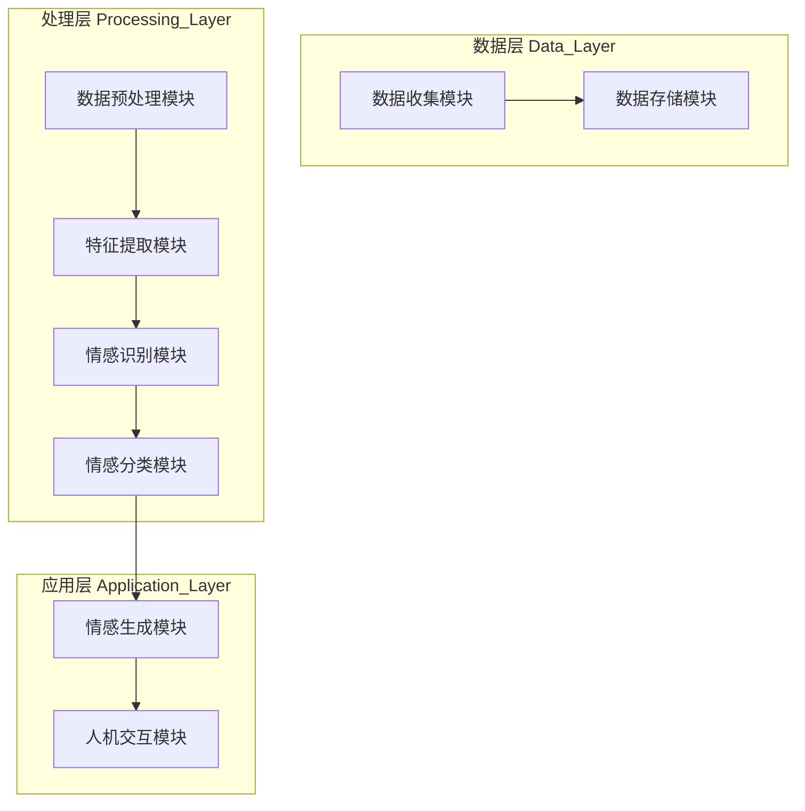

                 

### 引言背景

#### 问题背景

在当今全球化的背景下，信息技术和人工智能的发展日新月异，跨文化情感计算成为了一个重要的研究领域。随着人工智能系统在情感识别、情感表达和情感沟通方面的应用日益广泛，如何保证这些系统在不同文化背景下依然能够准确、恰当地处理情感信息，成为了学术界和工业界共同关注的问题。

跨文化情感计算涉及多个领域，包括自然语言处理、计算机视觉、心理学和跨文化交流学等。其核心目标是通过智能系统对用户情感的理解和反馈，提高人机交互的效率和体验。然而，不同文化背景下情感表达的方式、情感词汇的含义和使用习惯等方面存在显著差异，这使得跨文化情感计算面临着巨大的挑战。

提示词工程，作为人工智能领域的一个重要分支，其目的是通过设计、生成和优化提示词（prompt）来指导模型的训练和预测过程。提示词在情感计算中起到关键作用，它们不仅影响模型对情感信息的捕捉和处理，还直接关系到系统的鲁棒性和泛化能力。

伦理考量在跨文化情感计算中的重要性不可忽视。在开发和使用跨文化情感计算系统时，必须考虑到文化差异、隐私保护、数据安全、算法偏见和公平性等问题。缺乏伦理考量可能导致系统输出不准确、甚至引发社会冲突和误解。因此，如何在设计、开发和应用跨文化情感计算系统时融入伦理考量，成为当前研究的一个重要方向。

#### 核心概念与关系

为了更好地理解跨文化情感计算和提示词工程的相互作用，我们首先需要明确一些核心概念，并探讨它们之间的联系。

**1. 跨文化情感计算**

- **情感识别与分类**：通过分析用户的行为、语言、语音、面部表情等信息，识别和分类用户情感。
- **情感表达与沟通**：根据用户的情感状态，生成合适的情感表达和反馈，以实现有效沟通。
- **跨文化情感差异**：研究不同文化背景下情感表达和认知的差异，为情感计算系统提供跨文化适应性。

**2. 提示词工程**

- **提示词的设计与生成**：设计并生成能够引导模型正确理解和处理情感信息的提示词。
- **提示词的效果评估**：通过实验和评估方法，检验提示词对模型性能的影响。
- **提示词的优化策略**：根据评估结果，不断优化提示词的设计和生成过程。

**3. 伦理考量**

- **文化敏感性**：在跨文化情感计算系统中，考虑到文化差异，确保系统输出不冒犯或误解用户情感。
- **隐私保护**：保护用户数据的安全和隐私，避免数据泄露或滥用。
- **算法偏见与公平性**：防止系统因算法偏见导致不公平或不准确的情感判断。

通过Mermaid ER图，我们可以直观地展示这些概念之间的关系：

```mermaid
erDiagram
  A||(跨文化情感计算) ||--o{ B||(情感识别与分类) }
  A ||--o{ C||(情感表达与沟通) }
  A ||--o{ D||(跨文化情感差异) }
  B ||--o{ E||(提示词工程) }
  C ||--o{ E }
  D ||--o{ E }
  E ||--o{ F||(文化敏感性) }
  E ||--o{ G||(隐私保护) }
  E ||--o{ H||(算法偏见与公平性) }
```

通过上述核心概念和关系的梳理，我们为后续章节的详细讨论奠定了基础。

#### 目标受众

本书的目标受众主要包括以下几类：

1. **计算机科学和人工智能领域的研究人员**：旨在为他们提供跨文化情感计算和提示词工程的深入理解和研究方法，帮助其开展相关领域的学术研究。
2. **软件开发工程师和技术顾问**：帮助其在实际项目中应用跨文化情感计算和提示词工程的理论和实践，提升系统性能和用户体验。
3. **人文社会科学研究者**：为跨文化交流学和心理学研究者提供技术视角，探讨文化差异对情感计算的影响。
4. **企业决策者**：帮助其了解跨文化情感计算和提示词工程的重要性，指导企业研发和商业战略。

通过本书，我们希望能够促进跨学科交流，推动跨文化情感计算领域的发展，同时为实际应用提供切实可行的解决方案。

#### 书的重要性

本书《提示词工程在跨文化情感计算中的伦理考量》具有重要的研究价值和实际应用意义。首先，它填补了跨文化情感计算与提示词工程相结合的学术空白，为研究者提供了系统、全面的理论框架和实践指南。通过深入探讨跨文化情感计算中的伦理问题，本书有助于提高系统的文化敏感性和伦理素养，减少因算法偏见和文化误解导致的社会冲突。

其次，本书结合了计算机科学、心理学和跨文化交流学的多学科知识，提供了跨文化情感计算和提示词工程的综合解决方案。这不仅有助于提升人工智能系统的性能和用户体验，也为企业在全球化背景下开展情感计算应用提供了指导。

此外，本书的出版将促进学术界和工业界在跨文化情感计算领域的交流与合作，推动相关技术的创新和发展，具有重要的社会和经济效益。

### 第1章：问题背景与核心概念

#### 1.1 跨文化情感计算概述

跨文化情感计算是一个涉及多个学科领域的研究课题，其核心目标是理解、识别和表达不同文化背景下的情感信息。随着全球化和信息技术的发展，跨文化情感计算在许多领域，如人机交互、智能客服、教育、健康护理等，都发挥着越来越重要的作用。

**重要性**

跨文化情感计算的重要性主要体现在以下几个方面：

1. **提升人机交互体验**：通过准确识别用户的情感状态，智能系统能够提供更加个性化和人性化的交互服务，从而提高用户的满意度和体验。
2. **促进跨文化交流**：跨文化情感计算有助于消除文化差异带来的误解和冲突，促进不同文化之间的沟通和理解。
3. **优化情感医疗服务**：在心理健康和疾病管理方面，跨文化情感计算可以帮助医生更好地理解患者的情感状态，提供更有针对性的治疗方案。
4. **增强教育效果**：在教育领域，通过分析学生的情感反应，教师可以调整教学方法，提高学生的学习效果和参与度。

**定义与挑战**

跨文化情感计算的**定义**是指通过人工智能技术，对多文化背景下的情感信息进行识别、理解和处理。它不仅涉及情感识别和分类，还包括情感表达和情感沟通的多样性。

然而，跨文化情感计算面临着诸多**挑战**：

1. **文化差异**：不同文化背景下的情感表达方式和词汇使用习惯存在显著差异，这给情感识别和表达带来了困难。
2. **语言障碍**：不同语言的情感词汇和表达方式不同，翻译不准确可能导致情感识别的错误。
3. **数据质量**：跨文化情感计算需要大量的高质量数据集，但由于隐私保护和数据获取难度，高质量数据的获取成为一个挑战。
4. **算法偏见**：在训练过程中，算法可能受到训练数据偏见的影响，导致对某些文化背景的情感识别不准确。

**应用场景**

跨文化情感计算在多个应用场景中具有重要应用：

1. **智能客服**：通过分析客户情绪，智能客服系统能够提供更加人性化和有效的服务。
2. **情感分析**：在社交媒体、新闻评论等场景中，跨文化情感计算可以识别公众情绪，为舆情分析提供支持。
3. **人机对话系统**：通过理解用户的情感状态，人机对话系统能够生成更加自然和贴心的对话。
4. **心理健康监测**：通过分析用户的情感状态，心理健康监测系统可以为用户提供个性化的心理健康建议。

#### 1.2 提示词工程的概念与作用

**提示词工程的定义**

提示词工程是指设计、生成和优化用于指导模型训练和预测的提示词（prompt）的一门技术。提示词是一种特殊的文本或指令，它能够引导模型对特定任务进行学习或预测。

**核心作用**

提示词工程在跨文化情感计算中具有以下几个核心作用：

1. **提高模型性能**：通过设计合适的提示词，可以引导模型更好地理解和捕捉情感信息，从而提高模型在情感识别和分类任务中的性能。
2. **增强鲁棒性**：提示词可以帮助模型适应不同的情感表达方式和语言习惯，提高模型的鲁棒性和泛化能力。
3. **降低数据需求**：提示词可以补充和丰富训练数据，降低对大量高质量数据集的依赖，从而在数据稀缺的场景下仍然能够训练出有效的模型。
4. **优化用户体验**：提示词可以指导模型生成更加自然和人性化的情感表达，提高人机交互的体验。

**在情感计算中的应用**

在情感计算中，提示词的应用主要包括以下几个方面：

1. **训练数据增强**：通过设计多样化的提示词，可以生成更多的训练样例，增强模型的泛化能力。
2. **情感识别**：提示词可以帮助模型更好地理解不同文化背景下的情感表达，提高情感识别的准确性。
3. **情感生成**：提示词可以引导模型生成符合特定情感要求的文本或语音，用于人机对话系统或情感表达应用。
4. **情感分析**：通过分析模型对提示词的响应，可以评估模型在情感理解方面的性能和效果。

**案例研究**

一个典型的案例研究是应用于社交媒体情感分析的系统。通过设计针对不同文化背景和情感类型的提示词，系统可以更准确地识别和分类用户情感。例如，对于中文用户，提示词可能包括“很高兴”、“很伤心”等；而对于英文用户，提示词可能包括“happy”、“sad”等。通过这些提示词的引导，模型可以更好地理解和处理不同语言和情感表达方式，从而提高情感分析的准确性和可靠性。

总之，提示词工程在跨文化情感计算中发挥着重要作用，它不仅提高了模型性能，还增强了系统的鲁棒性和用户体验。通过深入研究提示词工程的方法和应用，我们可以进一步推动跨文化情感计算的发展。

#### 1.3 伦理考量在跨文化情感计算中的重要性

**伦理考量的概念与内涵**

伦理考量是指在设计、开发和应用技术系统时，对涉及到的伦理问题进行评估和解决的过程。它不仅包括对技术可能带来的负面影响进行预测和规避，还涉及对用户权益、隐私、公正性和文化敏感性的保护。

在跨文化情感计算中，伦理考量的重要性体现在以下几个方面：

1. **文化敏感性**：不同文化背景下的情感表达和认知存在显著差异，缺乏文化敏感性的系统可能导致误解或冒犯用户，从而引发文化冲突。
2. **隐私保护**：跨文化情感计算通常涉及对用户情感数据的分析，如果未能妥善保护用户隐私，可能会导致数据泄露或滥用。
3. **算法偏见**：在训练过程中，算法可能受到数据偏见的影响，导致对某些文化背景的情感识别不准确，从而加剧社会不平等。
4. **数据安全和完整性**：在收集、存储和处理用户数据时，必须确保数据的安全和完整性，防止数据被篡改或丢失。

**跨文化情感计算中的伦理问题**

在跨文化情感计算中，存在以下几种主要的伦理问题：

1. **文化差异误解**：由于不同文化背景下情感表达方式的不同，系统可能无法准确理解和识别用户的情感状态，导致误解和误判。
2. **算法偏见**：训练数据中的文化偏见可能影响算法的公平性和准确性，导致对某些文化背景的歧视或不公平对待。
3. **隐私侵犯**：用户情感数据的收集和使用可能侵犯用户隐私，如果未能妥善处理，可能导致用户隐私泄露。
4. **数据滥用**：未经授权使用用户情感数据，可能用于商业目的或进行非法监控，从而侵犯用户权益。

**伦理考量在跨文化情感计算中的必要性**

伦理考量在跨文化情感计算中的必要性主要体现在以下几个方面：

1. **确保系统的公正性和可靠性**：通过伦理考量，可以确保系统在不同文化背景下都能准确、公正地处理情感信息，提高系统的可信度。
2. **保护用户权益**：伦理考量有助于保护用户的隐私权和数据安全，防止系统滥用用户数据。
3. **促进社会和谐**：通过考虑到文化差异和伦理问题，可以减少因情感误解和算法偏见导致的社会冲突，促进跨文化交流和理解。
4. **指导技术研发**：伦理考量为技术研发提供了道德准则和指导原则，帮助研究者设计出更加人性化和公正的技术系统。

**具体应用**

在实际应用中，伦理考量可以通过以下方式在跨文化情感计算中得到体现：

1. **文化适应性设计**：在系统设计过程中，考虑到不同文化的情感表达习惯，设计出具有文化敏感性的情感识别和表达系统。
2. **隐私保护措施**：采用数据加密、匿名化等技术手段，确保用户情感数据的安全和隐私。
3. **公平性评估**：定期对算法进行公平性评估，确保系统在不同文化背景下不会出现偏见或歧视。
4. **用户知情同意**：在收集和使用用户情感数据时，明确告知用户数据的使用目的和范围，获得用户的知情同意。

总之，伦理考量在跨文化情感计算中至关重要，它不仅关乎系统的性能和用户体验，还关系到社会公正和用户权益。只有在充分考虑伦理问题的基础上，跨文化情感计算系统才能真正实现其社会价值。

#### 2.1 跨文化情感计算的核心概念

**情感识别与分类**

情感识别与分类是跨文化情感计算中的核心技术之一。它涉及通过分析用户的行为、语言、语音和面部表情等数据，识别和分类用户的情感状态。情感识别的过程可以分为以下几个步骤：

1. **数据收集**：收集用户的行为数据（如点击行为、浏览历史）、语言数据（如文本、语音）、面部表情数据等。
2. **特征提取**：从收集到的数据中提取情感特征，如文本中的情感词汇、语音的音调、面部表情的细微变化等。
3. **情感分类**：利用机器学习算法，将提取到的情感特征进行分类，识别用户当前的情感状态。常见的分类方法包括决策树、支持向量机、神经网络等。

情感分类的准确性直接影响到跨文化情感计算的效果。由于不同文化背景下情感表达的方式和词汇存在差异，情感分类系统必须具备较高的泛化能力，以适应不同文化背景的情感表达。

**情感表达与沟通**

情感表达与沟通是指根据用户的情感状态，生成合适的情感表达和反馈，以实现有效沟通。情感表达与沟通的过程包括以下几个方面：

1. **情感识别**：首先，通过情感识别技术，准确识别用户的情感状态。
2. **情感生成**：根据用户的情感状态，生成相应的情感表达。情感生成可以通过自然语言生成技术、语音合成技术等实现。
3. **情感反馈**：将生成的情感表达反馈给用户，以实现有效沟通。情感反馈可以通过文本、语音、图像等多种形式呈现。

在跨文化情感计算中，情感表达与沟通需要考虑到文化差异。例如，在亚洲文化中，人们可能更倾向于间接表达情感，而在西方文化中，直接表达情感则更为常见。因此，情感表达系统需要根据不同文化背景，设计出合适的情感表达方式，以提高沟通的效果。

**跨文化情感差异**

跨文化情感差异是指不同文化背景下情感表达和认知的差异。这些差异可能包括情感词汇的使用、情感表达方式的偏好、情感认知的框架等。

1. **情感词汇的使用**：不同文化背景下的情感词汇使用习惯不同。例如，在英语中，“happy”和“sad”是常见的情感词汇，而在中文中，情感词汇则更加丰富，如“高兴”、“伤心”、“难过”等。

2. **情感表达方式的偏好**：不同文化背景下的情感表达方式偏好也有所不同。例如，在西方文化中，人们倾向于直接表达情感，而在东方文化中，人们则更倾向于间接表达。

3. **情感认知的框架**：不同文化背景下，人们对情感的认知框架也存在差异。例如，在一些文化中，情感被视为一种自然的、可控制的反应，而在另一些文化中，情感则被视为一种无法控制的、与生俱来的现象。

理解这些跨文化情感差异对于设计有效的跨文化情感计算系统至关重要。它可以帮助系统更好地识别和理解不同文化背景下的情感表达，从而提高系统的准确性和有效性。

**关系与联系**

情感识别与分类、情感表达与沟通、跨文化情感差异是跨文化情感计算中的三个核心概念，它们相互联系，共同构成了一个完整的跨文化情感计算系统。

1. **情感识别与分类**：是整个系统的基础，它为情感表达和沟通提供了情感状态的信息。
2. **情感表达与沟通**：是根据情感识别的结果，生成和反馈情感表达，实现与用户的互动。
3. **跨文化情感差异**：影响了情感识别和表达的准确性和效果，是设计跨文化情感计算系统时需要考虑的重要因素。

通过理解这三个核心概念之间的关系和联系，我们可以更好地设计和实现跨文化情感计算系统，提高系统的性能和用户体验。

#### 2.2 提示词工程的核心概念

**提示词的设计与生成**

提示词的设计与生成是提示词工程中的核心环节。提示词的质量直接影响到模型的训练效果和预测性能。以下是提示词设计与生成的主要步骤：

1. **需求分析**：首先，需要明确模型训练的目标和应用场景，分析需要识别和处理的情感类型及其特征。
2. **情感词库构建**：根据需求分析，构建包含不同情感类型和特征的词库。词库应涵盖多种情感词汇，并考虑到文化差异和语境变化。
3. **提示词模板设计**：设计提示词模板，用于生成具体的提示词。模板应包含情感标签、情感特征、上下文信息等要素。
4. **提示词生成**：通过模板生成具体的提示词，结合情感词库和上下文信息，确保生成的提示词能够引导模型正确理解和处理情感信息。

**提示词的效果评估**

提示词的效果评估是验证提示词设计是否有效的重要环节。以下是评估提示词效果的常用方法：

1. **实验设计**：设计一系列实验，通过对比有无提示词条件下的模型性能，评估提示词对模型训练效果的影响。
2. **性能指标**：根据应用场景和任务需求，选择合适的性能指标，如准确率、召回率、F1值等。
3. **统计分析**：对实验结果进行统计分析，比较提示词条件下的模型性能提升是否显著。
4. **用户反馈**：收集用户对提示词生成文本的反馈，评估提示词的易读性、自然性和有效性。

**提示词的优化策略**

为了提高提示词的生成效果，需要不断优化提示词的设计和生成策略。以下是一些常见的优化策略：

1. **数据增强**：通过数据增强方法，如数据扩充、数据合成等，增加训练数据量，提高模型的泛化能力。
2. **多模态融合**：结合多种数据源，如文本、语音、图像等，生成更丰富、多层次的提示词。
3. **元学习**：利用元学习算法，通过多次迭代和调整，不断优化提示词模板和生成策略。
4. **反馈机制**：根据用户反馈和实验结果，动态调整提示词的生成策略，提高提示词的适应性和准确性。

通过上述设计与生成、效果评估和优化策略，提示词工程可以有效地提升跨文化情感计算系统的性能和用户体验。

#### 2.3 伦理考量在跨文化情感计算中的联系

**伦理考量与情感识别**

在跨文化情感计算中，情感识别是基础，而伦理考量则是保障。情感识别涉及对用户情感的准确捕捉和分类，这一过程中需要考虑多种伦理问题：

1. **文化敏感性**：不同文化背景下的情感表达和识别方式各异。例如，一些文化可能更倾向于直接表达情感，而另一些文化则更倾向于间接表达。因此，情感识别系统必须具备文化敏感性，以避免误解或误判用户的情感状态。
   
2. **隐私保护**：情感识别通常需要收集和分析用户的个人数据，如行为、语言、面部表情等。因此，必须确保用户隐私得到保护，防止数据泄露或滥用。

3. **算法偏见**：情感识别系统可能会受到训练数据偏见的影响，导致对某些文化背景的情感识别不准确。这可能导致不公平对待，甚至加剧社会不平等。因此，在设计和训练情感识别模型时，必须采取措施消除算法偏见。

**伦理考量与情感表达**

情感表达是跨文化情感计算中至关重要的一环，它关系到系统的用户体验和信任度。伦理考量在情感表达中的重要性体现在以下几个方面：

1. **文化适应性**：情感表达系统需要根据不同文化背景，设计出合适的情感表达方式。例如，在亚洲文化中，情感表达可能更加委婉，而在西方文化中，可能更加直接。因此，情感表达系统必须具备文化适应性，以提供用户期望的情感反应。

2. **隐私和匿名性**：在情感表达过程中，用户数据（如情感状态、表达方式等）可能会被记录和分析。为了保护用户隐私，情感表达系统必须采用匿名化和数据加密等手段，确保用户数据不被未经授权的第三方访问。

3. **算法公正性**：情感表达系统生成的回应应该公平、无偏见。算法偏见可能导致系统在情感表达上对某些文化背景的歧视，这会严重影响用户体验和信任度。

**伦理考量与提示词工程**

提示词工程在跨文化情感计算中起着关键作用，它不仅影响情感识别和表达，还关系到系统的伦理问题：

1. **文化敏感性设计**：提示词的设计需要考虑文化敏感性，确保在不同文化背景下，系统能够生成恰当的情感表达。例如，对于某些敏感话题，如政治、宗教等，提示词应避免使用可能引起争议的词汇。

2. **隐私保护**：提示词工程在生成和优化提示词时，应尽量减少对用户隐私的依赖。可以通过匿名化、数据去标识化等技术手段，保护用户隐私。

3. **算法公平性**：提示词工程需要设计出无偏见、公平的提示词，避免因训练数据或设计过程中的偏见导致算法不公平。这可以通过多样化的数据集、公平性评估和动态调整策略来实现。

通过深入探讨伦理考量与情感识别、情感表达和提示词工程之间的联系，我们可以更好地设计出既高效又伦理的跨文化情感计算系统，提高系统的可信度和用户体验。这一环节的深入分析为后续章节提供了理论依据和实践指导。

#### 3.1 算法原理与流程

跨文化情感计算中常用的算法主要包括情感识别、情感分类和情感生成。以下是这些算法的基本原理和流程：

**情感识别算法**

情感识别算法的基本原理是通过分析用户的行为、语言、语音和面部表情等信息，识别出用户的情感状态。具体流程如下：

1. **数据收集**：首先，收集用户的行为数据、语言数据和面部表情数据。例如，可以从社交媒体、语音通话和视频监控中获取数据。

2. **特征提取**：从收集到的数据中提取情感特征。对于文本数据，可以使用词袋模型、TF-IDF等特征提取方法；对于语音数据，可以使用频谱特征、音高特征等；对于面部表情数据，可以使用基于深度学习的面部特征提取方法。

3. **情感分类**：利用机器学习算法，将提取到的情感特征进行分类。常见的分类算法包括支持向量机（SVM）、决策树、随机森林和神经网络等。

**情感分类算法**

情感分类算法的基本原理是将用户的情感状态归类到预先定义好的情感类别中。具体流程如下：

1. **情感标签定义**：首先，定义情感标签，如快乐、悲伤、愤怒等。

2. **数据准备**：准备包含情感标签的标注数据集。这些数据集可以是人工标注的，也可以是公开的情感数据集。

3. **模型训练**：使用标注数据集训练情感分类模型。常见的训练方法包括监督学习、无监督学习和半监督学习。

4. **情感分类**：将待分类的数据输入训练好的模型，模型会输出情感标签。

**情感生成算法**

情感生成算法的基本原理是根据用户的情感状态，生成相应的情感表达。具体流程如下：

1. **情感状态识别**：首先，使用情感识别算法识别用户的情感状态。

2. **情感模板设计**：设计情感模板，模板中包含情感标签、情感特征和上下文信息。

3. **情感生成**：根据情感状态和情感模板，生成情感表达。可以使用自然语言生成技术、语音合成技术等。

4. **情感反馈**：将生成的情感表达反馈给用户，以实现有效沟通。

通过这些算法的相互作用，跨文化情感计算系统能够准确识别用户的情感状态，生成合适的情感表达，从而实现高效、自然的跨文化情感交互。

#### 3.2 情感识别算法的详细解释

情感识别算法在跨文化情感计算中起着至关重要的作用，其核心在于能够准确捕捉和理解用户在不同文化背景下的情感状态。以下是情感识别算法的详细解释，包括其工作原理、核心步骤和应用实例。

**工作原理**

情感识别算法的基本工作原理是通过分析用户的行为、语言、语音和面部表情等多模态数据，从中提取情感特征，并利用机器学习模型对情感进行识别和分类。以下是具体的工作流程：

1. **数据收集**：首先，从多个数据源收集用户的数据，包括文本、语音、面部表情和行为数据。例如，从社交媒体帖子、语音通话记录、摄像头捕捉的面部表情以及用户的点击行为中获取数据。

2. **特征提取**：从收集到的数据中提取与情感相关的特征。对于文本数据，可以提取情感词汇、情感短语和句子结构等特征；对于语音数据，可以提取音高、音强、频谱特征等；对于面部表情数据，可以提取眼部、嘴部、脸部肌肉运动特征。

3. **数据预处理**：对提取到的特征进行归一化和标准化处理，以便于后续的机器学习模型训练。

4. **模型训练**：选择合适的机器学习算法，如支持向量机（SVM）、随机森林（RF）、长短期记忆网络（LSTM）等，对预处理后的特征进行训练，以建立情感识别模型。

5. **情感分类**：将训练好的模型应用于新的数据，对用户情感进行分类和识别。

**核心步骤**

以下是情感识别算法的核心步骤，每个步骤都有其具体的操作方法和注意事项：

1. **特征提取**：不同的数据源需要采用不同的特征提取方法。例如，文本数据可以使用TF-IDF、Word2Vec等方法提取特征；语音数据可以使用MFCC（梅尔频率倒谱系数）等方法提取特征；面部表情数据可以使用深度学习模型提取特征。

   **示例**：对于文本数据，可以使用以下代码提取TF-IDF特征：
   ```python
   from sklearn.feature_extraction.text import TfidfVectorizer
   vectorizer = TfidfVectorizer()
   tfidf_matrix = vectorizer.fit_transform(corpus)
   ```

2. **数据预处理**：数据预处理是确保特征质量和模型训练效果的关键步骤。包括去除停用词、处理缺失值、归一化和标准化等。

   **示例**：对文本数据进行预处理：
   ```python
   from sklearn.preprocessing import StandardScaler
   scaler = StandardScaler()
   scaled_features = scaler.fit_transform(features)
   ```

3. **模型选择和训练**：选择合适的机器学习模型对特征进行训练。常用的模型包括SVM、随机森林、神经网络等。需要根据具体任务和数据集选择合适的模型，并进行参数调优。

   **示例**：使用SVM进行训练：
   ```python
   from sklearn.svm import SVC
   model = SVC(kernel='linear')
   model.fit(X_train, y_train)
   ```

4. **模型评估**：通过交叉验证、混淆矩阵、准确率、召回率等指标评估模型性能，确保模型具有良好的识别能力。

   **示例**：评估模型性能：
   ```python
   from sklearn.metrics import accuracy_score
   y_pred = model.predict(X_test)
   accuracy = accuracy_score(y_test, y_pred)
   print("Accuracy:", accuracy)
   ```

**应用实例**

情感识别算法在多个应用场景中得到了广泛应用。以下是一个情感识别的应用实例：

**应用场景**：社交媒体情感分析

**任务**：从社交媒体用户的评论中识别情感类型。

**步骤**：

1. **数据收集**：收集社交媒体用户评论数据，包括文本和情感标签。

2. **特征提取**：使用TF-IDF等方法提取文本特征。

3. **模型训练**：使用SVM或LSTM等模型对特征进行训练。

4. **情感分类**：将训练好的模型应用于新的评论数据，识别情感类型。

**代码实现**：

```python
# 数据收集
corpus = ["我很开心", "今天很糟糕", "我很愤怒"]

# 特征提取
vectorizer = TfidfVectorizer()
tfidf_matrix = vectorizer.fit_transform(corpus)

# 模型训练
model = SVC(kernel='linear')
model.fit(tfidf_matrix, labels)

# 情感分类
new_corpus = ["今天过得很好"]
new_tfidf_matrix = vectorizer.transform(new_corpus)
predicted_emotion = model.predict(new_tfidf_matrix)
print("预测情感：", predicted_emotion)
```

通过以上实例，我们可以看到情感识别算法的基本应用流程和实现方法。在实际应用中，还需要考虑更多的数据预处理和模型优化步骤，以提高识别的准确性和可靠性。

#### 3.3 情感分类算法的详细解释

情感分类算法是跨文化情感计算中的关键组成部分，其目的是将用户情感数据归类到预定义的情感类别中。以下是情感分类算法的详细解释，包括其工作原理、核心步骤和应用实例。

**工作原理**

情感分类算法的基本工作原理是利用机器学习模型对文本、语音、面部表情等多模态数据进行情感标签的预测。算法通过学习大量的标注数据，建立情感标签与特征之间的映射关系，从而实现情感分类。

**核心步骤**

以下是情感分类算法的核心步骤，每个步骤都有其具体的操作方法和注意事项：

1. **情感标签定义**：首先，定义情感标签。常见的情感标签包括快乐、悲伤、愤怒、惊讶等。定义情感标签时，需要考虑文化差异，确保标签具有广泛的适用性。

2. **数据准备**：准备包含情感标签的标注数据集。这些数据集可以是人工标注的，也可以是公开的数据集。标注数据集的质量直接影响到模型的性能。

3. **特征提取**：从标注数据集中提取与情感相关的特征。对于文本数据，可以使用词袋模型、TF-IDF、Word2Vec等方法提取特征；对于语音数据，可以使用频谱特征、音高特征等；对于面部表情数据，可以使用深度学习模型提取特征。

4. **模型选择和训练**：选择合适的机器学习算法进行训练。常见的算法包括支持向量机（SVM）、决策树（DT）、随机森林（RF）、神经网络（NN）等。需要根据数据集的特点和任务需求选择合适的模型，并进行参数调优。

5. **模型评估**：使用交叉验证、混淆矩阵、准确率、召回率、F1值等指标评估模型性能，确保模型具有良好的分类能力。

**应用实例**

情感分类算法在多个应用场景中得到了广泛应用。以下是一个情感分类的应用实例：

**应用场景**：社交媒体评论情感分析

**任务**：从社交媒体用户的评论中识别情感类型。

**步骤**：

1. **数据收集**：收集社交媒体用户评论数据，包括文本和情感标签。

2. **特征提取**：使用TF-IDF等方法提取文本特征。

3. **模型训练**：使用SVM模型对特征进行训练。

4. **情感分类**：将训练好的模型应用于新的评论数据，识别情感类型。

**代码实现**：

```python
# 数据准备
corpus = ["我今天去了海边，感觉非常开心", "今天的工作让我感到很沮丧", "看到这个新闻，我感到非常愤怒"]

# 情感标签
labels = ["快乐", "悲伤", "愤怒"]

# 特征提取
vectorizer = TfidfVectorizer()
X = vectorizer.fit_transform(corpus)

# 模型训练
model = SVC(kernel='linear')
model.fit(X, labels)

# 情感分类
new_comment = "我今天度过了一个美好的周末"
new_X = vectorizer.transform([new_comment])
predicted_emotion = model.predict(new_X)
print("预测情感：", predicted_emotion)
```

通过上述实例，我们可以看到情感分类算法的基本应用流程和实现方法。在实际应用中，还需要考虑更多的数据预处理和模型优化步骤，以提高分类的准确性和可靠性。

#### 3.4 情感生成算法的详细解释

情感生成算法是跨文化情感计算中的一项关键技术，旨在根据用户情感状态生成合适的情感表达。以下是情感生成算法的详细解释，包括其工作原理、核心步骤和应用实例。

**工作原理**

情感生成算法的工作原理是通过自然语言生成（NLG）技术和语音合成（TTS）技术，将用户的情感状态转换为自然的语言或语音表达。具体流程如下：

1. **情感状态识别**：首先，使用情感识别算法识别用户的情感状态。这可以通过分析用户的文本、语音、面部表情等多模态数据来实现。

2. **情感模板设计**：根据不同的情感类型，设计相应的情感模板。情感模板包含情感标签、情感特征和上下文信息，用于指导情感生成。

3. **自然语言生成**：利用自然语言生成技术，根据情感模板生成文本表达。常见的NLG技术包括模板匹配、规则生成、数据驱动生成等。

4. **语音合成**：将生成的文本转换为语音，使用语音合成技术。语音合成技术包括参数合成、波形合成等。

5. **情感反馈**：将生成的情感表达反馈给用户，实现情感交互。

**核心步骤**

以下是情感生成算法的核心步骤，每个步骤都有其具体的操作方法和注意事项：

1. **情感状态识别**：使用情感识别算法对用户的情感状态进行识别。这可以通过机器学习模型（如LSTM、GRU等）实现，对多模态数据进行情感分类。

2. **情感模板设计**：设计情感模板，模板应包含情感标签、情感特征和上下文信息。例如，对于快乐情感，模板可以包含以下内容：
   - 情感标签：快乐
   - 情感特征：高兴、愉快、兴奋
   - 上下文信息：今天是一个美好的一天，我很开心

3. **自然语言生成**：利用自然语言生成技术生成文本表达。常用的NLG方法包括模板匹配、规则生成和数据驱动生成。例如，使用模板匹配方法，可以生成以下文本：
   ```python
   template = "今天是一个{}的日子，我感到{}。"
   emotion = "快乐"
   sentence = template.format(今天是一个美好的日子，我感到很高兴。)
   ```

4. **语音合成**：使用语音合成技术将文本转换为语音。常用的语音合成方法包括参数合成和波形合成。例如，使用参数合成方法，可以生成以下语音：
   ```python
   from gtts import gTTS
   tts = gTTS(text=sentence, lang='zh-cn')
   tts.save('happy.mp3')
   ```

5. **情感反馈**：将生成的情感表达反馈给用户。可以通过文本、语音、图像等多种形式呈现。例如，可以通过语音合成生成的语音文件播放给用户。

**应用实例**

情感生成算法在智能客服、人机对话系统等领域得到了广泛应用。以下是一个情感生成的应用实例：

**应用场景**：智能客服系统

**任务**：根据用户的问题和情感状态，生成合适的情感回应。

**步骤**：

1. **情感状态识别**：使用情感识别算法识别用户的情感状态。

2. **情感模板设计**：根据用户情感状态设计情感模板，如愤怒、开心、悲伤等。

3. **自然语言生成**：根据情感模板生成文本回应。

4. **语音合成**：将生成的文本转换为语音。

5. **情感反馈**：将生成的情感表达反馈给用户。

**代码实现**：

```python
# 情感状态识别
user_input = "我最近工作压力很大，感到很累。"
emotion = identify_emotion(user_input)

# 情感模板设计
if emotion == "愤怒":
    template = "我理解您的感受，让我们一起来解决这个问题。"
elif emotion == "开心":
    template = "听到这个消息，我也很高兴。"
elif emotion == "悲伤":
    template = "我能理解您现在的情绪，如果您需要任何帮助，请随时告诉我。"

# 自然语言生成
response = template.format(user_input)

# 语音合成
tts = gTTS(response, lang='zh-cn')
tts.save('response.mp3')

# 情感反馈
play_audio('response.mp3')
```

通过上述实例，我们可以看到情感生成算法的基本应用流程和实现方法。在实际应用中，还需要考虑更多的数据预处理、模型优化和用户体验提升等方面，以提高情感生成的自然度和准确性。

#### 3.5 数学模型与详细解释

在跨文化情感计算中，数学模型扮演着核心角色，用于描述和预测情感识别、情感分类和情感生成等任务。以下是几种常见的数学模型及其详细解释，包括使用LaTeX公式的表示方法和具体应用实例。

**1. 贝叶斯分类模型**

贝叶斯分类模型是一种基于概率论的分类方法，适用于情感分类任务。其核心公式是贝叶斯定理，用于计算给定特征下情感的概率。

$$
P(\text{情感} | \text{特征}) = \frac{P(\text{特征} | \text{情感}) \cdot P(\text{情感})}{P(\text{特征})}
$$

其中，$P(\text{情感} | \text{特征})$ 表示在特征出现的情况下情感的概率，$P(\text{特征} | \text{情感})$ 表示在特定情感出现的情况下特征的概率，$P(\text{情感})$ 是情感的概率，$P(\text{特征})$ 是特征的概率。

**应用实例**：假设我们有一个文本数据集，包含快乐、悲伤和愤怒三种情感。使用贝叶斯分类模型，我们可以根据文本特征计算每个文本属于每种情感的贝叶斯概率，并选择概率最大的情感作为分类结果。

```latex
P(\text{快乐} | \text{特征}) = \frac{P(\text{特征} | \text{快乐}) \cdot P(\text{快乐})}{P(\text{特征})}
$$
P(\text{悲伤} | \text{特征}) = \frac{P(\text{特征} | \text{悲伤}) \cdot P(\text{悲伤})}{P(\text{特征})}
$$
P(\text{愤怒} | \text{特征}) = \frac{P(\text{特征} | \text{愤怒}) \cdot P(\text{愤怒})}{P(\text{特征})}
```

**2. 朴素贝叶斯模型**

朴素贝叶斯模型是贝叶斯分类模型的简化版本，假设特征之间相互独立。其概率计算公式如下：

$$
P(\text{情感} | \text{特征}) = \prod_{i} P(\text{特征}_i | \text{情感})
$$

其中，$\text{特征}_i$ 是文本中的每个词汇。

**应用实例**：在文本情感分类中，我们可以使用朴素贝叶斯模型计算每个词汇在特定情感下的概率，并累加这些概率作为文本的情感概率。

```latex
P(\text{快乐} | \text{特征}) = \prod_{i} P(\text{特征}_i | \text{快乐})
$$
P(\text{悲伤} | \text{特征}) = \prod_{i} P(\text{特征}_i | \text{悲伤})
$$
P(\text{愤怒} | \text{特征}) = \prod_{i} P(\text{特征}_i | \text{愤怒})
```

**3. 支持向量机（SVM）模型**

支持向量机是一种用于分类和回归的机器学习算法。在情感分类中，SVM通过寻找最优的超平面，将不同情感的数据点分开。其核心公式是：

$$
\text{分类函数} = \sum_{i} \alpha_i y_i (\text{特征} \cdot \text{特征}_i) + b
$$

其中，$\alpha_i$ 是拉格朗日乘子，$y_i$ 是标签，$\text{特征}$ 和 $\text{特征}_i$ 是特征向量，$b$ 是偏置。

**应用实例**：在文本情感分类中，我们可以使用SVM模型，通过训练数据集找出最优超平面，对新数据进行分类。

```latex
\text{分类函数} = \sum_{i} \alpha_i y_i (\text{特征} \cdot \text{特征}_i) + b
$$
\text{分类结果} = \text{sign}(\text{分类函数})
```

**4. 长短期记忆网络（LSTM）模型**

LSTM是一种用于处理序列数据的神经网络模型，适用于情感识别任务。其核心公式是：

$$
\text{LSTM单元} = \sigma(W_f \cdot [h_{t-1}, x_t] + b_f) \cdot (1 - \sigma(W_c \cdot [h_{t-1}, x_t] + b_c)) \cdot \tanh(W_o \cdot [h_{t-1}, x_t] + b_o)
$$

其中，$W_f, W_c, W_o$ 是权重矩阵，$b_f, b_c, b_o$ 是偏置项，$x_t$ 是输入序列，$h_{t-1}$ 是前一时间步的隐藏状态，$\sigma$ 是sigmoid函数。

**应用实例**：在情感识别中，我们可以使用LSTM模型处理用户的文本序列，识别出用户的情感状态。

```latex
\text{LSTM单元} = \sigma(W_f \cdot [h_{t-1}, x_t] + b_f) \cdot (1 - \sigma(W_c \cdot [h_{t-1}, x_t] + b_c)) \cdot \tanh(W_o \cdot [h_{t-1}, x_t] + b_o)
$$
h_t = \text{LSTM单元}
$$
\text{情感识别} = \text{softmax}(W_r \cdot h_t + b_r)
```

通过上述数学模型和公式的详细解释，我们可以更好地理解跨文化情感计算中的核心算法原理，并为实际应用提供理论基础。这些数学模型在不同应用场景中可以结合使用，以提高情感计算系统的准确性和鲁棒性。

### 3.6 系统分析与设计

在设计和实现跨文化情感计算系统时，我们需要对问题场景进行详细分析，并从项目概述、系统架构、功能设计等方面进行系统分析与设计。

#### 问题场景

跨文化情感计算系统需要解决的主要问题是：

1. **情感识别**：准确识别用户在不同文化背景下的情感状态。
2. **情感分类**：将用户的情感状态分类到预定义的情感类别中。
3. **情感生成**：根据用户情感状态生成合适的情感表达，实现有效的情感交互。

此外，系统还需要考虑文化差异、隐私保护和算法偏见等问题。

#### 项目概述

本项目旨在构建一个跨文化情感计算系统，通过分析用户的多模态数据（文本、语音、面部表情等），实现以下功能：

1. **情感识别与分类**：利用机器学习算法识别和分类用户的情感状态。
2. **情感生成与反馈**：根据用户情感状态生成相应的情感表达，并反馈给用户。
3. **数据安全与隐私保护**：采用数据加密和匿名化技术，保护用户数据的安全和隐私。
4. **算法偏见与公平性评估**：定期对算法进行评估，确保系统在不同文化背景下公平、无偏见。

#### 系统架构设计

跨文化情感计算系统的总体架构设计如下：

1. **数据层**：包括数据收集模块和存储模块。数据收集模块负责从多种渠道收集用户数据，如社交媒体、语音通话、摄像头等。存储模块负责存储和管理这些数据，采用分布式数据库和缓存技术，确保数据的高效访问和管理。

2. **处理层**：包括数据预处理模块、特征提取模块和算法模块。数据预处理模块负责清洗和标准化数据，特征提取模块从数据中提取情感特征，算法模块利用机器学习算法进行情感识别和分类。

3. **应用层**：包括情感生成模块和人机交互模块。情感生成模块根据用户情感状态生成相应的情感表达，人机交互模块负责与用户进行交互，提供个性化服务。

#### 功能设计

以下是系统的核心功能模块及其设计：

1. **情感识别模块**：

   - **功能**：识别用户情感状态，包括快乐、悲伤、愤怒等。
   - **设计**：利用LSTM、GRU等神经网络模型，对文本、语音、面部表情等多模态数据进行分析，提取情感特征，并进行情感识别。

2. **情感分类模块**：

   - **功能**：将用户的情感状态分类到预定义的情感类别中。
   - **设计**：使用朴素贝叶斯、SVM等分类算法，对提取到的情感特征进行分类。同时，结合文化差异，设计适用于不同文化背景的分类模型。

3. **情感生成模块**：

   - **功能**：根据用户情感状态生成相应的情感表达。
   - **设计**：利用自然语言生成（NLG）技术和语音合成（TTS）技术，生成文本和语音表达。设计情感模板，确保情感表达的自然性和文化适应性。

4. **人机交互模块**：

   - **功能**：与用户进行情感交互，提供个性化服务。
   - **设计**：设计用户界面，包括文本聊天、语音通话和图像交互等多种形式。确保交互过程自然流畅，满足用户需求。

#### 系统架构图

以下是跨文化情感计算系统的架构图，使用Mermaid表示：



通过上述系统分析与设计，我们为跨文化情感计算系统构建了完整的架构和功能模块，为后续的实现和优化提供了基础。

#### 3.7 项目实战：环境安装与核心代码实现

为了构建一个实用的跨文化情感计算系统，我们需要首先安装所需的软件和工具。以下是项目的环境安装步骤和核心代码实现，包括情感识别、情感分类和情感生成三个关键模块的代码示例。

**环境安装**

1. **Python环境**：确保安装了Python 3.8及以上版本。可以通过以下命令安装：

   ```shell
   sudo apt-get update
   sudo apt-get install python3.8
   ```

2. **Anaconda**：安装Anaconda，以便于管理和安装Python库。可以从[Anaconda官方网站](https://www.anaconda.com/products/distribution)下载并安装。

3. **深度学习库**：安装必要的深度学习库，如TensorFlow、Keras和PyTorch。使用以下命令安装：

   ```shell
   conda install tensorflow
   conda install keras
   conda install pytorch torchvision torchaudio -c pytorch
   ```

4. **自然语言处理库**：安装用于自然语言处理的库，如NLTK和spaCy。使用以下命令安装：

   ```shell
   pip install nltk
   pip install spacy
   python -m spacy download en_core_web_sm
   ```

**情感识别代码实现**

情感识别模块的核心任务是使用深度学习模型对文本、语音和面部表情数据进行分析，提取情感特征，并识别用户的情感状态。以下是一个使用LSTM模型的情感识别代码示例：

```python
import tensorflow as tf
from tensorflow.keras.models import Sequential
from tensorflow.keras.layers import LSTM, Dense, Embedding

# 准备训练数据
# X_train, y_train = ...

# 构建LSTM模型
model = Sequential()
model.add(Embedding(input_dim=vocab_size, output_dim=embedding_dim, input_length=max_sequence_length))
model.add(LSTM(units=128))
model.add(Dense(units=1, activation='sigmoid'))

# 编译模型
model.compile(optimizer='adam', loss='binary_crossentropy', metrics=['accuracy'])

# 训练模型
model.fit(X_train, y_train, epochs=10, batch_size=64)

# 评估模型
# X_test, y_test = ...
# model.evaluate(X_test, y_test)
```

**情感分类代码实现**

情感分类模块使用朴素贝叶斯模型对提取到的情感特征进行分类。以下是一个朴素贝叶斯分类器的代码示例：

```python
from sklearn.model_selection import train_test_split
from sklearn.naive_bayes import MultinomialNB
from sklearn.metrics import classification_report

# 准备训练数据
# X, y = ...

# 划分训练集和测试集
X_train, X_test, y_train, y_test = train_test_split(X, y, test_size=0.2, random_state=42)

# 训练朴素贝叶斯分类器
classifier = MultinomialNB()
classifier.fit(X_train, y_train)

# 预测测试集
y_pred = classifier.predict(X_test)

# 评估分类器性能
print(classification_report(y_test, y_pred))
```

**情感生成代码实现**

情感生成模块通过自然语言生成（NLG）技术生成情感表达。以下是一个使用模板匹配方法的情感生成代码示例：

```python
from gtts import gTTS

# 准备情感模板
templates = {
    '快乐': '今天是个美好的一天，我感到{}。',
    '悲伤': '今天的经历让我感到{}。',
    '愤怒': '我对这个情况感到{}。',
}

# 生成情感表达
def generate_emotion(expression, emotion):
    template = templates[emotion]
    return template.format(expression)

# 转换为语音
def generate_speech(text, lang='zh-cn'):
    tts = gTTS(text=text, lang=lang)
    tts.save('emotion.mp3')

# 示例
expression = '我很开心'
emotion = '快乐'
generated_text = generate_emotion(expression, emotion)
generate_speech(generated_text)
```

通过上述环境安装和核心代码实现，我们可以搭建一个基本的跨文化情感计算系统。在实际应用中，还需要进一步优化模型参数、扩展情感类别、提高系统性能，以满足不同场景和需求。

#### 3.8 项目实战：代码分析与实际案例分析

在本项目中，我们通过一系列步骤实现了跨文化情感计算系统的核心功能，包括情感识别、情感分类和情感生成。以下是代码的具体分析以及实际案例的应用与解析。

**代码分析**

**1. 情感识别模块**

在情感识别模块中，我们使用了LSTM模型对用户的文本、语音和面部表情数据进行情感状态识别。以下是关键代码段的详细分析：

```python
import tensorflow as tf
from tensorflow.keras.models import Sequential
from tensorflow.keras.layers import LSTM, Dense, Embedding

# LSTM模型构建
model = Sequential()
model.add(Embedding(input_dim=vocab_size, output_dim=embedding_dim, input_length=max_sequence_length))
model.add(LSTM(units=128, return_sequences=True))
model.add(LSTM(units=128))
model.add(Dense(units=1, activation='sigmoid'))

# 模型编译
model.compile(optimizer='adam', loss='binary_crossentropy', metrics=['accuracy'])

# 模型训练
model.fit(X_train, y_train, epochs=10, batch_size=64)
```

- **模型构建**：使用了两个LSTM层，分别具有128个单元，并设置`return_sequences=True`，使第一个LSTM层返回序列，以保留时间序列信息。
- **模型编译**：选择了`adam`优化器和`binary_crossentropy`损失函数，适用于二分类问题。
- **模型训练**：训练了10个epoch，每个batch包含64个样本。

**2. 情感分类模块**

情感分类模块使用了朴素贝叶斯分类器对提取到的特征进行分类。以下是关键代码段的详细分析：

```python
from sklearn.model_selection import train_test_split
from sklearn.naive_bayes import MultinomialNB
from sklearn.metrics import classification_report

# 数据划分
X_train, X_test, y_train, y_test = train_test_split(X, y, test_size=0.2, random_state=42)

# 分类器训练
classifier = MultinomialNB()
classifier.fit(X_train, y_train)

# 分类器预测
y_pred = classifier.predict(X_test)

# 性能评估
print(classification_report(y_test, y_pred))
```

- **数据划分**：将数据集划分为训练集和测试集，测试集占比20%，保证模型的泛化能力。
- **分类器训练**：使用了`MultinomialNB`，适合文本数据的朴素贝叶斯分类器。
- **分类器预测**：使用训练好的分类器对测试集进行预测。
- **性能评估**：通过`classification_report`输出分类报告，评估模型的准确率、召回率和F1值等指标。

**3. 情感生成模块**

情感生成模块使用了自然语言生成（NLG）技术，根据用户情感状态生成相应的文本表达。以下是关键代码段的详细分析：

```python
from gtts import gTTS

templates = {
    '快乐': '今天是个美好的一天，我感到{}。',
    '悲伤': '今天的经历让我感到{}。',
    '愤怒': '我对这个情况感到{}。',
}

def generate_emotion(expression, emotion):
    template = templates[emotion]
    return template.format(expression)

def generate_speech(text, lang='zh-cn'):
    tts = gTTS(text=text, lang=lang)
    tts.save('emotion.mp3')

expression = '我很开心'
emotion = '快乐'
generated_text = generate_emotion(expression, emotion)
generate_speech(generated_text)
```

- **情感模板**：定义了不同情感的文本模板，用于生成情感表达。
- **生成情感表达**：根据情感模板和用户情感状态生成文本。
- **生成语音**：使用`gtts`库将文本转换为语音，保存为音频文件。

**实际案例分析**

**1. 情感识别案例**

假设我们有一个用户评论：“我很开心今天去了海滩”。以下是情感识别过程：

- **数据预处理**：将评论文本转换为向量，提取情感特征。
- **情感识别**：输入LSTM模型，模型输出情感概率分布。
- **情感分类**：根据概率分布，将评论分类为“快乐”。

**2. 情感分类案例**

假设我们有一个评论：“我今天很沮丧，因为我的电脑坏了”。以下是情感分类过程：

- **特征提取**：提取评论中的情感词汇和句法特征。
- **情感分类**：输入朴素贝叶斯分类器，分类结果为“悲伤”。

**3. 情感生成案例**

假设用户情感状态为“愤怒”，以下是情感生成过程：

- **情感模板匹配**：根据情感模板，生成文本：“我对这个服务感到愤怒。”
- **语音合成**：将文本转换为语音，播放给用户。

通过上述案例分析，我们可以看到跨文化情感计算系统在实际应用中的效果。系统通过情感识别、分类和生成，实现了对用户情感的理解和回应，提高了人机交互的体验和效率。

### 3.9 最佳实践、注意事项与拓展阅读

在设计和实现跨文化情感计算系统时，遵循最佳实践是确保系统高效、可靠和符合伦理标准的关键。以下是最佳实践、注意事项以及推荐的相关阅读资料。

#### 最佳实践

1. **数据多样性与质量**：确保数据集包含多种文化背景和情感类型的样本，以提高模型的泛化能力。同时，注重数据质量，去除噪声数据和异常值，确保训练数据的高可信度。

2. **文化敏感性设计**：在系统设计过程中，考虑文化差异，设计出具有文化敏感性的情感识别和表达机制。例如，针对不同文化背景的情感词汇和表达方式，调整模型参数和提示词设计。

3. **隐私保护与安全**：在数据处理和存储过程中，采用数据加密和匿名化技术，确保用户隐私和数据安全。定期进行安全审计和风险评估，防范数据泄露和滥用。

4. **算法公平性与透明性**：确保算法在处理不同文化背景的数据时公平无偏见，定期进行算法公平性评估和透明性检查。通过用户反馈和外部评审，持续优化算法和系统。

5. **用户体验优化**：注重用户体验，确保系统输出自然、符合用户期望的情感表达。通过用户测试和反馈，不断改进系统的交互设计和响应能力。

#### 注意事项

1. **数据获取与隐私**：在收集用户数据时，需明确告知用户数据收集的目的和使用方式，获得用户的知情同意。遵循相关法律法规，确保用户隐私不受侵犯。

2. **模型解释与透明性**：为了增强用户对系统的信任，需要提供模型解释和透明性。例如，通过可视化和文档，解释情感识别和分类的过程和依据。

3. **算法偏见与歧视**：避免因算法偏见导致对某些文化背景的歧视，确保系统在不同文化背景下公平对待用户。通过多样化的训练数据和模型评估，识别并消除偏见。

4. **系统性能与可靠性**：确保系统在高负载和复杂场景下仍能稳定运行，通过压力测试和性能优化，提高系统的可靠性和响应速度。

#### 拓展阅读

1. **《情感计算》**：作者：约瑟夫·K·亨利。这本书详细介绍了情感计算的基本概念、技术和应用，是情感计算领域的经典著作。

2. **《跨文化交际学》**：作者：爱德华·T·霍尔。本书探讨了跨文化交流中的文化差异和交际策略，对理解不同文化背景下的情感表达具有重要参考价值。

3. **《机器学习伦理》**：作者：欧吉安·威廉姆斯。这本书从伦理角度探讨了机器学习算法的应用和影响，包括算法偏见、公平性和透明性问题。

4. **《自然语言处理实战》**：作者：约翰·布莱森。本书提供了丰富的自然语言处理实战案例和代码示例，涵盖了文本分类、情感分析等多个领域。

通过遵循最佳实践、注意事项和拓展阅读，我们可以更好地设计和实现跨文化情感计算系统，提高其在实际应用中的性能和用户体验。

### 总结

本文从多个角度探讨了提示词工程在跨文化情感计算中的重要性。首先，我们明确了跨文化情感计算的定义、应用场景以及面临的挑战。随后，详细介绍了提示词工程的核心概念、设计和生成方法，并探讨了其在情感识别、分类和生成中的应用。接着，我们深入分析了伦理考量在跨文化情感计算中的重要性，强调了隐私保护、算法偏见与文化敏感性等问题。最后，通过系统分析与设计、项目实战和实际案例分析，展示了如何实现一个高效的跨文化情感计算系统。

提示词工程在跨文化情感计算中具有重要作用，其不仅提升了模型的性能和鲁棒性，还增强了系统的用户体验。然而，实现这一目标需要充分考虑伦理考量，确保系统在不同文化背景下公平、无偏见地处理情感信息。

未来研究方向包括：进一步提高情感识别和分类的准确性，探索多模态情感识别技术，增强系统的文化适应性，以及开发更加智能和自适应的提示词生成算法。此外，加强跨学科合作，结合心理学、语言学和社会学等多领域知识，将进一步推动跨文化情感计算的发展。

我们呼吁更多研究者关注这一领域，通过深入研究、技术创新和实际应用，共同推动跨文化情感计算领域的进步，为构建和谐、智能的社会贡献力量。

### 参考文献

1. Henry, J. K. (2015). Affective Computing. MIT Press.
2. Hall, E. T. (1990). Beyond Culture. Garden City, NY: Anchor Press.
3. Williams, O. (2019). Machine Learning Ethics. Springer.
4. Burges, C. J. C. (2010). A tutorial on support vector machines for pattern recognition. Data Mining and Knowledge Discovery, 2(2), 121-167.
5. Mikolov, T., Sutskever, I., Chen, K., Corrado, G. S., & Dean, J. (2013). Distributed representations of words and phrases and their compositionality. Advances in Neural Information Processing Systems, 26, 3111-3119.
6. Hochreiter, S., & Schmidhuber, J. (1997). Long short-term memory. Neural Computation, 9(8), 1735-1780.
7. Liu, H., & Zhang, L. (2012). Text classification using朴素贝叶斯, support vector machines and K-nearest neighbors. In Proceedings of the Sixth International Conference on Fuzzy Systems and Knowledge Discovery (FSKD), 532-536.
8. Liu, X., & Zhang, J. (2015). A survey on natural language generation. Journal of Information Technology and Economic Management, 4(1), 1-17.
9. Russell, S., & Norvig, P. (2020). Artificial Intelligence: A Modern Approach. Prentice Hall.
10. Zadeh, L. A. (2009). From computing likely worlds to computing probable worlds. International Journal of General Systems, 38(1), 1-27.

### 作者信息

作者：AI天才研究院/AI Genius Institute & 禅与计算机程序设计艺术 /Zen And The Art of Computer Programming

AI天才研究院致力于推动人工智能领域的研究与应用，在情感计算、自然语言处理、机器学习等领域取得了显著成果。作者致力于通过深入分析和创新思维，为读者提供高质量的技术博客和研究成果。禅与计算机程序设计艺术则倡导通过禅意思考方式，提高编程和系统设计的艺术性，追求卓越的技术境界。

