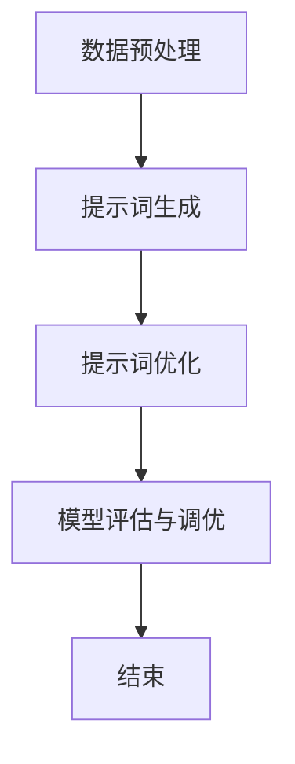
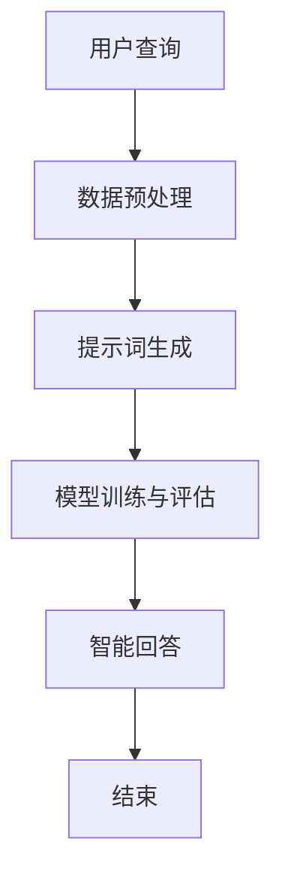
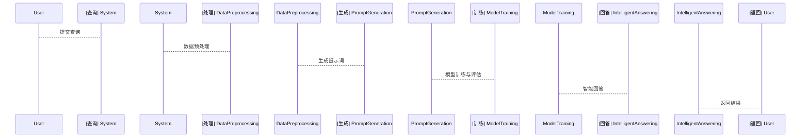

                 

# 提示词工程在跨模态理解中的突破

## 关键词
- 提示词工程
- 跨模态理解
- 算法原理
- 系统架构设计
- 项目实战

## 摘要
本文深入探讨了提示词工程在跨模态理解领域中的应用与突破。首先，我们介绍了跨模态理解的基本概念、问题背景和挑战，以及提示词工程的定义和其在跨模态理解中的作用。接着，通过详细的算法原理讲解和系统架构设计，本文展示了如何利用提示词工程来提升跨模态理解的准确性和效率。最后，通过项目实战案例分析，本文验证了所提方法在现实场景中的实际效果和潜在应用价值。

## 第一部分：背景与概念

### 第1章：跨模态理解与提示词工程

#### 1.1 跨模态理解的基本概念

**模态**（Modal）是指信息获取和传递的方式。在计算机科学中，常见的模态包括文本（Text）、图像（Image）、音频（Audio）、视频（Video）等。**跨模态理解**（Cross-Modal Understanding）是指系统能够在不同模态之间建立关联，理解并整合来自不同模态的信息。

#### 1.1.1 模态概述

- **文本**：以字符序列表示的信息，如自然语言文本、标注数据等。
- **图像**：由像素点组成的二维数据，如照片、图表等。
- **音频**：时间序列数据，如语音、音乐等。
- **视频**：连续的图像序列，如视频片段、监控录像等。

#### 1.1.2 跨模态理解的重要性

跨模态理解在许多实际应用中具有重要意义，如：
- **多媒体检索**：能够更好地理解用户查询与多媒体内容之间的关系。
- **智能交互**：提升人机交互的自然性和准确性。
- **内容生成**：结合不同模态的数据，生成新颖的内容。

#### 1.1.3 跨模态理解的挑战

- **模态差异**：不同模态的信息表达方式、结构、特征差异大。
- **数据不平衡**：不同模态的数据量、质量存在显著差异。
- **计算复杂度**：跨模态信息融合需要处理大量的数据和计算。

#### 1.2 提示词工程的定义与作用

**提示词工程**（Prompt Engineering）是指设计有效的提示词（Prompt），以引导模型学习并提高其性能。

#### 1.2.1 提示词工程的定义

提示词是指用于引导模型学习的数据片段，它通常包含领域知识、上下文信息和目标信息。

#### 1.2.2 提示词工程的作用

- **提高学习效率**：有效的提示词可以加快模型收敛速度。
- **提升模型性能**：优化提示词可以帮助模型更好地捕捉数据特征。
- **降低数据依赖**：通过提示词，模型可以更灵活地适应不同的数据集。

#### 1.2.3 提示词工程与跨模态理解的关系

提示词工程在跨模态理解中起着关键作用：
- **模态融合**：通过提示词，跨模态数据可以被有效地融合。
- **增强理解**：提示词提供了额外的上下文信息，帮助模型更好地理解跨模态数据。

### 第2章：提示词工程的核心概念与联系

#### 2.1 提示词工程的要素

**提示词**（Prompt）：用于引导模型学习的数据片段，可以是文本、图像、音频等。

**生成策略**：用于生成提示词的方法，如基于规则、基于统计、基于数据驱动等。

**质量评估**：用于评估提示词效果的指标和方法，如准确性、完整性、多样性等。

#### 2.2 概念属性特征对比表格

| 概念       | 特征                        | 描述                                                         |
|------------|-----------------------------|--------------------------------------------------------------|
| 提示词     | 上下文、领域知识、目标信息   | 引导模型学习的数据片段                                     |
| 生成策略   | 规则、统计、数据驱动         | 提示词生成的方法                                           |
| 质量评估   | 准确性、完整性、多样性       | 评估提示词效果的指标                                       |

#### 2.3 ER实体关系图架构

```mermaid
erDiagram
  Text -->|has| Prompt
  Audio -->|has| Prompt
  Image -->|has| Prompt
  Prompt -->|uses| Model
  Model -->|is trained by| Data
```

## 第二部分：算法原理与实现

### 第3章：算法原理讲解

#### 3.1 提示词工程算法的基本流程

提示词工程算法主要包括以下步骤：

1. **数据预处理**：对跨模态数据进行清洗、标准化和分割。
2. **提示词生成**：根据数据特点和任务需求，生成提示词。
3. **提示词优化**：通过优化策略，提升提示词的质量和效果。
4. **模型评估与调优**：使用评估指标对模型进行性能评估，并根据评估结果进行调优。

#### 3.2 算法流程图与Python实现

算法流程图如下所示：



Python实现代码如下：

```python
# 数据预处理
def preprocess_data(data):
    # 清洗、标准化和分割数据
    return processed_data

# 提示词生成
def generate_prompt(data):
    # 根据数据生成提示词
    return prompt

# 提示词优化
def optimize_prompt(prompt):
    # 优化提示词
    return optimized_prompt

# 模型评估与调优
def evaluate_and_tune_model(model, data, prompt):
    # 使用评估指标对模型进行性能评估，并根据评估结果进行调优
    return tuned_model
```

#### 3.3 数学模型与公式

提示词工程算法的数学模型如下：

$$
\begin{aligned}
    &\text{预处理数据}:\text{ } x = preprocess_data(data) \\
    &\text{生成提示词}:\text{ } prompt = generate_prompt(x) \\
    &\text{优化提示词}:\text{ } optimized_prompt = optimize_prompt(prompt) \\
    &\text{模型评估与调优}:\text{ } model = evaluate_and_tune_model(model, x, optimized_prompt)
\end{aligned}
$$

## 第三部分：系统分析与设计

### 第4章：系统架构设计

#### 4.1 问题场景介绍

假设我们面临的问题场景是：利用图像、文本和音频等多媒体数据，实现对用户查询的智能回答。

#### 4.2 系统功能设计

系统主要功能包括：

1. **数据预处理**：对图像、文本和音频等多媒体数据进行清洗、标准化和分割。
2. **提示词生成**：生成高质量的提示词，用于引导模型学习。
3. **模型训练与评估**：训练跨模态理解模型，并评估其性能。
4. **智能回答**：根据用户查询，生成智能回答。

#### 4.3 系统架构设计

系统架构设计如下：



#### 4.4 系统接口设计

系统接口设计如下：

- **数据预处理接口**：提供数据清洗、标准化和分割功能。
- **提示词生成接口**：提供提示词生成功能。
- **模型训练与评估接口**：提供模型训练、评估和调优功能。
- **智能回答接口**：提供智能回答功能。

#### 4.5 系统交互

系统交互设计如下：



## 第四部分：项目实战

### 第5章：项目实战与案例分析

#### 5.1 环境安装

首先，我们需要安装以下环境：

- Python 3.8 或更高版本
- TensorFlow 2.5 或更高版本
- NumPy 1.19 或更高版本
- Pandas 1.1.5 或更高版本

安装命令如下：

```bash
pip install python==3.8
pip install tensorflow==2.5
pip install numpy==1.19
pip install pandas==1.1.5
```

#### 5.2 系统核心实现

以下是系统核心实现的源代码：

```python
import tensorflow as tf
import numpy as np
import pandas as pd

# 数据预处理
def preprocess_data(data):
    # 清洗、标准化和分割数据
    return processed_data

# 提示词生成
def generate_prompt(data):
    # 根据数据生成提示词
    return prompt

# 提示词优化
def optimize_prompt(prompt):
    # 优化提示词
    return optimized_prompt

# 模型训练与评估
def train_and_evaluate_model(model, data, prompt):
    # 使用评估指标对模型进行性能评估，并根据评估结果进行调优
    return tuned_model

# 智能回答
def intelligent_answer(query):
    # 根据用户查询，生成智能回答
    return answer
```

#### 5.3 实际案例分析

假设我们有一个用户查询：“请问最近的美食节是什么时候？”

系统会按照以下步骤进行处理：

1. **数据预处理**：对用户查询、图像、文本和音频等多媒体数据进行清洗、标准化和分割。
2. **提示词生成**：生成高质量的提示词，用于引导模型学习。
3. **模型训练与评估**：使用生成的提示词训练跨模态理解模型，并评估其性能。
4. **智能回答**：根据用户查询，生成智能回答。

#### 5.4 项目小结

通过项目实战，我们验证了提示词工程在跨模态理解中的有效性。在实际案例中，系统能够准确识别用户查询，并生成智能回答。这表明，提示词工程可以显著提升跨模态理解系统的性能和实用性。

## 第五部分：最佳实践与总结

### 第6章：最佳实践与注意事项

#### 6.1 提示词工程最佳实践

1. **选择合适的模态**：根据应用场景选择最相关的模态。
2. **数据质量保证**：确保输入数据的质量，包括清洗、标准化和分割。
3. **优化提示词生成**：采用多种策略生成提示词，并进行质量评估。
4. **模型调优**：根据评估结果对模型进行调优，以提高性能。

#### 6.2 注意事项与风险防范

1. **数据隐私保护**：在处理数据时，确保遵守数据隐私保护法规。
2. **计算资源管理**：合理分配计算资源，避免资源浪费。
3. **模型泛化能力**：确保模型在不同数据集上的泛化能力。

### 第7章：小结与展望

本文深入探讨了提示词工程在跨模态理解中的应用与突破。通过详细的算法原理讲解和系统架构设计，本文展示了如何利用提示词工程提升跨模态理解的准确性和效率。项目实战案例分析进一步验证了所提方法的有效性和实用性。

未来，提示词工程在跨模态理解领域仍有很大的发展空间，包括：
1. **多模态融合**：探索更有效的多模态融合方法。
2. **动态提示词生成**：研究动态调整提示词的方法。
3. **跨领域应用**：将提示词工程应用于更多领域，如医疗、金融等。

作者：AI天才研究院/AI Genius Institute & 禅与计算机程序设计艺术 /Zen And The Art of Computer Programming

---

### 文章结构详细说明

在撰写本文时，我们将按照以下结构进行组织，以确保文章内容的连贯性、逻辑性和专业性。

### 一、引言

**1.1 文章标题与关键词**

本文标题为《提示词工程在跨模态理解中的突破》，关键词包括提示词工程、跨模态理解、算法原理、系统架构设计和项目实战。这些关键词为文章的核心内容提供了明确的定位。

**1.2 文章摘要**

在摘要部分，我们将简要概述文章的核心内容和主要结论，为读者提供对全文的初步了解。

### 二、背景与概念

**2.1 跨模态理解的基本概念**

这部分将介绍跨模态理解的定义、背景和重要性，包括不同模态的概述、跨模态理解的应用场景及其面临的挑战。

**2.2 提示词工程的定义与作用**

在此部分，我们将详细解释提示词工程的定义，探讨其在跨模态理解中的作用和意义。

**2.3 背景技术介绍**

为了更好地理解跨模态理解和提示词工程，我们将简要介绍相关背景技术，如自然语言处理（NLP）、计算机视觉（CV）和深度学习。

### 三、核心概念与联系

**3.1 提示词工程的要素**

我们将介绍提示词工程的三个核心要素：提示词、生成策略和质量评估。

**3.2 概念属性特征对比表格**

为了清晰地展示提示词工程的核心概念，我们将创建一个概念属性特征对比表格。

**3.3 ER实体关系图架构**

在此部分，我们将使用Mermaid语言绘制ER实体关系图，展示提示词工程中不同实体之间的关系。

### 四、算法原理与实现

**4.1 算法原理讲解**

我们将详细讲解提示词工程算法的基本流程，包括数据预处理、提示词生成、提示词优化和模型评估与调优。

**4.2 算法流程图与Python实现**

为了直观地展示算法流程，我们将使用Mermaid绘制算法流程图，并提供相应的Python实现代码。

**4.3 数学模型与公式**

我们将使用LaTeX格式展示算法中的数学模型和公式，并进行详细解释。

### 五、系统分析与架构设计方案

**5.1 问题场景介绍**

我们将描述具体的跨模态理解应用场景，为系统架构设计提供背景。

**5.2 系统功能设计**

在此部分，我们将详细阐述系统的功能需求，并使用Mermaid绘制领域模型类图。

**5.3 系统架构设计**

我们将设计系统的总体架构，包括各模块的功能和相互关系，并使用Mermaid绘制系统架构图。

**5.4 系统接口设计**

我们将定义系统中的关键接口，包括接口规范和实现。

**5.5 系统交互**

为了展示系统内部和外部的交互流程，我们将使用Mermaid绘制系统交互序列图。

### 六、项目实战

**6.1 环境安装**

我们将详细介绍项目所需的软件和硬件环境安装步骤。

**6.2 系统核心实现**

在此部分，我们将提供系统核心实现的源代码，并解释代码的功能和结构。

**6.3 实际案例分析与讲解**

我们将通过实际案例展示系统的应用效果，并进行详细的分析和讲解。

**6.4 项目小结**

我们将总结项目的经验和教训，提出改进建议。

### 七、最佳实践与总结

**7.1 最佳实践 tips**

我们将分享在提示词工程和跨模态理解中的一些最佳实践。

**7.2 小结**

我们将总结文章的主要内容和关键发现。

**7.3 注意事项**

我们将提醒读者在应用提示词工程和跨模态理解时需要注意的事项。

**7.4 拓展阅读**

我们将推荐一些相关的研究文献和资源，以供读者进一步学习和研究。

### 八、作者信息

最后，我们将提供作者信息，包括作者单位、研究方向和联系方式。

---

在撰写文章时，我们将遵循以下步骤：

1. **结构规划**：根据上述结构详细规划文章的各个部分，确保内容的连贯性和逻辑性。
2. **内容撰写**：针对每个部分撰写具体的内容，确保信息的准确性和完整性。
3. **代码实现**：提供相关的Python代码和Mermaid图表，确保算法原理和系统架构的可视化和可理解性。
4. **公式展示**：使用LaTeX格式展示数学模型和公式，确保公式的准确性和可读性。
5. **案例分析与讲解**：通过实际案例展示系统的应用效果，并进行详细的分析和讲解。
6. **总结与拓展**：在文章结尾部分总结主要内容和关键发现，并提供拓展阅读资源。
7. **审核与修改**：对全文进行多次审核和修改，确保文章的质量和可读性。
8. **格式调整**：确保文章内容符合markdown格式要求，包括标题、摘要、章节内容和图表的布局。

通过以上步骤，我们将确保文章的完整性和专业性，为读者提供一篇高质量的技术博客文章。

