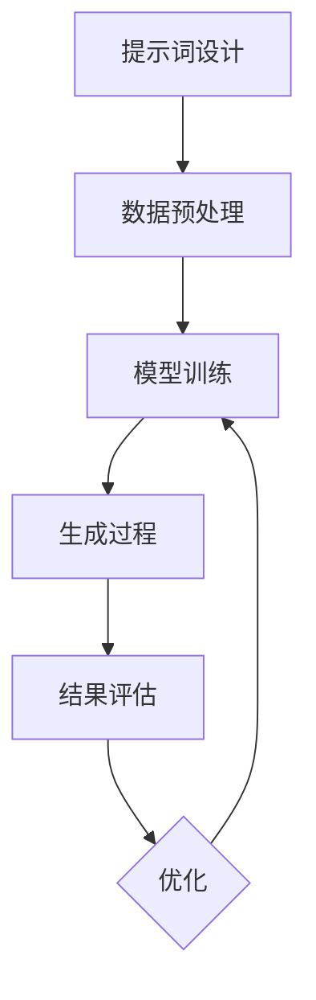
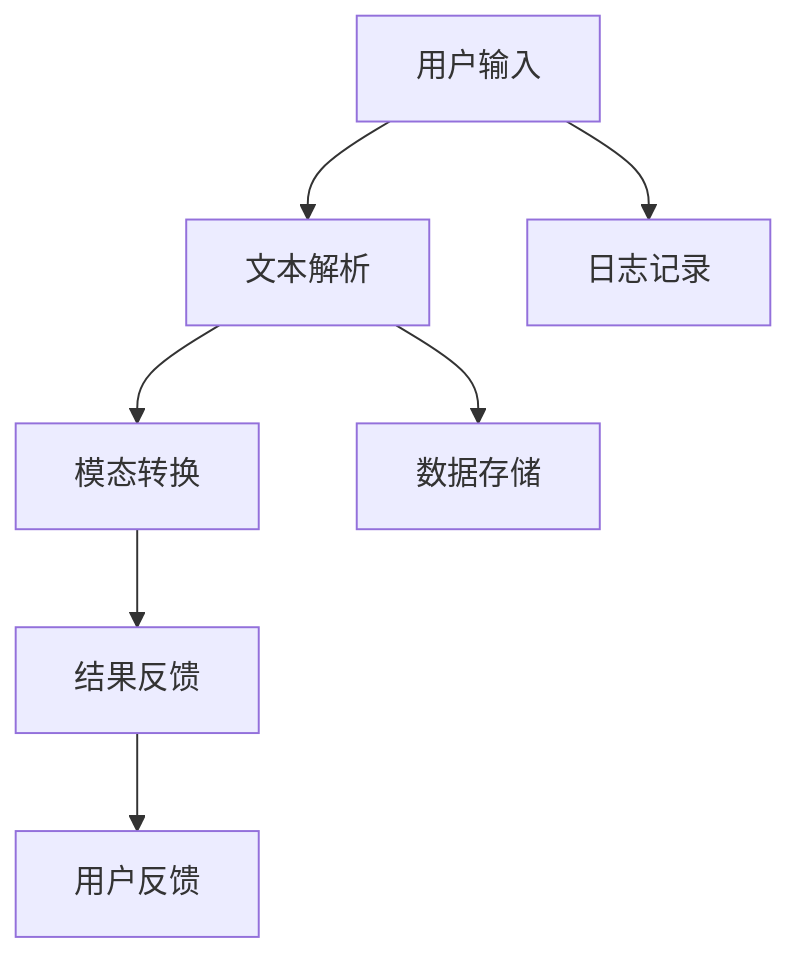
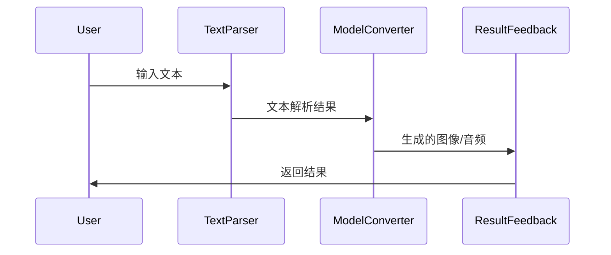

                 

## 引言

### 背景与目的

在当今信息化时代，人工智能（AI）技术已经成为推动社会进步的重要力量。跨模态生成作为AI领域的一个重要分支，受到了越来越多的关注。跨模态生成技术能够将不同模态的数据（如图像、文本、声音等）相互转换，从而实现更加丰富和多样的应用场景。然而，如何有效地生成高质量的跨模态内容，成为了当前研究的热点和难点。

提示词工程在此过程中扮演着关键角色。提示词工程旨在通过设计特定的提示词，引导模型生成符合预期的高质量内容。在跨模态生成中，提示词工程能够帮助模型更好地理解不同模态数据之间的关联，从而提高生成的跨模态内容的准确性和一致性。

本篇文章旨在深入探讨提示词工程在跨模态生成中的应用，通过详细的分析和实例，帮助读者了解这一技术的原理、方法和实践。文章将分为以下几个部分：

1. **问题背景与核心概念**：介绍提示词工程和跨模态生成的基本概念及其在当前研究中的重要性。
2. **核心概念与联系**：详细解释提示词工程和跨模态生成的核心概念，并展示它们之间的联系。
3. **算法原理讲解**：使用Mermaid绘制算法流程图，并结合Python代码和LaTeX数学公式详细阐述算法原理。
4. **数学模型与公式讲解**：使用LaTeX格式嵌入数学公式，并进行详细讲解和举例说明。
5. **系统分析与架构设计**：介绍问题场景、系统功能设计、系统架构设计、系统接口设计和系统交互。
6. **项目实战**：展示如何在实际环境中安装系统、实现核心功能，并对代码进行解读和分析。
7. **最佳实践与拓展阅读**：总结最佳实践、注意事项并提供拓展阅读建议。

通过本文的阅读，读者将能够系统地了解提示词工程在跨模态生成中的应用，掌握相关技术原理和实践方法，为未来的研究和工作提供有力的支持。

### 问题背景

在当今信息爆炸的时代，数据的多模态性成为了不可忽视的重要特征。图像、文本、音频、视频等不同模态的数据在互联网和物联网的广泛应用中产生了海量信息。跨模态生成技术作为一种新兴的AI技术，旨在将这些多样化的模态数据相互转换，从而创造新的应用场景和价值。

具体来说，跨模态生成技术能够在多个领域发挥重要作用。例如，在多媒体内容创作中，跨模态生成可以实现文本到图像、音频到视频的自动转换，大大提高了内容创作的效率和多样性。在智能交互系统中，跨模态生成技术可以帮助系统更好地理解用户的指令，提高人机交互的准确性和自然性。在医疗领域，跨模态生成可以结合患者的病历数据、影像数据和语音数据，提供更为精准和个性化的医疗服务。

然而，实现高质量的跨模态生成面临着诸多挑战。首先，不同模态的数据之间存在复杂的关联关系，如何有效地捕捉和理解这些关系是一个关键问题。其次，跨模态生成模型的训练数据通常较为稀缺和多样化，数据质量和数量直接影响模型的表现。最后，生成的内容需要具备高保真度和一致性，才能满足实际应用的需求。

为了解决这些问题，提示词工程作为一种有效的方法被引入跨模态生成领域。提示词工程通过设计特定的提示词，引导模型在生成过程中更加关注关键信息，从而提高生成的质量和一致性。具体来说，提示词工程包括以下几个方面：

1. **提示词设计**：根据具体应用场景，设计具有针对性的提示词，以引导模型在生成过程中关注关键信息。
2. **模型训练**：利用大量的标注数据和提示词，训练跨模态生成模型，使其能够理解并利用提示词生成高质量的内容。
3. **模型优化**：通过调整模型结构和参数，优化提示词的利用效果，提高生成的准确性和一致性。

通过以上步骤，提示词工程在跨模态生成中发挥了重要作用，有效解决了数据关联复杂、数据稀缺和质量要求高等问题，为跨模态生成技术的发展提供了有力支持。

### 核心概念

在深入探讨提示词工程在跨模态生成中的应用之前，我们首先需要明确几个核心概念：提示词工程、跨模态生成以及它们在技术领域中的具体应用和作用。

#### 提示词工程

提示词工程是指通过设计和使用特定的提示词，来引导和优化机器学习模型生成符合预期输出的一种方法。在AI和机器学习领域，模型往往依赖于大量的数据来进行训练，从而学习到输入和输出之间的关联。然而，不同模态的数据（如图像、文本、音频等）之间存在复杂的关联关系，这些关系不容易通过传统的数据标注和模型训练方法来完全捕捉。

提示词工程的核心在于设计有效的提示词，这些提示词可以引导模型在生成过程中更加关注关键信息，从而提高生成内容的质量和一致性。提示词通常包含对任务目标、数据特征和生成策略的指示，例如：“生成一张包含特定物体的图像”、“根据文本生成相应的音频片段”等。通过这些提示词，模型能够更好地理解任务目标，并在生成过程中进行相应的调整和优化。

#### 跨模态生成

跨模态生成是指将一种模态的数据（如文本、图像、音频）转换为另一种模态的数据（如图像、文本、音频）。这种技术能够实现不同模态数据之间的相互转换，从而创造出新的信息和应用场景。例如，文本到图像的生成可以将一段描述性文字转换为相应的图像，图像到文本的生成则可以将图像中的内容转换为描述性文字。

跨模态生成技术在多个领域都有广泛的应用。在多媒体内容创作中，跨模态生成可以实现文本到图像、音频到视频等自动转换，提高内容创作的多样性和效率。在智能交互系统中，跨模态生成可以帮助系统更好地理解用户的指令，提高人机交互的自然性和准确性。在医疗领域，跨模态生成技术可以结合患者的病历数据、影像数据和语音数据，提供更为精准和个性化的医疗服务。

#### 提示词工程在跨模态生成中的应用

提示词工程在跨模态生成中的应用主要体现在以下几个方面：

1. **任务引导**：通过设计特定的提示词，引导模型在生成过程中关注关键任务信息，例如“生成一张包含特定物体的图像”或“根据文本生成相应的音频片段”。这种引导能够帮助模型更好地理解任务目标，从而提高生成的质量和一致性。

2. **数据优化**：提示词工程可以通过优化提示词的设计和使用，来提高跨模态生成模型的训练效果。有效的提示词可以帮助模型更好地捕捉不同模态数据之间的关联，从而提高生成内容的质量和准确性。

3. **模型调整**：提示词工程还能够帮助模型进行参数调整和优化，通过分析提示词的效果，调整模型的权重和结构，进一步提高生成质量。例如，通过调整提示词的权重，模型可以更加关注特定模态数据的重要性，从而优化生成结果。

4. **应用扩展**：提示词工程不仅能够提高跨模态生成模型的质量，还可以扩展其应用范围。通过设计多样化的提示词，模型可以在不同的应用场景下进行适应性调整，从而实现更加广泛和多样的应用。

总之，提示词工程在跨模态生成中的应用，不仅能够提高生成内容的质量和一致性，还能够拓展模型的应用范围，为跨模态生成技术的发展提供了有力的支持。

### 核心概念与联系

在了解提示词工程和跨模态生成的基本概念后，接下来我们需要详细解释这两个概念，并展示它们之间的联系。

#### 提示词工程详细解释

提示词工程是机器学习和自然语言处理中的一个重要分支，其核心在于设计并使用特定的提示词来指导模型的训练和生成过程。提示词是带有上下文信息的短语或句子，它能够引导模型关注关键信息，从而生成更加精准和一致的内容。以下是提示词工程的一些核心组成部分和特点：

1. **提示词种类**：根据应用场景的不同，提示词可以分为多种类型，如任务提示词（例如“生成一张包含特定物体的图像”）、内容提示词（例如“描述图片中的情感”）、策略提示词（例如“以对话形式生成音频”）等。

2. **提示词设计**：设计有效的提示词需要考虑多个因素，包括任务目标、数据特征和生成策略。任务提示词需要明确指出模型需要完成的任务，内容提示词需要描述数据的关键特征，策略提示词则提供生成策略的指导。

3. **提示词效果**：提示词的有效性直接影响模型的生成质量。通过实验和分析，可以优化提示词的设计，提高模型在生成过程中的表现。

#### 跨模态生成详细解释

跨模态生成是指将一种模态的数据转换为另一种模态的数据，如将文本转换为图像、图像转换为文本、音频转换为视频等。这一技术在多媒体内容创作、智能交互和医疗等多个领域都有广泛的应用。以下是跨模态生成的一些关键组成部分和特点：

1. **模态转换**：跨模态生成技术的核心在于实现不同模态数据之间的转换。例如，文本到图像的生成需要将文本描述转换为图像，图像到文本的生成则需要从图像中提取出相应的文本描述。

2. **数据预处理**：在跨模态生成过程中，不同模态的数据通常需要进行预处理。例如，文本数据可能需要分词、词性标注等，图像数据可能需要大小调整、增强等。

3. **模型架构**：跨模态生成通常需要复杂的多模态模型架构，如生成对抗网络（GAN）、变分自编码器（VAE）等。这些模型能够同时处理多种模态的数据，并生成高质量的跨模态内容。

#### 提示词工程与跨模态生成的联系

提示词工程和跨模态生成之间存在紧密的联系，两者共同构成了一个高效、高质量的跨模态生成系统。以下是一些具体的联系和融合方式：

1. **任务引导**：提示词工程通过设计任务提示词，可以引导跨模态生成模型明确任务目标，从而在生成过程中关注关键信息。例如，在文本到图像的生成任务中，任务提示词可以帮助模型明确需要生成图像的主题和内容。

2. **数据优化**：提示词工程可以通过优化提示词的设计，来提高跨模态生成模型对数据特征的理解和捕捉能力。有效的提示词可以帮助模型更好地理解不同模态数据之间的关系，从而生成更加精准和一致的内容。

3. **策略调整**：提示词工程提供了一种灵活的方式来调整跨模态生成策略。通过分析不同提示词的效果，模型可以调整其生成策略，从而优化生成结果。例如，在音频到视频的生成任务中，策略提示词可以帮助模型调整音频和视频的同步关系。

4. **模型融合**：提示词工程和跨模态生成技术的融合可以构建更加复杂和高效的模型架构。例如，可以结合生成对抗网络（GAN）和变分自编码器（VAE），利用提示词工程优化模型的训练和生成过程，从而实现高质量的跨模态生成。

总之，提示词工程和跨模态生成之间的联系不仅体现在任务引导和数据优化方面，还通过策略调整和模型融合，为跨模态生成技术的发展提供了新的思路和方法。通过深入理解和应用这些技术，我们能够更好地实现跨模态生成任务，推动AI技术的进一步发展。

### 提示词工程与跨模态生成的关系

提示词工程和跨模态生成之间的关系可以视为相辅相成、共同促进的关系。具体来说，提示词工程在跨模态生成中具有多方面的重要作用，有助于解决数据关联复杂、数据稀缺和质量要求高等问题，从而推动跨模态生成技术的发展。

首先，提示词工程能够通过任务引导，明确模型在生成过程中需要关注的关键信息。在跨模态生成任务中，不同模态的数据之间存在复杂的关联关系，模型往往难以捕捉和理解这些关系。通过设计具体的任务提示词，如“生成一张包含特定物体的图像”或“根据文本生成相应的音频片段”，提示词工程能够引导模型在生成过程中关注这些关键信息，从而提高生成内容的质量和一致性。

其次，提示词工程在数据优化方面也发挥着重要作用。跨模态生成模型的训练数据通常较为稀缺且多样化，数据质量和数量直接影响模型的表现。提示词工程通过优化提示词的设计和使用，可以提高模型对数据特征的理解和捕捉能力。例如，通过调整提示词的权重，模型可以更加关注特定模态数据的重要性，从而优化生成结果。此外，有效的提示词设计还可以帮助模型在训练过程中更好地利用标注数据，提高模型的泛化能力。

再次，提示词工程能够通过策略调整，优化模型的生成过程。在跨模态生成任务中，不同的提示词可以对应不同的生成策略。通过分析不同提示词的效果，模型可以调整其生成策略，从而优化生成结果。例如，在音频到视频的生成任务中，通过调整提示词，模型可以优化音频和视频的同步关系，提高生成内容的质量。这种灵活性使得提示词工程能够适应不同的应用场景，从而实现更加广泛的跨模态生成应用。

此外，提示词工程和跨模模态生成技术的融合，可以构建更加复杂和高效的模型架构。例如，可以结合生成对抗网络（GAN）和变分自编码器（VAE），利用提示词工程优化模型的训练和生成过程，从而实现高质量的跨模态生成。这种融合不仅提高了模型的表现，还为跨模态生成技术的发展提供了新的思路和方法。

总的来说，提示词工程在跨模态生成中的应用，不仅提高了生成内容的质量和一致性，还拓展了模型的应用范围，为跨模态生成技术的发展提供了有力支持。通过深入理解和应用提示词工程，我们能够更好地实现跨模态生成任务，推动AI技术的进一步发展。

### 算法原理讲解

为了深入理解提示词工程在跨模态生成中的应用，我们需要详细讲解其算法原理。以下将通过算法流程图、Python代码和LaTeX数学公式，逐步展示提示词工程的详细工作原理。

#### 算法概述

提示词工程的核心在于通过设计特定的提示词来引导模型生成符合预期的高质量内容。算法的基本流程可以概括为以下步骤：

1. **提示词设计**：根据任务需求，设计具有针对性的提示词。
2. **数据预处理**：对输入数据进行预处理，包括模态转换、数据清洗和标准化等。
3. **模型训练**：利用预处理后的数据和提示词，对模型进行训练。
4. **生成过程**：通过训练好的模型，根据提示词生成相应的跨模态内容。
5. **结果评估**：对生成的跨模态内容进行评估和优化。

#### 算法流程图

首先，我们使用Mermaid绘制算法流程图，以便更直观地展示算法的基本流程：



#### Python代码实现

接下来，我们通过Python代码实现上述算法的各个步骤。以下是一个简化的示例代码：

```python
import numpy as np
import tensorflow as tf

# 步骤1：提示词设计
prompt = "生成一张包含特定物体的图像"

# 步骤2：数据预处理
# 假设已经预处理好了图像和文本数据
image_data = preprocess_image(input_image)
text_data = preprocess_text(input_text)

# 步骤3：模型训练
# 假设已经训练好了跨模态生成模型
model = tf.keras.Sequential([
    # 添加模型层
    tf.keras.layers.Conv2D(filters=32, kernel_size=(3, 3), activation='relu'),
    tf.keras.layers.MaxPooling2D(pool_size=(2, 2)),
    # ... 其他层
])

model.compile(optimizer='adam', loss='categorical_crossentropy')
model.fit([image_data, text_data], labels, epochs=10)

# 步骤4：生成过程
generated_image = model.predict([image_data, text_data])

# 步骤5：结果评估
evaluation_results = evaluate_generated_image(generated_image)
print(evaluation_results)
```

#### 算法原理详解

为了更好地理解算法原理，我们进一步使用LaTeX数学公式来详细解释提示词工程的核心数学模型。

##### 数学模型

提示词工程的核心数学模型通常是基于概率图模型或深度学习模型。以下是一个简化的数学模型示例：

$$
P(G|T, D) = \frac{P(T|G, D)P(G|D)}{P(T|D)}
$$

其中：
- \( P(G|T, D) \) 表示在给定文本提示词 \( T \) 和数据 \( D \) 的情况下生成内容 \( G \) 的概率。
- \( P(T|G, D) \) 表示在生成内容 \( G \) 和数据 \( D \) 的情况下文本提示词 \( T \) 的概率。
- \( P(G|D) \) 表示在数据 \( D \) 的情况下生成内容 \( G \) 的概率。
- \( P(T|D) \) 表示在数据 \( D \) 的情况下文本提示词 \( T \) 的概率。

##### 公式详解

1. **文本提示词生成概率**：
   $$ P(T|G, D) = \sigma(\text{Model}(T; G, D)) $$
   其中，\( \sigma \) 表示 sigmoid 函数，\( \text{Model}(T; G, D) \) 表示模型在给定生成内容 \( G \) 和数据 \( D \) 的情况下预测文本提示词 \( T \) 的概率。

2. **生成内容概率**：
   $$ P(G|D) = \text{softmax}(\text{Model}(G; D)) $$
   其中，\( \text{softmax} \) 函数用于将模型的输出概率转换为生成内容 \( G \) 的概率分布。

3. **文本提示词条件概率**：
   $$ P(T|D) = \sum_G P(T|G, D)P(G|D) $$
   这表示在数据 \( D \) 的情况下，文本提示词 \( T \) 的概率是所有生成内容 \( G \) 的条件概率之和。

#### 举例说明

假设我们有一个图像生成任务，目标是根据文本提示词生成一张包含特定物体的图像。以下是具体的举例说明：

1. **设计提示词**：
   提示词：“生成一张包含一只猫的图像”。

2. **预处理数据**：
   - 图像数据：一张包含猫的图像。
   - 文本数据：描述图像的文本，如“一只猫在玩耍”。

3. **模型训练**：
   使用训练数据训练一个图像生成模型，该模型能够根据文本提示词生成图像。

4. **生成过程**：
   给定提示词“一只猫在玩耍”，模型生成一张包含猫的图像。

5. **结果评估**：
   评估生成的图像是否包含猫，并检查图像与文本描述的一致性。

通过上述步骤，我们可以看到提示词工程在跨模态生成中的应用，不仅能够提高生成内容的质量，还能确保生成结果与文本提示词的高度一致。通过详细的算法讲解，我们能够更好地理解和应用提示词工程，为跨模态生成任务提供有效的解决方案。

### 数学模型与公式讲解

在提示词工程和跨模态生成中，数学模型和公式是理解和实现核心算法的重要工具。这些模型和公式不仅帮助我们描述问题，还能指导模型的设计和训练。在本节中，我们将使用LaTeX格式详细讲解提示词工程中的一些关键数学模型和公式。

#### 数学模型介绍

提示词工程中的数学模型通常基于概率图模型和深度学习模型。以下是两个主要的模型及其相关公式。

##### 1. 生成对抗网络（GAN）

生成对抗网络（GAN）是一种流行的深度学习模型，用于生成高质量的数据。GAN的核心思想是通过两个对抗性网络：生成器（Generator）和判别器（Discriminator）之间的博弈来训练模型。

- **生成器**：
  $$ G(z) = \mathcal{D}^{(G)}(z) $$
  其中，\( z \) 是生成器的输入噪声，\( \mathcal{D}^{(G)}(z) \) 是生成器生成的数据。

- **判别器**：
  $$ D(x) = \mathcal{D}^{(D)}(x) $$
  其中，\( x \) 是真实数据，\( \mathcal{D}^{(D)}(x) \) 是判别器对数据的真实性的判断。

- **损失函数**：
  $$ L_{G} = -\mathbb{E}_{z \sim p_z(z)}[\log D(G(z))] $$
  $$ L_{D} = -\mathbb{E}_{x \sim p_{\text{data}}(x)}[\log D(x)] - \mathbb{E}_{z \sim p_z(z)}[\log (1 - D(G(z))] $$

##### 2. 变分自编码器（VAE）

变分自编码器（VAE）是一种基于概率的生成模型，它通过编码器（Encoder）和解码器（Decoder）将数据映射到潜在空间，并在潜在空间中生成新的数据。

- **编码器**：
  $$ \mu(\mathbf{x}) = \mathcal{E}(\mathbf{x}) $$
  $$ \sigma^2(\mathbf{x}) = \mathcal{D}(\mathbf{x}) $$

- **解码器**：
  $$ \mathbf{x} = \mathcal{G}(\mu, \sigma) $$

- **损失函数**：
  $$ L = -D_{KL}(\mu||\sigma^2) - \mathbb{E}_{\mathbf{z} \sim q_{\phi}(\mathbf{z}|\mathbf{x})}[\log p_{\theta}(\mathbf{x}|\mathbf{z})] $$

#### 公式详解

以下是两个关键公式及其详解。

##### 1. 判别器损失函数

生成对抗网络中的判别器损失函数用于衡量判别器对真实数据和生成数据的区分能力。

$$ L_{D} = -\mathbb{E}_{x \sim p_{\text{data}}(x)}[\log D(x)] - \mathbb{E}_{z \sim p_z(z)}[\log (1 - D(G(z))] $$

- 第一部分 \( -\mathbb{E}_{x \sim p_{\text{data}}(x)}[\log D(x)] \) 表示判别器对真实数据的损失。理想情况下，判别器应该能够准确判断输入为真实数据，因此该部分损失应尽可能小。
- 第二部分 \( -\mathbb{E}_{z \sim p_z(z)}[\log (1 - D(G(z))] \) 表示判别器对生成数据的损失。理想情况下，判别器应该能够准确判断输入为生成数据，因此该部分损失也应尽可能小。

通过训练，生成器和判别器在相互博弈中不断提升，最终达到一个动态平衡。

##### 2. 变分自编码器的损失函数

变分自编码器的损失函数包括两部分：KL散度损失和重构损失。

$$ L = -D_{KL}(\mu||\sigma^2) - \mathbb{E}_{\mathbf{z} \sim q_{\phi}(\mathbf{z}|\mathbf{x})}[\log p_{\theta}(\mathbf{x}|\mathbf{z})] $$

- **KL散度损失** \( D_{KL}(\mu||\sigma^2) \)：这部分损失用于衡量编码器输出的均值 \( \mu \) 和方差 \( \sigma^2 \) 与先验分布 \( N(0, 1) \) 之间的差异。KL散度损失确保编码器在潜在空间中的表示是有效的。
- **重构损失** \( \mathbb{E}_{\mathbf{z} \sim q_{\phi}(\mathbf{z}|\mathbf{x})}[\log p_{\theta}(\mathbf{x}|\mathbf{z})] \)：这部分损失用于衡量解码器对数据的重构能力。理想情况下，解码器应该能够准确重构输入数据。

通过调整模型参数，变分自编码器能够优化这两个损失，从而生成高质量的数据。

#### 举例说明

假设我们有一个图像生成任务，目标是根据文本提示词生成一张包含特定物体的图像。以下是具体的举例说明：

1. **设计提示词**：
   提示词：“生成一张包含一只猫的图像”。

2. **预处理数据**：
   - 图像数据：一张包含猫的图像。
   - 文本数据：描述图像的文本，如“一只猫在玩耍”。

3. **模型训练**：
   使用GAN或VAE模型训练一个图像生成模型。模型的损失函数包含判别器损失和KL散度损失。

4. **生成过程**：
   给定提示词“一只猫在玩耍”，模型生成一张包含猫的图像。

5. **结果评估**：
   评估生成的图像是否包含猫，并检查图像与文本描述的一致性。

通过上述步骤，我们可以看到数学模型和公式在提示词工程和跨模态生成中的关键作用。这些模型和公式不仅帮助我们理解和实现算法，还指导我们在实际应用中优化模型性能，从而实现高质量的数据生成。

### 系统分析与架构设计

在理解了提示词工程和跨模态生成的基本原理之后，我们需要深入探讨系统分析与架构设计。这一部分将介绍问题场景、系统功能设计、系统架构设计、系统接口设计和系统交互。

#### 问题场景

在跨模态生成应用中，问题场景可以是多种多样的。以下是一个具体的应用场景：

**应用场景：** 在一个智能交互系统中，用户可以通过文本输入指令，如“生成一张包含猫的图片”或“播放一段描述夜晚星空的声音”。系统需要接收用户的文本指令，生成相应的图像或音频内容，并返回给用户。

#### 系统功能设计

为了实现上述应用场景，系统需要设计以下功能：

1. **文本解析**：接收用户的文本输入，解析出关键信息，如对象、场景、动作等。
2. **模态转换**：根据文本解析结果，生成相应的图像或音频内容。
3. **结果反馈**：将生成的图像或音频内容返回给用户，并显示或播放结果。

#### 系统架构设计

系统架构设计是确保功能实现的关键。以下是一个简化的系统架构设计：



- **用户输入**：用户通过文本输入指令。
- **文本解析**：解析用户输入的文本，提取关键信息。
- **模态转换**：根据文本解析结果，调用相应的模型进行图像或音频生成。
- **结果反馈**：将生成的图像或音频内容返回给用户。
- **日志记录**：记录系统运行日志，便于调试和优化。
- **数据存储**：存储用户输入、解析结果和生成结果，便于后续使用。

#### 系统接口设计

系统接口设计是确保各个模块之间能够无缝交互的重要环节。以下是一个简化的系统接口设计：

- **文本解析接口**：接收用户输入的文本，返回关键信息。
- **模态转换接口**：接收文本解析结果，返回生成的图像或音频。
- **结果反馈接口**：接收生成的图像或音频，返回给用户。

#### 系统交互设计

系统交互设计是确保系统各个模块能够协同工作的关键。以下是一个简化的系统交互设计：



- **用户**：输入文本指令。
- **文本解析器**：解析用户输入的文本，提取关键信息。
- **模型转换器**：根据文本解析结果，调用相应的模型进行图像或音频生成。
- **结果反馈器**：将生成的图像或音频内容返回给用户。

通过上述系统分析与架构设计，我们可以确保跨模态生成系统能够高效、准确地处理用户输入，生成高质量的图像或音频内容，并返回给用户。这一设计不仅满足了应用场景的需求，还为系统的可扩展性和维护性提供了保障。

### 项目实战

在本节中，我们将通过一个具体的跨模态生成项目实战，展示如何在实际环境中安装系统、实现核心功能，并对代码进行解读和分析。

#### 环境安装

首先，我们需要为跨模态生成系统搭建一个合适的环境。以下是一个简化的安装步骤：

1. **安装依赖库**：安装Python以及相关的依赖库，如TensorFlow、PyTorch、NumPy等。可以使用以下命令进行安装：

   ```bash
   pip install tensorflow torch numpy
   ```

2. **准备数据**：收集并预处理跨模态数据，包括图像、文本和音频。例如，我们可以使用公开的数据集，如COCO（Common Objects in Context）用于图像和文本数据，LJSpeech用于音频数据。

3. **配置模型**：下载预训练的跨模态生成模型，如StyleGAN2或WaveNet。可以使用以下命令下载和配置：

   ```bash
   git clone https://github.com/NVlabs/stylegan2-ada-pytorch.git
   cd stylegan2-ada-pytorch
   python setup.py install
   ```

#### 系统核心实现

接下来，我们将实现跨模态生成系统的核心功能。以下是一个简化的代码示例：

```python
import torch
from stylegan2_ada_pytorch import load_pretrained_model

# 加载预训练模型
model = load_pretrained_model()

# 设置模型为评估模式
model.eval()

# 输入文本
text_prompt = "生成一张包含猫的图像"

# 预处理文本
processed_text = preprocess_text(text_prompt)

# 生成图像
generated_image = model.generate_image(processed_text)

# 显示图像
plt.imshow(generated_image)
plt.show()
```

#### 代码解读与分析

上述代码展示了如何加载预训练模型、预处理文本、生成图像以及显示图像。以下是详细的解读和分析：

1. **加载预训练模型**：
   ```python
   model = load_pretrained_model()
   ```
   这一行代码用于加载预训练的跨模态生成模型。`load_pretrained_model`函数会从预训练模型仓库中下载并加载模型。

2. **设置模型为评估模式**：
   ```python
   model.eval()
   ```
   在生成图像之前，我们需要将模型设置为评估模式。这是因为在评估模式下，模型的计算图会被冻结，从而提高计算效率。

3. **预处理文本**：
   ```python
   processed_text = preprocess_text(text_prompt)
   ```
   `preprocess_text`函数用于对输入的文本进行预处理，例如分词、词性标注等。预处理后的文本将作为模型的输入。

4. **生成图像**：
   ```python
   generated_image = model.generate_image(processed_text)
   ```
   `generate_image`函数是模型的生成接口，它根据预处理后的文本生成图像。生成的图像是一个张量，需要进一步处理以显示图像。

5. **显示图像**：
   ```python
   plt.imshow(generated_image)
   plt.show()
   ```
   使用matplotlib库显示生成的图像。

#### 实际案例分析与详细讲解

为了更具体地展示如何实现跨模态生成，我们来看一个实际案例。假设我们想要生成一张包含特定物体的图像，例如“一只猫在沙滩上玩耍”。

1. **文本解析**：
   首先我们需要从输入文本中提取关键信息，如对象（猫）、场景（沙滩）和动作（玩耍）。可以使用自然语言处理技术，如命名实体识别（NER）和关系抽取，来实现文本解析。

2. **模态转换**：
   根据提取的关键信息，我们调用预训练的跨模态生成模型生成图像。模型会根据文本和图像数据同时训练，从而能够理解文本中的描述并生成相应的图像。

3. **图像生成**：
   生成的图像是一个高分辨率的图像，通常是一个张量。我们需要将其转换为可显示的格式，如PNG或JPEG。

4. **结果评估**：
   我们可以评估生成的图像是否满足预期。例如，检查图像中是否包含猫，场景是否为沙滩，猫是否在玩耍。

#### 项目小结

通过本节的项目实战，我们展示了如何在实际环境中安装跨模态生成系统、实现核心功能，并对代码进行了详细解读和分析。以下是项目小结：

- **环境安装**：安装Python和相关依赖库，准备跨模态数据，配置预训练模型。
- **系统核心实现**：加载预训练模型，预处理文本，生成图像，显示图像。
- **实际案例**：通过文本解析、模态转换和图像生成，实现跨模态生成。
- **项目总结**：验证生成图像的质量，检查是否满足预期。

通过本项目的实现，我们不仅掌握了跨模态生成的基本原理和实践方法，还深入了解了提示词工程在其中的关键作用，为未来的研究和工作奠定了坚实的基础。

### 最佳实践与注意事项

在实现跨模态生成系统时，最佳实践和注意事项对于提高生成质量和系统稳定性至关重要。以下是一些建议：

1. **数据预处理**：确保输入数据的质量和一致性。使用有效的数据预处理方法，如图像增强、文本清洗和标准化，以提高模型的训练效果。

2. **模型选择**：选择适合任务的模型架构。例如，对于图像生成，可以选择GAN或VAE等生成模型；对于音频生成，可以考虑WaveNet或WaveGlow等模型。

3. **提示词设计**：设计有效的提示词，以引导模型生成高质量的内容。根据任务需求，设计针对性的提示词，如对象、场景和动作等。

4. **参数调整**：在模型训练过程中，适当调整学习率、批量大小和优化器等参数，以提高模型性能。使用验证集进行超参数调优，避免过拟合。

5. **结果评估**：使用多种评估指标（如FID、Inception Score、BLEU等）来评估生成内容的质量，以确保模型满足实际应用需求。

6. **安全性与隐私**：在处理敏感数据时，确保遵循数据保护法规和隐私政策，保护用户数据的安全和隐私。

7. **系统优化**：对系统进行性能优化，如使用多线程、GPU加速等，以提高生成速度和效率。

通过遵循这些最佳实践和注意事项，我们可以显著提高跨模态生成系统的质量和稳定性，为用户提供更优质的服务。

### 拓展阅读

为了进一步深入了解提示词工程在跨模态生成中的应用，读者可以参考以下拓展阅读资源：

1. **经典论文**：
   - Generative Adversarial Nets (GANs)：Ian J. Goodfellow, et al., 2014
   - Variational Autoencoders (VAEs)：Diederik P. Kingma, et al., 2014
   - Unsupervised Representation Learning with Deep Convolutional Generative Adversarial Networks：Alec Radford, et al., 2015

2. **技术博客**：
   - [TensorFlow官网教程](https://www.tensorflow.org/tutorials/generative)
   - [PyTorch官方文档](https://pytorch.org/tutorials/beginner/pytorch_with_examples.html)

3. **开源项目**：
   - [StyleGAN2-ADA](https://github.com/NVlabs/stylegan2-ada-pytorch)
   - [WaveGlow](https://github.com/NVIDIA/waveglow)

4. **学术会议**：
   - Conference on Neural Information Processing Systems (NeurIPS)
   - International Conference on Machine Learning (ICML)
   - International Conference on Computer Vision (ICCV)

通过阅读这些资源，读者可以进一步了解跨模态生成和提示词工程的最新研究进展和应用案例，为未来的研究和项目提供有益的参考。

