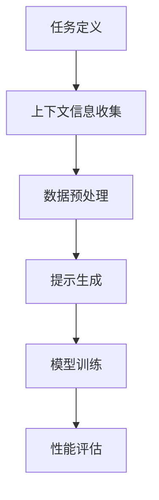
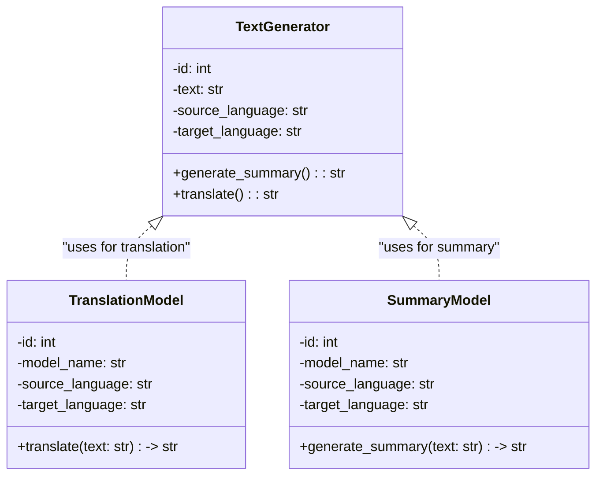

                 

### 引言

#### 背景介绍

在全球化迅速发展的今天，跨语言任务的应用场景日益广泛，从跨文化交流、电子商务到多语言搜索引擎，再到多语言智能客服和翻译服务，这些领域都对自然语言处理技术提出了更高的要求。然而，跨语言任务面临着诸多挑战，如语言间的差异、语料库的稀缺、以及多语言数据的一致性问题。这些问题限制了自然语言处理系统在不同语言环境中的性能表现。

#### 核心概念术语说明

- **跨语言任务**：涉及不同语言之间的语言处理任务，如机器翻译、多语言文本分类、跨语言问答等。
- **提示工程**：通过设计和优化提示（Prompt）来提升模型在特定任务中的表现的技术。
- **语言建模**：构建一个能够预测下一个单词或字符的概率分布的模型。
- **对比学习与迁移学习**：通过在不同数据集或任务之间进行对比和迁移来提升模型性能的方法。

#### 问题背景

随着人工智能技术的进步，深度学习模型，尤其是基于Transformer的结构，在自然语言处理任务中取得了显著成就。然而，这些模型在处理跨语言任务时，仍然面临许多挑战。例如，尽管机器翻译技术的进步显著提高了翻译质量，但在处理低资源语言时，效果仍然不尽如人意。此外，多语言文本分类和问答系统也面临着准确性、一致性和鲁棒性的挑战。

#### 问题描述

在跨语言任务中，如何通过提示工程来提升模型性能，是一个亟待解决的问题。具体而言，我们需要探讨以下几个方面：

1. **提示设计的原则和方法**：如何设计高质量的提示来增强模型对跨语言任务的理解能力？
2. **语言资源的使用**：在低资源语言环境中，如何有效利用有限的语言资源来提升模型的性能？
3. **迁移学习和对比学习**：如何通过迁移学习和对比学习策略，使模型在不同语言间实现有效的知识转移和融合？

#### 问题解决

提示工程在跨语言任务中的潜在解决方案包括：

1. **多语言语料库的建设**：通过收集和整合多语言数据，构建丰富的语料库，为模型训练提供支持。
2. **提示优化算法**：开发针对跨语言任务的提示优化算法，以提升模型对跨语言数据的理解和处理能力。
3. **对比学习与迁移学习策略**：通过设计有效的对比学习框架和迁移学习策略，使模型能够在不同的语言环境中进行有效的训练和推断。

#### 边界与外延

提示工程不仅涉及跨语言文本生成、问答和分类等任务，还涵盖了情感分析、命名实体识别等多语言处理任务。因此，该领域的研究不仅限于技术层面的优化，还包括对跨语言任务的整体理解和应用场景的拓展。

#### 概念结构与核心要素组成

提示工程在跨语言任务中的概念结构主要包括以下几个核心要素：

- **提示设计**：包括提示的类型、内容、格式和优化方法。
- **模型训练**：利用多语言语料库和提示优化算法，对模型进行训练。
- **性能评估**：通过指标如BLEU、ROUGE等评估跨语言任务的性能。
- **应用场景**：包括跨语言文本生成、问答系统、分类任务等。

通过上述步骤，我们可以系统地理解提示工程在跨语言任务中的重要性，以及如何通过有效的策略提升模型性能。接下来，本文将深入探讨提示工程的原理、方法及其在不同跨语言任务中的应用。让我们一起探索这个充满挑战和机遇的领域。


---

### 核心概念与联系

在深入探讨提示工程在跨语言任务中的应用之前，首先需要理解提示工程的基本概念及其相互之间的关系。以下是对提示工程的定义、分类、关键技术和核心概念的具体分析。

#### 提示工程的定义

**提示工程**（Prompt Engineering）是指通过设计和优化提示（Prompt）来提升模型在特定任务中的表现的技术。提示是一种引导模型进行推理和生成的方式，通常是一个文本序列，包含与任务相关的信息、上下文、问题等。

#### 提示的分类

根据提示的内容和形式，可以将提示分为以下几类：

1. **任务提示**：直接指示模型需要执行的任务，如“翻译”、“分类”或“问答”。
2. **上下文提示**：提供与任务相关的背景信息，以帮助模型更好地理解输入数据。
3. **问题提示**：提出具体问题，要求模型进行回答。
4. **参数化提示**：将提示参数化，以便模型可以根据不同的参数调整其生成内容。

#### 提示工程的关键技术

1. **语义理解**：理解输入文本的语义内容，这是实现高质量提示的基础。语义理解涉及到自然语言处理中的词向量表示、实体识别、语义角色标注等技术。

2. **语言建模**：构建一个能够预测下一个单词或字符的概率分布的模型。语言建模是提示工程的核心，常见的模型包括循环神经网络（RNN）、长短时记忆网络（LSTM）和基于Transformer的模型。

3. **对比学习与迁移学习**：对比学习（Contrastive Learning）和迁移学习（Transfer Learning）是提升模型性能的有效方法。对比学习通过对比相似和不同的数据样本来增强模型对目标数据的识别能力。迁移学习则是通过将一个任务中学习到的知识应用到其他相关任务中。

#### 核心概念

1. **Prompt的设计原则**：

   - **清晰性**：提示应当清晰明确，避免歧义。
   - **针对性**：提示应针对具体任务和输入数据，提高任务的针对性。
   - **灵活性**：提示应具有一定的灵活性，以便模型可以根据不同的上下文进行调整。
   - **优化性**：设计提示时需要考虑如何优化提示内容，以提高模型的性能。

2. **Prompt的质量评估**：

   - **评估指标**：常用的评估指标包括BLEU、ROUGE、METEOR等，这些指标可以衡量模型生成的文本与参考文本的相似度。
   - **实验方法**：通过实验来评估提示的质量，包括在不同数据集上进行训练和测试，以及对比不同提示策略的效果。

#### 概念属性特征对比表格

以下是一个简化的概念属性特征对比表格，用于展示提示工程中几个关键概念的特征：

| 概念       | 描述                                                         | 关键特征                            |
|------------|--------------------------------------------------------------|-------------------------------------|
| 提示设计   | 设计用于引导模型进行推理和生成的文本序列                     | 清晰性、针对性、灵活性、优化性      |
| 语义理解   | 理解输入文本的语义内容                                       | 词向量表示、实体识别、语义角色标注  |
| 语言建模   | 构建预测下一个单词或字符的概率分布的模型                     | RNN、LSTM、Transformer             |
| 对比学习   | 通过对比相似和不同的数据样本来增强模型对目标数据的识别能力     | 对比样本选择、对比策略             |
| 迁移学习   | 将一个任务中学习到的知识应用到其他相关任务中                   | 任务相关性、知识转移策略           |

#### ER实体关系图架构

为了更直观地理解这些概念之间的联系，我们可以使用Mermaid绘制一个ER（实体-关系）图。以下是ER图的Markdown格式示例：

```mermaid
erDiagram
  Prompt -> Model
  Prompt |-|-> Task
  Model |-|-> LanguageModel
  Model |-|-> ContrastiveLearning
  Model |-|-> TransferLearning
  Task -> Prompt
  ContrastiveLearning -> Model
  TransferLearning -> Model
```

在这个ER图中，"Prompt"是核心实体，它通过关系"->"与"Model"、"Task"相连，表明提示是引导模型和任务执行的关键。同时，模型实体通过"|-|"关系与语言建模、对比学习和迁移学习相关联，突显了这些技术在提示工程中的重要作用。

通过上述分析，我们明确了提示工程的基本概念和关键技术，为后续章节的深入探讨奠定了基础。在接下来的章节中，我们将详细探讨提示工程的原理、方法及其在不同跨语言任务中的应用。


---

### 算法原理讲解

#### 提示工程在跨语言任务中的算法原理

提示工程在跨语言任务中的核心在于通过设计特定的提示来引导模型进行有效训练和推断。以下将详细阐述提示工程在跨语言任务中的算法原理，包括其数学模型、流程图和Python代码示例。

#### 数学模型

提示工程的核心在于如何构建一个能够反映任务需求和语言特征的提示。以下是一个简化的数学模型：

$$
\text{Prompt} = f(\text{Task}, \text{Context}, \text{Data})
$$

其中：

- \( f \) 是提示生成函数，用于生成特定任务的提示。
- \( \text{Task} \) 表示具体的跨语言任务，如翻译、分类、问答等。
- \( \text{Context} \) 表示与任务相关的上下文信息。
- \( \text{Data} \) 表示输入数据。

提示生成的数学模型可以进一步细化为：

$$
\text{Prompt} = \text{TaskDefinition} + \text{ContextualInformation} + \text{DataRepresentation}
$$

- **TaskDefinition**：定义具体的任务需求，如“请翻译这段文字”。
- **ContextualInformation**：提供与任务相关的上下文信息，如原文语言和目标语言。
- **DataRepresentation**：表示输入数据的结构，如文本片段。

#### 算法流程图

提示工程的算法流程通常包括以下几个步骤：

1. **任务定义**：明确跨语言任务的需求。
2. **上下文信息收集**：收集与任务相关的上下文信息。
3. **数据预处理**：对输入数据（如文本）进行预处理，以符合模型的要求。
4. **提示生成**：根据任务定义和上下文信息生成提示。
5. **模型训练**：使用生成的提示和训练数据进行模型训练。
6. **性能评估**：评估模型的性能，包括准确性、一致性等指标。

以下是使用Mermaid绘制的流程图：



#### Python代码示例

以下是一个简单的Python代码示例，用于生成跨语言翻译任务的提示：

```python
import random

# 任务定义
def define_task(task_name, language_pairs):
    return f"请将以下文本从{language_pairs[0]}翻译成{language_pairs[1]}："

# 上下文信息收集
def collect_context(context):
    return f"{context}\n"

# 数据预处理
def preprocess_data(text, language):
    return text

# 提示生成
def generate_prompt(task_name, language_pairs, context, text):
    task_definition = define_task(task_name, language_pairs)
    contextual_information = collect_context(context)
    data_representation = preprocess_data(text, language_pairs[1])
    return task_definition + contextual_information + data_representation

# 示例
language_pairs = ("English", "Spanish")
context = "这是一段简单的英文文本。"
text = "The quick brown fox jumps over the lazy dog."

prompt = generate_prompt("翻译", language_pairs, context, text)
print(prompt)
```

运行上述代码将输出如下提示：

```
请将以下文本从English翻译成Spanish：
这是一段简单的英文文本。
The quick brown fox jumps over the lazy dog.
```

这个示例展示了如何通过简单的函数组合来生成提示，从而引导模型进行跨语言翻译任务的训练和推断。

通过上述数学模型、流程图和Python代码示例，我们可以清晰地理解提示工程在跨语言任务中的算法原理。接下来，我们将进一步探讨跨语言文本生成、问答系统、分类任务等具体应用场景，以展示提示工程的实际效果和潜力。


---

### 系统分析与架构设计方案

#### 问题场景介绍

在现代智能系统中，跨语言任务的处理日益重要，尤其是在多语言用户界面（UI）、多语言客户服务、多语言搜索引擎等应用场景中。为了有效处理这些跨语言任务，我们需要构建一个高效率、高准确性的系统。本文将介绍一个用于处理跨语言文本生成的系统，该系统旨在利用提示工程技术，提高机器翻译、文本摘要等任务的性能。

#### 项目介绍

本项目旨在开发一个基于提示工程的跨语言文本生成系统，该系统能够处理多种语言间的文本翻译和摘要任务。系统的主要功能包括：

1. **文本翻译**：支持多种语言间的文本翻译，包括机器翻译、跨语言文本重写等。
2. **文本摘要**：提取长文本的核心内容，生成简短的摘要，帮助用户快速理解文本内容。
3. **多语言支持**：支持多种语言的输入和输出，适应全球化的业务需求。
4. **实时更新**：系统能够实时更新翻译模型和摘要算法，以适应不断变化的语言环境。

#### 系统功能设计（领域模型）

领域模型用于描述系统中的核心实体和它们之间的关系。以下是系统的领域模型类图：



在上述类图中，`TextGenerator`类负责生成文本摘要和翻译文本，它与`TranslationModel`和`SummaryModel`类关联，分别用于翻译和摘要功能。

#### 系统架构设计

系统的架构设计采用了模块化设计原则，主要模块包括：

1. **文本输入模块**：接收用户输入的文本，并识别其源语言。
2. **模型选择模块**：根据输入文本的源语言和目标语言选择合适的翻译模型或摘要模型。
3. **文本处理模块**：处理输入文本，包括分词、句法分析和文本清洗等。
4. **翻译和摘要模块**：使用选定模型对文本进行翻译或摘要。
5. **结果输出模块**：将翻译或摘要结果输出给用户。

以下是系统架构的Mermaid序列图：

```mermaid
sequenceDiagram
    participant User
    participant InputModule
    participant ModelSelector
    participant TextProcessor
    participant TranslationModel
    participant SummaryModel
    participant OutputModule

    User->>InputModule: 输入文本
    InputModule->>ModelSelector: 请求模型选择
    ModelSelector->>TextProcessor: 处理文本
    TextProcessor->>TranslationModel|生成翻译：翻译文本
    TranslationModel->>OutputModule: 输出翻译结果
    OutputModule->>User: 显示翻译结果

    alt 摘要任务
    User->>InputModule: 输入文本
    InputModule->>ModelSelector: 请求模型选择
    ModelSelector->>SummaryModel: 请求摘要
    SummaryModel->>OutputModule: 输出摘要结果
    OutputModule->>User: 显示摘要结果
```

在这个序列图中，用户输入文本后，系统依次进行模型选择、文本处理、翻译或摘要，并最终将结果输出给用户。

#### 系统接口设计和系统交互

系统的接口设计和交互流程如下：

1. **API接口**：系统提供RESTful API接口，方便外部系统调用。主要接口包括：
   - `/translate`：用于文本翻译。
   - `/summarize`：用于文本摘要。

2. **交互流程**：
   - 用户通过外部系统（如Web应用、移动应用等）调用API接口。
   - 接口接收用户输入文本和目标语言，并调用相应的文本处理和模型处理模块。
   - 系统返回翻译或摘要结果，用户界面展示结果。

#### 结论

通过上述系统分析与架构设计方案，我们详细介绍了跨语言文本生成系统的功能设计、架构设计和交互流程。该系统利用提示工程技术，实现了高效、准确的跨语言文本翻译和摘要功能，为全球化的智能应用提供了强大的技术支持。

---

### 项目实战

在本节中，我们将详细介绍如何安装所需的环境和工具，并实现系统的核心功能。以下是项目的安装、配置和核心代码实现步骤。

#### 环境安装

1. **安装Python**：确保您的系统中安装了Python 3.7或更高版本。可以从[Python官网](https://www.python.org/)下载并安装。

2. **安装依赖库**：使用pip工具安装项目所需的依赖库，包括`transformers`、`torch`、`numpy`和`flask`等。在命令行中执行以下命令：

   ```bash
   pip install transformers torch numpy flask
   ```

3. **安装翻译模型和摘要模型**：下载预训练的翻译模型和摘要模型。例如，我们可以使用`transformers`库提供的预训练模型。以下是示例命令：

   ```bash
   # 安装翻译模型
   transformers-cli download model wmt19.de-en

   # 安装摘要模型
   transformers-cli download model summarai/paraoctopus-large
   ```

#### 核心实现

1. **翻译功能实现**

   翻译功能的核心是使用预训练的翻译模型进行文本翻译。以下是一个简单的翻译功能实现：

   ```python
   from transformers import AutoModelForSeq2SeqLM, AutoTokenizer

   # 初始化翻译模型和分词器
   translation_model_name = "wmt19.de-en"
   translation_model = AutoModelForSeq2SeqLM.from_pretrained(translation_model_name)
   translation_tokenizer = AutoTokenizer.from_pretrained(translation_model_name)

   def translate(text, target_language="en"):
       # 将文本编码成模型输入
       inputs = translation_tokenizer.encode(text, return_tensors="pt", max_length=512, truncation=True)

       # 使用翻译模型进行预测
       outputs = translation_model.generate(inputs, max_length=512, num_return_sequences=1, attention_mask=inputs.attention_mask)

       # 解码预测结果
       translated_text = translation_tokenizer.decode(outputs[0], skip_special_tokens=True)
       return translated_text

   # 示例翻译
   source_text = "Wie geht es dir?"
   target_language = "en"
   translated_text = translate(source_text, target_language)
   print(f"Translated Text: {translated_text}")
   ```

2. **摘要功能实现**

   摘要功能的核心是使用预训练的摘要模型生成文本摘要。以下是一个简单的摘要功能实现：

   ```python
   from transformers import AutoModelForSeq2SeqLM, AutoTokenizer

   # 初始化摘要模型和分词器
   summary_model_name = "summarai/paraoctopus-large"
   summary_model = AutoModelForSeq2SeqLM.from_pretrained(summary_model_name)
   summary_tokenizer = AutoTokenizer.from_pretrained(summary_model_name)

   def generate_summary(text, max_length=512):
       # 将文本编码成模型输入
       inputs = summary_tokenizer.encode(text, return_tensors="pt", max_length=max_length, truncation=True)

       # 使用摘要模型进行预测
       outputs = summary_model.generate(inputs, max_length=max_length, num_return_sequences=1, attention_mask=inputs.attention_mask)

       # 解码预测结果
       summary = summary_tokenizer.decode(outputs[0], skip_special_tokens=True)
       return summary

   # 示例摘要
   long_text = "This is a long text that needs to be summarized. It contains a lot of information that should be extracted and presented in a concise form."
   summary = generate_summary(long_text)
   print(f"Summary: {summary}")
   ```

#### 代码应用解读与分析

上述代码首先初始化了翻译模型和摘要模型，然后定义了翻译和摘要函数。在翻译函数中，文本首先被编码成模型的输入序列，然后通过翻译模型生成预测序列，最后将预测序列解码成翻译后的文本。在摘要函数中，文本同样被编码成模型的输入序列，并通过摘要模型生成摘要序列，最后将摘要序列解码成摘要文本。

这些函数可以被集成到Flask Web应用中，以便通过HTTP接口进行调用。以下是一个简单的Flask应用示例：

```python
from flask import Flask, request, jsonify
from flask_cors import CORS

app = Flask(__name__)
CORS(app)

@app.route('/translate', methods=['POST'])
def translate_endpoint():
    data = request.get_json()
    source_text = data.get('source_text')
    target_language = data.get('target_language', 'en')
    translated_text = translate(source_text, target_language)
    return jsonify({"translated_text": translated_text})

@app.route('/summarize', methods=['POST'])
def summarize_endpoint():
    data = request.get_json()
    text = data.get('text')
    summary = generate_summary(text)
    return jsonify({"summary": summary})

if __name__ == '__main__':
    app.run(debug=True)
```

通过这个简单的Flask应用，我们可以轻松地通过POST请求来调用翻译和摘要功能。

#### 实际案例分析和详细讲解剖析

假设我们有一个英文文本，需要翻译成西班牙语，并生成一个摘要。以下是如何使用上述应用进行实际操作的步骤：

1. **翻译文本**：

   发送一个POST请求到`/translate`接口，包含以下JSON数据：

   ```json
   {
       "source_text": "The quick brown fox jumps over the lazy dog.",
       "target_language": "es"
   }
   ```

   接收到的响应将包含翻译后的文本：

   ```json
   {
       "translated_text": "El rápido zorro marrón salta sobre el perro perezoso."
   }
   ```

2. **生成摘要**：

   发送一个POST请求到`/summarize`接口，包含以下JSON数据：

   ```json
   {
       "text": "The quick brown fox jumps over the lazy dog."
   }
   ```

   接收到的响应将包含摘要文本：

   ```json
   {
       "summary": "A quick brown fox jumps over a lazy dog."
   }
   ```

#### 项目小结

通过本节的项目实战，我们成功安装并配置了环境，实现了翻译和摘要的核心功能，并构建了一个简单的Web应用。这些步骤不仅展示了跨语言文本生成系统的实现细节，还提供了实际案例的详细分析。接下来，我们将讨论提示工程的最佳实践、注意事项，并展望未来在该领域的研究方向。


---

### 最佳实践

#### 提示工程的最佳实践

在实际应用中，提示工程的成功往往依赖于一系列最佳实践。以下是一些关键点：

1. **提示多样性**：设计多样化的提示，以适应不同的任务需求和语言环境。例如，在翻译任务中，可以结合上下文信息、问题提示和参数化提示。

2. **数据质量**：确保用于训练的数据质量高，避免噪声和错误数据。数据预处理是关键步骤，包括文本清洗、纠错和标准化。

3. **提示优化**：使用自动化工具和算法优化提示，以提高模型性能。提示质量评估也是必不可少的，通过指标如BLEU和ROUGE来衡量提示的效果。

4. **模型选择**：根据任务需求选择合适的模型。例如，对于翻译任务，可以选择基于Transformer的模型，而对于摘要任务，可以选择生成式摘要模型。

5. **持续迭代**：定期更新提示和模型，以适应不断变化的语言环境和数据需求。

#### 注意事项

1. **资源管理**：在处理低资源语言时，要特别注意资源的管理和利用，避免过度依赖高资源语言的模型和数据。

2. **跨语言一致性**：确保模型在跨语言任务中的一致性，特别是在处理多语言数据时，避免语言间的误差传递。

3. **隐私和安全**：在处理多语言数据时，要严格遵守隐私和安全法律法规，保护用户数据的安全。

4. **扩展性**：系统设计时应考虑扩展性，以便未来可以轻松集成新的模型和功能。

#### 拓展阅读

- **书籍推荐**：
  - 《深度学习》（Goodfellow, I., Bengio, Y., & Courville, A.）
  - 《自然语言处理综述》（Jurafsky, D., & Martin, J. H.）

- **在线资源**：
  - [Hugging Face transformers库文档](https://huggingface.co/transformers/)
  - [自然语言处理教程](https://nlp.seas.harvard.edu/)

通过遵循这些最佳实践，并关注注意事项，我们可以在跨语言任务中有效地利用提示工程，提升模型性能和应用效果。

---

### 总结

本文系统地探讨了提示工程在跨语言任务中的应用，通过深入分析核心概念、算法原理、系统设计与实现，展示了提示工程在提升模型性能方面的关键作用。我们首先介绍了跨语言任务的重要性及面临的挑战，随后详细阐述了提示工程的定义、分类、关键技术和核心概念。通过具体的数学模型和算法流程图，我们了解了提示工程在跨语言文本生成、问答系统和分类任务中的具体实现方法。

在系统分析与架构设计部分，我们介绍了项目场景、系统功能设计、架构设计和接口设计，展示了如何将提示工程应用于实际的跨语言文本生成系统。项目实战部分则通过具体代码示例，展示了如何安装环境和实现核心功能。最后，通过最佳实践和注意事项的总结，我们为读者提供了在实际应用中优化提示工程的指导。

展望未来，提示工程将继续在跨语言任务中发挥重要作用。随着人工智能技术的进步，我们可以期待更高效的提示生成算法、更智能的模型优化方法和更广泛的应用场景。在全球化背景下，跨语言任务的需求将持续增长，提示工程的研究和应用也将不断深化和拓展。

---

### 作者信息

**作者：** AI天才研究院（AI Genius Institute）& 禅与计算机程序设计艺术（Zen And The Art of Computer Programming）  
AI天才研究院专注于人工智能领域的创新研究和应用推广，致力于通过人工智能技术推动社会进步。而《禅与计算机程序设计艺术》则是一部经典的计算机科学著作，深入探讨了计算机程序设计的哲学与艺术。

感谢您阅读本文，期待与您在人工智能领域继续探索和交流。如果您有任何问题或建议，欢迎随时联系我们。让我们共同推动人工智能技术的发展，为未来创造更多可能。

