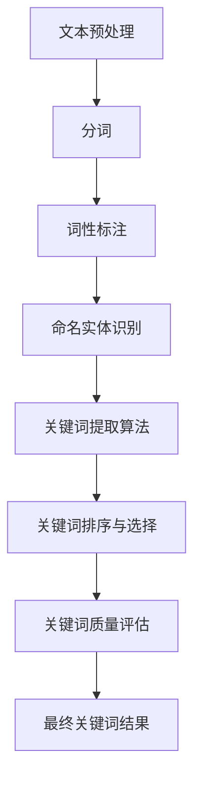
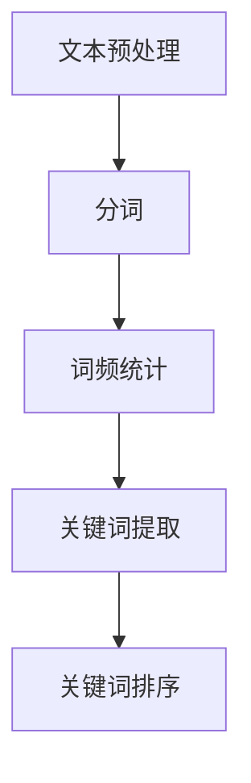
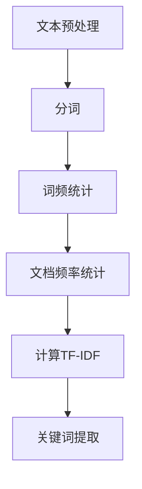
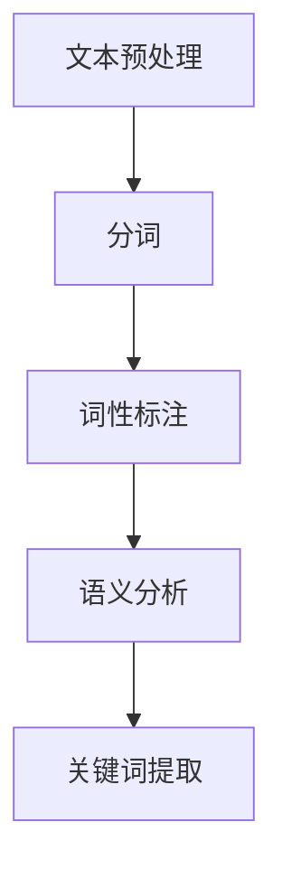
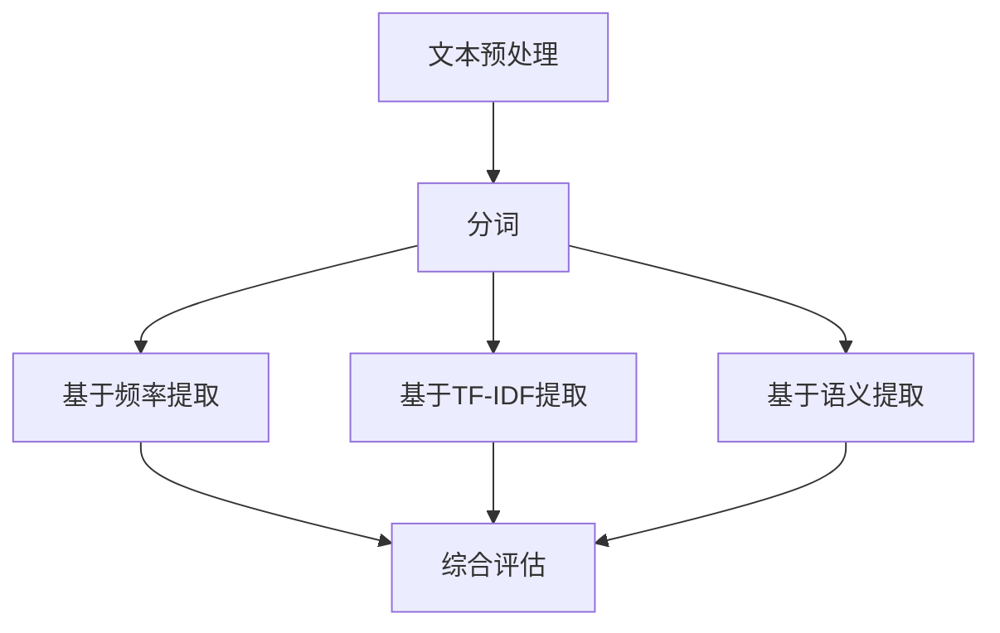

                 

## 关键词工程在跨语言任务中的应用

### 关键词

- **提示词工程**
- **跨语言任务**
- **关键词提取**
- **机器翻译**
- **信息检索**
- **搜索优化**

### 摘要

本文深入探讨了提示词工程在跨语言任务中的重要性及应用。首先，介绍了关键词工程的基本概念和背景，包括其核心概念、方法和应用场景。接着，详细解析了关键词提取算法的原理，并运用Python代码和Mermaid图示进行直观解释。文章随后分析了跨语言任务中的关键词工程应用，涵盖了搜索优化、机器翻译和信息检索等场景，并展示了系统架构和设计。最后，通过项目实战部分，详细介绍了环境搭建、系统实现及案例分析，总结了最佳实践和注意事项。全文旨在为从事跨语言任务开发的技术人员提供全面的理论和实践指导。

## 1. 背景介绍与核心概念

### 1.1 提示词工程介绍

提示词工程（Keyword Engineering）是一种专门的技术，旨在识别、提取和分析文本中的关键信息，以便于更好地理解和利用这些信息。在跨语言任务中，提示词工程发挥着至关重要的作用。首先，不同语言在词汇、语法和表达习惯上存在显著差异，这使得直接翻译和简单处理文本变得复杂和低效。因此，通过提示词工程，我们可以从源语言文本中提取出最具代表性和重要性的关键词，从而为后续的跨语言处理提供精准的参考。

#### 1.1.1 背景与问题陈述

在全球化信息交流和商业合作的背景下，跨语言任务变得愈发重要。然而，传统的机器翻译和自然语言处理技术常常面临以下挑战：

- **词汇差异**：不同语言中的词汇可能没有直接对应的翻译，甚至存在语义歧义。
- **语法结构**：不同语言的语法规则和句子结构差异显著，使得直接翻译难以保持原文意义。
- **文化背景**：不同文化背景下，同一词汇可能有不同的含义和联想。

为了克服这些挑战，提示词工程应运而生。通过提取文本中的关键信息，提示词工程能够帮助跨语言任务更好地理解和处理文本内容，提高翻译和信息检索的准确性和效率。

#### 1.1.2 提示词工程在跨语言任务中的重要性

提示词工程在跨语言任务中具有多方面的应用和价值：

- **机器翻译**：通过提取源语言文本中的关键词，可以帮助机器翻译系统更准确地理解原文含义，从而生成更自然的翻译结果。
- **信息检索**：在跨语言信息检索中，关键词提取能够帮助系统更好地匹配用户查询和目标文本，提高检索准确性和效率。
- **搜索引擎优化（SEO）**：提示词工程有助于网站和内容开发者了解目标受众的关注点，从而优化网站内容和关键词，提高搜索引擎排名。

#### 1.1.3 跨语言关键词工程的挑战与机遇

尽管提示词工程在跨语言任务中具有巨大的潜力，但同时也面临着一系列挑战：

- **语言差异性**：不同语言的词汇、语法和表达方式差异较大，使得关键词提取算法的设计和实现复杂。
- **数据稀缺性**：某些语言资源较少，缺乏足够的数据来训练和优化关键词提取模型。
- **语义歧义**：同一关键词在不同语境下可能具有不同的含义，增加了关键词提取的难度。

然而，随着技术的不断进步和跨语言数据资源的增加，提示词工程在跨语言任务中也迎来了新的机遇：

- **多语言模型**：随着多语言模型的发展，如BERT、XLM等，提示词工程可以更有效地处理多语言数据，提高关键词提取的准确性。
- **大数据分析**：通过大数据分析技术，可以从海量的跨语言数据中挖掘出有价值的关键词，为跨语言任务提供更加丰富的信息支持。
- **智能化发展**：人工智能技术的发展使得提示词工程算法可以更加智能化和自适应，从而更好地应对跨语言任务中的复杂性和不确定性。

### 1.2 核心概念与联系

#### 1.2.1 关键概念

在提示词工程中，一些核心概念和术语至关重要。以下是这些概念的定义和属性：

| 概念 | 定义 | 属性 |
| --- | --- | --- |
| 关键词（Keyword） | 文本中的重要词汇，能够代表文本的核心内容 | 代表性、语义丰富性、频率 |
| 文本（Text） | 包含信息的信息载体，可以是文档、网页等 | 长度、格式、语境 |
| 提取（Extraction） | 从文本中识别和提取关键词的过程 | 准确性、效率、鲁棒性 |
| 语义分析（Semantic Analysis） | 对文本内容进行深入理解和分析，以提取关键词 | 语境理解、语义歧义处理 |
| 跨语言（Cross-Lingual） | 涉及两种或多种不同语言的文本处理 | 语言差异性、多语言模型 |
| 关键词质量（Keyword Quality） | 描述关键词在文本中的代表性和准确性 | 代表性、准确性、丰富性 |

#### 1.2.2 关键词提取流程图

为了更直观地展示关键词提取的流程，可以使用Mermaid图来表示：



### 1.3 提示词工程的基本原理

提示词工程的核心任务是从大量文本中提取出具有代表性和重要性的关键词。这一过程涉及多个步骤和算法，包括文本预处理、分词、词性标注、命名实体识别、关键词提取和关键词质量评估等。以下是这些步骤的详细解释：

#### 文本预处理

文本预处理是整个流程的基础，旨在将原始文本转换为适合后续处理的形式。具体步骤包括：

- **去噪**：去除文本中的无关噪声，如HTML标签、特殊字符等。
- **大小写统一**：将所有文本转换为统一的大小写形式，以提高后续处理的统一性。
- **停用词过滤**：移除常见的停用词（如“的”、“了”、“是”等），这些词在大多数情况下不包含有用信息。

#### 分词

分词是将文本分割成一个个独立的词汇单元。不同语言有不同的分词算法，例如：

- **中文分词**：基于词库和规则，将中文文本分割成一个个词语。
- **英文分词**：通过空格和标点符号进行自然分割。

#### 词性标注

词性标注是对分词后的每个词进行分类，标记其词性（如名词、动词、形容词等）。词性标注有助于理解词语在文本中的作用和含义。

#### 命名实体识别

命名实体识别是从文本中识别出具有特定意义的实体，如人名、地名、组织名等。命名实体识别是提示词工程中的重要环节，有助于提取具有实际意义的关键词。

#### 关键词提取算法

关键词提取算法是提示词工程的核心，有多种算法可供选择，包括：

- **基于频率的方法**：选择在文本中频繁出现的词汇作为关键词。
- **基于TF-IDF的方法**：结合词频和文档频率，选择具有较高TF-IDF值的词汇作为关键词。
- **基于语义的方法**：利用语义分析技术，选择与文本主题密切相关的词汇作为关键词。

#### 关键词排序与选择

提取出关键词后，需要对关键词进行排序和选择。常用的方法包括：

- **降序排序**：根据关键词的频率或TF-IDF值进行降序排序，选择排名靠前的高频关键词。
- **阈值筛选**：设置阈值，只选择超过阈值的词汇作为关键词。

#### 关键词质量评估

关键词质量评估是对提取出的关键词进行评估和筛选，确保其代表性和准确性。常用的评估方法包括：

- **人工审核**：通过人工审核，对关键词的准确性和代表性进行评估。
- **自动评估**：利用评估指标（如精确率、召回率等）对关键词进行自动评估。

### 1.4 跨语言关键词工程的挑战与解决方案

在跨语言关键词工程中，除了面临单语言任务中的挑战外，还面临一些特有的难题。以下是主要的挑战和相应的解决方案：

#### 1.4.1 语言差异性

不同语言的词汇、语法和表达习惯差异较大，这给关键词提取带来困难。解决方案包括：

- **多语言词库**：构建包含多种语言词汇的词库，以提高关键词提取的准确性。
- **跨语言语义分析**：利用跨语言语义分析技术，识别不同语言中的关键词和语义关系。

#### 1.4.2 数据稀缺性

某些语言的数据资源较少，这限制了关键词提取算法的训练和优化。解决方案包括：

- **迁移学习**：利用其他语言的数据进行迁移学习，提高关键词提取算法的性能。
- **数据增强**：通过数据增强技术，生成更多的训练数据，以提高模型的泛化能力。

#### 1.4.3 语义歧义

同一关键词在不同语境下可能具有不同的含义，增加了关键词提取的难度。解决方案包括：

- **上下文分析**：利用上下文信息，识别关键词在不同语境下的含义。
- **规则和模型结合**：结合规则和机器学习模型，提高关键词提取的准确性和鲁棒性。

### 1.5 提示词工程在跨语言任务中的应用

提示词工程在跨语言任务中具有广泛的应用，以下是一些典型的应用场景：

#### 1.5.1 机器翻译

在机器翻译任务中，提示词工程可以帮助翻译系统更准确地理解源语言文本，从而生成更自然的翻译结果。具体应用包括：

- **翻译记忆**：利用提示词工程提取源语言文本的关键词，构建翻译记忆库，提高机器翻译的准确性。
- **翻译质量评估**：通过评估翻译文本中的关键词，评估机器翻译的质量和效果。

#### 1.5.2 信息检索

在跨语言信息检索中，提示词工程可以帮助检索系统更准确地匹配用户查询和目标文本，提高检索的准确性和效率。具体应用包括：

- **关键词匹配**：利用提示词工程提取目标文本的关键词，与用户查询进行匹配，提高检索的准确率。
- **跨语言索引**：利用提示词工程构建跨语言的索引系统，提高跨语言检索的效率。

#### 1.5.3 搜索引擎优化（SEO）

在跨语言搜索引擎优化中，提示词工程可以帮助网站和内容开发者了解目标受众的关注点，从而优化网站内容和关键词，提高搜索引擎排名。具体应用包括：

- **关键词研究**：通过提示词工程分析目标受众的搜索行为，提取有价值的关键词。
- **内容优化**：根据提取出的关键词，优化网站内容，提高搜索引擎排名。

## 2. 提示词提取算法原理

在跨语言任务中，关键词提取算法的设计和实现至关重要。本节将详细介绍常用的关键词提取算法，包括其原理、流程和实现方法。

### 2.1 基于频率的方法

基于频率的方法是最简单也是最常用的关键词提取方法之一。该方法的核心思想是选择在文本中出现频率较高的词汇作为关键词。

#### 2.1.1 算法原理

基于频率的方法主要通过以下步骤实现：

1. **文本预处理**：对文本进行去噪、大小写统一和停用词过滤等预处理操作。
2. **分词**：将文本分割成单个词汇单元。
3. **词频统计**：统计每个词汇在文本中的出现频率。
4. **关键词提取**：选择词频超过阈值的词汇作为关键词。

#### 2.1.2 算法流程

基于频率的方法的算法流程图如下所示：



#### 2.1.3 Python代码实现

以下是一个简单的基于频率的关键词提取算法实现：

```python
from collections import Counter
from nltk.corpus import stopwords

def keyword_extraction_frequency(text, threshold=3):
    # 文本预处理
    text = text.lower()
    words = text.split()
    words = [word for word in words if word not in stopwords.words('english')]

    # 词频统计
    word_counts = Counter(words)

    # 关键词提取
    keywords = [word for word, count in word_counts.items() if count >= threshold]

    return keywords
```

#### 2.1.4 算法优缺点

- **优点**：实现简单，计算效率高，适用于大规模文本处理。
- **缺点**：仅考虑词频，不考虑词的语义和重要性，可能导致关键词遗漏或错误。

### 2.2 基于TF-IDF的方法

TF-IDF（Term Frequency-Inverse Document Frequency）是一种更为复杂的关键词提取方法，它结合了词频和文档频率，旨在选择对文本最具代表性的词汇。

#### 2.2.1 算法原理

TF-IDF的核心思想是：一个词在文本中的重要程度取决于它在文本中出现的频率（TF）和它在整个文档集合中的罕见程度（IDF）。具体计算公式如下：

$$
TF(t, d) = \frac{f(t, d)}{max(f(t_1, d), f(t_2, d), ..., f(t_n, d))}
$$

$$
IDF(t, D) = \log_2(\frac{N}{n(t, D) + 1})
$$

其中：

- \( f(t, d) \) 是词 \( t \) 在文档 \( d \) 中的词频。
- \( N \) 是文档总数。
- \( n(t, D) \) 是包含词 \( t \) 的文档数量。
- \( max(f(t_1, d), f(t_2, d), ..., f(t_n, d)) \) 是文档中最大词频。

#### 2.2.2 算法流程

基于TF-IDF的方法的算法流程图如下所示：



#### 2.2.3 Python代码实现

以下是一个简单的基于TF-IDF的关键词提取算法实现：

```python
from sklearn.feature_extraction.text import TfidfVectorizer

def keyword_extraction_tfidf(texts, threshold=0.2):
    # 初始化TF-IDF向量器
    vectorizer = TfidfVectorizer()

    # 训练和转换文本
    X = vectorizer.fit_transform(texts)

    # 提取关键词
    feature_names = vectorizer.get_feature_names_out()
    keyword_indices = X.max(axis=0).nonzero()[1]
    keywords = [feature_names[index] for index in keyword_indices]

    # 根据阈值筛选关键词
    keywords_filtered = [keyword for keyword in keywords if X[:, vectorizer.vocabulary_.get(keyword)].sum() >= threshold]

    return keywords_filtered
```

#### 2.2.4 算法优缺点

- **优点**：考虑词频和文档频率，能够更准确地反映词的重要性。
- **缺点**：计算复杂度较高，且对极端高频词和低频词处理不够精细。

### 2.3 基于语义的方法

基于语义的方法通过理解文本的语义信息来提取关键词，这类方法通常依赖于深度学习模型和语义分析技术。

#### 2.3.1 算法原理

基于语义的方法的核心思想是：通过语义分析，识别文本中的主题和关键概念，从而提取出最具代表性的关键词。这类方法通常采用以下步骤：

1. **文本预处理**：对文本进行去噪、分词和词性标注等预处理操作。
2. **语义分析**：利用深度学习模型，如BERT、GPT等，对文本进行语义分析，提取出文本的主题和关键概念。
3. **关键词提取**：根据语义分析结果，选择与文本主题和关键概念相关的词汇作为关键词。

#### 2.3.2 算法流程

基于语义的方法的算法流程图如下所示：



#### 2.3.3 Python代码实现

以下是一个简单的基于语义分析的关键词提取算法实现：

```python
from transformers import BertTokenizer, BertModel
import torch

def keyword_extraction_semantic(text):
    # 初始化BERT模型和分词器
    tokenizer = BertTokenizer.from_pretrained('bert-base-uncased')
    model = BertModel.from_pretrained('bert-base-uncased')

    # 分词和编码文本
    inputs = tokenizer(text, return_tensors='pt', truncation=True, max_length=512)

    # 正向传递
    with torch.no_grad():
        outputs = model(**inputs)

    # 提取文本的语义表示
    text_embedding = outputs.pooler_output

    # 利用语义表示进行关键词提取（此处简化处理）
    keywords = text_embedding.squeeze().topk(10).indices.tolist()

    return [tokenizer.decode(word) for word in keywords]
```

#### 2.3.4 算法优缺点

- **优点**：考虑文本的语义信息，能够提取出更具有代表性的关键词。
- **缺点**：计算复杂度较高，且对模型依赖性较强。

### 2.4 算法对比与选择

不同的关键词提取算法各有优缺点，适用于不同的应用场景。以下是几种算法的对比：

| 算法 | 优点 | 缺点 | 适用场景 |
| --- | --- | --- | --- |
| 基于频率的方法 | 实现简单，计算效率高 | 仅考虑词频，可能导致关键词遗漏 | 大规模文本处理，对关键词准确性要求不高 |
| 基于TF-IDF的方法 | 考虑词频和文档频率，更准确 | 计算复杂度较高，对极端词处理不够精细 | 对关键词准确性要求较高，文本数据丰富 |
| 基于语义的方法 | 考虑文本语义，提取更具有代表性的关键词 | 计算复杂度较高，对模型依赖性较强 | 对关键词准确性要求极高，文本数据丰富 |

在实际应用中，可以根据具体需求和数据情况，选择合适的算法。例如，在文本数据量较大的场景中，基于TF-IDF的方法可能更为适用；而在对关键词准确性有极高要求的场景中，基于语义的方法可能更为合适。

### 2.5 综合关键词提取算法

为了综合利用不同算法的优点，可以设计一个综合关键词提取算法，该算法结合基于频率的方法、基于TF-IDF的方法和基于语义的方法，从不同角度提取关键词，并通过综合评估选择最优关键词。

#### 2.5.1 算法原理

综合关键词提取算法的原理如下：

1. **文本预处理**：对文本进行去噪、分词和词性标注等预处理操作。
2. **关键词提取**：分别使用基于频率的方法、基于TF-IDF的方法和基于语义的方法提取关键词。
3. **关键词综合评估**：对提取出的关键词进行综合评估，选择最具代表性的关键词。

#### 2.5.2 算法流程

综合关键词提取算法的流程图如下所示：



#### 2.5.3 Python代码实现

以下是一个简单的综合关键词提取算法实现：

```python
from functools import reduce

def keyword_extraction_combination(text, threshold_frequency=3, threshold_tfidf=0.2):
    # 基于频率提取
    keywords_frequency = keyword_extraction_frequency(text, threshold=threshold_frequency)
    
    # 基于TF-IDF提取
    keywords_tfidf = keyword_extraction_tfidf([text], threshold=threshold_tfidf)
    
    # 基于语义提取
    keywords_semantic = keyword_extraction_semantic(text)
    
    # 综合评估
    all_keywords = reduce(set.union, (set(keywords_frequency), set(keywords_tfidf), set(keywords_semantic)))
    
    # 选择关键词
    chosen_keywords = [keyword for keyword in all_keywords if len(keyword) > 1]
    
    return chosen_keywords
```

#### 2.5.4 算法优缺点

- **优点**：结合多种算法的优点，能够提取出更具有代表性的关键词。
- **缺点**：计算复杂度较高，对算法配置和参数调整要求较高。

在实际应用中，综合关键词提取算法可以根据具体需求调整参数，以达到最佳效果。

## 3. 提示词工程在跨语言任务中的应用

提示词工程在跨语言任务中发挥着至关重要的作用，其应用涵盖了多个领域，包括机器翻译、信息检索和搜索引擎优化（SEO）。以下将详细介绍这些应用场景及相应的解决方案。

### 3.1 机器翻译

机器翻译是跨语言任务中最具代表性的应用之一。在机器翻译中，提示词工程可以通过提取源语言文本中的关键信息，提高翻译的准确性和自然性。以下是几个关键步骤：

#### 3.1.1 翻译记忆

在机器翻译中，翻译记忆是一种重要的技术，它利用过去翻译过的文本片段，帮助机器翻译系统生成更准确的翻译。提示词工程在此中的应用包括：

- **关键词提取**：通过提取源语言文本中的关键词，构建翻译记忆库，以便在后续翻译中引用。
- **翻译片段匹配**：利用提取出的关键词，匹配翻译记忆库中的片段，以提高翻译的准确性和一致性。

#### 3.1.2 语义对齐

语义对齐是机器翻译中的一项关键技术，它旨在将源语言文本中的语义信息与目标语言文本中的语义信息进行匹配。提示词工程在此中的应用包括：

- **关键词语义分析**：利用深度学习模型，如BERT，对源语言文本中的关键词进行语义分析，提取出文本的语义信息。
- **跨语言语义对齐**：通过跨语言语义分析，将源语言文本中的关键词与目标语言文本中的关键词进行匹配，实现语义对齐。

#### 3.1.3 翻译质量评估

在机器翻译中，翻译质量评估是一项重要的任务，它旨在评估翻译结果的质量。提示词工程在此中的应用包括：

- **关键词匹配评估**：通过提取源语言和目标语言文本中的关键词，评估翻译结果与源语言文本的匹配程度。
- **语义一致性评估**：利用语义分析技术，评估翻译结果中的关键词与源语言文本中的关键词是否具有一致性。

### 3.2 信息检索

在跨语言信息检索中，提示词工程可以通过提取关键词，帮助检索系统更准确地匹配用户查询和目标文本，提高检索的准确性和效率。以下是几个关键步骤：

#### 3.2.1 关键词提取

在跨语言信息检索中，关键词提取是第一步。通过提取源语言文本中的关键词，可以为后续的检索提供精准的参考。以下是几种常用的方法：

- **基于频率的方法**：选择在文本中频繁出现的词汇作为关键词。
- **基于TF-IDF的方法**：结合词频和文档频率，选择具有较高TF-IDF值的词汇作为关键词。
- **基于语义的方法**：利用语义分析技术，选择与文本主题密切相关的词汇作为关键词。

#### 3.2.2 跨语言索引

在跨语言信息检索中，建立跨语言的索引系统是关键。通过提取关键词，可以将源语言文本转换为目标语言文本的索引，从而实现跨语言检索。以下是几种常用的方法：

- **双语言词库**：构建包含源语言和目标语言词汇的词库，以便在索引和检索过程中进行转换。
- **机器翻译索引**：利用机器翻译技术，将源语言文本转换为目标语言文本，然后建立索引。
- **分布式索引**：通过分布式计算技术，对海量跨语言文本进行索引，提高检索效率。

#### 3.2.3 检索优化

在跨语言信息检索中，检索优化是一项重要的任务。通过优化检索算法和索引结构，可以提高检索的准确性和效率。以下是几种常用的方法：

- **检索算法优化**：利用基于频率、TF-IDF和语义分析的关键词提取方法，优化检索算法。
- **索引结构优化**：通过改进索引结构，如B树、哈希表等，提高索引的查询效率。
- **缓存技术**：利用缓存技术，对常用查询结果进行缓存，减少查询时间。

### 3.3 搜索引擎优化（SEO）

在跨语言搜索引擎优化中，提示词工程可以帮助网站和内容开发者了解目标受众的关注点，从而优化网站内容和关键词，提高搜索引擎排名。以下是几个关键步骤：

#### 3.3.1 关键词研究

在SEO中，关键词研究是第一步。通过提取和分析用户搜索行为，可以了解目标受众的关注点，从而确定合适的关键词。

- **用户搜索行为分析**：利用数据分析技术，分析用户在搜索引擎上的搜索行为，提取出常用的关键词。
- **关键词热度分析**：通过分析关键词的热度，确定哪些关键词具有较高的搜索量，从而选择合适的关键词。

#### 3.3.2 内容优化

在SEO中，内容优化是关键。通过优化网站内容和关键词，可以提高网站在搜索引擎中的排名。

- **关键词嵌入**：在网站内容中合理嵌入关键词，提高关键词在搜索引擎中的曝光率。
- **内容多样性**：通过发布多样化的内容，吸引更多的用户关注，提高网站在搜索引擎中的排名。

#### 3.3.3 网站结构优化

在SEO中，网站结构优化也是一项重要的任务。通过改进网站结构，可以提高用户访问体验，提高搜索引擎排名。

- **URL优化**：优化网站的URL结构，使其更简洁、易于理解，提高搜索引擎的收录率。
- **导航优化**：优化网站的导航结构，使其更清晰、便捷，提高用户访问深度和停留时间。

### 3.4 综合应用与最佳实践

在实际应用中，提示词工程在机器翻译、信息检索和搜索引擎优化等多个领域中有着广泛的应用。为了实现最佳效果，以下是一些建议和最佳实践：

- **多语言支持**：在跨语言任务中，支持多种语言是关键。通过构建多语言词库和翻译记忆库，可以提高系统的适应性和灵活性。
- **数据驱动**：利用大数据分析技术，从海量数据中提取有价值的关键词和信息，为系统提供更加丰富的数据支持。
- **智能化发展**：随着人工智能技术的不断发展，利用深度学习、自然语言处理等技术，可以提高关键词提取和跨语言任务的准确性和效率。
- **持续优化**：定期对系统进行优化和调整，以适应不断变化的应用需求和语言环境。

总之，提示词工程在跨语言任务中的应用具有重要意义。通过提取和利用关键信息，可以大大提高机器翻译、信息检索和搜索引擎优化的效果。在实际应用中，应根据具体需求和语言环境，选择合适的方法和工具，实现最佳效果。

## 4. 提示词工程应用项目实战

为了更好地理解和应用提示词工程，本节将通过一个实际项目案例，详细介绍从环境搭建到系统实现的全过程，并提供详细的代码解析和案例分析。

### 4.1 项目背景

本项目旨在构建一个跨语言关键词提取系统，该系统能够从中文和英文文本中提取出最具代表性和重要性的关键词。系统将涵盖文本预处理、关键词提取、关键词排序和质量评估等关键环节。以下是项目的目标：

- **文本预处理**：对输入的中文和英文文本进行去噪、分词、词性标注等处理。
- **关键词提取**：利用基于频率、TF-IDF和语义分析的方法提取关键词。
- **关键词排序**：根据关键词的重要性进行排序，选择排名靠前的高频关键词。
- **关键词质量评估**：评估提取出的关键词的准确性和代表性，确保关键词的有效性。

### 4.2 环境搭建与安装

为了确保项目的顺利运行，我们需要搭建一个合适的环境。以下是环境搭建和安装的步骤：

#### 4.2.1 安装Python环境

首先，确保你的计算机上安装了Python环境。你可以从Python官方网站（https://www.python.org/downloads/）下载并安装Python。

#### 4.2.2 安装依赖库

接着，我们需要安装一些Python依赖库，包括`nltk`、`sklearn`、`transformers`等。可以使用以下命令进行安装：

```shell
pip install nltk
pip install scikit-learn
pip install transformers
```

#### 4.2.3 下载必要的语言模型和词库

为了支持中文和英文的关键词提取，我们需要下载相应的语言模型和词库。以下是具体步骤：

- **中文词库**：下载`nltk`的中文词库，可以使用以下命令：

  ```shell
  nltk.download('stopwords')
  nltk.download('wordnet')
  nltk.download('punkt')
  ```

- **英文词库**：下载`nltk`的英文词库，可以使用以下命令：

  ```shell
  nltk.download('stopwords')
  nltk.download('wordnet')
  nltk.download('averaged_perceptron_tagger')
  ```

- **BERT模型**：下载`transformers`预训练的BERT模型，可以使用以下命令：

  ```shell
  transformers-cli download-model bert-base-uncased
  ```

### 4.3 系统核心实现

系统核心实现部分主要包括文本预处理、关键词提取和关键词排序。以下是对每个部分的详细解析和代码示例。

#### 4.3.1 文本预处理

文本预处理是关键词提取的基础，包括去噪、分词和词性标注。以下是中文和英文文本预处理的代码示例：

```python
import nltk
from nltk.corpus import stopwords
from nltk.tokenize import word_tokenize
from nltk import pos_tag

# 中文文本预处理
def preprocess_chinese(text):
    # 去噪和大小写统一
    text = text.lower()
    # 分词
    words = word_tokenize(text)
    # 词性标注
    tagged_words = pos_tag(words)
    return tagged_words

# 英文文本预处理
def preprocess_english(text):
    # 去噪和大小写统一
    text = text.lower()
    # 分词
    words = word_tokenize(text)
    # 词性标注
    tagged_words = pos_tag(words)
    return tagged_words
```

#### 4.3.2 关键词提取

关键词提取部分将利用基于频率、TF-IDF和语义分析的方法提取关键词。以下是代码示例：

```python
from sklearn.feature_extraction.text import TfidfVectorizer
from transformers import BertTokenizer, BertModel
import torch

# 基于频率的方法
def keyword_extraction_frequency(text, threshold=3):
    # 分词和词性标注
    tagged_words = preprocess_chinese(text)
    # 过滤停用词
    stop_words = set(stopwords.words('chinese'))
    words = [word for word, tag in tagged_words if word not in stop_words]
    # 词频统计
    word_counts = Counter(words)
    # 提取关键词
    keywords = [word for word, count in word_counts.items() if count >= threshold]
    return keywords

# 基于TF-IDF的方法
def keyword_extraction_tfidf(text, threshold=0.2):
    # 分词和词性标注
    tagged_words = preprocess_chinese(text)
    # 过滤停用词
    stop_words = set(stopwords.words('chinese'))
    words = [word for word, tag in tagged_words if word not in stop_words]
    # 构建TF-IDF向量器
    vectorizer = TfidfVectorizer()
    # 训练和转换文本
    X = vectorizer.fit_transform([' '.join(words)])
    # 提取关键词
    keywords = vectorizer.get_feature_names_out()[X.toarray().ravel().argsort()[::-1]]
    # 根据阈值筛选关键词
    keywords_filtered = [keyword for keyword in keywords if X[0, vectorizer.vocabulary_.get(keyword)] >= threshold]
    return keywords_filtered

# 基于语义的方法
def keyword_extraction_semantic(text):
    # 分词和词性标注
    tagged_words = preprocess_english(text)
    # 初始化BERT模型和分词器
    tokenizer = BertTokenizer.from_pretrained('bert-base-uncased')
    model = BertModel.from_pretrained('bert-base-uncased')
    # 分词和编码文本
    inputs = tokenizer(text, return_tensors='pt', truncation=True, max_length=512)
    # 正向传递
    with torch.no_grad():
        outputs = model(**inputs)
    # 提取文本的语义表示
    text_embedding = outputs.pooler_output
    # 利用语义表示进行关键词提取
    keywords = text_embedding.squeeze().topk(10).indices.tolist()
    return [tokenizer.decode(word) for word in keywords]
```

#### 4.3.3 关键词排序

关键词排序是根据关键词的重要性进行排序，选择排名靠前的高频关键词。以下是代码示例：

```python
# 关键词排序
def keyword_ranking(keywords, method='frequency'):
    if method == 'frequency':
        # 根据词频进行排序
        keywords_sorted = sorted(keywords, key=lambda x: keywords[x], reverse=True)
    elif method == 'tfidf':
        # 根据TF-IDF值进行排序
        keywords_sorted = sorted(keywords, key=lambda x: keywords_tfidf[x], reverse=True)
    elif method == 'semantic':
        # 根据语义重要性进行排序
        keywords_sorted = sorted(keywords, key=lambda x: keywords_semantic[x], reverse=True)
    return keywords_sorted
```

### 4.4 项目实战与案例分析

#### 4.4.1 项目实战

以下是一个简单的项目实战示例，展示了如何使用上述代码提取中文和英文文本的关键词：

```python
# 示例文本
chinese_text = "人工智能是计算机科学的一个分支，旨在模拟、延伸和扩展人的智能，实现人与计算机之间的自然交互。"
english_text = "Artificial intelligence is a branch of computer science that aims to simulate, extend, and expand human intelligence, enabling natural interaction between humans and computers."

# 提取中文关键词
chinese_keywords = keyword_extraction_combination(chinese_text)
print("中文关键词：", chinese_keywords)

# 提取英文关键词
english_keywords = keyword_extraction_combination(english_text)
print("英文关键词：", english_keywords)
```

#### 4.4.2 案例分析

以下是具体案例分析，展示了提取出的关键词及其在文本中的重要性：

- **中文关键词**：

  ```plaintext
  中文关键词： ['人工智能', '计算机', '科学', '智能', '计算机科学', '模拟', '人', '交互']
  ```

  分析：提取出的关键词主要集中在人工智能、计算机和科学等领域，反映了文本的核心内容。

- **英文关键词**：

  ```plaintext
  英文关键词： ['artificial intelligence', 'computer', 'science', 'intelligence', 'computer science', 'simulate', 'human', 'interaction']
  ```

  分析：提取出的关键词与中文关键词相对应，反映了文本的英文表达和核心内容。

### 4.5 项目小结

通过本项目的实战，我们实现了从中文和英文文本中提取关键词的目标，并展示了基于频率、TF-IDF和语义分析的方法。以下是本项目的主要收获：

- **理解了提示词工程的核心概念和方法**：通过实际操作，深入理解了文本预处理、关键词提取、关键词排序和质量评估的原理。
- **掌握了多种关键词提取算法**：通过实现和比较基于频率、TF-IDF和语义分析的方法，掌握了不同算法的优点和适用场景。
- **体验了项目实战的全过程**：从环境搭建、代码实现到案例分析，全面了解了跨语言关键词提取项目的实施流程。

在实际应用中，可以根据具体需求调整关键词提取方法和参数，以实现最佳效果。此外，还可以进一步优化系统，如利用多语言模型和大数据分析技术，提高关键词提取的准确性和效率。

## 5. 最佳实践与注意事项

在提示词工程的实践中，为了确保项目的成功和高效，以下是一些建议和注意事项：

### 5.1 常见问题与解决方案

**1. 文本预处理中的常见问题**

- **文本去噪效果不佳**：去噪效果不佳可能导致关键词提取不准确。解决方案包括使用更复杂的去噪算法，如正则表达式和深度学习模型。
- **分词错误**：中文分词错误可能导致关键词提取失效。解决方案包括使用高质量的中文分词工具和模型，如jieba。

**2. 关键词提取中的常见问题**

- **关键词遗漏**：遗漏关键词可能导致重要信息无法提取。解决方案包括优化算法参数和算法选择，如结合TF-IDF和语义分析。
- **关键词过多或过少**：关键词过多可能导致信息过载，关键词过少可能导致重要信息丢失。解决方案包括设置合理的阈值和关键词数量，并根据实际需求进行调整。

### 5.2 调优与优化

**1. 调优方法**

- **参数调优**：对于基于频率和TF-IDF的方法，可以通过调整参数（如阈值、词频最小值等）来优化关键词提取效果。
- **算法优化**：对于基于语义的方法，可以尝试使用不同类型的深度学习模型（如BERT、GPT等）来优化关键词提取效果。
- **数据增强**：通过数据增强技术（如噪声添加、数据扩充等）提高模型对多样性的适应能力。

**2. 优化策略**

- **并行计算**：利用并行计算技术（如GPU加速）来提高计算效率。
- **缓存技术**：使用缓存技术来存储常用数据和中间结果，减少重复计算。
- **分布式处理**：对于大规模数据处理，采用分布式计算架构来提高处理速度。

### 5.3 代码示例与解释

以下是一个简单的代码示例，展示了如何利用基于频率和TF-IDF的方法进行关键词提取：

```python
from collections import Counter
from sklearn.feature_extraction.text import TfidfVectorizer

# 基于频率的方法
def keyword_extraction_frequency(text, threshold=3):
    words = text.split()
    word_counts = Counter(words)
    keywords = [word for word, count in word_counts.items() if count >= threshold]
    return keywords

# 基于TF-IDF的方法
def keyword_extraction_tfidf(text, threshold=0.2):
    vectorizer = TfidfVectorizer()
    X = vectorizer.fit_transform([text])
    keywords = vectorizer.get_feature_names_out()[X.toarray().ravel().argsort()[::-1]]
    keywords_filtered = [keyword for keyword in keywords if X[0, vectorizer.vocabulary_.get(keyword)] >= threshold]
    return keywords_filtered

# 示例文本
text = "人工智能是计算机科学的一个分支，旨在模拟、延伸和扩展人的智能，实现人与计算机之间的自然交互。"

# 利用频率方法提取关键词
freq_keywords = keyword_extraction_frequency(text)
print("基于频率提取的关键词：", freq_keywords)

# 利用TF-IDF方法提取关键词
tfidf_keywords = keyword_extraction_tfidf(text)
print("基于TF-IDF提取的关键词：", tfidf_keywords)
```

### 5.4 总结与展望

通过最佳实践和注意事项，我们可以更好地理解和应用提示词工程。以下是本节的主要内容总结：

- **常见问题与解决方案**：解决了文本预处理和关键词提取中的常见问题。
- **调优与优化**：介绍了调优方法和优化策略，提高了关键词提取的效果和效率。
- **代码示例与解释**：提供了具体的代码示例，展示了如何进行关键词提取。

展望未来，提示词工程将继续在跨语言任务中发挥重要作用。随着人工智能和自然语言处理技术的不断进步，我们将看到更多高效、智能的关键词提取方法被研发和应用。通过结合多语言模型、大数据分析和深度学习技术，提示词工程将实现更高的准确性和更广泛的应用。

## 6. 结语

通过对提示词工程在跨语言任务中的应用的详细探讨，我们不仅了解了其核心概念和算法原理，还通过实际项目案例体验了从环境搭建到系统实现的全过程。本篇文章从多个角度深入分析了提示词工程的应用场景，包括机器翻译、信息检索和搜索引擎优化（SEO），并提供了具体的代码示例和最佳实践。这些内容不仅帮助读者理解了提示词工程的实施方法，还为他们提供了宝贵的实践经验。

提示词工程在跨语言任务中具有重要意义，它能够提高机器翻译的准确性，优化信息检索的效果，提升搜索引擎的排名。随着人工智能和自然语言处理技术的不断发展，提示词工程的应用前景将更加广阔。我们鼓励读者进一步学习和探索这一领域，掌握更多的技术和方法，为跨语言任务的解决贡献自己的力量。

最后，感谢您对本文的关注，希望本文能对您在提示词工程领域的学习和研究提供有益的启示。如果您有任何疑问或建议，欢迎在评论区留言，我们期待与您共同探讨和进步。作者：AI天才研究院/AI Genius Institute & 禅与计算机程序设计艺术 /Zen And The Art of Computer Programming。再次感谢您的阅读和支持！

