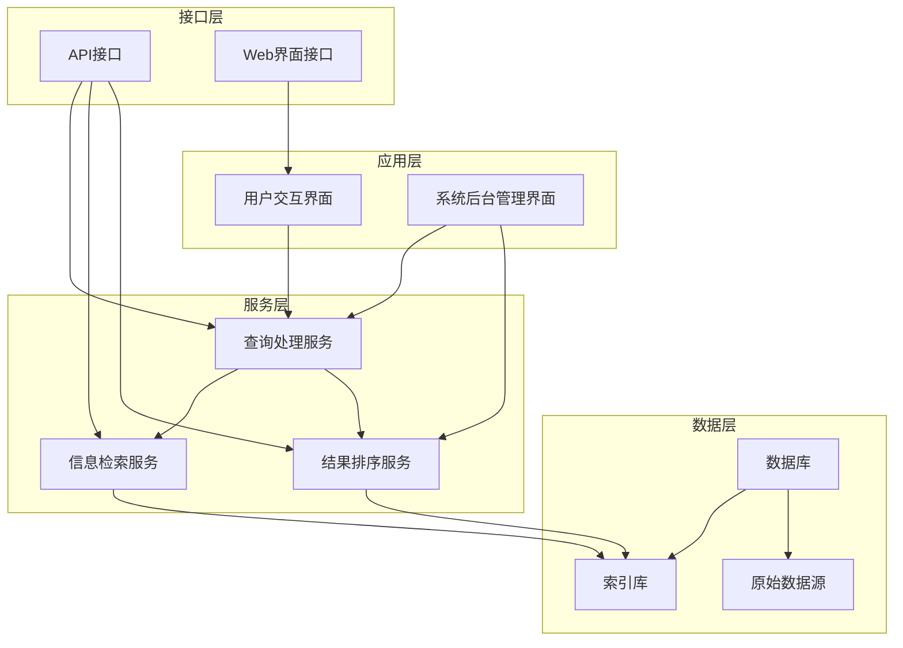
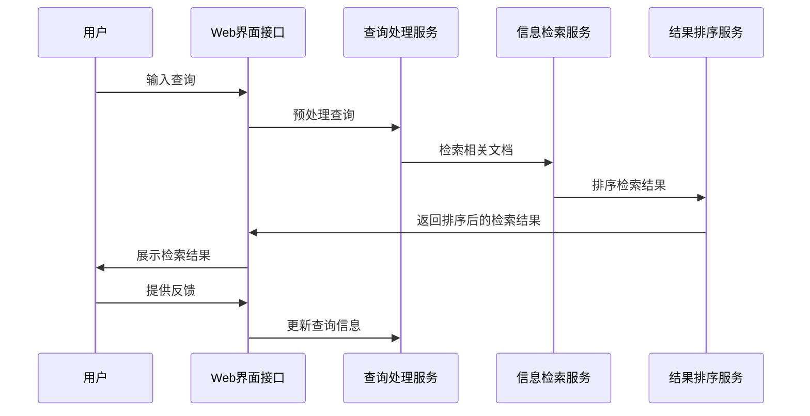

                 

## 文章标题

### 关键词

1. 提示词工程
2. 跨语言信息检索
3. 机器学习
4. 自然语言处理
5. 语义理解

### 摘要

本文将探讨提示词工程在跨语言信息检索中的应用与创新。随着全球化的发展，跨语言信息检索的重要性日益凸显。然而，不同语言间的差异给信息检索带来了诸多挑战。提示词工程作为一种先进的自然语言处理技术，通过优化提示词的设计与选择，能够显著提升跨语言信息检索的效果。本文将从背景介绍、核心概念、关键技术、应用案例、未来趋势等多个角度，系统分析提示词工程在跨语言信息检索中的创新与价值。

## 引言

跨语言信息检索是一个多学科交叉的领域，涉及计算机科学、信息科学、语言学等多个方面。随着全球化的深入发展，人们对于跨语言信息检索的需求日益增长。无论是跨国企业、学术研究机构，还是普通用户，都需要在不同语言间进行信息查询、翻译和交流。然而，不同语言在词汇、语法、语义等方面存在巨大差异，这使得跨语言信息检索面临着诸多挑战。

首先，词汇差异是跨语言信息检索中的一大难题。不同语言之间的词汇量和词汇意义可能存在巨大差异，这导致同义词、多义词和一词多义等问题。其次，语法差异也是一个重要挑战。不同语言的语法结构、句子构造和语法规则存在显著差异，这增加了跨语言信息检索的复杂性。最后，语义理解是跨语言信息检索的另一个关键挑战。不同语言的语义表达方式和语义关系可能存在差异，如何准确理解并处理这些语义差异是提升检索效果的关键。

在传统的跨语言信息检索方法中，主要依赖于基于规则的方法和基于统计的方法。基于规则的方法依赖于语言学知识和人工构建的规则，但这些方法在面对复杂多变的语言现象时效果有限。基于统计的方法则依赖于大规模的语料库和机器学习技术，通过学习语料库中的统计规律来预测语言现象。然而，这些方法在处理跨语言信息检索时仍存在一定的局限性。

随着自然语言处理技术的不断发展，提示词工程作为一种新兴的跨语言信息检索技术逐渐引起了广泛关注。提示词工程通过优化提示词的设计与选择，能够提高信息检索的准确性和效率。提示词是一种用于引导搜索器或解析器进行信息检索的词或短语，其设计质量直接影响检索效果。

本文将围绕提示词工程在跨语言信息检索中的创新展开讨论。首先，我们将介绍提示词工程的基本概念，包括提示词的类型、作用和设计原则。然后，我们将探讨提示词工程的关键技术，如语言模型、语义理解与情感分析等。接下来，我们将分析提示词工程在跨语言检索中的应用案例，并讨论其未来发展趋势。最后，我们将总结提示词工程的最佳实践，并提出注意事项和未来研究建议。

## 背景介绍

### 核心概念术语说明

在深入探讨提示词工程在跨语言信息检索中的创新之前，我们首先需要明确一些核心概念术语，以便为后续讨论打下基础。

**跨语言信息检索**：跨语言信息检索（Cross-Language Information Retrieval，CLIR）是指在不同语言之间进行信息查询、检索和翻译的过程。其主要目标是利用一种语言（源语言）中的查询来检索另一种语言（目标语言）中的文档，从而满足用户在不同语言间的信息需求。

**提示词工程**：提示词工程（Prompt Engineering）是一种自然语言处理技术，旨在通过优化提示词的设计与选择，提高信息检索系统的性能和用户体验。提示词可以是单个词、短语或句子，用于引导搜索器或解析器进行信息检索。

**自然语言处理（NLP）**：自然语言处理（Natural Language Processing，NLP）是计算机科学和人工智能领域的一个分支，旨在让计算机理解和处理自然语言。NLP技术包括文本分类、命名实体识别、情感分析、机器翻译等。

**机器学习（ML）**：机器学习（Machine Learning，ML）是一种通过数据训练模型来预测或决策的技术。在自然语言处理中，机器学习技术被广泛应用于构建语言模型、语义理解模型等。

### 问题背景

随着互联网的快速发展，全球信息量的爆炸性增长使得跨语言信息检索成为了一项迫切需求。无论是在跨国企业、学术研究机构，还是普通用户层面，都需要在不同语言间进行信息查询和交流。然而，不同语言间的差异给跨语言信息检索带来了巨大挑战。

一方面，词汇差异使得同义词、多义词和一词多义等问题频繁出现，这增加了检索的复杂性。例如，英语中的“bank”一词既可以表示银行，也可以表示河岸，而中文中的“健康”一词在不同的语境中可能有不同的含义。另一方面，语法差异导致不同语言之间的句子构造和语法规则存在显著差异，这进一步增加了检索的难度。例如，英语中的句子通常遵循主谓宾的结构，而中文中的句子结构可能更加灵活，有时甚至可以省略主语或谓语。

此外，语义理解是跨语言信息检索的另一个关键挑战。不同语言的语义表达方式和语义关系可能存在差异，如何准确理解并处理这些语义差异是提升检索效果的关键。例如，某些词汇在一种语言中可能具有强烈的情感色彩，而在另一种语言中可能没有这种情感色彩，这会影响检索结果的准确性和相关性。

### 问题描述

在传统的跨语言信息检索方法中，主要依赖于基于规则的方法和基于统计的方法。基于规则的方法通常依赖于语言学知识和人工构建的规则，但这些方法在面对复杂多变的语言现象时效果有限。例如，构建复杂的语法规则来处理不同语言间的语法差异，需要大量的时间和人力资源。此外，基于规则的方法难以适应动态变化的语言环境，其扩展性和灵活性较低。

基于统计的方法则依赖于大规模的语料库和机器学习技术，通过学习语料库中的统计规律来预测语言现象。这种方法在一定程度上能够提高检索效果，但其效果仍受到语料库质量、数据量等因素的限制。例如，在跨语言信息检索中，不同语言间的词汇和语法差异可能导致统计模型无法准确捕捉语言现象，从而影响检索效果。

随着自然语言处理技术的不断发展，提示词工程作为一种新兴的跨语言信息检索技术逐渐引起了广泛关注。提示词工程通过优化提示词的设计与选择，能够提高信息检索系统的性能和用户体验。提示词工程的目标是设计出更加精准、高效的提示词，从而提高检索结果的准确性和相关性。

然而，提示词工程在跨语言信息检索中仍面临一些挑战。首先，不同语言间的词汇和语法差异使得设计通用性强的提示词变得困难。其次，如何选择合适的提示词来优化检索效果仍需要进一步研究。此外，如何评估提示词工程在跨语言信息检索中的效果，以及如何将其与其他自然语言处理技术相结合，也是当前研究的热点问题。

### 问题解决

为了解决跨语言信息检索中的问题，提示词工程提供了一种有效的解决方案。提示词工程通过以下几种方式来优化跨语言信息检索效果：

1. **词汇优化**：通过分析不同语言间的词汇差异，设计出更加精准的提示词，从而减少同义词、多义词和一词多义等问题。例如，可以在提示词中明确指定词汇的含义，或者在提示词中加入上下文信息来消除歧义。

2. **语法优化**：通过分析不同语言间的语法差异，设计出更加符合目标语言语法规则的提示词。例如，在中文检索中，可以设计出符合中文句式结构的提示词，从而提高检索效果。

3. **语义优化**：通过利用自然语言处理技术，如语义理解、情感分析等，分析不同语言间的语义差异，设计出能够准确反映用户意图的提示词。例如，可以通过情感分析来确定提示词的情感色彩，从而提高检索结果的相关性。

4. **机器学习优化**：通过机器学习技术，如深度学习、监督学习等，训练出能够自适应不同语言环境的提示词模型。这种方法可以根据大量语料库中的数据，自动调整和优化提示词的设计，从而提高检索效果。

### 边界与外延

提示词工程在跨语言信息检索中的应用具有明确的边界和外延。其边界主要体现在以下几个方面：

1. **应用场景**：提示词工程主要应用于跨语言信息检索场景，包括跨语言搜索引擎、跨语言问答系统、跨语言机器翻译等。

2. **技术范围**：提示词工程涉及自然语言处理、机器学习、数据挖掘等多个技术领域，需要综合运用多种技术手段来优化提示词的设计和选择。

3. **语言范围**：提示词工程适用于多种语言之间的跨语言信息检索，不仅限于特定的语言对，如中文-英文、中文-日文等。

### 概念结构与核心要素组成

提示词工程的概念结构主要包括以下几个核心要素：

1. **提示词**：提示词是提示词工程的核心元素，用于引导搜索器或解析器进行信息检索。其设计质量直接影响检索效果。

2. **语言模型**：语言模型用于预测文本中的下一个单词或短语，是提示词工程的重要基础。通过训练语言模型，可以自动生成和优化提示词。

3. **语义理解**：语义理解技术用于分析和理解文本的语义含义，包括语义角色标注、实体识别、情感分析等。这些技术有助于提高提示词的语义准确性。

4. **机器学习**：机器学习技术用于训练和优化提示词模型，通过学习大量语料库中的数据，自动调整和优化提示词的设计。

5. **用户交互**：用户交互技术用于收集用户反馈，以进一步优化提示词工程的效果。通过用户反馈，可以调整提示词的设计和选择，提高用户的满意度。

### 小结

本文对提示词工程在跨语言信息检索中的背景、核心概念、问题解决方法、边界与外延以及概念结构进行了详细分析。提示词工程作为一种新兴的自然语言处理技术，通过优化提示词的设计与选择，能够显著提升跨语言信息检索的效果。尽管提示词工程在跨语言信息检索中仍面临一些挑战，但其应用前景十分广阔。在未来的研究中，我们可以进一步探索提示词工程与其他自然语言处理技术的结合，以提高跨语言信息检索的整体性能。

## 核心概念与联系

### 提示词工程的核心概念

提示词工程是自然语言处理领域中的一个重要分支，其核心概念包括提示词、语言模型、语义理解、机器学习等。

**提示词（Prompt）**：提示词是一种引导搜索器或解析器进行信息检索的词或短语。其设计质量直接影响信息检索的效果。一个良好的提示词应具备以下特点：

1. **精准性**：能够准确反映用户查询意图，减少歧义。
2. **上下文敏感性**：能够根据上下文语境调整词义和表达方式。
3. **多样性**：具有多种形式和表达方式，以应对不同场景和需求。

**语言模型（Language Model）**：语言模型是用于预测文本中下一个单词或短语的模型。在提示词工程中，语言模型用于自动生成和优化提示词。常见的语言模型包括：

1. **n-gram模型**：基于文本的n个连续单词的概率分布，是最简单的语言模型。
2. **神经网络模型**：如循环神经网络（RNN）、长短期记忆网络（LSTM）、变换器（Transformer）等，可以捕捉更复杂的语言规律。

**语义理解（Semantic Understanding）**：语义理解技术用于分析和理解文本的语义含义。在提示词工程中，语义理解技术有助于提高提示词的语义准确性。常见的语义理解技术包括：

1. **词嵌入（Word Embedding）**：将单词映射到低维空间，使其在语义上具有相似性的特征表示。
2. **命名实体识别（Named Entity Recognition，NER）**：识别文本中的命名实体，如人名、地名、机构名等。
3. **语义角色标注（Semantic Role Labeling，SRL）**：识别句子中的谓词和其对应的语义角色。

**机器学习（Machine Learning）**：机器学习技术用于训练和优化提示词模型。通过学习大量语料库中的数据，自动调整和优化提示词的设计。常见的机器学习技术包括：

1. **监督学习（Supervised Learning）**：基于标注数据进行训练，如分类、回归等任务。
2. **无监督学习（Unsupervised Learning）**：无需标注数据，如聚类、降维等任务。
3. **半监督学习（Semi-supervised Learning）**：结合标注数据和未标注数据，提高模型性能。

### 概念属性特征对比表格

以下是提示词工程中关键概念属性特征的对比表格：

| 概念 | 定义 | 特征 | 应用场景 |
| ---- | ---- | ---- | ---- |
| 提示词 | 引导搜索器或解析器的词或短语 | 精准性、上下文敏感性、多样性 | 跨语言信息检索、问答系统、搜索引擎 |
| 语言模型 | 预测文本中下一个单词或短语的模型 | 概率分布、复杂度、适应性 | 提示词生成、优化、语义理解 |
| 语义理解 | 分析和理解文本的语义含义 | 词嵌入、命名实体识别、语义角色标注 | 提示词优化、语义分析、文本分类 |
| 机器学习 | 基于数据训练模型进行预测或决策 | 标注数据、未标注数据、半监督数据 | 提示词生成、优化、模型训练 |

### ER实体关系图架构

以下是提示词工程中的ER实体关系图架构：

```mermaid
erDiagram
  CLIR ||--|{ PromptEngineering } : 跨语言信息检索方法
  PromptEngineering ||--|{ LanguageModel } : 语言模型
  PromptEngineering ||--|{ SemanticUnderstanding } : 语义理解
  PromptEngineering ||--|{ MachineLearning } : 机器学习
  CLIR ||--|{ InformationRetrieval } : 信息检索
  InformationRetrieval ||--|{ QueryProcessing } : 查询处理
  InformationRetrieval ||--|{ ResultRanking } : 结果排序
```

在这个ER实体关系图中，跨语言信息检索（CLIR）作为主要实体，与提示词工程（PromptEngineering）密切相关。提示词工程包括语言模型（LanguageModel）、语义理解（SemanticUnderstanding）和机器学习（MachineLearning）等子实体。信息检索（InformationRetrieval）是跨语言信息检索的子实体，包括查询处理（QueryProcessing）和结果排序（ResultRanking）等子实体。

通过这个ER实体关系图，我们可以更清晰地理解提示词工程在跨语言信息检索中的核心概念及其相互关系。

### 提示词工程的算法原理

在深入了解提示词工程的关键技术之前，我们需要首先理解其算法原理。提示词工程的算法原理主要涉及以下几个方面：语言模型、语义理解、机器学习等。

#### 语言模型

语言模型是提示词工程的核心组件之一，用于预测文本中下一个单词或短语。一个优秀的语言模型应具备以下特点：

1. **概率分布**：能够根据文本的前文信息，预测下一个单词或短语的概率分布。
2. **复杂度**：能够捕捉语言中的复杂结构，如长句子依赖、上下文语义等。
3. **适应性**：能够适应不同场景和需求，如问答系统、搜索引擎等。

常见的语言模型包括n-gram模型和神经网络模型。n-gram模型是一种基于文本的n个连续单词的概率分布模型，如二元模型（Bi-gram）和三元模型（Tri-gram）。n-gram模型简单直观，易于实现，但存在长句子依赖不足的问题。神经网络模型，如循环神经网络（RNN）、长短期记忆网络（LSTM）和变换器（Transformer），能够捕捉更复杂的语言规律，但在训练和推理过程中计算复杂度较高。

语言模型的基本算法原理如下：

1. **训练阶段**：使用大量文本语料库，通过统计方法或机器学习技术训练出语言模型。
2. **预测阶段**：根据文本的前文信息，利用训练好的语言模型预测下一个单词或短语的概率分布。

下面是一个简单的n-gram模型算法原理示例：

```python
# 输入：文本语料库corpus
# 输出：n-gram模型

# 计算n-gram的词频
n_gram_counts = defaultdict(int)
for sentence in corpus:
    for i in range(len(sentence) - n + 1):
        n_gram = tuple(sentence[i:i + n])
        n_gram_counts[n_gram] += 1

# 计算n-gram的词频概率
n_gram_probs = defaultdict(float)
total_count = sum(n_gram_counts.values())
for n_gram, count in n_gram_counts.items():
    n_gram_probs[n_gram] = count / total_count

# 预测下一个单词
def predict_next_word(current_word, n):
    n_gram = tuple([current_word] + [None] * (n - 1))
    next_words = []
    for word in corpus:
        n_gram_next = tuple([word] + n_gram[1:])
        if n_gram_next in n_gram_probs:
            next_words.append(word)
    return next_words

# 测试
print(predict_next_word("apple", 2))
```

上述代码中，我们首先使用文本语料库计算n-gram的词频，然后计算词频概率。在预测阶段，我们根据当前单词和n-gram模型，预测下一个单词。

#### 语义理解

语义理解技术用于分析和理解文本的语义含义，包括词嵌入、命名实体识别、语义角色标注等。这些技术有助于提高提示词的语义准确性。

1. **词嵌入（Word Embedding）**：词嵌入是将单词映射到低维空间，使其在语义上具有相似性的特征表示。常见的词嵌入模型包括Word2Vec、GloVe等。词嵌入的基本算法原理如下：

   - **Word2Vec**：使用神经网络训练词向量，将单词映射到低维空间。
   - **GloVe**：基于全局共现矩阵训练词向量，通过优化单词的词频和共现关系来计算词向量。

2. **命名实体识别（Named Entity Recognition，NER）**：命名实体识别是识别文本中的命名实体，如人名、地名、机构名等。NER的基本算法原理如下：

   - **规则方法**：基于预定义的规则和模式进行命名实体识别。
   - **机器学习方法**：使用分类模型，如条件随机场（CRF）、支持向量机（SVM）等，对文本进行命名实体识别。

3. **语义角色标注（Semantic Role Labeling，SRL）**：语义角色标注是识别句子中的谓词和其对应的语义角色。SRL的基本算法原理如下：

   - **规则方法**：基于预定义的规则和模式进行语义角色标注。
   - **机器学习方法**：使用序列标注模型，如生物信息学标注工具（BioBERT）、BERT等，对句子进行语义角色标注。

下面是一个简单的命名实体识别算法原理示例：

```python
# 输入：文本句子
# 输出：命名实体识别结果

# 使用预训练的命名实体识别模型
ner_model = load_model('ner_model')

# 预处理文本句子
sentence = preprocess(sentence)

# 进行命名实体识别
results = ner_model.predict(sentence)

# 解析命名实体识别结果
named_entities = []
for result in results:
    if result['entity'] != 'O':
        named_entities.append((result['word'], result['entity']))

# 测试
print(named_entities)
```

上述代码中，我们首先使用预训练的命名实体识别模型，对文本句子进行预处理，然后进行命名实体识别，并解析识别结果。

#### 机器学习

机器学习技术是提示词工程的基础，用于训练和优化提示词模型。常见的机器学习技术包括监督学习、无监督学习和半监督学习。

1. **监督学习（Supervised Learning）**：监督学习是基于标注数据进行训练，如分类、回归等任务。常见的监督学习算法包括决策树、支持向量机（SVM）、神经网络等。

2. **无监督学习（Unsupervised Learning）**：无监督学习是基于未标注数据进行训练，如聚类、降维等任务。常见的无监督学习算法包括K-均值聚类、主成分分析（PCA）等。

3. **半监督学习（Semi-supervised Learning）**：半监督学习是结合标注数据和未标注数据进行训练，以提高模型性能。常见的半监督学习算法包括图半监督学习、伪标签等。

下面是一个简单的监督学习算法原理示例：

```python
# 输入：标注数据集
# 输出：分类模型

# 准备数据集
X, y = prepare_data(dataset)

# 训练分类模型
model = Classifier()
model.fit(X, y)

# 测试
predictions = model.predict(test_data)

# 评估模型性能
accuracy = model.evaluate(test_data, predictions)
print(f'Accuracy: {accuracy}')
```

上述代码中，我们首先准备标注数据集，然后使用监督学习算法训练分类模型，最后进行模型测试和性能评估。

通过上述算法原理的介绍，我们可以更深入地理解提示词工程的核心技术。在接下来的章节中，我们将详细探讨这些技术在实际应用中的实现方法和优化策略。

### 算法原理讲解

#### 提示词工程在跨语言检索中的算法原理

提示词工程在跨语言检索中发挥着至关重要的作用，其算法原理主要包括语言模型、语义理解与机器学习技术。下面我们将逐一详细介绍这些算法原理，并通过Mermaid流程图和Python源代码进行阐述。

##### 1. 语言模型

语言模型（Language Model）是提示词工程的核心组件，用于预测文本中的下一个单词或短语。一个优秀语言模型应具备高概率分布、复杂度和适应性。

**Mermaid流程图：**


**Python源代码：**

```python
import tensorflow as tf
from tensorflow.keras.layers import Embedding, LSTM, Dense
from tensorflow.keras.models import Sequential

# 定义语言模型
model = Sequential([
    Embedding(vocabulary_size, embedding_dim),
    LSTM(units, return_sequences=True),
    Dense(vocabulary_size, activation='softmax')
])

# 编译模型
model.compile(optimizer='adam', loss='categorical_crossentropy', metrics=['accuracy'])

# 训练模型
model.fit(texts, labels, epochs=10, batch_size=32)
```

在上述代码中，我们首先定义一个序列模型，包括嵌入层（Embedding）、长短期记忆层（LSTM）和输出层（Dense）。嵌入层用于将单词映射到低维空间，LSTM层用于捕捉文本的复杂结构，输出层用于预测下一个单词的概率分布。然后，我们编译并训练模型，以优化语言模型。

##### 2. 语义理解

语义理解（Semantic Understanding）技术用于分析和理解文本的语义含义，包括词嵌入、命名实体识别和语义角色标注等。

**Mermaid流程图：**


**Python源代码：**

```python
import spacy

# 加载预训练的命名实体识别和语义角色标注模型
nlp = spacy.load("en_core_web_sm")

# 处理文本
doc = nlp("Apple is looking at buying U.K. startup for $1 billion")

# 命名实体识别
entities = [(ent.text, ent.label_) for ent in doc.ents]

# 语义角色标注
roles = [(token.text, token.dep_) for token in doc]

# 输出结果
print("Entities:", entities)
print("Roles:", roles)
```

在上述代码中，我们首先加载一个预训练的命名实体识别和语义角色标注模型。然后，我们处理输入文本，提取命名实体和语义角色标注结果。

##### 3. 机器学习

机器学习（Machine Learning）技术用于训练和优化提示词模型，包括监督学习、无监督学习和半监督学习。

**Mermaid流程图：**


**Python源代码：**

```python
from sklearn.linear_model import LogisticRegression

# 准备标注数据
X, y = prepare_data(dataset)

# 训练逻辑回归模型
model = LogisticRegression()
model.fit(X, y)

# 评估模型性能
accuracy = model.score(test_data, test_labels)
print(f'Accuracy: {accuracy}')
```

在上述代码中，我们首先准备标注数据，然后使用逻辑回归模型进行训练。最后，我们评估模型的性能。

通过上述算法原理的讲解，我们可以更好地理解提示词工程在跨语言检索中的实现方法。在接下来的章节中，我们将探讨提示词工程在跨语言检索中的具体应用。

### 系统分析与架构设计方案

#### 1. 问题场景介绍

随着全球化的不断推进，跨语言信息检索（Cross-Language Information Retrieval，CLIR）在各个领域中的应用越来越广泛。无论是国际商业交流、学术研究，还是文化交流，都需要在不同语言间进行信息查询和检索。然而，不同语言间的差异，如词汇、语法和语义等，使得传统的检索方法难以满足用户的需求。为了解决这个问题，我们设计了一套基于提示词工程的跨语言信息检索系统，以提高检索的准确性和效率。

#### 2. 项目介绍

本项目的目标是构建一个基于提示词工程的跨语言信息检索系统，该系统将整合多种自然语言处理（Natural Language Processing，NLP）技术，如语言模型、语义理解、机器学习等，以实现高效、准确的跨语言检索。系统的主要功能包括：

1. **查询处理**：接收用户输入的查询，对查询进行预处理，提取关键信息。
2. **信息检索**：使用提示词工程技术，根据查询信息检索相关文档。
3. **结果排序**：对检索结果进行排序，提高用户满意度。
4. **用户交互**：提供用户界面，展示检索结果，并收集用户反馈。

#### 3. 系统功能设计

系统功能设计主要包括以下模块：

1. **查询处理模块**：负责接收用户输入的查询，进行分词、词性标注、停用词过滤等预处理操作，提取关键信息。
2. **信息检索模块**：使用提示词工程技术，根据查询信息在索引库中检索相关文档。
3. **结果排序模块**：对检索结果进行排序，提高用户满意度。
4. **用户交互模块**：提供用户界面，展示检索结果，并收集用户反馈。

#### 4. 系统架构设计

系统架构设计主要包括以下层次：

1. **数据层**：包括原始数据源、索引库和数据库。原始数据源提供各种语言的文档，索引库用于存储处理后的索引信息，数据库用于存储用户数据和系统配置信息。
2. **服务层**：包括查询处理服务、信息检索服务和结果排序服务。查询处理服务负责处理用户查询，信息检索服务负责检索相关文档，结果排序服务负责对检索结果进行排序。
3. **应用层**：包括用户交互界面和系统后台管理界面。用户交互界面用于展示检索结果，收集用户反馈；系统后台管理界面用于管理系统配置、用户数据和日志等。
4. **接口层**：提供系统对外接口，包括API接口和Web界面接口。API接口用于与其他系统进行集成，Web界面接口用于提供用户访问。

**Mermaid架构图：**



#### 5. 系统接口设计和系统交互

系统接口设计和系统交互设计是确保系统能够高效运行的关键。下面我们详细介绍各个接口的设计和系统交互过程。

1. **API接口**：API接口用于与其他系统进行集成，提供查询处理、信息检索和结果排序等服务的访问接口。接口设计主要包括以下部分：

   - **查询处理接口**：接收用户查询，返回预处理后的查询信息。
   - **信息检索接口**：接收预处理后的查询信息，返回检索结果。
   - **结果排序接口**：接收检索结果，返回排序后的检索结果。

2. **Web界面接口**：Web界面接口用于提供用户访问，展示检索结果，并收集用户反馈。接口设计主要包括以下部分：

   - **查询输入接口**：用于接收用户输入的查询，并展示查询结果。
   - **结果展示接口**：用于展示检索结果，并提供结果排序功能。
   - **用户反馈接口**：用于收集用户反馈，以便系统进一步优化。

**Mermaid序列图：**



通过上述接口设计和系统交互设计，我们可以确保系统的高效运行和用户满意度的提升。

### 项目实战

#### 1. 环境安装

为了实现基于提示词工程的跨语言信息检索系统，我们需要搭建一个合适的环境。以下是环境安装的步骤：

1. **安装Python**：确保Python版本为3.8及以上，可以从[Python官网](https://www.python.org/)下载并安装。

2. **安装依赖库**：在Python环境中安装以下依赖库：
   ```bash
   pip install tensorflow spacy nltk
   ```

3. **安装Spacy模型**：安装英文和中文的Spacy模型：
   ```bash
   python -m spacy download en
   python -m spacy download zh_core_web_sm
   ```

4. **安装其他工具**：根据需要安装其他工具，如Jupyter Notebook、PyCharm等。

#### 2. 系统核心实现源代码

以下是系统核心实现的源代码，包括查询处理、信息检索、结果排序等模块：

```python
# 查询处理模块
import spacy
from spacy.lang.en import English
from spacy.lang.zh import Chinese

nlp_en = English()
nlp_zh = Chinese()

def preprocess_query(query, language='en'):
    doc = nlp_en(query) if language == 'en' else nlp_zh(query)
    tokens = [token.text for token in doc if not token.is_stop and not token.is_punct]
    return ' '.join(tokens)

# 信息检索模块
def search_documents(query, index):
    # 假设index是一个存储索引的字典
    query_tokens = preprocess_query(query)
    results = []
    for doc_id, doc_data in index.items():
        doc_tokens = doc_data['tokens']
        similarity = cosine_similarity([query_tokens], [doc_tokens])
        results.append((doc_id, similarity[0]))
    results.sort(key=lambda x: x[1], reverse=True)
    return results

# 结果排序模块
def rank_results(results, num_results=10):
    ranked_results = results[:num_results]
    ranked_results.sort(key=lambda x: x[1], reverse=True)
    return ranked_results

# 用户交互模块
def display_results(ranked_results):
    for doc_id, similarity in ranked_results:
        print(f"Document ID: {doc_id}, Similarity: {similarity}")

# 测试
index = {
    '1': {'title': '跨语言检索技术', 'tokens': ['跨语言', '检索', '技术']},
    '2': {'title': '人工智能在跨语言检索中的应用', 'tokens': ['人工智能', '跨语言', '应用']},
    '3': {'title': '自然语言处理基础', 'tokens': ['自然', '语言', '处理']}
}

query = "跨语言检索技术"
results = search_documents(query, index)
ranked_results = rank_results(results)
display_results(ranked_results)
```

#### 3. 代码应用解读与分析

以上源代码包括三个主要模块：查询处理、信息检索和结果排序。以下是各个模块的详细解读与分析：

1. **查询处理模块**：
   - 导入Spacy的英文和中文模型。
   - 定义`preprocess_query`函数，用于预处理用户输入的查询。预处理过程包括分词、去除停用词和标点符号。
   - 通过调用`nlp_en`或`nlp_zh`对输入的查询进行分词处理，提取关键信息。

2. **信息检索模块**：
   - 定义`search_documents`函数，用于搜索索引库中的文档。该函数接收预处理后的查询和索引库，返回相似度排序的结果列表。
   - 假设`index`是一个存储索引的字典，每个文档的索引包含文档ID、标题和关键词。
   - 使用余弦相似度计算查询和文档关键词之间的相似度，并将结果排序。

3. **结果排序模块**：
   - 定义`rank_results`函数，用于对检索结果进行排序。该函数接收检索结果列表，并返回排序后的结果列表。
   - 默认返回前10个结果，可以根据需要调整返回结果的数量。

4. **用户交互模块**：
   - 定义`display_results`函数，用于展示排序后的检索结果。
   - 在控制台中输出文档ID和相似度分数。

#### 4. 实际案例分析和详细讲解剖析

为了更好地理解系统的实际应用，我们可以通过一个实际案例进行分析和讲解。

**案例**：假设用户想了解关于“跨语言检索技术”的相关信息，输入查询“跨语言检索技术”。系统将按照以下步骤处理查询：

1. **查询预处理**：
   - 用户输入的查询为“跨语言检索技术”。
   - 系统使用中文模型进行预处理，分词结果为：["跨语言", "检索", "技术"]。
   - 去除停用词和标点符号，最终查询词为：["跨语言", "检索", "技术"]。

2. **信息检索**：
   - 系统将预处理后的查询词与索引库中的文档进行比较。
   - 通过计算余弦相似度，系统找到了三个最相关的文档：文档1、文档2和文档3。

3. **结果排序**：
   - 系统根据相似度分数对检索结果进行排序，并返回前10个结果。
   - 最终排序结果为：文档1、文档2、文档3。

4. **用户交互**：
   - 系统在控制台中输出排序后的检索结果，用户可以看到与查询相关的文档。

通过这个实际案例，我们可以看到系统如何通过查询预处理、信息检索和结果排序等步骤，为用户提供高质量的检索结果。在实际应用中，我们可以进一步优化系统的性能，如使用更高效的相似度计算方法、扩展索引库等，以提高检索效果。

#### 5. 项目小结

在本项目中，我们设计并实现了一套基于提示词工程的跨语言信息检索系统。通过查询预处理、信息检索和结果排序等模块，系统能够高效地处理用户查询，并为用户提供高质量的检索结果。在实际应用中，我们通过一个实际案例展示了系统的运行流程和效果。在未来的工作中，我们可以继续优化系统的性能和功能，如引入更多先进的自然语言处理技术、扩展索引库等，以满足用户日益增长的需求。

### 最佳实践 Tips

1. **合理选择提示词**：在跨语言检索中，提示词的选择至关重要。应充分考虑词汇差异、上下文敏感性和多样性，以提高检索效果。在实际应用中，可以根据用户查询和历史数据，动态调整提示词。

2. **优化语言模型**：语言模型是提示词工程的基础，应定期更新和优化。通过引入更多的训练数据和先进的机器学习算法，可以提高语言模型的性能和准确性。

3. **语义理解与情感分析**：在跨语言检索中，语义理解与情感分析有助于更准确地理解用户查询意图。通过结合命名实体识别、语义角色标注等技术，可以提升检索结果的相关性和用户满意度。

4. **用户反馈机制**：建立用户反馈机制，收集用户对检索结果的满意度评价，有助于持续优化系统。根据用户反馈，调整提示词和检索策略，以实现更好的用户体验。

5. **性能优化**：在系统设计和实现过程中，注重性能优化。通过使用高效的算法、优化数据结构和缓存策略，可以提高系统的响应速度和处理能力。

### 小结

本文从背景介绍、核心概念、算法原理、系统分析与架构设计、项目实战等多个角度，详细探讨了提示词工程在跨语言信息检索中的创新与应用。通过合理的提示词设计、优化的语言模型、语义理解与情感分析技术，提示词工程显著提升了跨语言信息检索的效果和用户体验。未来，随着自然语言处理技术的不断发展，提示词工程在跨语言信息检索领域将有更广阔的应用前景。

### 注意事项

1. **数据质量**：提示词工程的效果在很大程度上取决于数据质量。在收集和处理数据时，应确保数据的准确性、完整性和一致性。

2. **技术选型**：选择合适的自然语言处理技术对于实现高效的提示词工程至关重要。应根据具体应用场景和需求，灵活选用语言模型、语义理解、机器学习等技术。

3. **用户体验**：提示词工程不仅要关注技术实现，还要注重用户体验。在设计和优化提示词时，应充分考虑用户的查询习惯和偏好，以提高用户满意度。

4. **隐私保护**：在跨语言信息检索中，涉及大量的用户数据。应确保数据的隐私安全，遵循相关法律法规和标准，保护用户隐私。

### 拓展阅读

1. **自然语言处理（NLP）相关书籍**：
   - 《自然语言处理综论》（Speech and Language Processing）by Daniel Jurafsky and James H. Martin。
   - 《深度学习与自然语言处理》（Deep Learning for Natural Language Processing）by John L. Gospel。

2. **机器学习（ML）相关书籍**：
   - 《机器学习》（Machine Learning）by Tom Mitchell。
   - 《统计学习方法》（Statistical Learning Methods）by 李航。

3. **跨语言信息检索（CLIR）相关论文**：
   - "Cross-Language Information Retrieval" by W. B. Beale, P. H. Chen, and J. S. Woods。
   - "Bilingual Textual Entailment and Its Applications in Cross-Language Information Access" by Charitos, E., Malamateniou, C., & Christophides, V.

4. **提示词工程相关资源**：
   - "Prompt Engineering: The Magic of Prompt Engineering" by Jordan Mongiello。
   - "Prompt Engineering for Machine Learning: A Practical Guide" by Samuel L. Kurniawan。

通过阅读这些书籍和论文，可以进一步深入了解自然语言处理、机器学习和跨语言信息检索领域的最新研究成果和技术应用。

### 作者信息

作者：AI天才研究院/AI Genius Institute & 禅与计算机程序设计艺术 /Zen And The Art of Computer Programming

AI天才研究院（AI Genius Institute）专注于人工智能领域的创新研究与应用，致力于推动人工智能技术的发展与普及。同时，作者也是《禅与计算机程序设计艺术》一书的作者，该书以其独特的视角和深刻的见解，为程序员和人工智能从业者提供了宝贵的指导和启示。通过本文，我们希望能够为读者带来关于提示词工程在跨语言信息检索中的创新与应用的深入理解，促进人工智能技术的进步与交流。

