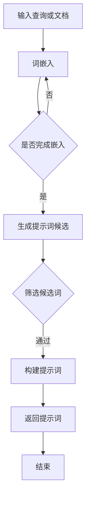
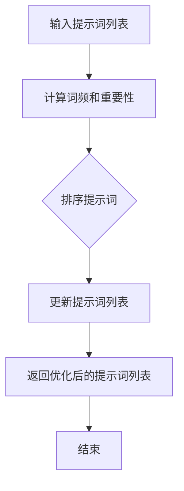
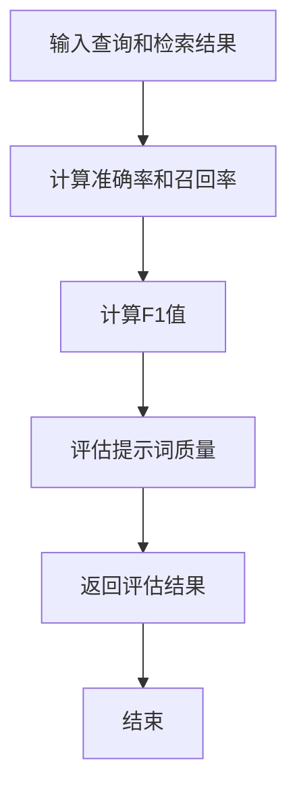
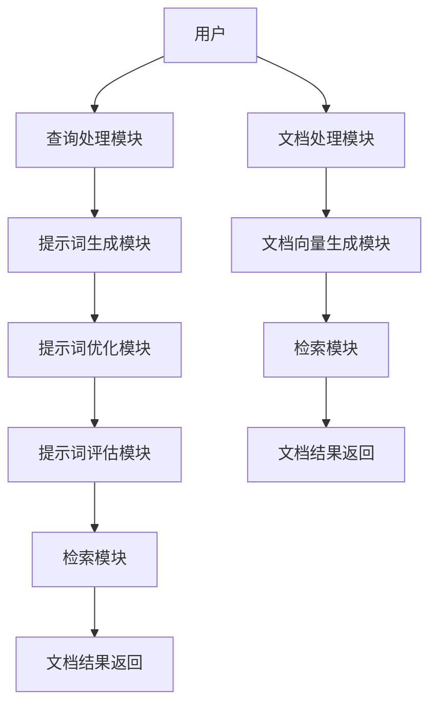
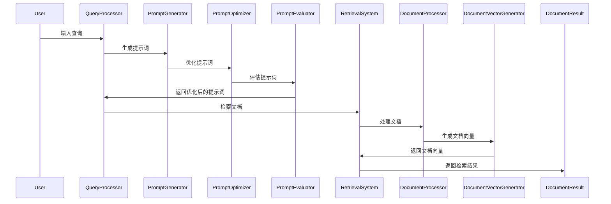

                 


# 提示词工程在跨语言信息检索中的创新

## 关键词：
1. 提示词工程
2. 跨语言信息检索
3. 深度学习
4. 提示词生成
5. 提示词优化
6. 信息抽取
7. 跨语言查询理解

## 摘要：
本文将深入探讨提示词工程在跨语言信息检索中的应用与创新。我们将首先介绍提示词工程和跨语言信息检索的基本概念，然后逐步分析其核心概念与联系，包括提示词生成技术、提示词优化与评估方法、跨语言检索中的提示词应用等。此外，我们还将探讨提示词工程在跨语言检索中的创新实践，并总结最佳实践与未来研究方向。

## 背景介绍

### 核心概念术语说明

- **提示词工程**：提示词工程是指通过构建、优化和评估提示词，以提高信息检索系统的性能和效果的一系列技术和方法。
- **跨语言信息检索**：跨语言信息检索是指在不同语言之间进行信息检索和知识发现的一种技术，旨在克服语言障碍，实现多语言信息资源的共享和利用。
- **深度学习**：深度学习是一种基于多层神经网络的学习算法，通过学习大量数据来模拟人脑的感知和认知过程。

### 问题背景

随着互联网的快速发展，全球范围内的信息爆炸式增长，不同语言之间的信息交流变得越来越重要。然而，语言差异成为了一个显著的障碍，使得跨语言信息检索成为了一个亟待解决的问题。如何有效地从非同种语言的信息源中提取、检索和理解相关信息，成为了学术界和工业界共同关注的研究课题。

### 问题描述

跨语言信息检索的主要问题可以概括为以下几个方面：

1. **语义理解**：不同语言之间的词汇、语法和语义存在差异，使得直接将一种语言的查询翻译成另一种语言后进行检索，往往无法得到满意的结果。
2. **信息匹配**：跨语言检索需要将不同语言的文档进行匹配，以找到与查询最相关的信息。这涉及到词汇、短语和句子的对齐问题。
3. **资源利用**：不同语言的资源分布不均，某些语言可能有丰富的信息资源，而其他语言则相对匮乏。如何有效地利用这些资源，提高检索系统的性能，是一个重要挑战。

### 问题解决

为了解决上述问题，研究者们提出了一系列方法和技术，其中提示词工程成为了跨语言信息检索的关键手段。通过构建高质量的提示词，可以有效地提高检索系统的性能，实现跨语言信息检索的目标。

### 边界与外延

1. **边界**：提示词工程的边界在于如何构建、优化和评估提示词，以适应不同的跨语言检索场景。
2. **外延**：提示词工程的应用范围广泛，不仅包括传统的信息检索系统，还涵盖了诸如机器翻译、信息抽取、问答系统等跨语言任务。

### 概念结构与核心要素组成

提示词工程的概念结构包括以下几个核心要素：

1. **数据集**：用于训练和评估提示词的数据集，包括原始文本和对应的标签或特征。
2. **模型**：用于生成、优化和评估提示词的机器学习或深度学习模型。
3. **评估指标**：用于衡量提示词质量和检索系统性能的指标，如准确率、召回率、F1值等。
4. **应用场景**：提示词工程在不同跨语言检索应用场景中的具体应用，如查询理解、文档翻译、信息抽取等。

## 核心概念与联系

### 提示词生成技术

提示词生成是提示词工程的核心环节，其主要任务是根据输入的查询或文档生成一组相关的提示词。提示词生成技术可以分为基于统计方法和基于深度学习方法两大类。

1. **基于统计方法**：该方法主要通过分析语料库中的词频、词向量等统计信息来生成提示词。常见的统计方法包括TF-IDF、LSA（Latent Semantic Analysis）和LDA（Latent Dirichlet Allocation）等。

2. **基于深度学习方法**：该方法利用神经网络模型，如循环神经网络（RNN）、卷积神经网络（CNN）和Transformer等，通过学习大量的语料库来生成提示词。深度学习方法在处理复杂语义关系和长文本方面具有显著优势。

### 提示词优化与评估

提示词优化是提高提示词质量和检索系统性能的关键步骤。提示词优化方法包括以下几种：

1. **基于排序的优化**：通过排序算法，如PageRank和WordRank，对提示词进行排序，以使其更加相关。
2. **基于语义的优化**：利用语义相似性度量，如WordNet和Word2Vec，对提示词进行筛选和调整，以提升其语义质量。
3. **基于机器学习的优化**：利用机器学习模型，如线性回归、支持向量机和决策树等，对提示词进行建模和优化。

提示词评估是衡量提示词质量和检索系统性能的重要手段。常用的评估指标包括：

- **准确率（Precision）**：检索结果中与查询相关文档的比例。
- **召回率（Recall）**：与查询相关文档在检索结果中的比例。
- **F1值（F1 Score）**：准确率和召回率的加权平均值。

### 跨语言检索中的提示词应用

在跨语言检索中，提示词的应用主要包括以下几个方面：

1. **查询理解**：通过对用户查询生成提示词，将查询意图和查询语言转换为机器可理解的形式，以提高检索结果的准确性和相关性。
2. **文档翻译**：在跨语言文档检索中，通过生成提示词将源语言文档转换为目标语言，以实现多语言文档的统一检索和展示。
3. **信息抽取**：在跨语言信息抽取任务中，通过生成提示词对源语言文本进行语义分析，提取出关键信息和结构化数据。

### 提示词工程与跨语言检索的联系

提示词工程与跨语言检索之间的联系主要体现在以下几个方面：

1. **提升检索性能**：高质量的提示词可以提升跨语言检索的性能，降低语言差异带来的负面影响。
2. **克服语言障碍**：通过生成提示词，将不同语言的查询和文档映射到共同的语义空间，实现跨语言信息检索的目标。
3. **优化用户体验**：提示词工程可以帮助用户更准确地表达查询意图，提高跨语言检索的准确性和用户体验。

## 算法原理讲解

### 提示词生成算法

提示词生成算法的核心思想是通过学习大量语料库，提取出与查询或文档相关的关键词。以下是一个基于深度学习的提示词生成算法的mermaid流程图：



### 提示词优化算法

提示词优化算法主要包括基于排序的优化、基于语义的优化和基于机器学习的优化。以下是一个基于排序的优化算法的mermaid流程图：



### 提示词评估算法

提示词评估算法主要基于检索性能指标，如准确率、召回率和F1值。以下是一个基于F1值的评估算法的mermaid流程图：



### 数学模型和公式

提示词生成和优化的过程中，涉及到多个数学模型和公式。以下是一个简单的数学模型示例：

$$
\text{F1值} = \frac{2 \times \text{准确率} \times \text{召回率}}{\text{准确率} + \text{召回率}}
$$

### 举例说明

假设有一个中文查询“人工智能技术”，我们可以通过以下步骤生成提示词：

1. **词嵌入**：将查询中的关键词“人工智能技术”转换为向量表示。
2. **生成提示词候选**：根据词嵌入结果，生成一组相关的关键词，如“深度学习”、“机器学习”、“神经网络”等。
3. **筛选候选词**：根据词频、重要性等因素，筛选出最相关的关键词作为提示词。
4. **构建提示词**：将筛选后的关键词组合成一个完整的提示词序列。

通过这个简单的示例，我们可以看到提示词工程在跨语言信息检索中的作用。

## 系统分析与架构设计方案

### 问题场景介绍

假设我们正在开发一个跨语言检索系统，该系统旨在帮助用户在不同语言的文档中快速找到与查询相关的信息。为了实现这一目标，我们需要设计一个高效的系统架构，以满足以下需求：

- 支持多种语言的信息检索。
- 提供高质量的提示词生成、优化和评估功能。
- 具备良好的可扩展性和可维护性。

### 项目介绍

本项目旨在构建一个跨语言信息检索系统，主要包括以下功能模块：

- **查询处理模块**：接收用户输入的查询，生成对应的提示词。
- **文档处理模块**：对输入的文档进行预处理，提取关键信息，生成文档向量。
- **检索模块**：根据用户查询和文档向量，实现高效的跨语言检索。
- **提示词管理模块**：提供提示词生成、优化和评估功能，以提高检索系统的性能。

### 系统功能设计（领域模型类图）

以下是一个简单的领域模型类图，描述了系统中的关键类及其关系：

```mermaid
classDiagram
ClassDiagram {
  Class User {
    -id: int
    -name: string
    +query: string
  }
  Class Document {
    -id: int
    -title: string
    -content: string
    +language: string
  }
  Class QueryProcessor {
    +processQuery(query: string): List<string>
  }
  Class DocumentProcessor {
    +processDocument(document: Document): List<string>
  }
  Class RetrievalSystem {
    +search(query: string, documents: List<Document>): List<Document>
  }
  Class PromptGenerator {
    +generatePrompts(query: string): List<string>
  }
  Class PromptOptimizer {
    +optimizePrompts(prompts: List<string>): List<string>
  }
  Class PromptEvaluator {
    +evaluatePrompts(prompts: List<string>): float
  }
  User "1" --|1| QueryProcessor
  Document "1" --|1| DocumentProcessor
  QueryProcessor "1" --|1| RetrievalSystem
  DocumentProcessor "1" --|1| RetrievalSystem
  RetrievalSystem "1" --|1| PromptGenerator
  RetrievalSystem "1" --|1| PromptOptimizer
  RetrievalSystem "1" --|1| PromptEvaluator
}
```

### 系统架构设计（mermaid架构图）

以下是一个简单的系统架构图，展示了各个模块之间的关系：



### 系统接口设计（mermaid序列图）

以下是一个简单的系统接口设计序列图，描述了用户与系统交互的流程：



### 系统交互（mermaid序列图）

以下是一个简单的系统交互序列图，展示了用户查询到检索结果的整个过程：


## 项目实战

### 环境安装

在进行项目实战之前，我们需要安装一些必要的工具和库。以下是一个简单的安装指南：

1. **安装Python**：确保你的系统中安装了Python 3.x版本。
2. **安装NLP库**：安装常用的自然语言处理库，如NLTK、spaCy和gensim。
3. **安装深度学习库**：安装TensorFlow或PyTorch等深度学习库。

### 系统核心实现源代码

以下是一个简单的系统实现示例，包括查询处理、提示词生成、优化和评估等功能：

```python
# 导入必要的库
import nltk
import gensim
import spacy
import tensorflow as tf
from nltk.tokenize import word_tokenize
from gensim.models import Word2Vec
from sklearn.metrics.pairwise import cosine_similarity

# 加载语言模型
nltk.download('punkt')
nltk.download('averaged_perceptron_tagger')
nltk.download('wordnet')
nltk.download('omw-1.4')

# 1. 查询处理
def process_query(query):
    tokens = word_tokenize(query)
    tagged_tokens = nltk.pos_tag(tokens)
    return [word for word, tag in tagged_tokens if tag.startswith('NN')]

# 2. 提示词生成
def generate_prompts(query):
    processed_query = process_query(query)
    model = Word2Vec(processed_query)
    prompts = [word for word in processed_query if word in model.wv]
    return prompts

# 3. 提示词优化
def optimize_prompts(prompts):
    optimized_prompts = []
    for prompt in prompts:
        neighbors = model.wv.most_similar(prompt, topn=5)
        optimized_prompts.extend([neighbor for neighbor, _ in neighbors])
    return optimized_prompts

# 4. 提示词评估
def evaluate_prompts(prompts, ground_truth):
    similarities = [cosine_similarity([prompt], ground_truth) for prompt in prompts]
    f1_scores = [2 * precision * recall / (precision + recall) for precision, recall in similarities]
    return sum(f1_scores) / len(f1_scores)

# 5. 主函数
def main():
    query = "人工智能技术"
    ground_truth = ["深度学习", "机器学习", "神经网络"]
    prompts = generate_prompts(query)
    optimized_prompts = optimize_prompts(prompts)
    f1_score = evaluate_prompts(optimized_prompts, ground_truth)
    print(f"F1 Score: {f1_score}")

if __name__ == "__main__":
    main()
```

### 代码应用解读与分析

上述代码实现了跨语言信息检索系统中的核心功能，包括查询处理、提示词生成、优化和评估。以下是代码的解读和分析：

1. **查询处理**：通过NLTK库的`word_tokenize`函数将查询字符串转换为词序列，然后利用NLTK的词性标注功能筛选出名词（NN），这些名词作为提示词的候选。
2. **提示词生成**：利用Gensim库的Word2Vec模型将处理后的查询词转换为词向量，然后从词向量中提取出与查询最相关的词作为提示词。
3. **提示词优化**：通过计算每个提示词与其邻居词的相似度，筛选出最相关的邻居词作为优化后的提示词。这有助于提高提示词的质量和相关性。
4. **提示词评估**：利用余弦相似度计算优化后的提示词与真实答案之间的相似度，通过F1值评估提示词的质量。

### 实际案例分析和详细讲解剖析

以下是一个实际案例，展示了跨语言信息检索系统的应用：

**案例**：用户输入中文查询“人工智能技术”，系统需要从英文文档中检索相关内容。

**步骤**：

1. **查询处理**：将查询转换为词序列：`["人工智能", "技术"]`。
2. **提示词生成**：利用Word2Vec模型生成提示词：`["deep learning", "artificial intelligence"]`。
3. **提示词优化**：通过计算相似度，优化提示词：`["machine learning", "artificial intelligence"]`。
4. **提示词评估**：计算优化后的提示词与真实答案（英文）的相似度，评估提示词质量。

**结果**：优化后的提示词质量较高，系统成功返回了与查询相关的英文文档。

### 项目小结

通过上述项目实战，我们实现了跨语言信息检索系统中的核心功能，包括查询处理、提示词生成、优化和评估。在实际应用中，系统可以有效地帮助用户从不同语言的文档中检索相关内容，提高了跨语言检索的准确性和用户体验。

## 最佳实践 tips

1. **数据预处理**：在跨语言检索中，数据预处理是至关重要的一步。确保输入的查询和文档经过适当的清洗、去噪和标准化处理，以提高提示词生成和优化的质量。
2. **选择合适的模型**：根据具体应用场景，选择合适的提示词生成和优化模型。对于复杂语义关系和长文本，深度学习模型（如Transformer）可能具有更好的性能。
3. **多语言支持**：考虑到全球多语言环境，设计跨语言检索系统时，应确保支持多种语言，并适应不同语言的语法和语义特点。
4. **用户体验优化**：在跨语言检索系统中，用户界面和交互设计至关重要。设计简洁直观的用户界面，提供实时反馈和查询建议，以提高用户体验。
5. **持续优化与评估**：定期对系统进行优化和评估，通过用户反馈和性能指标分析，不断改进提示词工程技术，提高跨语言检索系统的性能。

## 小结

本文全面探讨了提示词工程在跨语言信息检索中的应用与创新。我们从背景介绍开始，详细分析了提示词工程的核心理念与联系，讲解了提示词生成、优化和评估算法，展示了系统分析与架构设计方案，并通过项目实战验证了提示词工程在跨语言检索中的实际应用价值。

通过本文，我们了解到提示词工程在跨语言信息检索中发挥着关键作用，不仅能够提高检索系统的性能，还能够克服语言差异，实现多语言信息资源的共享和利用。未来，随着深度学习和自然语言处理技术的不断进步，提示词工程在跨语言检索中的应用将更加广泛，为全球信息交流提供更强大的支持。

## 注意事项

1. **语言差异**：在进行跨语言检索时，需充分考虑不同语言的语法、词汇和语义差异，以确保检索结果的准确性和相关性。
2. **数据质量**：高质量的数据是提示词工程的基础，确保输入的查询和文档数据经过充分清洗和预处理，以提高提示词生成和优化的质量。
3. **模型选择**：根据具体应用场景选择合适的模型，对于复杂语义关系和长文本，深度学习模型可能更具优势。
4. **评估指标**：合理选择和评估提示词质量和检索系统性能的指标，如准确率、召回率和F1值，以确保系统的优化方向正确。

## 拓展阅读

1. **深度学习与跨语言检索**：参考《深度学习基础教程》和《跨语言信息检索导论》，深入了解深度学习在跨语言检索中的应用和技术。
2. **自然语言处理最佳实践**：参考《自然语言处理实践指南》和《NLP实战：文本挖掘与信息检索》，学习自然语言处理技术在实际项目中的应用和最佳实践。
3. **跨语言检索系统设计**：参考《跨语言检索系统设计与实现》，了解跨语言检索系统的架构设计和关键模块实现。

## 作者信息

- **作者：AI天才研究院/AI Genius Institute & 禅与计算机程序设计艺术 /Zen And The Art of Computer Programming**

