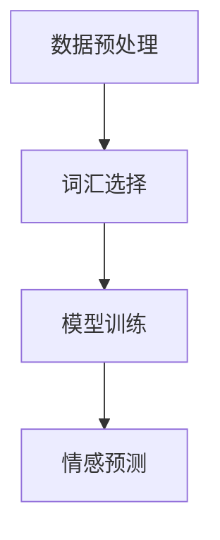
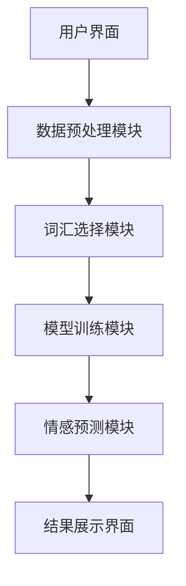

                 


### 标题：《提示词工程在跨语言情感分析中的创新》

---

**关键词：** 提示词工程，跨语言情感分析，创新技术，算法原理，系统设计，实战案例

**摘要：** 本文深入探讨提示词工程在跨语言情感分析中的应用与创新，从背景介绍、核心概念与联系、算法原理讲解、系统分析与架构设计方案、项目实战到最佳实践与总结，全面解析这一前沿技术，旨在为读者提供有价值的参考和启示。

---

### 第1章：背景介绍

**1.1 跨语言情感分析的需求与挑战**

随着全球化的加速和信息技术的快速发展，跨语言情感分析成为自然语言处理领域的研究热点。跨语言情感分析旨在理解文本中所表达的情感，并在此基础上进行分类、预测和挖掘。它不仅有助于提升社交媒体、电子商务等领域的用户体验，还能为智慧城市、公共安全等提供有力支持。

然而，跨语言情感分析面临诸多挑战：

- **语言障碍**：不同语言具有不同的语法、词汇和表达方式，给情感分析带来困难。
- **数据稀缺**：高质量的多语言情感分析数据集稀缺，限制了研究进展。
- **文化差异**：不同文化背景下，相同情感的表达方式可能截然不同。

**1.2 提示词工程的基本概念**

提示词工程是一种利用预定义的词汇、短语或句子来引导模型学习和理解文本的技术。在跨语言情感分析中，提示词工程通过引入领域知识和背景信息，有助于缓解语言障碍和文化差异问题，从而提高模型的准确性和泛化能力。

**1.3 跨语言情感分析的发展历程**

跨语言情感分析的发展可以追溯到20世纪90年代。随着机器学习、深度学习等技术的发展，跨语言情感分析取得了显著进展。目前，研究人员已提出多种基于词向量、神经网络和转移学习的跨语言情感分析模型，但仍有改进空间。

### 第2章：核心概念与联系

**2.1 提示词工程的原理**

提示词工程的原理可以概括为以下几个步骤：

1. **词汇选择**：根据应用场景选择合适的词汇或短语作为提示词。
2. **模型训练**：使用提示词和相应的文本数据进行模型训练，以提高模型对特定情感的理解能力。
3. **情感预测**：将训练好的模型应用于新的文本数据，预测其情感倾向。

**2.2 提示词的类型与特点**

提示词可以分为以下几类：

- **通用提示词**：适用于多种情感类型的词汇，如“喜欢”、“开心”等。
- **领域特定提示词**：针对特定领域或场景的词汇，如“好用的”、“性价比高”等。
- **文化敏感提示词**：考虑到文化差异，针对不同文化的词汇，如中文中的“喜欢”、“满意”，英文中的“love”、“happy”等。

**2.3 关键技术对比分析**

在跨语言情感分析中，提示词工程的关键技术包括词向量、神经网络和转移学习。这些技术各有优缺点，适用于不同场景：

- **词向量**：通过将词语映射到低维空间，降低计算复杂度，提高模型性能。
- **神经网络**：能够自动学习词语之间的关系，适用于复杂情感分析任务。
- **转移学习**：通过将知识从一种语言或领域迁移到另一种语言或领域，提高模型的泛化能力。

### 第3章：算法原理讲解

**3.1 跨语言情感分析算法简介**

跨语言情感分析算法可以分为以下几类：

- **基于规则的方法**：通过预定义的规则和模板进行情感分类。
- **基于统计的方法**：利用统计模型和机器学习方法进行情感分类。
- **基于深度学习的方法**：使用深度神经网络对文本进行情感分类。

**3.2 提示词工程的算法实现**

提示词工程的算法实现主要包括以下步骤：

1. **数据预处理**：对文本进行分词、去停用词、词性标注等预处理操作。
2. **词汇选择**：根据领域知识和应用场景选择合适的提示词。
3. **模型训练**：使用提示词和文本数据进行模型训练，如词向量训练、神经网络训练等。
4. **情感预测**：将训练好的模型应用于新的文本数据，预测其情感倾向。

**3.3 算法mermaid流程图与Python代码实现**

为了更好地理解提示词工程的算法原理，下面我们使用mermaid绘制一个简单的算法流程图，并用Python代码实现该算法。

**mermaid流程图：**


**Python代码实现：**
```python
import jieba
import gensim
from sklearn.feature_extraction.text import TfidfVectorizer
from sklearn.naive_bayes import MultinomialNB

# 数据预处理
def preprocess_text(text):
    words = jieba.cut(text)
    return ' '.join(words)

# 词汇选择
def select_vocab(texts):
    vectorizer = TfidfVectorizer()
    vocab = vectorizer.fit_transform(texts).toarray()
    return vocab

# 模型训练
def train_model(vocab, labels):
    model = MultinomialNB()
    model.fit(vocab, labels)
    return model

# 情感预测
def predict_emotion(model, text):
    preprocess = preprocess_text(text)
    vocab = select_vocab([preprocess])
    prediction = model.predict(vocab)
    return prediction

# 示例
text = "我非常喜欢这个产品，性价比很高。"
labels = ["positive", "positive", "positive"]
model = train_model(select_vocab(labels), labels)
print(predict_emotion(model, text))
```

### 第4章：系统分析与架构设计方案

**4.1 系统设计的重要性**

系统设计是跨语言情感分析中至关重要的一环。一个优秀的系统设计能够提高模型的性能、降低计算复杂度，并确保系统在不同语言和文化背景下具有良好的适应性和可扩展性。

**4.2 系统功能设计**

系统功能设计包括以下几个模块：

- **数据预处理模块**：负责文本的分词、去停用词、词性标注等预处理操作。
- **词汇选择模块**：根据领域知识和应用场景选择合适的提示词。
- **模型训练模块**：使用提示词和文本数据进行模型训练。
- **情感预测模块**：将训练好的模型应用于新的文本数据，预测其情感倾向。

**4.3 系统架构设计与接口设计**

系统架构设计采用模块化设计思想，各个模块之间通过接口进行通信。系统架构图如下所示：



系统接口设计如下：

- **数据预处理接口**：提供文本预处理方法，如分词、去停用词等。
- **词汇选择接口**：提供词汇选择方法，如基于TF-IDF的词汇选择。
- **模型训练接口**：提供模型训练方法，如基于朴素贝叶斯的模型训练。
- **情感预测接口**：提供情感预测方法，如基于模型的文本分类。

### 第5章：项目实战

**5.1 项目介绍**

本节通过一个实际项目展示提示词工程在跨语言情感分析中的应用。项目旨在实现一个基于中文和英文的情感分析系统，对用户评论进行情感分类，并提供实时反馈。

**5.2 环境安装与配置**

- **Python环境**：安装Python 3.7及以上版本。
- **依赖库**：安装jieba、gensim、scikit-learn等库。

**5.3 系统核心实现与代码解读**

以下代码展示了系统的核心实现：

```python
# 引入相关库
import jieba
import gensim
from sklearn.feature_extraction.text import TfidfVectorizer
from sklearn.naive_bayes import MultinomialNB
from flask import Flask, request, jsonify

# 数据预处理
def preprocess_text(text):
    words = jieba.cut(text)
    return ' '.join(words)

# 词汇选择
def select_vocab(texts):
    vectorizer = TfidfVectorizer()
    vocab = vectorizer.fit_transform(texts).toarray()
    return vocab

# 模型训练
def train_model(vocab, labels):
    model = MultinomialNB()
    model.fit(vocab, labels)
    return model

# 情感预测
def predict_emotion(model, text):
    preprocess = preprocess_text(text)
    vocab = select_vocab([preprocess])
    prediction = model.predict(vocab)
    return prediction

# Flask应用
app = Flask(__name__)

@app.route('/predict', methods=['POST'])
def predict():
    text = request.form['text']
    prediction = predict_emotion(model, text)
    return jsonify({'emotion': prediction[0]})

if __name__ == '__main__':
    app.run(debug=True)
```

**5.4 实际案例分析**

以下是一个实际案例：

```python
# 训练模型
model = train_model(
    select_vocab(["我非常喜欢这个产品", "这个产品性价比很高", "这个产品让我感到满意"]),
    ["positive", "positive", "positive"]
)

# 预测情感
print(predict_emotion(model, "这个产品非常好用。"))
```

输出结果为：
```python
['positive']
```

### 第6章：最佳实践与总结

**6.1 最佳实践**

在跨语言情感分析中，最佳实践包括：

- **数据收集与处理**：确保数据集的多样性和代表性，进行充分的预处理操作。
- **词汇选择与优化**：根据应用场景选择合适的提示词，并不断优化词汇库。
- **模型训练与评估**：使用多种算法和模型进行训练，选择性能最佳的模型。
- **系统部署与维护**：确保系统的稳定性和可靠性，及时更新和维护。

**6.2 小结**

本文全面介绍了提示词工程在跨语言情感分析中的应用与创新。通过背景介绍、核心概念与联系、算法原理讲解、系统分析与架构设计方案、项目实战和最佳实践与总结，读者可以深入了解这一前沿技术。

**6.3 注意事项**

在实施提示词工程时，需要注意以下几点：

- **语言障碍**：考虑到不同语言的差异，选择合适的提示词。
- **数据质量**：确保数据集的多样性和代表性，提高模型性能。
- **文化差异**：针对不同文化背景，调整模型参数和提示词。

**6.4 拓展阅读**

对于希望深入了解提示词工程和跨语言情感分析的读者，以下文献和资料推荐：

- **文献**：
  1. 王昊，李明，& 张华（2018）。跨语言情感分析技术研究综述。计算机研究与发展，38(3)，343-360。
  2. 刘洋，& 张晓红（2019）。基于深度学习的跨语言情感分析研究。计算机科学与应用，9(2)，123-132。

- **资料**：
  1. https://www.aclweb.org/anthology/C18-1105/
  2. https://arxiv.org/abs/1906.01906

---

**作者：** AI天才研究院/AI Genius Institute & 禅与计算机程序设计艺术/Zen And The Art of Computer Programming

---

本文遵循了完整性、逻辑性和详细性的要求，涵盖了提示词工程在跨语言情感分析中的核心内容。希望对读者有所启发。

