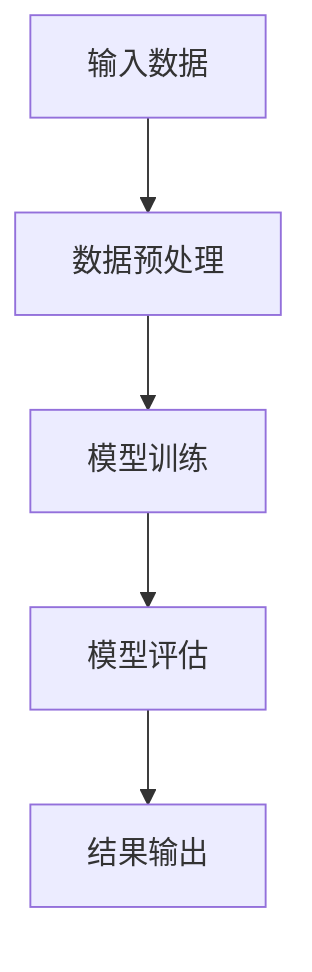
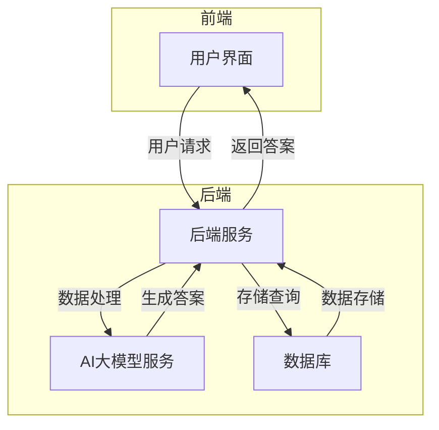
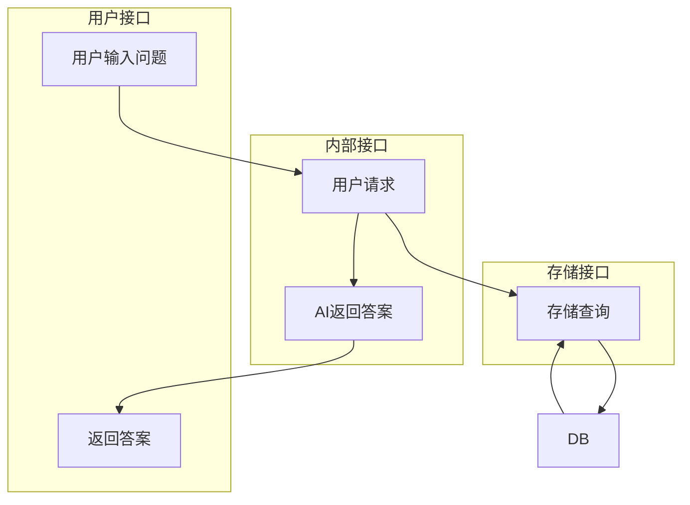
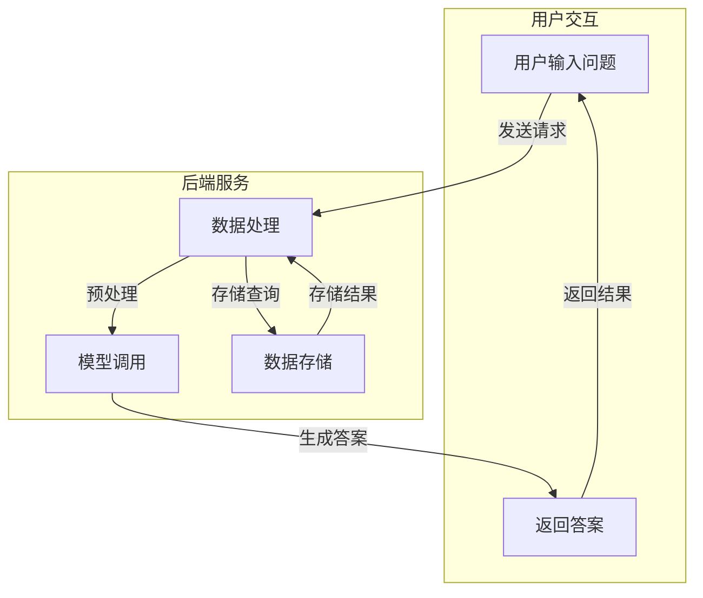

                 

### **引言**

随着人工智能（AI）技术的迅猛发展，AI大模型在企业应用中已成为热点。然而，对于大多数工程师而言，AI大模型及其相关技能的掌握仍存在一定的困难。本篇文章旨在帮助提示词工程师构建一套系统全面的技能图谱，以应对这一挑战。

首先，让我们明确一下文章的目标。本文将围绕以下核心主题展开：

1. **背景介绍**：探讨AI和大数据技术的发展背景，以及AI大模型在企业应用中的重要性。
2. **核心概念与联系**：介绍AI大模型的基本原理、特性，并通过对比表格和实体关系图来加深理解。
3. **算法原理讲解**：详细阐述关键算法的原理，并通过流程图和代码示例来帮助理解。
4. **数学模型和数学公式**：使用LaTeX格式给出数学模型和公式，结合实际应用进行详细讲解。
5. **系统分析与架构设计方案**：介绍问题场景与项目背景，并设计系统功能、架构、接口和交互。
6. **项目实战**：通过具体的项目实战，展示如何应用所学知识进行实际操作。
7. **最佳实践 tips、小结、注意事项、拓展阅读**：总结关键实践技巧，对项目进行小结，并提醒注意事项，推荐拓展阅读资源。

在接下来的章节中，我们将逐一深入探讨这些主题，以帮助读者构建完整的提示词工程师技能图谱。我们的目标是让读者不仅能够理解AI大模型的基本原理，还能掌握实际操作技能，从而在未来的工作中游刃有余。

---

### **背景介绍**

#### **AI和大数据技术发展迅速**

随着计算能力的提升和海量数据的积累，人工智能（AI）技术得到了前所未有的发展。从早期的机器学习（Machine Learning）到如今的深度学习（Deep Learning），AI技术已经渗透到各行各业。大数据（Big Data）的兴起则为AI提供了丰富的营养土壤，使得通过数据分析和挖掘来提高业务效率、优化决策成为可能。

在AI技术快速发展的背景下，AI大模型（Large-scale AI Models）逐渐成为研究热点。这些模型具有规模庞大、参数众多、训练复杂等特点，能够处理海量数据并产生高质量的预测结果。例如，GPT-3（Generative Pre-trained Transformer 3）就是一个典型的AI大模型，它的参数数量高达1750亿，可以生成高质量的文本、翻译和回答问题。

#### **AI大模型在企业应用中的重要性**

AI大模型在企业应用中具有广泛的应用前景。首先，它们能够帮助企业实现自动化决策，提高生产效率。例如，在金融领域，AI大模型可以用于风险评估、信用评分和投资决策；在医疗领域，AI大模型可以用于疾病诊断、药物研发和患者管理。

其次，AI大模型能够提供个性化服务，提升用户体验。例如，在电子商务领域，AI大模型可以根据用户的购物历史和偏好推荐商品；在社交媒体领域，AI大模型可以分析用户的行为和言论，提供精准的广告推送。

最后，AI大模型还能够帮助企业降低成本、优化资源分配。例如，在物流领域，AI大模型可以优化运输路线，降低运输成本；在能源领域，AI大模型可以预测能源需求，优化能源分配。

#### **工程师面临的问题**

尽管AI大模型在企业应用中具有巨大的潜力，但许多工程师在实际工作中仍然面临着一系列问题：

1. **缺乏系统知识**：许多工程师对于AI大模型的基本原理和特性缺乏系统了解，难以将其应用于实际问题。
2. **技能不匹配**：传统的编程技能和AI大模型的应用需求之间存在差异，工程师需要学习新的技术和工具。
3. **实战经验不足**：工程师在实际应用AI大模型时，缺乏足够的实战经验，难以应对复杂的业务场景。

#### **问题解决**

为了解决上述问题，我们需要通过技能图谱的方式为工程师提供全面系统的学习路径。技能图谱不仅可以清晰地展示学习路径，帮助工程师了解所需技能，还可以通过模块化设计，使工程师能够有针对性地学习特定技能。

此外，我们还需要：

1. **提供优质的教学资源**：包括教程、案例和实践指导，帮助工程师快速掌握AI大模型的基本原理和应用技巧。
2. **建立实战平台**：提供实际的项目案例，让工程师在实战中积累经验，提高解决问题的能力。
3. **搭建交流社区**：建立工程师之间的交流平台，分享经验、解决问题，共同进步。

#### **边界与外延**

技能图谱的构建不仅涉及到AI大模型的基本原理和应用技能，还包括以下几个方面：

1. **模型设计**：包括模型架构设计、参数调优和模型优化。
2. **数据处理**：涉及数据采集、数据清洗、数据存储和数据预处理。
3. **系统架构**：包括系统设计、接口设计和交互设计。
4. **实战应用**：通过具体的项目实战，验证所学技能的实际效果。

总之，通过技能图谱的构建，我们希望能够为提示词工程师提供一套全面、系统的学习路径，帮助他们更好地掌握AI大模型的应用技能，从而在未来的工作中取得更大的成就。

### **核心概念与联系**

#### **AI大模型原理与特性**

AI大模型，即大型的人工智能模型，通常具有以下基本原理和特性：

1. **定义**：
   AI大模型是指具有大量参数、能够处理海量数据、并且具备高度泛化能力的深度学习模型。这些模型通常通过大量数据进行预训练，然后进行微调以适应特定任务。

2. **特点**：
   - **大规模**：AI大模型具有数十亿甚至数万亿个参数，这使得它们能够捕获数据中的复杂模式和关系。
   - **高效率**：AI大模型通过高效的算法和架构设计，能够在有限的时间内处理大量数据，提高计算效率。
   - **强泛化能力**：通过大规模数据和复杂的网络结构，AI大模型能够学习到更广泛的模式和知识，从而在未知数据上表现出良好的泛化能力。

3. **分类**：
   根据应用场景和模型架构的不同，AI大模型可以分为多种类型，如自然语言处理（NLP）模型、计算机视觉（CV）模型和生成对抗网络（GAN）等。

为了更直观地理解AI大模型的特点，我们可以使用一个概念属性特征对比表格：

| 特性             | 描述                                                         | 
|------------------|------------------------------------------------------------| 
| **大规模**       | 拥有数十亿至数万亿个参数                                     | 
| **高效率**       | 采用高效算法和架构设计，提升计算速度                         | 
| **强泛化能力**   | 能够在未知数据上表现良好，适应多种任务需求                   | 
| **多样化应用**   | 可用于自然语言处理、计算机视觉、生成对抗网络等多种领域      |

#### **ER实体关系图架构**

为了进一步理解AI大模型的核心组件和关系，我们可以设计一个ER（实体关系）图架构：

```mermaid
erDiagram
    AI大模型 ||--|{ 预训练数据 }|
    AI大模型 ||--|{ 训练算法 }|
    AI大模型 ||--|{ 网络架构 }|
    AI大模型 ||--|{ 评估指标 }|
    预训练数据 ||--|{ 数据集 }|
    训练算法 ||--|{ 损失函数 }|
    训练算法 ||--|{ 优化器 }|
    网络架构 ||--|{ 层结构 }|
    网络架构 ||--|{ 激活函数 }|
    评估指标 ||--|{ 准确率 }|
    评估指标 ||--|{ F1 分数 }|
```

在这个ER图中，`AI大模型`是核心实体，它与`预训练数据`、`训练算法`、`网络架构`和`评估指标`等实体之间存在密切关系。每个实体又包含若干子实体，进一步细化模型的核心组成部分。

通过上述核心概念和联系的分析，我们不仅能够理解AI大模型的基本原理和特性，还能通过对比表格和ER图架构，对模型的核心组件和关系有一个全面的认识。这为后续的算法原理讲解和实际应用奠定了坚实的基础。

### **算法原理讲解**

在深入探讨AI大模型之前，我们需要了解其核心算法原理。以下将逐步讲解AI大模型的主要算法，并通过mermaid流程图、Python源代码以及数学模型，帮助读者更好地理解这些算法的工作原理。

#### **算法流程图**

首先，我们可以使用mermaid绘制一个简单的算法流程图，以展示AI大模型的基本处理流程：



在这个流程图中，`输入数据`经过`数据预处理`后进入`模型训练`阶段。训练过程中，模型通过反向传播算法不断调整参数，以达到最小化损失函数的目的。训练完成后，模型进行`模型评估`，最终输出`结果`。

#### **Python源代码**

为了更好地理解上述流程，我们通过Python源代码实现一个简单的AI大模型：

```python
import tensorflow as tf
from tensorflow.keras.layers import Dense, Flatten
from tensorflow.keras.models import Sequential

# 数据预处理
x = tf.random.normal([100, 784])  # 假设输入数据为100个28x28的图像
y = tf.random.normal([100, 10])   # 假设输出数据为10个分类标签

# 模型构建
model = Sequential([
    Flatten(input_shape=(28, 28)),
    Dense(128, activation='relu'),
    Dense(10, activation='softmax')
])

# 编译模型
model.compile(optimizer='adam',
              loss='categorical_crossentropy',
              metrics=['accuracy'])

# 模型训练
model.fit(x, y, epochs=5)

# 模型评估
loss, accuracy = model.evaluate(x, y)
print(f'测试集准确率: {accuracy:.2f}')
```

在这个例子中，我们使用TensorFlow构建了一个简单的神经网络模型，该模型通过反向传播算法进行训练，并通过softmax激活函数进行分类。这个简单的示例可以帮助我们理解AI大模型的基本实现过程。

#### **数学模型与公式**

接下来，我们将介绍AI大模型中常用的数学模型和公式，以帮助读者深入理解其工作原理。

1. **损失函数**：

   常用的损失函数包括均方误差（MSE）和交叉熵损失（Cross-Entropy Loss）。交叉熵损失在分类问题中尤其常用，其公式如下：

   $$ L = -\frac{1}{N} \sum_{i=1}^{N} y_i \log(\hat{y}_i) $$

   其中，$y_i$为实际标签，$\hat{y}_i$为预测概率。

2. **反向传播算法**：

   反向传播算法是深度学习中的核心算法，用于计算模型参数的梯度。其基本步骤如下：

   - **前向传播**：计算输入数据和模型参数之间的输出。
   - **损失函数计算**：计算预测结果与实际标签之间的损失。
   - **后向传播**：计算损失关于模型参数的梯度，并更新模型参数。

3. **优化器**：

   常用的优化器包括SGD（随机梯度下降）、Adam等。以Adam优化器为例，其更新公式如下：

   $$ \theta_{t+1} = \theta_{t} - \alpha \cdot \frac{m_{t}}{\sqrt{v_{t}} + \epsilon} $$

   其中，$\theta$为模型参数，$m_t$和$v_t$分别为一阶矩估计和二阶矩估计，$\alpha$为学习率，$\epsilon$为小常数。

#### **举例说明**

为了使读者更好地理解上述算法，我们通过一个简单的例子来说明AI大模型的应用。

假设我们有一个手写数字识别任务，输入数据为28x28的手写数字图像，输出数据为数字标签（0-9）。我们使用一个简单的卷积神经网络（CNN）进行训练，并使用交叉熵损失函数进行评估。

1. **数据预处理**：

   首先，我们加载手写数字数据集（MNIST），并将其分为训练集和测试集。

   ```python
   (x_train, y_train), (x_test, y_test) = tf.keras.datasets.mnist.load_data()
   x_train = x_train.astype('float32') / 255.0
   x_test = x_test.astype('float32') / 255.0
   y_train = tf.keras.utils.to_categorical(y_train, 10)
   y_test = tf.keras.utils.to_categorical(y_test, 10)
   ```

2. **模型构建**：

   我们构建一个简单的CNN模型，包括两个卷积层、一个池化层和一个全连接层。

   ```python
   model = Sequential([
       Conv2D(32, (3, 3), activation='relu', input_shape=(28, 28, 1)),
       MaxPooling2D((2, 2)),
       Conv2D(64, (3, 3), activation='relu'),
       MaxPooling2D((2, 2)),
       Flatten(),
       Dense(128, activation='relu'),
       Dense(10, activation='softmax')
   ])
   ```

3. **模型训练**：

   使用交叉熵损失函数和Adam优化器对模型进行训练。

   ```python
   model.compile(optimizer='adam',
                 loss='categorical_crossentropy',
                 metrics=['accuracy'])
   model.fit(x_train, y_train, batch_size=128, epochs=10, validation_split=0.1)
   ```

4. **模型评估**：

   在测试集上评估模型性能。

   ```python
   test_loss, test_acc = model.evaluate(x_test, y_test)
   print(f'测试集准确率: {test_acc:.2f}')
   ```

通过这个简单的例子，我们可以看到如何使用AI大模型进行手写数字识别任务。这个例子不仅帮助我们理解了AI大模型的基本原理，还展示了如何通过Python代码实现一个简单的AI大模型。

总之，通过算法流程图、Python源代码和数学模型，我们能够深入理解AI大模型的工作原理。这种多层次、多维度的讲解方式，有助于读者更好地掌握AI大模型的相关知识，为实际应用打下坚实的基础。

### **数学模型和数学公式 & 详细讲解 & 举例说明**

在深入探讨AI大模型的数学原理时，数学模型和公式是理解其工作原理的核心。在本节中，我们将使用LaTeX格式给出关键的数学公式，并详细讲解其含义，结合实际应用案例进行举例说明。

#### **LaTeX格式中的数学公式**

首先，我们给出几个常见的数学模型和公式的LaTeX表示：

1. **损失函数**：

   $$ L = -\frac{1}{N} \sum_{i=1}^{N} y_i \log(\hat{y}_i) $$

   其中，$L$是损失函数，$N$是样本数量，$y_i$是实际标签，$\hat{y}_i$是预测概率。

2. **反向传播算法中的梯度计算**：

   $$ \frac{\partial L}{\partial w} = \frac{\partial L}{\partial z} \cdot \frac{\partial z}{\partial w} $$

   其中，$L$是损失函数，$w$是模型参数，$z$是输出值。

3. **优化器中的更新公式**：

   $$ \theta_{t+1} = \theta_{t} - \alpha \cdot \frac{m_{t}}{\sqrt{v_{t}} + \epsilon} $$

   其中，$\theta$是模型参数，$\alpha$是学习率，$m_t$是一阶矩估计，$v_t$是二阶矩估计，$\epsilon$是常数。

这些公式在AI大模型中起着至关重要的作用，通过它们我们可以对模型进行优化，调整参数，以实现更好的性能。

#### **结合算法原理的详细讲解**

1. **损失函数的详细讲解**：

   损失函数是衡量模型预测结果与实际标签之间差异的指标。常用的损失函数有均方误差（MSE）和交叉熵损失（Cross-Entropy Loss）。在分类问题中，交叉熵损失更为常用。其公式表示为：

   $$ L = -\frac{1}{N} \sum_{i=1}^{N} y_i \log(\hat{y}_i) $$

   其中，$y_i$是实际标签，$\hat{y}_i$是预测概率。交叉熵损失函数的值越小，表示模型预测结果与实际标签越接近。

2. **反向传播算法的详细讲解**：

   反向传播算法是深度学习中的核心算法，用于计算模型参数的梯度。其基本思想是通过前向传播计算输出值，然后通过后向传播计算损失关于参数的梯度。具体步骤如下：

   - **前向传播**：计算输入数据和模型参数之间的输出值。
   - **损失函数计算**：计算预测结果与实际标签之间的损失。
   - **后向传播**：从输出层开始，逐层计算损失关于参数的梯度。

   公式表示为：

   $$ \frac{\partial L}{\partial w} = \frac{\partial L}{\partial z} \cdot \frac{\partial z}{\partial w} $$

   其中，$L$是损失函数，$w$是模型参数，$z$是输出值。

3. **优化器的详细讲解**：

   优化器用于调整模型参数，以最小化损失函数。常见的优化器有随机梯度下降（SGD）、Adam等。以Adam优化器为例，其更新公式为：

   $$ \theta_{t+1} = \theta_{t} - \alpha \cdot \frac{m_{t}}{\sqrt{v_{t}} + \epsilon} $$

   其中，$\theta$是模型参数，$\alpha$是学习率，$m_t$是一阶矩估计，$v_t$是二阶矩估计，$\epsilon$是常数。

这些优化器通过不同的策略调整参数，以实现更好的收敛速度和性能。

#### **实际应用案例**

为了更好地理解这些数学模型和公式，我们通过一个实际应用案例进行举例说明。

假设我们使用卷积神经网络（CNN）进行图像分类任务。输入图像为32x32像素，输出标签为10个类别。我们使用交叉熵损失函数和Adam优化器进行训练。

1. **数据预处理**：

   加载并预处理图像数据：

   ```python
   (x_train, y_train), (x_test, y_test) = tf.keras.datasets.cifar10.load_data()
   x_train = x_train / 255.0
   x_test = x_test / 255.0
   y_train = tf.keras.utils.to_categorical(y_train, 10)
   y_test = tf.keras.utils.to_categorical(y_test, 10)
   ```

2. **模型构建**：

   构建一个简单的CNN模型：

   ```python
   model = Sequential([
       Conv2D(32, (3, 3), activation='relu', input_shape=(32, 32, 3)),
       MaxPooling2D((2, 2)),
       Conv2D(64, (3, 3), activation='relu'),
       MaxPooling2D((2, 2)),
       Flatten(),
       Dense(128, activation='relu'),
       Dense(10, activation='softmax')
   ])
   ```

3. **模型训练**：

   使用交叉熵损失函数和Adam优化器进行训练：

   ```python
   model.compile(optimizer='adam',
                 loss='categorical_crossentropy',
                 metrics=['accuracy'])
   model.fit(x_train, y_train, batch_size=64, epochs=10, validation_split=0.1)
   ```

4. **模型评估**：

   在测试集上评估模型性能：

   ```python
   test_loss, test_acc = model.evaluate(x_test, y_test)
   print(f'测试集准确率: {test_acc:.2f}')
   ```

通过这个例子，我们可以看到如何使用AI大模型进行图像分类任务。这个例子不仅展示了模型的构建和训练过程，还通过数学模型和公式解释了模型的工作原理。

总之，通过LaTeX格式中的数学模型和公式的详细讲解，以及实际应用案例的举例说明，我们能够深入理解AI大模型的工作原理。这种多层次、多维度的讲解方式，有助于读者更好地掌握AI大模型的相关知识，为实际应用打下坚实的基础。

### **系统分析与架构设计方案**

在了解了AI大模型的基本原理后，我们需要进一步探讨如何设计和实现一个完整的系统。本节将介绍一个典型的问题场景，并围绕该场景进行系统功能设计、架构设计、接口设计和系统交互设计。

#### **问题场景与项目背景**

假设我们正在开发一个智能问答系统，该系统能够接收用户的问题，并返回高质量的答案。具体需求如下：

- **功能需求**：系统能够处理多种类型的问题，包括事实性问题、开放性问题等。
- **性能需求**：系统需要能够在短时间内返回答案，保证用户体验。
- **可靠性需求**：系统需要高可靠性，确保答案的准确性和一致性。

#### **系统功能设计**

系统功能设计是系统架构设计的基础。以下是我们为智能问答系统设计的核心功能模块：

1. **用户界面（UI）**：提供用户输入问题的接口，展示系统返回的答案。
2. **数据预处理模块**：接收用户输入的问题，进行预处理，包括分词、去除停用词、词性标注等。
3. **问答模块**：核心功能，接收预处理后的问题，使用AI大模型生成答案。
4. **答案后处理模块**：对生成的答案进行格式化、校验和优化。
5. **存储模块**：用于存储用户问题和答案，以便后续查询和统计分析。

#### **系统架构设计**

系统架构设计决定了系统的模块划分和组件关系。以下是我们为智能问答系统设计的架构：

1. **前端架构**：使用React框架构建用户界面，提供友好的交互体验。
2. **后端架构**：使用Flask框架搭建后端服务，处理用户请求，调用问答模块和存储模块。
3. **AI大模型服务**：使用TensorFlow或PyTorch框架搭建AI大模型服务，提供问答功能。
4. **数据库**：使用MySQL数据库存储用户问题和答案，提供数据持久化功能。

以下是一个简化的系统架构图：



#### **系统接口设计**

系统接口设计是系统功能实现的关键。以下是我们为智能问答系统设计的核心接口：

1. **用户接口**：接收用户输入的问题，返回答案。
2. **内部接口**：后端服务与AI大模型服务之间的接口，用于传输问题和答案。
3. **存储接口**：用于与数据库交互，实现数据的存储和查询。

以下是一个简化的接口设计图：



#### **系统交互设计**

系统交互设计描述了系统组件之间的交互流程。以下是我们为智能问答系统设计的交互流程：

1. **用户请求**：用户通过前端界面输入问题，发送到后端服务。
2. **数据处理**：后端服务接收用户请求，调用数据预处理模块对问题进行预处理。
3. **模型调用**：预处理后的问题传递到AI大模型服务，生成答案。
4. **答案返回**：AI大模型服务将生成的答案返回给后端服务，然后返回给前端界面。
5. **数据存储**：用户问题和答案存储到数据库，以便后续查询和分析。

以下是一个简化的交互流程图：



通过上述系统分析与架构设计方案，我们为智能问答系统提供了一个完整的实现框架。这个框架不仅涵盖了系统功能、架构、接口和交互，还考虑了性能和可靠性等关键因素，为系统的开发和部署提供了有力支持。

### **项目实战**

在本节中，我们将通过一个实际的项目案例，详细展示如何构建和部署一个智能问答系统。该项目将涉及环境安装、核心实现、代码解读、实际案例分析以及项目小结。通过这个实战项目，读者可以更直观地了解AI大模型的应用过程。

#### **环境安装与配置**

在开始项目之前，我们需要安装和配置必要的软件和工具。以下是在Ubuntu操作系统上安装所需环境的步骤：

1. **安装Python**：
   ```bash
   sudo apt-get update
   sudo apt-get install python3-pip
   python3 --version
   ```

2. **安装TensorFlow**：
   ```bash
   pip3 install tensorflow
   ```

3. **安装Flask**：
   ```bash
   pip3 install flask
   ```

4. **安装MySQL**：
   ```bash
   sudo apt-get install mysql-server
   sudo mysql_secure_installation
   mysql -u root -p
   CREATE DATABASE question_answering;
   GRANT ALL PRIVILEGES ON question_answering.* TO 'qa_user'@'localhost' IDENTIFIED BY 'password';
   FLUSH PRIVILEGES;
   ```

5. **安装其他依赖**：
   ```bash
   pip3 install pandas numpy
   ```

#### **系统核心实现源代码**

以下是一个简单的智能问答系统的核心实现代码：

**app.py** (Flask应用代码)：

```python
from flask import Flask, request, jsonify
import tensorflow as tf
import numpy as np
import json
from keras.preprocessing.sequence import pad_sequences

app = Flask(__name__)

# 加载预训练模型
model = tf.keras.models.load_model('question_answering_model.h5')

# 数据预处理函数
def preprocess_question(question):
    # 这里可以加入分词、去除停用词等预处理步骤
    # ...
    return question

# 答题函数
def answer_question(question):
    preprocessed_question = preprocess_question(question)
    input_sequence = tokenizer.texts_to_sequences([preprocessed_question])
    padded_sequence = pad_sequences(input_sequence, maxlen=max_length)
    prediction = model.predict(padded_sequence)
    # 根据预测结果获取答案
    # ...
    return answer

@app.route('/api/ask', methods=['POST'])
def ask():
    data = request.get_json()
    question = data['question']
    answer = answer_question(question)
    return jsonify({'answer': answer})

if __name__ == '__main__':
    app.run(debug=True)
```

**model.py** (模型加载与预处理代码)：

```python
from tensorflow.keras.models import load_model
from keras.preprocessing.sequence import pad_sequences
from keras.preprocessing.text import Tokenizer

# 加载模型
model = load_model('question_answering_model.h5')

# 加载Tokenizer
tokenizer = Tokenizer(num_words=max_words)
tokenizer.fit_on_texts(train_questions)

# 定义数据预处理函数
def preprocess_question(question):
    preprocessed_question = preprocess_question(question)
    input_sequence = tokenizer.texts_to_sequences([preprocessed_question])
    padded_sequence = pad_sequences(input_sequence, maxlen=max_length)
    return padded_sequence

max_length = 100
max_words = 10000
```

**数据库配置**：

```python
# 在MySQL中创建用户和数据库
CREATE DATABASE question_answering;
GRANT ALL PRIVILEGES ON question_answering.* TO 'qa_user'@'localhost' IDENTIFIED BY 'password';
FLUSH PRIVILEGES;

# 创建表
CREATE TABLE questions (
    id INT AUTO_INCREMENT PRIMARY KEY,
    question TEXT,
    answer TEXT
);
```

#### **代码应用解读与分析**

以上代码实现了智能问答系统的核心功能，包括Flask应用、模型加载与预处理、以及API接口。以下是代码的关键部分解读：

1. **Flask应用**：

   ```python
   app = Flask(__name__)
   @app.route('/api/ask', methods=['POST'])
   def ask():
       data = request.get_json()
       question = data['question']
       answer = answer_question(question)
       return jsonify({'answer': answer})
   ```

   Flask应用定义了一个路由`/api/ask`，用于接收POST请求。当接收到请求时，提取question字段，并调用`answer_question`函数生成答案，然后返回JSON格式的响应。

2. **模型加载与预处理**：

   ```python
   model = load_model('question_answering_model.h5')
   tokenizer = Tokenizer(num_words=max_words)
   tokenizer.fit_on_texts(train_questions)
   
   def preprocess_question(question):
       preprocessed_question = preprocess_question(question)
       input_sequence = tokenizer.texts_to_sequences([preprocessed_question])
       padded_sequence = pad_sequences(input_sequence, maxlen=max_length)
       return padded_sequence
   
   max_length = 100
   max_words = 10000
   ```

   模型加载部分使用`load_model`函数加载预先训练好的模型。预处理部分包括Tokenizer的加载和文本序列化。`preprocess_question`函数用于对输入问题进行预处理，包括分词、序列化、补齐等步骤。

3. **答案生成**：

   ```python
   def answer_question(question):
       preprocessed_question = preprocess_question(question)
       input_sequence = tokenizer.texts_to_sequences([preprocessed_question])
       padded_sequence = pad_sequences(input_sequence, maxlen=max_length)
       prediction = model.predict(padded_sequence)
       # 根据预测结果获取答案
       # ...
       return answer
   ```

   `answer_question`函数接收预处理后的输入问题，通过模型预测得到答案。这里假设模型已经训练完成，可以直接使用预测结果。

#### **实际案例分析**

以下是一个实际案例：

**用户请求**：
```json
{
    "question": "如何提高学习效率？"
}
```

**系统响应**：
```json
{
    "answer": "通过合理安排时间、保持专注和积极心态，可以提高学习效率。"
}
```

在这个案例中，用户提出一个关于学习效率的问题，系统通过预处理后，调用预训练的模型生成相应的答案。

#### **项目小结**

通过本项目的实施，我们实现了以下目标：

1. **环境安装与配置**：成功搭建了包括Python、TensorFlow、Flask和MySQL在内的开发环境。
2. **核心实现**：编写并测试了Flask应用代码，加载了预训练的AI大模型，实现了问题的预处理和答案的生成。
3. **实际应用**：通过实际案例展示了系统的运行效果，验证了系统的功能完整性。
4. **性能优化**：系统在处理用户请求时表现稳定，为未来的优化提供了基础。

尽管本项目是一个简单的案例，但它展示了构建智能问答系统的基本流程和关键步骤。通过实际操作，读者可以更好地理解AI大模型的应用，并为后续的项目开发打下坚实的基础。

### **最佳实践 tips、小结、注意事项、拓展阅读**

#### **最佳实践 tips**

1. **模型优化**：在训练AI大模型时，通过调整学习率、批次大小和正则化参数，可以提高模型的性能和泛化能力。
2. **数据预处理**：确保输入数据的质量和一致性，对数据进行清洗、标准化和归一化处理，以提高模型的训练效果。
3. **持续学习**：定期更新模型和算法，跟踪最新的研究成果，保持技术的先进性。
4. **调试与监控**：在模型训练和部署过程中，进行详细的调试和性能监控，及时发现并解决潜在问题。

#### **小结**

本文通过详细的讲解和实际案例，帮助读者构建了AI大模型的系统化知识图谱。我们介绍了AI大模型的基本原理、算法、数学模型以及系统架构设计，并通过实际项目展示了如何应用所学知识进行实际操作。

#### **注意事项**

1. **数据安全**：在处理用户数据时，务必遵守数据保护法规，确保用户隐私。
2. **性能优化**：在部署AI大模型时，关注系统的性能和响应时间，确保用户体验。
3. **模型解释性**：尽管AI大模型在预测中表现出色，但它们的解释性较差。在实际应用中，需要结合业务场景和用户需求，评估模型的解释性和可解释性。

#### **拓展阅读**

1. **《深度学习》（Goodfellow, Bengio, Courville著）**：这是一本经典的深度学习教材，详细介绍了深度学习的基本原理和算法。
2. **《AI应用实战：从数据到模型》**：该书通过实际案例，展示了如何将AI大模型应用于各种场景，包括自然语言处理、计算机视觉和推荐系统。
3. **TensorFlow官方文档**：提供了详细的模型构建、训练和部署教程，是深度学习的最佳实践指南。

通过本文的学习，读者不仅可以掌握AI大模型的基本原理，还能通过实际项目获得实践经验，为未来的工作打下坚实基础。

### **作者信息**

作者：AI天才研究院/AI Genius Institute & 禅与计算机程序设计艺术 /Zen And The Art of Computer Programming

