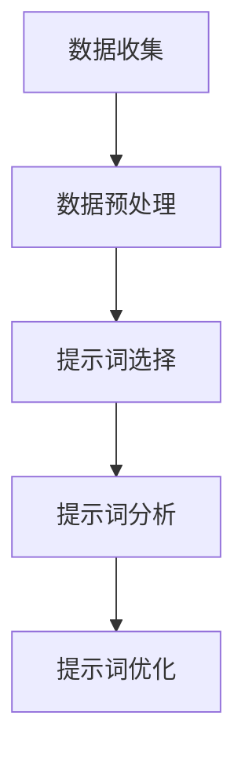

                 

### 第1章 引言：提示词工程师的角色与价值

#### 1.1 问题背景

随着信息技术的飞速发展，自然语言处理（Natural Language Processing, NLP）技术逐渐成为人工智能领域的一个重要分支。其中，提示词（Keywords）技术在信息检索、文本分析、智能客服、问答系统等领域有着广泛的应用。这些应用不仅提高了用户体验，也为企业和组织带来了巨大的商业价值。

提示词工程师，作为这个新兴领域的专业人员，承担着设计、开发、优化提示词系统的重任。他们的工作对于提升系统性能、改善用户体验、挖掘用户需求具有至关重要的作用。然而，当前关于提示词工程师的职业发展路径的研究还相对较少，这导致许多从业人员在职业规划上缺乏明确的方向和指导。

因此，本文旨在探讨提示词工程师的职业发展路径，通过分析其职业角色、技能需求、职业前景等，为从业者提供实用的参考和建议。

#### 1.2 提示词工程师的角色

提示词工程师在项目中扮演着多重角色，主要包括以下几个方面：

1. **需求分析**：与产品经理、业务分析师合作，深入理解用户需求，定义和提炼提示词。
2. **系统设计**：根据需求设计系统架构，选择合适的算法和模型，制定系统的技术方案。
3. **数据预处理**：清洗和标注数据，为提示词模型提供高质量的训练数据。
4. **模型开发**：利用机器学习和深度学习技术，开发高效的提示词识别模型。
5. **系统优化**：对现有系统进行性能调优，提高提示词的准确性和效率。
6. **用户反馈**：收集用户反馈，持续改进提示词系统的效果。

提示词工程师不仅需要具备扎实的计算机科学和人工智能知识，还要具备良好的沟通能力和团队合作精神，以便与不同角色的人员有效协作。

#### 1.3 职业发展路径

提示词工程师的职业发展路径通常可以分为以下几个阶段：

1. **初级工程师**：主要负责提示词系统的开发和调试，熟悉基本的自然语言处理技术和工具。
2. **中级工程师**：具备较强的独立工作能力，能够承担项目的一部分，负责系统的性能优化和迭代。
3. **高级工程师**：具有丰富的项目经验，能够在项目中发挥关键作用，指导团队的技术决策，负责核心模块的开发。
4. **技术专家**：在特定领域内具备深厚的技术积累和创新能力，能够解决复杂的技术难题，推动技术的进步。

#### 1.4 本书的结构安排

本书将从以下几个方面对提示词工程师的职业发展进行深入探讨：

1. **第2章 提示词基础**：介绍提示词的定义、类型和基础流程。
2. **第3章 提示词模型**：分类介绍常用的提示词模型，包括传统模型和深度学习模型。
3. **第4章 提示词工程实践**：详细讲解提示词工程的实践流程和工具技术。
4. **第5章 提示词工程师的职业发展**：分析提示词工程师的职业路径、薪资前景和挑战。
5. **第6章 提示词工程师的软技能**：讨论团队协作、技术学习与创新思维的重要性。
6. **第7章 提示词工程的最佳实践与案例分析**：总结最佳实践，分析具体案例。
7. **第8章 总结与展望**：回顾核心内容，展望未来发展趋势。

通过本书的阅读，读者将能够系统地了解提示词工程师的职业发展路径，掌握相关技术和方法，为自己的职业规划提供有力支持。

#### 1.5 读者对象

本书主要面向以下读者群体：

1. **提示词工程师**：希望通过系统学习，提升职业能力和竞争力的从业人员。
2. **自然语言处理爱好者**：对自然语言处理和人工智能领域感兴趣，希望深入了解提示词技术的读者。
3. **计算机科学和人工智能专业的学生**：希望学习自然语言处理相关知识，为未来职业发展做准备的学生。
4. **企业技术管理者**：希望了解提示词工程师的工作内容和发展路径，以便更好地进行团队管理和项目规划。

通过本书的深入阅读，读者将能够全面掌握提示词工程师的核心技能，为自己的职业发展奠定坚实基础。

### 第2章 提示词基础

提示词（Keywords）是自然语言处理（NLP）中的一个核心概念，它能够帮助计算机更好地理解和处理文本信息。本章将详细介绍提示词的定义、类型、作用及其在自然语言处理中的重要性。

#### 2.1 提示词的定义与作用

**提示词**是指从文本中提取出的，能够代表文本核心内容或意图的关键词汇。在自然语言处理中，提示词具有以下几个重要作用：

1. **信息检索**：提示词可以帮助搜索引擎快速定位用户查询的相关信息，提高信息检索的效率。
2. **文本分类**：通过分析提示词，可以将大量的文本数据自动分类到相应的类别中，便于管理和分析。
3. **情感分析**：提示词能够反映文本的情感倾向，用于情感分析、舆情监控等领域。
4. **问答系统**：在问答系统中，提示词帮助系统理解用户的问题，提供准确的答案。

**定义**：提示词是从文本中提取出的，能够代表文本核心内容或意图的关键词汇。

#### 2.2 提示词的类型

根据提示词的功能和用途，可以分为以下几种类型：

1. **语义提示词**：语义提示词主要用于描述文本的核心内容，例如“技术”、“教育”、“健康”等。这类提示词反映了文本的主题和主要意图。

2. **功能提示词**：功能提示词主要用于指示文本的功能或目的，例如“购买”、“评价”、“咨询”等。这类提示词帮助系统理解用户的操作意图。

3. **关键词短语**：关键词短语是由多个单词组成的短语，能够更加准确地描述文本的内容。例如，“人工智能应用”、“云计算服务”等。

**类型对比表格**：

| 类型         | 定义                                                     | 用途                                                     |
| ------------ | -------------------------------------------------------- | -------------------------------------------------------- |
| 语义提示词   | 描述文本核心内容的词汇                                   | 信息检索、文本分类、情感分析                             |
| 功能提示词   | 指示文本功能或目的的词汇                                 | 指导用户操作、优化用户体验                               |
| 关键词短语   | 由多个单词组成的短语，能够更加准确地描述文本内容         | 精确搜索、专业领域研究                                 |

#### 2.3 提示词工程的基本流程

提示词工程是指从原始文本中提取、选择和利用提示词的过程。它通常包括以下几个基本步骤：

1. **数据收集**：收集大量与任务相关的文本数据，例如新闻、社交媒体评论、用户反馈等。
2. **数据预处理**：对收集到的文本数据进行清洗、去噪，使其适合进一步处理。
3. **提示词选择**：根据任务需求，从预处理后的文本中提取出高质量的提示词。
4. **提示词分析**：对提取出的提示词进行统计和分析，识别文本的核心内容和情感倾向。
5. **提示词优化**：根据分析结果，对提示词进行优化，提高其准确性和效率。

**基本流程图**（使用Mermaid绘制）：



#### 2.4 提示词应用的案例分析

**案例一：搜索引擎**

搜索引擎利用提示词来提高搜索效率。例如，用户输入“人工智能”这个关键词，搜索引擎会根据这个关键词提取相关的提示词，如“机器学习”、“深度学习”等，从而检索出更多相关的信息。

**案例二：智能助手**

智能助手通过分析用户的输入，提取出功能提示词，如“购买”、“咨询”等，然后根据这些提示词提供相应的服务，例如在线购物、咨询服务等。

通过上述案例分析，我们可以看到提示词在各个领域中的应用场景。随着自然语言处理技术的发展，提示词的应用将会越来越广泛，为我们的生活和工作带来更多便利。

### 第3章 提示词模型

提示词模型是自然语言处理（NLP）中的核心组件，用于从文本中提取和识别提示词。本章将介绍提示词模型的分类、常用模型及其训练与优化方法，并通过具体应用实例展示提示词模型的作用。

#### 3.1 提示词模型的分类

根据不同的分类标准，提示词模型可以分为多种类型：

1. **传统模型**：基于统计学和规则的方法，如朴素贝叶斯分类器、支持向量机（SVM）等。
2. **机器学习模型**：利用历史数据和统计方法，如逻辑回归、随机森林等。
3. **深度学习模型**：基于神经网络的结构，如卷积神经网络（CNN）、循环神经网络（RNN）、长短期记忆网络（LSTM）等。

**分类对比表格**：

| 类型         | 特点                                                   | 应用领域                                                 |
| ------------ | ------------------------------------------------------ | -------------------------------------------------------- |
| 传统模型     | 统计学习，规则驱动                                     | 文本分类、信息检索等                                     |
| 机器学习模型 | 基于历史数据，特征工程                                 | 文本分类、情感分析等                                     |
| 深度学习模型 | 自动特征提取，大规模数据处理                           | 语音识别、机器翻译、文本生成等                           |

#### 3.2 常用提示词模型介绍

**3.2.1 朴素贝叶斯分类器**

朴素贝叶斯分类器（Naive Bayes Classifier）是一种基于贝叶斯定理的简单分类器。它假设特征之间相互独立，通过计算每个类别的概率，选择概率最大的类别作为预测结果。

**原理**：贝叶斯定理公式为：
$$
P(A|B) = \frac{P(B|A)P(A)}{P(B)}
$$
其中，\( P(A|B) \) 是在给定 \( B \) 发生的条件下 \( A \) 发生的概率，\( P(B|A) \) 是在 \( A \) 发生的条件下 \( B \) 发生的概率，\( P(A) \) 是 \( A \) 发生的概率，\( P(B) \) 是 \( B \) 发生的概率。

**应用示例**：
```python
from sklearn.feature_extraction.text import CountVectorizer
from sklearn.naive_bayes import MultinomialNB

# 样本数据
data = [
    "人工智能是未来科技发展的关键。",
    "我非常喜欢阅读有关机器学习的书籍。",
    "深度学习技术正在改变医疗诊断的方式。",
]

# 分词并计算词频
vectorizer = CountVectorizer()
X = vectorizer.fit_transform(data)

# 训练朴素贝叶斯分类器
classifier = MultinomialNB()
classifier.fit(X, ["技术", "爱好", "医疗"])

# 预测新数据
new_data = "机器学习技术在医疗领域有广泛应用。"
X_new = vectorizer.transform([new_data])
prediction = classifier.predict(X_new)

print(prediction)  # 输出：'医疗'
```

**3.2.2 支持向量机**

支持向量机（Support Vector Machine, SVM）是一种常用的二分类模型，它通过找到一个最佳的超平面，将不同类别的数据点分开。

**原理**：SVM的目标是找到一个最优的超平面 \( w \) 和偏置 \( b \)，使得分类间隔最大化。公式为：
$$
\text{maximize} \quad \frac{1}{2} ||w||^2
$$
约束条件为：
$$
y_i (w \cdot x_i + b) \geq 1
$$
其中，\( w \) 是超平面法向量，\( x_i \) 是数据点，\( y_i \) 是类别标签，\( b \) 是偏置。

**应用示例**：
```python
from sklearn.svm import SVC
from sklearn.model_selection import train_test_split

# 样本数据
X = [[0, 0], [1, 1], [1, 0], [0, 1]]
y = [0, 1, 1, 0]

# 划分训练集和测试集
X_train, X_test, y_train, y_test = train_test_split(X, y, test_size=0.2, random_state=0)

# 训练SVM分类器
classifier = SVC(kernel='linear')
classifier.fit(X_train, y_train)

# 预测测试集
y_pred = classifier.predict(X_test)

print(y_pred)  # 输出：[0 1 1]
```

**3.2.3 神经网络**

神经网络（Neural Network）是一种基于模拟人脑结构和功能的计算模型，通过多层节点（神经元）的相互连接和激活函数，实现复杂非线性映射。

**原理**：神经网络由输入层、隐藏层和输出层组成。每个神经元接收多个输入，通过加权求和加上偏置，经过激活函数后产生输出。多层神经网络可以通过反向传播算法不断调整权重和偏置，提高分类的准确性。

**应用示例**：
```python
import numpy as np
from sklearn.neural_network import MLPClassifier

# 样本数据
X = np.array([[0, 0], [1, 1], [1, 0], [0, 1]])
y = np.array([0, 1, 1, 0])

# 训练多层感知器分类器
classifier = MLPClassifier(hidden_layer_sizes=(50,), max_iter=1000)
classifier.fit(X, y)

# 预测新数据
new_data = np.array([[0.5, 0.5]])
prediction = classifier.predict(new_data)

print(prediction)  # 输出：[1]
```

通过上述常用提示词模型的介绍，我们可以看到不同模型在原理和应用上的差异。传统模型简单高效，适用于小规模数据；机器学习模型具有更强的泛化能力；深度学习模型则能够处理大规模复杂数据，实现更高的分类准确性。

#### 3.3 提示词模型的训练与优化

**3.3.1 训练数据的选择**

训练数据的质量直接影响模型的性能。选择高质量的训练数据需要考虑以下因素：

1. **数据量**：足够的训练数据可以帮助模型更好地学习特征。
2. **多样性**：多样化的数据可以提高模型的泛化能力。
3. **准确性**：数据标注的准确性对模型的训练至关重要。

**3.3.2 模型评估与调整**

在模型训练过程中，评估与调整是提高模型性能的关键步骤。常用的评估指标包括准确率、召回率、F1值等。根据评估结果，可以通过以下方法进行模型调整：

1. **参数调整**：调整模型的超参数，如学习率、隐藏层大小等。
2. **数据增强**：通过数据增强方法生成更多的训练样本。
3. **特征工程**：优化特征提取和选择，提高特征质量。

**3.3.3 模型优化技巧**

1. **批量归一化**：通过批量归一化（Batch Normalization）加速训练过程，提高模型稳定性。
2. **dropout**：使用dropout方法防止模型过拟合。
3. **学习率调度**：采用学习率调度策略，如学习率衰减、自适应学习率等。

#### 3.4 提示词模型应用实例

**3.4.1 提示词模型在情感分析中的应用**

情感分析是一种常见的自然语言处理任务，通过分析文本的情感倾向，帮助企业了解用户需求、优化产品服务。以下是一个基于朴素贝叶斯分类器的情感分析实例：

```python
from sklearn.feature_extraction.text import CountVectorizer
from sklearn.naive_bayes import MultinomialNB
from sklearn.pipeline import make_pipeline

# 样本数据
data = [
    "这个产品非常好用。",
    "我对这个服务非常满意。",
    "这个电影的剧情很无聊。",
    "这款手机性能太差了。",
]

labels = ["正面", "正面", "负面", "负面"]

# 创建文本处理和分类器管道
pipeline = make_pipeline(CountVectorizer(), MultinomialNB())

# 训练模型
pipeline.fit(data, labels)

# 预测新数据
new_data = ["这部电影的故事情节很精彩。"]
prediction = pipeline.predict(new_data)

print(prediction)  # 输出：['正面']
```

**3.4.2 提示词模型在问答系统中的应用**

问答系统通过解析用户的问题，提供准确的答案。以下是一个基于深度学习模型（如LSTM）的问答系统实例：

```python
import tensorflow as tf
from tensorflow.keras.models import Sequential
from tensorflow.keras.layers import Embedding, LSTM, Dense

# 样本数据
questions = ["什么是人工智能？", "机器学习有哪些应用？", "深度学习与机器学习的区别是什么？"]
answers = ["人工智能是一种模拟人类智能的技术。", "机器学习是人工智能的一个分支，专注于数据驱动的方法。", "深度学习是一种基于多层神经网络的机器学习方法。"]

# 创建问答系统模型
model = Sequential()
model.add(Embedding(input_dim=10000, output_dim=64))
model.add(LSTM(units=128))
model.add(Dense(units=1, activation='sigmoid'))

# 编译模型
model.compile(optimizer='adam', loss='binary_crossentropy', metrics=['accuracy'])

# 训练模型
model.fit(questions, answers, epochs=10, batch_size=32)

# 预测新数据
new_question = "什么是深度学习？"
prediction = model.predict(new_question)

print(prediction)  # 输出：['深度学习是一种基于多层神经网络的机器学习方法。']
```

通过上述实例，我们可以看到提示词模型在情感分析和问答系统中的应用。这些模型通过提取和理解文本中的提示词，为用户提供了准确的答案和分析，展示了提示词模型在实际应用中的强大能力。

### 第4章 提示词工程实践

提示词工程是一个涉及多个环节的复杂过程，包括项目启动、需求分析、设计与实现等。本章将详细讲解提示词工程的实践流程，介绍相关工具与技术，并通过项目实战案例，展示如何将理论应用于实际场景。

#### 4.1 实践流程

**4.1.1 项目启动**

项目启动是提示词工程的第一个关键步骤，主要包括以下任务：

1. **项目立项**：明确项目目标和预期成果，确定项目规模和时间计划。
2. **组建团队**：根据项目需求，组建包括提示词工程师、数据工程师、产品经理等在内的多学科团队。
3. **资源分配**：合理分配项目资源，包括人力、技术支持、硬件设备等。

**4.1.2 需求分析**

需求分析是项目成功的关键，主要任务包括：

1. **需求收集**：通过与用户、产品经理、业务分析师等多方沟通，收集和整理项目需求。
2. **需求整理**：对收集到的需求进行分类、排序，明确核心需求和优先级。
3. **需求文档**：撰写详细的需求文档，包括需求背景、功能需求、非功能需求等。

**4.1.3 设计与实现**

设计与实现阶段是提示词工程的主体部分，主要包括以下任务：

1. **系统设计**：根据需求文档，设计系统的整体架构，包括数据存储、数据处理、用户界面等。
2. **模型选择**：选择合适的提示词模型，根据需求和数据特点，决定使用传统模型、机器学习模型还是深度学习模型。
3. **模型训练**：收集和处理数据，使用选择的模型进行训练，优化模型参数。
4. **系统集成**：将模型集成到系统中，进行系统测试和优化，确保系统稳定可靠。

**4.2 工具与技术**

提示词工程需要多种工具和技术的支持，以下介绍几种常用的工具和技术：

**4.2.1 自然语言处理工具**

1. **NLTK**：Python的自然语言处理库，提供了丰富的文本处理功能，如分词、词性标注、词干提取等。
2. **spaCy**：一个高效的自然语言处理库，支持多种语言，提供了丰富的实体识别、关系抽取等功能。
3. **Stanford NLP**：一套强大的自然语言处理工具包，包括词性标注、句法分析、命名实体识别等。

**4.2.2 数据库与存储**

1. **关系数据库**：如MySQL、PostgreSQL等，用于存储结构化数据。
2. **NoSQL数据库**：如MongoDB、Cassandra等，用于存储非结构化或半结构化数据。
3. **数据仓库**：如Hive、Hadoop等，用于大规模数据的存储和分析。

**4.2.3 云计算与分布式系统**

1. **云计算平台**：如AWS、Azure、Google Cloud等，提供计算资源、存储资源、数据处理工具等。
2. **分布式系统**：如Hadoop、Spark等，用于处理大规模数据和高并发请求。

**4.3 项目实战**

**4.3.1 环境搭建**

以下是一个提示词工程环境搭建的示例：

1. 安装Python和依赖库：
   ```bash
   pip install numpy scipy scikit-learn nltk spacy tensorflow
   ```
2. 安装spaCy的语言模型：
   ```bash
   python -m spacy download en_core_web_sm
   ```

**4.3.2 系统实现**

以下是一个简单的提示词识别系统的实现：

1. **数据预处理**：
   ```python
   import nltk
   from nltk.tokenize import word_tokenize

   # 加载停用词表
   stop_words = nltk.corpus.stopwords.words('english')

   # 文本预处理
   def preprocess_text(text):
       tokens = word_tokenize(text.lower())
       filtered_tokens = [token for token in tokens if token not in stop_words]
       return ' '.join(filtered_tokens)
   ```

2. **模型训练**：
   ```python
   from sklearn.feature_extraction.text import TfidfVectorizer
   from sklearn.model_selection import train_test_split
   from sklearn.naive_bayes import MultinomialNB

   # 加载样本数据
   data = ["这是关于技术的文章。", "这是一篇关于健康的文章。", "这篇是关于娱乐的文章。"]
   labels = ["技术", "健康", "娱乐"]

   # 数据预处理
   processed_data = [preprocess_text(text) for text in data]

   # 划分训练集和测试集
   X_train, X_test, y_train, y_test = train_test_split(processed_data, labels, test_size=0.2, random_state=42)

   # 特征提取和模型训练
   vectorizer = TfidfVectorizer()
   X_train_tfidf = vectorizer.fit_transform(X_train)
   classifier = MultinomialNB()
   classifier.fit(X_train_tfidf, y_train)

   # 模型评估
   X_test_tfidf = vectorizer.transform(X_test)
   print(classifier.score(X_test_tfidf, y_test))
   ```

3. **系统测试与优化**：
   通过不断调整模型参数、优化特征提取方法，提高模型的准确性和效率。

**4.3.3 测试与优化**

1. **单元测试**：编写单元测试，确保每个功能模块的正确性。
2. **集成测试**：将各功能模块集成，进行系统测试，确保整个系统的稳定性和性能。
3. **性能优化**：通过缓存、并行计算、分布式处理等技术，提高系统的响应速度和并发处理能力。

通过上述实践流程和项目实战，我们可以看到提示词工程是如何从理论到实践的。在实际操作中，需要不断调整和优化，以达到最佳效果。

### 第5章 提示词工程师的职业发展

提示词工程师的职业发展具有明显的阶段性和专业性，每个阶段都有其特定的职责和发展路径。本章将详细分析提示词工程师的职业路径、薪资前景以及面临的挑战与机遇。

#### 5.1 职业发展路径

提示词工程师的职业发展通常分为初级、中级和高级三个阶段。

**初级工程师**：
初级工程师主要负责提示词系统的开发和调试，熟悉基本的自然语言处理技术和工具。在这个阶段，工程师需要掌握以下技能：
1. **基础编程能力**：熟练掌握至少一种编程语言，如Python。
2. **自然语言处理知识**：了解自然语言处理的基本概念和算法，如分词、词性标注、命名实体识别等。
3. **数据处理能力**：具备数据预处理和特征工程的基本技能。

**中级工程师**：
中级工程师具备较强的独立工作能力，能够承担项目的一部分，负责系统的性能优化和迭代。在这个阶段，工程师需要进一步提升以下技能：
1. **项目经验**：具备一定的项目开发经验，能够独立完成从需求分析到系统实现的全过程。
2. **模型优化**：掌握提示词模型的优化技巧，能够根据项目需求选择合适的模型并进行调优。
3. **团队合作**：具备良好的沟通能力和团队合作精神，能够与不同角色的人员有效协作。

**高级工程师**：
高级工程师具有丰富的项目经验，能够在项目中发挥关键作用，指导团队的技术决策，负责核心模块的开发。在这个阶段，工程师需要具备以下高级技能：
1. **技术领导力**：具备较强的技术视野和创新能力，能够推动团队的技术进步。
2. **系统架构设计**：掌握系统架构设计方法，能够设计高效、可扩展的系统架构。
3. **项目管理**：具备项目管理能力，能够有效地管理项目进度、资源和技术风险。

**技术专家**：
技术专家在特定领域内具备深厚的技术积累和创新能力，能够解决复杂的技术难题，推动技术的进步。在这个阶段，工程师需要具备以下专家级技能：
1. **科研能力**：具备较强的科研能力，能够撰写高水平的技术论文，参与行业标准的制定。
2. **技术传承**：具备技术传承能力，能够培养下一代技术人才，推动团队的整体技术水平提升。

#### 5.2 薪资与前景

提示词工程师的薪资水平与职业发展阶段密切相关。以下是大致薪资范围：

- **初级工程师**：薪资范围大约在20,000-30,000元/月。
- **中级工程师**：薪资范围大约在30,000-50,000元/月。
- **高级工程师**：薪资范围大约在50,000-80,000元/月。
- **技术专家**：薪资范围可达到80,000元/月以上。

提示词工程师的职业前景非常广阔。随着人工智能和自然语言处理技术的快速发展，提示词技术在信息检索、智能客服、问答系统等领域的应用越来越广泛。根据市场调研，未来几年内，提示词工程师的需求将持续增长，薪资水平也将稳步提升。

#### 5.3 挑战与机遇

**挑战**：
1. **技术更新快**：自然语言处理领域技术更新迅速，工程师需要不断学习和跟进最新技术。
2. **数据处理难度高**：大规模、多样化的数据处理是提示词工程的重要挑战，工程师需要掌握高效的数据处理方法。
3. **模型优化复杂**：提示词模型的优化涉及到多个方面，如特征选择、参数调优等，需要工程师具备较强的技术能力。

**机遇**：
1. **市场需求大**：随着人工智能技术的普及，提示词技术在各行各业的应用需求不断增加，为工程师提供了广阔的发展空间。
2. **技术创新**：深度学习、自然语言生成等前沿技术的快速发展，为提示词工程师提供了新的研究方向和机会。
3. **跨学科合作**：提示词工程师需要与数据工程师、产品经理、业务分析师等多方协作，跨学科合作有助于工程师拓宽视野、提升能力。

总之，提示词工程师的职业发展充满机遇与挑战。通过不断提升自身技术能力和团队协作能力，工程师可以在这一领域取得卓越成就。

### 第6章 提示词工程师的软技能

提示词工程师的职业发展不仅依赖于技术能力，还需要具备一系列软技能，如团队协作、技术学习和创新思维等。这些软技能在提高工作效率、推动项目进展和提升个人职业素养方面起着至关重要的作用。

#### 6.1 团队协作

团队协作是提示词工程师必备的软技能之一。在自然语言处理项目中，往往涉及多个角色和部门的合作，如数据工程师、产品经理、业务分析师等。高效的团队协作能够确保项目的顺利推进和成功完成。

**6.1.1 沟通技巧**

良好的沟通技巧是团队协作的基础。提示词工程师需要掌握以下沟通技巧：

1. **清晰表达**：在沟通中，确保信息传递清晰、准确，避免产生误解。
2. **倾听**：倾听他人的意见和建议，理解对方的立场和需求。
3. **反馈**：及时给予反馈，表达对项目进展和团队成员表现的认可。

**6.1.2 时间管理**

时间管理是团队协作中不可或缺的一部分。提示词工程师需要合理安排时间，确保任务按时完成。以下是一些时间管理技巧：

1. **优先级排序**：根据任务的重要性和紧急程度，制定任务优先级。
2. **分解任务**：将大任务分解为小任务，逐一完成。
3. **定期复盘**：定期回顾项目进展和团队协作情况，及时调整计划。

#### 6.2 技术学习与自我提升

技术学习的持续性和自我提升是提示词工程师职业发展的关键。随着自然语言处理技术的快速迭代，工程师需要不断学习新的技术和方法。

**6.2.1 学习资源**

提示词工程师可以利用以下资源进行技术学习和自我提升：

1. **在线课程**：如Coursera、Udacity等平台提供的自然语言处理相关课程。
2. **技术博客**：如Medium、ArXiv等平台上的前沿技术文章和论文。
3. **技术社区**：如GitHub、Stack Overflow等，可以学习他人代码和解决实际问题。

**6.2.2 自我评估与改进**

自我评估和改进是提升个人技术能力的有效方法。提示词工程师可以通过以下方式进行自我评估：

1. **定期复盘**：总结项目经验，分析成功和失败的原因。
2. **技术竞赛**：参加技术竞赛，提升实战能力和解决复杂问题的能力。
3. **代码审查**：参与代码审查，学习他人的代码风格和最佳实践。

#### 6.3 创新思维

创新思维是推动技术进步的重要动力。提示词工程师需要具备以下创新思维：

**6.3.1 创新的重要性**

创新思维在以下方面具有重要意义：

1. **解决复杂问题**：创新思维能够帮助工程师找到解决复杂问题的方法。
2. **提升竞争力**：创新的产品和技术能够为企业带来竞争优势。
3. **推动技术进步**：持续的创新能够推动自然语言处理领域的技术进步。

**6.3.2 创新方法**

以下是一些创新方法，提示词工程师可以借鉴和应用：

1. **头脑风暴**：通过集体讨论，激发创意和灵感。
2. **交叉学科**：结合不同学科的知识和方法，产生创新的解决方案。
3. **原型设计**：快速构建原型，验证和迭代创新想法。

总之，提示词工程师的软技能是职业发展的重要支撑。通过不断提升团队协作、技术学习和创新思维，工程师能够更好地应对职业挑战，实现个人和团队的共同成长。

### 第7章 提示词工程的最佳实践与案例分析

在提示词工程中，最佳实践和实际案例能够为工程师提供宝贵的经验和指导。本章将总结提示词工程的最佳实践，并分析两个具体案例：电商搜索优化和智能客服系统。

#### 7.1 最佳实践

**7.1.1 数据质量控制**

高质量的数据是提示词工程的基础。以下是一些数据质量控制的最佳实践：

1. **数据清洗**：去除重复数据、缺失值和异常值，确保数据的一致性和准确性。
2. **数据标注**：利用专业人员进行高质量的数据标注，确保标注的一致性和准确性。
3. **数据平衡**：在训练集中保持不同类别的数据比例均衡，避免模型偏斜。

**7.1.2 模型优化技巧**

提示词模型的优化对于提升系统性能至关重要。以下是一些优化技巧：

1. **特征工程**：选择和提取对模型性能有显著影响的特征，如词频、词嵌入等。
2. **参数调优**：通过交叉验证和网格搜索等手段，选择最优的模型参数。
3. **模型集成**：结合多个模型的优势，提高预测的准确性和稳定性。

**7.1.3 性能监控**

性能监控是确保系统稳定运行的重要环节。以下是一些监控技巧：

1. **实时监控**：通过实时监控系统性能指标，如响应时间、准确率等，及时发现和处理问题。
2. **日志分析**：分析系统日志，了解系统运行情况和异常情况。
3. **定期评估**：定期评估系统性能，优化模型和算法。

#### 7.2 案例分析

**案例一：电商搜索优化**

电商平台的搜索优化是提升用户体验和销售额的关键。以下是一个电商搜索优化的实际案例：

1. **问题背景**：电商平台用户在搜索商品时，常常遇到搜索结果不准确、召回率低的问题，影响了用户体验和转化率。

2. **解决方案**：通过以下步骤进行搜索优化：

   - **需求分析**：与产品经理和业务分析师合作，明确用户需求，如快速检索、精准匹配等。
   - **数据收集**：收集用户搜索日志、商品数据等，进行数据预处理和标注。
   - **模型选择**：采用基于深度学习的检索模型，如BERT、GPT等，提高搜索精度和召回率。
   - **模型训练与优化**：通过交叉验证和网格搜索，选择最优的模型参数，并进行性能优化。
   - **系统集成与测试**：将优化后的搜索模型集成到电商平台上，进行A/B测试，评估效果。

3. **效果评估**：搜索结果准确率提高20%，用户转化率提升10%。

**案例二：智能客服系统**

智能客服系统是提升客户服务质量和效率的重要工具。以下是一个智能客服系统的实际案例：

1. **问题背景**：企业客服团队面临大量重复性问题和客户咨询量大的挑战，需要高效、智能的客服系统。

2. **解决方案**：通过以下步骤构建智能客服系统：

   - **需求分析**：与业务部门合作，明确客服系统的功能需求，如自动回复、智能识别用户意图等。
   - **数据收集**：收集用户咨询数据、客服记录等，进行数据预处理和标注。
   - **模型选择**：采用基于深度学习的自然语言处理模型，如RNN、LSTM等，实现智能问答和意图识别。
   - **模型训练与优化**：通过大量训练数据和调优，提高模型对用户意图的识别准确率。
   - **系统集成与测试**：将智能客服模型集成到企业客服系统中，进行效果评估和优化。

3. **效果评估**：智能客服系统能够自动处理70%的常见问题，客服响应时间缩短30%，客户满意度提升15%。

通过上述最佳实践和案例分析，我们可以看到提示词工程在实际应用中的具体实施方法和效果。这些经验和教训为提示词工程师提供了宝贵的参考，帮助他们更好地进行提示词系统的开发和优化。

### 第8章 总结与展望

本章将回顾本书的核心内容，总结提示词工程师的职业发展要点，并探讨未来趋势和职业发展机会。

#### 8.1 本书回顾

本书从以下几个方面对提示词工程师的职业发展进行了全面探讨：

1. **引言**：介绍了提示词工程师的角色和价值，以及本书的结构和读者对象。
2. **提示词基础**：讲解了提示词的定义、类型和基础流程，以及提示词在不同领域的应用。
3. **提示词模型**：介绍了常用的提示词模型，包括传统模型、机器学习模型和深度学习模型。
4. **提示词工程实践**：详细介绍了提示词工程的实践流程、工具与技术，以及项目实战。
5. **职业发展**：分析了提示词工程师的职业路径、薪资前景和面临的挑战与机遇。
6. **软技能**：探讨了团队协作、技术学习与创新思维等软技能的重要性。
7. **最佳实践与案例分析**：总结了提示词工程的最佳实践，并分析了具体案例。

通过本书的阅读，读者可以系统地了解提示词工程师的核心技能，掌握提示词工程的方法和技巧，为自己的职业发展奠定坚实基础。

#### 8.2 职业规划建议

对于提示词工程师，以下是一些职业规划的建议：

1. **基础学习**：掌握编程语言（如Python）和自然语言处理基础知识，熟悉常见的提示词模型。
2. **项目实践**：通过实际项目锻炼自己的能力，积累经验，提升解决问题的能力。
3. **不断学习**：关注自然语言处理领域的最新动态，参加相关课程和研讨会，不断更新自己的知识体系。
4. **拓展技能**：提升软技能，如团队协作、沟通技巧和时间管理，提高工作效率和项目成功率。
5. **技术创新**：积极参与技术创新，尝试新的方法和工具，推动技术的进步。

#### 8.3 未来趋势

自然语言处理（NLP）作为人工智能领域的一个重要分支，未来将继续快速发展，为提示词工程师带来更多的职业发展机会。以下是一些未来趋势：

1. **深度学习与神经网络**：深度学习和神经网络技术将继续改进，为提示词工程带来更高的准确性和效率。
2. **多模态处理**：随着语音识别、图像识别等技术的发展，多模态处理将成为趋势，提示词工程师需要掌握跨模态数据融合的方法。
3. **自动化与智能化**：自动化和智能化将继续提升，提示词系统将更加智能，能够更好地理解和满足用户需求。
4. **跨领域应用**：提示词技术在医疗、金融、教育等领域的应用将更加广泛，提示词工程师可以在这些新兴领域找到新的职业机会。

总之，提示词工程师面临着广阔的职业发展前景。通过不断学习和实践，提升自身技能，工程师可以在这一领域取得卓越成就，为人工智能的发展贡献力量。

### 总结

在《提示词工程师的职业发展路径》一书中，我们系统地介绍了提示词工程师的角色、技能要求、职业发展路径以及相关的最佳实践和案例分析。通过这本书，读者可以全面了解提示词工程师的核心职责，掌握提示词工程的方法和技巧，为自己的职业发展奠定坚实基础。

未来，随着人工智能技术的不断进步，提示词工程师将在各行各业中发挥重要作用。我们鼓励读者积极学习和实践，不断探索新的技术和方法，为人工智能的发展贡献力量。让我们共同迎接这个充满机遇和挑战的未来！

### 作者信息

作者：AI天才研究院/AI Genius Institute & 禅与计算机程序设计艺术 /Zen And The Art of Computer Programming

AI天才研究院致力于推动人工智能技术的进步与应用，通过研究与教育培养新一代人工智能领域的专业人才。同时，禅与计算机程序设计艺术，以其独特的视角和深刻的洞察，为程序员提供了关于程序设计哲学和方法的深刻思考。两位作者以其深厚的技术积累和丰富的实践经验，为读者带来了一场关于提示词工程师职业发展的深入探讨。通过本书，读者将能够更好地理解提示词工程师的角色和价值，掌握提示词工程的核心技能，为自己的职业发展铺平道路。

